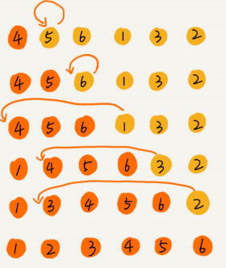
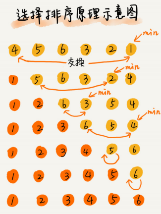

> - [字节跳动C++/Qt PC客户端面试题精选 - 知乎](https://zhuanlan.zhihu.com/p/531139706)
> - 

# 一、C++ 知识点

## 1、基础语法

### 宏定义和内联函数

在宏中进行字符串拼接和参数替换可以通过预处理器的字符串化操作来完成。在C++中，可以使用`#define`宏定义和`##`预处理运算符来实现字符串拼接和参数替换。假设您想要将`xml_name##_node`中的`name`替换为其他标识符，可以这样操作：

```cpp
// 注意如果需要替换的在中间位置，使用两个 ## 将其包含
// 否则只在需要替换的单词的末尾加上 ##
// ## 一般在变量名定义的时候进行替换
// # 字符串替换一般在格式化输出或者打印信息的时候用到，写在代替换的单词的前面
// 比如需要替换 name -> root
// xml_##name##_node --> xml_root_node
// xml_name##_node --> xml_name_node 不会替换成功
// name##_node --> root_node 可以替换成功
// xml_#name_node -> xml_"root"_node
// valid: xml_##name =
// invalid: xml_##name## =
//   ;it will think xml_level will continue connect with `=`, obviously it is not!
cppCopy code#define REPLACE_NAME_WITH(node, new_name) xml_##node##_##new_name

// 使用宏进行替换
REPLACE_NAME_WITH(name, node); // 将name替换为node
```

在这个例子中，`REPLACE_NAME_WITH`宏将字符串 `xml_`、`node` 和 `new_name` 进行连接，产生 `xml_name_node`，其中`name`被替换为了 `node`。


###  存储格式

C++可执行程序的内存布局通常是从低地址到高地址排列的，下面是这些区域按地址排列的一般顺序：

1. **代码段**（低地址）：存放程序的机器代码，包括可执行指令。

2. **常量区**：存放常量数据，如字符串文字、全局 `const` 变量等。这部分数据通常是只读的。

3. **初始化数据段**：存放已初始化的全局和静态变量，这些变量在编译时已经赋予了初值。

4. **未初始化数据段（BSS段）**：存放未初始化的全局和静态变量，这些变量在程序启动时会被清零。

5. **堆区**：用于动态分配内存，堆的地址通常位于已初始化数据段和栈之间。

6. **栈区**：用于存放函数调用的局部变量、函数参数以及函数调用的上下文信息。栈是一种后进先出（LIFO）的数据结构。

7. **共享库区**：包含了在程序运行时加载的共享库（动态链接库或共享对象）。

这个顺序可能会因操作系统、编译器和架构的不同而有所变化，但通常在大多数情况下，这种顺序是一致的。需要注意的是，某些操作系统和体系结构可能对内存布局有一些特殊的要求和变化，因此具体情况可能会有所不同。

---

C++可执行程序在内存中通常分为以下几个区域（或段）：

1. **代码段（Code Segment）**：
   - 也称为文本段，存放程序的机器代码，即可执行指令。这是程序的指令部分，通常是只读的，因为程序在运行时不应该修改自身的代码。

2. **数据段（Data Segment）**：
   - 数据段分为两部分：
     - **初始化数据段**（Initialized Data Segment）：存放已初始化的全局和静态变量，这些变量在编译时已经赋予了初值。
     - **未初始化数据段**（Uninitialized Data Segment，也称为BSS段）：存放未初始化的全局和静态变量，这些变量在程序启动时会被清零。

3. **栈区（Stack）**：
   - 栈区用于存放函数调用的局部变量、函数参数以及函数调用的上下文信息。栈是一种后进先出（LIFO）的数据结构，用于跟踪函数的调用和返回。每个线程都有自己的栈。

4. **堆区（Heap）**：
   - 堆区用于动态分配内存，通常由程序员来手动分配和释放内存。在堆上分配的内存不受限制，它的生存期由程序员管理。C++中的 `new` 和 `delete`、C中的 `malloc` 和 `free` 用于在堆上分配和释放内存。

5. **常量区（Constant Segment）**：
   - 常量区存放常量数据，如字符串文字、全局 `const` 变量等。这部分数据通常是只读的。

6. **共享库区（Shared Library Segment）**：
   - 这个区域包含了在程序运行时加载的共享库（动态链接库或共享对象）。这些库中的代码和数据被映射到进程的内存空间中，以便多个程序可以共享这些库。

不同操作系统和架构可能会有略微不同的内存布局和区域命名，但通常会包括上述核心区域。程序的内存分布对于程序的执行和性能有重要影响，因此在编写和优化代码时需要了解这些区域的特性和使用方式。


### C++11 新语法

#### constexpr

> - [使用constexpr时遇到的小坑 - apocelipes - 博客园](https://www.cnblogs.com/apocelipes/p/14769971.html)

顶层 `const`，而非底层！


#### 智能指针

> - 


### 面向对象

> 参考链接：
>
> - C++ 加const能不能构成重载的几种情况：https://blog.csdn.net/qq_38408573/article/details/116061377
>
>   总结：主要看参数列表是不是影响到了，传入的参数


在面向对象编程中，"重载"、"重写"和"覆盖"是三个不同的概念，它们描述了不同的语言特性和编程行为：

1. **函数重载（Overloading）**：静态绑定的多态
   
   - **概念**：函数重载是指在**同一个类或命名空间**中定义多个具有**相同名称但不同参数列表**的函数。这些函数可以具有不同的参数数量或不同的参数类型。
   - **作用**：函数重载允许在同一个作用域内定义多个功能相似但参数不同的函数，以便根据不同的参数调用不同的函数版本。
   - **示例**：
     ```cpp
     int add(int a, int b) { return a + b; }
     double add(double a, double b) { return a + b; }
     ```
     
   - **注意**：函数名相同，参数列表一定不同！（类型/顺序/个数）
   
2. **函数重写（Overriding）**：
   
   - **概念**：函数重写是指在**派生类中重新实现（覆盖）了其基类中的虚函数**。它用于**实现运行时多态性**。
   - **作用**：通过函数重写，派生类可以提供自己的版本以替代基类中的虚函数，以实现特定的行为。这允许使用基类指针或引用来调用派生类的函数。
   - **示例**：
     ```cpp
     class Base {
     public:
         virtual void print() { std::cout << "Base class" << std::endl; }
     };
     
     class Derived : public Base {
     public:
         void print() override { std::cout << "Derived class" << std::endl; }
     };
     ```
     
   - **注意**：只针对虚函数，重写父类的虚函数，因此参数列表等必须一致！
   
3. **函数覆盖（Hiding）**：动态绑定的多态
   
   - **概念**：函数覆盖（有时称为"隐藏"）是指在**派生类中定义了与基类中的非虚函数具有相同名称的函数**。这不是多态性，因为它不涉及虚函数。
   - **作用**：函数覆盖会隐藏基类中的同名函数，导致在派生类中无法通过基类指针或引用调用基类的同名函数。
   - **示例**：
     
     ```cpp
     class Base {
     public:
         void print() { std::cout << "Base class" << std::endl; }
     };
     
     class Derived : public Base {
     public:
         void print() { std::cout << "Derived class" << std::endl; }
     };
     ```
     
   - **注意**：只关心函数名，不关心函数的参数！

总结：
- "重载"指的是在同一作用域内定义多个函数，具有相同名称但不同的参数。
- "重写"指的是在派生类中重新实现（覆盖）了基类中的虚函数，实现多态性。
- "覆盖"指的是在派生类中定义了与基类中的非虚函数具有相同名称的函数，隐藏基类同名函数。这不是多态性的一种形式。

这些概念在面向对象编程中非常重要，可以让你更好地组织和扩展代码。


> 虚函数实现动态多态的过程中，子类重写父类的虚函数时是否需要添加 `virtual` 关键字？
>
> 如何查看虚函数表？

Linux 系统下，

```bash
## gcc 8.x 之前使用 -fdump-class-hierarchy
g++ -fdump-lang-class gram.cpp
```


## 2、STL

### vector

> - [ C++ STL容器如何解决线程安全的问题？ - 知乎](https://www.zhihu.com/question/29987589)，包括了 resize & reserve 的区别
> - [从vector扩容看STL空间分配器的本质-腾讯云开发者社区-腾讯云](https://cloud.tencent.com/developer/article/1906197)
> - [C++ vector（STL vector）底层实现机制（通俗易懂）](https://c.biancheng.net/view/6901.html)

vector 的扩容机制和编译器有关，MSVC 的增长策略是 原始 $1.5\times{capacity}$ 向下取整，gcc 是 $2\times{capacity}$，


## 3、标准库


## 4、Linux 网络编程

> - 简单的网络编程示例：https://zhuanlan.zhihu.com/p/119085959

### （1）进程间通信

1. **管道/匿名管道(Pipes)**：用于具有亲缘关系的父子进程间或者兄弟进程之间的通信。
2. **有名管道(Named Pipes)** : 匿名管道由于没有名字，只能用于亲缘关系的进程间通信。为了克服这个缺点，提出了有名管道。有名管道严格遵循 **先进先出(First In First Out)** 。有名管道以磁盘文件的方式存在，可以实现本机任意两个进程通信。
3. **信号(Signal)**：信号是一种比较复杂的通信方式，用于通知接收进程某个事件已经发生；
4. **消息队列(Message Queuing)**：消息队列是消息的链表,具有特定的格式,存放在内存中并由消息队列标识符标识。管道和消息队列的通信数据都是先进先出的原则。与管道（无名管道：只存在于内存中的文件；命名管道：存在于实际的磁盘介质或者文件系统）不同的是消息队列存放在内核中，只有在内核重启(即，操作系统重启)或者显式地删除一个消息队列时，该消息队列才会被真正的删除。消息队列可以实现消息的随机查询,消息不一定要以先进先出的次序读取,也可以按消息的类型读取.比 FIFO 更有优势。**消息队列克服了信号承载信息量少，管道只能承载无格式字节流以及缓冲区大小受限等缺点。**
5. **信号量(Semaphores)**：信号量是一个计数器，用于多进程对共享数据的访问，信号量的意图在于进程间同步。这种通信方式主要用于解决与同步相关的问题并避免竞争条件。
6. **共享内存(Shared memory)**：使得多个进程可以访问同一块内存空间，不同进程可以及时看到对方进程中对共享内存中数据的更新。这种方式需要依靠某种同步操作，如互斥锁和信号量等。可以说这是最有用的进程间通信方式。
7. **套接字(Sockets)** : 此方法主要用于在客户端和服务器之间通过网络进行通信。套接字是支持 TCP/IP 的网络通信的基本操作单元，可以看做是不同主机之间的进程进行双向通信的端点，简单的说就是通信的两方的一种约定，用套接字中的相关函数来完成通信过程。


### （2）线程间通信

线程间的同步的方式有哪些？

线程同步是两个或多个共享关键资源的线程的并发执行。应该同步线程以避免关键的资源使用冲突。

下面是几种常见的线程同步的方式：

1. **互斥锁(Mutex)**：采用互斥对象机制，只有拥有互斥对象的线程才有访问公共资源的权限。因为互斥对象只有一个，所以可以保证公共资源不会被多个线程同时访问。比如 Java 中的 `synchronized` 关键词和各种 `Lock` 都是这种机制。
2. **读写锁（Read-Write Lock）**：允许多个线程同时读取共享资源，但只有一个线程可以对共享资源进行写操作。
3. **信号量(Semaphore)**：它允许同一时刻多个线程访问同一资源，但是需要控制同一时刻访问此资源的最大线程数量。
4. **屏障（Barrier）**：屏障是一种同步原语，用于等待多个线程到达某个点再一起继续执行。当一个线程到达屏障时，它会停止执行并等待其他线程到达屏障，直到所有线程都到达屏障后，它们才会一起继续执行。比如 Java 中的 `CyclicBarrier` 是这种机制。
5. **事件(Event)** Wait/Notify：通过通知操作的方式来保持多线程同步，还可以方便的实现多线程优先级的比较操作。


线程间通信是多线程编程中的关键问题，不同的线程间通信方式适用于不同的场景和需求。以下是常见的线程间通信方式：

1. **共享内存：**

多个线程可以访问同一块内存区域，通过共享内存进行通信。但需要注意的是，由于并发访问可能导致数据竞争，通常需要使用互斥锁（Mutex）或信号量（Semaphore）等同步机制来保护共享数据的访问。

2. **消息队列（Message Queue）：**

线程间通过消息队列发送和接收消息。一个线程可以将消息放入队列，而另一个线程则可以从队列中获取消息。消息队列通常用于实现生产者-消费者模型。

3. **信号量（Semaphore）：**

信号量是一个计数器，用于控制同时访问共享资源的线程数量。线程在访问共享资源之前需要获取信号量，如果信号量的值大于0，则线程可以继续执行，同时将信号量的值减1；如果信号量的值为0，则线程等待，直到其他线程释放资源并增加信号量的值。

4. **互斥锁（Mutex）：**

互斥锁是一种同步机制，用于保护共享资源的访问。只有拥有互斥锁的线程才能访问被保护的资源。其他线程必须等待，直到互斥锁被释放。

5. **条件变量（Condition Variables）：**

条件变量用于在线程之间发送信号，以通知其他线程某个条件的变化。一个线程可以等待条件变量的信号，而另一个线程则可以在满足某个条件时发送信号。通常和互斥锁一起使用，以确保线程安全。

6. **屏障（Barrier）：**

屏障用于在多个线程之间创建同步点，确保所有线程在该点之前都达到了某个状态。当所有线程都到达屏障点时，它们会继续执行；如果有线程没有到达，所有线程将等待，直到所有线程都到达为止。

7. **管道（Pipe）：**

管道是一种进程间通信的方式，在Linux系统中也可以用于线程间通信。线程可以通过管道发送数据，并由另一个线程接收。管道通常用于单向通信，有时候也会使用无名管道（Anonymous Pipe）实现双向通信。

8. **条件变量和互斥锁的组合：**

在一些复杂的线程间通信场景中，条件变量和互斥锁可以结合使用，以实现更灵活的线程同步和通信。

选择合适的线程间通信方式取决于具体的应用场景和需求。不同的方式具有不同的特性和适用性，需要根据线程之间的关系和数据交互模式来进行选择。


### （3）进程的调度算法有哪些？

这是一个很重要的知识点！为了确定首先执行哪个进程以及最后执行哪个进程以实现最大 CPU 利用率，计算机科学家已经定义了一些算法，它们是：

- **先到先服务调度算法(FCFS，First Come, First Served)** : 从就绪队列中选择一个最先进入该队列的进程为之分配资源，使它立即执行并一直执行到完成或发生某事件而被阻塞放弃占用 CPU 时再重新调度。
- **短作业优先的调度算法(SJF，Shortest Job First)** : 从就绪队列中选出一个估计运行时间最短的进程为之分配资源，使它立即执行并一直执行到完成或发生某事件而被阻塞放弃占用 CPU 时再重新调度。
- **时间片轮转调度算法（RR，Round-Robin）** : 时间片轮转调度是一种最古老，最简单，最公平且使用最广的算法。每个进程被分配一个时间段，称作它的时间片，即该进程允许运行的时间。
- **多级反馈队列调度算法（MFQ，Multi-level Feedback Queue）**：前面介绍的几种进程调度的算法都有一定的局限性。如**短进程优先的调度算法，仅照顾了短进程而忽略了长进程** 。多级反馈队列调度算法既能使高优先级的作业得到响应又能使短作业（进程）迅速完成。，因而它是目前**被公认的一种较好的进程调度算法**，UNIX 操作系统采取的便是这种调度算法。
- **优先级调度算法（Priority）**：为每个流程分配优先级，首先执行具有最高优先级的进程，依此类推。具有相同优先级的进程以 FCFS 方式执行。可以根据内存要求，时间要求或任何其他资源要求来确定优先级


### （4）页面置换算法

1. **最佳页面置换算法（OPT，Optimal）**：优先选择淘汰的页面是以后永不使用的，或者是在最长时间内不再被访问的页面，这样可以保证获得最低的缺页率。但由于人们目前无法预知进程在内存下的若干页面中哪个是未来最长时间内不再被访问的，因而该算法无法实现，只是理论最优的页面置换算法，可以作为衡量其他置换算法优劣的标准。
2. **先进先出页面置换算法（FIFO，First In First Out）** : 最简单的一种页面置换算法，总是淘汰最先进入内存的页面，即选择在内存中驻留时间最久的页面进行淘汰。该算法易于实现和理解，一般只需要通过一个 FIFO 队列即可需求。不过，它的性能并不是很好。
3. **最近最久未使用页面置换算法（LRU ，Least Recently Used）**：LRU 算法赋予每个页面一个访问字段，用来记录一个页面自上次被访问以来所经历的时间 T，当须淘汰一个页面时，选择现有页面中其 T 值最大的，即最近最久未使用的页面予以淘汰。LRU 算法是根据各页之前的访问情况来实现，因此是易于实现的。OPT 算法是根据各页未来的访问情况来实现，因此是不可实现的。
4. **最少使用页面置换算法（LFU，Least Frequently Used）** : 和 LRU 算法比较像，不过该置换算法选择的是之前一段时间内使用最少的页面作为淘汰页。
5. **时钟页面置换算法（Clock）**：可以认为是一种最近未使用算法，即逐出的页面都是最近没有使用的那个。


### （5）常见的磁盘调度算法有哪些？

磁盘调度算法是操作系统中对磁盘访问请求进行排序和调度的算法，其目的是提高磁盘的访问效率。

一次磁盘读写操作的时间由磁盘寻道/寻找时间、延迟时间和传输时间决定。磁盘调度算法可以通过改变到达磁盘请求的处理顺序，减少磁盘寻道时间和延迟时间。

常见的磁盘调度算法有下面这 6 种（其他还有很多磁盘调度算法都是基于这些算法改进得来的）：

1. **先来先服务算法（First-Come First-Served，FCFS）**：按照请求到达磁盘调度器的顺序进行处理，先到达的请求的先被服务。FCFS 算法实现起来比较简单，不存在算法开销。不过，由于没有考虑磁头移动的路径和方向，平均寻道时间较长。同时，该算法容易出现饥饿问题，即一些后到的磁盘请求可能需要等待很长时间才能得到服务。
2. **最短寻道时间优先算法（Shortest Seek Time First，SSTF）**：也被称为最佳服务优先（Shortest Service Time First，SSTF）算法，优先选择距离当前磁头位置最近的请求进行服务。SSTF 算法能够最小化磁头的寻道时间，但容易出现饥饿问题，即磁头附近的请求不断被服务，远离磁头的请求长时间得不到响应。实际应用中，需要优化一下该算法的实现，避免出现饥饿问题。
3. **扫描算法（SCAN）**：也被称为电梯（Elevator）算法，基本思想和电梯非常类似。磁头沿着一个方向扫描磁盘，如果经过的磁道有请求就处理，直到到达磁盘的边界，然后改变移动方向，依此往复。SCAN 算法能够保证所有的请求得到服务，解决了饥饿问题。但是，如果磁头从一个方向刚扫描完，请求才到的话。这个请求就需要等到磁头从相反方向过来之后才能得到处理。
4. **循环扫描算法（Circular Scan，C-SCAN）**：SCAN 算法的变体，只在磁盘的一侧进行扫描，并且只按照一个方向扫描，直到到达磁盘边界，然后回到磁盘起点，重新开始循环。
5. **边扫描边观察算法（LOOK）**：SCAN 算法中磁头到了磁盘的边界才改变移动方向，这样可能会做很多无用功，因为磁头移动方向上可能已经没有请求需要处理了。LOOK 算法对 SCAN 算法进行了改进，如果磁头移动方向上已经没有别的请求，就可以立即改变磁头移动方向，依此往复。也就是边扫描边观察指定方向上还有无请求，因此叫 LOOK。
6. **均衡循环扫描算法（C-LOOK）**：C-SCAN 只有到达磁盘边界时才能改变磁头移动方向，并且磁头返回时也需要返回到磁盘起点，这样可能会做很多无用功。C-LOOK 算法对 C-SCAN 算法进行了改进，如果磁头移动的方向上已经没有磁道访问请求了，就可以立即让磁头返回，并且磁头只需要返回到有磁道访问请求的位置即可。


### （6）产生死锁的四个必要条件

1. **互斥**：资源必须处于非共享模式，即一次只有一个进程可以使用。如果另一进程申请该资源，那么必须等待直到该资源被释放为止。
2. **占有并等待**：一个进程至少应该占有一个资源，并等待另一资源，而该资源被其他进程所占有。
3. **非抢占**：资源不能被抢占。只能在持有资源的进程完成任务后，该资源才会被释放。
4. **循环等待**：有一组等待进程 `{P0, P1,..., Pn}`， `P0` 等待的资源被 `P1` 占有，`P1` 等待的资源被 `P2` 占有，……，`Pn-1` 等待的资源被 `Pn` 占有，`Pn` 等待的资源被 `P0` 占有。


解决方法：

解决死锁的方法可以从多个角度去分析，一般的情况下，有**预防，避免，检测和解除四种**。

- **预防** 是采用某种策略，**限制并发进程对资源的请求**，从而使得死锁的必要条件在系统执行的任何时间上都不满足。
- **避免**则是系统在分配资源时，根据资源的使用情况**提前做出预测**，从而**避免死锁的发生**
- **检测**是指系统设有**专门的机构**，当死锁发生时，该机构能够检测死锁的发生，并精确地确定与死锁有关的进程和资源。
- **解除** 是与检测相配套的一种措施，用于**将进程从死锁状态下解脱出来**。


### （7）常见的内存管理方式有哪些？

内存管理方式可以简单分为下面两种：

- **连续内存管理**：为一个用户程序分配一个连续的内存空间，内存利用率一般不高。
- **非连续内存管理**：允许一个程序使用的内存分布在离散或者说不相邻的内存中，相对更加灵活一些。

#### 非连续内存管理

非连续内存管理存在下面 3 种方式：

- **段式管理**：以段(—段连续的物理内存)的形式管理/分配物理内存。应用程序的虚拟地址空间被分为大小不等的段，段是有实际意义的，每个段定义了一组逻辑信息，例如有主程序段 MAIN、子程序段 X、数据段 D 及栈段 S 等。
- **页式管理**：把物理内存分为连续等长的物理页，应用程序的虚拟地址空间也被划分为连续等长的虚拟页，是现代操作系统广泛使用的一种内存管理方式。
- **段页式管理机制**：结合了段式管理和页式管理的一种内存管理机制，把物理内存先分成若干段，每个段又继续分成若干大小相等的页。


总结来说，虚拟内存主要提供了下面这些能力：

- **隔离进程**：物理内存通过虚拟地址空间访问，虚拟地址空间与进程一一对应。每个进程都认为自己拥有了整个物理内存，进程之间彼此隔离，一个进程中的代码无法更改正在由另一进程或操作系统使用的物理内存。
- **提升物理内存利用率**：有了虚拟地址空间后，操作系统只需要将进程当前正在使用的部分数据或指令加载入物理内存。
- **简化内存管理**：进程都有一个一致且私有的虚拟地址空间，程序员不用和真正的物理内存打交道，而是借助虚拟地址空间访问物理内存，从而简化了内存管理。
- **多个进程共享物理内存**：进程在运行过程中，会加载许多操作系统的动态库。这些库对于每个进程而言都是公用的，它们在内存中实际只会加载一份，这部分称为共享内存。
- **提高内存使用安全性**：控制进程对物理内存的访问，隔离不同进程的访问权限，提高系统的安全性。
- **提供更大的可使用内存空间**：可以让程序拥有超过系统物理内存大小的可用内存空间。这是因为当物理内存不够用时，可以利用磁盘充当，将物理内存页（通常大小为 4 KB）保存到磁盘文件（会影响读写速度），数据或代码页会根据需要在物理内存与磁盘之间移动。


### 分段机制

> - https://www.cnblogs.com/guoxiaoyu/p/17653050.html

**分段机制（Segmentation）** 以段(—段 **连续** 的物理内存)的形式管理/分配物理内存。应用程序的虚拟地址空间被分为大小不等的段，段是有实际意义的，每个段定义了一组逻辑信息，例如有主程序段 MAIN、子程序段 X、数据段 D 及栈段 S 等。

#### 段表有什么用？地址翻译过程是怎样的？

分段管理通过 **段表（Segment Table）** 映射虚拟地址和物理地址。

分段机制下的虚拟地址由两部分组成：

- **段号**：标识着该虚拟地址属于整个虚拟地址空间中的哪一个段。
- **段内偏移量**：相对于该段起始地址的偏移量。

具体的地址翻译过程如下：

1. MMU 首先解析得到虚拟地址中的段号；
2. 通过段号去该应用程序的段表中取出对应的段信息（找到对应的段表项）；
3. 从段信息中取出该段的起始地址（物理地址）加上虚拟地址中的段内偏移量得到最终的物理地址。


### 分页机制

**分页机制（Paging）** 把主存（物理内存）分为连续等长的物理页，应用程序的虚拟地址空间划也被分为连续等长的虚拟页。现代操作系统广泛采用分页机制。

**注意：这里的页是连续等长的，不同于分段机制下不同长度的段。**

在分页机制下，应用程序虚拟地址空间中的任意虚拟页可以被映射到物理内存中的任意物理页上，因此可以实现物理内存资源的离散分配。分页机制按照固定页大小分配物理内存，使得物理内存资源易于管理，可有效避免分段机制中外部内存碎片的问题。


在分页机制下，每个应用程序都会有一个对应的页表。

分页机制下的虚拟地址由两部分组成：

- **页号**：通过虚拟页号可以从页表中取出对应的物理页号；
- **页内偏移量**：物理页起始地址+页内偏移量=物理内存地址。

具体的地址翻译过程如下：

1. MMU 首先解析得到虚拟地址中的虚拟页号；
2. 通过虚拟页号去该应用程序的页表中取出对应的物理页号（找到对应的页表项）；
3. 用该物理页号对应的物理页起始地址（物理地址）加上虚拟地址中的页内偏移量得到最终的物理地址。


### 分页机制和分段机制有哪些共同点和区别？

**共同点**：

- 都是非连续内存管理的方式。
- 都采用了地址映射的方法，将虚拟地址映射到物理地址，以实现对内存的管理和保护。

**区别**：

- 分页机制以页面为单位进行内存管理，而分段机制以段为单位进行内存管理。页的大小是固定的，由操作系统决定，通常为 2 的幂次方。而段的大小不固定，取决于我们当前运行的程序。
- 页是物理单位，即操作系统将物理内存划分成固定大小的页面，每个页面的大小通常是 2 的幂次方，例如 4KB、8KB 等等。而段则是逻辑单位，是为了满足程序对内存空间的逻辑需求而设计的，通常根据程序中数据和代码的逻辑结构来划分。
- 分段机制容易出现外部内存碎片，即在段与段之间留下碎片空间(不足以映射给虚拟地址空间中的段)。分页机制解决了外部内存碎片的问题，但仍然可能会出现内部内存碎片。
- 分页机制采用了页表来完成虚拟地址到物理地址的映射，页表通过一级页表和二级页表来实现多级映射；而分段机制则采用了段表来完成虚拟地址到物理地址的映射，每个段表项中记录了该段的起始地址和长度信息。
- 分页机制对程序没有任何要求，程序只需要按照虚拟地址进行访问即可；而分段机制需要程序员将程序分为多个段，并且显式地使用段寄存器来访问不同的段。


### 进程间通信

**（1）本机进程间通信**

- 管道

  - 有名管道 `mkfifo`
  - 无名管道

- `mmap`

- 文件

- 信号：信号（Signal）和信号量（Semaphore）是两个不同的概念，用于处理多进程或多线程之间的同步和通信，它们在操作系统和并发编程中扮演不同的角色。

  1. **信号（Signal）**：

     - **用途**：信号是一种进程间通信机制，用于通知一个进程某个事件已经发生。这个事件可以是来自其他进程的信号，也可以是由操作系统或进程自身触发的异常事件，如除零错误、段错误等。
     - **性质**：信号是一种异步事件，进程可以在任何时候接收到信号。信号处理函数用于捕获和处理信号，通常用于异常处理和进程间通信。
     - **例子**：常见的信号包括`SIGINT`（用户中断进程）、`SIGTERM`（正常终止进程）、`SIGSEGV`（段错误）等。

  2. **信号量（Semaphore）**：

     - **用途**：信号量是一种同步机制，用于控制多个进程或线程对共享资源的访问，以防止竞态条件和互斥访问。
     - **性质**：信号量是一个整数计数器，支持两种基本操作：增加（通常称为`sem_post`或`V`操作）和减少（通常称为`sem_wait`或`P`操作）。当信号量减少到零时，等待的进程会被阻塞。
     - **例子**：信号量常用于解决生产者-消费者问题、线程池管理等多线程或多进程环境下的同步问题。

  总结来说，信号是一种用于通知进程事件发生的机制，而信号量是一种用于协调多个进程或线程对共享资源访问的机制。它们在并发编程中起着不同的作用，因此选择使用哪种机制取决于具体的需求和问题。

- 消息队列

- 共享内存


**（2）不同主机间进程通信**

- `socket` 双工


### TCP/IP 协议

> 心跳包

- 设置 TCP 的保持连接
- 每隔一段固定的时间，发送探测分节数据，如果连续发送多个探测分节对方没有回应 `ACK`，将这个连接断开。


具体实现方式，

```c
// man setsockopt
int keepAlive = 1;
setsockopt(listenfd, SOL_SOCKET, SO_KEEPALIVE, (void *)&keepAlive, sizeof(keepAlive));
```

注意：

- 心跳包：携带最小粒度的数据；
- 乒乓包：携带较多数据的心跳包。


> `TCP` 端口复用

具体实现和 心跳包 类似，都是通过参数指定的方法，在 `SOL_SOCKET` 的属性中进行设置，

```c
int opt = 1;
setsockopt(listenfd, SOL_SOCKET, SO_REUSEADDR, &opt, sizeof(opt));
```

注意：程序中设置某个端口重新使用，在这之前的其他使用该端口的网络程序将不能使用该端口。即虽然是重用，但是无法同时给多个程序使用！

因此，端口复用常用在同一个网络程序中，且在 `bind()` 之前设置！


### 高并发服务器

常用的实现方法，

- 阻塞等待：有限制的多进程/多线程

  - 消耗资源，资源利用不够，白白占用有用的资源，等待

- 非阻塞忙轮询

  - 很消耗 CPU

- 多路 IO（读/写缓冲区） 转接/复用

  - 思想：不再由**应用程序**自己监听客户端连接，由**内核**监听 文件描述符属性（读写缓冲区） 是否发生变化，基于事件

  - 读缓冲区变化，可读，内核将事件通知给应用层
  - 实现方式：select/poll/epoll

*注意：不能使用普通的多线程/多进程：线程在 栈 中，进程消耗堆的空间，但是内存是有限的，无法应对成千上万的连接！*


#### select

Windows 使用较多，跨平台

*优点：*

- 通用性：跨平台

*缺点：*

- 数量：文件描述符 1024 限制，该限制通过内核源码的宏 `FD_SETSIZE` 限定，如果需要修改，需要重新对内核源码进行编译！
- 返回值：**只返回变化的文件描述符的数量**，具体是哪些发生变化，需要通过循环遍历确定，降低效率
- 实现方式：每次都需要将需要监听的文件描述符集合从应用层拷贝一份到内核
- 大量并发，少量活跃，select 效率很低


#### poll：和 select 类似，使用较少

*优点：*

- 没有文件描述符 1024 的限制
- 请求和返回分离

*缺点：和 select 一样*

- 每一次都需要将需要监听的文件描述符从应用层拷贝到内核；
- 每次都需要将数组中的元素遍历才能知道哪些文件描述符发生了变化；
- 大量并发，少量活跃的情况非常低效


#### epoll：重点

- kqueue：macos 闭源


## 5、多线程

> - C++ 多线程编程：https://zhuanlan.zhihu.com/p/613630658


## 6、相关工具

### gcc 编译

> gcc 的基本使用：
>
> - http://c.biancheng.net/view/8053.html


### gdb 调试


### git 使用


### Makefile


# 二、计算机基础理论


## 1、计算机网络


## 2、操作系统


### IO 复用技术


#### mmap


## 3、数据库

> 数据库中的 B/B+ 树实现原理：
>
> - https://www.jianshu.com/p/92d15df75027
>
> - https://blog.csdn.net/a519640026/article/details/106940115


## 4、数据结构和算法

### 十大经典排序算法

#### 1、冒泡排序（没问题）


算法思想：每一轮将剩余中最大的元素移动到最高处。

因此，区间范围变化应该是从右往左，左边始终从 0 开始，右边每遍历一次就进行区间压缩。

- 两层循环，`ia & ib` 遍历的起始位置相同
- 先写 if 中的判断条件，然后根据判断条件写出第二层 for 循环的结束条件；结束条件始终为 `len - a [+1/-1]`

判定条件，

```c++
if b > b + 1	对应		a = 0 & b = 0 & b < len - a - 1
    
【注意】这里遍历的起始位置从 1 开始
if b < b - 1	对应		a = 1 & b = 1 & b < len - a + 1
```


算法实现，

> `if b > b + 1;  a = 0 & b = 0 & b < len - a - 1` 版本

```C++
void bubbleSort(std::vector<int> &nums) {
    int len = nums.size();
    
    for (int a = 0; a < len; a++) {
        // 注意第二层循环的终止条件，根据判断条件进行设置
        // 如果是用 b & b+1 进行判断，终止条件为：n - a - 1
        for (int b = 0; b < len - a - 1; b++) {
            if (nums[b + 1] < nums[b]) {
                // 这里使用第二层循环对数组进行判断
                swap(nums[b], nums[b + 1]);
            }
        }
    }
}
```

> `if b < b - 1;  a = 1 & b = 1 & b < len - a - 1` 版本版本

```c++
void bubbleSort(std::vector<int> &nums) {
    int len = nums.size();
    
    for (int a = 1; a < len; a++) {
        // 注意第二层循环的终止条件，根据判断条件进行设置
        // 如果是用 b & b+1 进行判断，终止条件为：n - a - 1
        for (int b = 1; b < len - a + 1; b++) {
            if (nums[b] < nums[b - 1]) {
                // 这里使用第二层循环对数组进行判断
                swap(nums[b], nums[b - 1]);
            }
        }
    }
}
```


使用标记变量优化，

```c++
void bubbleSort(std::vector<int> &nums, int len) {
    for (int a = 0, bool swaped = false; a < len; a++) {
        for (int b = 0; b < len - a - 1; b++) {
            if (nums[b + 1] < nums[b]) {
                swap(nums[b], nums[b + 1]);
                swaped = true;
            }
        }
        
        if (!swaped) {
            break;
        }
    }
}
```


#### 2、插入排序（没问题）



和冒泡类似，但是只有一次交换操作，主要作用在下标上

区别在于：

- 插入排序：左边有序，新加入的元素放入到左边正确的位置上；有序区间增长方向：左 -> 右
- 冒泡排序：右边有序，新加入的元素放入到右边有序的位置上；有序区间增长方向：右 -> 左

```cpp
void insertSort(std::vector<int> &num, int len) {
    for (int a = 0; a < n; a++) {
        for (int b = a; b > 0 && nums[b] < nums[b - 1]; b--) {
            std::swap(nums[b], nums[b - 1]);
        }
    }
}
```


#### 3、选择排序



内层循环找到每次区间内的 index，外层循环负责交换元素的值。

```cpp
/**
 * 3. 选择排序：核心是记录 index
 */
void SelectSort(vector<int> &nums, int n) {
    if (n <= 1) {
        return;
    }

    int mid = 0;
    for (int i = 0; i < n; i++) {
        mid = i;
        for (int j = i + 1; j < n; j++) {
            if (nums[j] < nums[mid]) {
                mid = j;
            }
        }
        swap(nums[mid], nums[i]);
    }
}
```


#### 4、快速排序

思想：更好的冒泡排序，只是每次比较交换并不是相邻元素，而是可以跳过多个位置。

复杂度：

- 时间复杂度：最坏情况下退化为冒泡排序 `O(n^2)`，平均时间复杂度 `O(nlog(n))`
- 空间复杂度：`O(1)`，没有使用额外的空间，只是进行简单的交换操作

实现方法，

- 采用递归，分治的策略，每次递归从 `pivotIndex` 为界限，划分为两组进行操作

C++ 代码，

```cpp
#include <iostream>
#include <vector>


/**
 * 找到枢纽元素 pivot 的正确位置索引，总是设置 arr[bound_l] 为枢纽元素
 * @param arr 待排序的数组
 * @param bound_l 数组的左边界
 * @param bound_r 数组的右边界
 * @return 对 arr 的划分的枢纽元素所在的正确位置，为下一次 arr 的划分提供支持
 */
int partiton(std::vector<int> &arr, int bound_l, int bound_r) {
    int pivot = arr[bound_l];
    int left = bound_l + 1;
    int right = bound_r;
    
    while (left <= right) {
        // 左 -> 右，找到第一个比 pivot 大的数的位置
        while (left <= right && arr[left] <= pivot) {
            ++left;
        }
        // 右 -> 左，找到第一个比 pivot 小的数的位置
        while (left <= right && arr[right] >= pivot) {
            --right;
        }
        if (left <= right) {
            std::swap(arr[left], arr[right]);
        }
    }
    // 这里只能是 right
    std::swap(arr[right], pivot);
    
    return right;
}


/**
 * 分治策略实现
 * 先找到枢纽元素所在的正确位置，然后根据其位置将 arr 划分为两个数组，分别对这两个数组实施 快排操作
 * @return 无返回值
*/
void quickSort(std::vector<int> &arr, int bound_l, int bound_r) {
    if (bound_l < bound_right) {
        int pivotIndex = partition(arr, bound_l, bound_r);
        quickSort(arr, bound_l, pivotIndex - 1);
        quickSort(arr, pivotIndex + 1, bound_r);
    }
}


int main(int argc, char const *argv[]) {
    std::vector<int> arr = {2, 6, 1, 3, 8, 9, 0, 5, 7, 4, 1};

    quickSort(arr, 0, arr.size() - 1);

    for (int num : arr) {
        std::cout << num << " ";
    }
    std::cout << std::endl;

    return 0;
}

```


#### 5、归并排序


#### 6、堆排序


#### 7、桶排序


#### 8、计数排序


#### 9、基数排序


#### 10、希尔排序


# 三、C++ 项目


## WebServer


### HttpServer


### TCPServer


## C++17 JSON 解析器

1. 你能详细解释一下你是如何使用`std::variant`来管理JSON数据类型的吗？
2. 你提到使用`std::string_view`进行代理模式以明确只读语义，能否给出一个具体的例子说明这个设计？
3. 你是如何使用`std::optional`来处理非侵入式异常的？在解析JSON时遇到了哪些可能的异常情况？
4. 你能详细描述一下你的递归下降解析器的工作原理吗？例如，它是如何处理嵌套的JSON对象和数组的？
5. 在解析后支持动态修改JSON数据，这个过程是如何实现的？修改后如何保证重新输出的JSON格式仍然正确？
6. 你能给出一个使用你的JSON解析器的示例代码吗？例如，解析一个JSON字符串，修改一些值，然后重新输出JSON。
7. 在这个项目中，你遇到了哪些挑战？你是如何克服这些挑战的？
8. 这个项目有哪些可能的改进空间或者未来的扩展计划？


> 假设面试者精通C++，在这样的背景下，对以上问题进行回答

假设面试者精通C++，他可能会这样回答：

1. 我使用`std::variant`来管理JSON数据类型，因为它是一个类型安全的联合体，可以存储多种类型的数据。在我的JSON解析器中，我定义了一个`std::variant`，它可以存储`null`、`bool`、`double`、`std::string`、`std::vector<Json>`和`std::map<std::string, Json>`类型的数据，这些类型分别对应JSON的null、布尔值、数字、字符串、数组和对象。

2. 我使用`std::string_view`来实现代理模式，因为它可以提供对原始字符串的只读视图，而不需要复制字符串。在解析JSON字符串时，我使用`std::string_view`来跟踪当前的解析位置，并逐步移动它来解析更多的数据。

3. 我使用`std::optional`来处理非侵入式异常，因为它可以表示一个可能不存在的值。在解析JSON字符串时，如果遇到了语法错误，我会返回一个空的`std::optional`，而不是抛出异常。这样做可以让调用者有机会处理错误，而不需要使用异常处理机制。

4. 我的递归下降解析器首先会查看当前的字符，然后根据字符的类型调用相应的解析函数。例如，如果当前字符是'{'，那么解析器就会调用解析对象的函数。这个函数会递归地解析对象中的每个键值对，并将它们添加到一个`std::map<std::string, Json>`中。

5. 在解析后支持动态修改JSON数据是通过提供一系列的接口函数实现的。例如，我提供了一个函数来获取和设置JSON对象中的键值对。修改后的JSON数据可以通过调用序列化函数重新输出为JSON格式。

6. 使用我的JSON解析器的示例代码如下：

```cpp
#include "json.h"
#include <iostream>

int main() {
    // 解析一个JSON字符串
    std::optional<Json> json = Json::parse(R"({"name": "John", "age": 30})");
    if (json) {
        // 修改键值对
        (*json)["name"] = "Jane";
        (*json)["age"] = 25;

        // 重新输出为JSON格式
        std::cout << json->serialize() << std::endl;
    }

    return 0;
}
```

7. 在这个项目中，我遇到了一些挑战。例如，在处理大型和复杂的JSON数据时，递归下降解析器可能会消耗大量的栈空间。为了解决这个问题，我优化了我的解析器，使其在可能的情况下使用迭代而不是递归。

8. 这个项目有一些可能的改进空间。例如，我可以添加更多的接口函数来方便用户操作JSON数据。我也可以优化我的序列化函数，使其生成更紧凑或更美观的JSON格式。此外，我还计划支持更多的JSON特性，如Unicode转义序列和科学记数法。


> 递归解析

递归下降分析法是**一种自顶向下的分析方法**，文法的每个非终结符对应一个递归过程（函数）。 分析过程就是从文法开始符出发执行一组递归过程（函数），这样向下推导直到推出句子；或者说从根节点出发，自顶向下为输入串寻找一个最左匹配序列，建立一棵语法树。


## 基于 C++11 的线程池


## TinySTL

> - https://github.com/Alinshans/MyTinySTL


# 四、其他


## 设计模式 C++ 实现

> - https://github.com/jaredtao/DesignPattern/tree/master
> - 设计模式讲解：https://subingwen.cn/design-patterns/


## 学习资源

> - https://space.bilibili.com/491401333
>   - https://www.bilibili.com/read/cv15375283
> - 