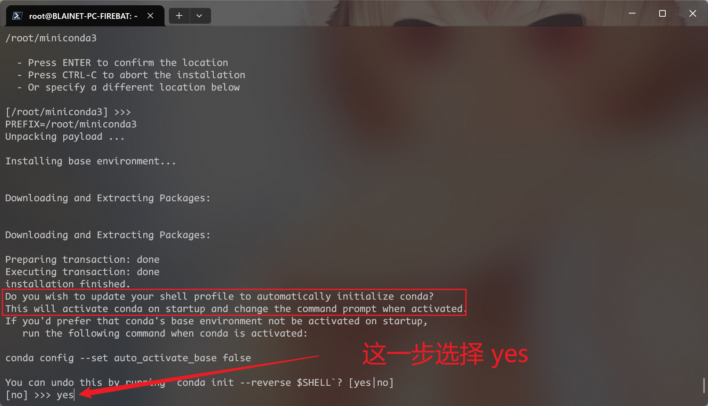

# 参考链接

前期调研，

- [智慧安防异常行为系列之毫秒级精准打架识别，PP-Human实现360度安全保障](https://www.paddlepaddle.org.cn/support/news?action=detail&id=3140)
- [PaddlePaddle/awesome-DeepLearning: 深度学习入门课、资深课、特色课、学术案例、产业实践案例、深度学习知识百科及面试题库The course, case and knowledge of Deep Learning and AI](https://github.com/paddlepaddle/awesome-DeepLearning)，百度深度学习资料
- [PaddlePaddle/PaddleVideo at ed245e9ce5eb32d27db8d8d2fef921e4f43e30e5](https://github.com/PaddlePaddle/PaddleVideo/tree/ed245e9ce5eb32d27db8d8d2fef921e4f43e30e5)，百度 PaddleVideo 开源项目
- [PaddleDetection/docs/advanced_tutorials/customization/action_recognotion/videobased_rec.md at release/2.5 · PaddlePaddle/PaddleDetection](https://github.com/PaddlePaddle/PaddleDetection/blob/release/2.5/docs/advanced_tutorials/customization/action_recognotion/videobased_rec.md)，百度对打架场景识别的相关工作
- [PaddleDetection/deploy/pipeline/docs/tutorials/pphuman_action.md at release/2.5 · PaddlePaddle/PaddleDetection](https://github.com/PaddlePaddle/PaddleDetection/blob/release/2.5/deploy/pipeline/docs/tutorials/pphuman_action.md)，百度对于异常行为识别的解决方案
- [【官方】Paddle2.1实现视频理解优化模型 -- PP-TSM - 知乎](https://zhuanlan.zhihu.com/p/463338935)
- [打架识别（AI+Python+PyQt5）（一）_打架检测数据集-CSDN博客](https://blog.csdn.net/opencv_yys/article/details/128609117)
- [RWF-2000 暴力行为检测视频数据集 - 知乎](https://zhuanlan.zhihu.com/p/105360879)
- [打架识别相关开源数据集资源汇总 - 知乎](https://zhuanlan.zhihu.com/p/633126711)


数据集相关，

- [视频动作分类数据增强方式 - 搜索](https://cn.bing.com/search?pglt=163&q=%E8%A7%86%E9%A2%91%E5%8A%A8%E4%BD%9C%E5%88%86%E7%B1%BB%E6%95%B0%E6%8D%AE%E5%A2%9E%E5%BC%BA%E6%96%B9%E5%BC%8F&cvid=e37b0cea9e3b47f483fc412f8a572a69&gs_lcrp=EgZjaHJvbWUyBggAEEUYOdIBCDk5MTBqMGoxqAIAsAIA&FORM=ANNTA1&adppc=EDGEESS&PC=EDGEESS)

- [sujiongming/UCF-101_video_classification: Classify UCF101 videos using one frame at a time with a CNN(InceptionV3)](https://github.com/sujiongming/UCF-101_video_classification/tree/master?tab=readme-ov-file)，UCF101数据集介绍
- [CRCV | Center for Research in Computer Vision at the University of Central Florida](https://www.crcv.ucf.edu/data/UCF101.php)，UCF101数据集官网
- [socia-lab.di.ubi.pt/EventDetection/](http://socia-lab.di.ubi.pt/EventDetection/)，UBI 数据集官网


算法相关，

- [mit-han-lab/temporal-shift-module at 2854869ef4947a510c5a3e5a864cf0463f5f8457](https://github.com/mit-han-lab/temporal-shift-module/tree/2854869ef4947a510c5a3e5a864cf0463f5f8457)，TSM 官方代码
- [视频动作分类网络《TSM: Temporal Shift Module for Efficient Video Understanding》学习笔记_tsm分类-CSDN博客](https://blog.csdn.net/weixin_42907473/article/details/102973294)
- [TSM模型训练新的数据集 - 搜索](https://cn.bing.com/search?pglt=163&q=TSM%E6%A8%A1%E5%9E%8B%E8%AE%AD%E7%BB%83%E6%96%B0%E7%9A%84%E6%95%B0%E6%8D%AE%E9%9B%86&cvid=09b9113fdb18480a8a30d897bce356a3&gs_lcrp=EgZjaHJvbWUyBggAEEUYOdIBCDk5ODBqMGoxqAIAsAIA&FORM=ANNTA1&adppc=EDGEESS&PC=EDGEESS&rdr=1&rdrig=D4731FD59EB54EE69409060E50093131)
- [Temporal Shift Module(TSM) 部署在自己电脑上并训练自己的数据集-CSDN博客](https://blog.csdn.net/Austin071031/article/details/125128733)
- [Temporal Shift Module (TSM)视频分类使用记录-CSDN博客](https://blog.csdn.net/qq_32464609/article/details/136209964)
- [视频理解TSM的训练与使用_tsm视频-CSDN博客](https://blog.csdn.net/Omtrix/article/details/120560186)

- [jayChung0302/videomix: Implementation of brand new video augmentation strategy for video action recognition with 3D CNN](https://github.com/jayChung0302/videomix)
- [行为识别TSM训练ucf101数据集_tsm mobilenetv2-CSDN博客](https://blog.csdn.net/qq_39056987/article/details/113740685)
- [ClassyVision/tutorials/video_classification.ipynb at main · facebookresearch/ClassyVision](https://github.com/facebookresearch/ClassyVision/blob/main/tutorials/video_classification.ipynb)，facebook 的一些教程，这个简单了解下即可
- [whwu95/Text4Vis: 【AAAI'2023 & IJCV】Transferring Vision-Language Models for Visual Recognition: A Classifier Perspective](https://github.com/whwu95/Text4Vis/tree/main?tab=readme-ov-file)，前沿的视频动作分类算法
- [2012.06567.pdf](https://arxiv.org/pdf/2012.06567.pdf)，视频分类算法综述
- [Activity Net](http://activity-net.org/)，行为识别权威网站
- [Temporal Action Localization | International Challenge on Activity Recognition 2021 (ActivityNet)](http://activity-net.org/challenges/2022/tasks/anet_localization.html)


# 基础环境搭建

## 在 Windows 主机下安装 WSL 2

打开 Windows Terminal，依次执行以下命令，

```bash
## 安装并更新 wsl
wsl --install
# update 才是安装
wsl --update

## 列出可安装的发行版本
# wsl --list --online
wsl -l -o

## 安装相应的发行版本
wsl --set-default-version 2
## 直接在应用商店下载也可以
wsl --install -d Ubuntu-20.04

## 更改默认的安装路径
wsl -l -v
wsl --shutdown

wsl --export Ubuntu-20.04 D:\Dev\workspace\WSL\Ubuntu-20.04.tar
# unregister 才是删除
wsl --unregister Ubuntu-20.04
wsl --import Ubuntu-20.04 D:\Dev\workspace\WSL\Ubuntu-20.04 D:\Dev\workspace\WSL\Ubuntu-20.04.tar --version 2

## 修改默认启动用户
ubuntu2004 config --default-user blainet

## 启动
wsl -d Ubuntu-20.04
```

如果出现无法访问的情况，修改 DNS，


### EEROR 解决

> - [WslRegisterDistribution failed with error: 0x80370102 · Issue #9656 · microsoft/WSL](https://github.com/microsoft/WSL/issues/9656)
> - [windows家庭版 安装 wsl 2失败，总结_please enable the virtual machine platform windows-CSDN博客](https://blog.csdn.net/BS0003/article/details/127677727)
> - [22.04 - Virtual Machine Platform Windows feature and virtualization in bios is enabled but getting error message - Ask Ubuntu](https://askubuntu.com/questions/1459065/virtual-machine-platform-windows-feature-and-virtualization-in-bios-is-enabled-b)

error message,

```
Please enable the Virtual Machine Platform Windows feature and ensure virtualization is enabled in the BIOS.
For information please visit https://aka.ms/wsl2-install
Press any key to continue...
```

在系统搜索栏中 搜索 “启用或关闭Windows功能”，打开后进行如下设置（如果设置已经和下图一致，但还是有上面的错误，执行后续命令），


重启电脑之后，以管理员身份运行 `cmd`，执行下面的命令，

```bash
bcdedit /set hypervisorlaunchtype Auto
```

重启电脑，然后检查是否可用，


## 连接 WSL 并进行配置

再次进入，只需要在终端中输入 `bash` 即可，第一次需要进行以下初始化配置，

解决终端不高亮的问题，

```bash
vim ~/.bashrc
# 取消注释
force_color_prompt=yes

source ~/.bashrc
```


更新 apt 下载源，

> - [ubuntu | 镜像站使用帮助 | 清华大学开源软件镜像站 | Tsinghua Open Source Mirror](https://mirrors.tuna.tsinghua.edu.cn/help/ubuntu/)

```bash
vim /etc/apt/sources.list

############
# 默认注释了源码镜像以提高 apt update 速度，如有需要可自行取消注释
deb https://mirrors.tuna.tsinghua.edu.cn/ubuntu/ focal main restricted universe multiverse
# deb-src https://mirrors.tuna.tsinghua.edu.cn/ubuntu/ focal main restricted universe multiverse
deb https://mirrors.tuna.tsinghua.edu.cn/ubuntu/ focal-updates main restricted universe multiverse
# deb-src https://mirrors.tuna.tsinghua.edu.cn/ubuntu/ focal-updates main restricted universe multiverse
deb https://mirrors.tuna.tsinghua.edu.cn/ubuntu/ focal-backports main restricted universe multiverse
# deb-src https://mirrors.tuna.tsinghua.edu.cn/ubuntu/ focal-backports main restricted universe multiverse

deb http://security.ubuntu.com/ubuntu/ focal-security main restricted universe multiverse
# deb-src http://security.ubuntu.com/ubuntu/ focal-security main restricted universe multiverse

# 预发布软件源，不建议启用
# deb https://mirrors.tuna.tsinghua.edu.cn/ubuntu/ focal-proposed main restricted universe multiverse
# # deb-src https://mirrors.tuna.tsinghua.edu.cn/ubuntu/ focal-proposed main restricted universe multiverse
#############

## 应用更改，`&&` 可以连接多条命令
sudo apt update
sudo apt upgrade
# 如果无法应用更新，重启电脑
```


更新 DSN，

> - [ubuntu - Linux command line error message: Temporary failure in name resolution - Stack Overflow](https://stackoverflow.com/questions/53687051/linux-command-line-error-message-temporary-failure-in-name-resolution)

```bash
sudo systemctl disable systemd-resolved.service
sudo systemctl stop systemd-resolved.service

sudo vim /etc/resolv.conf
##
nameserver 8.8.8.8
##
```

如果还是无法 ping 通任何网络，包括 Hyper-V 路由器，直接重启主机！


用户设置，

```bash
## 切换用户
su blainet
## 更新 root 用户密码
sudo passwd
```

将用户添加到 sudoers，

```bash
sudo usermod -aG sudo blainet
## 修改 sudoers 配置
sudo visudo
# 添加，整行
blainet ALL=(ALL:ALL) NOPASSWD:ALL
# 修改，%sudo 添加 NOPASSWD:
%sudo   ALL=(ALL:ALL) NOPASSWD:ALL
```


必要软件的安装，

> - [anaconda | 镜像站使用帮助 | 清华大学开源软件镜像站 | Tsinghua Open Source Mirror](https://mirrors.tuna.tsinghua.edu.cn/help/anaconda/)

```bash
## git 为项目管理工具，tree 可以查看目录结构
sudo apt install net-tools
sudo apt install tree -y
sudo apt install git -y
sudo apt install gcc g++ build-essential -y

## 安装 miniconda3 管理 python 环境
# 创建项目文件夹
mkdir -p ~/workspace/{pkgs,proj_ai/{video_action_cls,fruit_det}}
cd ~/workspace/pkgs
wget https://mirrors.tuna.tsinghua.edu.cn/anaconda/miniconda/Miniconda3-latest-Linux-x86_64.sh
# 执行安装：一路按照提示即可，最开始的时候协议比较长，直接使用键盘上的 page down 一页一页跳转比较快
bash Miniconda3-latest-Linux-x86_64.sh

# 更改 conda 下载源
vim ~/.condarc
# 写入以下内容
channels:
  - defaults
show_channel_urls: true
default_channels:
  - https://mirrors.tuna.tsinghua.edu.cn/anaconda/pkgs/main
  - https://mirrors.tuna.tsinghua.edu.cn/anaconda/pkgs/r
  - https://mirrors.tuna.tsinghua.edu.cn/anaconda/pkgs/msys2
custom_channels:
  conda-forge: https://mirrors.tuna.tsinghua.edu.cn/anaconda/cloud
  msys2: https://mirrors.tuna.tsinghua.edu.cn/anaconda/cloud
  bioconda: https://mirrors.tuna.tsinghua.edu.cn/anaconda/cloud
  menpo: https://mirrors.tuna.tsinghua.edu.cn/anaconda/cloud
  pytorch: https://mirrors.tuna.tsinghua.edu.cn/anaconda/cloud
  pytorch-lts: https://mirrors.tuna.tsinghua.edu.cn/anaconda/cloud
  simpleitk: https://mirrors.tuna.tsinghua.edu.cn/anaconda/cloud
  deepmodeling: https://mirrors.tuna.tsinghua.edu.cn/anaconda/cloud/
# 保存退出

# 清除先前的索引
conda clean -i
```




最终的效果，


可选：将终端更改为 zsh

依次执行以下命令，完成，

1. `zsh` shell 安装；
2. `oh-my-zsh` 安装。

```bash
sudo apt update
sudo apt install zsh

# export https_proxy=http://10.16.92.115:10809
sh -c "$(curl -fsSL https://raw.githubusercontent.com/ohmyzsh/ohmyzsh/master/tools/install.sh)"
```

配置 `conda`，插件等，

> - [How to Install Zsh/ zsh-autosuggestions/ oh-my-zsh in Linux - Varun Kumar Manik - Medium](https://varunmanik1.medium.com/how-to-install-zsh-zsh-autosuggestions-oh-my-zsh-in-linux-65fa01cc038d)
> - [command line - chsh always asking a password , and get `PAM: Authentication failure` - Ask Ubuntu](https://askubuntu.com/questions/812420/chsh-always-asking-a-password-and-get-pam-authentication-failure) 如果 `chsh` 出错，就参考这个，

```bash
## oh-my-zsh 插件
# zsh-autosuggestions
git clone https://github.com/zsh-users/zsh-autosuggestions ${ZSH_CUSTOM:-~/.oh-my-zsh/custom}/plugins/zsh-autosuggestions
# zsh-syntax-highlighting
git clone https://github.com/zsh-users/zsh-syntax-highlighting.git ${ZSH_CUSTOM:-~/.oh-my-zsh/custom}/plugins/zsh-syntax-highlighting

conda init zsh
source ~/.zshrc

## 将 Ubuntu 默认终端修改为 zsh
sudo chsh -s $(which zsh)
# 以下可选，是在以上命令执行未成功时的解决方案
sudo vim /etc/pam.d/chsh
# 将 required -> sufficient
auth       sufficient   pam_shells.so
```


自定义 `~/.zshrc`，

首先更改，

```bash
# plugins=(git) 更改为
plugins=(git zsh-autosuggestions zsh-syntax-highlighting)
```

然后，直接复制到该目录下增加以下内容，然后 `source ~/.zshrc` 应用修改，

```bash
## <<<<<<<<<<<<<<<<<<<<<<<<<<<<<<<<<<<<<<<<<<<<<<<<<<<<<<<<<<<<<<<<<<<<<<<< ##
## 将 CUDATOOLKIT 的安装路径添加到系统变量中，使用 nvcc -V 查看是否配置成功 ##
## <<<<<<<<<<<<<<<<<<<<<<<<<<<<<<<<<<<<<<<<<<<<<<<<<<<<<<<<<<<<<<<<<<<<<<<< ##

# 创建软链接：sudo ln -s /usr/local/cuda-11.x /usr/local/cuda
# 好处是更改cudatoolkit版本时，只需要修改软链接的指向，不用每次都重新修改.bashrc
export CUDA_HOME=/usr/local/cuda

# 不使用软链接时：只需要将CUDA_HOME设置为cudatoolkit安装的路径
# 确保新添加的环境放在原始环境的最前面，这样source ~/.basrc才能生效
export PATH="$CUDA_HOME/bin:$PATH"  # 使用引号确保有特殊含义的字符成为普通字符
export LD_LIBRARY_PATH="$CUDA_HOME/lib64:$LD_LIBRARY_PATH"
export LD_LIBRARY_PATH="/usr/lib/x86_64-linux-gnu:$LD_LIBRARY_PATH"

## <<<<<<<<<<<<<<<<<<<<<<<<<<<<<<<<<<<<<<<<<<<<<<<<<<<<<<<<<<<<<<<<<<<<<<<< ##
## <<<<<<<<<<<<<<<<<<<<<<<<<<<<<<<<<<<<<<<<<<<<<<<<<<<<<<<<<<<<<<<<<<<<<<<< ##

# some more ls aliases
alias ll='ls -alF'
alias la='ls -A'
alias l='ls -CF'


function proxy_on() {
    local host_addr="$1"
    local host_port="$2"
    export http_proxy="http://$host_addr:$host_port"
    export https_proxy="http://$host_addr:$host_port"
    echo -e "Terminal proxy on."
}

function proxy_off(){
    unset http_proxy
    unset https_proxy
    echo -e "Terminal proxy off."
}
function proxy_chk(){
    curl -I www.google.com --connect-timeout 5
}

alias zbp='ps -ax -ostat,ppid,pid,user,cmd,command | grep -e "^[Zz+]" | column -t'

## for tmux
alias tnew='tmux new -s'
alias tls='tmux ls'
alias td='tmux detach'
alias ta='tmux attach -t'
alias tkill='tmux kill-session -t'
```


从 GitHub 下载 `TSM` 的官方代码到 WSL 中，

```bash
cd ~/workspace/proj_ai/video_action_cls/
## clone 项目到当前文件夹(`.`)中
git clone https://github.com/mit-han-lab/temporal-shift-module.git .

## 创建虚拟环境：conda create -n 环境名 python=版本号
conda create -n py8_cpu python=3.8
conda activate py8_cpu
# 安装 pytorch，conda install 不行就用 pip install
### CPU 版本
conda install pytorch==1.12.1 torchvision==0.13.1 torchaudio==0.12.1 cpuonly -c pytorch
# pip install torch==1.12.1+cpu torchvision==0.13.1+cpu torchaudio==0.12.1 --extra-index-url https://download.pytorch.org/whl/cpu
### GPU 版本
conda install pytorch==1.12.1 torchvision==0.13.1 torchaudio==0.12.1 cudatoolkit=11.3 -c pytorch


## 在项目路径下创建文件 requirements.txt，然后写入以下内容
ipython
scikit-learn
opencv-python
Cython
cython-bbox
Pillow
packaging
tensorboardX
tabulate
motmetrics
loguru # from loguru import logger
thop
pycocotools
ray # vital, DDT
celery # stream video frame read
pickle5 # for celery, notice is pickle5, not pickle!
flower # view tool for celery
python-dotenv

## 然后执行 pip install 命令，安装依赖
pip install -r requirements.txt
```


## 下载安装 VS Code，连接 WSL 并进行相关配置

官方地址：https://code.visualstudio.com/download


下载安装之后，打开 VS Code，在以下界面中搜索并下载相关插件，

- `remote`


连接 WSL，并在 WSL 中安装相关插件，

- `black format`，直接安装这一个就可以了，会自动把 python 相关的插件也安装上，


第一次打开建立连接，需要下载相关环境依赖，时间比较长，耐心等待即可，


接着上面的最后一张图片，在左上角菜单栏 `File -- open folder`，打开我们的项目文件夹，

使用 vscode 打开在 WSL 上的项目之后，首先配置项目的 python 环境，


## 目录结构创建

创建基本的目录结构，包括数据集、预训练模型的路径，

```bash
mkdir -p {pretrained,dataset_origin/{five_dataset,ubi,mydataset}/{fight,nofight},dataset_event/mydataset/{fight,nofight}}
```

- `pretrained` 存放预训练模型，训练阶段会使用到；
- `dataset_origin` 存放已经分好类别（`数据集名称/[fight | nofight]`），但是还是原始视频格式的数据，比如 `.mp4 | .avi` 等格式的视频源文件；
- `dataset_event` 存放处理好的视频数据集，来自于 `dataset_origin`，包括 将长视频视频分段、抽帧处理，该目录下存放的是视频图像帧，也就是图片格式的数据，`jpg` 格式，统一放在 `mydataset/[fight | nofight]` 中。


## 数据集相关

这里提供了 阿里云盘共享的链接，可以直接从这里下载，但是由于 阿里云盘分享有一些限制，需要对文件进行一些处理，

> - [【已解决】阿里云盘压缩包无法分享压缩文件分享限制_aliyunpansharer-CSDN博客](https://blog.csdn.net/qq543808391/article/details/124628904)
>
>   下载博客中提供的工具：https://www.aliyundrive.com/s/gXDh1beB1SW
>
>   根据博客中的指示进行操作即可，下载之后只需要：
>
>   


### 下载数据集

> - [PaddleDetection/docs/advanced_tutorials/customization/action_recognotion/videobased_rec.md at release/2.5 · PaddlePaddle/PaddleDetection](https://github.com/PaddlePaddle/PaddleDetection/blob/release/2.5/docs/advanced_tutorials/customization/action_recognotion/videobased_rec.md)，five_dataset 百度提供，已分好类别，关于如何抽帧，可以不用参考该页面的处理，后面会介绍如何自己写一个抽帧处理的方法
> - [socia-lab.di.ubi.pt/EventDetection/](http://socia-lab.di.ubi.pt/EventDetection/)，UBI 数据集官方网站

数据集，

- `five_dataset`: https://aistudio.baidu.com/aistudio/datasetdetail/149085

- `UBI-Fights`: http://socia-lab.di.ubi.pt/EventDetection/UBI_FIGHTS.zip，这是官方的下载链接，非常慢，这里提供了阿里云的下载链接：https://www.alipan.com/s/SP4VjdRimMw（如果没有 GPU 的同学，这个数据集可以不用下载，没有太大必要，训练不起来）

- 自定义数据集，可以在这些网站中搜索找到，

  - [打架斗殴 - 西瓜视频](https://www.ixigua.com/search/%E6%89%93%E6%9E%B6%E6%96%97%E6%AE%B4/?logTag=423ac644324e5c15d0b4&tab_name=home&fss=input)
  - [发现更多精彩视频 - 抖音搜索](https://www.douyin.com/search/%E6%89%93%E6%9E%B6%E6%96%97%E6%AE%B4?aid=08f0c7a2-aa87-48c9-a2ef-08af0ea1edd5&type=general)
  - [【街头打架斗殴】 - YouTube](https://www.youtube.com/playlist?list=PLVAmxR_0cfHlRdl9ZfhwNrg_Y80fpMEVA)

  需要注意以下几点，

  - 清晰度，视频不能太模糊
  - 视频最好没有经过二次处理，像视频编辑添加很多文字、裁剪之类的。尤其是文字，可能会对模型产生很大的干扰

  相关工具，

  - Video Downloader，浏览器视频下载插件
  - YouTube 下载使用这个网页：[在线 YouTube 视频下载器](https://ytshorts.savetube.me/zh/youtube-video-downloader-3)
  - 能力强的同学，可以使用爬虫批量下载


### 对下载的视频数据处理

下载之后得到的视频数据集 `five_dataset | UBI` 解压之后如下所示，


可以看到 five_dataset 已经分好类别，UBI 数据集则是进行帧级标注，需要用脚本按照标注进行切分处理，


脚本处理文件 `clip_ubi.py` 如下，

```python
import os
import csv
import cv2

import os.path as osp


def split_videos_by_annotation(video_dir, annotation_dir, output_dir):
    # 创建输出目录
    os.makedirs(osp.join(output_dir, "fight"), exist_ok=True)
    os.makedirs(osp.join(output_dir, "nofight"), exist_ok=True)

    # 按照名称顺序遍历 annotation 目录中的 CSV 文件
    for csv_file in os.listdir(annotation_dir):
        if csv_file.endswith(".csv"):
            video_name = osp.splitext(csv_file)[0]  # 假设视频名称是CSV文件名
            video_path = osp.join(
                video_dir, video_name + ".mp4"
            )  # 假设视频文件是MP4格式
            annotation_path = osp.join(annotation_dir, csv_file)

            # 初始化视频读取
            cap = cv2.VideoCapture(video_path)
            fps = cap.get(cv2.CAP_PROP_FPS)
            frame_count = int(cap.get(cv2.CAP_PROP_FRAME_COUNT))

            # 读取CSV文件中的标签
            with open(annotation_path, "r") as f:
                labels = [int(line.strip()) for line in f.readlines()]

            # 初始化输出视频的写入
            current_label = labels[0]
            start_frame = 0
            segment_count = 1

            # 遍历标签，找到连续的0或1区间
            for i, label in enumerate(labels):
                if label != current_label:
                    # 如果当前标签是1，且之前有0，或者当前标签是0，且之前有1
                    if label != current_label:
                        # 计算区间长度
                        interval_length = i - start_frame
                        print(
                            # [start_frame, i]
                            f"{annotation_path} {video_path} interval: [{start_frame}, {i}] {'fight' if current_label == 1 else 'nofight'}"
                        )
                        # 创建输出视频的路径
                        output_video_path = osp.join(
                            output_dir,
                            "fight" if current_label == 1 else "nofight",
                            f"{video_name}_{segment_count:02d}.mp4",
                        )
                        out = cv2.VideoWriter(
                            output_video_path,
                            cv2.VideoWriter_fourcc(*"mp4v"),
                            fps,
                            (int(cap.get(3)), int(cap.get(4))),
                        )

                        # 重置视频指针到区间开始
                        cap.set(cv2.CAP_PROP_POS_FRAMES, start_frame)

                        # 写入视频片段
                        while True:
                            ret, frame = cap.read()
                            if not ret:
                                break
                            out.write(frame)
                            if cap.get(cv2.CAP_PROP_POS_FRAMES) > i:
                                # print(
                                #     "****************: ",
                                #     cap.get(cv2.CAP_PROP_POS_FRAMES),
                                # )
                                break

                        out.release()
                        segment_count += 1

                    # 更新当前标签和起始帧
                    current_label = label
                    start_frame = i + 1
                    # print(
                    #     f"start frame: {start_frame}, current_label: {current_label}",
                    # )

            # 检查并保存最后一个片段
            if start_frame < frame_count:
                print(
                    f"{annotation_path} {video_path} interval: [{start_frame}, {frame_count}] {'fight' if current_label == 1 else 'nofight'}"
                )
                output_video_path = osp.join(
                    output_dir,
                    "fight" if current_label == 1 else "nofight",
                    f"{video_name}_{segment_count:02d}.mp4",
                )
                out = cv2.VideoWriter(
                    output_video_path,
                    cv2.VideoWriter_fourcc(*"mp4v"),
                    fps,
                    (int(cap.get(3)), int(cap.get(4))),
                )
                cap.set(cv2.CAP_PROP_POS_FRAMES, start_frame)
                while True:
                    ret, frame = cap.read()
                    if not ret:
                        break
                    out.write(frame)
                out.release()
                segment_count += 1

            # 关闭视频读取
            cap.release()


# 设置目录路径
video_dir = "videos/fight"  # 视频目录路径
annotation_dir = "annotation"  # 注释目录路径
output_dir = "output"  # 输出目录路径

split_videos_by_annotation(video_dir, annotation_dir, output_dir)

```


---

自己找的数据集则可能需要通过视频剪辑软件进行裁剪，这里推荐使用剪映：[点击进入剪映官网](https://www.capcut.cn/)

这里做一个简单的示例，裁剪删除 nofight 部分，只保存 fight 片段，不用精确到每一帧，大致进行一个判断即可，


如果需要对视频帧进行调整，可以按照下面的方式进行处理，


最后将裁剪得到的结果存放在 `mydataset/[fight | nofight]` 中，

将数据集移至项目根目录的 `dataset_origin` 目录下，

创建一个 `split_train_val.py` 文件，写入以下内容，

```python
import os
import random

# 数据集目录
dataset_dir = "dataset_event/mydataset/"

# 自定义类别信息
classInfo = {
    "nofight": 0,
    "fight": 1,
    # "dance": 2,
}

# 获取所有类别的目录
class_dirs = [os.path.join(dataset_dir, c) for c in classInfo]


# 获取每个类别目录下的所有文件夹
def get_class_dirs(class_dir):
    return [
        os.path.join(class_dir, d)
        for d in os.listdir(class_dir)
        if os.path.isdir(os.path.join(class_dir, d))
    ]


# 获取文件夹及其文件总数和类别标签的列表
def get_class_info(class_dirs, classInfo):
    class_info_list = []
    for class_dir in class_dirs:
        class_name = class_dir.split("/")[-1]
        label = classInfo[class_name]
        dirs = get_class_dirs(class_dir)
        for dir in dirs:
            class_info_list.append(
                (os.path.relpath(dir, dataset_dir), count_files_in_dir(dir), label)
            )
    return class_info_list


# 计算文件总数
def count_files_in_dir(dir):
    return len([f for f in os.listdir(dir) if os.path.isfile(os.path.join(dir, f))])


# 划分训练集和验证集
def split_train_val(class_info, train_ratio=0.8):
    random.shuffle(class_info)
    train_size = int(len(class_info) * train_ratio)
    train_info = class_info[:train_size]
    val_info = class_info[train_size:]
    return train_info, val_info


# 写入训练集和验证集文件
def write_split_files(train_info, val_info, index):
    file_list_path = os.path.join(dataset_dir, "file_list")
    # shutil.rmtree(file_list_path)
    if not os.path.exists(file_list_path):
        os.makedirs(file_list_path)

    train_file = os.path.join(file_list_path, f"rgb_train_split_{index}.txt")
    val_file = os.path.join(file_list_path, f"rgb_val_split_{index}.txt")

    with open(train_file, "w") as train, open(val_file, "w") as val:
        for path, file_count, label in train_info:
            train.write(f"{path} {file_count} {label}\n")

        for path, file_count, label in val_info:
            val.write(f"{path} {file_count} {label}\n")

    print(f"Training set saved to {train_file}, Validation set saved to {val_file}")


def exec_label_split():
    # 获取所有类别信息
    all_class_info = get_class_info(class_dirs, classInfo)

    # 分割训练集和验证集
    for i in range(1, 4):
        train_info, val_info = split_train_val(all_class_info, train_ratio=0.8)
        write_split_files(train_info, val_info, i)


if __name__ == "__main__":
    exec_label_split()

```


然后执行以下的代码，

```python
"""
- 视频划分为片段并分帧两个功能合并，不单独保存，直接在划分为片段的时候就保存为一帧一帧的图片
"""

import os
import os.path as osp

import random
import cv2
import shutil

from loguru import logger


from split_train_val import exec_label_split


def split_video2frag(
    path_video_origin, path_videos_output, min_interval=2, max_interval=2
):
    # 创建保存视频片段的文件夹
    name_video = osp.splitext(osp.basename(path_video_origin))[0]
    dir_frames = osp.join(path_videos_output, name_video)
    if osp.exists(dir_frames):
        shutil.rmtree(dir_frames)
        logger.info(f"removed old video split: {dir_frames}")

    # 打开视频文件
    cap = cv2.VideoCapture(path_video_origin)
    fps = cap.get(cv2.CAP_PROP_FPS)
    nums_frame = int(cap.get(cv2.CAP_PROP_FRAME_COUNT))
    logger.info(f"total frame: {nums_frame}")

    # 初始化切分的起始和结束帧
    frame_start = 0
    i_seg = 1
    nums_seg_frame = random.randint(min_interval, max_interval) * fps
    frame_end = min(frame_start + nums_seg_frame, nums_frame)
    while frame_start < nums_frame:
        # 设置视频读取位置
        cap.set(cv2.CAP_PROP_POS_FRAMES, frame_start)

        # 逐帧读取并保存图像
        path_seg = "{}_{:02d}".format(dir_frames, i_seg)
        os.makedirs(path_seg, exist_ok=True)
        logger.info(path_seg)

        index = 1
        while frame_start < frame_end:
            ret, frame = cap.read()
            if not ret:
                break

            # 保存当前帧为图像文件
            frame_name = "img_{:05d}.jpg".format(index)
            frame_path = os.path.join(path_seg, frame_name)
            cv2.imwrite(frame_path, frame)

            frame_start += 1
            index += 1

        # 更新切分的起始和结束帧，以及片段计数
        frame_start = frame_end
        nums_seg_frame = random.randint(min_interval, max_interval) * fps
        frame_end = min(frame_start + nums_seg_frame, nums_frame)
        i_seg += 1

    # 释放视频对象
    cap.release()


def split_videos(path_videos_origin_list):
    # 遍历指定的数据集列表
    for dataset_name in path_videos_origin_list:
        path_videos_origin = osp.join(DATASET_ROOT_SRC, dataset_name)
        category = dataset_name.split("/")[-1]
        path_videos_output = osp.join(DATASET_ROOT_DEST, category)

        # 确保输出目录存在
        os.makedirs(path_videos_output, exist_ok=True)

        min_interval = 2
        max_interval = 6

        # 遍历数据集中的所有视频文件
        for root, dirs, files in os.walk(path_videos_origin):
            for file in files:
                if file.endswith((".mp4", ".avi", ".mpg")):
                    path_video_origin = osp.join(root, file)
                    split_video2frag(
                        path_video_origin,
                        path_videos_output,
                        min_interval,
                        max_interval,
                    )
                    logger.info("split %s done" % path_video_origin)


if __name__ == "__main__":
    DATASET_ROOT_SRC = "dataset_origin"
    DATASET_ROOT_DEST = "dataset_event/mydataset"
    split_videos(
        [
            "ubi/fight",
            "ubi/nofight",
            "mydataset/fight",
            "mydataset/nofight",
            "five_dataset/fight",
            "five_dataset/nofight",
            # "mydataset/dance", # dance 类别的识别
        ]
    )
    exec_label_split()

```

需要修改的地方就倒数几行中的源数据集 `mydataset/fight` 等，根据实际情况进行修改。

执行的时间可能稍微有点长，耐心等待即可，执行过程如下图所示，


处理好之后，可以在 `dataset_event/mydataset` 目录中查看到抽帧好的图像数据集，

之后，在 `dataset_event/mydataset` 目录下创建文件 `classInd.txt` 类别信息文件，并写入以下内容，

```
0 nofight
1 fight
```


修改 数据集配置文件 `ops/dataset_config.py`，

```python
## 这里的 ROOT_DATASET 更改为你的数据集的绝对路径
ROOT_DATASET = "D:/Dev/workspace/proj_ysys/dataset_event/"


def return_mydataset(modality):
    filename_categories = "mydataset/classInd.txt"
    if modality == "RGB":
        root_data = os.path.join(ROOT_DATASET, "mydataset")
        filename_imglist_train = f"{root_data}/file_list/rgb_train_split_1.txt"
        filename_imglist_val = f"{root_data}/file_list/rgb_val_split_1.txt"
        prefix = "img_{:05d}.jpg"
    else:
        raise NotImplementedError("no such modality:" + modality)
    return (
        filename_categories,
        filename_imglist_train,
        filename_imglist_val,
        root_data,
        prefix,
    )
```


同时修改最后一个函数，

```python
"mydataset": return_mydataset,
```


最后需要修改的是 `opts.py` 里面的一个参数名称，

```python
## 直接搜素替换
batch-size 更改为 batch_size
```


# 项目运行

经上述的配置之后，就可以进入训练、测试的阶段了，

## 训练

训练的主文件为 `main.py`，注意需要修改以下几个地方，

```python
######## 修改运行的 设置，和 GPU 相关
## PART-1
model = torch.nn.DataParallel(model, device_ids=args.gpus).cuda()
# 更改为
model = torch.nn.DataParallel(model)
if torch.cuda.is_available():
    model = model.cuda()
   
## PART-2
criterion = torch.nn.CrossEntropyLoss().cuda()
# 更改为
criterion = torch.nn.CrossEntropyLoss()
if torch.cuda.is_available():
    criterion = criterion.cuda()
    
## PART-3
# 注意这一段代码在原文中有两个地方，都要进行修改！
target = target.cuda()
# 更改为
if torch.cuda.is_available():
    target = target.cuda()
    
## PART-4
sd = torch.load(args.tune_from)
# 更改为
sd = torch.load(args.tune_from, map_location=torch.device("cpu"))


######## 修改验证的参数
# 数据集只有两个类别，直接全文搜索并替换即可
# top5 -> top2; prec5 -> prec2; topk=(1, 5) -> topk=(1, 2)
```


创建一个运行启动的脚本文件，

```bash
#!/bin/bash

CUDA_VISIBLE_DEVICES=0
PROJ_ROOT_PATH=`pwd`
PYTHONPATH=$PYTHONPATH:$PROJ_ROOT_PATH
# rm -r {checkpoint,log}

python main.py mydataset RGB \
    --arch resnet50 --num_segments 8 \
    --gd 20 --lr 0.001 --lr_steps 10 20 --epochs 25 \
    --batch_size 1 -j 8 --dropout 0.8 --consensus_type=avg --eval-freq=1 \
    --shift --shift_div=8 --shift_place=blockres \
    --tune_from=pretrained/TSM_kinetics_RGB_resnet50_shift8_blockres_avg_segment8_e50.pth
```

以上参数需要按需调整的就只是，

- `--batch_size` 的大小，如果是 CPU，<= 4 最好，当然训练出来的效果肯定不太好，而且速度慢，如果是 GPU 的话，根据自己的硬件条件进行适当的调整，
- `-j` 表示开启的进程数量，根据自己的处理器情况进行调整，<= 8 即可，


运行情况，


## 测试

测试的 demo 代码如下，

```python
import os
import time
from ops.models import TSN
from ops.transforms import *
import cv2
from PIL import Image
import argparse


class GroupScale(object):
    """
    new group scale method: Reduce information loss rate
    """

    def __init__(self, input_size):
        self.input_size = input_size
        self.interpolation = Image.Resampling.BILINEAR

    # @classmethod
    def _black_resize_img(self, ori_img):

        new_size = self.input_size
        ori_img.thumbnail((new_size, new_size))
        w2, h2 = ori_img.size
        bg_img = Image.new("RGB", (new_size, new_size), (0, 0, 0))
        if w2 == new_size:
            bg_img.paste(ori_img, (0, int((new_size - h2) / 2)))
        elif h2 == new_size:
            bg_img.paste(ori_img, (int((new_size - w2) / 2), 0))
        else:
            bg_img.paste(
                ori_img, (int((new_size - w2) / 2), (int((new_size - h2) / 2)))
            )

        return bg_img

    def __call__(self, img_group):

        ret_img_group = [self._black_resize_img(img) for img in img_group]

        return ret_img_group


def test_nosave():
    video_path = "test.mp4"
    pil_img_list = list()

    cls_text = [
        "nofight",
        "fight",
        "dance",
    ]
    cls_color = [
        (0, 255, 0),
        (0, 0, 255),
        (255, 0, 0),
    ]

    cap = cv2.VideoCapture(video_path)  # 导入的视频所在路径
    start_time = time.time()
    counter = 0
    frame_id = 0
    training_fps = 30
    training_time = 2.5
    fps = cap.get(cv2.CAP_PROP_FPS)  # 视频平均帧率
    if fps < 1:
        fps = 30
    duaring = int(fps * training_time / num_segments)
    print(duaring)
    # exit()
    state = 0
    while cap.isOpened():
        ret, frame = cap.read()
        if ret:
            frame_id += 1
            print(frame_id)
            # print(len(pil_img_list))
            if frame_id % duaring == 0 and len(pil_img_list) < 8:
                frame_pil = Image.fromarray(cv2.cvtColor(frame, cv2.COLOR_BGR2RGB))
                pil_img_list.extend([frame_pil])
            if frame_id % duaring == 0 and len(pil_img_list) == 8:
                frame_pil = Image.fromarray(cv2.cvtColor(frame, cv2.COLOR_BGR2RGB))
                pil_img_list.pop(0)
                pil_img_list.extend([frame_pil])
                input = transform(pil_img_list)
                input = input.unsqueeze(0).cuda()
                out = model(input)
                # print(out)
                output_index = int(torch.argmax(out).cpu())
                state = output_index

            # 键盘输入空格暂停，输入q退出
            key = cv2.waitKey(1) & 0xFF
            if key == ord(" "):
                cv2.waitKey(0)
            if key == ord("q"):
                break
            counter += 1  # 计算帧数
            if (time.time() - start_time) != 0:  # 实时显示帧数
                cv2.putText(
                    frame,
                    "{0} {1}".format(
                        cls_text[state],
                        float("%.1f" % (counter / (time.time() - start_time))),
                    ),
                    (50, 50),
                    cv2.FONT_HERSHEY_SIMPLEX,
                    2,
                    cls_color[state],
                    3,
                )
                cv2.imshow("frame", frame)

                counter = 0
                start_time = time.time()
            time.sleep(1 / fps)  # 按原帧率播放
            # time.sleep(2/fps)# observe the output
        else:
            break

    cap.release()
    cv2.destroyAllWindows()


def test_save2mp4(src_path, dest_path):
    cls_text = [
        "nofight",
        "fight",
        # "dance",
    ]
    cls_color = [
        (0, 255, 0),
        (0, 0, 255),
        # (255, 0, 0),
    ]

    cap = cv2.VideoCapture(src_path)  # 导入的视频所在路径
    start_time = time.time()
    counter = 0
    frame_id = 0
    num_segments = 8  # 这里假设num_segments为8
    training_fps = 30
    training_time = 2.5
    fps = cap.get(cv2.CAP_PROP_FPS)  # 视频平均帧率
    if fps < 1:
        fps = 30
    duaring = int(fps * training_time / num_segments)
    print(duaring)

    # 定义输出视频的参数
    out = cv2.VideoWriter(
        dest_path,
        cv2.VideoWriter_fourcc(*"mp4v"),
        fps,
        (int(cap.get(3)), int(cap.get(4))),
    )

    state = 0
    pil_img_list = list()
    # cv.putText(img, text, org, fontFace, fontScale, color[, thickness[, lineType[, bottomLeftOrigin]]]) -> img
    while cap.isOpened():
        ret, frame = cap.read()
        if ret:
            frame_id += 1
            print(frame_id)

            ## 在帧上添加帧ID
            img = frame
            text = f"frame:{frame_id}"
            fontFace = cv2.FONT_HERSHEY_SIMPLEX
            fontScale = max(0.75, frame.shape[1] / 1600.0)
            org = (0, int(25 * fontScale))
            color = (0, 255, 255)
            thickness = 2
            cv2.putText(img, text, org, fontFace, fontScale, color, thickness)
            ##

            if frame_id % duaring == 0 and len(pil_img_list) < 8:
                frame_pil = Image.fromarray(cv2.cvtColor(frame, cv2.COLOR_BGR2RGB))
                pil_img_list.extend([frame_pil])
            if frame_id % duaring == 0 and len(pil_img_list) == 8:
                frame_pil = Image.fromarray(cv2.cvtColor(frame, cv2.COLOR_BGR2RGB))
                pil_img_list.pop(0)
                pil_img_list.extend([frame_pil])

                input = transform(pil_img_list)  # 这里需要定义transform函数
                input = input.unsqueeze(0)
                if torch.cuda.is_available():
                    input = input.cuda()

                output = model(input)  # 这里需要定义model
                print(output)
                output_index = int(torch.argmax(output).cpu())
                state = output_index

            counter += 1
            img_h, img_w = frame.shape[:2]
            if (time.time() - start_time) != 0:
                # 计算视频的帧率，counter 是处理的帧数，time.time() - start_time 计算从处理开始到当前时刻所经过的时间
                text = "{0}:{1}FPS".format(
                    cls_text[state],
                    float("%.1f" % (counter / (time.time() - start_time))),
                )
                fontScale = max(1, frame.shape[1] / 1600.0)
                org = (img_w // 2 - int(60 * fontScale), int(25 * fontScale))
                color = cls_color[state]
                thickness = 3
                cv2.putText(img, text, org, fontFace, fontScale, color, thickness)

                # 将帧写入输出视频
                out.write(frame)

            time.sleep(1 / fps)
        else:
            break

    cap.release()
    cv2.destroyAllWindows()
    # 释放输出视频
    out.release()


if __name__ == "__main__":

    parser = argparse.ArgumentParser()
    parser.add_argument(
        "-s",
        "--src",
        type=str,
        default="video_test/test.mp4",
        help="src directory",
    )
    parser.add_argument(
        "-d",
        "--dest",
        type=str,
        default="video_test_output/test.mp4",
        help="destination directory",
    )
    parser.add_argument(
        "-c",
        "--ckpt",
        type=str,
        default="checkpoint/TSM_mydataset_RGB_resnet50_shift8_blockres_avg_segment8_e25/ckpt.best.pth.tar",
        help="checkpoint path",
    )

    args = parser.parse_args()

    arch = "resnet50"
    num_class = 2
    num_segments = 8
    modality = "RGB"
    base_model = "resnet50"
    consensus_type = "avg"
    dataset = "mydataset"
    dropout = 0.1
    img_feature_dim = 256
    no_partialbn = True
    pretrain = "imagenet"
    shift = True
    shift_div = 8
    shift_place = "blockres"
    temporal_pool = False
    non_local = False
    tune_from = None

    # load model
    model = TSN(
        num_class,
        num_segments,
        modality,
        base_model=arch,
        consensus_type=consensus_type,
        dropout=dropout,
        img_feature_dim=img_feature_dim,
        partial_bn=not no_partialbn,
        pretrain=pretrain,
        is_shift=shift,
        shift_div=shift_div,
        shift_place=shift_place,
        fc_lr5=not (tune_from and dataset in tune_from),
        temporal_pool=temporal_pool,
        non_local=non_local,
    )

    model = torch.nn.DataParallel(model)
    if torch.cuda.is_available():
        model = model.cuda()

    resume = args.ckpt  #  the last weights
    checkpoint = torch.load(resume)
    model.load_state_dict(checkpoint["state_dict"])
    model.eval()

    # how to deal with the pictures
    input_mean = [0.485, 0.456, 0.406]
    input_std = [0.229, 0.224, 0.225]
    normalize = GroupNormalize(input_mean, input_std)
    transform = torchvision.transforms.Compose(
        [
            GroupScale(input_size=320),
            Stack(roll=(arch in ["BNInception", "InceptionV3"])),
            ToTorchFormatTensor(div=(arch not in ["BNInception", "InceptionV3"])),
            normalize,
        ]
    )

    if not os.path.exists("video_test_output"):
        os.makedirs("video_test_output")
    test_save2mp4(src_path=args.src, dest_path=args.dest)

```


接入摄像头，

