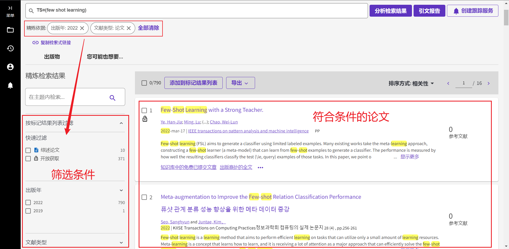
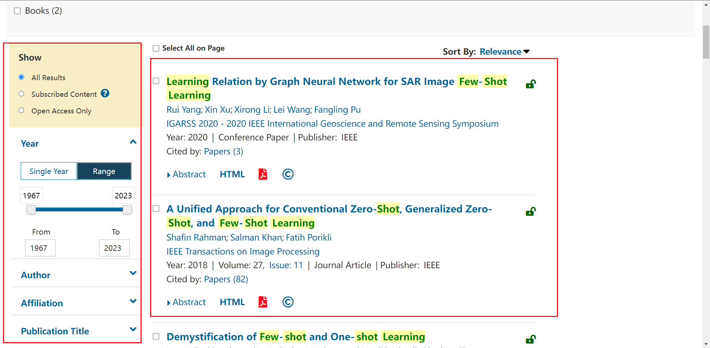
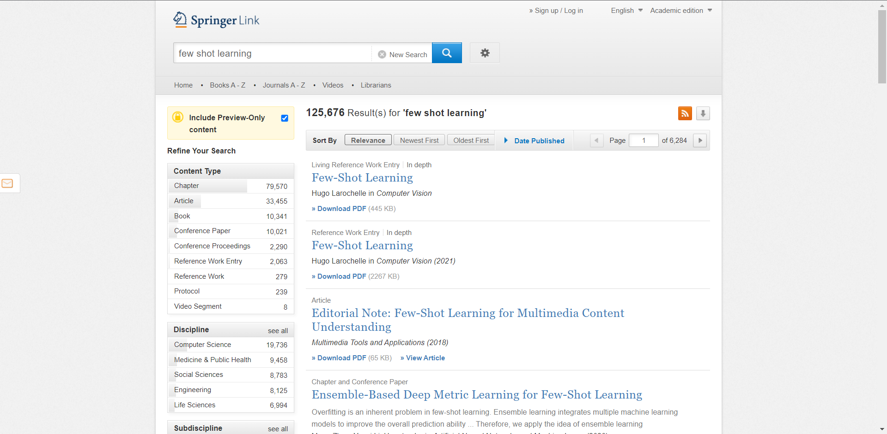

搜索论文时，直接论文名称缩写，然后加上 `arxiv/paperwithcode/github`，

> - [wangxiao5791509/Single_Object_Tracking_Paper_List: Paper list for single object tracking (State-of-the-art SOT trackers)](https://github.com/wangxiao5791509/Single_Object_Tracking_Paper_List) 最新包含

# Web of Science

文献查找使用，

https://www.webofscience.com/wos/alldb/basic-search

http://202.202.43.73:8000/rwt/IEL/https/NFTXK3LZPBXG86UFF3VXK3LFF3YYE3D/Xplore/home.jsp  一般可以直接下载

# Springer

http://202.202.43.73:8000/rwt/SPRINGER/https/NSVX643PPNZHE4LPM7TYELUDN7XB/search 官方下载，但是要看该文章是不是在这个出版刊物上出版过

根据以上两个网站找到论文后，如果这里面不能直接下载，通过以下网站下载（复制论文题目）

https://sci-hub.se/

https://sci-hub.st/

https://sci-hub.ru/

这些免费的下载网站只能够下载比较旧的文章，有可能不能下载最新出版的文章！

如果要查看这些论文的代码的话，可以使用以下两个网站，

https://arxiv.org/，如果有预印版，可以直接查看是否有官方或者第三方提供的代码，以及该文章对应的引用树（很可能没有，直接打开论文，论文中可能会提供）

或者直接在这两个网站中进行搜索，

https://paperswithcode.com/

https://www.connectedpapers.com/

