# Lecture 2: Image Classification

$L1$损失函数：两个向量逐个元素的差的绝对值之和。

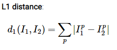 

# Lecture 3: Loss Functions and Optimization

## Softmax vs. SVM

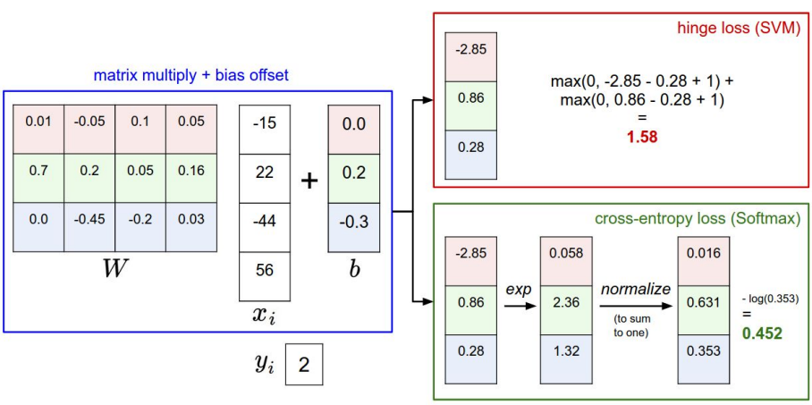

## gradient

参数沿着负梯度方向更新：negative gradient direction

# Lecture 4: Neural Networks and Backpropagation

## Neural Network

和全连接神经网络、多层感知机是同一个。

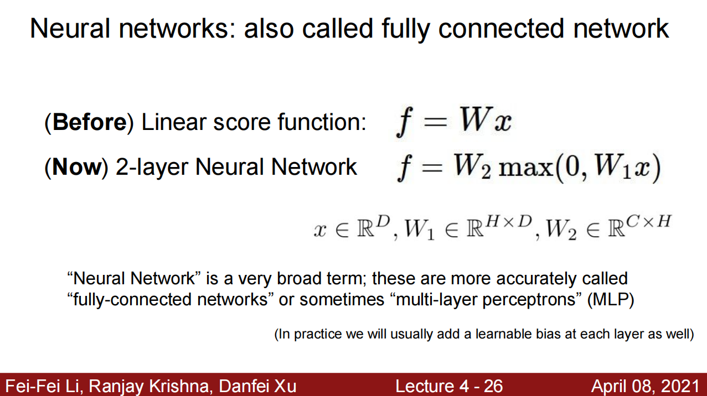

---

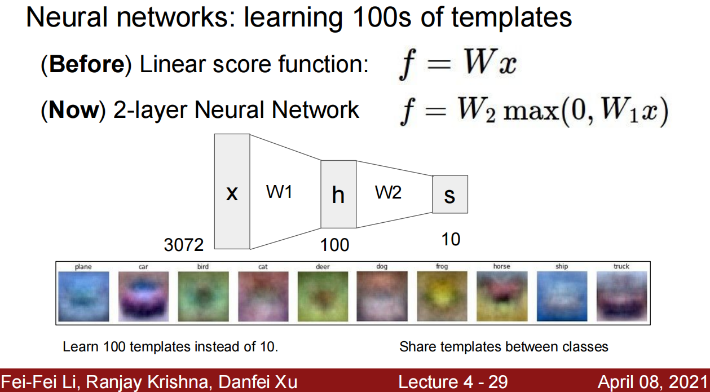

> 使用图示的方法加深理解计算的过程，整个维度的变化情况。

---

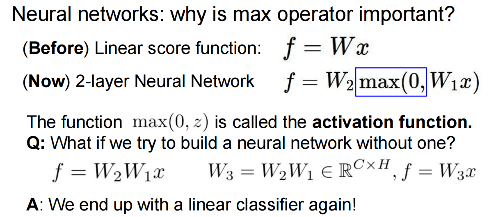

---

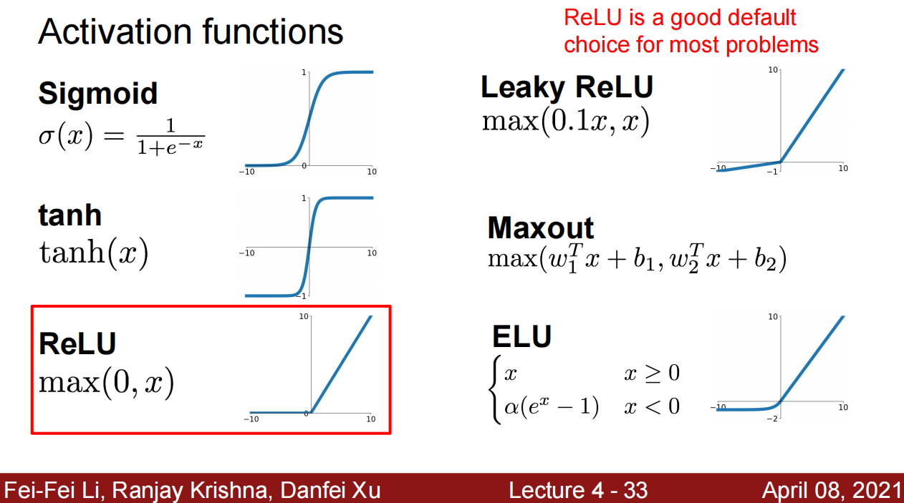

> 对激活函数的解释，这里使用的是 $ReLU$ 激活函数。

---

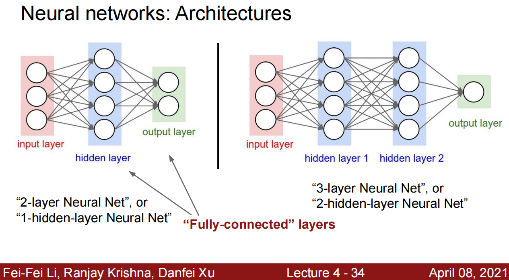

> 注意神经网络和卷积神经网络的区别：神经网络中的相邻层的所有神经元都是全连接的。
>
> 目前理解：而卷积神经网络中的神经元并不是全连接的。由卷积操作得到下一层的输出

---

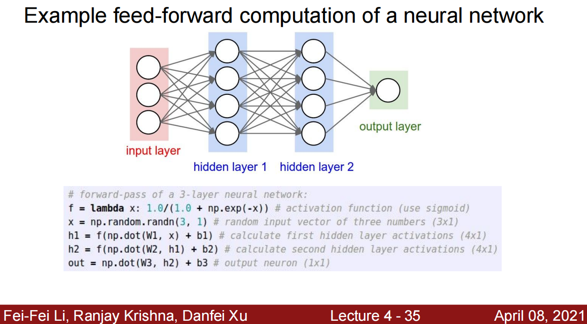

> 神经网络的简单实现过程。
>
> 步骤一般如下（个人总结）：
>
> 1. 定义网络结构；
> 2. 定义加载数据的类；
> 3. 加载数据，将训练数据作为网络的输入传递到网络中进行计算，拟合样本：
>    1. 输入输出维数对应好，权重在前，输入在后；
>    2. 加上偏置；中间的隐藏层通过激活函数后的输出作为下一层的输入，以此类推，一直传递下去。
> 4. 计算整个计算过程中的梯度、损失，然后通过梯度修改权重 $W$，然后使用更新后的权重参数重新训练，直至损失达到预期效果，拟合数据集较好。

---

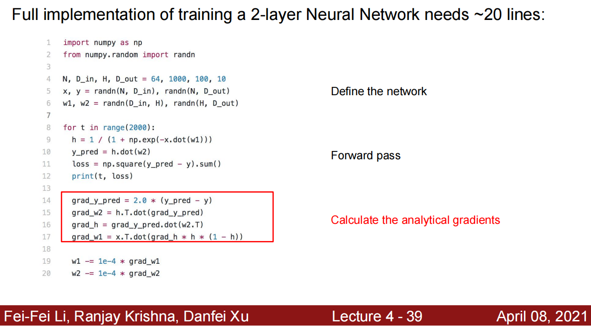

> 结合之前：对分析梯度的理解。

---

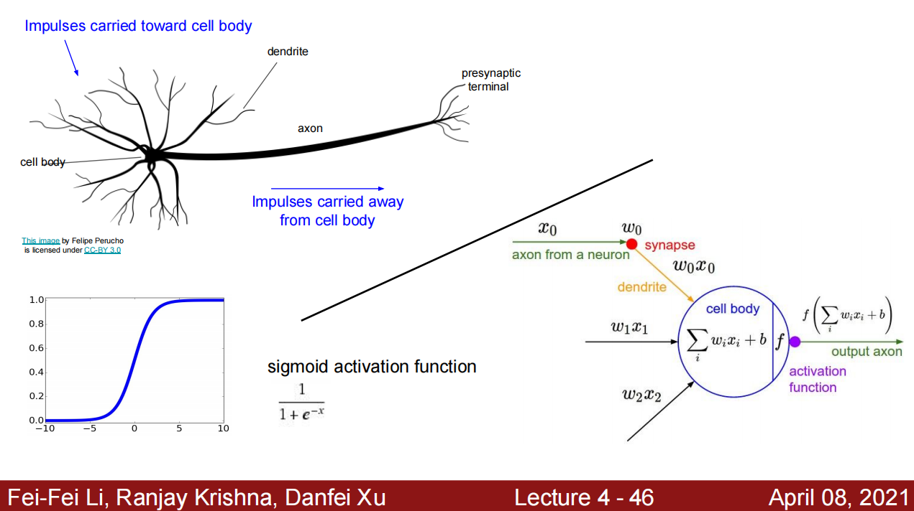

> 形象理解神经网络的计算过程。

---

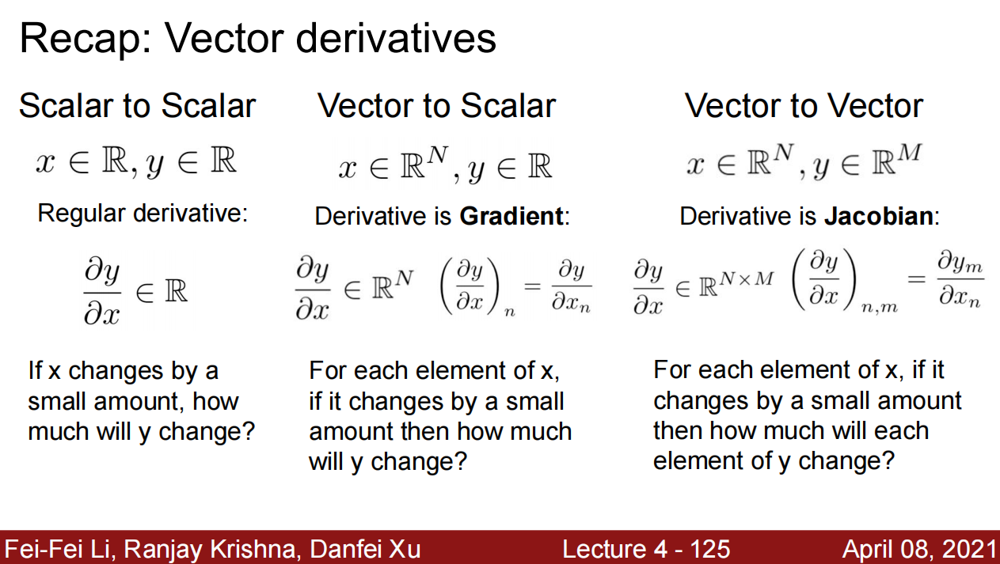

> 向量的导数。

---

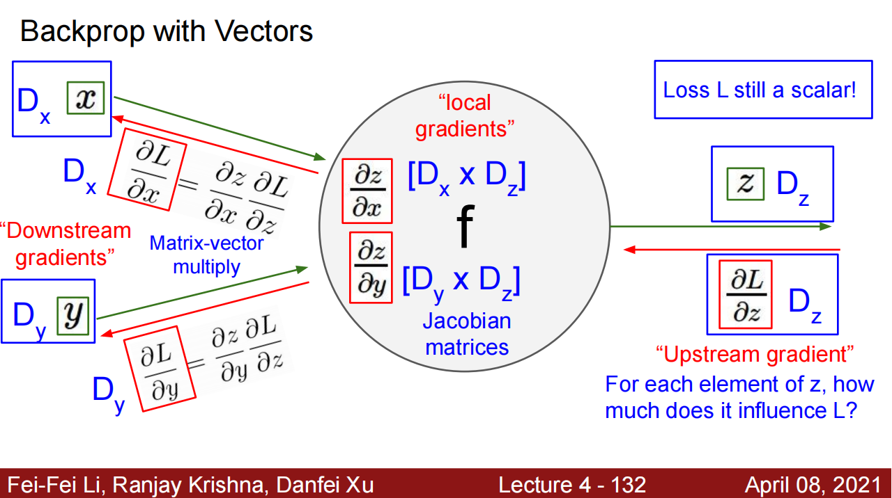

> 使用向量进行反向传播的过程。

---

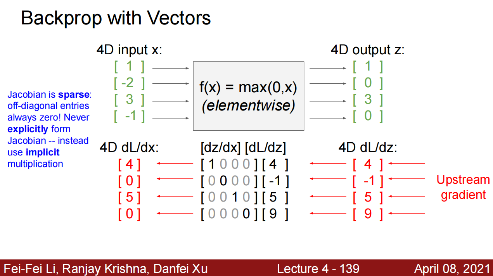

---

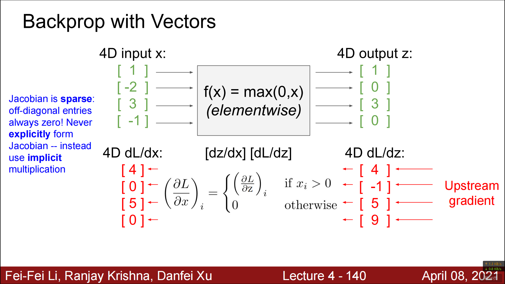

---

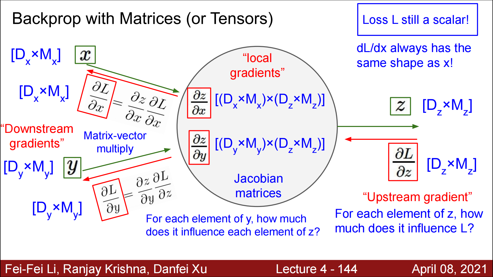

> 蓝色字：稀疏矩阵（此处对应的是 $max(0, x)$ 函数，所以才会形成稀疏矩阵），采用隐式计算矩阵乘积（使用一个条件表达式，将其分段表示），而不是显示表达出来。

---

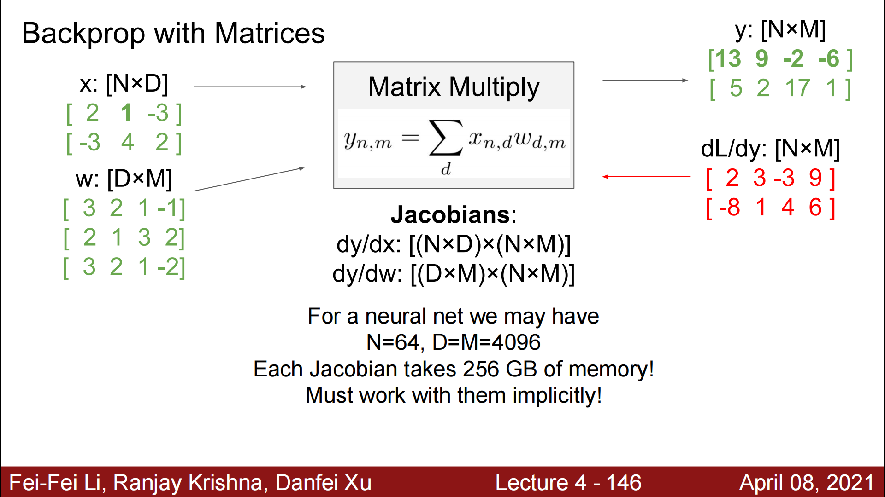

---

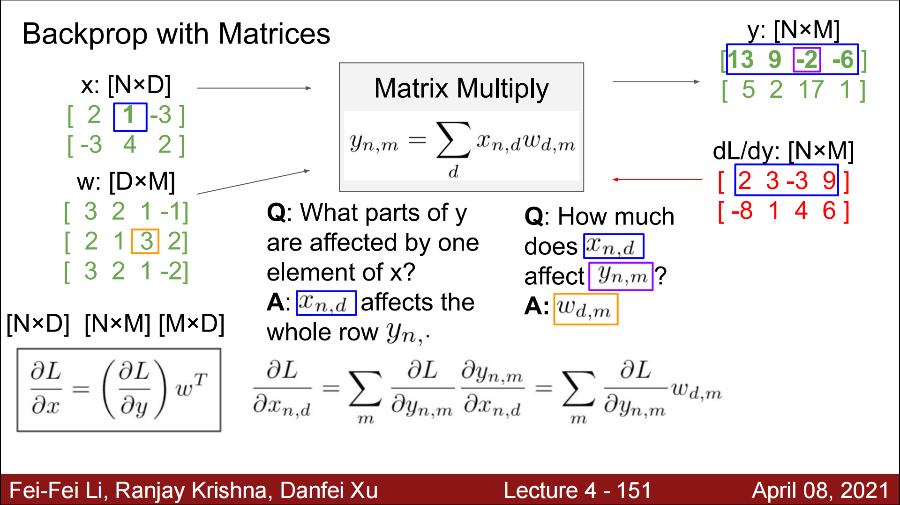

---

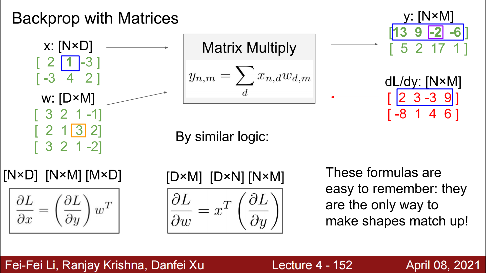

> 具体怎么得到的不懂。

---

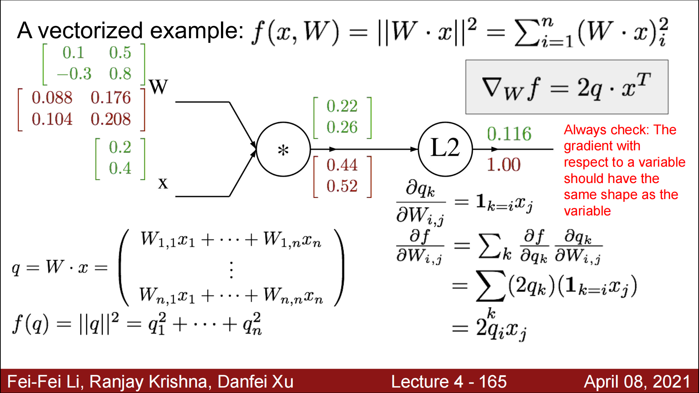

> 梯度的 shape 和 variable 的形状一致。
