# Lecture 3: Loss Functions and Optimization


## 一、理论问题


### gradient

---


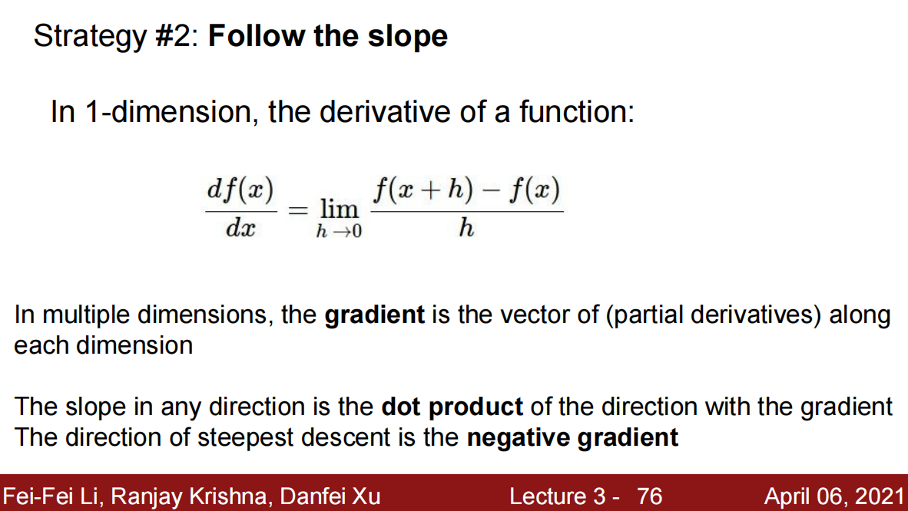


> 这里的多维计算梯度没看懂。


---


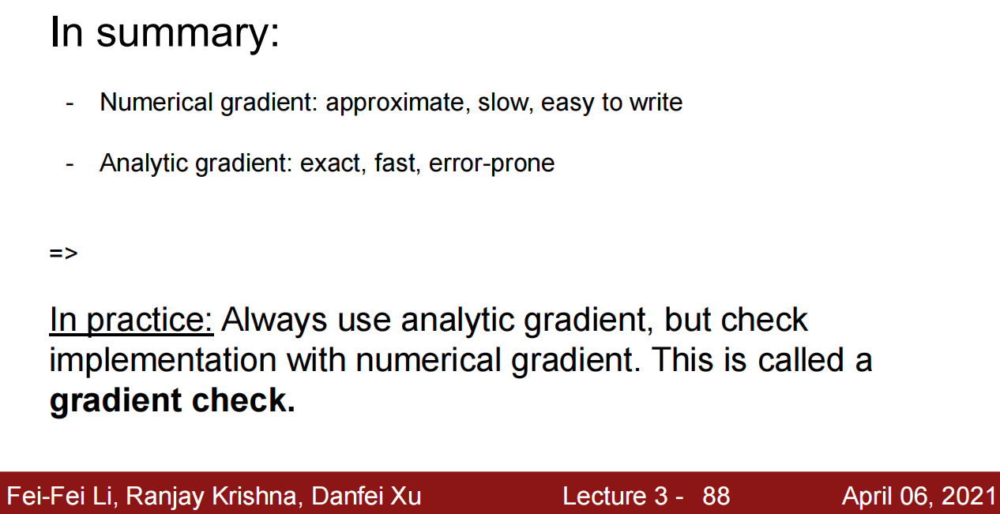


> 这里的 Numerical gradient 和 Analytic gradient 对应的意思？


---


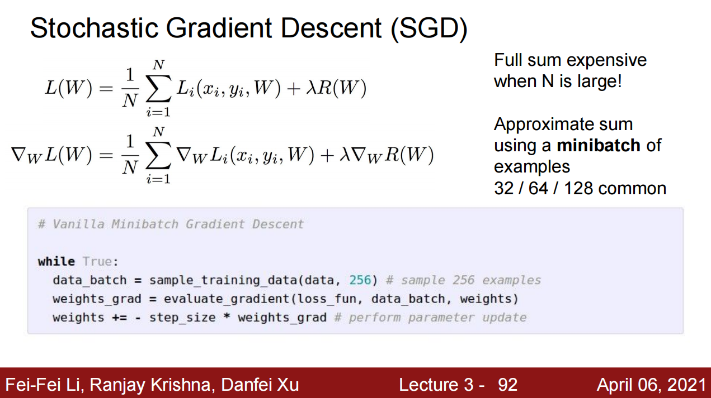


> 没太读懂这页PPT的意思。
>
> 具体来说，还是没太明白神经网络更新权重参数（沿梯度方向）的原理——怎么这样处理就能够拟合训练数据的分布情况呢？

参考官网给出的演示例子：[Multiclass SVM optimization demo (stanford.edu)](http://vision.stanford.edu/teaching/cs231n-demos/linear-classify/)


## 二、技术问题

### 2.1 numpy

1. `xrange`的相关用法：https://www.runoob.com/python/python-func-xrange.html

```python
import numpy as np

a = np.xrange(10)
b = np.xrange(start, end, step)
```

`Python2`中的写法，`Python3`中`range`包含了`xrange`的所有功能。

2. `np.mean()`

```python
import numpy as np

a = np.array([0, 1, 0, 0])
b = np.array([0, 1, 1, 1])

print(a == b)
np.mean(a == b)  # 0.5
```


# Lecture 4: Neural Networks and Backpropagation


## 一、理论问题


---


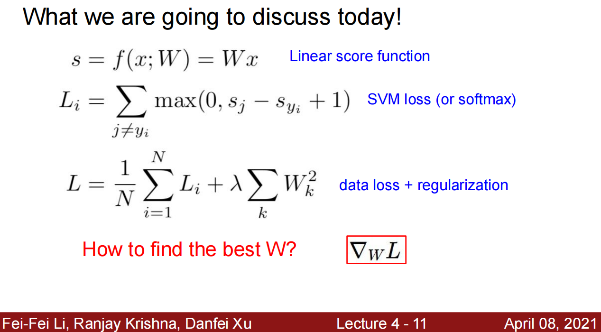


> How to find the best W? 此处的$\delta_{W}L$是怎么就可以计算出 best $W$ 的？
>
> Q: 沿着梯度下降的方向就是最优的 $W$。


---

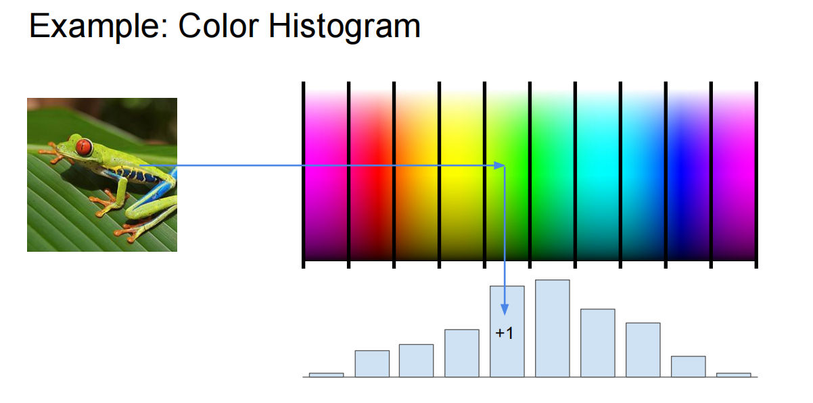


> 有点没太理解这个颜色直方图，这里是把原图像分解成一个一个的 patch 块，然后进行计算的每个 patch 块所对应的颜色区域吗？具体是使用概率还是什么方法计算得到的（如果在这个颜色区间内就把这个块所在的区间类别+1），如果出现这种情况该怎么处理：这一个 patch 块横跨了几个颜色梯度，这种情况怎么处理（突然想到会不会是根据概率来的，和上面同理）？


---

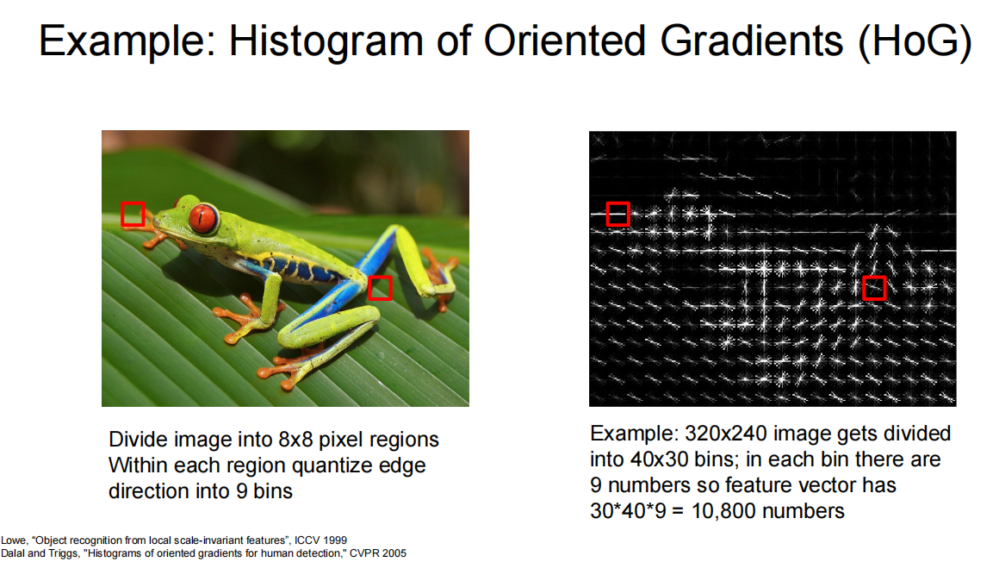


> 1. 此处的**定向梯度直方图（Histogram of Oriented Gradient, HOG）**具体是什么意思？
> 2. 示例中 each region quantize edge direction into 9 bins 没太理解这句话，具体含义是什么？
> 3. 这里我对 bins 的理解就是 patch 块，即把原图像分成均匀的小块。


---

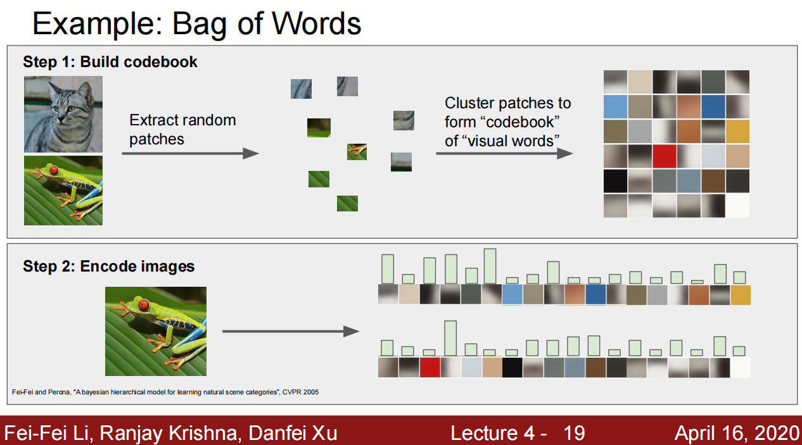


> 这里的 Extract random patches 没太理解。
>
> 随机抽取出的 patches 可以代表我们真实感兴趣的目标的信息吗？还是说这里的随机指的是从目标中随机选取的（如果刚好随机选取到的全是背景的 patch，就不能提供目标的特征信息了）。


---

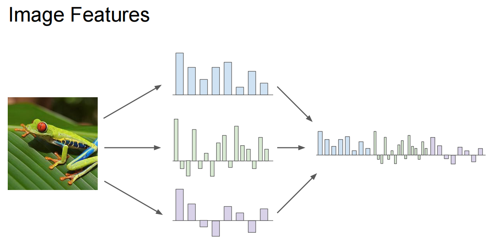

> 这里的类别分数怎么还有负的呢？有点没太理解
>
> 注：不同颜色代表不同的类别。
>
> 个人理解：每一种颜色表示一个种类，每一个直方图中的长方形表示这个 patch 在这个类别上的得分（大概理解了，既然是得分，就有正有负，如果是概率的话那么就不可能为负）


---

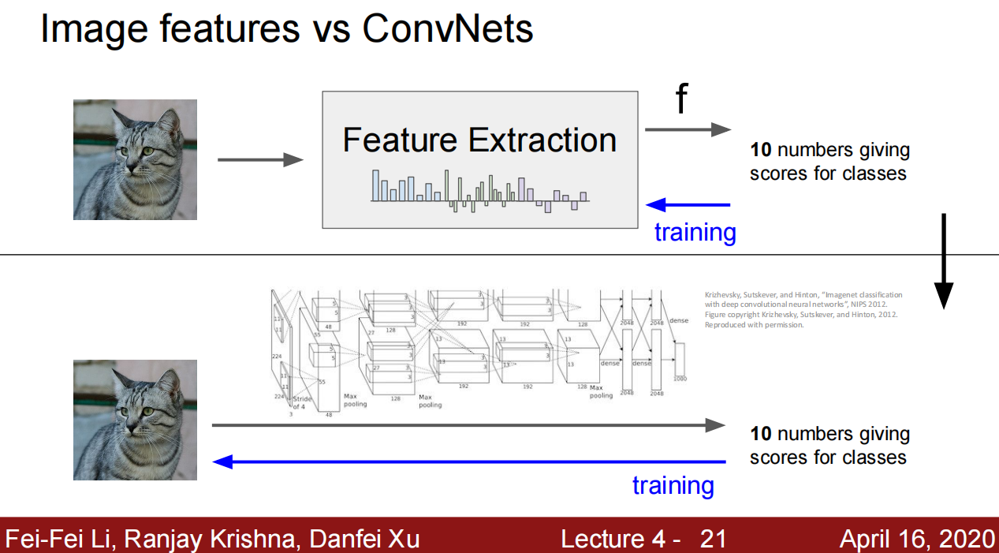

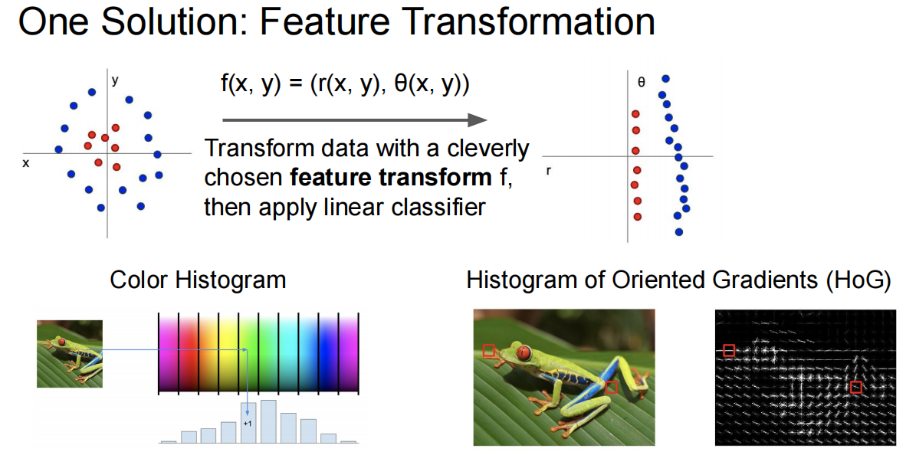


> 这里作者应该是想表述两种方式的区别，但是没太看懂他们的区别具体在哪里？即原理没懂。
>
> 上面一张 slides 的 f 和下面一张的 f 是同一个意思吗？


---


Neural Network ~= Fully-connected Networks ~= multi-layer perceptrons (MLP)

神经网络和卷积神经网络的区别在哪里？


---

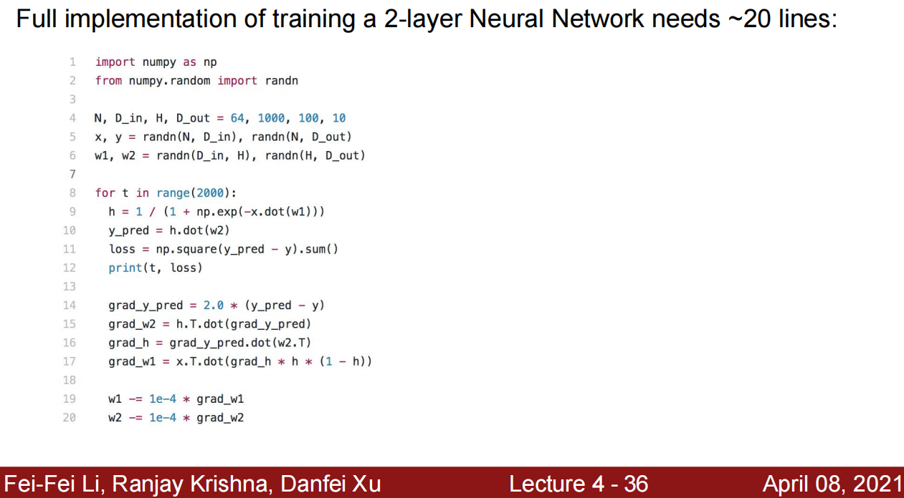


> 不是太懂这里的代码：主要是梯度计算这一块 grad_y_pred


---


> 此处的矩阵计算没太懂：`local gradient` 的计算。


---

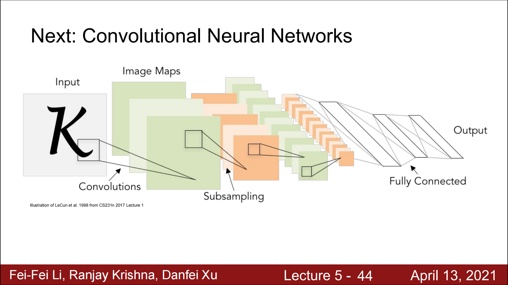


> 这里的映射关系图示没看明白。


## 二、技术问题

在训练神经网络时，在初始化模型参数后， 我们交替使用前向传播和反向传播，利用反向传播给出的梯度来更新模型参数。 注意，反向传播重复利用前向传播中存储的中间值，以避免重复计算。 带来的影响之一是我们需要保留中间值，直到反向传播完成。 这也是训练比单纯的预测需要更多的内存（显存）的原因之一。 此外，这些中间值的大小与网络层的数量和批量的大小大致成正比。 因此，使用更大的批量来训练更深层次的网络更容易导致*内存不足*（out of memory）错误。

> Q: 训练过程中要保存模型参数的中间值，这里的中间值指的是**中间变量的值，以及那些用于反向传播需要的梯度值*local gradient*？**
>
> 模型预测时候，所有的参数的值是全都保存了的吗，还是说只保存了一部分？比如说当前模型有 $24M$ 的参数量，那么我们把模型训练好之后，是不是这些参数都有一个权重值保存着？


