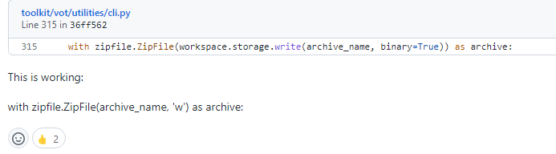

# 基础知识

## 线性代数

- 矩阵的存储方式：$x = [1, 1, 1, 1]$表示列矩阵，$x^T$才表示行矩阵！


# 深度学习理论

- [(1条消息) 深度学习的宏观框架——训练（training）和推理（inference）及其应用场景_木子山石的学习笔记-CSDN博客_inference](https://blog.csdn.net/huiyuanliyan/article/details/87900550)
- [(1条消息) Hadamard Product_bbbeoy的专栏-CSDN博客](https://blog.csdn.net/bbbeoy/article/details/108220585?spm=1001.2101.3001.6661.1&utm_medium=distribute.pc_relevant_t0.none-task-blog-2~default~OPENSEARCH~Rate-1.pc_relevant_default&depth_1-utm_source=distribute.pc_relevant_t0.none-task-blog-2~default~OPENSEARCH~Rate-1.pc_relevant_default)

## Transformer 2022.3.10

- [(1条消息) transformer中的positional encoding(位置编码)_Flying_sfeng的博客-CSDN博客_transformer 位置编码](https://blog.csdn.net/Flying_sfeng/article/details/100996524)
- [(1条消息) Transformer中的Decoder详解_CuddleSabe的博客-CSDN博客_transformer的decoder部分](https://blog.csdn.net/qq_15534667/article/details/116337102)
- [点积相似度、余弦相似度、欧几里得相似度 - 知乎 (zhihu.com)](https://zhuanlan.zhihu.com/p/159244903)
- [attention机制中的query,key,value的概念解释 - 知乎 (zhihu.com)](https://zhuanlan.zhihu.com/p/148737297)


# 环境工具

## conda

`pip install` 与 `conda install` 的区别：https://www.1024sou.com/article/579456.html


- `Solving environment: failed with initial frozen solve. Retrying with flexible solve.`

  通过无法安装来促使用户使用虚拟环境，从而达到分割环境的需求。（限制直接在 `base` 环境中安装包，新特性，还可以通过降低 `conda` 版本来解决）

  > 参考链接：https://blog.csdn.net/weixin_38419133/article/details/115863940


## numpy

- numpy数据存储格式：https://blog.csdn.net/Cy_coding/article/details/114959585
- `_init_paths.py`的使用


## cudatoolkit

官网下载：https://developer.nvidia.com/cuda-toolkit-archive

官方详细文档：https://docs.nvidia.com/cuda/archive/11.3.1/cuda-installation-guide-linux/index.html#removing-cuda-tk-and-driver


# 项目运行问题


## GLOBAL TRACK


---


```shell
python setup.py develop
```

- `RuntimeError: Error compiling objects for extension`

  ```shell
  Traceback (most recent call last):
    File "setup.py", line 207, in <module>
      zip_safe=False)
    File "/home/guest/anaconda3/envs/global_track/lib/python3.7/site-packages/setuptools/__init__.py", line 153, in setup
      return distutils.core.setup(**attrs)
    File "/home/guest/anaconda3/envs/global_track/lib/python3.7/distutils/core.py", line 148, in setup
      dist.run_commands()
    File "/home/guest/anaconda3/envs/global_track/lib/python3.7/distutils/dist.py", line 966, in run_commands
      self.run_command(cmd)
    File "/home/guest/anaconda3/envs/global_track/lib/python3.7/distutils/dist.py", line 985, in run_command
      cmd_obj.run()
    File "/home/guest/anaconda3/envs/global_track/lib/python3.7/site-packages/setuptools/command/develop.py", line 34, in run
      self.install_for_development()
    File "/home/guest/anaconda3/envs/global_track/lib/python3.7/site-packages/setuptools/command/develop.py", line 114, in install_for_development
      self.run_command('build_ext')
    File "/home/guest/anaconda3/envs/global_track/lib/python3.7/distutils/cmd.py", line 313, in run_command
      self.distribution.run_command(command)
    File "/home/guest/anaconda3/envs/global_track/lib/python3.7/distutils/dist.py", line 985, in run_command
      cmd_obj.run()
    File "/home/guest/anaconda3/envs/global_track/lib/python3.7/site-packages/setuptools/command/build_ext.py", line 79, in run
      _build_ext.run(self)
    File "/home/guest/anaconda3/envs/global_track/lib/python3.7/distutils/command/build_ext.py", line 340, in run
      self.build_extensions()
    File "/home/guest/anaconda3/envs/global_track/lib/python3.7/site-packages/torch/utils/cpp_extension.py", line 708, in build_extensions
      build_ext.build_extensions(self)
    File "/home/guest/anaconda3/envs/global_track/lib/python3.7/distutils/command/build_ext.py", line 449, in build_extensions
      self._build_extensions_serial()
    File "/home/guest/anaconda3/envs/global_track/lib/python3.7/distutils/command/build_ext.py", line 474, in _build_extensions_serial
      self.build_extension(ext)
    File "/home/guest/anaconda3/envs/global_track/lib/python3.7/site-packages/setuptools/command/build_ext.py", line 202, in build_extension
      _build_ext.build_extension(self, ext)
    File "/home/guest/anaconda3/envs/global_track/lib/python3.7/distutils/command/build_ext.py", line 534, in build_extension
      depends=ext.depends)
    File "/home/guest/anaconda3/envs/global_track/lib/python3.7/site-packages/torch/utils/cpp_extension.py", line 538, in unix_wrap_ninja_compile
      with_cuda=with_cuda)
    File "/home/guest/anaconda3/envs/global_track/lib/python3.7/site-packages/torch/utils/cpp_extension.py", line 1359, in _write_ninja_file_and_compile_objects
      error_prefix='Error compiling objects for extension')
    File "/home/guest/anaconda3/envs/global_track/lib/python3.7/site-packages/torch/utils/cpp_extension.py", line 1683, in _run_ninja_build
      raise RuntimeError(message) from e
  RuntimeError: Error compiling objects for extension
  ```

  将`AT_CHECK`->`TORCH_CHECK `，版本不兼容问题导致的。

  > 参考链接1：https://github.com/sshaoshuai/Pointnet2.PyTorch/issues/19
  >
  > 参考链接2：https://github.com/facebookresearch/maskrcnn-benchmark/issues/1236


---


```shell
python train_qg_rcnn.py --config configs/qg_rcnn_r50_fpn.py --load_from checkpoints/qg_rcnn_r50_fpn_2x_20181010-443129e1.pth --gpus 1
```


- `FileNotFoundError: [Errno 2] No such file or directory: '/home/guest/data/coco/annotations/instances_train2017.json'`

  修改数据集路径：`~/data/` 修改为 `/data/`.

- `ImportError: cannot import name 'get_dist_info' from 'mmcv.runner.utils'`

  You are trying to import 'get_dist_info' from 'mmcv.runner.utils', which should be 'mmcv.runner.dist_utils'. Change it to:
  `from mmcv.runner.dist_utils import get_dist_info`.

  > 参考链接：https://github.com/open-mmlab/mmdetection/issues/1811

- `cannot import name 'get_dist_info' from 'mmcv.runner.utils'`

  `from mmcv.runner.utils import get_dist_info` 变为 `from mmcv.runner import`.

  > 参考链接：https://blog.csdn.net/qq_36530992/article/details/104672750

- `No module named 'mmcv.cnn.weight_init'`\

  `pip install mmcv==0.4.3`

  > 参考链接：https://github.com/open-mmlab/mmdetection/issues/3402


---


```shell
python test_global_track.py
```


- `RuntimeError: unexpected EOF, expected 7491165 more bytes. The file might be corrupted.`

  重新下载预训练模型。

  > 参考链接：https://github.com/huggingface/transformers/issues/1491


## STARK_LT

> https://github.com/researchmm/Stark


不管是训练还是测试，首先根据官方说明，把所有的预训练模型下载下来，并按照官方提供的目录树 `tree -d xxx` 创建目录，把相应的文件下载到对应的目录！


### RUN TRAIN


### RUN TEST

根据 `Model Zoo` 下载预训练模型到本地，存放到对应的目录中。


预训练模型准备好后，到对应目录中运行测试脚本。


- 运行测试 `vot20_lt` 时，总是先下载数据集，每次都自动下载：

```bash
bash exp.sh
```

运行报错：

```bash
zipfile.BadZipFile: File is not a zip file
```

> 解决方法：https://groups.google.com/g/votchallenge-help/c/CNXPPUmXEY0?pli=1


```bash
find ~/anaconda3/envs/stark_lt/ -name "cli.py"

with zipfile.ZipFile(archive_name, 'w') as archive:
```



`VSCode` 可以直接打开，找到这一行，修改即可。

> 搜索时，带上该项目的名称，比如说 `File is not a zip file vot`


```bash
vot initialize --dir VOT2022 --nodownload False
```

报错：

```python
Unable to retrieve version information HTTPSConnectionPool(host='raw.githubusercontent.com', port=443): Max retries exceeded with url: /votchallenge/toolkit/master/vot/version.py (Caused by NewConnectionError('<urllib3.connection.HTTPSConnection object at 0x7f89371c6850>: Failed to establish a new connection: [Errno 111] Connection refused'))
```

解决方案：<font color="red"><b>去掉 `requests.get` 后面的 `timeout` 参数，或者指定一个较大的值！！！</b></font>

> - [HTTPSConnectionPool(host='stats.nba.com', port=443): Read timed out. (read timeout=None) · Issue #4824 · psf/requests (github.com)](https://github.com/psf/requests/issues/4824)
>
> - https://stackoverflow.com/questions/43298872/how-to-solve-readtimeouterror-httpsconnectionpoolhost-pypi-python-org-port


## VOT

- [目标跟踪\]vot-toolkit-python的使用 (pythonmana.com)](https://pythonmana.com/2022/01/202201210713212233.html)

> `initialize` 的使用：初始化环境，并进行配置，以votlt2020为例

```bash
# 如果没有下载数据集
cd vot-test
vot initialize votlt2020

#2: 如果已经下载好数据集，指定这个参数
cd vot-test
vot initialize votlt2020 --nodownload
```


## Smart Construction

github: https://github.com/PeterH0323/Smart_Construction

==手动创建环境，差什么安装什么！==


```shell
pip install pyyaml
```


`run.sh`

```shell
python train.py --img 640 \
                --batch 16 --epochs 10 --data ./data/custom_data.yaml \
                --cfg ./models/custom_yolov5.yaml --weights ./weights/yolov5s.pt \
                --device 0,2
```

- `AssertionError: batch-size 16 not multiple of GPU count 3`

  > 参考链接：https://github.com/ultralytics/yolov5/issues/1936

- `RuntimeError: a view of a leaf Variable that requires grad is being used in an in-place operation.`

  > 参考链接：https://github.com/ultralytics/yolov5/issues/1552

- `TypeError: can't convert cuda:0 device type tensor to numpy. Use Tensor.cpu() to copy the tensor to host memory first.`

