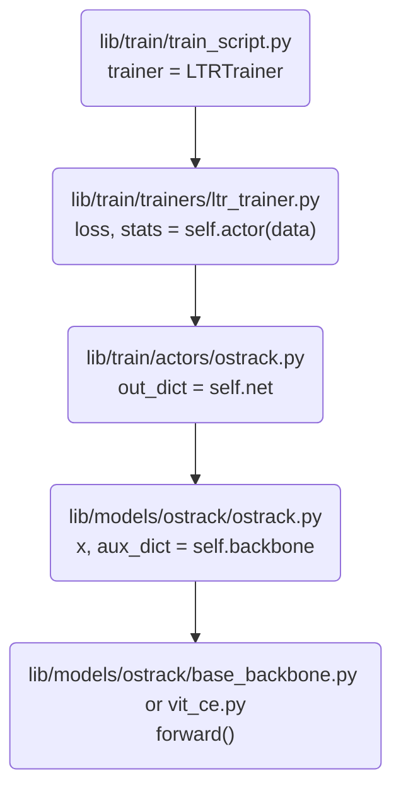

## ENV

环境创建，

```bash
conda create -n ostrack python=3.8
conda activate ostrack
source ./create_env.sh
```

运行测试，

```bash
python tracking/create_default_local_file.py --workspace_dir . --data_dir ./data --save_dir .

ln -snf /data/dataset/coco coco
ln -snf /data/dataset/GOT-10k got10k
ln -snf /data/dataset/LaSOT/LaSOTBenchmark lasot
ln -snf /data/dataset/TrackingNet trackingnet

mkdir pretrained_model && cd pretrained_model
# 复制预训练模型到该文件夹，如果有不同，需要修改 .yaml 中的名称

python tracking/train.py --script mixformer --config baseline --save_dir output/mixformer --mode multiple --nproc_per_node 1
# fpntv3
python tracking/train.py --script fpnt --config baseline --save_dir output/fpntv3_ciou --mode multiple --nproc_per_node 4

find -name "__pycache__" -o -name "fpntv3_ciou" | xargs rm -r  # -o, -or
```


## TODO

- [x] 将 `MixFormer` 中的 `backbone` 替换为 `P2T`

  由于两个模型有各自的 `attention`，而 `P2T` 主要是针对图像分类或者目标检测、实例分割这类 `single image input, not pair image task`，因此需要对 `attention` 部分修改（主要是 `forward` 部分）。

  > 个人理解：有关 `backbone` 等预训练模型，在使用的时候可以修改 `forward` 部分实现新的功能，但是切记！！！不能修改 `backbone __init__()` 中的部分，也就是网络的结构不能够修改！添加可以，但是绝对不能 删除或者修改！！！

  修改成功之后，模型的效果和原论文 `MixFormer` 相差甚远，大概 `5-6` 个点，目前可以推测到的原因有，

  - `batchsize` 减少为了原来的一半 `16 -> 8`，这主要是由于更改之后的模型更加复杂，参数量更大（原因可能跟 `MixFormer` 中得到 `qkv` 的方式有关，前者通过设计的 `DeepConv` 得到，相对于原始的 `image tocken`，大大减少，同时结合 `conv` 和 `transfomer attention` 的优点，可以不用 `position encoding`，而后面的更改直接 `concat(z, x)`，前面的 `image patch tocken` 较大，因此就会占用更多的计算，更加复杂）

- [x] `head` 部分参考 `OSTrack` 进行优化

  > 由于 `P2T/SwinT/MixFormer` 其核心在于精心设计的 `Attention module`，因此不同的方法不能将 `Attention` 混用？
  >
  > `OSTrack` 直接使用 `ViT` 最原始的 `Attention` 也可以，可作为参考；其思路主要是直接 `concat(z, x)`，其中 `z, x` 均为 `ViT last_stage` 的输入，即 `depth=11` 的输出，此时的图像 `patch_size=img_size/16`，直接将这些图像块拼接，然后送入到 `naive ViT`，利用 `Multi-head Self Attention` 同时进行特征提取和关系建模；个人认为这样实现的最重要的前提是 `position encoding`，但是原论文中又说位置编码不是很重要，还有待商榷，需要多次反复阅读该论文！
  >
  > 相比之下，`MixFormer` 的方法就清晰易理解许多，和传统的 `TransT` 以及最新的 `SFTTrack` 很接近，都是将 `template search` 分离开来，然后再在同一个专门设置的特定的 `attention` 模块中进行关系建模的操作！
  > `MixFormer` 中的 `MAM` 模块前一部分，使用 `DeepConv` 进行特征提取，分别得到 `z, x` 的 `q, k, v`，然后再通过设计的 `attention, k/v_m=concat(k/v_z, k/v_x)` 实现 `interaction` 关系建模。

- [ ] `Attention` 中添加 `position encoding`

- [ ] 将 `MixFormer` 中的 `Attention` 引入到 `P2T` 中，修改 `PoolingAttention forward()` 部分，目前思路，

  ```python
  def forward(self, z, x, H, W, z_H, z_W, d_convs=None):
      B, N, C = x.shape
      B, z_N, C = z.shape
  
      # XBL comment; num_heads [1, 2, 5, 8]
      """
      知悉：mixformer 中此处只用了一个 proj_q，是因为此处的输入已经是 concat(z, z_, x)
      而这里我们传入的还是分离的 z,x，需要考虑是否 concat 或者 新增加一个 proj_q
      """
      q = self.q(x).reshape(B, N, self.num_heads, C // self.num_heads).permute(0, 2, 1, 3)
      q_z = self.q(x).reshape(B, N, self.num_heads, C // self.num_heads).permute(0, 2, 1, 3)
  
      pools = []
      x_ = x.permute(0, 2, 1).contiguous().reshape(B, C, H, W)
      for (pool_ratio, l) in zip(self.pool_ratios, d_convs):
          pool = F.adaptive_avg_pool2d(x_, (round(H / pool_ratio), round(W / pool_ratio)))
          pool = pool + l(pool)  # fix backward bug in higher torch versions when training
          pools.append(pool.view(B, C, -1))
  
      pools = torch.cat(pools, dim=2)
      pools = self.norm(pools.permute(0, 2, 1).contiguous())
  
      kv = self.kv(pools).reshape(B, -1, 2, self.num_heads, C // self.num_heads).permute(2, 0, 3, 1, 4)
      k, v = kv[0], kv[1]
  
      attn = (q @ k.transpose(-2, -1)) * self.scale
      attn = attn.softmax(dim=-1)
      x = (attn @ v)
      x = x.transpose(1, 2).contiguous().reshape(B, N, C)
  
      x = self.proj(x)
  
      return x
  ```

  


## 修改思路

> - 2022-11-18 添加：在 patch embedding 之前，z x 分开，只要一经过 patch embedding 之后，就要 concat(z, x)，这样才算是 one-stream。整体的结构是：Hole Arch --- layers(repeated blocks e.g. [3, 3, 9, 3]) --- block(MSA-LN-FFN/MLP-LN) --- MSA(encoder)，最终修改就是修改 encoder 中的 feature corr 部分！要么 MSA(concat(z, x))，要么使用 mixformer 中设计的 cross attention。
>
>   最新思路：将 P2T 中的 Pyrimid Pooling Transformer 引入到 SwinT 的 Windows Attention 中，可以减少计算量。
>
>   在 Block 里面 concat(z, x)，然后将 zx 送入到 attention 中进行运算

MixFormer & OSTrack 都是以 ViT 为 backbone，

MixFormer 有多个 stage，OSTrack 没有显示指定多个 stage，需要对照代码查看。


MixFormer 没有将 template 和 search embedding 直接计算 MSA，而是将其分开后，使用最初的和 CNN 类似的 feature-search associatiton 操作。

综合来看，OSTrack 速度快，简单，精度更高，更值得尝试！MixFormer 网络结构更加复杂，效果略差，速度不佳！


综合来看，以 OSTrack 为 baseline，需要修改的地方，

- backbone 修改为 SwinT，利用多个 stage，和 MixFormer 类似的思想，
- 预训练网络进行修改，使用自监督训练好的 swint 初始化 swin transformer，
- 其他地方：最后的预测头，是否可参考 MixFormer 的 score head 设计？
- 借鉴 Stark 的思路，动态模板更新策略，


**第一步：不使用 CE 的情况下，让 SwinT + OSTrack 跑起来，具体结合 图a 来操作，调试 OSTrack 在使用 ViT 情况下的数据流**

打开的文件目录树大致如下，


调用流程图，




**第二步：根据第一步的数据流确定哪些部分需要修改，哪些部分不变，针对性地对 SwinT 进行修改**

边修改便调试，直至可以运行起来！

> 并不可行，`SwinT` 的 `Attention` 太复杂，主要用于特征提取，如果需要进行 `interaction`，还需要重新进行 `naive attention` 操作，因为 `base swint` 是 `single image input`，由于 `ostrack` 没有使用多个 `stage`，同时使用最原始的 `attention`，因此可以直接 `concat` 而不需要设计单独的 `attention` 模块来进行关系建模。


更正，SwinT 并不适合 OT，SwinT 对单张图片进行操作，主要用于提取图像内部的特征信息，在分块的时候，针对的是单张图片，并不涉及跨图片的关系建模，只涉及到内部图片块之间的关系，因此不适合。

最新想法：使用 MixFormer 作为 baseline，其沿用 OT 最原始的关系建模方式。目前可想到的更新点，

- 考虑 OSTrack 中的特征提取方式，~~MixFormer 貌似设计地过于复杂了 `conv_proj_qkv`~~（==更正，使用的是 `CvT` 中的源代码，直接 copy 过来使用，因此该部分为必须的==）。
- 在最后一个 stage，加上 OSTrack 的关系建模方式，即使用 self-attention 再一次加强关系建模能力，具体而言，将最后一个 stage 的输出（transformer 不改变序列的 shape，input_shape = output_shape）concat(z,x , dim=1)，然后使用 self-attention！

输入网络，

```python
template.shape
torch.Size([1, 3, 128, 128])
online_template.shape
torch.Size([1, 3, 128, 128])
search.shape
torch.Size([1, 3, 320, 320])
```


经过 CVT 3-stage 之后的输出，

```python
template.shape
torch.Size([1, 1024, 64])
online_template.shape
torch.Size([1, 1024, 64])
search.shape
torch.Size([1, 6400, 64])
x.shape
torch.Size([1, 8448, 64])
```


### 对比 `MixFormer -- OSTrack`

- mix 使用 CvT 作为 backbone，结合卷积和 transformer 的优点，os 使用最原始的 ViT；
- 预测头 head 部分有差别（非 online 部分，online 部分有），mix 实现简单，没有使用高斯热力图，ostrack 使用且用的是 CORNER 的改进版 CENTER Point


### 参考 `Stark && SwinTrack`

`SwinTrack` 思路简单，直接使用 `SwinT` 进行特征提取，然后使用 `SiamTrack` 的思路进行追踪，

track 中是否有必要加上 decoder（用于类的检测，目标只有一个，所以是单个 query，前景 or 背景）


> - [卷积神经网络之“浅层特征”与“深层特征”_一个菜鸟的成长史的博客-CSDN博客_深层特征和浅层特征](https://blog.csdn.net/m0_62311817/article/details/126064158)

修改思路，网络结构不更改，只修改 `forward` 中的 `Attention` 部分，原来 detection 处理的是 single image，tracking 要处理的是 pair-image 而已，需要在提取特征的同时进行特征关联！

既然浅层的特征只关注细粒度的特征信息，深层特征更关注于语义信息，更加抽象的特征信息！那么 Attention 应该就不是必须要在所有的 stage 都执行，选择和当前任务最贴合的情况执行！

当前的 idea：选择 `SwinT/P2T` 合适的 stage 进行 concat(z, x) --> plain attention like ostrack，不能修改参考论文的 attention（针对的是 single image，实现的是 特征提取，就算是 `OSTrack`，也是直接得到经过 `ViT` 之后最后的输出的 z, x，相当于提取好的特征），只能在其上面进行添加 plain attention？

ViT 相当于只有一个 stage，第一步还是划分块，修改的时候只要保证每一个 stage 里面的 forward(concat(z, x)) 传入的是计算 concatenated attention 就行（即在具体执行 Windows patch 里面的 self-attention），在传入下一个 stage 之前需要将 (z, x) 再拆分开来！一步一步往后执行就好！

注意：Tracking 中 attention qkv 的计算方式！与 detection 有区别，具体看 stark/ostrack/mixformer 中的实现！


其实，`SwinT` 中的关键部分 `Windows Attention` 也和 plain attention 类似，要修改的地方就是这里！由于 `Attention` 输入输出的 sequence shape 是不变的，所以没其他的问题！

- forward(z, x) 添加 z
- qkv 的计算，计算 concat(z, x) 的 qkv
- 利用 concat(z, x) 计算得到的 q,k,v 计算 Multi-head Self Attention, MSA


### 修改记录

```python
forward_feature(input)
forward(z, x):
    ## 特征提取
    forward_feature(z)
    forward_feature(x)
    ## correlation 关系建模
    corr(z, x)
```

这样调用同一个函数进行处理，可以不必写很多重复的代码！

有关训练过程收敛的问题，

- `P2T`
  - batchsize 影响较小，lr 影响很大；
  - lr=0.005 收敛较快，设置 100 epoch 减小为 0.1 倍，效果不是很好，可以在 0.005 上继续训练，即 lr_decay 的 epoch 可以适当延长，试试 epoch=200；
- `swintt`
  - lr=0.0001 比较合适，设置为 0.005 的时候完全不收敛；
  - 模型参数量太大，batchsize=8 就已经占用 ~48GiB memory，可以通过控制台打印的 警告日志着手解决！

> 关于 lr 部分，可以参考原论文 `P2T/SwinT` 中的设置进行调整，当然也仅仅只是做一个简单的参考。


### 详细部分

#### `P2T`


#### `SwinTs`

> - [microsoft/tutel: Tutel MoE: An Optimized Mixture-of-Experts Implementation](https://github.com/microsoft/tutel)
> - [Swin Transformer迎来30亿参数的v2.0，我们应该拥抱视觉大模型吗？](https://www.msra.cn/zh-cn/news/features/swin-transformer-v2)
> - [MoE: 稀疏门控制的专家混合层 - 知乎](https://zhuanlan.zhihu.com/p/335024684)
> - [microsoft/Swin-Transformer: This is an official implementation for "Swin Transformer: Hierarchical Vision Transformer using Shifted Windows".](https://github.com/microsoft/Swin-Transformer)


##### `BUG`

```python
[W reducer.cpp:1303] Warning: find_unused_parameters=True was specified in DDP constructor, but did not find any unused parameters in the forward pass. This flag results in an extra traversal of the autograd graph every iteration,  which can adversely affect performance. If your model indeed never has any unused parameters in the forward pass, consider turning this flag off. Note that this warning may be a false positive if your model has flow control causing later iterations to have unused parameters. (function operator())
```


## DEBUG

> `pytracking` 框架核心模块，
>
> - `train`
>
>   - `lib/utils/box_ops.py` 有关 `tracking/detection bbox` 相关的处理方法
>   - `lib/train/trainers/ltr_trainer.py` 训练相关设置
>   - `lib/train/train_script.py` 训练的入口函数
>   - `lib/train/actors/fpnt.py` 该框架的具体实现训练部分的主题部分
>   - `lib/models/fpnt/fpnt.py` 模型的主体部分（大的框架）
>   - `lib/models/backbone/p2t.py` 主干网络模型
>   - `lib/models/layers/head.py` 最后的部分，相当于 `detection head`
>   - `lib/train/base_functions.py` 有关数据加载处理部分 `train/val dataloader`
>   - `lib/train/data/loader.py`，上一部分的具体实现，`dataloader` 数据处理
>
> - `test`
>
> 


> 参考资料，
>
> - [pytorch利用DDP进行加速的报错问题 | AI技术聚合](https://aitechtogether.com/ai-question/16399.html)
> - [DDP Warning: Grad strides do not match bucket view strides warning · Issue #543 · huggingface/diffusers](https://github.com/huggingface/diffusers/issues/543)
> - [Grad strides do not match bucket view strides. · Issue #47163 · pytorch/pytorch](https://github.com/pytorch/pytorch/issues/47163)

```cpp
[W reducer.cpp:362] Warning: Grad strides do not match bucket view strides。This may indicate grad was not created according to the gradient layout contract, or that the param’s strides changed since DDP was constructed。 This is not an error, but may impair performance.
```


> `num_workers` 最好就设置为 gpu 的数量就行；有几张卡就设置多少个加载的线程，这样每一个 `GPU` 才会跑满，不会出现 `%0` 的情况，
>
> `num_workers > 0` 时，`RTX3090` 经常重启，原因不知！只有在新服务器上才出现，`A6000` 经长时间测试没有该问题！将 `batchsize(32-->8)` 之后，不断重启的问题也得到解决！
>
> `num_workers = 0` 时，`GPU` 的利用率不高，`> 0` 时经常跑满，算力发挥到极致，通过 `nvtop` 就可以看到 `GPU` 的利用率曲线图，


> `batchsize` 设置为 `32` 反而精度下降，设置为 `8` 的时候效果较好；


### 查看 ckpt 的 lr

> - [pytorch 如何手动修改模型文件model.pth和model.weights - stardsd - 博客园](https://www.cnblogs.com/sddai/p/14949982.html)

```python
m = torch.load("ckpt/fpntv3_5e_3_100/FPNT_ep0100.pth.tar", map_location='cpu')
m.keys()
## 尝试找到 lr 的地方
m['stats']['train']['LearningRate/group0']
type(m['stats']['train']['LearningRate/group0'])
## 查看 class 对象的所有属性和方法
dir(m['stats']['train']['LearningRate/group0'])
m['stats']['train']['LearningRate/group0'].history
```

总的训练 `epoch` 直接在 `.yaml` 配置文件中更改即可！


手动更改 lr_list，

```python
lr_list = {k: v / 5 for item in lr_list for k in item.keys() for v in item.values()}
lr_list = [item * 0.1 for item in lr_list]
```


## `train`

> 注意：训练和测试的时候，默认使用 `output` 文件夹就可以

只要是测试，都用 `finetuning.yaml`


### `FPNT`

```bash
## batchsize=32, lr=0.005, decay=100, decay_rate=0.1
python tracking/train.py --script fpnt --config finetuning --save_dir output/fpntv3_diou_32 --mode multiple --nproc_per_node 4

## batchsize=32, lr=0.004, decay=100, decay_rate=0.5
python tracking/train.py --script fpnt --config finetuning --save_dir output/fpntv3_diou_32_dot5 --mode multiple --nproc_per_node 4

## batchsize=32, lr=0.004, decay=50, decay_rate=0.5, epoch=300
# fpntv3_32_4e-3_50-f2_300: bs_lr_interval_dropr_epoch
python tracking/train.py --script fpnt --config finetuning --save_dir output/fpntv3_32_4e3_50_md5_300 --mode multiple --nproc_per_node 4
```


### `SWINT-T`

```bash
## batchsize=32, lr=0.004, decay=50, decay_rate=0.5, epoch=300
python tracking/train.py --script swint --config baseline --save_dir output/swint_ws14 --mode multiple --nproc_per_node 2
```


#### `v3` 主要修改 `WindowsAttention`

```bash
class WindowAttention(nn.Module):
    """ Window based multi-head self attention (W-MSA) module with relative position bias.
    It supports both of shifted and non-shifted window.

    Args:
        dim (int): Number of input channels.
        window_size (tuple[int]): The height and width of the window.
        num_heads (int): Number of attention heads.
        qkv_bias (bool, optional):  If True, add a learnable bias to query, key, value. Default: True
        qk_scale (float | None, optional): Override default qk scale of head_dim ** -0.5 if set
        attn_drop (float, optional): Dropout ratio of attention weight. Default: 0.0
        proj_drop (float, optional): Dropout ratio of output. Default: 0.0
    """
    def __init__(self, dim, window_size, num_heads, qkv_bias=True, qk_scale=None, attn_drop=0., proj_drop=0.):

        super().__init__()
        self.dim = dim
        self.window_size = window_size  # Wh, Ww
        self.num_heads = num_heads
        head_dim = dim // num_heads
        self.scale = qk_scale or head_dim**-0.5

        # get pair-wise relative position index for each token inside the window
        relative_position_index = self.generate_2d_concatenated_self_attention_relative_positional_encoding_index(
            self.window_size, self.window_size)
        self.register_buffer("relative_position_index", relative_position_index)

        # define a parameter table of relative position bias
        self.relative_position_bias_table = nn.Parameter(torch.empty((num_heads, relative_position_index.max() + 1)))
        trunc_normal_(self.relative_position_bias_table, std=.02)

        ## TAG: v0/v3
        self.qkv = nn.Linear(dim, dim * 3, bias=qkv_bias)
        self.attn_drop = nn.Dropout(attn_drop)
        self.proj = nn.Linear(dim, dim)
        self.proj_drop = nn.Dropout(proj_drop)
        self.softmax = nn.Softmax(dim=-1)

    def generate_2d_concatenated_self_attention_relative_positional_encoding_index(self):
        """origin rpe coding"""
        # get pair-wise relative position index for each token inside the window
        coords_h = torch.arange(self.window_size[0])
        coords_w = torch.arange(self.window_size[1])
        coords = torch.stack(torch.meshgrid([coords_h, coords_w]))  # 2, Wh, Ww
        coords_flatten = torch.flatten(coords, 1)  # 2, Wh*Ww
        relative_coords = coords_flatten[:, :, None] - coords_flatten[:, None, :]  # 2, Wh*Ww, Wh*Ww
        relative_coords = relative_coords.permute(1, 2, 0).contiguous()  # Wh*Ww, Wh*Ww, 2
        relative_coords[:, :, 0] += self.window_size[0] - 1  # shift to start from 0
        relative_coords[:, :, 1] += self.window_size[1] - 1
        relative_coords[:, :, 0] *= 2 * self.window_size[1] - 1
        return relative_coords.sum(-1)  # Wh*Ww, Wh*Ww  it cause backwards failure!

    def generate_2d_concatenated_self_attention_relative_positional_encoding_index(self, z_shape, x_shape):
        '''
            z_shape: (z_h, z_w)
            x_shape: (x_h, x_w)
        '''
        z_2d_index_h, z_2d_index_w = torch.meshgrid(torch.arange(z_shape[0]), torch.arange(z_shape[1]))
        x_2d_index_h, x_2d_index_w = torch.meshgrid(torch.arange(x_shape[0]), torch.arange(x_shape[1]))

        z_2d_index_h = z_2d_index_h.flatten(0)
        z_2d_index_w = z_2d_index_w.flatten(0)
        x_2d_index_h = x_2d_index_h.flatten(0)
        x_2d_index_w = x_2d_index_w.flatten(0)

        concatenated_2d_index_h = torch.cat((z_2d_index_h, x_2d_index_h))
        concatenated_2d_index_w = torch.cat((z_2d_index_w, x_2d_index_w))

        diff_h = concatenated_2d_index_h[:, None] - concatenated_2d_index_h[None, :]
        diff_w = concatenated_2d_index_w[:, None] - concatenated_2d_index_w[None, :]

        z_len = z_shape[0] * z_shape[1]  # 49
        x_len = x_shape[0] * x_shape[1]  # 49
        a = torch.empty((z_len + x_len), dtype=torch.int64)
        a[:z_len] = 0
        a[z_len:] = 1
        b = a[:, None].repeat(1, z_len + x_len)
        c = a[None, :].repeat(z_len + x_len, 1)

        diff = torch.stack((diff_h, diff_w, b, c), dim=-1)
        _, indices = torch.unique(diff.view((z_len + x_len) * (z_len + x_len), 4), return_inverse=True, dim=0)
        return indices.view((z_len + x_len), (z_len + x_len))  # Wh_zx*Ww_zx, Wh_zx*Ww_zx

    def forward(self, x, mask=None):
        """ Forward function.

        Args:
            x: input features with shape of (num_windows*B, N, C)
            N: length(sequence of x)
            mask: (0/-inf) mask with shape of (num_windows, Wh*Ww, Wh*Ww) or None
        """
        B_, N, C = x.shape
        qkv = self.qkv(x).reshape(B_, N, 3, self.num_heads, C // self.num_heads).permute(2, 0, 3, 1, 4)
        q, k, v = qkv[0], qkv[1], qkv[2]  # make torchscript happy (cannot use tensor as tuple)

        q = q * self.scale
        attn = (q @ k.transpose(-2, -1))
        new_index = self.relative_position_index.clone().view(-1)
        relative_position_bias = self.relative_position_bias_table[new_index].view(
            self.window_size[0] * self.window_size[1],
            self.window_size[0] * self.window_size[1],
            -1,
        )  # Wh*Ww,Wh*Ww,nH
        relative_position_bias = relative_position_bias.permute(2, 0, 1).contiguous()  # nH, Wh*Ww, Wh*Ww
        attn = attn + relative_position_bias.unsqueeze(0)

        if mask is not None:
            nW = mask.shape[0]
            attn = attn.view(B_ // nW, nW, self.num_heads, N, N) + mask.unsqueeze(1).unsqueeze(0)
            attn = attn.view(-1, self.num_heads, N, N)
            attn = self.softmax(attn)
        else:
            attn = self.softmax(attn)
        attn = self.attn_drop(attn)
        x = (attn @ v).transpose(1, 2).reshape(B_, N, C)
        x = self.proj(x)
        x = self.proj_drop(x)
        return x

    # # XBL add; for tracking
    def forward(self, z, x, attn_mask_z=None, attn_mask_x=None):
        """ Forward function.

        Args:
            x: input features with shape of (num_windows*B, N, C)
            N: length(sequence of x)
            mask: (0/-inf) mask with shape of (num_windows, Wh*Ww, Wh*Ww) or None
        """
        B_z, N_z, C_z = z.shape
        B_x, N_x, C_x = x.shape
        zx = torch.cat([z.repeat(int(B_x / B_z), 1, 1), x], dim=1)

        B, N, C = zx.shape  # [64, 288, 128]
        ## TAG: swintt v3
        # [64, 4, 288, 32]
        q_c, k_c, v_c = self.qkv(zx).reshape(B, N, 3, self.num_heads, C // self.num_heads).permute(2, 0, 3, 1, 4)

        q_c = q_c * self.scale
        attn = (q_c @ k_c.transpose(-2, -1))  # [64, 4, 288, 288]

        # relative_position_bias_table: [4, 2116]
        # relative_position_index: [288, 288]
        # relative_position_bias: [4, 288, 288]
        relative_position_bias = self.relative_position_bias_table[:, self.relative_position_index]
        attn += relative_position_bias.unsqueeze(0)

        # attn_mask_x: [64, 144, 144]
        # attn_mask_z: [16, 144, 144]
        # attn: [64, 4, 288, 288]
        if attn_mask_x is not None:
            nW = attn_mask_x.shape[0]
            attn[:, :, N_z:, N_z:] = (attn[:, :, N_z:, N_z:].view(B_x // nW, nW, self.num_heads, N_x, N_x) +
                                   attn_mask_x.unsqueeze(1).unsqueeze(0)).view(-1, self.num_heads, N_x, N_x)
            if attn_mask_z is not None:
                # TODO: 是否应该只是用 前 B_z attn
                # attn_mask_z: [16, 144, 144]
                nW_z = attn_mask_z.shape[0]
                attn[:B_z, :, :N_z, :N_z] = (attn[:B_z, :, :N_z, :N_z].view(B_z // nW_z, nW_z, self.num_heads, N_z, N_z) +
                                       attn_mask_z.unsqueeze(1).unsqueeze(0)).view(-1, self.num_heads, N_z, N_z)

        attn = self.softmax(attn)
        attn = self.attn_drop(attn)

        zx = (attn @ v_c).transpose(1, 2).reshape(B, N, C)  # [16, 392, 96]
        zx = self.proj(zx)
        zx = self.proj_drop(zx)

        repeat_z, x = torch.split(zx, N_x, dim=1)
        z = torch.split(repeat_z, B_z, dim=0)[0]

        return z, x
```


##### `train`

训练参数，

```yaml
DATA:
    MAX_SAMPLE_INTERVAL: 200
    MEAN:
        - 0.485
        - 0.456
        - 0.406
    SEARCH:
        CENTER_JITTER: 4.5
        FACTOR: 5.0
        SCALE_JITTER: 0.5
        SIZE: 384
    STD:
        - 0.229
        - 0.224
        - 0.225
    TEMPLATE:
        CENTER_JITTER: 0
        FACTOR: 2.0
        SCALE_JITTER: 0
        SIZE: 192
    TRAIN:
        DATASETS_NAME:
            - GOT10K_train_full
        DATASETS_RATIO:
            - 1
        SAMPLE_PER_EPOCH: 60000
    VAL:
        DATASETS_NAME:
            - GOT10K_official_val
        DATASETS_RATIO:
            - 1
        SAMPLE_PER_EPOCH: 10000
MODEL:
    TYPE: swin
    NAME: swin_large_patch4_window12_384_22k
    DROP_PATH_RATE: 0.2
    SWIN:
        EMBED_DIM: 192
        DEPTHS: [2, 2, 18, 2]
        NUM_HEADS: [4, 8, 16, 32]
        WINDOW_SIZE: 12
    BACKBONE:
        PRETRAINED: True
        PRETRAINED_PATH: "pretrained/swin_large_patch4_window12_384_22k.pth"
        STRIDE: 16
    HEAD:
        TYPE: CENTER
        # TODO: 这里的通道数是否需要修改？256
        NUM_CHANNELS: 256
TRAIN:
    BACKBONE_MULTIPLIER: 0.1
    DROP_PATH_RATE: 0.1
    BATCH_SIZE: 32
    DEEP_SUPERVISION: false
    EPOCH: 120
    GIOU_WEIGHT: 2.0
    L1_WEIGHT: 5.0
    GRAD_CLIP_NORM: 0.1
    LR: 0.0004
    LR_DROP_EPOCH: 100
    NUM_WORKER: 8
    OPTIMIZER: ADAMW
    PRINT_INTERVAL: 50
    SCHEDULER:
        TYPE: step
        DECAY_RATE: 0.1
    VAL_EPOCH_INTERVAL: 5
    WEIGHT_DECAY: 0.0001
TEST:
    EPOCH: 120
    SEARCH_FACTOR: 5.0
    SEARCH_SIZE: 384
    TEMPLATE_FACTOR: 2.0
    TEMPLATE_SIZE: 192
```


```json
"args": [
    // 注意该参数一定要在后面运行的 .py 文件之前，
    // 为 launch.py 的参数，而非 后面的 .py 文件的参数！
    "--nproc_per_node",
    "2",
    "lib/train/run_training.py",
    // END;
    "--script",
    "swintt",
    "--config",
    "got10k_384_ws12_22k",
    "--save_dir",
    "output/swintt_384_ws12_22k"
],
```


```bash
## GOT-10k full traning
## batchsize=32, lr=0.0004, decay=100, decay_rate=0.1, epoch=120
python tracking/train.py --script swintt --config got10k_384_ws12_22k --save_dir output/swintt_384_ws12_22k --mode multiple --nproc_per_node 2

python tracking/train.py --script swintt --config got10k_224_ws7_22k --save_dir output/swintt_224_ws7_22k --mode multiple --nproc_per_node 3
```


## `test`

### `FPNT`

- LaSOT

```bash
## MixFormer
python tracking/test.py mixformer_online baseline_1k --dataset lasot --threads 32 --num_gpus 8 --params__model mixformer_online_1k.pth.tar --params__search_area_scale 4.5

## FPNT
python tracking/test.py fpnt baseline --dataset lasot --threads 8 --num_gpus 2 --params__model FPNT_ep0250.pth.tar --params__search_area_scale 4.55


python tracking/analysis_results.py --dataset_name lasot --tracker_param baseline

## 第一次结果：test tracker like mixformer insted of ostrack/stark(using mask and Processor())
Reporting results over 280 / 280 sequences

lasot      | AUC        | OP50       | OP75       | Precision    | Norm Precision    |
FPNT       | 58.84      | 69.70      | 53.40      | 61.03        | 67.72             |
70.1 79.9 76.3(第一个和最后两个)
```


- GOT-10k（测试很快）

> baseline mixformer
>
> ```bash
> ## MixFormer-1k
> python tracking/test.py mixformer_online baseline_1k --dataset got10k_test --threads 8 --num_gpus 4 --params__model mixformer_online_got_1k.pth.tar --params__search_area_scale 4.55
> 
> ## FPNT
> python tracking/test.py fpnt baseline --dataset got10k_test --threads 8 --num_gpus 4 --params__model FPNT_ep0250.pth.tar --params__search_area_scale 4
> 
> python tracking/test.py fpnt finetuning --dataset got10k_test --threads 1 --num_gpus 1 --params__model FPNT_ep0250.pth.tar --params__search_area_scale 4
> 
> python lib/test/utils/transform_got10k.py --tracker_name fpnt --cfg_name baseline
> ```


> baseline ostrack
>
> ```bash
> python tracking/test.py fpnt finetuning --dataset got10k_test --threads 1 --num_gpus 1
> python lib/test/utils/transform_got10k.py --tracker_name fpnt --cfg_name finetuning
> 
> ## res
> 
> ```


对于需要在线提交的测试的 `GOT-10k/TrackingNet`，在运行第二步之前，需要将 `baseline_0` 下面的结果手动移动到 `baseline` 目录下，然后就会打包好要提交的文件。

测试官网：http://got-10k.aitestunion.com/user_account/bailien

测试的结果如下，

```json
// 第一次提交
AO	SR0.50	SR0.75	Hz
0.640	0.740	0.568	7.03 fps
71.2 79.9 65.8
```


### `SWINT-T`

- GOT-10k（测试很快），但是注意，只能使用 one-shot tracking，

  ```bash
  ## using 1 thread for each GPU
  python tracking/test.py swintt test --dataset got10k_test --threads 1 --num_gpus 1
  
  python tracking/test.py swintt got10k_384_ws12_22k --dataset got10k_test --threads 1 --num_gpus 1
  
  # get res
  python lib/test/utils/transform_got10k.py --tracker_name swintt --cfg_name test
  ```

- `TrackingNet`，比 `LsAOT` 快很多，因为后者是长视频序列，

  ```bash
  python tracking/test.py swintt test --dataset trackingnet --threads 1 --num_gpus 1
  python lib/test/utils/transform_trackingnet.py --tracker_name swintt --cfg_name test
  ```

- `LaSOT`，

  ```bash
  python tracking/test.py swintt test --dataset lasot --threads 1 --num_gpus 1
  python tracking/analysis_results.py # need to modify tracker configs and names
  ```

  

## 后续工作


- [ ] 测试数据集：[983632847/WebUAV-3M: WebUAV-3M](https://github.com/983632847/WebUAV-3M)
- [x] self-attn(zx), one-stream, ~~one-stage~~, multi-stage


## 参考资料

### 理论

- [[CVPR 2022 Oral] MixFormer: 更加简洁的端到端跟踪器 | 五大主流数据库SOTA性能 - 知乎](https://zhuanlan.zhihu.com/p/485189978)

- [Joint Feature Learning and Relation Modeling for Tracking: A One-Stream Framework - 知乎](https://zhuanlan.zhihu.com/p/500047255)

- [Visual Transformer (ViT)模型结构以及原理解析 - 简书](https://www.jianshu.com/p/d4bc4f540c62)

- [深度学习之图像分类（十八）-- Vision Transformer(ViT)网络详解_木卯_THU的博客-CSDN博客_vit网络](https://blog.csdn.net/baidu_36913330/article/details/120198840)

  encoder MLP 具体细节，

  

  ```python
  # XBL comment; encoder block
  # include META: MLP, LN, dropout, MHA
  # 基本组成结构看 __init__()
  # 数据怎么在该 module 中流动，看 forward(业务处理功能实现)
  ```

  

- [谷歌大脑最新研究：用AutoML的方式自动学习Dropout模式，再也不用手动设计 | 量子位](https://www.qbitai.com/2021/01/21064.html)

  *transformer 中的 dropout 作用可能在于 Mask？*

- [基于点检测的物体检测方法（四）：CenterNet - 知乎](https://zhuanlan.zhihu.com/p/60072845)

  最终的检测头，预测目标的坐标位置，

  *物体bounding box的两个角点往往在物体外部，缺少对物体局部特征的描述。CornerNet中使用Corner Pooling让角点能够含有更多的物体局部信息。但是因为Corner Pooling目的是找到物体边界部分的最大值，因此其对边缘非常敏感。*

- [一文看尽深度学习中的20种卷积（附源码整理和论文解读） - 知乎](https://zhuanlan.zhihu.com/p/381839221)

- [一文看尽深度学习中的各种注意力机制 - 知乎](https://zhuanlan.zhihu.com/p/379501097)


### 实验

- [有关Pytorch训练时Volatile Gpu-Util(GPU利用率)很低，而Memory-ueage(内存占比)很高的情况解释与说明_等待戈多。的博客-CSDN博客_gpu-util](https://blog.csdn.net/qq_44554428/article/details/122751996)
- 
