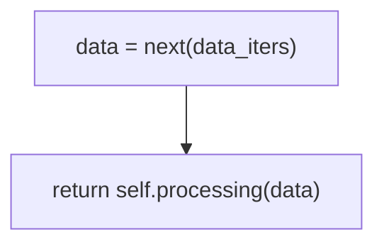
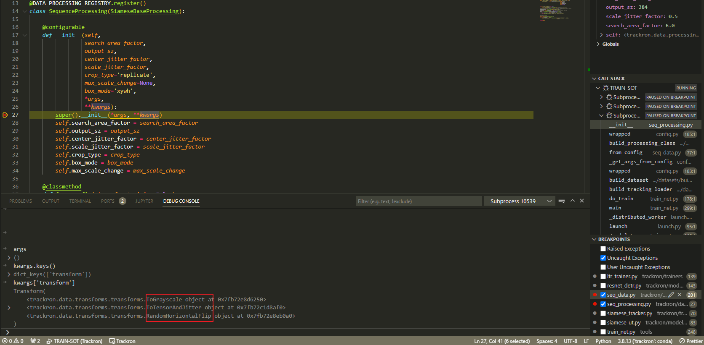
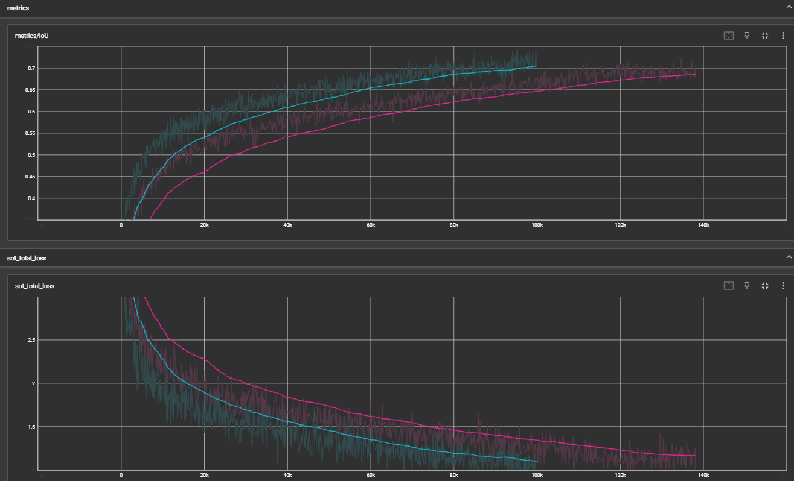
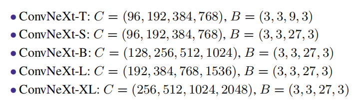
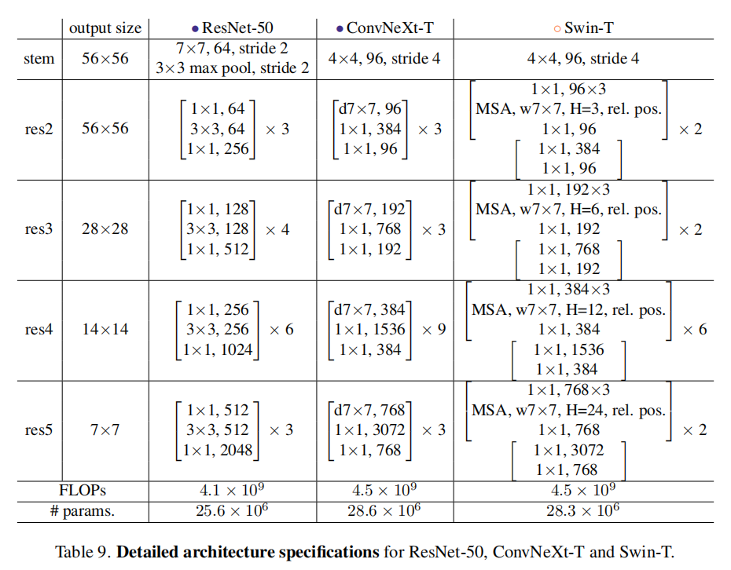
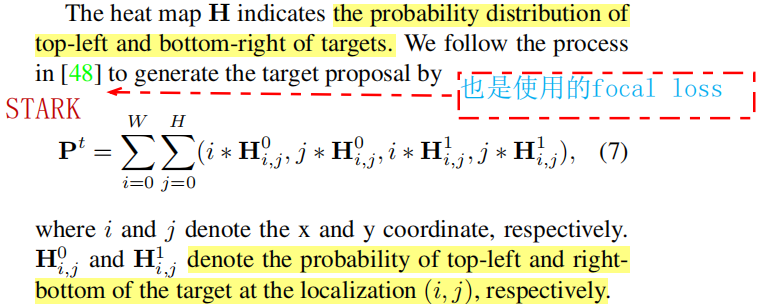
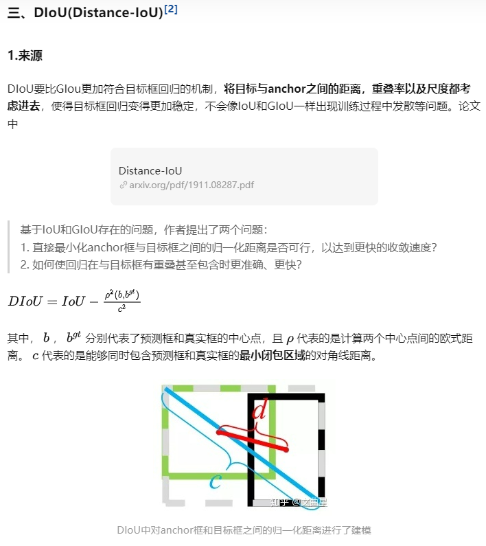
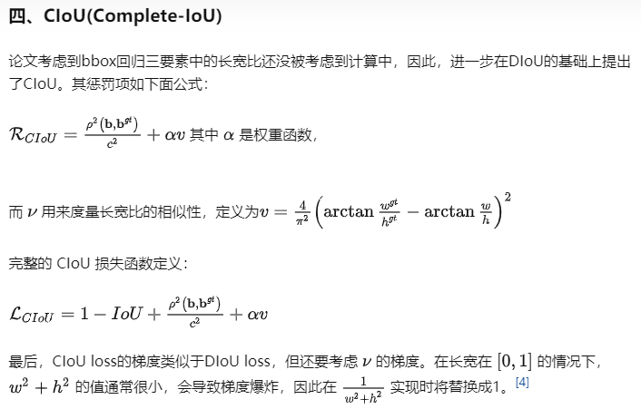

复现 + 修改 过程记录

> 注意官方代码更新时间！

# 环境搭建：直接使用 install.sh 安装！

> 提示：参考使用 `install.sh`，一步到位！
>
> 可以不用删除之前编译产生的文件！


删除编译产生的文件，

```shell
conda remove --name trackron --all
rm -rf dist build trackron/*.so *egg*
find -name "*pycache*" | xargs rm -r
```


创建一个虚拟环境 `trackron`，并安装相应的扩展包，

```shell
conda create -n trackron python=3.8

conda install pytorch==1.10.1 torchvision==0.11.2 torchaudio==0.10.1 cudatoolkit=11.3 -c pytorch

pip install git+https://github.com/TAO-Dataset/tao
# 备用方案
git clone https://github.com/TAO-Dataset/tao
cd tao & python setup.py develop  # 安装部署 tao

pip install cython  # 注意一定要提前安装，否则 cython_box 无法安装成功！
pip install -r requirements.txt

cd ..
python setup.py develop  # 将 trackron 安装部署
```

> <https://github.com/TAO-Dataset/tao>
>
> [pip install git(pip直接安装git上的项目)_吨吨不打野的博客-CSDN博客_pip 安装git](https://blog.csdn.net/Castlehe/article/details/119532679)

有关 `git+https` 的 `pkg` 的下载，只保留下载地址即可：`git+https://github.com/TAO-Dataset/tao`

不要直接使用作者提供的 `req.txt`!!! 因为里面包含了作者机器 或者 git 密钥等信息，下载会失败！！！将里面的 `==` 后面的信息去掉！

> 注意，
>
> - 安装 `trackron`，不要使用 `install`，否者不会生成 `trackron/_C.cpython-39-x86_64-linux-gnu.so`!!! 调用处 `from trackron import _C as OPS` 就会提示找不到的错误！！！
> - 修改 `Trackron` 的源代码之后，由于作者将其封装为一个 扩展包，因此需要 **重新编译** 安装！将修改进行同步更新！！！
>

```bash
rm -r build *egg* trackron/*.so
python setup.py develop
```


## error 解决

`pytorch1.11.0` 对于 `trackron` 编译不通过；`1.10.1`可通过！

将 `build.py` 中的 `from timm.optim import NovoGrad...` 中的 `NovoGrad` 去掉即可，最新版本中不包含说明已经被弃用！

> 使用 `conda install` 安装 `Pytorch` 时记得把最后的 `-c conda-forge` 下载源去掉，不然会很慢！只保留 `-c pytorch` 即可！！！


`trackron` 下面的 `_C.cpython-38-x86_64-linux-gnu.so` 也是编译生成的文件，如果需要重新编译，要把这个也要删除！！！

> ```
> git clone 128 error
> ```

- 直接将原仓库下载下来，然后使用 `python setup.py develop/install` 安装；


更改下载源，在 `setup.py` 同级目录下创建 `setup.cfg`,

```ini
[easy_install]
index_url = https://pypi.tuna.tsinghua.edu.cn/simple
```

记得删除 `.git` 文件夹！

- 创建一个新的文件夹，然后运行 `git clone git+https://...` 即可，具体是什么原因导致的，不清楚！！！个人猜想还是和 `git` 有关；

- 重启网络；


# TRAIN

> 单卡训练

如果不使用 `DDP` 进行训练，会报以下错误！

> 单机多卡训练

## 需要修改一些地方

> `scheduler` 修改：[Swin transformer TypeError: **init**() got an unexpected keyword argument ‘t_mul‘\_3DYour 的博客-CSDN 博客](https://blog.csdn.net/abc1831939662/article/details/123477853) 直接注释 提示缺少的参数

```python
trackron/solvers/build.py
lr_scheduler = CosineLRScheduler(
            optimizer,
            t_initial=num_iters,
            # XBL comment,
            # t_mul=cfg.SOLVER.LR_SCHEDULER.LR_CYCLE_MUL,
            lr_min=cfg.SOLVER.LR_SCHEDULER.LR_MIN,
            # XBL comment,
            # decay_rate=cfg.SOLVER.LR_SCHEDULER.DECAY_RATE,
            warmup_lr_init=cfg.SOLVER.LR_SCHEDULER.WARMUP_LR,
            warmup_t=cfg.SOLVER.LR_SCHEDULER.WARMUP_ITERS,
            cycle_limit=cfg.SOLVER.LR_SCHEDULER.LR_CYCLE_LIMIT,
            t_in_epochs=False,
            noise_range_t=noise_range,
            noise_pct=cfg.SOLVER.LR_SCHEDULER.LR_NOISE_PCT,
            noise_std=cfg.SOLVER.LR_SCHEDULER.LR_NOISE_STD,
            noise_seed=cfg.SEED,
        )
```

- `coco` 数据集路径：`self.img_pth = os.path.join(root, 'images/{}{}/'.format(split, version))`, 去掉 `images`

在 `Trackron/trackron/data/datasets/trainsets/coco_seq.py` 中。

- 修改 `read_csv` 的方法，解决输出的警告！

```python
Ctrl + Shift + F` : `squeeze=True
seq_ids = pandas.read_csv(file_path,
                                header=None,
                                squeeze=True,
                                dtype=np.int64).values.tolist()

# 修改为：注意 `squeeze` 必须带 `columns` 参数！
seq_ids = pandas.read_csv(
                file_path, header=None,
                dtype=np.int64).squeeze('columns').values.tolist()

# Trackron/trackron/models/layers/position_embedding.py
dim_t = self.temperature**(2 * (dim_t // 2) / self.num_pos_feats)
# 修改为
dim_t = self.temperature**(
            2 * (torch.div(dim_t, 2, rounding_mode="floor")) /
            self.num_pos_feats)
```

- 相应参数的修改，这里有一个疑问是默认的参数都存放在 `config.py` 中的，为什么没有成功读取出来呢？

`Trackron/trackron/solvers/build.py`,

```python
# decay_rate=cfg.SOLVER.LR_SCHEDULER.DECAY_RATE,
decay_rate=0.1,
```

- 修改 `DDP` 运行脚本

```shell
# config_file=$1
config_file="configs/utt/utt.yaml"

--nproc_per_node=2  # 这里修改为对应分 GPU 数量，个人理解，还是有些出入，修改为 3 会报错，提示 bachsize=4 cannot divide by 3, 即无法合适分配！
```

修改 `utt.yaml` 中的配置文件，将 `batchsize` 调整为 `3` 的倍数，实验中调整为 `24`。


成功运行的脚本，

```python
tools/dist_train.sh

# 查看参数等信息
tensorboard --logdir='./'  # 注意这里 outputs 里面必须包含 tfevents 文件，否者不会成功，或者说 tensorboard 的读取路径
```


## Q & A

> Q: `SOT` 训练时候的数据集是否全用到了？怎么查看？

A: 在配置文件 `utt.yaml` 或者 终端日志 输出中可以看到，对与 `SOT` 模式使用的训练数据集为 `SOT & coco` 数据集，并未使用到 `MOT` 数据集进行混合训练！


> Q: 是否可以在 `SOT & MOT` 之间进行切换？

A: 可以。具体实现是设置经过 30 个间隔，在两种模式之间进行切换。

`trackron/trackers/tracking_actor.py` 中注释的部分：`self.tracker.switch_tracking_mode(image, info)`


# RESUME

个人猜测从 `last_checkpoint` 进行加载，而非 `.pth` 文件！！！

`resume` 的时候不用手动指定 `WEIGHTS` 为 `last_checkpoint`，会自动读取 `last_checkpoint`！

只有在第一次运行的时候读取 `backbone` 预训练权重的时候蔡虎用到！

1. 修改 `utt.yaml` 中的 `weights`;

```yaml
# WEIGHTS: "https://download.pytorch.org/models/resnet50-19c8e357.pth"
WEIGHTS: "/home/guest/XieBailian/proj/Trackron/outputs/last_checkpoint"
```

## `ERROR` 解决

Q: 默认保存的模型只含有 model 相关的参数，没有学习率、迭代次数、优化器等相关参数

A: 是作者重新写了一个类继承了 `fvcore` 中的 `Checkpointer` 类，重写了 `save` 函数，导致父类的不起作用！

解决方法很简单：要么就对继承的类的函数进行重命名，要么就把其中覆写的部分删除！

- `trackron/checkpoint/tracking_checkpoint.py`: `func save()`

- `/home/guest/anaconda3/envs/trackron/lib/python3.8/site-packages/fvcore/common/checkpoint.py`: `meta` 官方的 `fvcore`

参考链接 1：[Py 之 fvcore：fvcore 库的简介、安装、使用方法之详细攻略\_一个处女座的程序猿的博客-CSDN 博客\_fvcore 安装](https://blog.csdn.net/qq_41185868/article/details/103881195)
参考链接 2：[How to resume training from last checkpoint? · Issue #148 · facebookresearch/detectron2](https://github.com/facebookresearch/detectron2/issues/148)


Q: 有关 `cosine` 学习率不变的问题

A: 调试：`trackron/trainers/ltr_trainer.py _stats_new_epoch()` 记录了学习率的变化！从这里入手；

*注意：*调试的时候如果一个 `GPU` 可以带动就用一张，否则才使用多张！


Q: 将训练设置为：`num_gpu=2, batch_size=24` 时，`loss` 直接从原来的 `0.3-0.4` 突变到 `0.6~` !

个人猜想：总的损失分配到每一个 `GPU` 上的平均损失，这样计算可能不是很准确！不过也有可能：$0.6 \times 2 = 1.2 = 0.4 \times 3$

batchsize 对训练的影响还是很大！batchsize 和 lr 配合训练（成倍数关系）

**如果 batchsize 变小，收敛就会变慢，就有可能很难训练，达到最优！**


Q: lr >= 0.6 否则再怎么缩小也只会使得训练越来越差！

A: 实验中将 `lr` 每 `500 iter` 减小 `1e-4 \* 0.05`，然而实际效果并不好，训练到 `560000` 左右后，模型的准确率大约低了 1 个百分点！


Q: VSCode 集成的 tensorboard 无法使用？重新安装 tensorboard 相关包！

```bash
pip list | grep tensorboard | xargs pip uninstall
```

卸载之后，直接 `Ctrl Shift P` 打开 `tensorboard` 即可，没有的话会直接安装！

总结：原因可能是 VSCode 版本升级之后和原来的 tensorboard 不兼容了！


# 修改为自己的模型

## 一、数据修改：搜索帧图片大小修改为全图


经调试检验：实际上作者就是使用的全图进行操作的！因此以下步骤均多余，但是对于理解整个程序的运行逻辑还是有帮助。


### 目前思路：将 `SEARCH.SIZE` 更改为全图大小

> 修改 `SOT` 图片大小，默认设置在配置文件中 `352` 即 `352*352`

`trackron/config/data_configs.py`, 320

`configs/utt/utt.yaml`, 352

直接搜索 `SEARCH.SIZE`，然后对 `SOT` 的搜索区域大小进行修改，初步考虑将 `SEARCH.SIZE` 替换为 `img_info` 中的 `w, h`。

**最终修改的地方：`trackron/data/processing/base.py`，将图片裁剪部分操作去除即可；默认的训练方式是 `SOT`。**

~~以上这里有问题！！！并不能简单地通过注释就修改图片的大小！图片大小的确定在 `SOT.DATASET.SEARCH.SIZE` 里面进行指定，通过搜索该关键字来确定哪里对图片进行了裁剪操作！~~


### TRACED

#### 相关文件

- `configs/utt/utt.yaml`

- 加载训练数据：`tools/train_net.py`

  ```python
  data = next(data_iters)
  ```

  

- `trackron/data/datasets/seq_data.py +200 processing`

  `84 --> 77 build_processing_class`

  `54, 53 utt.yaml`,

  ```yaml
  CLASS_NAME: "SequenceDataset"
  PROCESSING_NAME: "SequenceProcessing"
  ```

  

- `trackron/trackers/siamese_tracker.py +39 *self*.image_sample_size`

- 核心部分：`trackron/data/processing/base.py`

  `class SiamProcessing`

  对 `SEARCH IMAGE` 操作！

  ```python
  output_sz = cfg.SEARCH.SIZE
  
  crops, boxes, att_mask, mask_crops = prutils.jittered_center_crop
  
  ```
  
  
  
  
  


####  整体流程

> [Markdown mermaid种草(3)_ 流程图_CarnivoreRabbit的博客-CSDN博客](https://blog.csdn.net/horsee/article/details/113353413)

数据的调用流程如下图所示，




> `data['template_images']` 去了哪里？如果只有 `search_images` 如何进行训练？




A: `data['template_images']` = `data['search_boxes']`，但是目前遇到以下几个问题，

- template_images 的数据和 search_boxes 中的数据不匹配，主要包括，

  - template.shape: [3, 3, 384, 384]
  - search.shape: [3, 4]

  为什么 search_image 的数据如此少？


#### error

实际调用的是 `trackron/data/processing/seq_processing.py` 进行图片的变换操作的！而不是我们修改的 `trackron/data/processing/base.py` 中的 `SiamProcessing`，导致最终的修改并未生效，也就是**没有使用全图作为搜索区域**，之前的训练全都浪费！


将 `utt.yaml` 中的数据处理方式进行修改之后，

```yaml
# XBL changed
# PROCESSING_NAME: "SequenceProcessing"
PROCESSING_NAME: "SiamProcessing"
```

训练报错！提示找不到 `data['template_images']`，说明论文作者并不是使用的 `Siamese` 网络进行训练的！而是对 `search & template` 同时使用 `SequenceProcessing` 进行处理，而 `SequenceProcessing` 继承自 `SiameseBaseProcessing`，该 `class` 并未实现 `__call__()`，


> 阅读代码时，先读 下面的注释文档！！！作者在里面已经说明，`SiamProcessing` 是为了训练 `DiMP`！


> 疑问：`SiamProcessing` 中只有对 `search_images` 进行相关的变换操作，那么 `template_images` 的操作在哪里？


## 二、网络结构修改：BackBone修改为ConvNeXt（告一段落）

> 借鉴 `unicorn` 中的 `convnext`，直接拿过来使用，只需要修改部分代码即可！


~~实验中没有完全将 ConvNeXt 迁移到模型当中，而是参照 ConvNeXt 的更改进行相应的修改，对其中提分比较重要的部分进行改变！~~


通过训练发现：收敛很慢！反思了以下，由于 BackBone 的结构进行修改，而训练的时候将其 freeze，没办法训练，因此这样简单修改网络的结构模型行不通！只能将整个 ConvNeXt 迁移到模型中，并使用 ConvNeXt 的预训练模型！

存在的问题：尺寸不匹配，多个 Stage 的筛选，源代码肯定是要修改的，参考原始代码 `resnet.py`。


查看 resnet 的 forward 之后的输出结果 `outputs`，

```python
'layer2'
'layer3'
'layer4'
```


运行成功，最终的代码为，

```python
# Copyright (c) Meta Platforms, Inc. and affiliates.

# All rights reserved.

# This source code is licensed under the license found in the
# LICENSE file in the root directory of this source tree.

from functools import partial
import torch
import torch.nn as nn
import torch.nn.functional as F
from timm.models.layers import trunc_normal_, DropPath
import torch.utils.checkpoint as checkpoint

from .build import BACKBONE_REGISTRY


class Block(nn.Module):
    r""" ConvNeXt Block. There are two equivalent implementations:
    (1) DwConv -> LayerNorm (channels_first) -> 1x1 Conv -> GELU -> 1x1 Conv; all in (N, C, H, W)
    (2) DwConv -> Permute to (N, H, W, C); LayerNorm (channels_last) -> Linear -> GELU -> Linear; Permute back
    We use (2) as we find it slightly faster in PyTorch
    
    Args:
        dim (int): Number of input channels.
        drop_path (float): Stochastic depth rate. Default: 0.0
        layer_scale_init_value (float): Init value for Layer Scale. Default: 1e-6.
    """

    def __init__(self, dim, drop_path=0., layer_scale_init_value=1e-6):
        super().__init__()
        self.dwconv = nn.Conv2d(dim, dim, kernel_size=7, padding=3,
                                groups=dim)  # depthwise conv
        self.norm = LayerNorm(dim, eps=1e-6)
        self.pwconv1 = nn.Linear(
            dim,
            4 * dim)  # pointwise/1x1 convs, implemented with linear layers
        self.act = nn.GELU()
        self.pwconv2 = nn.Linear(4 * dim, dim)
        self.gamma = nn.Parameter(
            layer_scale_init_value * torch.ones((dim)),
            requires_grad=True) if layer_scale_init_value > 0 else None
        self.drop_path = DropPath(
            drop_path) if drop_path > 0. else nn.Identity()

    def forward(self, x):
        input = x
        x = self.dwconv(x)
        x = x.permute(0, 2, 3, 1)  # (N, C, H, W) -> (N, H, W, C)
        x = self.norm(x)
        x = self.pwconv1(x)
        x = self.act(x)
        x = self.pwconv2(x)
        if self.gamma is not None:
            x = self.gamma * x
        x = x.permute(0, 3, 1, 2)  # (N, H, W, C) -> (N, C, H, W)

        x = input + self.drop_path(x)
        return x


# @BACKBONES.register_module()
class ConvNeXt(nn.Module):
    r""" ConvNeXt
        A PyTorch impl of : `A ConvNet for the 2020s`  -
          https://arxiv.org/pdf/2201.03545.pdf

    Args:
        in_chans (int): Number of input image channels. Default: 3
        num_classes (int): Number of classes for classification head. Default: 1000
        depths (tuple(int)): Number of blocks at each stage. Default: [3, 3, 9, 3]
        dims (int): Feature dimension at each stage. Default: [96, 192, 384, 768]
        drop_path_rate (float): Stochastic depth rate. Default: 0.
        layer_scale_init_value (float): Init value for Layer Scale. Default: 1e-6.
        head_init_scale (float): Init scaling value for classifier weights and biases. Default: 1.
    """

    def __init__(self,
                 in_chans=3,
                 depths=[3, 3, 9, 3],
                 dims=[96, 192, 384, 768],
                 drop_path_rate=0.,
                 layer_scale_init_value=1e-6,
                 out_indices=[0, 1, 2, 3],
                 use_checkpoint=False):
        super().__init__()

        self.downsample_layers = nn.ModuleList(
        )  # stem and 3 intermediate downsampling conv layers
        stem = nn.Sequential(
            nn.Conv2d(in_chans, dims[0], kernel_size=4, stride=4),
            LayerNorm(dims[0], eps=1e-6, data_format="channels_first"))
        self.downsample_layers.append(stem)
        for i in range(3):
            downsample_layer = nn.Sequential(
                LayerNorm(dims[i], eps=1e-6, data_format="channels_first"),
                nn.Conv2d(dims[i], dims[i + 1], kernel_size=2, stride=2),
            )
            self.downsample_layers.append(downsample_layer)

        self.stages = nn.ModuleList(
        )  # 4 feature resolution stages, each consisting of multiple residual blocks
        dp_rates = [
            x.item() for x in torch.linspace(0, drop_path_rate, sum(depths))
        ]
        cur = 0
        for i in range(4):
            stage = nn.Sequential(*[
                Block(dim=dims[i],
                      drop_path=dp_rates[cur + j],
                      layer_scale_init_value=layer_scale_init_value)
                for j in range(depths[i])
            ])
            self.stages.append(stage)
            cur += depths[i]

        self.out_indices = out_indices

        norm_layer = partial(LayerNorm, eps=1e-6, data_format="channels_first")
        for i_layer in range(1, 4):
            layer = norm_layer(dims[i_layer])
            layer_name = f'norm{i_layer}'
            self.add_module(layer_name, layer)

        self.apply(self._init_weights)
        self.use_checkpoint = use_checkpoint

        # XBL add; trackron/models/arch/utt.py backbone_out_channels 会使用到！
        self._out_feature_channels = dict(
            zip([f'layer{i+1}' for i in range(4)], [96, 192, 384, 768]))
        self._out_feature_channels['conv1'] = 96

    def _init_weights(self, m):
        if isinstance(m, (nn.Conv2d, nn.Linear)):
            trunc_normal_(m.weight, std=.02)
            nn.init.constant_(m.bias, 0)

    def init_weights(self, pretrained=None):
        """Initialize the weights in backbone.
        Args:
            pretrained (str, optional): Path to pre-trained weights.
                Defaults to None.
        """

        def _init_weights(m):
            if isinstance(m, nn.Linear):
                trunc_normal_(m.weight, std=.02)
                if isinstance(m, nn.Linear) and m.bias is not None:
                    nn.init.constant_(m.bias, 0)
            elif isinstance(m, nn.LayerNorm):
                nn.init.constant_(m.bias, 0)
                nn.init.constant_(m.weight, 1.0)

        if isinstance(pretrained, str):
            self.apply(_init_weights)
            # logger = get_root_logger()
            # load_checkpoint(self, pretrained, strict=False, logger=logger)
        elif pretrained is None:
            self.apply(_init_weights)
        else:
            raise TypeError('pretrained must be a str or None')

    def forward_features(self, x):
        outs = []
        for i in range(4):
            x = self.downsample_layers[i](x)
            if self.use_checkpoint:
                x = checkpoint.checkpoint(self.stages[i], x)
            else:
                x = self.stages[i](x)
            if i in self.out_indices:
                norm_layer = getattr(self, f'norm{i}')
                x_out = norm_layer(x)
                outs.append(x_out)

        # XBL comment;
        # return outs
        return dict(zip(['layer2', 'layer3', 'layer4'], outs))

    def forward(self, x):
        x = self.forward_features(x)
        return x


class LayerNorm(nn.Module):
    r""" LayerNorm that supports two data formats: channels_last (default) or channels_first. 
    The ordering of the dimensions in the inputs. channels_last corresponds to inputs with 
    shape (batch_size, height, width, channels) while channels_first corresponds to inputs 
    with shape (batch_size, channels, height, width).
    """

    def __init__(self,
                 normalized_shape,
                 eps=1e-6,
                 data_format="channels_last"):
        super().__init__()
        self.weight = nn.Parameter(torch.ones(normalized_shape))
        self.bias = nn.Parameter(torch.zeros(normalized_shape))
        self.eps = eps
        self.data_format = data_format
        if self.data_format not in ["channels_last", "channels_first"]:
            raise NotImplementedError
        self.normalized_shape = (normalized_shape, )

    def forward(self, x):
        if self.data_format == "channels_last":
            return F.layer_norm(x, self.normalized_shape, self.weight,
                                self.bias, self.eps)
        elif self.data_format == "channels_first":
            u = x.mean(1, keepdim=True)
            s = (x - u).pow(2).mean(1, keepdim=True)
            x = (x - u) / torch.sqrt(s + self.eps)
            x = self.weight[:, None, None] * x + self.bias[:, None, None]
            return x


# model_urls = {
#     "convnext_tiny_1k": "https://dl.fbaipublicfiles.com/convnext/convnext_tiny_1k_224_ema.pth",
#     "convnext_small_1k": "https://dl.fbaipublicfiles.com/convnext/convnext_small_1k_224_ema.pth",
#     "convnext_base_1k": "https://dl.fbaipublicfiles.com/convnext/convnext_base_1k_224_ema.pth",
#     "convnext_large_1k": "https://dl.fbaipublicfiles.com/convnext/convnext_large_1k_224_ema.pth",
#     "convnext_base_22k": "https://dl.fbaipublicfiles.com/convnext/convnext_base_22k_224.pth",
#     "convnext_large_22k": "https://dl.fbaipublicfiles.com/convnext/convnext_large_22k_224.pth",
#     "convnext_xlarge_22k": "https://dl.fbaipublicfiles.com/convnext/convnext_xlarge_22k_224.pth",
# }


@BACKBONE_REGISTRY.register()
def convnext_tiny(cfg):
    model = ConvNeXt(
        depths=[3, 3, 9, 3],
        dims=[96, 192, 384, 768],
        out_indices=[1, 2, 3],
        drop_path_rate=0.4,
        layer_scale_init_value=1.0,
    )

    return model


def convnext_base(**kwargs):
    model = ConvNeXt(depths=[3, 3, 27, 3],
                     dims=[128, 256, 512, 1024],
                     out_indices=[1, 2, 3],
                     drop_path_rate=0.6,
                     layer_scale_init_value=1.0,
                     **kwargs)
    return model


def convnext_large(**kwargs):
    model = ConvNeXt(depths=[3, 3, 27, 3],
                     dims=[192, 384, 768, 1536],
                     out_indices=[1, 2, 3],
                     drop_path_rate=0.7,
                     layer_scale_init_value=1.0,
                     **kwargs)
    return model

```

对应的 `utt.yaml` 文件为，

```yaml
MODEL:
    META_ARCHITECTURE: "UnifiedTransformerTracker2"
    # XBL comment; 从头开始训练的时候用到，和下面的 backbone 搭配使用，同时进行修改
    # WEIGHTS: "checkpoints/backbone/resnet50-19c8e357.pth"
    WEIGHTS: "checkpoints/backbone/convnext_tiny_1k_224_ema.pth"
    # XBL comment; 测试的时候才需要修改，--resume 的时候不需要修改
    # WEIGHTS: "/home/guest/XieBailian/proj/Trackron/outputs/best.pth"
    # WEIGHTS: "/home/guest/XieBailian/proj/Trackron/outputs/last_checkpoint"
    BACKBONE:
        # XBL comment; 修改 backbone 为 convnext_tiny
        # NAME: "resnet50"
        NAME: "convnext_tiny"
        OUTPUT_LAYERS: ["layer2", "layer3", "layer4"]
        FROZEN_STAGES: -1
        NORM: SyncBN
    FEATURE_DIM: 512
    NUM_QUERIES: 500
    POSITION_EMBEDDING: "sine"
    NUM_CLASS: 20
    SOT:
        FEATURE_DIM: 512
        POOL_SIZE: 7
        POOL_SCALES: [0.0625]
        POOL_SAMPLE_RATIO: 2
        POOL_TYPE: "ROIAlignV2"
        # TRACED:
        BOX_HEAD:
            NAME: "Corner2"
            INPUT_DIM: 512
            HIDDEN_DIM: 512
    MOT:
        POOL_SIZE: 7
        POOL_SCALES: [0.125, 0.0625, 0.03125, 0.015625]
        POOL_SAMPLE_RATIO: 2
        POOL_TYPE: "ROIAlignV2"
    # TRACED:
    BOX_HEAD:
        HIDDEN_DIM: 512
        INPUT_DIM: 512
    # TRACED:
    TRACK_HEAD:
        OUTPUT_SCORE: False
        ITERATIONS: 6
        FEATURE_DIM: 512
        DYNAMIC_DIM: 64
        NUM_DYNAMIC: 2
        DIM_FEEDFORWARD: 1024
        DROPOUT: 0.1
        EXPAND_SCALE: 1.0

# TRACED: SOT 相关的所有配置！
SOT:
    OBJECTIVE:
        NAME: "SequenceSOTObjective"
    DATASET:
        ROOT: "/data"
        # TRACED: 数据处理方式
        CLASS_NAME: "SequenceDataset"
        PROCESSING_NAME: "SequenceProcessing"
        BOX_MODE: "xyxy"
        MAX_SAMPLE_INTERVAL: 400
        SAMPLE_MODE: "interval"
        TRAIN:
            DATASET_NAMES: ["COCO17", "lasot", "trackingnet", "got10k_train"]
            DATASETS_RATIO: [1, 1, 1, 1]
        SEARCH:
            # XBL changed;
            SIZE: 352
            # SIZE: 384  # template 的大小！
            FACTOR: 6.0
            CENTER_JITTER: 5.5
            SCALE_JITTER: 0.5
            FRAMES: 3
        TEST:
            DATASET_NAMES: ["lasot"]
            # DATASET_NAMES: ["got10k"]
            # DATASET_NAMES: ["trackingnet"]
            SPLITS: [""]
            VERSIONS: [""]

    DATALOADER:
        # XBL comment;
        NUM_WORKERS: 0
        STACK_DIM: 0
        COLLATE_FN: "trival"
        # XBL changed; 配合 GPU 数量，能够被整除
        BATCH_SIZE: 24

MOT:
    OBJECTIVE:
        NAME: "MOTObjective3"
        # NAME: "MOTObjective"
        NUM_CLASS: 20
    DATASET:
        ROOT: "/data"
        CLASS_NAME: "MOTDataset"
        PROCESSING_NAME: "MOTProcessing"
        MAX_SAMPLE_INTERVAL: 200
        SAMPLE_MODE: "interval"
        TRAIN:
            DATASET_NAMES: ["mot_trainhalf"]
            DATASETS_RATIO: [1]
            MIN_SIZE: [300]
            MODE: "pair"
        TEST:
            # DATASET_NAMES: ["lasot"]
            # SPLITS: [""]
            # VERSIONS: [""]
            DATASET_NAMES: ["mot_pub"]
            SPLITS: ["val_half"]
            VERSIONS: ["17"]

    DATALOADER:
        NUM_WORKERS: 8
        STACK_DIM: 0
        COLLATE_FN: "trival"
        BATCH_SIZE: 64

# TRACED: 训练相关设置
SOLVER:
    # XBL changed;
    MAX_ITER: 400000
    BASE_LR: 1e-4
    OPTIMIZER_NAME: "adamw"
    LR_SCHEDULER:
        NAME: "cosine"
        WARMUP_ITERS: 2000
        WARMUP_LR: 1e-6
        LR_MIN: 1e-6
    # XBL comment; debug/run
    CHECKPOINT_PERIOD: 1000
    CLIP_GRADIENTS:
        ENABLED: False
        CLIP_TYPE: "norm"
        CLIP_VALUE: 0.1

OUTPUT_DIR: "./outputs"
CUDNN_BENCHMARK: False
SYNC_BN: True

SEED: 0

TEST:
    EVAL_PERIOD: 0
    # XBL changed; 8 --> -1 训练的时候不进行测试，要测试就单独进行！
    ETEST_PERIOD: -1

TRACKER:
    NAME: "SiameseTracker"
    MEMORY_SIZE: 2
    # PUBLIC_DETECTION: False
    PUBLIC_DETECTION: True
    DETECTION_THRESH: 0.4
    TRACKING_THRESH: 1.0
    MATCHING_THRESH: 1.2

```


主要修改了预训练权重，backbone，以及训练中的设置（每隔多少次进行一次测试！个人修改为最后的时候那次进行测试即可，前面的测试没有意义！）

甚至可以直接不用在训练的时候进行测试，直接在 `train_net.py` 中将以下代码注释，

```python
if (cfg.TEST.ETEST_PERIOD > 0 and
                (iteration + 1) % cfg.TEST.ETEST_PERIOD == 0
                    or iteration == max_iter - 1):
                results = do_test(cfg, model, tracking_mode=mode)
                write_test_metric(results, storage)
                # Compared to "train_net.py", the test results are not dumped to EventStorage
                comm.synchronize()
```

或者将 `ETEST_PERIOD` 参数设置为 `-1` 即可！


此外，还修改的文件包括 `trackron/models/backbone/__init__.py`,

```python
from .resnet import resnet18, resnet50, resnet_baby
from .resnet_siamrpn import resnet50_rpn
from .swin_transformer import swin_trans_b, swin_trans_s, swin_trans_t
from .resnet_detr import resnet50_detr
from .dla import dla34
from .yolox import yolox
# XBL add;
from .convnext import convnext_tiny, convnext_base, convnext_large
from .build import build_backbone, BACKBONE_REGISTRY  # noqa F401 isort:skip

# from .backbone import Backbone

__all__ = list(globals().keys())

```


注意整个修改过程和 `trackron/models/arch/utt.py` 密切相关，参考该文件以及 `resnet.py` 进行修改！

先修改整体，然后调试运行，发现问题之后再解决！


### BUG 训练效果很差，上不去！（只使用 2GPU 的原因！）

- green, 2GPU ResNet50
- purple, 2GPU ConvNeXt-Tiny




目前想到的问题：backbone 的输入输出图像尺寸不匹配！

#### ConvNeXt

```python
def forward(self, x):
    x = self.forward_features(x)
    return x
```

- `input x`

  ```python
  x.shape
  torch.Size([24, 3, 352, 352])
  ```

  

- `output x`

  ```python
  for k in x.keys():
      print(x[k].shape)
  torch.Size([24, 192, 44, 44])
  torch.Size([24, 384, 22, 22])
  torch.Size([24, 768, 11, 11])
  ```


#### ResNet

```python
def forward(self, x, output_layers=None, remove_first_pool=False):
    """ Forward pass with input x. The output_layers specify the feature blocks which must be returned """
    outputs = OrderedDict()
```

- `input x`

  ```python
  x.shape
  torch.Size([24, 3, 352, 352])
  ```

  

- `output x`

  ```python
  for k in outputs.keys():
      print(outputs[k].shape)
  torch.Size([24, 512, 44, 44])
  torch.Size([24, 1024, 22, 22])
  torch.Size([24, 2048, 11, 11])
  ```


就目前的调试结果来看，并没有出错！


ConvNeXt 几大结构模型，

- Tiny
- Small
- Base
- Large
- X-Large






经过多次测试，只有 `convnetxt-tiny-imagenet1k-224.pth` 可以使用！其余的全报显存不足！


## 三、损失函数等 micro design

实验中损失函数设置在：`trackron/models/objectives/sot_objective.py`，

```python
# TRACED: 训练日志中打印的使用的损失函数
@OBJECTIVE_REGISTRY.register()
class SequenceSOTObjective(SOTObjective):
```

在这里添加 focal loss，经过 OSTrack 对比调研，发现 focal loss 需要一些额外的数据！


### Focal Loss（告一段落）

> 参考链接1：[caopulan/comprehension_of_focal_loss: a notebook to comprehense focal loss](https://github.com/caopulan/comprehension_of_focal_loss)


不好修改！对于 tracking 而言，Stark 也使用的是 focal loss，OSTrack 貌似就引用了 STARK！具体内容明天再看！

经再次阅读原论文，发现使用的损失函数中加入了 Generalized Focal Loss！




> 参考链接1：[目标检测算法的大体框架-------backbone、head、neck_gz7seven的博客-CSDN博客_目标检测neck](https://blog.csdn.net/guzhao9901/article/details/120676467)

- `backbone` 用于特征提取！提取不同尺度、不同感受野下、不同类别的目标特征，以完成目标检测；
- `neck` 对 `backbone` 不同阶段的特征进行融合加工，增强网络的表达能力（一般使用 `FPN`）；`neck` 的数量决定了 `head` 的数量，即不同尺度的样本如何分配到不同的 `head`。
- `head` 检测头，即网络模型的最后那部分，用于检测目标的种类的位置；

个人理解：`backbone` 就相当于 body，`neck` 相当于 脖子，`head` 相当于人的头部。


### DIOU/CIOU

> - [Zzh-tju/CIoU: Complete-IoU (CIoU) Loss and Cluster-NMS for Object Detection and Instance Segmentation (YOLACT)](https://github.com/Zzh-tju/CIoU)
>
> - [IoU、GIoU、DIoU、CIoU损失函数的那点事儿 - 知乎](https://zhuanlan.zhihu.com/p/94799295)






官方实现代码，直接计算得到 DIOU/CIOU-Loss，而非 DIOU/CIOU,
$$
Loss(DIOU/CIOU) = 1 - DIOU/CIOU
$$


```python
def ciou(bboxes1, bboxes2):
    bboxes1 = torch.sigmoid(bboxes1)
    bboxes2 = torch.sigmoid(bboxes2)
    rows = bboxes1.shape[0]
    cols = bboxes2.shape[0]
    cious = torch.zeros((rows, cols))
    if rows * cols == 0:
        return cious
    exchange = False
    if bboxes1.shape[0] > bboxes2.shape[0]:
        bboxes1, bboxes2 = bboxes2, bboxes1
        cious = torch.zeros((cols, rows))
        exchange = True
    w1 = torch.exp(bboxes1[:, 2])
    h1 = torch.exp(bboxes1[:, 3])
    w2 = torch.exp(bboxes2[:, 2])
    h2 = torch.exp(bboxes2[:, 3])
    area1 = w1 * h1
    area2 = w2 * h2
    center_x1 = bboxes1[:, 0]
    center_y1 = bboxes1[:, 1]
    center_x2 = bboxes2[:, 0]
    center_y2 = bboxes2[:, 1]

    inter_l = torch.max(center_x1 - w1 / 2,center_x2 - w2 / 2)
    inter_r = torch.min(center_x1 + w1 / 2,center_x2 + w2 / 2)
    inter_t = torch.max(center_y1 - h1 / 2,center_y2 - h2 / 2)
    inter_b = torch.min(center_y1 + h1 / 2,center_y2 + h2 / 2)
    inter_area = torch.clamp((inter_r - inter_l),min=0) * torch.clamp((inter_b - inter_t),min=0)

    c_l = torch.min(center_x1 - w1 / 2,center_x2 - w2 / 2)
    c_r = torch.max(center_x1 + w1 / 2,center_x2 + w2 / 2)
    c_t = torch.min(center_y1 - h1 / 2,center_y2 - h2 / 2)
    c_b = torch.max(center_y1 + h1 / 2,center_y2 + h2 / 2)

    inter_diag = (center_x2 - center_x1)**2 + (center_y2 - center_y1)**2
    c_diag = torch.clamp((c_r - c_l),min=0)**2 + torch.clamp((c_b - c_t),min=0)**2

    union = area1+area2-inter_area
    u = (inter_diag) / c_diag
    iou = inter_area / union
    v = (4 / (math.pi ** 2)) * torch.pow((torch.atan(w2 / h2) - torch.atan(w1 / h1)), 2)
    with torch.no_grad():
        S = (iou>0.5).float()
        alpha= S*v/(1-iou+v)
    cious = iou - u - alpha * v
    cious = torch.clamp(cious,min=-1.0,max = 1.0)
    if exchange:
        cious = cious.T
    return torch.sum(1-cious)

def diou(bboxes1, bboxes2):
    bboxes1 = torch.sigmoid(bboxes1)
    bboxes2 = torch.sigmoid(bboxes2)
    rows = bboxes1.shape[0]
    cols = bboxes2.shape[0]
    cious = torch.zeros((rows, cols))
    if rows * cols == 0:
        return cious
    exchange = False
    if bboxes1.shape[0] > bboxes2.shape[0]:
        bboxes1, bboxes2 = bboxes2, bboxes1
        cious = torch.zeros((cols, rows))
        exchange = True
    w1 = torch.exp(bboxes1[:, 2])
    h1 = torch.exp(bboxes1[:, 3])
    w2 = torch.exp(bboxes2[:, 2])
    h2 = torch.exp(bboxes2[:, 3])
    area1 = w1 * h1
    area2 = w2 * h2
    center_x1 = bboxes1[:, 0]
    center_y1 = bboxes1[:, 1]
    center_x2 = bboxes2[:, 0]
    center_y2 = bboxes2[:, 1]

    inter_l = torch.max(center_x1 - w1 / 2,center_x2 - w2 / 2)
    inter_r = torch.min(center_x1 + w1 / 2,center_x2 + w2 / 2)
    inter_t = torch.max(center_y1 - h1 / 2,center_y2 - h2 / 2)
    inter_b = torch.min(center_y1 + h1 / 2,center_y2 + h2 / 2)
    inter_area = torch.clamp((inter_r - inter_l),min=0) * torch.clamp((inter_b - inter_t),min=0)

    c_l = torch.min(center_x1 - w1 / 2,center_x2 - w2 / 2)
    c_r = torch.max(center_x1 + w1 / 2,center_x2 + w2 / 2)
    c_t = torch.min(center_y1 - h1 / 2,center_y2 - h2 / 2)
    c_b = torch.max(center_y1 + h1 / 2,center_y2 + h2 / 2)

    inter_diag = (center_x2 - center_x1)**2 + (center_y2 - center_y1)**2
    c_diag = torch.clamp((c_r - c_l),min=0)**2 + torch.clamp((c_b - c_t),min=0)**2

    union = area1+area2-inter_area
    u = (inter_diag) / c_diag
    iou = inter_area / union
    dious = iou - u
    dious = torch.clamp(dious,min=-1.0,max = 1.0)
    if exchange:
        dious = dious.T
    return torch.sum(1-dious)
```


修改为 CIOU/DIOU，

- `trackron/models/objectives/sot_objective.py` 训练损失函数所有相关，

  ```python
  @classmethod
  def from_config(cls, cfg):
      # TRACED: 损失函数定义
      # loss_func = {"loss_bbox": F.l1_loss, "loss_giou": giou_loss, "loss_mask": LovaszSegLoss()}
      loss_func = {
          "loss_bbox": F.l1_loss,
          "loss_giou": giou_loss,
          "loss_mask": partial(F.binary_cross_entropy_with_logits, reduction='mean')
      }
      loss_weight = {
          "loss_bbox": cfg.WEIGHT.LOSS_BBOX,
          "loss_giou": cfg.WEIGHT.LOSS_GIOU,
          "loss_mask": cfg.WEIGHT.LOSS_MASK,
      }
  
      return {"loss_func": loss_func, "loss_weight": loss_weight}
  ```

  其中，`loss_giou` 这里根据情况看是修改 `giou_loss` 这个函数，还是修改这个变量名，重新创建新的 `ciou/diou_loss`，然后指定该值。

  个人推荐修改 `giou_loss` 的实现，因为不知道后面哪里还会使用到 `giou_loss`，这样稳妥点，源文件修改之后的就不用一一修改了！

  

- `trackron/models/objectives/losses/box_loss.py`

  ```python
  def complete_iou(bboxes1, bboxes2):
      # XBL changed; 使用原来的 IOU 计算方式！
      # bboxes1 = torch.sigmoid(bboxes1)
      # bboxes2 = torch.sigmoid(bboxes2)
      assert (bboxes1[:, 2:] >= bboxes1[:, :2]).all()
      assert (bboxes2[:, 2:] >= bboxes2[:, :2]).all()
      t_iou, _ = box_iou(bboxes1, bboxes2)  # (N,)
  
      rows = bboxes1.shape[0]
      cols = bboxes2.shape[0]
      cious = torch.zeros((rows, cols))
      if rows * cols == 0:
          return cious
      exchange = False
      if bboxes1.shape[0] > bboxes2.shape[0]:
          bboxes1, bboxes2 = bboxes2, bboxes1
          cious = torch.zeros((cols, rows))
          exchange = True
  
      w1 = torch.exp(bboxes1[:, 2])
      h1 = torch.exp(bboxes1[:, 3])
      w2 = torch.exp(bboxes2[:, 2])
      h2 = torch.exp(bboxes2[:, 3])
  
      area1 = w1 * h1
      area2 = w2 * h2
  
      center_x1 = bboxes1[:, 0]
      center_y1 = bboxes1[:, 1]
      center_x2 = bboxes2[:, 0]
      center_y2 = bboxes2[:, 1]
  
      inter_l = torch.max(center_x1 - w1 / 2, center_x2 - w2 / 2)
      inter_r = torch.min(center_x1 + w1 / 2, center_x2 + w2 / 2)
      inter_t = torch.max(center_y1 - h1 / 2, center_y2 - h2 / 2)
      inter_b = torch.min(center_y1 + h1 / 2, center_y2 + h2 / 2)
      inter_area = torch.clamp((inter_r - inter_l), min=0) * torch.clamp(
          (inter_b - inter_t), min=0)
  
      c_l = torch.min(center_x1 - w1 / 2, center_x2 - w2 / 2)
      c_r = torch.max(center_x1 + w1 / 2, center_x2 + w2 / 2)
      c_t = torch.min(center_y1 - h1 / 2, center_y2 - h2 / 2)
      c_b = torch.max(center_y1 + h1 / 2, center_y2 + h2 / 2)
  
      inter_diag = (center_x2 - center_x1)**2 + (center_y2 - center_y1)**2
      c_diag = torch.clamp((c_r - c_l), min=0)**2 + torch.clamp(
          (c_b - c_t), min=0)**2
  
      union = area1 + area2 - inter_area
      u = (inter_diag) / c_diag
      iou = inter_area / union
      v = (4 / (math.pi**2)) * torch.pow(
          (torch.atan(w2 / h2) - torch.atan(w1 / h1)), 2)
      with torch.no_grad():
          S = (iou > 0.5).float()
          alpha = S * v / (1 - iou + v)
      cious = iou - u - alpha * v
      cious = torch.clamp(cious, min=-1.0, max=1.0)
      if exchange:
          cious = cious.T
  
      # return torch.sum(1 - cious), t_iou
      return cious, t_iou
  
  
  def distance_iou(bboxes1, bboxes2):
      # XBL changed; 使用原来的 IOU 计算方式！
      # bboxes1 = torch.sigmoid(bboxes1)
      # bboxes2 = torch.sigmoid(bboxes2)
      assert (bboxes1[:, 2:] >= bboxes1[:, :2]).all()
      assert (bboxes2[:, 2:] >= bboxes2[:, :2]).all()
      t_iou, _ = box_iou(bboxes1, bboxes2)  # (N,)
  
      rows = bboxes1.shape[0]
      cols = bboxes2.shape[0]
      cious = torch.zeros((rows, cols))
      if rows * cols == 0:
          return cious
      exchange = False
      if bboxes1.shape[0] > bboxes2.shape[0]:
          bboxes1, bboxes2 = bboxes2, bboxes1
          cious = torch.zeros((cols, rows))
          exchange = True
      w1 = torch.exp(bboxes1[:, 2])
      h1 = torch.exp(bboxes1[:, 3])
      w2 = torch.exp(bboxes2[:, 2])
      h2 = torch.exp(bboxes2[:, 3])
      area1 = w1 * h1
      area2 = w2 * h2
      center_x1 = bboxes1[:, 0]
      center_y1 = bboxes1[:, 1]
      center_x2 = bboxes2[:, 0]
      center_y2 = bboxes2[:, 1]
  
      inter_l = torch.max(center_x1 - w1 / 2, center_x2 - w2 / 2)
      inter_r = torch.min(center_x1 + w1 / 2, center_x2 + w2 / 2)
      inter_t = torch.max(center_y1 - h1 / 2, center_y2 - h2 / 2)
      inter_b = torch.min(center_y1 + h1 / 2, center_y2 + h2 / 2)
      inter_area = torch.clamp((inter_r - inter_l), min=0) * torch.clamp(
          (inter_b - inter_t), min=0)
  
      c_l = torch.min(center_x1 - w1 / 2, center_x2 - w2 / 2)
      c_r = torch.max(center_x1 + w1 / 2, center_x2 + w2 / 2)
      c_t = torch.min(center_y1 - h1 / 2, center_y2 - h2 / 2)
      c_b = torch.max(center_y1 + h1 / 2, center_y2 + h2 / 2)
  
      inter_diag = (center_x2 - center_x1)**2 + (center_y2 - center_y1)**2
      c_diag = torch.clamp((c_r - c_l), min=0)**2 + torch.clamp(
          (c_b - c_t), min=0)**2
  
      union = area1 + area2 - inter_area
      u = (inter_diag) / c_diag
      iou = inter_area / union
      dious = iou - u
      dious = torch.clamp(dious, min=-1.0, max=1.0)
      if exchange:
          dious = dious.T
  
      # return torch.sum(1 - dious), t_iou
      return dious, t_iou
  
  
  def generalized_box_iou(boxes1, boxes2):
      """
      Note that this implementation is different from DETR's!!!
  
      Generalized IoU from https://giou.stanford.edu/
      The boxes should be in [x0, y0, x1, y1] format
      boxes1: (N, 4)
      boxes2: (N, 4)
      """
      # degenerate boxes gives inf / nan results
      # so do an early check
      # try:
      assert (boxes1[:, 2:] >= boxes1[:, :2]).all()
      assert (boxes2[:, 2:] >= boxes2[:, :2]).all()
      iou, union = box_iou(boxes1, boxes2)  # (N,)
  
      lt = torch.min(boxes1[:, :2], boxes2[:, :2])
      rb = torch.max(boxes1[:, 2:], boxes2[:, 2:])
  
      wh = (rb - lt).clamp(min=0)  # (N,2)
      area = wh[:, 0] * wh[:, 1]  # (N,)
  
      return iou - (area - union) / area, iou
  
  
  def giou_loss(boxes1, boxes2):
      """
      :param boxes1: (N, 4) (x1,y1,x2,y2)
      :param boxes2: (N, 4) (x1,y1,x2,y2)
      :return:
      """
      # giou, iou = generalized_box_iou(boxes1, boxes2)
      # return (1 - giou).mean(), iou.mean()
  
      # XBL changed: giou --> ciou/diou
      # ciou, iou = complete_iou(boxes1, boxes2)
      # return (1 - ciou).mean(), iou.mean()
  
      diou, iou = distance_iou(boxes1, boxes2)
      return (1 - diou).mean(), iou.mean()
  ```

  注意：相对于官方实现，没有使用 `torch.sigmoid()`，同时返回的时候没有使用 `torch.sum(1 - dious)`，该操作在后面的 `giou_loss` 中实现！


#### 效果

修改为 `DIOU` 之后，

- 收敛加快，`IOU` 更加稳定，不会出现太大的波动；
- `losses/box_giou_loss` 下降趋势较大（可以理解为收敛加快？）


# Debug

由于需要 3 张 GPU 同时使用时，才能够保证数据能够被加载进来！否则会报显存不足的错误！

既然不能够使用单张 GPU，也就是单个 `Process`，所以在 VSCode 调试的时候可以使用以下技巧：

1. 对 `Subprocess` （每个 `Subprocess` 都有一个 `MainThread`）进行单独的调试，直接以 `debug` 的模式运行程序；

2. 然后在单个 `Process` 上暂停，然后就可以方便地进行调试！

   > 第一次暂停的时候可能是随机停在某个地方的，但是只要打好断点，继续运行应该就可以跳转到我们想要调试的位置！

> 注意：整个调试过程中，除了当前正在调试的进程外，其他进程照常运行！


对于需要 `python -m torch.distributed.lauch --num_proc_node=x main.py` 调试方法，

直接 copy 一份 `launch.py` 文件到项目根目录，然后指定调试运行该文件，其余的全部作为参数放入到 `args` 里面！

```json
```


## Tensorboard 可视化

`outputs/events.out.tfevents.1662602635.guest-server.26001.0` 文件不要删除，否则历史记录全部丢失，可视化的时候就无法找到并显示之前的 `loss/metrics` 等信息！

> smoothing 设置为 0.9 参考对比明显！


## coco 相关

~~所有的图片分辨率为  $480 \times 640$~~

不是所有的图片分辨率都相同，大部分相同而已！


##  为调试做的修改

设置 total batch size，增加一个参数，同时在 `tran_net.py` 中对原来 `utt.yaml` 中读取的进行修改，具体如下。


`utt.yaml`,

```yaml
# OUTPUT_DIR: "./outputs"
OUTPUT_DIR: "./output_gpu2"
```


`trackron/engine/defaults.py`,

```python
# XBL add;
parser.add_argument("--batch_size",
                    type=int,
                    default=24,
                    help="total batch size of all gpus!")
```


`tools/train_net.py`,

> [AttributeError: Attempted to set WEIGHTS to /checkpoints/FRCN-V2-39-3x/model_final.pth, but CfgNode is immutable · Issue #4 · youngwanLEE/vovnet-detectron2](https://github.com/youngwanLEE/vovnet-detectron2/issues/4)
>
> ```shell
> AttributeError: Attempted to set BATCH_SIZE to 16, but CfgNode is immutable
> ```

```python
def main(args):
    cfg = setup_cfg(args)
    # XBL add;
    cfg.defrost()  # 解冻，使得数据可以被修改
    cfg.OUTPUT_DIR = args.output_dir
    cfg.SOT.DATALOADER.BATCH_SIZE = args.batch_size
    cfg.freeze()  # 重新将其锁住，禁止修改！
    logger.info(f"total batch size is {cfg.SOT.DATALOADER.BATCH_SIZE}!")
    default_setup(cfg, args)
```


`.vscode/launch.json`,

```json
{
    "name": "TRAIN-SOT-GPU2",
    "type": "python",
    "request": "launch",
    "program": "tools/train_net.py",
    "console": "integratedTerminal",
    "justMyCode": true,
    "args": [
        "--config-file",
        "configs/utt/utt.yaml",
        "--config-func",
        "utt",
        // "--resume", // ！！！从中断的地方开始继续训练，如果重新开始训练注释掉！
        "--num-gpus",
        "2",
        "--batch_size",
        "16", // 2 张 GPU，2 * 8 = 16
        "--output_dir",
        "./outputs_gpu2",
    ],
    "env": {
        "PYTHONPATH": "${workspaceFolder}",
        "CUDA_VISIBLE_DEVICES": "1,2"
    }
},
```


## A6000


```python
AttributeError: module 'distutils' has no attribute 'version'

pip install setuptools==59.5.0
```


```python
TypeError: meshgrid() got multiple values for keyword argument 'indexing'

# trackron/models/box_heads/corner.py
# 参考官方更新的代码！
def process_box(tl_score, br_score):
    '''about coordinates and indexs'''
    height, width = tl_score.shape[-2:]
    with torch.no_grad():
        # generate mesh-grid
        coord_y, coord_x = torch.meshgrid(
            torch.linspace(0,
                           height - 1,
                           height,
                           dtype=torch.float32,
                           device=tl_score.device) / height,
            torch.linspace(0,
                           width - 1,
                           width,
                           dtype=torch.float32,
                           device=tl_score.device) / width)
    l_coord, t_coord = soft_argmax(tl_score, coord_x, coord_y)
    r_coord, b_coord = soft_argmax(br_score, coord_x, coord_y)
    box_pred = torch.stack([l_coord, t_coord, r_coord, b_coord], dim=1)
    return box_pred
```


# Run


```json
{
    // Use IntelliSense to learn about possible attributes.
    // Hover to view descriptions of existing attributes.
    // For more information, visit: https://go.microsoft.com/fwlink/?linkid=830387
    "version": "0.2.0",
    "configurations": [
        {
            "name": "TRAIN-GPU2-Resnet",
            "type": "python",
            "request": "launch",
            "program": "tools/train_net.py",
            "console": "integratedTerminal",
            "justMyCode": true,
            "args": [
                "--resume",
                "--num_gpu",
                "2",
                "--output_dir",
                "./outputs_gpu2_64_resnet",
                "--backbone",
                "resnet50",
            ],
        },
        {
            "name": "TRAIN-GPU2-ConvNeXt-CIOU",
            "type": "python",
            "request": "launch",
            "program": "tools/train_net.py",
            "console": "integratedTerminal",
            "justMyCode": true,
            "args": [
                "--resume",
                "--num_gpu",
                "2",
                "--output_dir",
                "./outputs_gpu2_64_convnextt_ciou",
                "--backbone",
                "convnext_tiny",
            ],
        },
        {
            "name": "TRAIN-GPU2-ConvNeXt-DIOU",
            "type": "python",
            "request": "launch",
            "program": "tools/train_net.py",
            "console": "integratedTerminal",
            "justMyCode": true,
            "args": [
                "--resume",
                "--num_gpu",
                "2",
                "--output_dir",
                "./outputs_gpu2_convnextt_diou",
                "--backbone",
                "convnext_tiny",
            ],
        },
        {
            "name": "TEST-SOT",
            "type": "python",
            "request": "launch",
            "program": "tools/train_net.py",
            "console": "integratedTerminal",
            "justMyCode": true,
            "args": [
                "--eval-only",
                "--num_gpu",
                "2", // 将 dataloader 均分到每个 GPU 上，打印的日志显示的数量是 /GPU 上的！
            ],
        },
    ]
}
```


`TRAIN-GPU2-ConvNeXt-CIOU`,

batchsize 在 `train_net.py` 中设置，

```bash
python tools/train_net.py --resume --num_gpu 2 --output_dir ./outputs_gpu2_64_convnextt_ciou --backbone convnext_tiny
```


# TODO

> 语法：`-space[space]space`

目标：长时跟踪，全图搜索，

- [x] 修改 backbone 为 ConvNeXt
- [x] Focal Loss 不用修改
- [x] GIOU 更改为 CIOU/DIOU，加快训练
- [ ] 搜索区域，裁剪更改为全图


