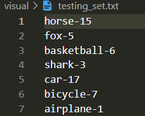
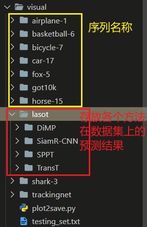

> 篇幅

Introduction

Related Work 适当裁剪

数据集介绍


## 运行测试命令

### train

```bash
## 初始化
python tracking/create_default_local_file.py --workspace_dir . --data_dir ./data --save_dir output
# 配置数据集
cp -r ~/XieBailian/proj/data .

## debug
python tracking/train.py --script [方法名] --config debug --save_dir output/debug --mode multiple --nproc_per_node 1
python tracking/train.py --script sppt --config debug --save_dir output/debug --mode multiple --nproc_per_node 1
python tracking/train.py --script sppt --config siamese_rpe --save_dir output/siamese_rpe --mode multiple --nproc_per_node 4

## train
# 版本的信息单独用一个 .md 文件保存（包括详细的配置），每次版本更新都 commit 一次代码
python tracking/train.py --script [方法名] --config [配置文件名称] --save_dir output/[方法]/[配置名称] --mode multiple --nproc_per_node [显卡数量]

## XBL changed; since 2023/3/20 不同再手动设置保存的文件夹路径（非调试情况下）！！！
# 对于调试情况，直接用 debug.yaml 文件
python tracking/train.py --script hivit --config siamese_rpe --mode multiple --nproc_per_node 4
# for debug
python tracking/train.py --script hivit --config debug --mode multiple --nproc_per_node 4
```

```bash
## kill process
ps -ef | grep python | cut -c 9-16 | xargs kill -9
find -name '__pycache__' | xargs rm -rf
find -name "output" -o -name "tensorboard" | xargs rm -rf
cd output & find -name "info" | xargs rm -r
```


### test

```bash
# 如果跑测试代码提示：FPS: -1 表示已经跑完测试，如果需要进行新的测试，把原来的测试结果 test/* 删除即可！
find output/ -name "test" | xargs rm -r

## GOT-10k
python tracking/test.py fpnt finetuning --dataset got10k_test --threads 4 --num_gpus 4 --params__search_area_scale 4.55
python lib/test/utils/transform_got10k.py --tracker_name fpnt --cfg_name finetuning

## TrackingNet
python tracking/test.py fpnt finetuning --dataset trackingnet --threads 4 --num_gpus 4 --params__search_area_scale 4.5
python lib/test/utils/transform_trackingnet.py --tracker_name fpnt --cfg_name finetuning

## LaSOT
python tracking/test.py fpnt finetuning --dataset lasot --threads 1 --num_gpus 1 --params__search_area_scale 4.5
nohup python tracking/test.py fpnt finetuning --dataset lasot --threads 128 --num_gpus 4 --params__search_area_scale 4.5 > lasot.txt 2>&1 &
python tracking/analysis_results.py --dataset_name lasot --tracker_param finetuning

```


### debug

```python
r"""
``torch.distributed.launch`` is a module that spawns up multiple distributed
training processes on each of the training nodes.

.. warning::

    This module is going to be deprecated in favor of :ref:`torchrun <launcher-api>`.

The utility can be used for single-node distributed training, in which one or
more processes per node will be spawned. The utility can be used for either
CPU training or GPU training. If the utility is used for GPU training,
each distributed process will be operating on a single GPU. This can achieve
well-improved single-node training performance. It can also be used in
multi-node distributed training, by spawning up multiple processes on each node
for well-improved multi-node distributed training performance as well.
This will especially be benefitial for systems with multiple Infiniband
interfaces that have direct-GPU support, since all of them can be utilized for
aggregated communication bandwidth.

In both cases of single-node distributed training or multi-node distributed
training, this utility will launch the given number of processes per node
(``--nproc_per_node``). If used for GPU training, this number needs to be less
or equal to the number of GPUs on the current system (``nproc_per_node``),
and each process will be operating on a single GPU from *GPU 0 to
GPU (nproc_per_node - 1)*.

**How to use this module:**

1. Single-Node multi-process distributed training

::

    >>> python -m torch.distributed.launch --nproc_per_node=NUM_GPUS_YOU_HAVE
               YOUR_TRAINING_SCRIPT.py (--arg1 --arg2 --arg3 and all other
               arguments of your training script)

2. Multi-Node multi-process distributed training: (e.g. two nodes)


Node 1: *(IP: 192.168.1.1, and has a free port: 1234)*

::

    >>> python -m torch.distributed.launch --nproc_per_node=NUM_GPUS_YOU_HAVE
               --nnodes=2 --node_rank=0 --master_addr="192.168.1.1"
               --master_port=1234 YOUR_TRAINING_SCRIPT.py (--arg1 --arg2 --arg3
               and all other arguments of your training script)

Node 2:

::

    >>> python -m torch.distributed.launch --nproc_per_node=NUM_GPUS_YOU_HAVE
               --nnodes=2 --node_rank=1 --master_addr="192.168.1.1"
               --master_port=1234 YOUR_TRAINING_SCRIPT.py (--arg1 --arg2 --arg3
               and all other arguments of your training script)

3. To look up what optional arguments this module offers:

::

    >>> python -m torch.distributed.launch --help


**Important Notices:**

1. This utility and multi-process distributed (single-node or
multi-node) GPU training currently only achieves the best performance using
the NCCL distributed backend. Thus NCCL backend is the recommended backend to
use for GPU training.

2. In your training program, you must parse the command-line argument:
``--local_rank=LOCAL_PROCESS_RANK``, which will be provided by this module.
If your training program uses GPUs, you should ensure that your code only
runs on the GPU device of LOCAL_PROCESS_RANK. This can be done by:

Parsing the local_rank argument

::

    >>> import argparse
    >>> parser = argparse.ArgumentParser()
    >>> parser.add_argument("--local_rank", type=int)
    >>> args = parser.parse_args()

Set your device to local rank using either

::

    >>> torch.cuda.set_device(args.local_rank)  # before your code runs

or

::

    >>> with torch.cuda.device(args.local_rank):
    >>>    # your code to run

3. In your training program, you are supposed to call the following function
at the beginning to start the distributed backend. It is strongly recommended
that ``init_method=env://``. Other init methods (e.g. ``tcp://``) may work,
but ``env://`` is the one that is officially supported by this module.

::

    torch.distributed.init_process_group(backend='YOUR BACKEND',
                                         init_method='env://')

4. In your training program, you can either use regular distributed functions
or use :func:`torch.nn.parallel.DistributedDataParallel` module. If your
training program uses GPUs for training and you would like to use
:func:`torch.nn.parallel.DistributedDataParallel` module,
here is how to configure it.

::

    model = torch.nn.parallel.DistributedDataParallel(model,
                                                      device_ids=[args.local_rank],
                                                      output_device=args.local_rank)

Please ensure that ``device_ids`` argument is set to be the only GPU device id
that your code will be operating on. This is generally the local rank of the
process. In other words, the ``device_ids`` needs to be ``[args.local_rank]``,
and ``output_device`` needs to be ``args.local_rank`` in order to use this
utility

5. Another way to pass ``local_rank`` to the subprocesses via environment variable
``LOCAL_RANK``. This behavior is enabled when you launch the script with
``--use_env=True``. You must adjust the subprocess example above to replace
``args.local_rank`` with ``os.environ['LOCAL_RANK']``; the launcher
will not pass ``--local_rank`` when you specify this flag.

.. warning::

    ``local_rank`` is NOT globally unique: it is only unique per process
    on a machine.  Thus, don't use it to decide if you should, e.g.,
    write to a networked filesystem.  See
    https://github.com/pytorch/pytorch/issues/12042 for an example of
    how things can go wrong if you don't do this correctly.
"""

import logging
import warnings

from torch.distributed.run import get_args_parser, run

warnings.filterwarnings("ignore")
logger = logging.getLogger(__name__)


def parse_args(args):
    parser = get_args_parser()
    parser.add_argument(
        "--use_env",
        default=False,
        action="store_true",
        help="Use environment variable to pass "
        "'local rank'. For legacy reasons, the default value is False. "
        "If set to True, the script will not pass "
        "--local_rank as argument, and will instead set LOCAL_RANK.",
    )
    return parser.parse_args(args)


def launch(args):
    if args.no_python and not args.use_env:
        raise ValueError("When using the '--no_python' flag," " you must also set the '--use_env' flag.")
    run(args)


def main(args=None):
    warnings.warn(
        "The module torch.distributed.launch is deprecated\n"
        "and will be removed in future. Use torchrun.\n"
        "Note that --use_env is set by default in torchrun.\n"
        "If your script expects `--local_rank` argument to be set, please\n"
        "change it to read from `os.environ['LOCAL_RANK']` instead. See \n"
        "https://pytorch.org/docs/stable/distributed.html#launch-utility for \n"
        "further instructions\n",
        FutureWarning,
    )
    args = parse_args(args)
    launch(args)


if __name__ == "__main__":
    main()

```

```json
{
    // Use IntelliSense to learn about possible attributes.
    // Hover to view descriptions of existing attributes.
    // For more information, visit: https://go.microsoft.com/fwlink/?linkid=830387
    "version": "0.2.0",
    "configurations": [
        {
            "name": "Analysis",
            "type": "python",
            "request": "launch",
            "program": "tracking/analysis_results.py",
            "console": "integratedTerminal",
            "justMyCode": true,
            "args": [
                "fpnt",
                "baseline",
                "--dataset",
                "lasot",
                "--threads",
                "32",
                "--debug",
                "1",
                "--num_gpus",
                "4",
                "--params__model",
                "FPNT_ep0250.pth.tar",
                "--params__search_area_scale",
                "4.55"
            ],
        },
        {
            "name": "TEST",
            "type": "python",
            "request": "launch",
            "program": "tracking/test.py",
            "console": "integratedTerminal",
            "justMyCode": true,
            "args": [
                "fpnt",
                "baseline",
                "--dataset",
                "lasot",
                "--threads",
                "32",
                "--debug",
                "1",
                "--num_gpus",
                "4",
                "--params__model",
                "FPNT_ep0250.pth.tar",
                "--params__search_area_scale",
                "4.55"
            ],
        },
        {
            "name": "TRAIN",
            "type": "python",
            "request": "launch",
            "program": "launch.py",
            "console": "integratedTerminal",
            "justMyCode": false,
            "args": [
                // 注意该参数一定要在后面运行的 .py 文件之前，
                // 为 launch.py 的参数，而非 后面的 .py 文件的参数！
                "--nproc_per_node",
                "4",
                "lib/train/run_training.py",
                // END;
                "--script",
                "SCRIPT_NAME",
                // 目前没有设置 FPNT 相关初始化的参数
                "--config",
                "CONFIG_NAME",
                "--save_dir",
                "output/DIR_NAME"
            ]
        },
        {
            "name": "DEBUG",
            "type": "python",
            "request": "launch",
            "program": "launch.py",
            "console": "integratedTerminal",
            "justMyCode": false,
            "args": [
                // 注意该参数一定要在后面运行的 .py 文件之前，
                // 为 launch.py 的参数，而非 后面的 .py 文件的参数！
                "--nproc_per_node",
                "1",
                "lib/train/run_training.py",
                // END;
                "--script",
                "sppt",
                "--config",
                "debug",
                "--save_dir",
                "output/debug"
            ],
            "env": {
                "CUDA_VISIBLE_DEVICES": "1",
            }
        },
        {
            "name": "MixTrain",
            "type": "python",
            "request": "launch",
            "program": "launch.py",
            "console": "integratedTerminal",
            "justMyCode": true,
            "args": [
                // 注意该参数一定要在后面运行的 .py 文件之前，
                // 为 launch.py 的参数，而非 后面的 .py 文件的参数！
                "--nproc_per_node",
                "1",
                "lib/train/run_training.py",
                // END;
                "--script",
                "mixformer",
                "--config",
                "baseline",
                "--save_dir",
                "output/with_posenc"
            ]
        }
    ]
}

```


### 可视化

- `visual/testing_sets.txt` 存放要画框的 `sequence` 名称，

  

- `visual/plot2save.py` 画 bounding box 的核心代码，注意要先创建好相应的文件夹：`lasot/[方法名称]`

  

```python
import encodings
import numpy as np
import cv2
import os
from PIL import Image


def read_image(filename, color_fmt='RGB'):
    assert color_fmt in Image.MODES
    img = Image.open(filename)
    if not img.mode == color_fmt:
        img = img.convert(color_fmt)
    return np.asarray(img)


def save_image(filename, img, color_fmt='RGB'):
    assert color_fmt in ['RGB', 'BGR']
    if color_fmt == 'BGR' and img.ndim == 3:
        img = img[..., ::-1]
    img = Image.fromarray(img)
    return img.save(filename)


def show_image(
        img,
        bboxes=None,
        bbox_fmt='ltrb',
        colors=None,
        thickness=1,  # 线的粗细，有多个框（trackers）
        fig=1,
        delay=1,
        max_size=640,
        visualize=True,
        cvt_code=cv2.COLOR_RGB2BGR):
    if cvt_code is not None:
        img = cv2.cvtColor(img, cvt_code)

    # resize img if necessary
    if max(img.shape[:2]) > max_size:
        scale = max_size / max(img.shape[:2])
        out_size = (int(img.shape[1] * scale), int(img.shape[0] * scale))
        img = cv2.resize(img, out_size)
        if bboxes is not None:
            bboxes = np.array(bboxes, dtype=np.float32) * scale

    if bboxes is not None:
        assert bbox_fmt in ['ltwh', 'ltrb']
        bboxes = np.array(bboxes, dtype=np.int32)
        if bboxes.ndim == 1:
            bboxes = np.expand_dims(bboxes, axis=0)
        if bboxes.shape[1] == 4 and bbox_fmt == 'ltwh':
            bboxes[:, 2:] = bboxes[:, :2] + bboxes[:, 2:] - 1

        # clip bounding boxes
        h, w = img.shape[:2]
        bboxes[:, 0::2] = np.clip(bboxes[:, 0::2], 0, w)
        bboxes[:, 1::2] = np.clip(bboxes[:, 1::2], 0, h)

        if colors is None:
            colors = [(0, 0, 255), (0, 255, 0), (255, 0, 0), (0, 255, 255), (255, 0, 255), (255, 255, 0), (0, 0, 128),
                      (0, 128, 0), (128, 0, 0), (0, 128, 128), (128, 0, 128), (128, 128, 0)]
        colors = np.array(colors, dtype=np.int32)
        if colors.ndim == 1:
            colors = np.expand_dims(colors, axis=0)

        for i, bbox in enumerate(bboxes):
            color = colors[i % len(colors)]
            if len(bbox) == 4:
                pt1 = (int(bbox[0]), int(bbox[1]))  # 左上
                pt2 = (int(bbox[2]), int(bbox[3]))  # 右下
                img = cv2.rectangle(img, pt1, pt2, color.tolist(), thickness)
            else:
                pts = bbox.reshape(-1, 2)
                img = cv2.polylines(img, [pts], True, color.tolist(), thickness)

    if visualize:
        if isinstance(fig, str):
            winname = fig
        else:
            winname = 'window_{}'.format(fig)
        cv2.imshow(winname, img)
        cv2.waitKey(delay)

    if cvt_code in [cv2.COLOR_RGB2BGR, cv2.COLOR_BGR2RGB]:
        img = cv2.cvtColor(img, cv2.COLOR_BGR2RGB)

    return img


def show_frames(sequence_dir, frame_format, sequence_len, predict_bboxes, sequence_name, color):
    """输出最后的显示结果
    sequence_dir: 序列的文件夹部分
    frame_format: 帧的格式 传入格式化字符串
        '{:08d}.jpg' 表示 GOT-10k 以及 LaSOT 的 frame 格式
        '{}.jpg' 表示 TrackingNet 的格式
    sequence_len: 序列的长度
        设置的原因是: GOT-10k img 里面有一个 groundtruth.txt
    predict_bboxes: 预测的边界框
    """
    for i in range(1, sequence_len):
        # (1) 获取 image
        img_file = os.path.join(sequence_dir, frame_format.format(i))
        # print(img_file)

        # (2) 获取 predict_bbox
        predict_bbox = predict_bboxes[i]
        # # (3) 展示添加预测框的图片
        # flags[0, 1] 分别表示灰度、彩色图像
        # img = cv2.imread(img_file, flags=1)
        img = read_image(filename=img_file, color_fmt='RGB')
        # img = cv2.cvtColor(img, cv2.COLOR_RGB2BGR)
        ## TODO: 不同 Trackers 不同的颜色框
        img = cv2.rectangle(
            img=img,
            pt1=(int(predict_bbox[0]), int(predict_bbox[1])),
            pt2=(int(predict_bbox[0] + predict_bbox[2]), int(predict_bbox[1] + predict_bbox[3])),
            color=color,
            thickness=3,  # 必须是整数！
        )
        # 注意：保存的应该是原始图片帧，而不是缩放等处理之后的图片！
        seq_dir = f"visual/{sequence_name}"
        if not os.path.exists(seq_dir):
            os.makedirs(seq_dir)
        # print(cv2.imwrite(f'visual/{sequence_name}/{i:08d}.jpg', img))
        print(save_image(f'{seq_dir}/{i:08d}.jpg', img))

        ## 缩放只是为了方便看
        # if max(img.shape[:2]) > 640:
        #     scale = 640 / max(img.shape[:2])
        #     out_size = (int(img.shape[1] * scale), int(img.shape[0] * scale))
        #     img = cv2.resize(img, out_size)
        cv2.imshow("TEST", img)
        # 如果路径不存在，不会保存！
        cv2.waitKey(10)
    cv2.destroyAllWindows()


def plot_got10k():
    for n in range(149, 150):
        # sequence_dir = 'data/got10k/test/GOT-10k_Test_{:06d}/'.format(n)
        sequence_dir = 'data/got10k/test/GOT-10k_Test_{:06d}/'.format(n)
        predict_bboxes = []
        with open("visual/got10k/SPPT/GOT-10k_Test_{:06d}/GOT-10k_Test_{:06d}_001.txt".format(n, n)) as fp:
            lines = fp.readlines()
            # print(lines)
            for line in lines:
                predict_bbox = np.fromstring(line, dtype=float, sep=",")
                predict_bboxes.append(predict_bbox)

        show_frames(
            sequence_dir,
            '{:08d}.jpg',
            len(os.listdir(sequence_dir) - 1),
            predict_bboxes,
            sequence_dir.split('/')[-1],
            # color=(254, 254, 252),  # like_white
            color=(0, 0, 255),  # red
        )


def plot_lasot():
    with open('visual/testing_sets.txt', 'r') as f:
        sequences_name = f.readlines()
        for sequence_name in sequences_name:
            sequence_name = sequence_name.strip()
            class_name = sequence_name.split('-')[0]

            ## XBL changed; for multi-trackers plot in a picture
            # sequence_dir = f"data/lasot/{class_name}/{sequence_name}/img"  # for the 1th tracker
            sequence_dir = f"visual/{sequence_name}"  # 后续 tracker 都使用保存的图片，不断绘制 bbox

            predict_bboxes = []
            ## TODO: （1）根据 Tracker 更改对应的路径名；（2）修改 bbox 颜色！
            with open(f"visual/lasot/SPPT/{sequence_name}.txt") as fp:
            # with open(f"visual/lasot/TransT/{sequence_name}.txt") as fp:
            # with open(f"visual/lasot/DiMP/{sequence_name}.txt") as fp:
            # with open(f"visual/lasot/SiamR-CNN/{sequence_name}.txt") as fp:
                lines = fp.readlines()
                for line in lines:
                    ## TODO: 检查分隔符是否一致！only for SPPT!
                    predict_bbox = np.fromstring(line, dtype=float, sep=",")
                    predict_bbox = np.fromstring(line, dtype=float, sep=" ")
                    predict_bboxes.append(predict_bbox)

            show_frames(
                sequence_dir,
                '{:08d}.jpg',
                len(os.listdir(sequence_dir)),
                predict_bboxes,
                sequence_name,
                ## TODO: RGB 颜色框设置
                color=(255, 0, 0),  # blue, SPPT -> 红色
                # color=(255, 255, 255),  # like_white, TransT -> 白色
                # color=(255, 255, 0),  # yellow, DiMP -> 黄色
                # color=(0, 0, 255),  # SiamR-CNN 蓝色
            )


if __name__ == '__main__':
    # plot_got10k()
    plot_lasot()

```


## 基于P2T：Pyramid Pooling Transformer Tracking，PPTT

### 重要代码

#### `p2t.py` 注意删除不必要的部分：stage4

> `PoolingAttention() -- forward()`

```python
"""
cross-attn
"""
# TAG: cross-attn
def forward(self, zx, H, W, z_H, z_W, d_convs=None):
    B, N, C = zx.shape
    # concated query
    q_c = self.q(zx).reshape(B, N, self.num_heads, C // self.num_heads).permute(0, 2, 1, 3)  # [B, 1, 7424, 64]
    q_z, q_x = torch.split(q_c, [z_H * z_W, H * W], dim=2)  # [B, 1, 1024, 64], [B, 1, 6400, 64]

    # 分离，然后得到 q_z, q_x, k/v_z, k/v_x
    z, x = torch.split(zx, [z_H * z_W, H * W], dim=1)
    z_B, z_N, z_C = z.shape
    x_B, x_N, x_C = x.shape

    pools_z = []
    pools_x = []
    x_ = x.permute(0, 2, 1).contiguous().reshape(x_B, x_C, H, W)
    z_ = z.permute(0, 2, 1).contiguous().reshape(z_B, z_C, z_H, z_W)
    for (pool_ratio, l) in zip(self.pool_ratios, d_convs):
        pool_z = F.adaptive_avg_pool2d(z_, (round(H / pool_ratio), round(W / pool_ratio)))
        pool_x = F.adaptive_avg_pool2d(x_, (round(H / pool_ratio), round(W / pool_ratio)))
        pool_z = pool_z + l(pool_z)  # fix backward bug in higher torch versions when training
        pool_x = pool_x + l(pool_x)  # fix backward bug in higher torch versions when training
        pools_z.append(pool_z.view(B, C, -1))
        pools_x.append(pool_x.view(B, C, -1))

    pools_z = torch.cat(pools_z, dim=2)
    pools_z = self.norm(pools_z.permute(0, 2, 1).contiguous())  # [2, 99, 64]
    pools_x = torch.cat(pools_x, dim=2)
    pools_x = self.norm(pools_x.permute(0, 2, 1).contiguous())  # [2, 99, 64]
    pools = torch.cat([pools_z, pools_x], dim=1)

    kv_c = self.kv(pools).reshape(B, -1, 2, self.num_heads, C // self.num_heads).permute(2, 0, 3, 1, 4)  # [B, 2, 1, 198, 64]
    k_c, v_c = kv_c[0], kv_c[1]  # [B, 1, 198, 64]

    # TODO: produce q_z/s, k_z, v_z
    # NOTE: 这里的 dim != 1，因为前面 self.q(zx).reshape().permute()
    # 而且要注意和上面的 pools concat 连接时的方式对应起来！
    k_z, k_x = torch.split(k_c, [pools_z.shape[1], pools_x.size(1)], dim=2)  # [B, 1, 99, 64]
    v_z, v_x = torch.split(v_c, [pools_z.shape[1], pools_x.size(1)], dim=2)  # [B, 1, 99, 64]

    # XBL comment; 标准的 attention 操作
    # template attention(z)
    attn = (q_z @ k_c.transpose(-2, -1)) * self.scale
    attn = attn.softmax(dim=-1)
    attn_z = (attn @ v_c)  # [B, 1, 1024, 64]
    # BUG RuntimeError: shape '[B, 7424, 64]' is invalid for input of size 131072
    # NOTE: 注意这里 reshape 必须是送入计算的序列原始的 shape
    # 注意力计算前后的 shape 和 q 一致，即 query_z 的 shape！
    attn_z = attn_z.transpose(1, 2).contiguous().reshape(z_B, z_N, z_C)  # [B, 1024, 64]

    # search region attention(x)
    attn = (q_x @ k_c.transpose(-2, -1)) * self.scale
    attn = attn.softmax(dim=-1)
    attn_x = (attn @ v_c)
    attn_x = attn_x.transpose(1, 2).contiguous().reshape(x_B, x_N, x_C)

    # XBL comment; proj 不改变 shape
    zx = torch.cat([attn_z, attn_x], dim=1)
    zx = self.proj(zx)
    zx = self.proj_drop(zx)

    return zx
```

```python
"""
self-attn
"""
# TAG: self-attn
def forward(self, zx, H, W, z_H, z_W, d_convs=None):
    B, N, C = zx.shape
    # concated query
    q_c = self.q(zx)  # [B, 7424, 64], 7424 = 32^2 + 80^2
    q_c = self.q(zx).reshape(B, N, self.num_heads, C // self.num_heads).permute(0, 2, 1, 3)  # [B, 1, 7424, 64]

    # 分离，然后得到 q_z, q_x, k/v_z, k/v_x
    z, x = torch.split(zx, [z_H * z_W, H * W], dim=1)
    z_B, z_N, z_C = z.shape
    x_B, x_N, x_C = x.shape

    pools_z = []
    pools_x = []
    x_ = x.permute(0, 2, 1).contiguous().reshape(x_B, x_C, H, W)
    z_ = z.permute(0, 2, 1).contiguous().reshape(z_B, z_C, z_H, z_W)
    for (pool_ratio, l) in zip(self.pool_ratios, d_convs):
        pool_z = F.adaptive_avg_pool2d(z_, (round(H / pool_ratio), round(W / pool_ratio)))
        pool_x = F.adaptive_avg_pool2d(x_, (round(H / pool_ratio), round(W / pool_ratio)))
        pool_z = pool_z + l(pool_z)  # fix backward bug in higher torch versions when training
        pool_x = pool_x + l(pool_x)  # fix backward bug in higher torch versions when training
        pools_z.append(pool_z.view(B, C, -1))
        pools_x.append(pool_x.view(B, C, -1))

    pools_z = torch.cat(pools_z, dim=2)
    pools_z = self.norm(pools_z.permute(0, 2, 1).contiguous())  # [2, 99, 64]
    pools_x = torch.cat(pools_x, dim=2)
    pools_x = self.norm(pools_x.permute(0, 2, 1).contiguous())  # [2, 99, 64]
    pools = torch.cat([pools_z, pools_x], dim=1)
    k_c, v_c = self.kv(pools).reshape(B, -1, 2, self.num_heads, C // self.num_heads).permute(2, 0, 3, 1, 4)

    attn = (q_c @ k_c.transpose(-2, -1)) * self.scale
    attn = attn.softmax(dim=-1)
    zx = (attn @ v_c)
    zx = zx.transpose(1, 2).contiguous().reshape(B, N, C)

    return zx
```


> `Block() -- forward()`

```python
# TAG: fpntv3
def forward(self, zx, H, W, z_H, z_W, d_convs=None):
    zx = zx + self.drop_path(self.attn(self.norm1(zx), H, W, z_H, z_W, d_convs=d_convs))
    z, x = torch.split(zx, [z_H * z_W, H * W], dim=1)

    # TODO: 不能直接使用 concat 进行 mlp
    # zx = zx + self.drop_path(self.mlp(self.norm2(zx), H, W))
    z = z + self.drop_path(self.mlp(self.norm2(z), z_H, z_W))
    x = x + self.drop_path(self.mlp(self.norm2(x), H, W))

    return z, x
```


> `PyramidPoolingTransformer() -- forward_features(), forward()`

```python
# TAG: fpntv3
def forward_features(self, z, x):
    """
    :param
        z: [B, 3, 128, 128]
        x: [B, 3, 320, 320]
    """
    ## XBL changed; add template(z)-related code
    # stage 1
    B = x.shape[0]
    x, (H, W) = self.patch_embed1(x)  # [B, 6400, 64]
    z, (z_H, z_W) = self.patch_embed1(z)  # [B, 1024, 64]
    # TODO: concat(z, x) 之后再送入到 blk 中
    zx = torch.cat([z, x], dim=1)

    for idx, blk in enumerate(self.block1):
        # x = blk(x, H, W, self.d_convs1)
        z, x = blk(zx, H, W, z_H, z_W, self.d_convs1)

    # stage 2
    x = x.reshape(B, H, W, -1).permute(0, 3, 1, 2)  # [1, 64, 80, 80]
    z = z.reshape(B, z_H, z_W, -1).permute(0, 3, 1, 2)  # [1, 64, 32, 32]
    x, (H, W) = self.patch_embed2(x)  # [1, 1600, 128]
    z, (z_H, z_W) = self.patch_embed2(z)  # [1, 256, 128]
    zx = torch.cat([z, x], dim=1)

    for idx, blk in enumerate(self.block2):
        # x = blk(x, H, W, self.d_convs2)
        z, x = blk(zx, H, W, z_H, z_W, self.d_convs2)

    # stage 3
    x = x.reshape(B, H, W, -1).permute(0, 3, 1, 2)
    z = z.reshape(B, z_H, z_W, -1).permute(0, 3, 1, 2)
    x, (H, W) = self.patch_embed3(x)
    z, (z_H, z_W) = self.patch_embed3(z)
    zx = torch.cat([z, x], dim=1)

    for idx, blk in enumerate(self.block3):
        # x = blk(x, H, W, self.d_convs3)
        z, x = blk(zx, H, W, z_H, z_W, self.d_convs3)

    # XBL comment; reshape 为原始的图像形状
    z = rearrange(z, 'b (h w) c -> b c h w', h=z_H, w=z_W).contiguous()
    x = rearrange(x, 'b (h w) c -> b c h w', h=H, w=W).contiguous()

    return z, x
```

```python
def forward(self, z, x):
    """
    :param
        z: [1, 16, 512]
        x: [1, 100, 512]
    """
    z, x = self.forward_features(z, x)
    # x = torch.mean(x, dim=1)
    # x = self.head(x)
    return z, x
```


## 基于 SwinT：Shift-Windows based Transformer Tracking，SWTT