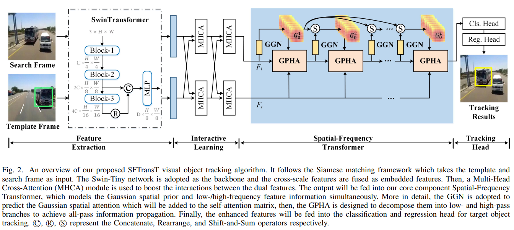
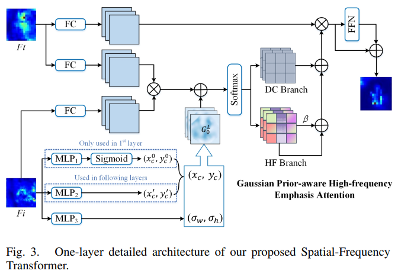
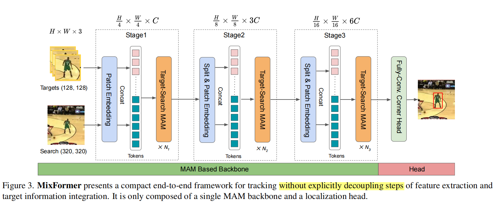
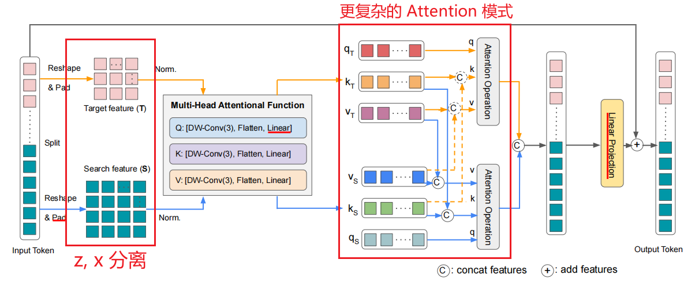
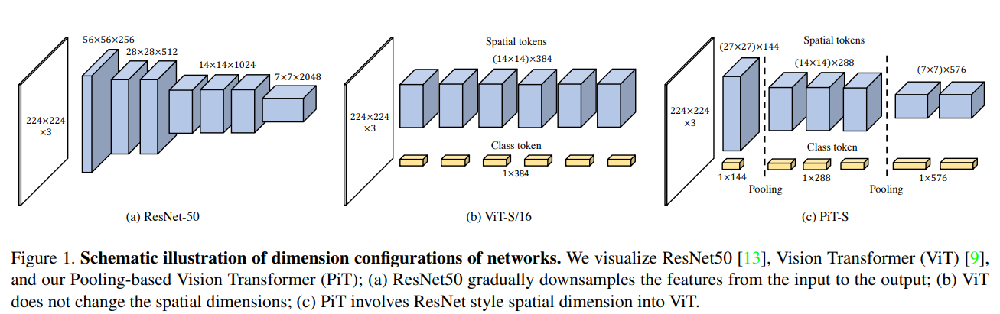

相关论文，

- [ ] SFTransT, [2208.08829v1.pdf](https://arxiv.org/pdf/2208.08829v1.pdf)
- [ ] M3Video, [2210.06096.pdf](https://arxiv.org/pdf/2210.06096.pdf)
- [ ] MAM2, [2210.05234.pdf](https://arxiv.org/pdf/2210.05234.pdf)
- [ ] MotionMAE, [2210.04154.pdf](https://arxiv.org/pdf/2210.04154.pdf)
- [ ] MaskFeat, [2112.09133.pdf](https://arxiv.org/pdf/2112.09133.pdf)
- [ ] [wangxiao5791509/Single_Object_Tracking_Paper_List: Paper list for single object tracking (State-of-the-art SOT trackers)](https://github.com/wangxiao5791509/Single_Object_Tracking_Paper_List)

> 将 https://arxiv.org/pdf/2210.04154.pdf 中的 `pdf` 更改为 `abs` 即可进入详细界面。

使用视频作为自监督学习，除了学习外观特征等信息，还可以对 Motion 进行学习建模，对于追踪任务有帮助。

但是以上的方法基本上都是以 ViT 为 backbone，和我们想要改进的使用 SwinT 作为 backbone 不符合。

SFTransT 对比的论文是 MixFormer，相对来说虽有提高，虽然速度可以达到实时（$27-35 fps$），但是和 OSTrack 相比还是相差很大，而且模型结构设计沿用了 TransT 的思想，更加复杂。

    <b>SFTransT Architecture</b>

    <b>Gaussian Prior aware High-frequency emphasis Attention (GPHA)</b>

OSTrack 中的 Attention 更加简洁，通过将 (template, saerch) concatenate 之后，直接使用 Multi-head Attention 进行关系建模，而 MixFormer & SFTransT 沿用 TransT 的 Attention 思路，还是将 template 和 search 分离开来，然后利用设计的特定的 Attention 计算注意力，实现关系建模。

    <b>MixFormer Architecture</b>

    <b>MixFormer Attention</b>

## 总结

目前已完成的工作以及后续的计划，

- 对 OSTrack & MixFormer 代码大致掌握，已经确定好如何修改：主要还是基于 OSTrack，尝试使用 SwinT 的多个 stage 逐步进行特征提取和关系建模；考虑到 MixFormer 使用了多个 stage，可以结合着来看，

- 如果 SwinT 实现不了，可以考虑 [PiT](https://arxiv.org/pdf/2103.16302.pdf) 进行代替（和 MixFormer/SwinT 类似），

  

  

      <b>Pooling-based Vision Transformer (PiT)</b>
  
