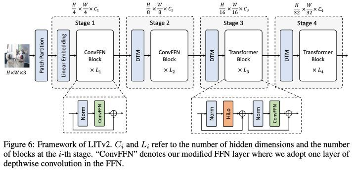

### TODO

- [ ] 自监督学习
- [ ] 对比学习
- [ ] MAE
- [ ] ConvMAE, 混合卷积
- [ ] 特征蒸馏
- [ ] epoch/iter 区别及实现
- [ ] df_atten 修改为 Hydra attention

### Soft-Argmax

中心极限定理，[中心极限定理 - 维基百科，自由的百科全书](https://zh.m.wikipedia.org/zh-sg/%E4%B8%AD%E5%BF%83%E6%9E%81%E9%99%90%E5%AE%9A%E7%90%86)

> 中心极限定理表明，只要你的样本够大，即使群体不服从高斯分布，平均值的分布也会服从高斯分布，所以高斯分布成为万金油，分布假设中的常客——它也许不够好，但它一定不会错，这样一种下限的保障。
>
> - 均值所在的概率分量应该是最大的

### ViT 速度保证（极市平台）

- [ ] Hilo Attention
- [ ] depthwise convolution
- [ ] 

> 1. RPE虽然能涨点，但对于LIT来说，由于后面需要动态根据input大小做插值，所以对速度影响很大。
> 2. 后两个stage的原始MSA针对高分图像还是会有很大的计算开销。

FLOPs 只能反映理论复杂度，而真正想在 CV 任务中 beat 过纯 CNN 的话，除了性能，实测速度也十分关键，因为理论复杂度并不能反应 GPU 和 CPU 上的实际速度。影响实测 throughput/latency 的还有 memory access cost 和其他难以被统计进 FLOPs 的因素，如 for-loop。