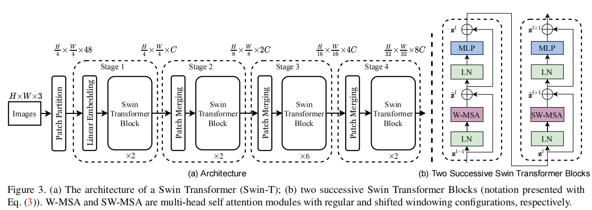
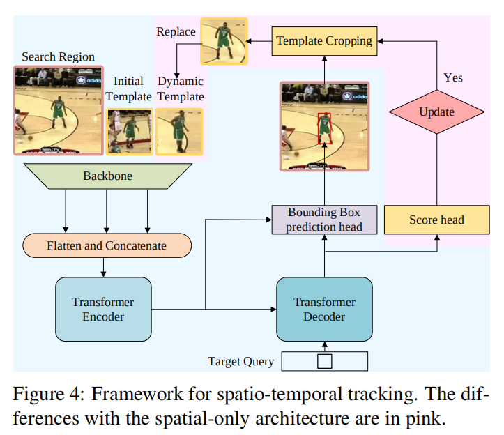
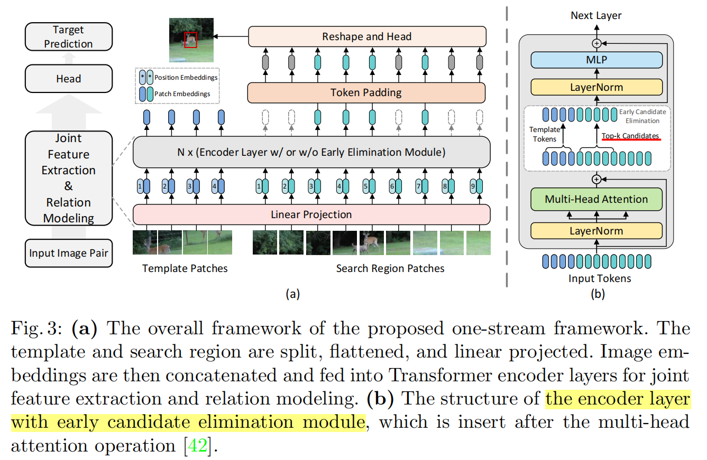
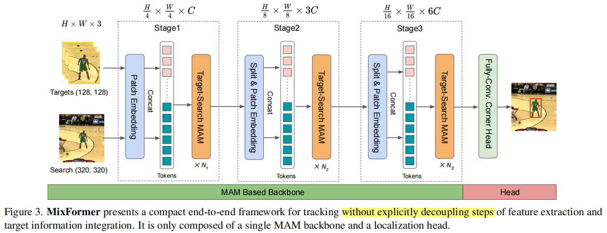
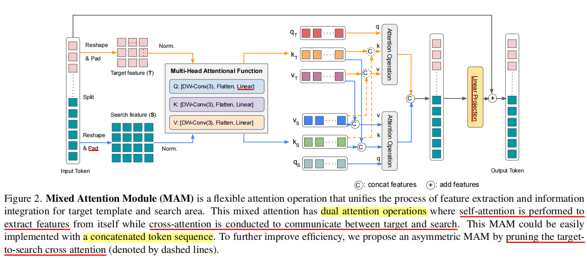

## `OSTrack`

- [ ] 金字塔 Transformer 如何实现 --> CNN 中怎么利用的 ResNet 多个  Stage 的特征进行特征融合，实现多个 Stage 的 track？
- [ ] 是使用 SwinT 还是 PVT？
- [ ] 哪一个作为 baseline？OSTrack or MixFormer（有多个 Stage）？
- [ ] 如果使用 SwinT，有必要使用中间的 Stage？中间的 Stage 如何利用？

MotionMAE

VideoMAE

