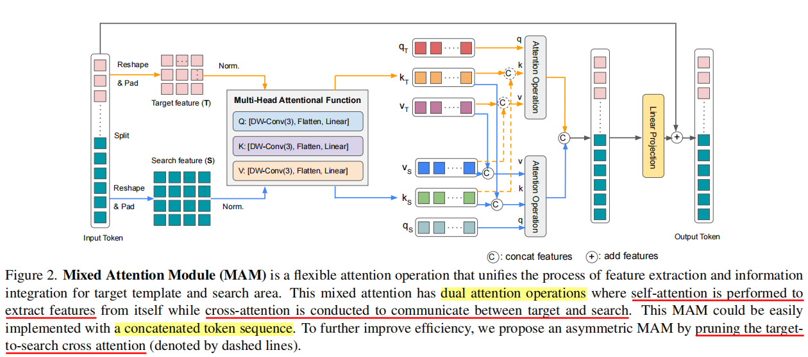

# 研二（1）Week2

## 一、论文进度（研究进展）

### 目前已完成的工作

### 还未解决的问题

### 目标计划

## 二、其他完成事项

### 将往期看的论文回顾梳理，总结

#### GlobalTrack

#### TransT

### pytracking/pysot库的源码阅读

### 论文阅读：MixFormer

#### 模型结构

MAM: Mixed Attention Module

#### 重点

> 有关 `CA/Mixed Attention` 的原理

$Attention$ 计算公式：$Q*K^T*V$

比如：

$Q = K = V = [2, 1]$

经过 mix 操作后，
$$
K = V = [6, 1]  \\
Q*K^T = [2, 1] * [1, 6] = [2, 6]  \\
res = [2, 6] * [6, 1] = [2, 1]  \\
$$

虽然 K-V shape 改变，但最终计算得到的 shape 未变 = Q

