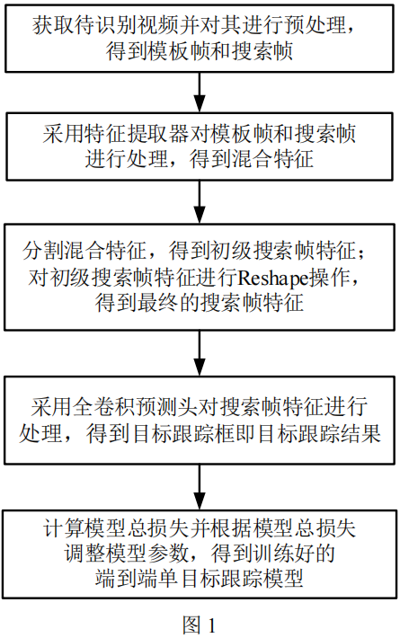
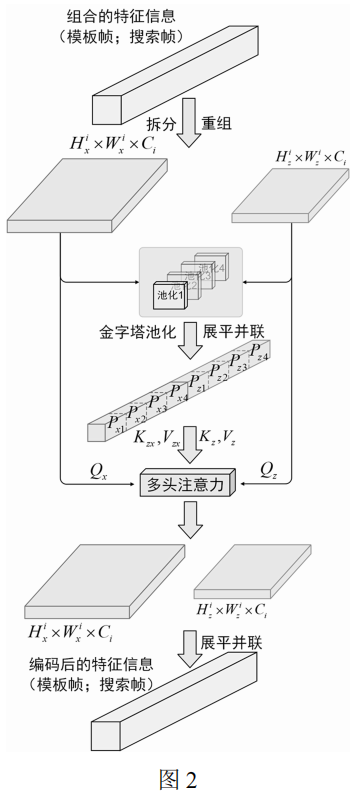
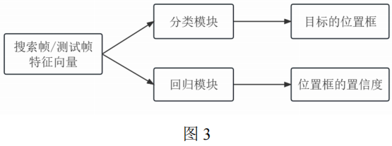

# 一种基于金字塔池化注意力机制的端到端单目标跟踪方法

 

# 发明摘要

一种基于金字塔池化注意力机制的端到端单目标跟踪方法，构建一个基于Transformer的目标跟踪框架(Pyramid Pooling Transformer Tracking, P2TT)，用于单目标跟踪，该跟踪框架的构架包括以下几个步骤：(1)单目标跟踪训练数据准备阶段；(2)网络模型P2TT的构建和初始化阶段；(3)算法模型离线训练阶段。本发明采用了基于多层级金字塔池化的Transformer骨干网络同时完成特征提取和模板-搜索区域的关系建模，实现了一个简洁高效的跟踪框架。此外，本发明的跟踪方法可以更好地应对跟踪过程中目标形变以及尺寸变化的问题，有效提升目标回归的精度。

摘要附图：选取最具代表性的一张图作为摘要附图。

# 权利要求书（已完成）

1. 一种基于金字塔池化注意力机制的端到端单目标跟踪方法，其特征是构建一个跟踪框架P2TT用于目标跟踪，所述跟踪框架P2TT为一个端到端训练的Transformer跟踪网络，包括一个主干网络和一个跟踪头，跟踪框架P2TT的构建实现包括以下步骤：
2. 单目标跟踪训练数据准备阶段。对训练所用的视频帧进行裁剪，分别得到初始模板帧和每一帧中的搜索区域。选取第一帧作为初始模板帧，裁剪的尺寸为待跟踪目标框的22倍大小，搜索区域裁剪的尺寸则为目标框的52倍，均根据目标真实框的中心位置进行裁剪。
3. 网络模型P2TT的构建和初始化阶段。P2TT的骨干网络为基于金字塔池化注意力模块的特征提取器，与传统的特征提取器不同，该骨干网络充分利用Transformer的特性，针对目标跟踪进行特征提取的同时，还进行模板和搜索区域的信息交互，对跟踪进行有效建模。和检测任务类似，跟踪任务的基本结构也是骨干网络加上一个预测头，在本发明中，我们称其为跟踪头。跟踪头为一个回归预测头，由堆叠的几个卷积层和线性层实现，用于得到跟踪目标的左上角和右下角坐标位置信息，并作为最终的预测结果，生成相应的目标框。

其中，骨干网络由基于金字塔池化注意力机制的编码模块堆叠组成，为多层级结构，可以充分学习多尺度信息，更好地应对跟踪过程中目标发生的形变、尺度变换等挑战。此外，通过引入的池化机制，设置不同的池化比率，也能够对尺度信息进行有效学习，同时大大减少资源消耗，提高跟踪的效率。对于模板帧，使用Transformer的自注意力机制对特征进行编码；对于搜索区域，使用交叉注意力机制进行特征的提取和关系建模，充分挖掘对跟踪有利的信息，最终得到融合了模板信息的搜索区域特征。

103. 算法模型离线训练阶段。对于预测头目标框，使用L1损失函数、GIoU损失函数以及Generalized Focal Loss进行有监督训练。通过标记的真实标签计算得到误差，使用AdamW优化器，并通过神经网络的反向传播算法对网络的参数进行更新，如此迭代进行多轮，直至设定的迭代次数，得到最终训练好的跟踪框架，之后使用该框架在测试集上进行测试验证。
104. 根据权利要求1所述的一种基于金字塔池化注意力机制的端到端单目标跟踪方法，其特征是骨干网络的池化注意力操作对特征进行降维以及特征融合。特征降维是为了减少Transformer中Attention部分K、V的序列长度，从而减少在第一、二阶段的计算量，使得Attention可以在有限的资源范围内实现。特征融合是利用不同的池化比率提取不同尺度的特征信息，以实现更高效的跟踪。
105. 根据权利要求1所述的一种基于金字塔池化注意力机制的端到端单目标跟踪方法，其特征是在骨干网络中的具体操作为：首先将搜索帧和模板帧分别分块并向量化，将这些块向量组合分别得到搜索帧和模板帧的序列化向量，并在注意力计算中分别对模板和搜索区域进行自注意力和交叉注意力计算。其中自注意力计算的Qs/t、Ks/t、Vs/t均来自于同一个输入的线性投影变换，用于提取模板的特征信息。交叉注意力主要作用于搜索帧的特征信息，其Qs来自于搜索帧块向量的线性投影变换，Ks、Vs来自于拼接的搜索帧块向量和模板帧块向量的线性投影变换，在提取搜索区域特征信息的同时，将模板的特征信息融合到搜索区域中，学习跟踪范式。
106. 根据权利要求1所述的一种基于金字塔池化注意力机制的端到端单目标跟踪方法，其特征是在数据准备阶段，使用如下的数据增强方式：对训练数据集中每个视频的每一帧图像进行目标区域抖动处理，然后裁剪出抖动处理后的目标搜索区域。
107. 根据权利要求1或2或3所述的一种基于金字塔池化注意力机制的端到端单目标跟踪方法，其特征是跟踪头包括一个分类头和一个回归头。分类头具有一个预设的可学习的置信度向量，分类头用于得到测试帧的分类目标置信度。回归头用于得到跟踪目标的具体位置，具体使用堆叠的全连接层组成4个分支，分别预测目标的左上角、右下角、中心点坐标，以及长宽比，根据和真实坐标的误差进行反向传播，更新模型参数。
108. 根据权利要求5所述的一种基于金字塔池化注意力机制的端到端单目标跟踪方法，其特征是具有计算机存储介质，所述计算机存储介质中配置有计算机程序，所述计算机程序用于实现权利要求1‑5所述的跟踪框架P2TT，所述计算机程序被执行时实现权利要求1‑5所述的跟踪方法。

# 一种基于金字塔池化注意力机制的端到端单目标跟踪方法

## 技术领域（已完成）

本发明属于计算机软件技术领域，尤其是视觉单目标跟踪技术，具体为一种基于金字塔池化注意力机制的端到端单目标跟踪方法。

## 背景技术（100%）

视觉物体跟踪作为计算机视觉中的基本任务之一，旨在在视频中估计任意物体在每一帧中的空间位置，并绘制物体边框。尽管目标跟踪在近年来取得了显著进展，但设计一个简单而高效的端到端跟踪器仍然面临挑战，这些挑战主要来自跟踪目标的尺度变化、形变、遮挡，以及与相似目标的混淆等。

目前主流的单目标跟踪器主要由3个主体模块构成：(1) Backbone 主干网络，用于提取待跟踪目标和搜索区域的通用特征；(2) 特征融合模块，将跟踪目标的信息和搜索区域的特征信息进行融合，以实现后续的目标定位和感知；(3) 目标边界框精确预测模块，用于生成最终的跟踪结果，即目标的边界框。在这3个主体模块中，核心为第二部分的特征融合模块，该部分主要将待跟踪目标的特征信息整合到搜索区域的特征中，实现模板——搜索区域的信息通信，以指导后续的跟踪过程，并根据特定的跟踪目标得到对应的跟踪框。传统的信息融合方法包括基于相关性的操作和在线模型更新算法。最近，由于Transformer的全局和动态建模能力，它被引入到跟踪领域来做跟踪目标和跟踪区域的信息交互，并产生良好的跟踪性能。主要是利用Transformer模型对目标特征和搜索区域进行特征融合，然后再将融合后的特征进行预测实现跟踪，然而，这些基于Transformer的跟踪器仍然依赖于卷积主干网络来进行特征的提取，仅在相对高级和抽象的表示空间中应用注意力操作。但卷积主干网络的表示能力是有局限性的，首先它通常是基于一般的目标识别任务做的预训练，其次可能忽略用于跟踪的更精细的结构信息。

## 发明内容（100%）

重点写针对背景技术中的问题，提出了什么方法，具体方案是什么，内容要与权利要求书对应。

本发明要解决的问题是：如何设计一个多层级Transformer的端到端目标跟踪框架，不依赖卷积网络进行特征提取，且可以进一步将特征提取和信息融合模块统一起来，充分挖掘对跟踪有利的信息。

本发明的技术方案为：一种基于混合注意力机制的端到端单目标跟踪方法，构建一个跟踪框架P2TT用于目标跟踪，所述跟踪框架P2TT为一个端到端训练的Transformer跟踪网络，包括一个主干网络和一个跟踪头，跟踪框架P2TT的构建实现包括如下阶段：

单目标跟踪训练数据准备阶段。对训练所用的视频帧进行裁剪，分别得到初始模板帧和每一帧中的搜索区域。选取第一帧作为初始模板帧，裁剪的尺寸为待跟踪目标框的22倍大小，搜索区域裁剪的尺寸则为目标框的52倍，均根据目标真实框的中心位置进行裁剪。

网络模型P2TT的构建和初始化阶段。P2TT的骨干网络为基于金字塔池化注意力模块的特征提取器，与传统的特征提取器不同，该骨干网络充分利用Transformer的特性，针对目标跟踪进行特征提取的同时，还进行模板和搜索区域的信息交互，对跟踪进行有效建模。和检测任务类似，跟踪任务的基本结构也是骨干网络加上一个预测头，在本发明中，我们称其为跟踪头。跟踪头为一个回归预测头，由堆叠的几个卷积层和线性层实现，用于得到跟踪目标的左上角和右下角坐标位置信息，并作为最终的预测结果，生成相应的目标框。

其中，骨干网络由基于金字塔池化注意力机制的编码模块堆叠组成，为多层级结构，可以充分学习多尺度信息，更好地应对跟踪过程中目标发生的形变、尺度变换等挑战。此外，通过引入的池化机制，设置不同的池化比率，也能够对尺度信息进行有效学习，同时大大减少资源消耗，提高跟踪的效率。对于模板帧，使用Transformer的自注意力机制对特征进行编码；对于搜索区域，使用交叉注意力机制进行特征的提取和关系建模，充分挖掘对跟踪有利的信息，最终得到融合了模板信息的搜索区域特征。

算法模型离线训练阶段。对于预测头目标框，使用L1损失函数、GIoU损失函数以及Generalized Focal Loss进行有监督训练。通过标记的真实标签计算得到误差，使用AdamW优化器，并通过神经网络的反向传播算法对网络的参数进行更新，如此迭代进行多轮，直至设定的迭代次数，得到最终训练好的跟踪框架，之后使用该框架在测试集上进行测试验证。

进一步地，骨干网络的池化注意力操作对特征进行降维以及特征融合。特征降维是为了减少Transformer中Attention部分K、V的序列长度，从而减少在第一、二阶段的计算量，使得Attention可以在有限的资源范围内实现。特征融合是利用不同的池化比率提取不同尺度的特征信息，以实现更高效的跟踪。

进一步地，在骨干网络中的具体操作为：首先将搜索帧和模板帧分别分块并向量化，将这些块向量组合分别得到搜索帧和模板帧的序列化向量，并在注意力计算中分别对模板和搜索区域进行自注意力和交叉注意力计算。其中自注意力计算的Qs/t、Ks/t、Vs/t均来自于同一个输入的线性投影变换，用于提取模板的特征信息。交叉注意力主要作用于搜索帧的特征信息，其Qs来自于搜索帧块向量的线性投影变换，Ks、Vs来自于拼接的搜索帧块向量和模板帧块向量的线性投影变换，在提取搜索区域特征信息的同时，将模板的特征信息融合到搜索区域中，学习跟踪范式。

进一步地，跟踪头包括一个分类头和一个回归头。分类头具有一个预设的可学习的置信度向量，分类头用于得到测试帧的分类目标置信度。回归头用于得到跟踪目标的具体位置，具体使用堆叠的全连接层组成4个分支，分别预测目标的左上角、右下角、中心点坐标，以及长宽比，根据和真实坐标的误差进行反向传播，更新模型参数。

本发明构建了一个整洁有效的跟踪框架，只包含一个同时进行特征提取和信息融合的主干网络和一个跟踪头。本发明跟踪框架的这种耦合范式有如下优势。首先，它将使我们的特征提取更加适配于特定的跟踪目标，并捕获更多与目标相关的判别性特征。此外，它还允许更多尺度的目标信息融合，从而更好地捕获目标和搜索区域之间的相关性。

本发明基于上述跟踪方法还提供一种基于混合注意力机制的端到端单目标跟踪装置，具有计算机存储介质，所述计算机存储介质中配置有计算机程序，所述计算机程序用于实现上述的跟踪框架P2TT，所述计算机程序被执行时实现上述的跟踪方法。

本发明提出了一种基于混合注意力机制的端到端单目标跟踪方法，构建了一个基于Transformer的跟踪框架P2TT，采用了特殊设计的Transformer骨干网络，即基于金字塔池化注意力模块的特征提取器来同时进行特征提取与目标信息融合，如图2所示，首先将目标帧和测试帧的拼接向量分割开来并且分别Reshape成一个2D向量，然后过一个多头注意力函数，将产生的两个2D向量拼接并且过一个线性层即可得到融合了模板信息的测试帧特征。最后如图1所示，通过两个简单的回归头和分类头，得到跟踪目标框并进一步通过在线跟踪结果补充更新跟踪标签，得到了一个简洁清晰的跟踪框架，能有效地提升跟踪准确性。

## 附图说明（已完成）

介绍每个说明书附图是想表示什么意思

图1是本发明跟踪框架P2TT的框架示意图。

图2是本发明中主干网络的金字塔池化注意力模块示意图。

图3是本发明分类头的置信度预测模块示意图。

## 具体实施方式（40%）

拿出一个具体的例子来解释本发明的技术方案。

本发明提出了一种跟踪框架P2TT，旨在将特征提取和信息融合模块通过Transformer结构统一起来。注意力模块是一个非常灵活的体系结构构建块，具有动态和全局建模能力，对数据结构的假设很少，可以普遍应用于不同类型的关系建模。本发明的核心思想是利用这种注意力操作的灵活性，//提出了一种混合注意力模块MAM，如图2所示，该模块首先将目标模板帧和测试帧的拼接向量分割开来并且分别Reshape成一个2D向量，然后经过一个多头注意力函数，将产生的两个2D向量拼接并且过一个线性层即可。将MAM模块重复多次即可得到基于MAM的特征提取器，通过多个串行的MAM模块，加深了网络深度。该模块同时执行目标模板和搜索区域的特征提取和信息交互。在MAM中，本发明设计了一个混合交互方案，对来自目标模板和搜索区域的特征，即模板帧和测试帧进行自注意力和互注意力操作。自注意力负责提取目标模板或搜索区域的自身特征，而互注意力则保证它们之间的通信，以混合目标和搜索区域信息。此外，为了降低MAM的计算成本，并且允许使用多个模板来处理在线目标变形等问题，我们进一步提出了一种特定的不对称注意力机制，即在MAM做互注意力的过程中，只进行单向的从模板帧到测试帧的互注意力，不进行从测试帧到模板帧的互注意力。//

本发明提出的一种基于混合注意力机制的端到端单目标跟踪方法，在TrackingNet、LaSOT、COCO及GOT‑10k四个训练数据集上进行离线训练，在LaSOT、TrackingNet、GOT‑10k的测试集上测试，具体使用Python3.8编程语言，Pytorch1.10.1深度学习框架实施。

图1是本发明方法的跟踪框架示意图，通过设计的端到端训练的Transformer跟踪网络，直接得到待跟踪物体的目标框，从而实现目标追踪任务。整个方法包括数据准备阶段、网络配置阶段、离线训练阶段以及在线跟踪阶段，具体实施步骤如下：

(1) 数据的准备阶段，即生成训练样例阶段。在离线训练过程中，在离线训练过程中生成训练样例，首先对离线训练数据集中每个视频的每一帧图像进行目标区域抖动处理，然后裁剪出抖动处理后的目标搜索区域，从每个视频帧序列的前半部分抽取三帧作为训练帧，从每个视频帧序列的后半部分抽取一帧作为测试帧，对测试帧标注目标框作为验证帧，对于每个验证帧中目标框的左上角点和右下角点的坐标，作为离线训练过程中的真实标签。

(2) 网络配置阶段，即跟踪网络的配置阶段，本发明网络的整体结构与流程相较于其他跟踪器非常简洁，分为三个部分，整个框架和流程如图1所示，具体操作如下。

2 .1)提取依赖于跟踪模板的测试帧特征：给定T帧跟踪模板和一个测试帧，将T帧跟踪模板拼接为模板帧，模板帧和测试帧二者的输入尺寸分别为T×128×128×3和320×320×3。首先通过一个卷积核大小为7且步长为4的卷积层生成有重叠的块向量。接下来把得到的块向量拉平并且把二者拼接起来，产生一个拼接向量Ftoken，然后输入到混合注意力模块MAM，从而产生融合了跟踪目标信息和测试帧信息的混合向量。其中MAM的具体结构如图2所示，首先将二者的拼接向量Ftoken分割开并且做Reshape操作，进行自注意力操作得到模板帧和测试帧的自身特征，然后分别将二者的自身特征通过公共的多头注意力函数得到各自的query，key和value，然后如图2所示进行并行的注意力操作，最后将二者拼接后再过一个线性层实现交互，再与初始的向量Ftoken相加即可得到一次混合的向量。通过重复M次上述操作，混合向量再分割Reshape后进行自注意力和互注意力操作，加深网络深度，得到最终的混合特征，然后仅需要分割出混合特征中的测试帧对应特征并且进行Reshape操作即可得到融合了模板信息的测试帧特征Ftest，大小为20×20×384。

2 .2)得到测试帧中目标的跟踪框：跟踪回归头采用卷积网络，使用5个简单的卷积层作用于步骤2 .1)得到的Ftest，输入通道数为384，输出通道数为2，分别得到目标的左上角和右下角的热力图，每个的大小都是20×20×1，最后通过取热力图最大值的方式得到左上角和右下角的坐标，从而得到目标框，即目标的跟踪框。

2 .3)得到测试样本的分类置信度：本发明跟踪框架还针对在线跟踪在跟踪头中设置有一个分类头，将步骤 2 .1)得到 Ft e s t经过一个分类置信度预测模块SPM(Score Prediction Module)，可得到每个测试帧的分类置信度，即每个测试帧是否是正样本。SPM的结构如图3所示，通过一个预设的可学习的置信度向量，分别与测试帧特征和目标模板帧自身特征进行Attention注意力操作，感知二者的信息，从而预测得到最终的分类置信度，用于在线跟踪阶段挑选质量更高的在线样本作为模板帧用于跟踪。

下面以一个实施例具体说明网络配置阶段。使用上述基于MAM的骨干网络，网络中载入ImageNet预训练模型的参数，对测试帧提取依赖于目标模板的特征，特征图大小为20×20×384，分别代表了特征图的长度、宽度和通道数目。接下来将该特征图输入到回归头和分类头SPM，分别得到最终的目标框和该目标框的分类置信度。该目标框即可作为跟踪的结果，分类置信度则用于挑选在线样本。

3)离线训练阶段，对于分类分支的离线训练使用交叉熵作为损失函数，对于回归分支使用了GIoU损失函数和L1损失函数，使用AdamW优化器，设置单卡BatchSize为32，总的训练轮数设置为500，学习率在400轮处学习率除以10，在8块Nvidia Tesla V100上训练，通过反向传播算法来更新整个网络参数，不断重复步骤2 .1)至步骤2 .3)，直至达到迭代次数。

## 附图

图 1 为本发明中端到端单目标跟踪模型训练流程图；

图 2 为本发明中金字塔池化注意力编码模块的具体实施流程图；

图 3 为本发明中预测头的结构示意图。

