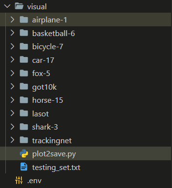
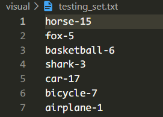

## plot2save.py

可视化对比分析，



```python
import encodings
import numpy as np
import cv2
import os
from PIL import Image


def read_image(filename, color_fmt='RGB'):
    assert color_fmt in Image.MODES
    img = Image.open(filename)
    if not img.mode == color_fmt:
        img = img.convert(color_fmt)
    return np.asarray(img)


def save_image(filename, img, color_fmt='RGB'):
    assert color_fmt in ['RGB', 'BGR']
    if color_fmt == 'BGR' and img.ndim == 3:
        img = img[..., ::-1]
    img = Image.fromarray(img)
    return img.save(filename)


def show_image(
        img,
        bboxes=None,
        bbox_fmt='ltrb',
        colors=None,
        thickness=1,  # 线的粗细，有多个框（trackers）
        fig=1,
        delay=1,
        max_size=640,
        visualize=True,
        cvt_code=cv2.COLOR_RGB2BGR):
    if cvt_code is not None:
        img = cv2.cvtColor(img, cvt_code)

    # resize img if necessary
    if max(img.shape[:2]) > max_size:
        scale = max_size / max(img.shape[:2])
        out_size = (int(img.shape[1] * scale), int(img.shape[0] * scale))
        img = cv2.resize(img, out_size)
        if bboxes is not None:
            bboxes = np.array(bboxes, dtype=np.float32) * scale

    if bboxes is not None:
        assert bbox_fmt in ['ltwh', 'ltrb']
        bboxes = np.array(bboxes, dtype=np.int32)
        if bboxes.ndim == 1:
            bboxes = np.expand_dims(bboxes, axis=0)
        if bboxes.shape[1] == 4 and bbox_fmt == 'ltwh':
            bboxes[:, 2:] = bboxes[:, :2] + bboxes[:, 2:] - 1

        # clip bounding boxes
        h, w = img.shape[:2]
        bboxes[:, 0::2] = np.clip(bboxes[:, 0::2], 0, w)
        bboxes[:, 1::2] = np.clip(bboxes[:, 1::2], 0, h)

        if colors is None:
            colors = [(0, 0, 255), (0, 255, 0), (255, 0, 0), (0, 255, 255), (255, 0, 255), (255, 255, 0), (0, 0, 128),
                      (0, 128, 0), (128, 0, 0), (0, 128, 128), (128, 0, 128), (128, 128, 0)]
        colors = np.array(colors, dtype=np.int32)
        if colors.ndim == 1:
            colors = np.expand_dims(colors, axis=0)

        for i, bbox in enumerate(bboxes):
            color = colors[i % len(colors)]
            if len(bbox) == 4:
                pt1 = (int(bbox[0]), int(bbox[1]))  # 左上
                pt2 = (int(bbox[2]), int(bbox[3]))  # 右下
                img = cv2.rectangle(img, pt1, pt2, color.tolist(), thickness)
            else:
                pts = bbox.reshape(-1, 2)
                img = cv2.polylines(img, [pts], True, color.tolist(), thickness)

    if visualize:
        if isinstance(fig, str):
            winname = fig
        else:
            winname = 'window_{}'.format(fig)
        cv2.imshow(winname, img)
        cv2.waitKey(delay)

    if cvt_code in [cv2.COLOR_RGB2BGR, cv2.COLOR_BGR2RGB]:
        img = cv2.cvtColor(img, cv2.COLOR_BGR2RGB)

    return img


def show_frames(sequence_dir, frame_format, sequence_len, predict_bboxes, sequence_name, color):
    """输出最后的显示结果
    sequence_dir: 序列的文件夹部分
    frame_format: 帧的格式 传入格式化字符串
        '{:08d}.jpg' 表示 GOT-10k 以及 LaSOT 的 frame 格式
        '{}.jpg' 表示 TrackingNet 的格式
    sequence_len: 序列的长度
        设置的原因是: GOT-10k img 里面有一个 groundtruth.txt
    predict_bboxes: 预测的边界框
    """
    for i in range(1, sequence_len):
        # (1) 获取 image
        img_file = os.path.join(sequence_dir, frame_format.format(i))
        # print(img_file)

        # (2) 获取 predict_bbox
        predict_bbox = predict_bboxes[i]
        # # (3) 展示添加预测框的图片
        # flags[0, 1] 分别表示灰度、彩色图像
        # img = cv2.imread(img_file, flags=1)
        img = read_image(filename=img_file, color_fmt='RGB')
        # img = cv2.cvtColor(img, cv2.COLOR_RGB2BGR)
        ## TODO: 不同 Trackers 不同的颜色框
        img = cv2.rectangle(
            img=img,
            pt1=(int(predict_bbox[0]), int(predict_bbox[1])),
            pt2=(int(predict_bbox[0] + predict_bbox[2]), int(predict_bbox[1] + predict_bbox[3])),
            color=color,
            thickness=3,  # 必须是整数！
        )
        # 注意：保存的应该是原始图片帧，而不是缩放等处理之后的图片！
        seq_dir = f"visual/{sequence_name}"
        if not os.path.exists(seq_dir):
            os.makedirs(seq_dir)
        # print(cv2.imwrite(f'visual/{sequence_name}/{i:08d}.jpg', img))
        print(save_image(f'{seq_dir}/{i:08d}.jpg', img))

        ## 缩放只是为了方便看
        # if max(img.shape[:2]) > 640:
        #     scale = 640 / max(img.shape[:2])
        #     out_size = (int(img.shape[1] * scale), int(img.shape[0] * scale))
        #     img = cv2.resize(img, out_size)
        cv2.imshow("TEST", img)
        # 如果路径不存在，不会保存！
        cv2.waitKey(10)
    cv2.destroyAllWindows()


def plot_got10k():
    for n in range(149, 150):
        # sequence_dir = 'data/got10k/test/GOT-10k_Test_{:06d}/'.format(n)
        sequence_dir = 'data/got10k/test/GOT-10k_Test_{:06d}/'.format(n)
        predict_bboxes = []
        with open("visual/got10k/SPPT/GOT-10k_Test_{:06d}/GOT-10k_Test_{:06d}_001.txt".format(n, n)) as fp:
            lines = fp.readlines()
            # print(lines)
            for line in lines:
                predict_bbox = np.fromstring(line, dtype=float, sep=",")
                predict_bboxes.append(predict_bbox)

        show_frames(
            sequence_dir,
            '{:08d}.jpg',
            len(os.listdir(sequence_dir) - 1),
            predict_bboxes,
            sequence_dir.split('/')[-1],
            # color=(254, 254, 252),  # like_white
            color=(0, 0, 255),  # red
        )


def plot_lasot():
    with open('visual/testing_set.txt', 'r') as f:
        sequences_name = f.readlines()
        for sequence_name in sequences_name:
            sequence_name = sequence_name.strip()
            class_name = sequence_name.split('-')[0]

            ## XBL changed; for multi-trackers plot in a picture
            # sequence_dir = f"data/lasot/{class_name}/{sequence_name}/img"  # for the 1th tracker
            sequence_dir = f"visual/{sequence_name}"  # 后续 tracker 都使用保存的图片，不断绘制 bbox

            predict_bboxes = []
            ## TODO: （1）根据 Tracker 更改对应的路径名；（2）修改 bbox 颜色！
            with open(f"visual/lasot/SPPT/{sequence_name}.txt") as fp:
            # with open(f"visual/lasot/TransT/{sequence_name}.txt") as fp:
            # with open(f"visual/lasot/DiMP/{sequence_name}.txt") as fp:
            # with open(f"visual/lasot/SiamR-CNN/{sequence_name}.txt") as fp:
                lines = fp.readlines()
                for line in lines:
                    ## TODO: 检查分隔符是否一致！only for SPPT!
                    predict_bbox = np.fromstring(line, dtype=float, sep=",")
                    predict_bbox = np.fromstring(line, dtype=float, sep=" ")
                    predict_bboxes.append(predict_bbox)

            show_frames(
                sequence_dir,
                '{:08d}.jpg',
                len(os.listdir(sequence_dir)),
                predict_bboxes,
                sequence_name,
                ## TODO: RGB 颜色框设置
                color=(255, 0, 0),  # blue, SPPT -> 红色
                # color=(255, 255, 255),  # like_white, TransT -> 白色
                # color=(255, 255, 0),  # yellow, DiMP -> 黄色
                # color=(0, 0, 255),  # SiamR-CNN 蓝色
            )


if __name__ == '__main__':
    # plot_got10k()
    plot_lasot()

```



testing_set.txt，

```
horse-15
fox-5
basketball-6
shark-3
car-17
bicycle-7
airplane-1
```

3组可视化结果图（不同场景，3大类：有明显优势的场景、相差不多的场景、tracking failed 的场景）

Trackers

- SPPT
- TransT
- DiMP
- SiamR-CNN

 追踪场景，全部来自LoSOT数据集，从上往下：

- horse-15
- shark-3
- airplane-1
- basketball-6
- bicycle-17
- car-17
- fox-5

 airplane-1/horse-15：尺度变换/视野消失

fox-5/basketball/shark-3：背景相似，运动模糊，遮挡，形变，尺度变换，只有在shark3上效果不是很好

bicycle-17：每种方法的效果都还可以，相差不是很大，场景：尺度变换，遮挡，相似物干扰

car-17：效果不是很好，场景：尺度变换，相似干扰，快速移动，小目标