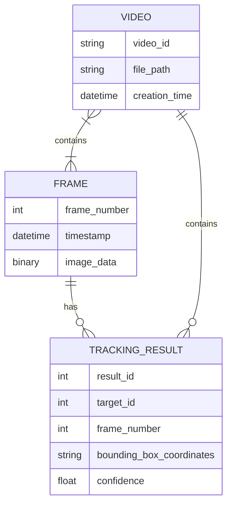

start




`||--o{` 表示一对多的关系，`}|--||` 表示多对多的关系，`}|--` 表示一对多的关系，并且`||--` 表示多对一的关系。

```bash
VIDEO ||--o{ FRAME : contains # 一对多
FRAME ||--o{ TRACKING_RESULT : has # 一对多
FRAME }|--|| TARGET : tracks # 多对多
VIDEO ||--o{ TRACKING_RESULT : contains # 一对多
```

end


# 引用论文

> - [【论文】 查找、下载、引用_在什么上找一个领域的最新论文-CSDN博客](https://blog.csdn.net/qq_38204686/article/details/129339110)
> - [引用ICLR的论文时有页码吗？为什么找不到？ - 知乎](https://www.zhihu.com/question/384581557/answer/1587398171)


## 论文

> 基于多层级 Transformer 的目标跟踪


开题参考的文献链接，

> - [卷积神经网络之“浅层特征”与“深层特征”_一个菜鸟的成长史的博客-CSDN博客](https://blog.csdn.net/m0_62311817/article/details/126064158)
> - [目标跟踪还有的卷吗？最新综述！详解跟踪发展现状与未来方向 - 知乎](https://zhuanlan.zhihu.com/p/609712786)  最新的单目标跟踪算法综述（英文），下一条链接对应原论文
> - [Transformers in Single Object Tracking: An Experimental Survey](https://arxiv.org/pdf/2302.11867.pdf)  非常具有参考价值
> - [343508841.pdf](https://core.ac.uk/download/pdf/343508841.pdf)  目标跟踪算法综述
> - [能量高效的传感器网络空间范围聚集](http://cjc.ict.ac.cn/online/bfpub/hrz-2022331103231.pdf)  跟踪综述
> - [目标跟踪入门_AI熠熠生辉的博客-CSDN博客](https://blog.csdn.net/weixin_36836622/article/details/85644377)
> - [目标跟踪算法综述 - 知乎](https://zhuanlan.zhihu.com/p/433991731)
> - 最后就是 `ChatGPT` 了！生成相关文字，同时对语言进行优化 ==以论文优化 ...==
> - [New chat](https://chat.openai.com/chat)
> - [毕业论文课题研究背景怎么写? - 知乎](https://www.zhihu.com/question/377422313)
> - [毕业论文的研究背景怎么写? - 知乎](https://www.zhihu.com/question/372948104)
> - 


