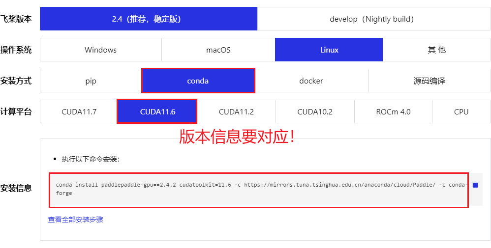
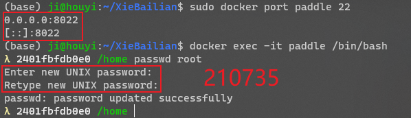
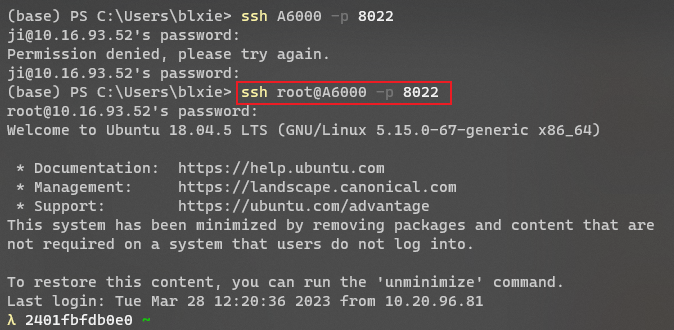
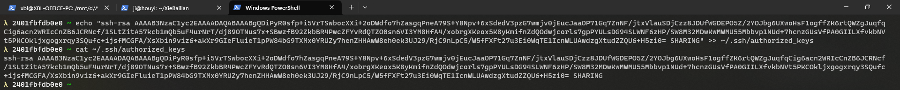

记录时间：2023/3/22


# PaddleOCR

## 直接使用 conda 创建安装

没有安装成功！具体错误查看 [Error](#error) 章节！

> - [PaddleOCR百度开源—文字识别OCR windows端口本地部署使用_百度开源ocr_顽童任逍遥的博客-CSDN博客](https://blog.csdn.net/qq_42368762/article/details/122768234)
> - [PaddleOCR/README_ch.md at release/2.6 · PaddlePaddle/PaddleOCR · GitHub](https://github.com/PaddlePaddle/PaddleOCR/blob/release/2.6/README_ch.md)
> - [Ubuntu20.04使用docker安装PaddleOCR文字识别 [十拍子]](https://www.sopuzi.cn/blog/open/post/642)
> - [PaddleOCR百度开源—文字识别OCR windows端口本地部署使用_百度开源ocr_顽童任逍遥的博客-CSDN博客](https://blog.csdn.net/qq_42368762/article/details/122768234)

通过以下命令安装，

```bash
## 注意使用 pip install 可能存在隐患！
# python3 -m pip install paddlepaddle-gpu -i https://mirror.baidu.com/pypi/simple
conda install paddlepaddle-gpu==2.4.2 cudatoolkit=11.6 -c https://mirrors.tuna.tsinghua.edu.cn/anaconda/cloud/Paddle/ -c conda-forge

# git clone https://github.com/PaddlePaddle/PaddleOCR.git

pip install "paddleocr>=2.0.1" # 推荐使用2.0.1+版本
pip install -r requirements.txt -i https://mirror.baidu.com/pypi/simple

## 供选择，如果不能直接运行：pip install paddleorc 时
# python setup.py develop  # ChatGPT: 关于 install 与 develop 的区别
```


安装的脚本 `paddle.sh`，

```bash
conda deactivate
conda remove -n paddle --all -y
conda create --name paddle python=3.9 -y
source activate paddle
# python3 -m pip install paddlepaddle-gpu==2.4.1.post116 -f https://www.paddlepaddle.org.cn/whl/linux/mkl/avx/stable.html
conda install paddlepaddle-gpu==2.4.2 cudatoolkit=11.6 -c https://mirrors.tuna.tsinghua.edu.cn/anaconda/cloud/Paddle/ -c conda-forge
pip install shapely
pip install scikit-image
pip install imgaug
pip install pyclipper
pip install lmdb
pip install tqdm
pip install numpy
pip install visualdl
pip install rapidfuzz
pip install opencv-python==4.6.0.66
pip install opencv-contrib-python==4.6.0.66
pip install cython
pip install lxml
pip install premailer
pip install openpyxl
pip install attrdict
pip install Polygon3
pip install lanms-neo==1.0.2
pip install "PyMuPDF<1.21.0"
pip install yapf ipython
pip install "paddleocr>=2.0.1"
# conda deactivate
# conda remove -n paddle --all -y
```


检查 paddlepaddle-gpu 安装成功，

```python
import paddle
print(paddle.utils.run_check())
```


### <a id="error">Error</a>

```bash
FatalError: `Segmentation fault` is detected by the operating system.
  [TimeInfo: *** Aborted at 1679451440 (unix time) try "date -d @1679451440" if you are using GNU date ***]
  [SignalInfo: *** SIGSEGV (@0x0) received by PID 4194283 (TID 0x7f4cab7044c0) from PID 0 ***]

段错误 (核心已转储)
```

解决方案，按照 Paddle 官方提供的安装版本选择安装，

> [开始使用_飞桨-源于产业实践的开源深度学习平台](https://www.paddlepaddle.org.cn/install/quick?docurl=/documentation/docs/zh/install/pip/linux-pip.html)

```bash
python -m pip install paddlepaddle-gpu==2.4.2.post116 -f https://www.paddlepaddle.org.cn/whl/linux/mkl/avx/stable.html
```


注意使用 pip 安装可能会导致安装好，但运行不了的情况，提示，

```bash
OSError: (External) CUBLAS error(7). 
  [Hint: Please search for the error code(7) on website (https://docs.nvidia.com/cuda/cublas/index.html#cublasstatus_t) to get Nvidia's official solution and advice about CUBLAS Error.] (at /paddle/paddle/phi/backends/gpu/gpu_context.cc:593)
  [operator < fc > error]
```

改用 `conda install`。




## 使用 Docker 镜像安装

> - [前言 - Docker — 从入门到实践](https://yeasy.gitbook.io/docker_practice/)
> - [Docker 教程 | 菜鸟教程](https://www.runoob.com/docker/docker-tutorial.html)
> - [Docker Docs: How to build, share, and run applications](https://docs.docker.com/)
> - [（三）使用docker来进行paddleocr的安装使用_docker paddleocr_吨吨不打野的博客-CSDN博客](https://blog.csdn.net/Castlehe/article/details/115077818)  参考1
> - [Ubuntu20.04使用docker安装PaddleOCR文字识别 [十拍子]](https://www.sopuzi.cn/blog/open/post/642)  参考2


> 安装 docker & nvidia-docker，
>
> - [Installation Guide — NVIDIA Cloud Native Technologies documentation](https://docs.nvidia.com/datacenter/cloud-native/container-toolkit/install-guide.html#docker)

```bash
## Setting up Docker
curl https://get.docker.com | sh \
  && sudo systemctl --now enable docker
  
## Setting up NVIDIA Container Toolkit
distribution=$(. /etc/os-release;echo $ID$VERSION_ID) \
      && curl -fsSL https://nvidia.github.io/libnvidia-container/gpgkey | sudo gpg --dearmor -o /usr/share/keyrings/nvidia-container-toolkit-keyring.gpg \
      && curl -s -L https://nvidia.github.io/libnvidia-container/$distribution/libnvidia-container.list | \
            sed 's#deb https://#deb [signed-by=/usr/share/keyrings/nvidia-container-toolkit-keyring.gpg] https://#g' | \
            sudo tee /etc/apt/sources.list.d/nvidia-container-toolkit.list
            
sudo apt-get update
sudo apt-get install -y nvidia-container-toolkit
sudo nvidia-ctk runtime configure --runtime=docker
## 测试是否安装成功
sudo docker run --rm --runtime=nvidia --gpus all nvidia/cuda:11.6.2-base-ubuntu20.04 nvidia-smi
```


> 给指定用户添加 `root` 权限，
>
> - [How to fix docker: Got permission denied while trying to connect to the Docker daemon socket | DigitalOcean](https://www.digitalocean.com/community/questions/how-to-fix-docker-got-permission-denied-while-trying-to-connect-to-the-docker-daemon-socket)
> - [How to fix docker: Got permission denied issue - Stack Overflow](https://stackoverflow.com/questions/48957195/how-to-fix-docker-got-permission-denied-issue)

```bash
sudo groupadd docker
sudo usermod -aG docker ${USER}
newgrp docker
docker run hello-world
# 如果以上命令运行之后还是不行，重启使得配置生效！
sudo reboot
```


> 使用 docker 安装 paddlepaddle，
>
> - [飞桨PaddlePaddle-源于产业实践的开源深度学习平台](https://www.paddlepaddle.org.cn/)
> - [Python基础——VScode + docker进行代码调试 | 码农家园](https://www.codenong.com/cs105300459)

```bash
mkdir paddle && cd paddle
# $PWD:paddle 表示映射的路径
# name 表示 创建的docker镜像名称，之后启动可通过该名称进行启动
# cuda/cudnn 版本根据系统的版本进行确定？
sudo nvidia-docker run --gpus all --name paddle -it -v $PWD:/paddle registry.baidubce.com/paddlepaddle/paddle:2.4.2-gpu-cuda11.2-cudnn8.2-trt8.0 /bin/bash

## 安装 paddleocr 环境
pip install paddlepaddle -i https://mirror.baidu.com/pypi/simple

## 再次启动运行
sudo docker container exec -it paddle /bin/bash
```


### VS Code 远程连接 Docker 环境进行开发

> - [docker给已存在的容器添加或修改端口映射_将docker容器里的端口映射到本地_Hello_wshuo的博客-CSDN博客](https://blog.csdn.net/chouzhou9701/article/details/86725203)
> - [Docker修改容器的端口映射和挂载路径 - Mr_Purity - 博客园](https://www.cnblogs.com/ulysessweb/articles/14317537.html)
> - [Docker中使用pytorch报错ERROR: Unexpected bus error encountered in worker. This might be caused by insuffi_docker shm dataloader 总报错_Muzythoof的博客-CSDN博客](https://blog.csdn.net/Muzythoof/article/details/114359078)

如果之前创建容器的时候，没有设置端口映射，需要按照以上的参考链接进行端口映射的配置，

```bash
# 查看容器的详细信息
sudo docker inspect 容器名
sudo docker ps -a
sudo ls /var/lib/docker/containers

# 具体容器下面的文件有
2401fbfdb0e00398cdfe13ad1782391dec0517ad400287f77675d25f3ce960c7-json.log  checkpoints  config.v2.json  hostconfig.json  hostname  hosts  mounts  resolv.conf  resolv.conf.hash
# 对配置文件编辑：添加端口映射，同时修改 Shm 大小
sudo vim /var/lib/docker/containers/2401fbfdb0e00398cdfe13ad1782391dec0517ad400287f77675d25f3ce960c7/hostconfig.json
"PortBindings":{"22/tcp":[{"HostIp":"","HostPort":"8022"}]}
"ShmSize":67108864222
sudo vim /var/lib/docker/containers/2401fbfdb0e00398cdfe13ad1782391dec0517ad400287f77675d25f3ce960c7/config.v2.json
# 由于这里已经有 22 端口号了，就不用再进行设置
"ExposedPorts":{"22/tcp":{},"端口号/tcp":{}}

## 重新启动 docker 守护进程
sudo service docker restart
```

==注意：==以上修改都是在 Containers 没有运行的情况下进行修改的，否则会导致修改不成功！同时，修改完成之后，要重启 docker 守护进程，通过 `docker inspect 容器名称` 查看配置是否修改成功。


>  连接创建好的 docker 容器，
>
> - [ssh连接docker容器；docker容器设置root密码_docker root密码_雪的期许的博客-CSDN博客](https://blog.csdn.net/winter2121/article/details/118223637)

```bash
## 尝试使用 docker images 后的 Container ID 进行连接，失败！直接使用容器名称进行连接
sudo [nvidia-docker/docker] exec -it paddle /bin/bash

## 在 docker 中安装 sshd 服务
# 注意：docker 默认只有一个 root 用户
apt update
apt install -y openssh-server

## 编辑配置
vim /etc/ssh/sshd_config
# 必须添加以下两项配置！
PubkeyAuthentication yes  # 启用公钥私钥配对认证方式
PermitRootLogin yes  # 允许root用户使用ssh登录

## 重启 sshd 服务
/etc/init.d/ssh restart

# 将本机的 id_rsa.pub 公钥添加到 docker 中的授权文件 authorized_keys 中
ssh localhost
echo "ssh-rsa AAAAB3NzaC1yc2EAAAADAQABAAABgQDiPyR0sfp+i5VrTSwbocXXi+2oDWdfo7hZasgqPneA79S+Y8Npv+6xSdedV3pzG7wmjv0jEucJaaOP71Gq7ZnNF/jtxVlauSDjCzz8JDUfWGDEPO5Z/2YOJbg6UXwoHsF1ogffZK6rtQWZgJuqfqCig6acn2WRIcCnZB6JCRNcf/1SLtZitA57kcb1mQb5uF4urNrT/dj89OTNus7x+SBwzfB92ZkbBR4PwcZFYvRdQTZO0sn6VI3YM8HfA4/xobrgXKeox5K8yKmifnZdQOdwjcorls7gpPYULsDG94SLWNF6zHP/SW8M32MDwKwMWMU55Mbbvp1NUd+7hcnzGUsVfPA0GIILXfvkbNVt5PKCOkljxgogxrqy3SQufc+ijsfMCGFA/XsXbin9viz6+akXr9GIeFluieT1pPW84bG9TXMx0YRUZy7henZHHAwW8eh0ek3UJ29/RjC9nLpC5/W5fFXFt27u3Ei0WqTE1IcnWLUAwdzgXtudZZQU6+H5zi0= SHARING" >> ~/.ssh/authorized_keys

## 给 docker 的 root 用户设置密码，方便之后直接使用 vscode ssh 远程登录
passwd root

## 验证端口映射无误
exit  # 退出当前 docker 环境之后进行验证
docker port [容器ID]/容器名称 22
docker port ppocr 22
# 如果设置正确，将输出：
0.0.0.0:8022
[::]:8022

# 通过 ssh 远程连接，注意用户名是 root(docker 中的用户名)
# 将其添加到 ~/.ssh/config 配置文件中即可实现自动登录
ssh root@A6000 -p 8022
```








### 总结（运行步骤）

> 1. 如果要修改配置文件，确保 Containers 没有运行，然后重启 docker 服务；
> 2. 相关命令，
>
> - [Docker常用命令及docker run 和 docker start区别_docker start -it_lvhy踩坑之路的博客-CSDN博客](https://blog.csdn.net/weixin_44722978/article/details/89704085)

```bash
docker ps  # 查看正在运行的容器信息，-a 查看所有的容器信息
docker stop [CONTAINER ID/NAME]  # 停止运行指定的容器
docker rm [CONTAINER ID]  # 删除指定的容器
docker rmi [IMAGE]  # 要删除一个镜像，需要先删除下面所有的容器！
sudo vim /var/lib/docker/containers/[]/hostconfig.json
sudo service docker restart

## 启动容器
# run: 首次创建 Container，两步：（1）将 IMAGE 放入到 Container 中；（2）启动容器
# start: 启动已经创建好的容器
# -v: 映射的路径，可以设置多个，后期可在 hostconfig.json 进行设置修改
# -it: 以交互的方式运行（有一个终端），需要 /bin/bash 参数！
# -d: 后台执行，也就不需要 /bin/bash 参数了！
docker run --gpus all -p S_PORT:C_PORT --shm-size=[]g -v SRC:DST IMAGE信息 --name [CONTAINER NMAE] --it /bin/bash
nvidia-docker run --gpus all -p 8022:22 --shm-size=64g -v /home/ji/XieBailian/proj/AIHE/ppocr:/home/ppocr --name ppocr -it registry.baidubce.com/paddlepaddle/paddle:2.4.2-gpu-cuda11.2-cudnn8.2-trt8.0 bash
# 进入指定的 Container
docker exec -it [CONTAINER ID/NAME] bash
# 只获取 Containers 的 ID
docker ps -a -q
```


## 使用手写字体重新训练微调

> - [手写OCR汇总 - 飞桨AI Studio](https://aistudio.baidu.com/aistudio/datasetdetail/102884/0)


# MMOCR

> - [安装 — MMOCR 0.6.3 文档](https://mmocr.readthedocs.io/zh_CN/latest/install.html#id2)  **注意 git clone 的时候要加上 --branch 具体的tag名称**，否则直接安装最新的版本，导致版本不兼容不匹配！
> - [open-mmlab/mmocr at v0.6.3](https://github.com/open-mmlab/mmocr/tree/v0.6.3)  注意最新版本的架构重组了的！

环境安装脚本 `openmmlab.sh`，

```bash
conda deactivate
conda remove -n openmmlab --all -y
conda create --name openmmlab python=3.8 -y
rm -rf mmocr
source activate openmmlab
conda install pytorch==1.12.1 torchvision==0.13.1 torchaudio==0.12.1 cudatoolkit=11.6 -c pytorch -c conda-forge
pip install openmim
mim install mmcv-full
pip install mmdet
git clone -b "v0.6.3" https://github.com/open-mmlab/mmocr.git
cd mmocr
pip install -r requirements.txt
pip install -v -e .
# "-v" 会让安装过程产生更详细的输出
# "-e" 会以可编辑的方式安装该代码库，你对该代码库所作的任何更改都会立即生效
pip install mmocr
# conda deactivate
# conda remove -n openmmlab --all -y
```


```bash
chmod +x openmmlab.sh
```


测试，

```bash
python mmocr/utils/ocr.py --det DB_r18 --recog CRNN demo/demo_text_det.jpg --imshow
```


# GPT 辅助

> 字帖评分识别

字帖评分识别是指通过计算机视觉和机器学习技术来自动识别和评分手写字帖的质量和准确度。这种技术可以用于教育领域、汉字书写训练以及字帖评估等应用场景。

下面是一种可能的字帖评分识别的工作流程：

1. 数据收集：收集包含手写字帖样本和其对应评分的训练数据集。训练数据集应包括不同难度和样式的字帖样本，以及与每个样本相关联的评分信息。

2. 数据预处理：对训练数据进行预处理，包括图像清晰化、去噪、裁剪和标准化等操作，以准备输入给机器学习模型。

3. 特征提取：使用图像处理技术和特征提取算法，将手写字帖图像转化为数值特征表示。常见的特征提取方法包括形状、轮廓、笔画特征等。

4. 构建评分模型：使用机器学习或深度学习算法，构建一个评分模型。常见的方法包括支持向量机（SVM）、随机森林、卷积神经网络（CNN）等。模型的训练过程将使用预处理后的数据集，其中特征将与其对应的评分进行关联。

5. 模型训练和优化：使用训练数据集对评分模型进行训练，并根据评估指标进行模型调优，以提高识别准确度和性能。

6. 评分识别：将待评分的字帖图像输入训练好的评分模型中，通过模型的预测或分类功能，输出对应的评分结果。

7. 评估和改进：根据评分识别结果进行评估，并根据需要进行改进和优化。这可能包括增加更多的训练样本、调整模型参数、改进特征提取方法等。

需要注意的是，字帖评分识别是一个复杂的任务，其准确性和性能受到多个因素的影响，包括数据质量、训练样本的多样性、特征提取方法的选择和模型的设计等。因此，在实际应用中，需要不断优化和改进模型，以达到更准确和稳定的评分识别结果。


> 该线框为封闭的平面图形，主要为四边形，这里说是四边形因为由于拍照的原因导致图像的线条变形。你的任务是确定一种解决方案可以有效识别这个四边形框的位置信息


