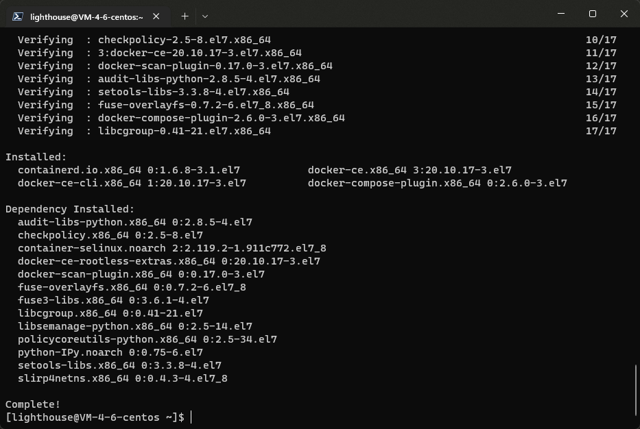
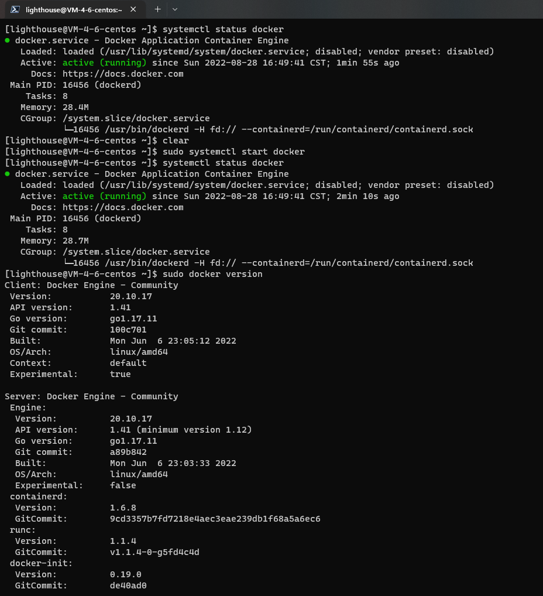
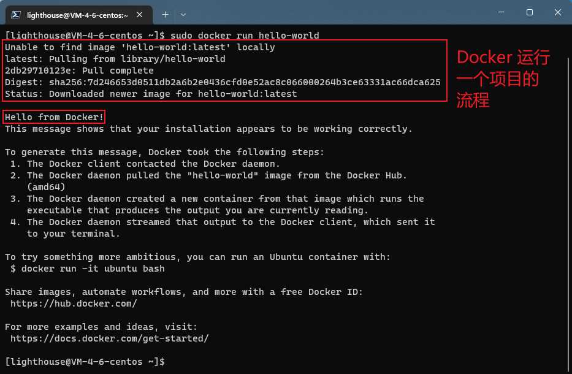
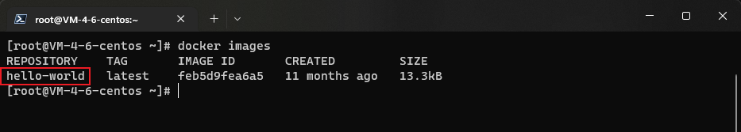
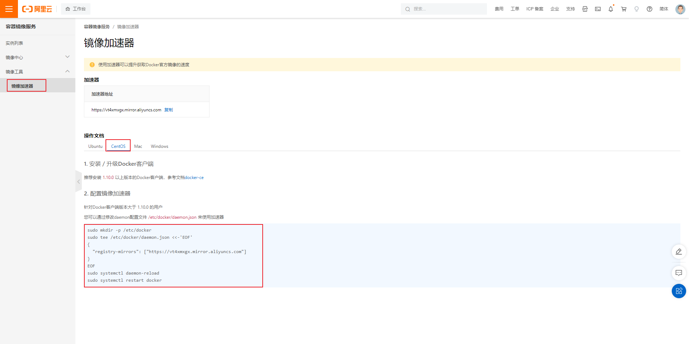
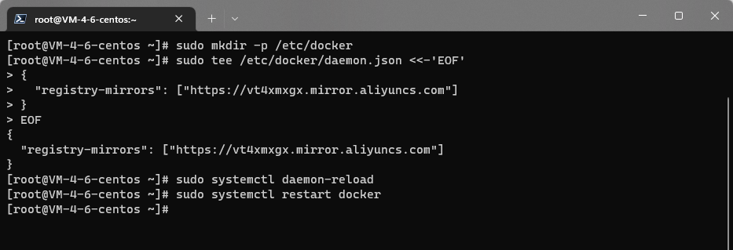

# Docker 安装

## 参考链接

- [6、安装 Docker\_哔哩哔哩\_bilibili](https://www.bilibili.com/video/BV1og4y1q7M4?p=6&vd_source=f01c4b322443fbcb202e2abcaae29044)

## 安装 Docker

> 环境准备

1. Linux 基础
2. CentOS 7.x
3. 远程连接服务器进行操作

> 环境查看

查看系统内核版本，

```bash
[lighthouse@VM-4-6-centos ~]$ uname -a
Linux VM-4-6-centos 3.10.0-1160.71.1.el7.x86_64 #1 SMP Tue Jun 28 15:37:28 UTC 2022 x86_64 x86_64 x86_64 GNU/Linux
```

注意：系统内核必须是 `3.10` 以上。

查看系统版本信息，

```bash
[lighthouse@VM-4-6-centos ~]$ cat /etc/os-release
NAME="CentOS Linux"
VERSION="7 (Core)"
ID="centos"
ID_LIKE="rhel fedora"
VERSION_ID="7"
PRETTY_NAME="CentOS Linux 7 (Core)"
ANSI_COLOR="0;31"
CPE_NAME="cpe:/o:centos:centos:7"
HOME_URL="https://www.centos.org/"
BUG_REPORT_URL="https://bugs.centos.org/"

CENTOS_MANTISBT_PROJECT="CentOS-7"
CENTOS_MANTISBT_PROJECT_VERSION="7"
REDHAT_SUPPORT_PRODUCT="centos"
REDHAT_SUPPORT_PRODUCT_VERSION="7"
```

> 安装 `Docker`

- 官方说明文档：[Docker Documentation | Docker Documentation](https://docs.docker.com/)
- 在 `CentOS` 上进行安装：[Install Docker Engine on CentOS | Docker Documentation](https://docs.docker.com/engine/install/centos/)

```bash
# 1. 卸载旧的版本
sudo yum remove docker \
                  docker-client \
                  docker-client-latest \
                  docker-common \
                  docker-latest \
                  docker-latest-logrotate \
                  docker-logrotate \
                  docker-engine
```

```bash
# 2. 安装依赖包
sudo yum install -y yum-utils
```

```bash
# 3. 设置镜像的仓库，注意这里要更改为阿里云的仓库源
sudo yum-config-manager \
    --add-repo \
    http://mirrors.aliyun.com/docker-ce/linux/centos/docker-ce.repo
```

```bash
# 安装之前，先进行 yum 包索引更新
sudo yum makecache fast

# 4. 安装 Docker，默认安装最新的即可，如果需要指定版本安装，参考官方说明文档
sudo yum install docker-ce docker-ce-cli containerd.io docker-compose-plugin
```



```bash
# 5. 启动 Docker 服务
sudo systemctl start docker
systemctl status docker
```

```bash
# 6. 查看是否安装成功
sudo docker version
docker -v/V  # 注意与上一条命令有区别
```



```bash
# 7. 运行测试案例 hello-world
sudo docker run hello-world
```



到此说明 `Docker` 已经安装成功！

```bash
# 8. 查看已经下载的 docker 镜像
docker images
```



了解：卸载 `Docker`

```bash
# （1）卸载依赖包
sudo yum remove docker-ce docker-ce-cli containerd.io docker-compose-plugin

# （2）删除资源文件
sudo rm -rf /var/lib/docker
sudo rm -rf /var/lib/containerd
```

## 阿里云镜像加速

1. 登录 阿里云：[阿里云-为了无法计算的价值](https://www.aliyun.com/)
2. 在 产品 -- 弹性计算 -- 容器 -- 容器镜像服务 ACR，或者直接搜索 “容器镜像服务” 即可；找到镜像加速器 [容器镜像服务](https://cr.console.aliyun.com/cn-shenzhen/instances/mirrors)（每个人都有，免费使用）
   
3. 配置使用

```bash
sudo mkdir -p /etc/docker

sudo tee /etc/docker/daemon.json <<-'EOF'
{
"registry-mirrors": ["https://vt4xmxgx.mirror.aliyuncs.com"]
}
EOF

sudo systemctl daemon-reload

sudo systemctl restart docker
```


