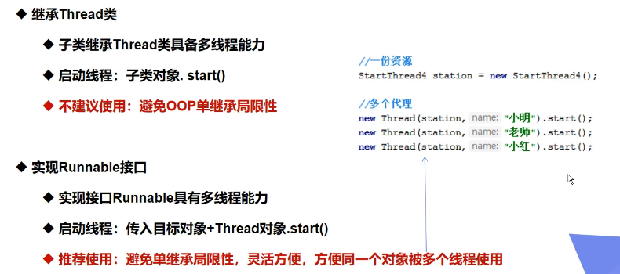
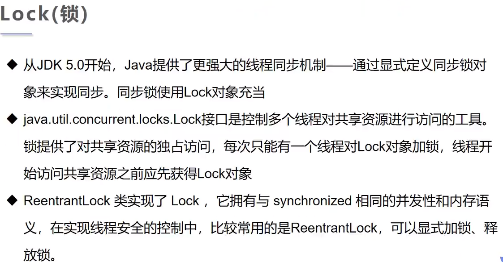
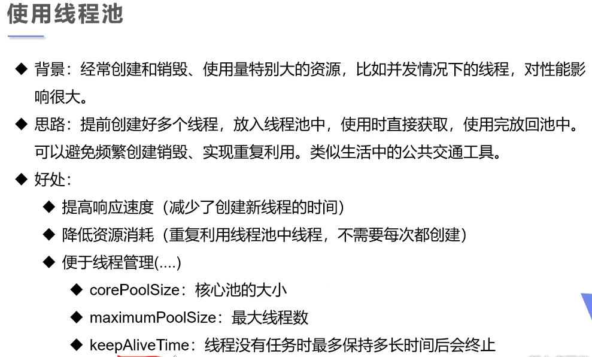

## Stage1

分别讲述实现多线程的 3 种方式，

- `extends Thread`
- `implements Runable` 推荐使用
- `implements Callable` 和第二种类似，但是有返回值，同时需要指定返回值的类型

## Stage2

拓展讲解：静态代理的实现原理，

这里讲解的原因：`Runable` 的实现使用了静态代理的机制！

## Stage3

分别讲述线程的几种状态模式，对应到几种对线程的不同操作方法，

> > `sleep`
> >
> > `stop`
>
> 建议手动中断线程，不要使用被弃用的方法 `stop()/destroy()`！
>
> > `yield` 线程礼让
>
> 不一定让后面的线程先执行，而是将当前线程停止，`CPU` 回收该进程占用的资源，然后将当前线程又重新加入到线程队列/栈中，然后再次执行；
>
> > `join` 有点像插队的意思，了解即可，少使用！
>
> `CPU` 优先执行当前插入的线程！

线程的几大状态模式 `Thread.State`，直接在源码中进行查看！

- `NEW`：调用 `start()` 之前都是该状态

## Stage4

守护线程 daemon，

- 线程分为 用户线程（main | gcc） 和 守护线程；
- 虚拟机必须确保 用户线程 执行完毕；
- 虚拟机不用等待守护线程执行完毕；
- 应用场景：后台记录操作日志、监控内存、垃圾回收等待……

## Stage5

线程同步：多个线程操作同一份资源（并发）

实质：一种等待机制

对象等待池（队列结构）：依次执行

实现原理：队列 + 锁（必须！）

> 模拟延时：sleep 可以放大问题的发生性！

同步方法：`synchronized` 内部实现原理即 队列+锁，可作用在方法和对象上，一般作用在 需要修改的代码块上！

即最好不要同时拥有多个资源的锁，原子性隔离开来！

> Lock 显示定义同步锁
>
> ReentrantLock 实现的 Lock

## Stage6 线程池

