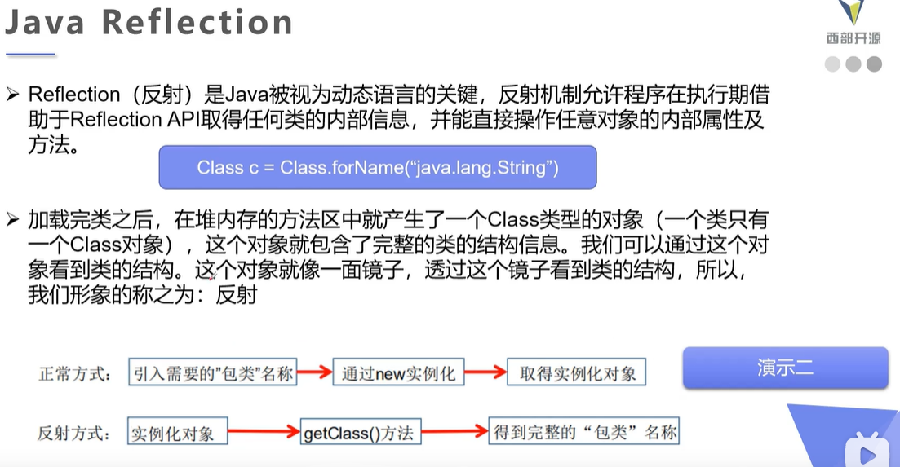
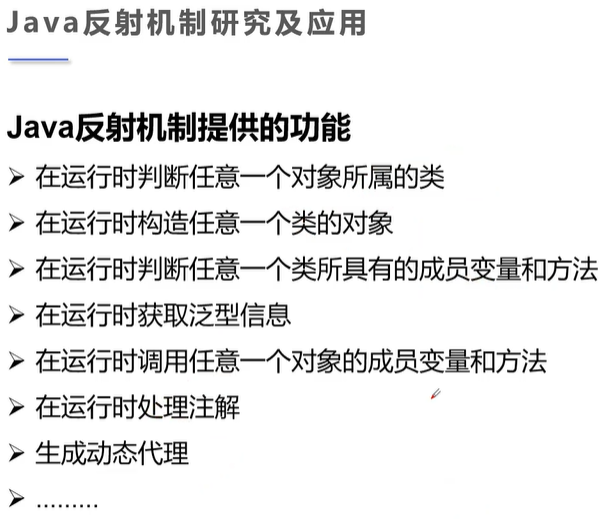
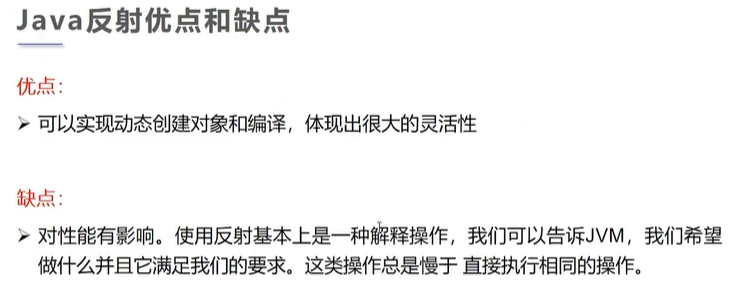
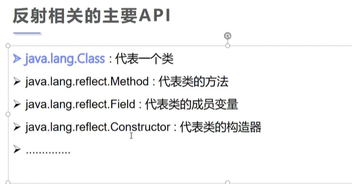

测试注解，

```java
package com.blxie.demo01;

import java.lang.annotation.*;

/*
测试元注解：
以下两个常用！
Target 作用的范围（方法/类/...）@Target({TYPE, FIELD, METHOD, PARAMETER, CONSTRUCTOR, LOCAL_VARIABLE, MODULE})
Retention 注解的存活时间/作用的时间

Documented 是否生成文档信息
Inherited 子类是否可以继承父类的注解
 */
@MyAnnotation
public class TestMetaAnnotation {
    // 测试自定义注解
    @MyAnnotation
    public void test() {

    }

    public static void main(String[] args) {

    }
}

/*
定义一个注解
一个 module 只有一个 public class
一个文件里
面只有一个公共的 class
 */
// 是否将注解生成在 JAVADoc 中
@Documented
// 子类是否可继承父类的注解
@Inherited
// 规定有效作用域
@Target(value = {ElementType.METHOD, ElementType.TYPE})
// 自定义的类基本都写 RUNTIME，运行时仍有效
// SOURCE --> CLASS --> RUNTIME 层层递进
@Retention(value = RetentionPolicy.RUNTIME)
@interface MyAnnotation {

}
```


测试自定义注解，

```java
package com.blxie.demo01;

import java.lang.annotation.ElementType;
import java.lang.annotation.Retention;
import java.lang.annotation.RetentionPolicy;
import java.lang.annotation.Target;

/*
测试自定义注解
 */
public class CustomizedAnno01 {
    /*
    注解可以显示赋值，如果没有默认值，就必须要给注解赋值
    注解赋值没有顺序之分！
     */
    @MyAnnotation02(name = "blxie", schools = {"重庆邮电大学"})
    public void test() {

    }

    @MyAnnotation03("blxie")
    public void test2() {

    }
}

// 元注解
@Target({ElementType.TYPE, ElementType.METHOD})
@Retention(RetentionPolicy.RUNTIME)
@interface MyAnnotation02 {
    /*
    设置注解的参数：参数类型 + 参数名();
    注意：必须加()，命名规范！
     */
    String name() default "";

    int age() default 18;

    int id() default -1;  // 如果默认值为 -1，表示不存在，和 indexof 类似

    String[] schools() default {"CQU", "CQUPT"};
}

@Target({ElementType.TYPE, ElementType.METHOD})
@Retention(RetentionPolicy.RUNTIME)
@interface MyAnnotation03 {
    /*
    只有一个参数的情况，建议使用 value 命名！
    因为当变量名为 value 的时候，可以直接在 注解处 省略变量名，而如果是其他变量名，不可以省略！
     */
    String value();
}
```


## 反射 Reflection（重点！）


正是有了该机制，才使得 Java 具有动态性！


注解和反射机制搭配使用！使用反射机制调用注解。














