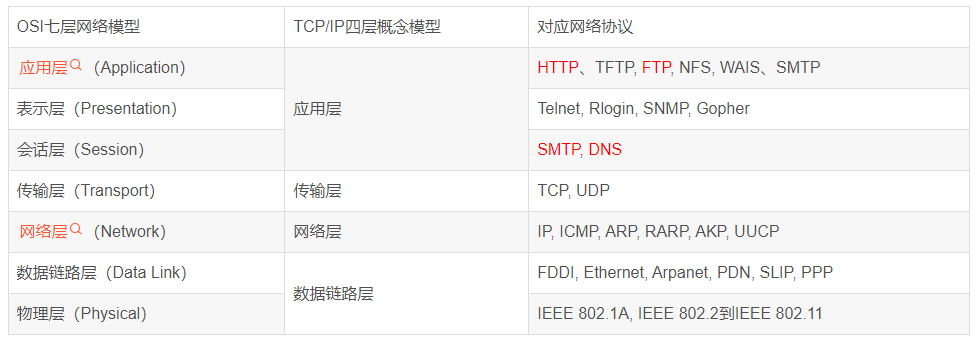
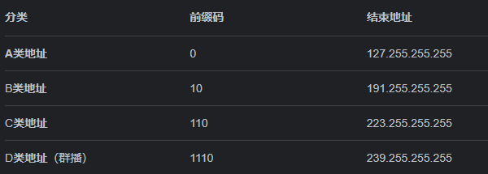

# 网络编程


**网络编程的目的：信息/数据交换，通信**


JavaWeb —— 网页编程，B/S 架构

网络编程 —— TCP/IP	C/S 架构


## 1.2、网络通信的要素


> 如何实现网络的通信？

（1）通信双方的地址，

- IP
- 端口号


（2）规则：网络通信的协议

[一文读懂OSI七层模型与TCP/IP四层的区别/联系_Y1ran_的博客-CSDN博客_osi七层模型和tcpip模型](https://blog.csdn.net/qq_39521554/article/details/79894501)




小结：

1. 网络编程中有两个主要的问题
   - 如何准确定位到网络上的一台或者多台主机
   - 找到主机后如何进行通信
2. 网络编程中的要素
   - IP 和 端口号（IP 类）
   - 网络通信协议（TCP/UDP 类）
3. Java 万物皆对象，所以 `2` 中的所有概念都可以在 Java 中找到封装好的实现类！


## 1.3、IP


IP 地址：`InetAddress`

- 唯一定位一台网络上的设备

- 127.0.0.1

- IP 地址分类

  - IPV4/6

  - 公网（互联网）/私网（局域网）

    - ABCD 类地址
    - 192.168.xxx.xxx
    - 10.xxx.xxx.xxx

    

- 域名：IP 别名


## 1.4、端口


端口：计算机上一个程序的进程！一个端口对应一个进程，

- 不同的进程有不同的端口号，用于区分软件

- 0 ~ 65535

- TCP/UDP, $65535\times2$ 

  TCP/UDP 可同时使用 80 端口，即单个协议下，端口号不能冲突，不同的协议可以使用相同的端口号！

- 端口分类

  - 公有端口：0 ~ 1023

    - HTTP 80
    - HTTPS 443
    - FTP 21
    - SSH 22
    - TELENT 23

  - 程序注册端口：1024 ~ 49151，分配给用户或者程序

    - Tomcat 8080
    - MySQL 3306
    - Oracle 1521

  - 动态、私有端口（某些软件自带的端口，比如 IDEA/VSCode）：49152 ~ 65535

    ```bash
    netstat -ano  # 查看所有的端口
    netstat -ano | findstr "3389"  # 查看指定的端口
    tasklist | findstr "3389"  # 查看指定端口的进程
    ```

    

## 1.6、TCP


客户端，

1. 连接服务器 Socket
2. 发送消息 OutputStream

服务器，

1. 建立服务的端口 ServerSocket
2. 等待客户端连接 accept
3. 接收用户发送的消息 InputStream


### 案例：文件上传


原理：将文件转换为流，上传到服务器


### Tomcat

服务端，

- 自定义 S
- Tomcat 服务器（8080端口）（已经写好，封装好的 TCP/UDP server 接口）S

客户端，

- 自定义 C
- 浏览器 B


## 1.7、UDP


不用连接，但是需要知道对方的地址！


## 1.8、URL


```
协议://IP地址:端口号/项目名/资源文件
```


常用 `URL` 类的相关方法，

```java
package com.blxie.demo03;

import java.net.MalformedURLException;
import java.net.URL;

/*
网络编程实战：下载网络上的资源文件
 */
public class URLDemo01 {
    public static void main(String[] args) throws MalformedURLException {
        URL url = new URL("http://localhost:8080/helloworld/hello.txt");

        // 常用的方法
        System.out.println(url.getProtocol());  // 协议
        System.out.println(url.getHost());  // 主机 IP
        System.out.println(url.getPort());  // 端口
        System.out.println(url.getPath());  // 文件
        System.out.println(url.getFile());  // 全路径
        System.out.println(url.getQuery());  // 参数
    }
}

```


模拟下载网络上的资源文件，

```java
package com.blxie.demo03;

import java.io.FileOutputStream;
import java.io.IOException;
import java.io.InputStream;
import java.net.HttpURLConnection;
import java.net.URL;

/*
模拟下载网络上的资源文件
 */
public class URLDownloadDemo01 {
    public static void main(String[] args) throws IOException {
        // 1. 下载地址
        URL url = new URL("http://localhost:8080/helloworld/hello.txt");

        // 2. 连接到这个资源 HTTP
        HttpURLConnection urlConnection = (HttpURLConnection) url.openConnection();

        // 3. 下载：网络上的一切数据都是以 数据流 的形式存在
        InputStream inputStream = urlConnection.getInputStream();
        // 为下载到本地准备资源
        FileOutputStream fileOutputStream = new FileOutputStream("hello.txt");
        byte[] buffer = new byte[1024];
        int len;
        while ((len = inputStream.read(buffer)) != -1) {
            fileOutputStream.write(buffer, 0, len);  // 从流中写出数据到本地
        }

        // 关闭资源
        fileOutputStream.close();
        inputStream.close();
        urlConnection.disconnect();  // 关闭连接
    }
}

```


