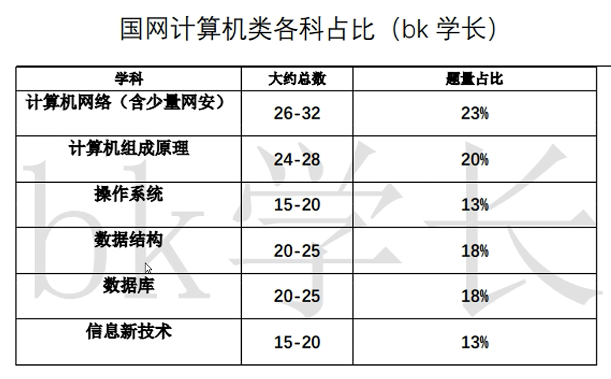
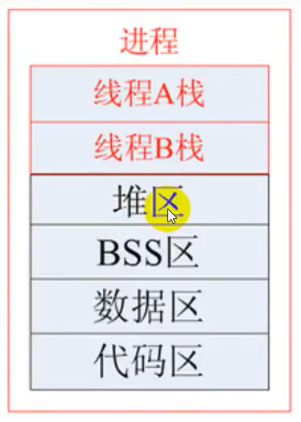

# 国网计算机操作系统

操作系统基础
进程与线程管理
内存管理
文件管理
输入输出管理
操作系统安全与保护

https://www.bilibili.com/video/BV1rw411c7vw

## 操作系统基础

## 进程与线程管理

## 内存管理

## 文件管理

## 输入输出管理

## 操作系统安全与保护

# 基础知识

## 汇编

推荐王爽老师的 《汇编语言》，配合 B站 小甲鱼的视频进行学习 [【汇编语言】小甲鱼零基础汇编真正全集1-17章_哔哩哔哩_bilibili](https://www.bilibili.com/video/BV1zW411n79C/?spm_id_from=333.788.recommend_more_video.8&vd_source=f01c4b322443fbcb202e2abcaae29044)

# 视频

## B站哈工大

> 提示：先了解汇编基础知识：王爽老师的书 [1.2 视频通知 2019年7月25日_哔哩哔哩_bilibili](https://www.bilibili.com/video/BV1mt411R7Xv?p=2&spm_id_from=pageDriver&vd_source=f01c4b322443fbcb202e2abcaae29044)
>
> [L2 开始揭开钢琴的盖子_哔哩哔哩_bilibili](https://www.bilibili.com/video/BV1d4411v7u7?p=2&spm_id_from=pageDriver&vd_source=f01c4b322443fbcb202e2abcaae29044)

中国大学 MOOC：[操作系统_中国大学MOOC(慕课)](https://www.icourse163.org/learn/HIT-1002531008?tid=1450346461#/learn/content?type=detail&id=1214728533&cid=1218670723)

## 进程和线程

- 进程可以蜕变为线程；

- 进程是资源管家，相当于公司中的领导，资源分配调度；线程相当于实际干活的员工；

- 进程：深拷贝；线程：浅拷贝

- 线程可以共享进程的所有资源，线程本身占用的资源很少（程序计数器，少量寄存器，栈...）

- 创建进程的 `fork()`，创建线程的 `pthread_creat()`，底层实现都是基于 `clone()`；

  - 如果复制对方的地址空间，相当于将内容进行了一份完整的拷贝，就产生一个 “进程”；
  - 如果共享对方的地址空间，就产生一个“线程”。

  Linux 内核不区分 “进程/线程”，只在用户层进行区分，方便分配管理。因此，线程所有的操作函数 `pthread_*` 都是库函数，而非系统调用！

> 内存分布：栈向下生长，堆向上

> 线程共享资源

1) 文件描述符
2) 每种信号的处理方式
3) 当前工作目录
4) 用户 ID 和 组 ID
5) 内存地址空间
   - `./text` 代码段
   - `/.data` 数据段：已初始化的全局变量
   - ``/.bss` 未初始化的数据段
   - `/heap`
   - `/共享库`

> 线程非共享资源

1) 线程 ID
2) 处理器现场和栈指针（内核栈）
3) 独立的栈空间（用户空间栈）
4) `errno` 变量
5) 信号屏蔽字
6) 调度优先级

