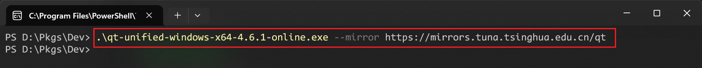
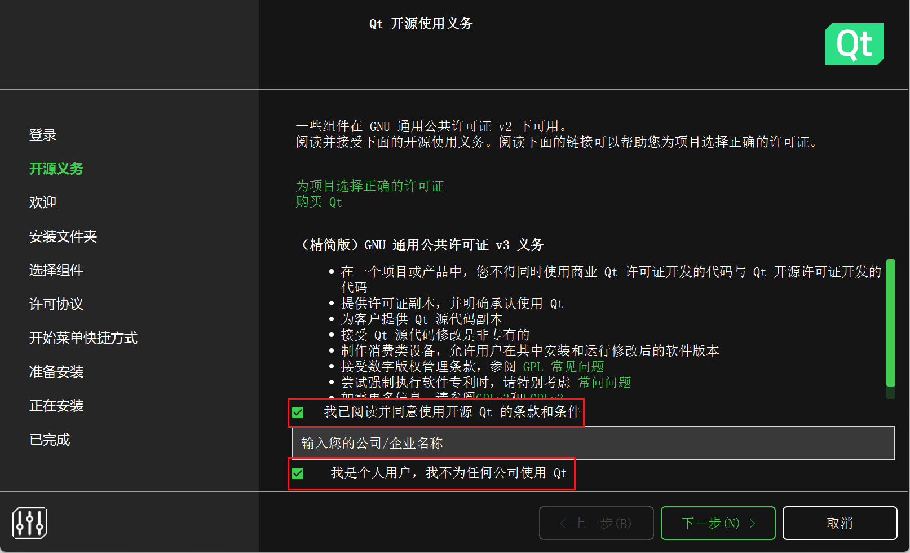
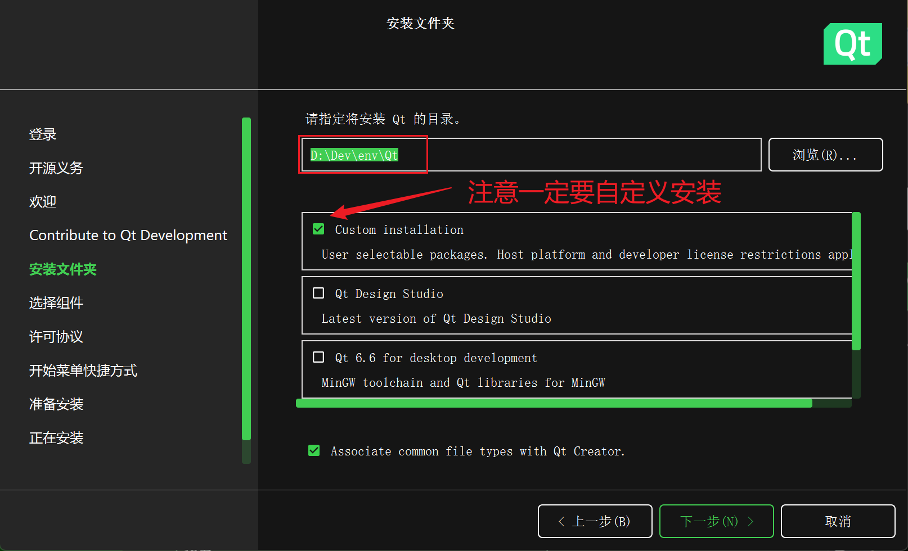
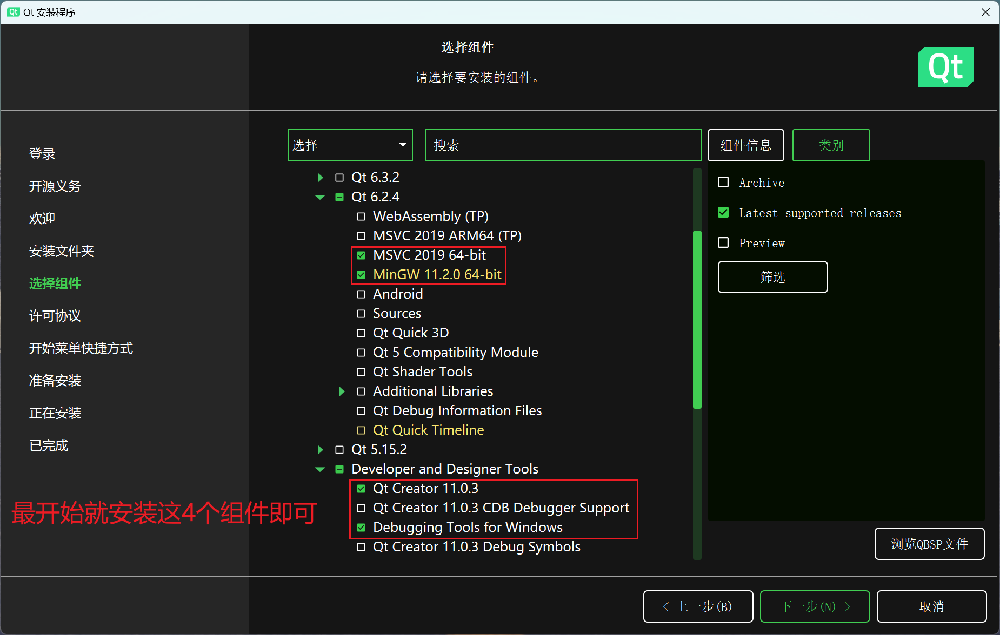

下载安装包：https://download.qt.io/official_releases/online_installers/

不要直接运行！！！在命令行中添加 mirror，注意不是 mirrors！

```
--mirror https://mirrors.aliyun.com/qt
--mirror https://mirrors.tuna.tsinghua.edu.cn/qt
```



输入账号密码登录，






先安装最基础的开发环境，后续需要什么功能，通过 `Qt/MaintainTools.exe` 进行安装即可！



总共占用 ~2GB 空间，

其中 `CMake & Ninja` 如果后续有报错才进行安装，动态扩展！
`CDB Debug` 也是，后续看是否需要安装，

