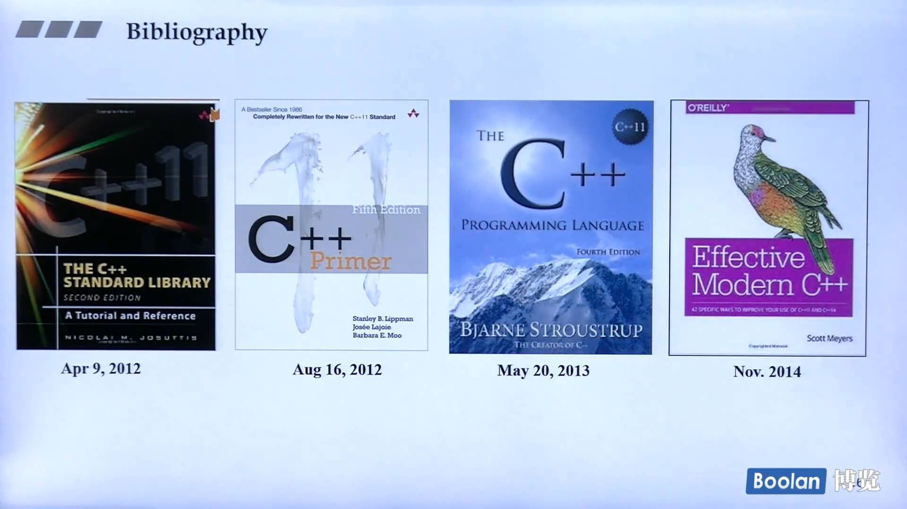

> - [ZachL1/Bilibili-plus: 课程视频、PPT和源代码：侯捷C++系列；台大郭彦甫MATLAB](https://github.com/ZachL1/Bilibili-plus)




## 面向对象（上）

### Class 4. 参数传递与返回值

> 从效率的角度出发，C++ 注重有效率的开发，每一个可能影响到效率的地方都要考虑到！

**pass by value vs. pass by reference (to const)**

#### 参数

函数参数传递最好都传**引用**，只占用指针的 4bytes，而不是将整份数据打包压入到 stack 中，提高操作的效率，节省内存资源；

如果是字符 1byte，根据实际情况进行选择，总体建议使用引用传递；

- 如果不希望 function 修改传入的参数值，不影响原始数据，在 function args 栏添加 const 修饰符，修饰 引用，即 reference to const；
- 需要 function 将处理之后的数据影响到原始变量，即 function 的功能就包括对输入参数进行处理并返回时，就不能加上 const；


友元函数：friend 声明的函数

可以直接访问 class 的 private 属性，一定程度上破坏封装性，但是提供了一种外界访问私有成员变量的一种方法；

如果不是 friend function of class，只能通过 class 提供的私有数据访问方式（一般是一个 function）来进行获取！

相同 class 的各个 object 互为 friend！

```cpp
class complex
{
public:
	int complex_add_rm(const complex &param)
    {
        // 相同 class 的各个 object 互为 friend，所以可以直接访问 private 属性
        // 而不需要借助获取 private 属性的相关接口方法 function
        return param.re + param.im;  // 返回实部和虚部的和
    }
    // ...
private:
    double re;  // real 实部
    double im;  // image 虚部
};
```


#### 返回值

返回值同样有两种方式，

- 返回值
- 返回值的引用（可以的话，尽量选择引用）

return by reference 传递者无需知道接收者是 以何种方式（by value/reference） 接收！


临时对象的生命周期只在当前语句执行结束！


控制流操作符重载只能写成全局作用域的方法，不能限定在 ::class/typename 上！


