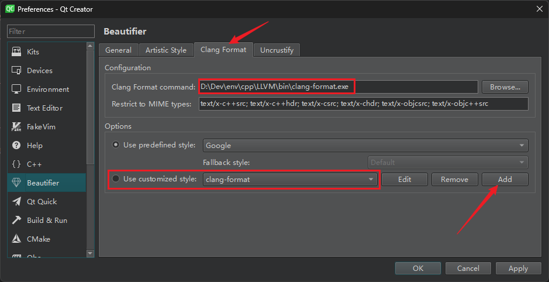
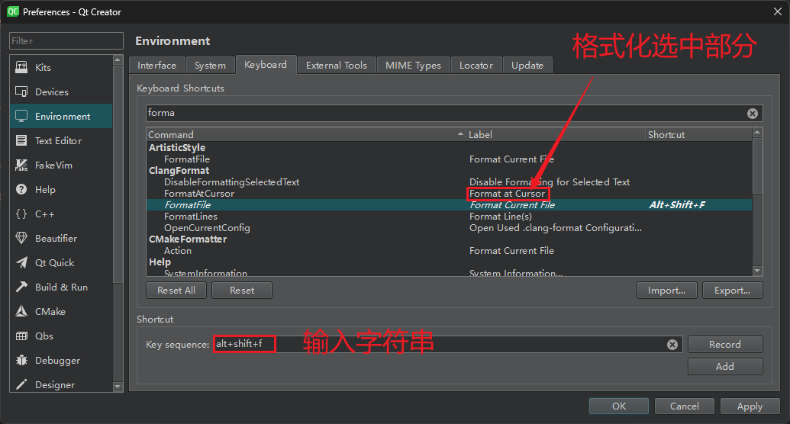
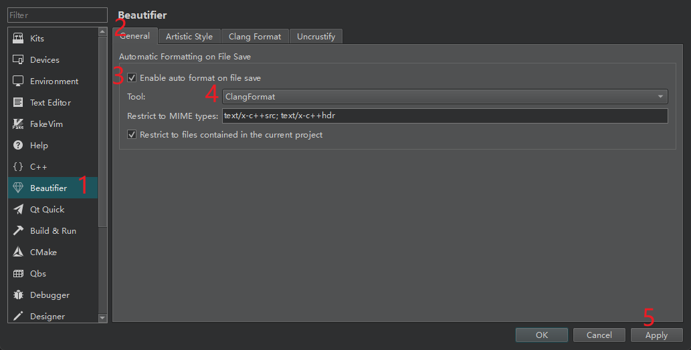

在学习和开发 C++ 程序时，以下是一些有用的 C++ 参考网站：

1. **C++ 官方网站**（cppreference）：https://en.cppreference.com/
   这是 C++ 官方参考网站，提供了 C++ 标准库的详细文档和参考手册，包含了大量的函数、类和数据结构的信息。

2. **C++ 标准委员会**（ISO C++）：https://isocpp.org/
   这是国际标准化组织（ISO）C++ 标准委员会的官方网站，提供了 C++ 语言的最新标准和草案文档，以及关于 C++ 标准开发和进展的信息。

3. **cplusplus.com**：http://www.cplusplus.com/
   这是一个广受欢迎的 C++ 学习网站，提供了丰富的教程、参考和论坛，适合初学者和进阶者。

4. **GeeksforGeeks**：https://www.geeksforgeeks.org/c-plus-plus/
   GeeksforGeeks 是一个计算机科学学习平台，提供了丰富的 C++ 教程和问题解答，涵盖了各种主题和算法。

5. **cplusplus.com 参考手册**：http://www.cplusplus.com/reference/
   这是 cplusplus.com 提供的 C++ 参考手册，类似于 cppreference，提供了 C++ 标准库的详细文档。

6. **Stack Overflow**：https://stackoverflow.com/
   Stack Overflow 是一个面向程序员的问答社区，你可以在这里寻求关于 C++ 编程的帮助和解答问题。

7. **GitHub**：https://github.com/
   GitHub 是一个全球最大的开源代码托管平台，你可以在这里找到许多优秀的 C++ 开源项目，并学习别人的代码。

8. **LearnCpp.com**：https://www.learncpp.com/
   LearnCpp.com 是一个提供 C++ 教程的网站，适合初学者，从基础到高级，逐步引导学习 C++ 编程。

这些网站都是非常有用的资源，可以帮助你学习和了解 C++ 编程语言的各个方面。无论是初学者还是有经验的开发者，这些网站都可以为你提供有价值的参考和学习资料。


> - 很值得一看：[Ubuntu c/c++ 开发环境 - Bigben - 博客园](https://www.cnblogs.com/bigben0123/articles/13999358.html)


# Win11 安装 WSL (Windows Subsystem for Linux)

> - [Windows Subsystem for Linux Documentation | Microsoft Learn](https://learn.microsoft.com/en-us/windows/wsl/)
> - [Basic commands for WSL | Microsoft Learn](https://learn.microsoft.com/en-us/windows/wsl/basic-commands) 主要看这一节 `wsl` 相关的命令


```powershell
# 列出可安装的发行版本：https://linux.cn/article-12609-1.html
wsl --list --online
wsl -l -o

# 安装相应的发行版本
wsl --install -d Ubuntu-22.04 --inbox --enable-wsl1
# 然后直接在开始菜单中点击登录，Windows 终端自动添加
```


> `VS Code` 中使用 `WSL`，
>
> - 安装 `Remote Development` 插件，自动识别 `WSL` 子系统，然后和远程连接使用一致；
> - `df -h` 可以看到 系统盘符 在 `WSL` 中的位置 `mnt/盘符名 (/mnt/c; /mnt/d)`，直接使用命令进行文件的拷贝；


# Linux CPP 编译环境

> - [Setting up C++ Development Environment - GeeksforGeeks](https://www.geeksforgeeks.org/setting-c-development-environment/)


```bash
sudo apt update & sudo apt upgrade
sudo apt install build-essential
g++ --version
```


如果 VS Code 还是无法找到，重启 VS 即可。


# Qt 环境搭建

## 1、下载安装

通过镜像进行安装：https://www.bilibili.com/video/BV1km4y1k7CW/?p=3

- 先安装最简单的工具套件；
- 后续需要什么功能，再通过 Qt > MaintenanceTool.exe 进行补充安装即可！

```bash
qt-unified-windows-x64-4.5.2-online.exe --mirror https://mirrors.aliyun.com/qt
qt-unified-windows x64-4.5.2-online.exe --mirror https://mirrors.tuna.tsinghua.edu.cn/qt/

MaintenanceTool.exe --mirror https://mirrors.aliyun.com/qt
MaintenanceTool.exe --mirror https://mirrors.tuna.tsinghua.edu.cn/qt/
```


# 格式化

LLVM clang-format：[QtCreator代码格式化 - 简书 (jianshu.com)](https://www.jianshu.com/p/4311cea76a10)

## Qt Creator

开启格式化：Help > About Plugins > C++ | Beautifier

下载安装 LLVM：[Releases · llvm/llvm-project (github.com)](https://github.com/llvm/llvm-project/releases/)

设置：tools > external > configure > Beautifier，直接添加自定义格式，不用每次都在项目下面新建 .clang-format 格式文件。



```yaml
# Defines the QtCreator style for automatic reformatting.
# http://clang.llvm.org/docs/ClangFormatStyleOptions.html
Language: Cpp
BasedOnStyle: Google
Standard: Cpp11
AccessModifierOffset: -4
AlignConsecutiveAssignments: true
AlignConsecutiveDeclarations: true
AlwaysBreakTemplateDeclarations: true
BinPackArguments: true
BinPackParameters: true
BreakBeforeBinaryOperators: All
BreakBeforeBraces: Mozilla
ColumnLimit: 120  # 根据实际情况进行修改
ContinuationIndentWidth: 4
ForEachMacros:   
  - foreach
  - Q_FOREACH
  - BOOST_FOREACH
IndentCaseLabels: true
IndentPPDirectives: None
IndentWidth: 4
```

Apply > OK，然后设置格式化快捷键，



更方便的是，设置保存时自动格式化代码，



## 完整的 .clang-format

> - vscode c++ clong-format 格式化代码：https://blog.csdn.net/core571/article/details/82867932

使用 clong-format 生成 llvm 格式的模板，

```bash
clang-format -style=llvm -dump-config > .clang-format
```

### 生成的模板

```yaml
---
Language:        Cpp
# BasedOnStyle:  LLVM
# 访问修饰符 public/private... 顶格：和 IndentWidth 对应
AccessModifierOffset: -4
AlignAfterOpenBracket: Align
AlignArrayOfStructures: None
AlignConsecutiveMacros: None
AlignConsecutiveAssignments: None
AlignConsecutiveBitFields: None
AlignConsecutiveDeclarations: None
AlignEscapedNewlines: Right
AlignOperands:   Align
AlignTrailingComments: true
AllowAllArgumentsOnNextLine: true
AllowAllParametersOfDeclarationOnNextLine: true
AllowShortEnumsOnASingleLine: true
AllowShortBlocksOnASingleLine: Never
AllowShortCaseLabelsOnASingleLine: false
AllowShortFunctionsOnASingleLine: Inline  # All/Inline, Inline 表示允许将短函数放在一行上
AllowShortLambdasOnASingleLine: All
AllowShortIfStatementsOnASingleLine: Never
AllowShortLoopsOnASingleLine: false
AlwaysBreakAfterDefinitionReturnType: None
AlwaysBreakAfterReturnType: None
AlwaysBreakBeforeMultilineStrings: false
AlwaysBreakTemplateDeclarations: MultiLine
AttributeMacros:
  - __capability
BinPackArguments: true
BinPackParameters: true
BraceWrapping:
  AfterCaseLabel:  false
  AfterClass:      false
  AfterControlStatement: Never
  AfterEnum:       false
  AfterFunction:   false
  AfterNamespace:  false
  AfterObjCDeclaration: false
  AfterStruct:     false
  AfterUnion:      false
  AfterExternBlock: false
  BeforeCatch:     false
  BeforeElse:      false
  BeforeLambdaBody: false
  BeforeWhile:     false
  IndentBraces:    false
  SplitEmptyFunction: true
  SplitEmptyRecord: true
  SplitEmptyNamespace: true
BreakBeforeBinaryOperators: None
BreakBeforeConceptDeclarations: true
BreakBeforeBraces: Attach  # Allman 表示大括号单独成行
BreakBeforeInheritanceComma: false
BreakInheritanceList: BeforeColon
BreakBeforeTernaryOperators: true
BreakConstructorInitializersBeforeComma: false
BreakConstructorInitializers: BeforeColon
BreakAfterJavaFieldAnnotations: false
BreakStringLiterals: true
ColumnLimit:     100
CommentPragmas:  '^ IWYU pragma:'
QualifierAlignment: Leave
CompactNamespaces: false
ConstructorInitializerIndentWidth: 4
ContinuationIndentWidth: 4
Cpp11BracedListStyle: true
DeriveLineEnding: true
DerivePointerAlignment: false
DisableFormat:   false
EmptyLineAfterAccessModifier: Never
EmptyLineBeforeAccessModifier: LogicalBlock
ExperimentalAutoDetectBinPacking: false
PackConstructorInitializers: BinPack
BasedOnStyle:    ''
ConstructorInitializerAllOnOneLineOrOnePerLine: false
AllowAllConstructorInitializersOnNextLine: true
FixNamespaceComments: true
ForEachMacros:
  - foreach
  - Q_FOREACH
  - BOOST_FOREACH
IfMacros:
  - KJ_IF_MAYBE
IncludeBlocks:   Preserve
IncludeCategories:
  - Regex:           '^"(llvm|llvm-c|clang|clang-c)/'
    Priority:        2
    SortPriority:    0
    CaseSensitive:   false
  - Regex:           '^(<|"(gtest|gmock|isl|json)/)'
    Priority:        3
    SortPriority:    0
    CaseSensitive:   false
  - Regex:           '.*'
    Priority:        1
    SortPriority:    0
    CaseSensitive:   false
IncludeIsMainRegex: '(Test)?$'
IncludeIsMainSourceRegex: ''
IndentAccessModifiers: false
IndentCaseLabels: false
IndentCaseBlocks: false
IndentGotoLabels: true
IndentPPDirectives: None
IndentExternBlock: AfterExternBlock
IndentRequires:  false
IndentWidth:     4
IndentWrappedFunctionNames: false
InsertTrailingCommas: None
JavaScriptQuotes: Leave
JavaScriptWrapImports: true
KeepEmptyLinesAtTheStartOfBlocks: true
LambdaBodyIndentation: Signature
MacroBlockBegin: ''
MacroBlockEnd:   ''
MaxEmptyLinesToKeep: 1
NamespaceIndentation: None
ObjCBinPackProtocolList: Auto
ObjCBlockIndentWidth: 2
ObjCBreakBeforeNestedBlockParam: true
ObjCSpaceAfterProperty: false
ObjCSpaceBeforeProtocolList: true
PenaltyBreakAssignment: 2
PenaltyBreakBeforeFirstCallParameter: 19
PenaltyBreakComment: 300
PenaltyBreakFirstLessLess: 120
PenaltyBreakOpenParenthesis: 0
PenaltyBreakString: 1000
PenaltyBreakTemplateDeclaration: 10
PenaltyExcessCharacter: 1000000
PenaltyReturnTypeOnItsOwnLine: 60
PenaltyIndentedWhitespace: 0
PointerAlignment: Right
PPIndentWidth:   -1
ReferenceAlignment: Pointer
ReflowComments:  true
RemoveBracesLLVM: false
SeparateDefinitionBlocks: Leave
ShortNamespaceLines: 1
SortIncludes:    CaseSensitive
SortJavaStaticImport: Before
SortUsingDeclarations: true
SpaceAfterCStyleCast: false
SpaceAfterLogicalNot: false
SpaceAfterTemplateKeyword: true
SpaceBeforeAssignmentOperators: true
SpaceBeforeCaseColon: false
SpaceBeforeCpp11BracedList: false
SpaceBeforeCtorInitializerColon: true
SpaceBeforeInheritanceColon: true
SpaceBeforeParens: ControlStatements
SpaceBeforeParensOptions:
  AfterControlStatements: true
  AfterForeachMacros: true
  AfterFunctionDefinitionName: false
  AfterFunctionDeclarationName: false
  AfterIfMacros:   true
  AfterOverloadedOperator: false
  BeforeNonEmptyParentheses: false
SpaceAroundPointerQualifiers: Default
SpaceBeforeRangeBasedForLoopColon: true
SpaceInEmptyBlock: false
SpaceInEmptyParentheses: false
SpacesBeforeTrailingComments: 1
SpacesInAngles:  Never
SpacesInConditionalStatement: false
SpacesInContainerLiterals: true
SpacesInCStyleCastParentheses: false
SpacesInLineCommentPrefix:
  Minimum:         1
  Maximum:         -1
SpacesInParentheses: false
SpacesInSquareBrackets: false
SpaceBeforeSquareBrackets: false
BitFieldColonSpacing: Both
Standard:        Latest
StatementAttributeLikeMacros:
  - Q_EMIT
StatementMacros:
  - Q_UNUSED
  - QT_REQUIRE_VERSION
TabWidth:        8
UseCRLF:         false
UseTab:          Never
WhitespaceSensitiveMacros:
  - STRINGIZE
  - PP_STRINGIZE
  - BOOST_PP_STRINGIZE
  - NS_SWIFT_NAME
  - CF_SWIFT_NAME
...


```


### 模板 1

```yaml
---
# 语言: None, Cpp, Java, JavaScript, ObjC, Proto, TableGen, TextProto
Language:	Cpp
# BasedOnStyle:	LLVM
# 访问说明符(public、private等)的偏移
AccessModifierOffset:	-2
# 开括号(开圆括号、开尖括号、开方括号)后的对齐: Align, DontAlign, AlwaysBreak(总是在开括号后换行)
AlignAfterOpenBracket:	Align
# 连续赋值时，对齐所有等号
AlignConsecutiveAssignments:	true
# 连续声明时，对齐所有声明的变量名
AlignConsecutiveDeclarations:	true
 
AlignEscapedNewlines: Right
 
# 左对齐逃脱换行(使用反斜杠换行)的反斜杠
#AlignEscapedNewlinesLeft:	true
# 水平对齐二元和三元表达式的操作数
AlignOperands:	true
# 对齐连续的尾随的注释
AlignTrailingComments:	true
 
# 允许函数声明的所有参数在放在下一行
AllowAllParametersOfDeclarationOnNextLine:	false
# 允许短的块放在同一行
AllowShortBlocksOnASingleLine:	true
# 允许短的case标签放在同一行
AllowShortCaseLabelsOnASingleLine:	true
# 允许短的函数放在同一行: None, InlineOnly(定义在类中), Empty(空函数), Inline(定义在类中，空函数), All
AllowShortFunctionsOnASingleLine:	Empty
# 允许短的if语句保持在同一行
AllowShortIfStatementsOnASingleLine:	false
# 允许短的循环保持在同一行
AllowShortLoopsOnASingleLine:	false
 
# 总是在定义返回类型后换行(deprecated)
AlwaysBreakAfterDefinitionReturnType:	None
# 总是在返回类型后换行: None, All, TopLevel(顶级函数，不包括在类中的函数), 
#   AllDefinitions(所有的定义，不包括声明), TopLevelDefinitions(所有的顶级函数的定义)
AlwaysBreakAfterReturnType:	None
# 总是在多行string字面量前换行
AlwaysBreakBeforeMultilineStrings:	false
# 总是在template声明后换行
AlwaysBreakTemplateDeclarations:	false
# false表示函数实参要么都在同一行，要么都各自一行
BinPackArguments:	true
# false表示所有形参要么都在同一行，要么都各自一行
BinPackParameters:	false
# 大括号换行，只有当BreakBeforeBraces设置为Custom时才有效
BraceWrapping:   
  # class定义后面
  AfterClass:	false
  # 控制语句后面
  AfterControlStatement:	false
  # enum定义后面
  AfterEnum:	false
  # 函数定义后面
  AfterFunction:	true
  # 命名空间定义后面
  AfterNamespace:	false
  # ObjC定义后面
  AfterObjCDeclaration:	false
  # struct定义后面
  AfterStruct:	true
  # union定义后面
  AfterUnion:	true
 
  AfterExternBlock: false
  # catch之前
  BeforeCatch:	true
  # else之前
  BeforeElse:	true
  # 缩进大括号
  IndentBraces:	false
  SplitEmptyFunction: true
  SplitEmptyRecord: true
  SplitEmptyNamespace: true
 
# 在二元运算符前换行: None(在操作符后换行), NonAssignment(在非赋值的操作符前换行), All(在操作符前换行)
BreakBeforeBinaryOperators:	None
# 在大括号前换行: Attach(始终将大括号附加到周围的上下文), Linux(除函数、命名空间和类定义，与Attach类似), 
#   Mozilla(除枚举、函数、记录定义，与Attach类似), Stroustrup(除函数定义、catch、else，与Attach类似), 
#   Allman(总是在大括号前换行), GNU(总是在大括号前换行，并对于控制语句的大括号增加额外的缩进), WebKit(在函数前换行), Custom
#   注：这里认为语句块也属于函数
BreakBeforeBraces:	Custom
# 在三元运算符前换行
BreakBeforeTernaryOperators:	false
 
# 在构造函数的初始化列表的逗号前换行
BreakConstructorInitializersBeforeComma:	false
BreakConstructorInitializers: BeforeColon
# 每行字符的限制，0表示没有限制
ColumnLimit:	120
# 描述具有特殊意义的注释的正则表达式，它不应该被分割为多行或以其它方式改变
CommentPragmas:	'^ IWYU pragma:'
CompactNamespaces: false
# 构造函数的初始化列表要么都在同一行，要么都各自一行
ConstructorInitializerAllOnOneLineOrOnePerLine:	false
# 构造函数的初始化列表的缩进宽度
ConstructorInitializerIndentWidth:	4
# 延续的行的缩进宽度
ContinuationIndentWidth:	4
# 去除C++11的列表初始化的大括号{后和}前的空格
Cpp11BracedListStyle:	true
# 继承最常用的指针和引用的对齐方式
DerivePointerAlignment:	false
# 关闭格式化
DisableFormat:	false
# 自动检测函数的调用和定义是否被格式为每行一个参数(Experimental)
ExperimentalAutoDetectBinPacking:	false
# 需要被解读为foreach循环而不是函数调用的宏
ForEachMacros:	[ foreach, Q_FOREACH, BOOST_FOREACH ]
# 对#include进行排序，匹配了某正则表达式的#include拥有对应的优先级，匹配不到的则默认优先级为INT_MAX(优先级越小排序越靠前)，
#   可以定义负数优先级从而保证某些#include永远在最前面
IncludeCategories: 
  - Regex:	'^"(llvm|llvm-c|clang|clang-c)/'
    Priority:	2
  - Regex:	'^(<|"(gtest|isl|json)/)'
    Priority:	3
  - Regex:	'.*'
    Priority:	1
# 缩进case标签
IndentCaseLabels:	true
 
IndentPPDirectives:  AfterHash
# 缩进宽度
IndentWidth:	4
# 函数返回类型换行时，缩进函数声明或函数定义的函数名
IndentWrappedFunctionNames:	false
# 保留在块开始处的空行
KeepEmptyLinesAtTheStartOfBlocks:	false
# 开始一个块的宏的正则表达式
MacroBlockBegin:	''
# 结束一个块的宏的正则表达式
MacroBlockEnd:	''
# 连续空行的最大数量
MaxEmptyLinesToKeep:	1
# 命名空间的缩进: None, Inner(缩进嵌套的命名空间中的内容), All
NamespaceIndentation:	Inner
# 使用ObjC块时缩进宽度
ObjCBlockIndentWidth:	4
# 在ObjC的@property后添加一个空格
ObjCSpaceAfterProperty:	false
# 在ObjC的protocol列表前添加一个空格
ObjCSpaceBeforeProtocolList:	true
 
 
# 在call(后对函数调用换行的penalty
PenaltyBreakBeforeFirstCallParameter:	19
# 在一个注释中引入换行的penalty
PenaltyBreakComment:	300
# 第一次在<<前换行的penalty
PenaltyBreakFirstLessLess:	120
# 在一个字符串字面量中引入换行的penalty
PenaltyBreakString:	1000
# 对于每个在行字符数限制之外的字符的penalty
PenaltyExcessCharacter:	1000000
# 将函数的返回类型放到它自己的行的penalty
PenaltyReturnTypeOnItsOwnLine:	60
 
# 指针和引用的对齐: Left, Right, Middle
PointerAlignment:	Left
# 允许重新排版注释
ReflowComments:	true
# 允许排序#include
SortIncludes:	true
 
# 在C风格类型转换后添加空格
SpaceAfterCStyleCast:	false
 
SpaceAfterTemplateKeyword: true
 
# 在赋值运算符之前添加空格
SpaceBeforeAssignmentOperators:	true
# 开圆括号之前添加一个空格: Never, ControlStatements, Always
SpaceBeforeParens:	ControlStatements
# 在空的圆括号中添加空格
SpaceInEmptyParentheses:	false
# 在尾随的评论前添加的空格数(只适用于//)
SpacesBeforeTrailingComments:	2
# 在尖括号的<后和>前添加空格
SpacesInAngles:	false
# 在容器(ObjC和JavaScript的数组和字典等)字面量中添加空格
SpacesInContainerLiterals:	false
# 在C风格类型转换的括号中添加空格
SpacesInCStyleCastParentheses:	false
# 在圆括号的(后和)前添加空格
SpacesInParentheses:	false
# 在方括号的[后和]前添加空格，lamda表达式和未指明大小的数组的声明不受影响
SpacesInSquareBrackets:	false
# 标准: Cpp03, Cpp11, Auto
Standard:	Cpp11
# tab宽度
TabWidth:	4
# 使用tab字符: Never, ForIndentation, ForContinuationAndIndentation, Always
UseTab:	Never
...


```


### 模板 2

```yaml
# 语言: None, Cpp, Java, JavaScript, ObjC, Proto, TableGen, TextProto
Language: Cpp
# 未在配置中专门设置的所有选项所使用的样式
BasedOnStyle:  Google
# 访问说明符(public、private等)的偏移
AccessModifierOffset: -4
# 开括号(开圆括号、开尖括号、开方括号)后的对齐: Align, DontAlign, AlwaysBreak(总是在开括号后换行)
AlignAfterOpenBracket: AlwaysBreak
# 连续赋值时，对齐所有等号
AlignConsecutiveAssignments: true
# 连续声明时，对齐所有声明的变量名
AlignConsecutiveDeclarations: true
# 左对齐逃脱换行(使用反斜杠换行)的反斜杠
AlignEscapedNewlines: Right
# 水平对齐二元和三元表达式的操作数
AlignOperands: true
# 对齐连续的尾随的注释
AlignTrailingComments: true
# 允许函数声明的所有参数在放在下一行
AllowAllParametersOfDeclarationOnNextLine: true
# 允许短的块放在同一行
AllowShortBlocksOnASingleLine: false
# 允许短的case标签放在同一行
AllowShortCaseLabelsOnASingleLine: false
# 允许短的函数放在同一行: None, InlineOnly(定义在类中), Empty(空函数), Inline(定义在类中，空函数), All
AllowShortFunctionsOnASingleLine: Empty
# 允许短的lambda放在同一行
AllowShortLambdasOnASingleLine: Empty
# 允许短的if语句保持在同一行
AllowShortIfStatementsOnASingleLine: true
# 允许短的循环保持在同一行
AllowShortLoopsOnASingleLine: false
# 总是在定义返回类型后换行(deprecated)
AlwaysBreakAfterDefinitionReturnType: None
# 总是在返回类型后换行: None, All, TopLevel(顶级函数，不包括在类中的函数),
#   AllDefinitions(所有的定义，不包括声明), TopLevelDefinitions(所有的顶级函数的定义)
AlwaysBreakAfterReturnType: None
# 总是在多行string字面量前换行
AlwaysBreakBeforeMultilineStrings: false
# 总是在template声明后换行
AlwaysBreakTemplateDeclarations: true
# false表示函数实参要么都在同一行，要么都各自一行
BinPackArguments: true
# false表示所有形参要么都在同一行，要么都各自一行
BinPackParameters: true
# 在二元运算符前换行: None(在操作符后换行), NonAssignment(在非赋值的操作符前换行), All(在操作符前换行)
BreakBeforeBinaryOperators: All
# 在大括号前换行: Attach(始终将大括号附加到周围的上下文), Linux(除函数、命名空间和类定义，与Attach类似),
#   Mozilla(除枚举、函数、记录定义，与Attach类似), Stroustrup(除函数定义、catch、else，与Attach类似),
#   Allman(总是在大括号前换行), GNU(总是在大括号前换行，并对于控制语句的大括号增加额外的缩进), WebKit(在函数前换行), Custom
#   注：这里认为语句块也属于函数
BreakBeforeBraces: Mozilla
# 继承列表的逗号前换行
BreakBeforeInheritanceComma: false
# 在三元运算符前换行
BreakBeforeTernaryOperators: true
# 在构造函数的初始化列表的逗号前换行
BreakConstructorInitializersBeforeComma: false
# 初始化列表前换行
BreakConstructorInitializers: BeforeComma
# Java注解后换行
BreakAfterJavaFieldAnnotations: false

BreakStringLiterals: true
# 每行字符的限制，0表示没有限制
ColumnLimit:     120
# 描述具有特殊意义的注释的正则表达式，它不应该被分割为多行或以其它方式改变
CommentPragmas:  '^ IWYU pragma:'
# 紧凑 命名空间
CompactNamespaces: false
# 构造函数的初始化列表要么都在同一行，要么都各自一行
ConstructorInitializerAllOnOneLineOrOnePerLine: true
# 构造函数的初始化列表的缩进宽度
ConstructorInitializerIndentWidth: 4
# 延续的行的缩进宽度
ContinuationIndentWidth: 4
# 去除C++11的列表初始化的大括号{后和}前的空格
Cpp11BracedListStyle: false
# 继承最常用的指针和引用的对齐方式
DerivePointerAlignment: false
# 关闭格式化
DisableFormat:   false
# 自动检测函数的调用和定义是否被格式为每行一个参数(Experimental)
ExperimentalAutoDetectBinPacking: false
# 固定命名空间注释
FixNamespaceComments: true
# 需要被解读为foreach循环而不是函数调用的宏
ForEachMacros:   
  - foreach
  - Q_FOREACH
  - BOOST_FOREACH

IncludeBlocks:   Preserve
# 对#include进行排序，匹配了某正则表达式的#include拥有对应的优先级，匹配不到的则默认优先级为INT_MAX(优先级越小排序越靠前)，
#   可以定义负数优先级从而保证某些#include永远在最前面
IncludeCategories: 
  - Regex:           '^"(llvm|llvm-c|clang|clang-c)/'
    Priority:        2
  - Regex:           '^(<|"(gtest|gmock|isl|json)/)'
    Priority:        3
  - Regex:           '.*'
    Priority:        1
IncludeIsMainRegex: '(Test)?$'
# 缩进case标签
IndentCaseLabels: true

IndentPPDirectives: None
# 缩进宽度
IndentWidth:     4
# 函数返回类型换行时，缩进函数声明或函数定义的函数名
IndentWrappedFunctionNames: false

JavaScriptQuotes: Leave

JavaScriptWrapImports: true
# 保留在块开始处的空行
KeepEmptyLinesAtTheStartOfBlocks: true
# 开始一个块的宏的正则表达式
MacroBlockBegin: ''
# 结束一个块的宏的正则表达式
MacroBlockEnd:   ''
# 连续空行的最大数量
MaxEmptyLinesToKeep: 1

# 命名空间的缩进: None, Inner(缩进嵌套的命名空间中的内容), All
NamespaceIndentation: All
# 使用ObjC块时缩进宽度
ObjCBlockIndentWidth: 4
# 在ObjC的@property后添加一个空格
ObjCSpaceAfterProperty: true
# 在ObjC的protocol列表前添加一个空格
ObjCSpaceBeforeProtocolList: true

PenaltyBreakAssignment: 2

PenaltyBreakBeforeFirstCallParameter: 19
# 在一个注释中引入换行的penalty
PenaltyBreakComment: 300
# 第一次在<<前换行的penalty
PenaltyBreakFirstLessLess: 120
# 在一个字符串字面量中引入换行的penalty
PenaltyBreakString: 1000
# 对于每个在行字符数限制之外的字符的penalty
PenaltyExcessCharacter: 1000000
# 将函数的返回类型放到它自己的行的penalty
PenaltyReturnTypeOnItsOwnLine: 60
# 指针和引用的对齐: Left, Right, Middle
PointerAlignment: Left

#RawStringFormats: 
#  - Delimiter:       pb
#    Language:        TextProto
#    BasedOnStyle:    google
# 允许重新排版注释
ReflowComments:  true
# 允许排序#include
SortIncludes:    true

SortUsingDeclarations: true
# 在C风格类型转换后添加空格
SpaceAfterCStyleCast: false
# 模板关键字后面添加空格
SpaceAfterTemplateKeyword: true
# 在赋值运算符之前添加空格
SpaceBeforeAssignmentOperators: true
# 开圆括号之前添加一个空格: Never, ControlStatements, Always
SpaceBeforeParens: ControlStatements
# 在空的圆括号中添加空格
SpaceInEmptyParentheses: false
# 在尾随的评论前添加的空格数(只适用于//)
SpacesBeforeTrailingComments: 4
# 在尖括号的<后和>前添加空格
SpacesInAngles:  false
# 在容器(ObjC和JavaScript的数组和字典等)字面量中添加空格
SpacesInContainerLiterals: true
# 在C风格类型转换的括号中添加空格
SpacesInCStyleCastParentheses: false
# 在圆括号的(后和)前添加空格
SpacesInParentheses: false
# 在方括号的[后和]前添加空格，lamda表达式和未指明大小的数组的声明不受影响
SpacesInSquareBrackets: false
# 标准: Cpp03, Cpp11, Auto
Standard:        Cpp11
# tab宽度
TabWidth:        4
# 使用tab字符: Never, ForIndentation, ForContinuationAndIndentation, Always
UseTab:          Never
```

