# BLAINET’S WEBSITE

based on github.io & docusaurus.(start from 2024/3/22 中午 ~ 2024/3/24-02:12:36)

> - [How to setup Algolia DocSearch | How to Code](https://www.howtocode.io/posts/algolia/how-to-setup-algolia-doc-search)

## 一、环境搭建

### 1、node.js

安装好之后，

```bash
node -V
```


## 二、项目创建之本地搭建

使用 npm 安装 docusaurus。

> - [facebook/docusaurus: Easy to maintain open source documentation websites.](https://github.com/facebook/docusaurus)

首先，npm 创建一个项目，

```bash
npm init docusaurus@latest
## 本地安装部署
npm run build
npm run deploy
num run start
```

具体步骤如下，

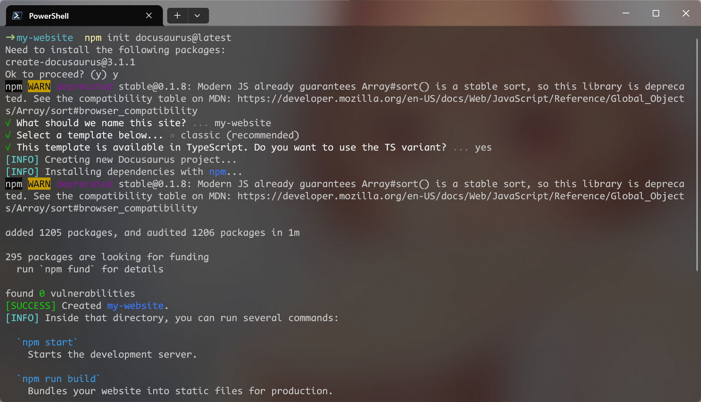

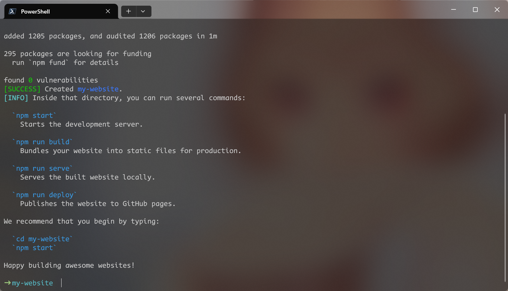


> - [安装流程 | Docusaurus](https://docusaurus.io/zh-CN/docs/installation)

*使用 docusaurus 官方文档中的这个命令会提示报错！*

```bash
npx create-docusaurus@latest my-website classic
```


## 三、项目创建之部署发布

docusaurus + githubio.


### 1、在 GitHub 创建一个新的 GitHub pages 项目

> - [GitHub Pages | Websites for you and your projects, hosted directly from your GitHub repository. Just edit, push, and your changes are live.](https://pages.github.com/)

按照官方的说明要求，创建一个 `.github.io` 项目，专门用于网站搭建，

创建一个新的项目，名为 `登录用户名.github.io`，本文中为，

```bash
blxie.github.io
```


### 2、上传 my-website 到 GitHub pages 仓库

首先修改 `docusaurus.config.js`，

```yaml
// Set the production url of your site here
url: "https://blxie.github.io/",
// Set the /<baseUrl>/ pathname under which your site is served
// For GitHub pages deployment, it is often '/<projectName>/'
baseUrl: "/",

// GitHub pages deployment config.
// If you aren't using GitHub pages, you don't need these.
organizationName: "blxie", // Usually your GitHub org/user name.
projectName: "blxie.github.io", // Usually your repo name.
```


其他部分不变，

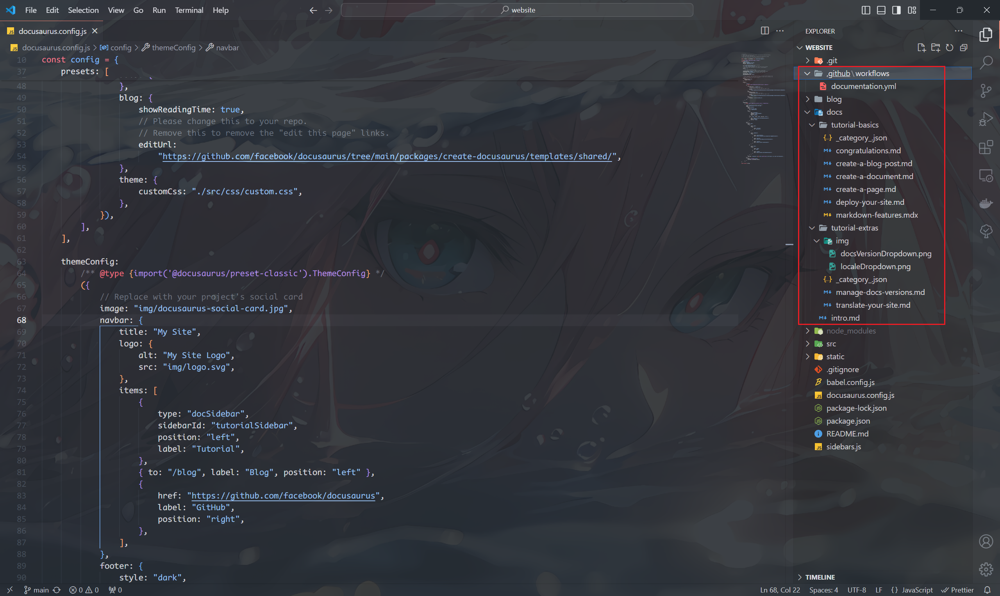


将第二部分创建的本地 docusaurus 项目上传到这个项目中，有两种方式实现，


**（1）使用默认的方法，一行一行命令设置**

```bash
code my-website
git init
git config --global user.name "blxie"
git config --global user.email "blxie@outlook.com"
git add .
git commit -m "first commit, init proj"
git branch -M main
## 注意这里必须用 SSH，并在设置中配置 Deploy keys
# 具体可以参考 docusaurus 的 github 说明文档
git remote add origin git@github.com:blxie/blxie.github.io.git
git push -u origin main
```


如果出现连接不上的问题，比如端口错误，大概率是端口转发的问题，或者 `~/.ssh/config` 设置问题，将 `Host *` 里面的非公共部分提出！

```bash
# Read more about SSH config files: https://linux.die.net/man/5/ssh_config
# https://www.jianshu.com/p/92d60c6c92ef
## 校园网
Host A4000
    HostName 10.16.64.67
    User guest
    Port 5122
Host A6000
    HostName 10.16.93.52
    User ji
    Port 5122
Host RTX3090
    HostName 10.16.42.114
    User guest
    Port 5122
## 内网穿透
Host NAT-A4000
    HostName 107.174.181.186
    User guest
    Port 14000
Host NAT-RTX3090
    HostName 43.143.59.35
    User guest
    Port 13090
Host VPS
    HostName 107.174.181.186
    User root
    Port 22
## 虚拟机
Host vmus
    HostName 192.168.56.101
    User blainet
    Port 22
## 共同配置，注意需要写在最后，如果以上配置中和下面的有重复，优先选取上面的
Host *
    IdentityFile ~/.ssh/id_rsa
    ForwardAgent yes
    ServerAliveInterval 60
    ServerAliveCountMax 3
```


**（2）直接复制以前的配置文件，一步到位**

具体是 `.git/config` 配置文件，

```yaml
[core]
	repositoryformatversion = 0
	filemode = false
	bare = false
	logallrefupdates = true
	symlinks = false
	ignorecase = true
[remote "origin"]
	url = git@github.com:blxie/blxie.github.io.git
	fetch = +refs/heads/*:refs/remotes/origin/*
[user]
    name = blxie
    email = blxie@outlook.com
[branch "main"]
	remote = origin
	merge = refs/heads/main
```


按照这种方法，直接执行正常的流程即可，

```bash
git add .
git branch -M main # 注意必须要进行设置！
git commit -m "first commit, init; switch to meta-docusaurus theme"
git push -u origin main
## 如果有冲突，使用 vscode 的 git merge 即可，在最下面栏为合并之后的
# 左边为 incoming，右边为……
```


### 3、更新 docusaurus，push main 自动部署

主要基于 GitHub 的 workflows 实现，在项目的 `Action` 部分查看 `workflows` 的详细信息，


**（1）手动创建一个 workflows Actions**

> - [docusaurus部署 | yingwinwin的前端之路](https://yingwinwin.github.io/blog/%E4%BD%BF%E7%94%A8docusaurus%E6%90%AD%E5%BB%BA%E5%8D%9A%E5%AE%A2%EF%BC%8C%E5%B9%B6%E9%83%A8%E7%BD%B2%E5%88%B0github%20pages/)，`yml` 文件有点问题，还是要使用下面的官方文档说明，做一些小的调整修改即可
> - [JamesIves/github-pages-deploy-action: 🚀 Automatically deploy your project to GitHub Pages using GitHub Actions. This action can be configured to push your production-ready code into any branch you'd like.](https://github.com/JamesIves/github-pages-deploy-action)
> - [Docusaurus + Github Page，快速搭建免费个人网站 | Emma's blog](https://emmachan2021.github.io/docs/tech/docusaurus-github)，仅供一点参考，不需要创建 dev 分支，来回切换


主要根据 `github-pages-deploy-action/readme` 的例子来实现，

在 本地的 `my-website` 项目中，创建 `.github/workflows/documentation.yml` 文件，

```bash
touch .github/workflows/documentation.yml
```

文件内容，

```yaml
name: Build and Deploy
on:
  push:
    branches:
      - main ## XBL changed
permissions:
  contents: write
jobs:
  build-and-deploy:
    concurrency: ci-${{ github.ref }} # Recommended if you intend to make multiple deployments in quick succession.
    runs-on: ubuntu-latest
    steps:
      - name: Checkout 🛎️
        uses: actions/checkout@main ## XBL changed

      - name: Install and Build 🔧 # This example project is built using npm and outputs the result to the 'build' folder. Replace with the commands required to build your project, or remove this step entirely if your site is pre-built.
        run: |
          npm ci
          npm run build

      - name: Deploy 🚀
        uses: JamesIves/github-pages-deploy-action@v4
        with:
          folder: build # The folder the action should deploy.
```


*如果是 SSH，需要密钥配置的话，需要在 `settings/Deploy keys` 中添加该电脑的 `ssh` 公钥。*

*注意这里添加的必须是 `~/.ssh/` 下面的公钥！*

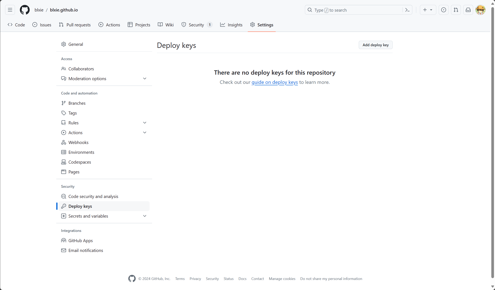

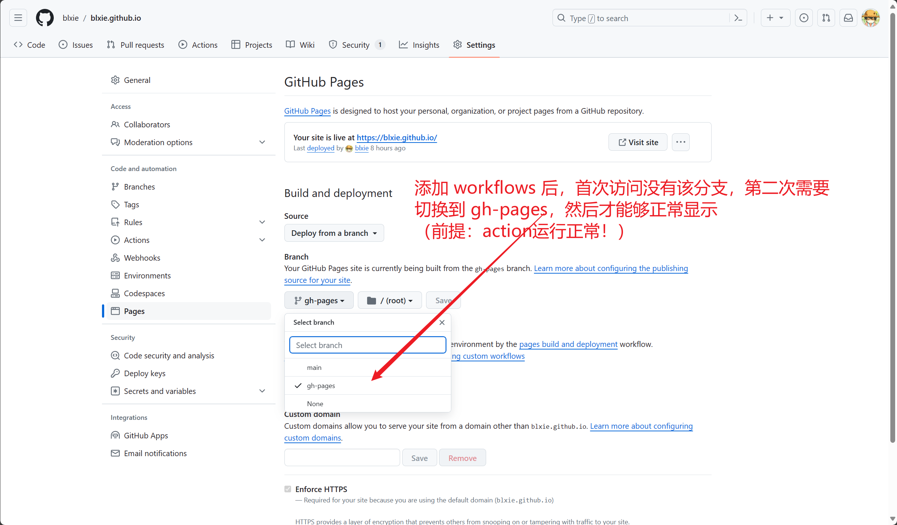

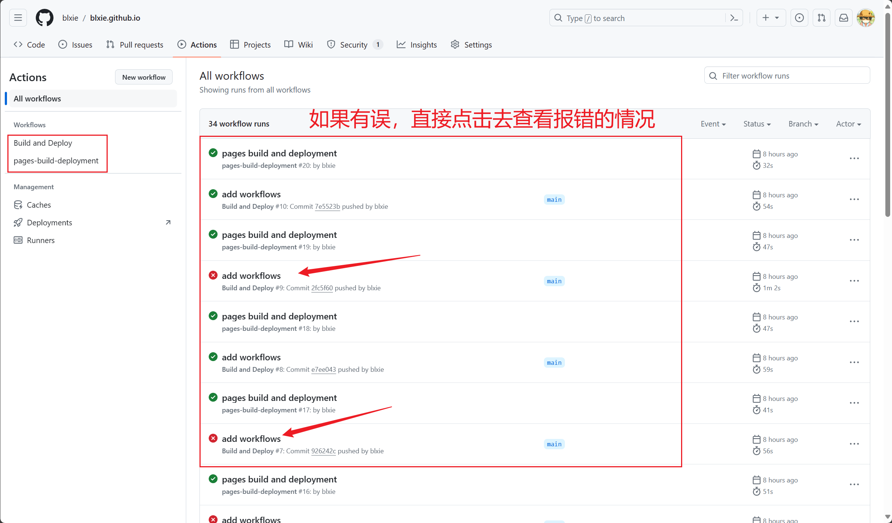


## 四、上传自己的文档

> - [创建文档 | Docusaurus](https://docusaurus.io/zh-CN/docs/next/create-doc)

### 1. 丰富导航栏

（1）在 `docusaurus.config.ts` 的 `navbar` 子项中添加导航栏类别选项，

```ts
navbar: {
    title: "Blainet's Site",
    logo: {
        alt: "Blainet's Site Logo",
        src: "img/logo.svg",
    },
    items: [
        // 顶部栏
        {
            type: "docSidebar",
            sidebarId: "tutorialSidebar",
            position: "left",
            label: "Tutorial",
        },
        { to: "/blog", label: "Blog", position: "left" },
        // {
        //     href: "https://github.com/facebook/docusaurus",
        //     label: "GitHub",
        //     position: "right",
        // },
        // 顶部栏图标配置
        {
            href: "https://github.com/facebook/docusaurus",
            position: "right",
            className: "header-github-link",
            "aria-label": "GitHub repository",
        },
        {
            position: "right",
            to: "mailto:blxie@outlook.com",
            className: "header-email-link",
            "aria-label": "Email",
        },
        // 新增顶部栏
        {
            type: "docSidebar",
            label: "新栏目1",
            sidebarId: "header-bar1",
            position: "left",
        },
        {
            type: "docSidebar",
            label: "编程学习",
            sidebarId: "bar-id-prog",
            position: "left",
        },
    ],
},
```


### 2. 在各个类别下面添加文件

默认 `root` 为 `docs` 目录，所有的文件从这里开始，


（2）在 `sidebar.js` 中配置，

```ts
// Create as many sidebars as you want.
const sidebars: SidebarsConfig = {
    // By default, Docusaurus generates a sidebar from the docs folder structure
    tutorialSidebar: [{ type: "autogenerated", dirName: "." }],

    // key 对应顶部栏
    "header-bar1": [
        {
            type: "autogenerated", // 根据文件夹内容自动生成，推荐这个配置
            dirName: "new-tab1",
        },
    ],
    "bar-id-prog": [
        {
            type: "autogenerated",
            dirName: "program",
        },
    ],
};
```


如果设置为自动生成，可能还需要对 markdown 还有目录文件 进行严格的命名规范，参考 [ref](https://github.com/SJFCS/cloudnative.love/tree/main) 如何设置布局的。

注意这里的 `dirName` 相对于 `docs`，整体目录结构如图，

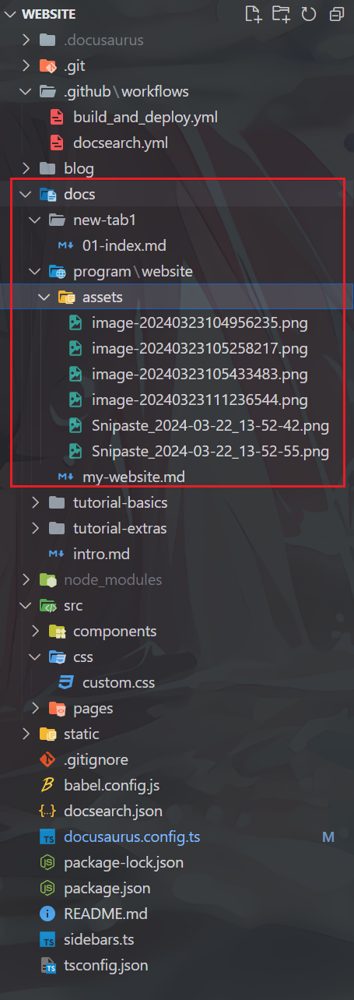


（3）添加的 markdown 文件可能需要在文件开头添加信息

```markdown
---
id: id-new-header-cls
title: 新的一个顶部栏类别
description: 对本文档的介绍说明
---
```


总结：后续需要添加类别或者文件只需要按照上面的流程操作即可。


## 五、添加搜索功能

> - [Get started! | Algolia](https://dashboard.algolia.com/apps/Y5SW0CTQ64/onboarding)

### 1. 获取 Algolia 的相关接口信息

要获取 Docsearch 的

- `apiKey`
- `indexName`
- `appId`

需要按照以下步骤操作，

**（1）注册 Algolia 账户**

访问 [Algolia 官网](https://www.algolia.com/) 并注册一个账户。如果已经有账户，直接登录即可。默认使用 `github` 一键登录。

*注意：没有设置密码，这需要在设置栏里面手动设置，在删除 应用或 `index_name` 的时候需要用到！*


**（2）创建一个新的 `Application/index_name`**

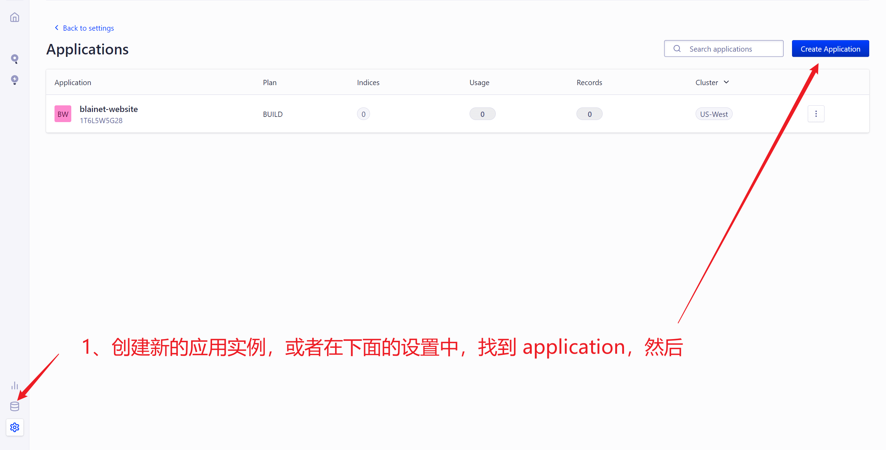


选择区域，

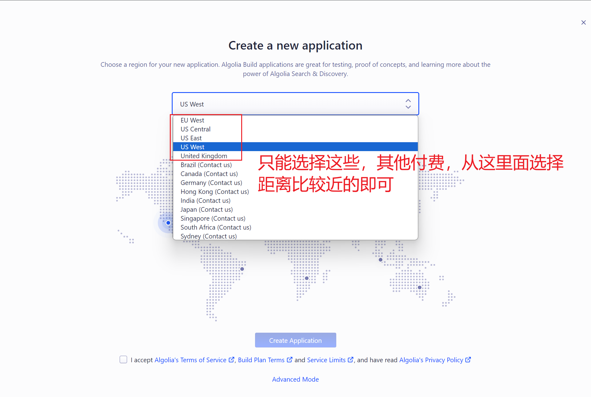

选择、创建、验证之后，

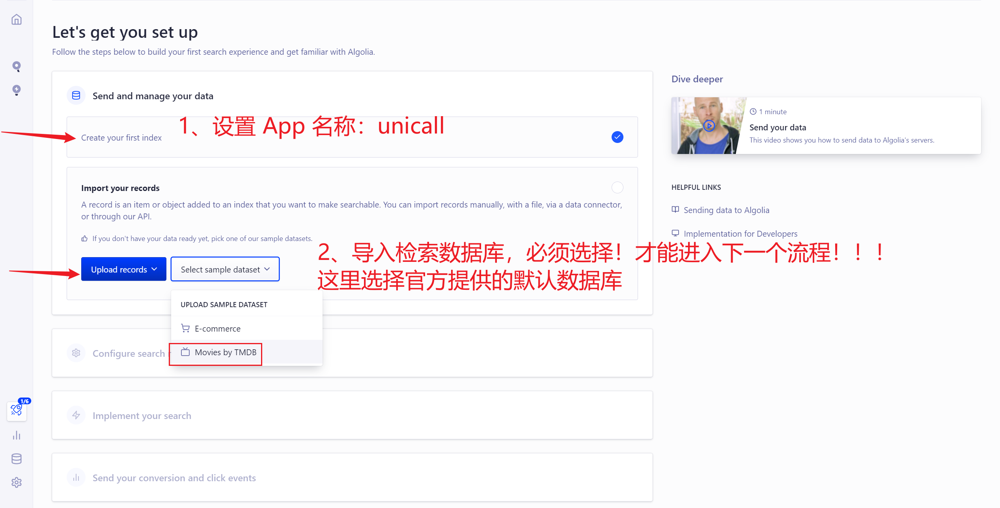

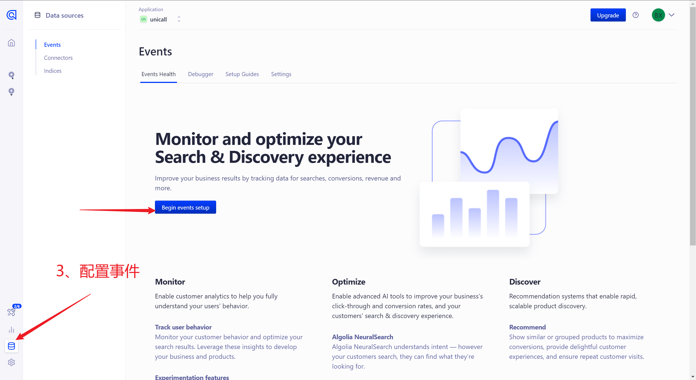

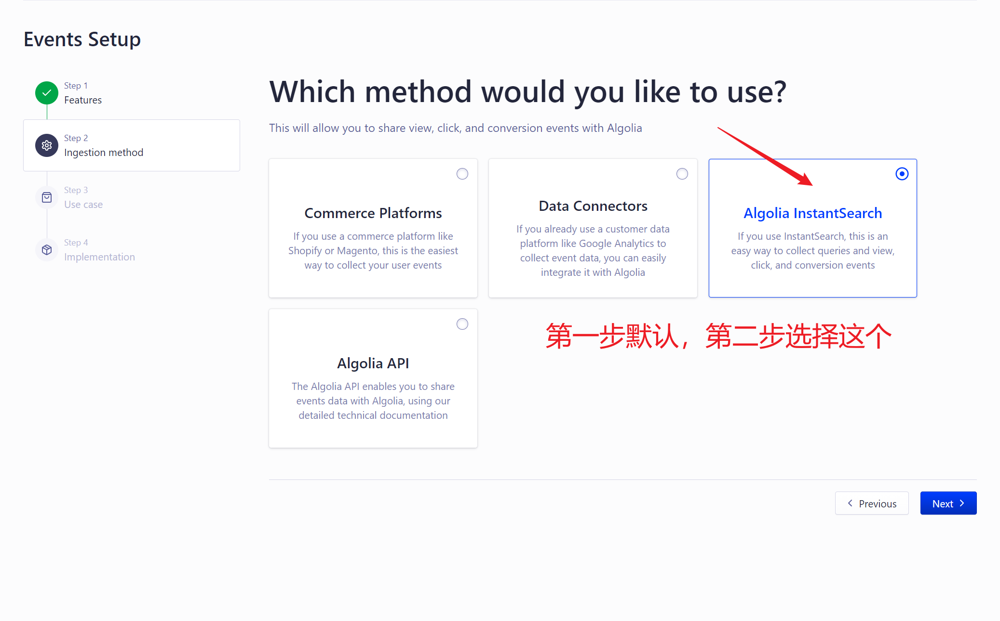


**（3）相关设置 以及 密钥等信息的获取**

后续就没什么填写难度，然后基本就可以了，其他的都是一些无关紧要的设置，

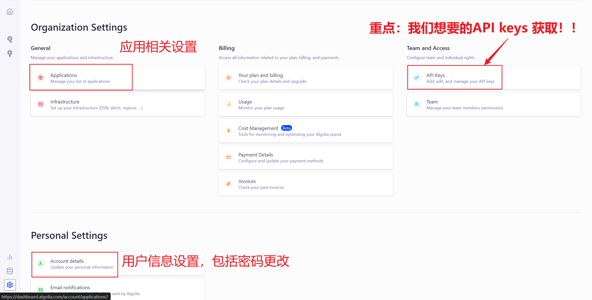


获取密钥、id、index_name 的信息，

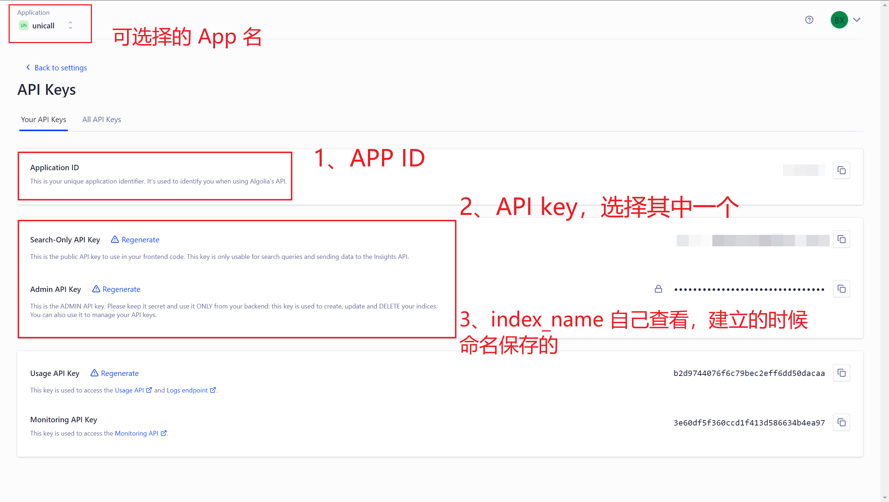

### 2. 将获取到的 Algolia 接口信息添加到项目设置中

#### （1）在 GitHub 网页端进行配置

> - [用 docusaurus 搭建文档网页](https://blog.zhouweibin.top/%E5%8D%9A%E5%AE%A2%E7%9B%B8%E5%85%B3/docusaurus/)，这篇文档总体没问题，整个流程按照这个走就行。需要注意的一个点就是，这里面没有对 `sitemap` 进行叙述，导致后面无法使用检索功能
> - [工具推荐 | Lucas's Docs](https://docs.zhouweibin.top/docs/awesome-dev/%E5%B7%A5%E5%85%B7/)，这是上面链接的博文地址
> - [Search | Docusaurus](https://docusaurus.io/docs/search#using-your-own-search)，本地配置时，检索功能参数设置；~~如果是远端部署，需要删除 `docusaurus.config.ts` 中的 `algolia` 配置，保密信息~~
> - [在 Docusaurus v2 中使用 Algolia DocSearch搜索功能 - 掘金](https://juejin.cn/post/7226185606827933751)，这篇文章帮助解决了 `workflows/docsearch.yml` 一直没有配置对的问题，但是实际使用的还是第一条的，该博客帮助解决了 `sitemap` 的配置，完善流程，解决最后一步搜索的实现以及部署的问题
> - 总的来说，第一和最后链接博客帮助最大

通过 [该链接](https://dashboard.algolia.com/apps/Y5SW0CTQ64/dashboard) 获取 API keys，

主要包括 使用 `workflows/actions` 自动部署时需要的变量信息，设置在这里可以保护信息，防止泄露，

在 `PROJ_ROOT_PATH/settings/Secets and .../Actions/Repository secrets` 中添加两条信息，

```yaml
ALGOLIA_APP_ID
ALGOLIA_API_KEY
```

保存后，网页端就不需要进行额外的操作。

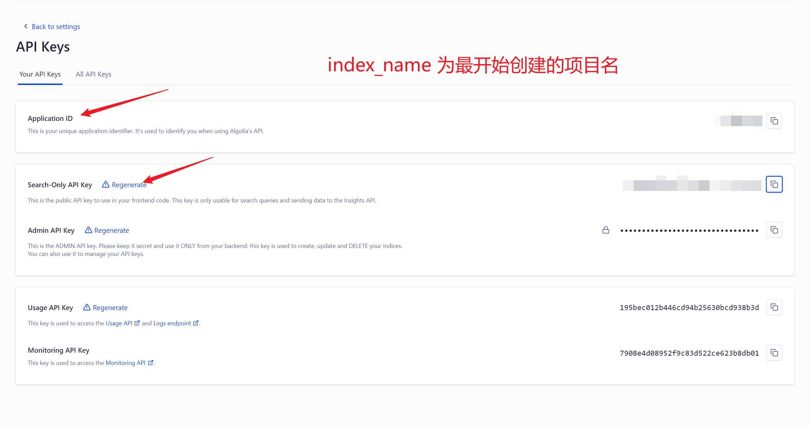

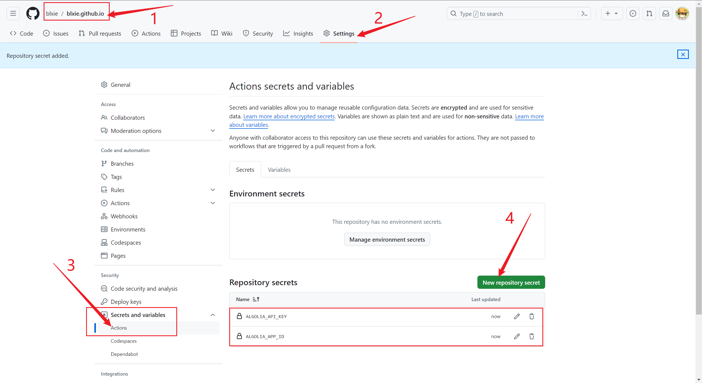


#### （2）本地仓库设置

1、首先需要进行以下的配置，

在 `docusaurus.config.ts` 中，

```ts
presets: [
    [
        "classic",
        // TODO: 主要是这里，以及下添加的 sitemap 项目
        /** @type {import('@docusaurus/preset-classic').Options} */
        {
            docs: {
                sidebarPath: "./sidebars.ts",
                // Please change this to your repo.
                // Remove this to remove the "edit this page" links.
                editUrl:
                    "https://github.com/facebook/docusaurus/tree/main/packages/create-docusaurus/templates/shared/",
            },
            blog: {
                showReadingTime: true,
                // Please change this to your repo.
                // Remove this to remove the "edit this page" links.
                editUrl:
                    "https://github.com/facebook/docusaurus/tree/main/packages/create-docusaurus/templates/shared/",
            },
            theme: {
                customCss: "./src/css/custom.css",
            },
            // 这个插件会为你的站点创建一个站点地图，
            // 以便搜索引擎的爬虫能够更准确地爬取你的网站
            sitemap: {
                changefreq: "always", // 根据你上传的频率进行调整
                priority: 0.5,
                ignorePatterns: ["/tags/**"],
                filename: "sitemap.xml",
            },
        },
    ],
],
```


2、在项目根目录下面创建配置文件

创建 `docsearch.json`，内容如下，主要就修改前面的三个配置，后面不用改！

```json
{
    "index_name": "blainet-website",
    "start_urls": [
        "https://blxie.github.io/"
    ],
    "sitemap_urls": [
        "https://blxie.github.io/sitemap.xml"
    ],
    "selectors": {
        "lvl0": {
            "selector": "(//ul[contains(@class,'menu__list')]//a[contains(@class, 'menu__link menu__link--sublist menu__link--active')]/text() | //nav[contains(@class, 'navbar')]//a[contains(@class, 'navbar__link--active')]/text())[last()]",
            "type": "xpath",
            "global": true,
            "default_value": "Documentation"
        },
        "lvl1": "header h1, article h1",
        "lvl2": "article h2",
        "lvl3": "article h3",
        "lvl4": "article h4",
        "lvl5": "article h5, article td:first-child",
        "lvl6": "article h6",
        "text": "article p, article li, article td:last-child"
    },
    "custom_settings": {
        "attributesForFaceting": [
            "type",
            "lang",
            "language",
            "version",
            "docusaurus_tag"
        ],
        "attributesToRetrieve": [
            "hierarchy",
            "content",
            "anchor",
            "url",
            "url_without_anchor",
            "type"
        ],
        "attributesToHighlight": [
            "hierarchy",
            "content"
        ],
        "attributesToSnippet": [
            "content:10"
        ],
        "camelCaseAttributes": [
            "hierarchy",
            "content"
        ],
        "searchableAttributes": [
            "unordered(hierarchy.lvl0)",
            "unordered(hierarchy.lvl1)",
            "unordered(hierarchy.lvl2)",
            "unordered(hierarchy.lvl3)",
            "unordered(hierarchy.lvl4)",
            "unordered(hierarchy.lvl5)",
            "unordered(hierarchy.lvl6)",
            "content"
        ],
        "distinct": true,
        "attributeForDistinct": "url",
        "customRanking": [
            "desc(weight.pageRank)",
            "desc(weight.level)",
            "asc(weight.position)"
        ],
        "ranking": [
            "words",
            "filters",
            "typo",
            "attribute",
            "proximity",
            "exact",
            "custom"
        ],
        "highlightPreTag": "<span class='algolia-docsearch-suggestion--highlight'>",
        "highlightPostTag": "</span>",
        "minWordSizefor1Typo": 3,
        "minWordSizefor2Typos": 7,
        "allowTyposOnNumericTokens": false,
        "minProximity": 1,
        "ignorePlurals": true,
        "advancedSyntax": true,
        "attributeCriteriaComputedByMinProximity": true,
        "removeWordsIfNoResults": "allOptional",
        "separatorsToIndex": "_",
        "synonyms": [
            [
                "js",
                "javascript"
            ],
            [
                "ts",
                "typescript"
            ]
        ]
    }
}
```


3、添加 workflow

自动运行部署，

在 `.github\workflows\docsearch.yml` 中添加以下配置，

```yaml
name: docsearch

on:
  push:
    branches:
      - main

jobs:
  algolia:
    runs-on: ubuntu-latest
    steps:
      - uses: actions/checkout@v2

      - name: Get the content of docsearch.json as config
        id: algolia_config
        # 注意 必须包含 docsearch.json 文件，和上面的路径要一致！！！
        run: echo "::set-output name=config::$(cat docsearch.json | jq -r tostring)"

      - name: Run algolia/docsearch-scraper image
        env:
          ALGOLIA_APP_ID: ${{ secrets.ALGOLIA_APP_ID }}
          ALGOLIA_API_KEY: ${{ secrets.ALGOLIA_API_KEY }}
          CONFIG: ${{ steps.algolia_config.outputs.config }}
        run: |
          docker run \
            --env APPLICATION_ID=${ALGOLIA_APP_ID} \
            --env API_KEY=${ALGOLIA_API_KEY} \
            --env "CONFIG=${CONFIG}" \
            algolia/docsearch-scraper
```


然后保存，推送，在 GitHub 网页端查看 actions 的状况，

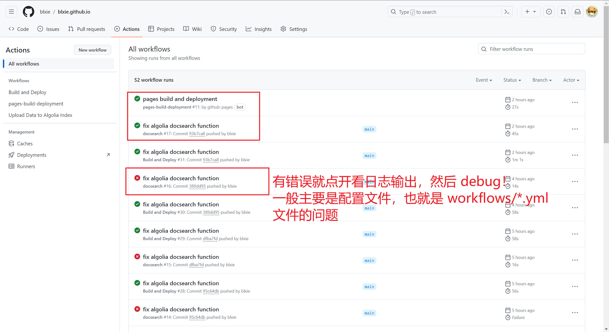

根据实际情况进行调整。


## 美化完善

如果要自定义相关的布局美化，在 `src/css/custom.css` 中，根据相应的 标签 进行选择性设置即可！比如，

（1）设置 GitHub 为矢量图标，该部分参考 [官方设置](https://github.com/facebook/docusaurus/blob/main/website/docusaurus.config.ts)，

```css
/* for github search icon */
.header-github-link::before {
    content: '';
    width: 24px;
    height: 24px;
    display: flex;
    background-color: var(--ifm-navbar-link-color);
    mask-image: url("data:image/svg+xml,%3Csvg viewBox='0 0 24 24' xmlns='http://www.w3.org/2000/svg'%3E%3Cpath d='M12 .297c-6.63 0-12 5.373-12 12 0 5.303 3.438 9.8 8.205 11.385.6.113.82-.258.82-.577 0-.285-.01-1.04-.015-2.04-3.338.724-4.042-1.61-4.042-1.61C4.422 18.07 3.633 17.7 3.633 17.7c-1.087-.744.084-.729.084-.729 1.205.084 1.838 1.236 1.838 1.236 1.07 1.835 2.809 1.305 3.495.998.108-.776.417-1.305.76-1.605-2.665-.3-5.466-1.332-5.466-5.93 0-1.31.465-2.38 1.235-3.22-.135-.303-.54-1.523.105-3.176 0 0 1.005-.322 3.3 1.23.96-.267 1.98-.399 3-.405 1.02.006 2.04.138 3 .405 2.28-1.552 3.285-1.23 3.285-1.23.645 1.653.24 2.873.12 3.176.765.84 1.23 1.91 1.23 3.22 0 4.61-2.805 5.625-5.475 5.92.42.36.81 1.096.81 2.22 0 1.606-.015 2.896-.015 3.286 0 .315.21.69.825.57C20.565 22.092 24 17.592 24 12.297c0-6.627-5.373-12-12-12'/%3E%3C/svg%3E");
    transition: background-color var(--ifm-transition-fast) var(--ifm-transition-timing-default);
}

.header-github-link:hover::before {
    background-color: var(--ifm-navbar-link-hover-color);
}
```


（2）设置邮件图标，该部分参考 [这篇博文](https://www.cloudnative.love/)。这篇博文对于后续文章如何布局安排，以及美化等方面都有很大的参考价值！

```css
/* email ico */
.header-email-link:hover {
    opacity: 0.6;
}

.header-email-link:before {
    content: '';
    width: 24px;
    height: 24px;
    display: flex;
    background: url("data:image/svg+xml,%3Csvg viewBox='0 0 512 512' xmlns='http://www.w3.org/2000/svg'%3E%3Cpath d='M256 8C118.941 8 8 118.919 8 256c0 137.059 110.919 248 248 248 48.154 0 95.342-14.14 135.408-40.223 12.005-7.815 14.625-24.288 5.552-35.372l-10.177-12.433c-7.671-9.371-21.179-11.667-31.373-5.129C325.92 429.757 291.314 440 256 440c-101.458 0-184-82.542-184-184S154.542 72 256 72c100.139 0 184 57.619 184 160 0 38.786-21.093 79.742-58.17 83.693-17.349-.454-16.91-12.857-13.476-30.024l23.433-121.11C394.653 149.75 383.308 136 368.225 136h-44.981a13.518 13.518 0 0 0-13.432 11.993l-.01.092c-14.697-17.901-40.448-21.775-59.971-21.775-74.58 0-137.831 62.234-137.831 151.46 0 65.303 36.785 105.87 96 105.87 26.984 0 57.369-15.637 74.991-38.333 9.522 34.104 40.613 34.103 70.71 34.103C462.609 379.41 504 307.798 504 232 504 95.653 394.023 8 256 8zm-21.68 304.43c-22.249 0-36.07-15.623-36.07-40.771 0-44.993 30.779-72.729 58.63-72.729 22.292 0 35.601 15.241 35.601 40.77 0 45.061-33.875 72.73-58.161 72.73z'/%3E%3C/svg%3E") no-repeat;
    background-size: cover;
}

html[data-theme='dark'] .header-email-link:before {
    background: url("data:image/svg+xml,%3Csvg viewBox='0 0 512 512' xmlns='http://www.w3.org/2000/svg'%3E%3Cpath d='M256 8C118.941 8 8 118.919 8 256c0 137.059 110.919 248 248 248 48.154 0 95.342-14.14 135.408-40.223 12.005-7.815 14.625-24.288 5.552-35.372l-10.177-12.433c-7.671-9.371-21.179-11.667-31.373-5.129C325.92 429.757 291.314 440 256 440c-101.458 0-184-82.542-184-184S154.542 72 256 72c100.139 0 184 57.619 184 160 0 38.786-21.093 79.742-58.17 83.693-17.349-.454-16.91-12.857-13.476-30.024l23.433-121.11C394.653 149.75 383.308 136 368.225 136h-44.981a13.518 13.518 0 0 0-13.432 11.993l-.01.092c-14.697-17.901-40.448-21.775-59.971-21.775-74.58 0-137.831 62.234-137.831 151.46 0 65.303 36.785 105.87 96 105.87 26.984 0 57.369-15.637 74.991-38.333 9.522 34.104 40.613 34.103 70.71 34.103C462.609 379.41 504 307.798 504 232 504 95.653 394.023 8 256 8zm-21.68 304.43c-22.249 0-36.07-15.623-36.07-40.771 0-44.993 30.779-72.729 58.63-72.729 22.292 0 35.601 15.241 35.601 40.77 0 45.061-33.875 72.73-58.161 72.73z' fill='%23fff' class='fill-000000'/%3E%3C/svg%3E") no-repeat;
    background-size: cover;
}
```


如果想要标准的邮件图标，可以参考 [这篇博文](https://docs.zhouweibin.top/)。同时，这篇博文帮助笔者完成了 搜索的 workflow，虽然有一小部分没有描述完整（docsearch 还需要在 `docusaurus.config.ts` 的 `presets` 中配置自动检索！），整体上给了很大的帮助。关于邮件图标，配置，

```css

```

ee，记错了，不是上面这篇文章，这里等待补充……


# TODO

- [ ] 将图片用 `picgo` 图床上传到 GitHub，或者其他免费的图片服务器，坚果云流量有限制


# 参考资料

- [facebook/docusaurus: Easy to maintain open source documentation websites.](https://github.com/facebook/docusaurus)
- [docusaurus部署 | yingwinwin的前端之路](https://yingwinwin.github.io/blog/%E4%BD%BF%E7%94%A8docusaurus%E6%90%AD%E5%BB%BA%E5%8D%9A%E5%AE%A2%EF%BC%8C%E5%B9%B6%E9%83%A8%E7%BD%B2%E5%88%B0github%20pages/)，重点参考
- [wrm244/docusaurus-theme-zen](https://github.com/wrm244/docusaurus-theme-zen)
- [Docusaurus + Github Page，快速搭建免费个人网站 | Emma's blog](https://emmachan2021.github.io/docs/tech/docusaurus-github)
- [Github配置SSH密钥连接（附相关问题解决） - 知乎](https://zhuanlan.zhihu.com/p/628727065)
- [rundocs/jekyll-rtd-theme: Just another documentation theme compatible with GitHub Pages](https://github.com/rundocs/jekyll-rtd-theme)，另外一种好看的主题
- [GithubPage构建博客常用模板地址汇总_github博客模板-CSDN博客](https://blog.csdn.net/shiwanghualuo/article/details/125363650)
- [GitHub Pages 文档 - GitHub 文档](https://docs.github.com/zh/pages)
