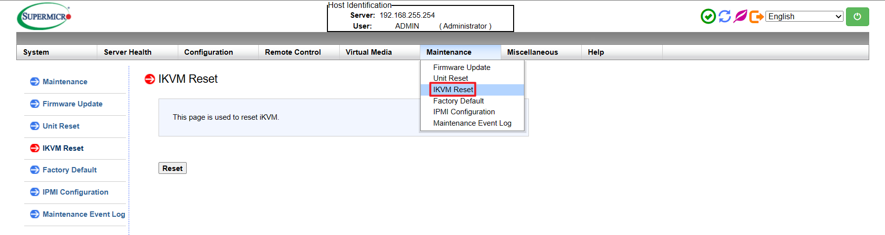
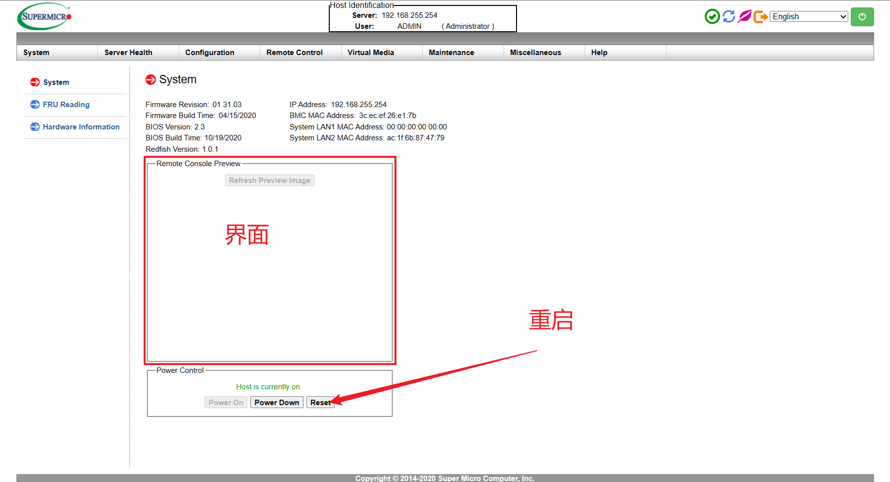
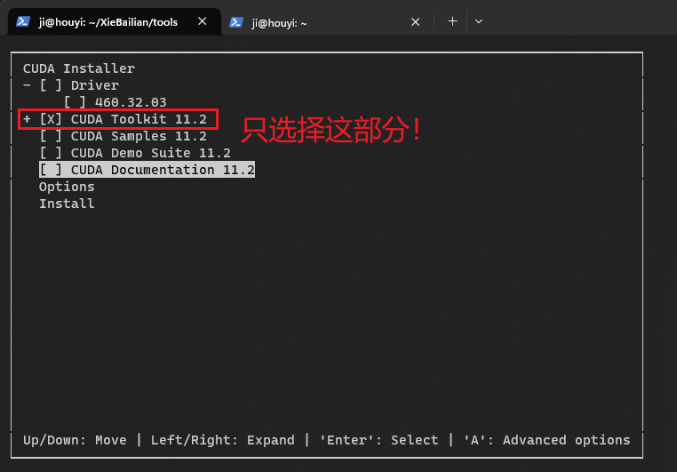
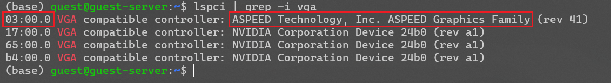
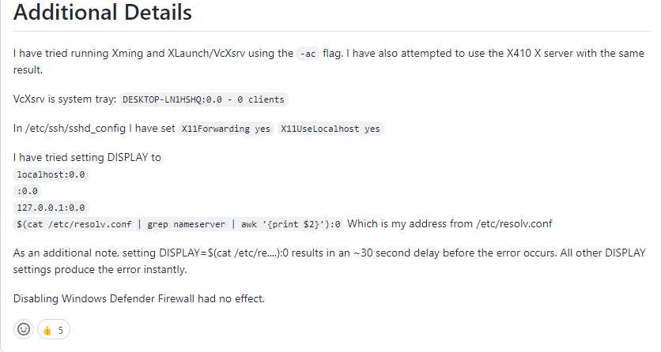
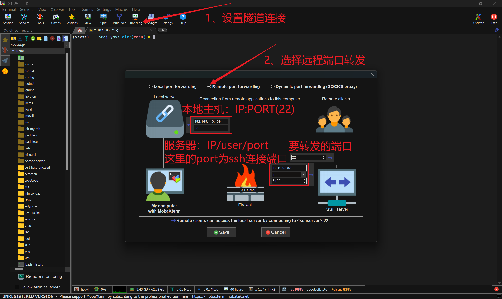
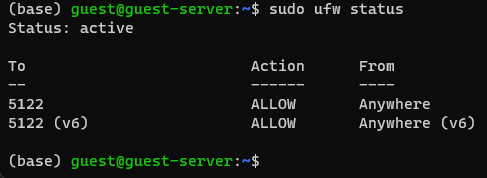
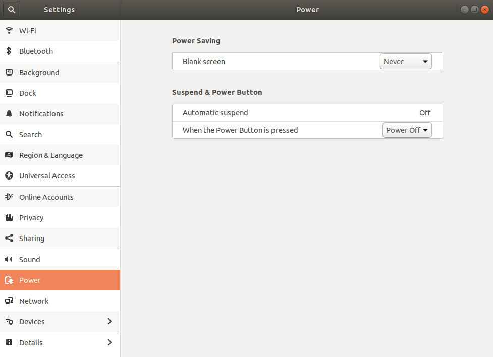
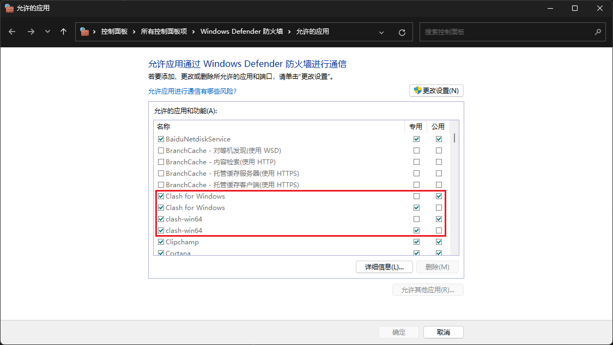

# 服务器

## 联网问题

```bash
sudo ufw disable
sudo ufw status

## 修改 DNS
sudo vim /etc/resolv.conf
nameserver 127.0.0.53
nameserver 114.114.114.114
#nameserver 8.8.8.8
options edns0 trust-ad
# 刷新 DNS 缓存
sudo systemd-resolve --flush-caches
# 测试连通性
ping www.baidu.com
```


## 后台管理

管理方法，笔记本连接上面专用网口，局域网内操作。

未识别的网络（以太网）进行如下设置，

IPv4 192.168.255.2 （保持和管理IP 在同一个网段）


浏览器中输入 `192.168.255.254` 进入后台管理页面，

登录用户名和密码，

```html
ADMIN
Admin123@pl
```

如果是图形界面的问题，在←第二个选项中选择重置 `ikvm`？



在 `system` 中，可以看到当前服务器的信息，然后选择 `reset` （叫重置/重启？）基本上就没有问题。




### 进入 BIOS（DELETE）

> 注意全程用鼠标选择！

更改 `VGA` 的显示优先级,

#### A4000

`Advanced --> PCIE/PCI --> VGA(on board)`，保存退出

`Save --> Save changes and reset`


#### 3090


## 系统初始化

> - [Linux查看系统基本信息，版本信息（最全版）_Wimb的博客-CSDN博客_linux查看系统信息](https://blog.csdn.net/qq_31278903/article/details/83146031)

查看系统信息，

```bash
lsb_release -a  # 列出所有版本相关信息！
uname -a  # 系统内核等信息
cat /proc/version  # 操作系统信息
```


初始化命令，

```bash
sudo passwd  # 更改 root 密码
passwd  # 更改当前用户密码


sudo apt update   # 更新软件列表
sudo apt upgrade  # 更新软件
sudo apt autoremove  # 清除不必要的依赖
sudo apt autoclean  # 清除缓存
sudo apt clean   # 清除软件包缓存
sudo apt autoremove cmake  # 清除旧版cmake
# 手动安装 cmake
wget https://github.com/Kitware/CMake/releases/download/v3.24.3/cmake-3.24.3.tar.gz --no-check-certificate
tar -zxvf cmake-3.24.3.tar.gz
cd cmake-3.24.3
sudo apt install libssl-dev
./bootstrap
make -j 8
sudo make install


# 安装 sshd，用于 ssh 远程连接
sudo apt-get update
sudo apt-get upgrade
sudo apt-get install openssh-server
sudo apt-get -y install git tree vim
sudo apt-get install ninja-build

# 查看显卡信息
nvidia-smi -L
nvtop  # GPU 监视工具(OS >= 19.)
htop  # CPU 监视工具
iftop  # 网络流量监控工具
```


## 深度学习环境

### `nvtop` 安装

> - [更新 CUDA Linux GPG 存储库密钥 - NVIDIA 技术博客](https://developer.nvidia.com/zh-cn/blog/updating-the-cuda-linux-gpg-repository-key/)
> - [Syllo/nvtop: GPUs process monitoring for AMD, Intel and NVIDIA](https://github.com/Syllo/nvtop#nvtop-build)

对于 `20.04` 以上版本，安装方法，

```bash
# 注意必须先添加 PPA 后再 install，否则 apt 不安装最新的版本导致相关未修复的 bug
sudo add-apt-repository ppa:flexiondotorg/nvtop
sudo apt install nvtop

# 删除 ppa 源
sudo add-apt-repository -r ppa:qbittorrent-team/qbittorrent-stable
cd /etc/apt/sources.list.d
ls | grep qbitto | xargs sudo rm
sudo apt-get update
```


对于 `18.04` 及以下，手动编译安装，

```bash
sudo apt install cmake libncurses5-dev libncursesw5-dev git

git clone https://github.com/Syllo/nvtop.git
mkdir -p nvtop/build && cd nvtop/build
cmake .. -DNVIDIA_SUPPORT=ON -DAMDGPU_SUPPORT=ON -DINTEL_SUPPORT=ON
make

# Install globally on the system
sudo make install

# Alternatively, install without privileges at a location of your choosing
# make DESTDIR="/your/install/path" install
```

手动编译安装好之后，源代码文件可以直接删除！


### `cudatoolkit` 下载安装

> [CUDA Toolkit Archive | NVIDIA Developer](https://developer.nvidia.com/cuda-toolkit-archive)
>
> ==注意：如果要安装不同的版本，注意不要通过 `deb` 安装，下载 `.run` 直接安装，然后不选择安装 `Driver`！==




选择和机器显卡算力匹配的 Toolkit，[CUDA GPUs - Compute Capability | NVIDIA Developer](https://developer.nvidia.com/cuda-gpus#compute)

RTX3090 — 8.6 — Toolkit 11.6，直接下前一个版本的最近更新的即可，[CUDA Toolkit 11.6 Update 2 Downloads | NVIDIA Developer](https://developer.nvidia.com/cuda-11-6-2-download-archive?target_os=Linux&target_arch=x86_64)

**下载 `.local` 文件 `.run` 文件进行安装，为了安装多个版本！**


`.bashrc` 添加，

```bash
## <<<<<<<<<<<<<<<<<<<<<<<<<<<<<<<<<<<<<<<<<<<<<<<<<<<<<<<<<<<<<<<<<<<<<<<< ##
## 将 CUDATOOLKIT 的安装路径添加到系统变量中，使用 nvcc -V 查看是否配置成功 ##
## <<<<<<<<<<<<<<<<<<<<<<<<<<<<<<<<<<<<<<<<<<<<<<<<<<<<<<<<<<<<<<<<<<<<<<<< ##

# 创建软链接：sudo ln -s /usr/local/cuda-11.x /usr/local/cuda
# 好处是更改cudatoolkit版本时，只需要修改软链接的指向，不用每次都重新修改.bashrc
export CUDA_HOME=/usr/local/cuda

# 不使用软链接时：只需要将CUDA_HOME设置为cudatoolkit安装的路径
# 确保新添加的环境放在原始环境的最前面，这样source ~/.basrc才能生效
export PATH="$CUDA_HOME/bin:$PATH"  # 使用引号确保有特殊含义的字符成为普通字符
export LD_LIBRARY_PATH="$CUDA_HOME/lib64:$LD_LIBRARY_PATH"
export LD_LIBRARY_PATH="/usr/lib/x86_64-linux-gnu:$LD_LIBRARY_PATH"

## <<<<<<<<<<<<<<<<<<<<<<<<<<<<<<<<<<<<<<<<<<<<<<<<<<<<<<<<<<<<<<<<<<<<<<<< ##
## <<<<<<<<<<<<<<<<<<<<<<<<<<<<<<<<<<<<<<<<<<<<<<<<<<<<<<<<<<<<<<<<<<<<<<<< ##
```


```bash
source ~/.bashrc
nvcc -V
```


### `cuDNN` 下载安装

> - [cuDNN Archive | NVIDIA Developer](https://developer.nvidia.com/rdp/cudnn-archive)
>
> - [Ubuntu18.04 NVIDIA-CUDA-cuDNN 安装配置_blainet的博客-CSDN博客](https://blog.csdn.net/qq_40750972/article/details/123835847)

#### 使用 `tar.gz` 直接复制安装（稍微复杂，后续方便用）

```bash
xz -dv 
tar -xvf 

sudo cp include/* /usr/local/cuda/include
sudo cp lib/* /usr/local/cuda/lib64
sudo chmod a+r /usr/local/cuda/*

## 验证是否安装成功/查看版本信息
cat /usr/local/cuda/include/cudnn_version.h | grep CUDNN_MAJOR -A 2
```


#### 使用 Installer 安装（方便，但是后续有问题，不是很推荐）

下载 `.deb` 文件，如果是 `.tar` 文件，还需要复制一些文件，`.deb` 文件安装不需要后续操作，

```bash
sudo dpkg -i 

## 删除
dpkg -l | grep cudnn
sudo dpkg -P 
sudo apt-get purge 
```


#### 测试是否可以使用 `cuDNN`

```python
import torch
print(torch.cuda.is_available(), torch.cuda.device_count())

from torch.backends import cudnn
print(cudnn.is_available())
print(cudnn.is_acceptable(torch.rand(1,).cuda()))
```


#### Error

> [Linux遇到的错误|‘The package needs to be reinstalled, but I can’t find an archive for it’ Error In Ubuntu - 简书](https://www.jianshu.com/p/942c562065c8)
>
> 无法安装也无法卸载软件包！
>
> 解决方案：直接将报错的软件包从安装记录中移除！

```bash
The package cuda-repo-ubuntu2004-11-6-local needs to be reinstalled, but I can't find an archive for it.

sudo vim /var/lib/dpkg/status
cat /var/lib/dpkg/status | grep cuda-repo-ubuntu2004-11-6-local
# 删除整组 Package 信息，保存退出
```


> [amazon web services - ls: cannot open directory '.': Permission denied - Stack Overflow](https://stackoverflow.com/questions/49944942/ls-cannot-open-directory-permission-denied)
>
> 无法使用 `ls` 命令，结果是由于文件夹的 `r` 权限丢失！

```bash
(base) guest@guest-server:/data1$ ls
ls: cannot open directory '.': Permission denied

sudo chmod 775 data1/
sudo chown -R guest:guest data1/
```


### `CPU/GPU` 压力测试

1. CPU

安装 `stress`，

```bash
sudo apt install hardinfo
hardinfo  # 查看整机详细信息

sudo apt install stress
# -c 核心数量，以 htop 里面的为准
# -t 时间（秒）
sudo stress -c 48 -t 3600
```


1. GPU

> - [Linux Ubuntu查看主要硬件配置，GPU压力测试_城俊BLOG的博客-CSDN博客_ubuntu显卡压力测试](https://blog.csdn.net/qxqxqzzz/article/details/105271986) 首选
> - [Ubuntu Linux CPU GPU 性能测试 - 腾讯云开发者社区-腾讯云](https://cloud.tencent.com/developer/article/1645789)

```bash
git clone https://github.com/wilicc/gpu-burn
cd gpu-burn && make
# 压力测试（秒）
# -d 浮点类型
./gpu_burn -d 3600
```


### `NVIDIA Driver` 安装

> - [Ubuntu18.04 NVIDIA-CUDA-cuDNN 安装配置_blainet的博客-CSDN博客_ubuntu18.04安装cudnn](https://blog.csdn.net/qq_40750972/article/details/123835847)
> - [Ubuntu 18.04 安装 NVIDIA 显卡驱动 - 知乎](https://zhuanlan.zhihu.com/p/59618999)
> - [Official Advanced Driver Search | NVIDIA](https://www.nvidia.cn/Download/Find.aspx)

准备工作，卸载，

```bash
# uninstall/clean
dpkg -l | grep nvidia
sudo apt purge nvidia*
dpkg -l | grep nvidia | awk '{print $2}' | xargs sudo dpkg --purge
sudo apt autoremove
sudo apt autoclean
dpkg -l | grep nvidia
# install
ubuntu-drivers devices
sudo add-apt-repository ppa:graphics-drivers/ppa
sudo apt-get update
# 自动安装推荐的版本，安装指定的版本可能会导致不兼容产生奇怪的问题，比如无法显示桌面图标
sudo apt install nvidia-[driver]-version
sudo ubuntu-drivers autoinstall
```


## 更换下载源

> - [(1条消息) Some packages could not be installed. This may mean that you have requested_黑白难辨的博客-CSDN博客](https://blog.csdn.net/qq_43626331/article/details/125855680)

查看 codename，编译的版本，

```bash
lsb_release -a
```


```
deb http://mirrors.aliyun.com/ubuntu/ focal main restricted universe multiverse
deb http://mirrors.aliyun.com/ubuntu/ focal-security main restricted universe multiverse
deb http://mirrors.aliyun.com/ubuntu/ focal-updates main restricted universe multiverse
deb http://mirrors.aliyun.com/ubuntu/ focal-proposed main restricted universe multiverse
deb http://mirrors.aliyun.com/ubuntu/ focal-backports main restricted universe multiverse
deb-src http://mirrors.aliyun.com/ubuntu/ focal main restricted universe multiverse
deb-src http://mirrors.aliyun.com/ubuntu/ focal-security main restricted universe multiverse
deb-src http://mirrors.aliyun.com/ubuntu/ focal-updates main restricted universe multiverse
deb-src http://mirrors.aliyun.com/ubuntu/ focal-proposed main restricted universe multiverse
deb-src http://mirrors.aliyun.com/ubuntu/ focal-backports main restricted universe multiverse
```


```
sudo apt update
```


## 显示器设置/图形界面设置

> - [解决/usr/lib/xorg/Xorg占用gpu显存的问题 - 简书](https://www.jianshu.com/p/6f34cedc182b)
>
> - [Linux(Ubuntu)系统查看显卡型号_万俟淋曦的博客-CSDN博客_linux查看显卡型号](https://blog.csdn.net/maizousidemao/article/details/88821949)
> - [PCI Device Classes](http://pci-ids.ucw.cz/mods/PC/10de?action=help?help=pci_class)

查看显卡，

```bash
lspci | grep -i vga
# 复制后面的 16 进制设备号在下面网站搜索
nvidia-smi -L
```




该问题点主要是由于系统默认使用独立显卡，可以通过修改xorg的显卡使用来让xorg切换到集成显卡。

```bash
sudo vim /etc/X11/xorg.conf

# BusId为自己的集成显卡id，可以通过 lspci | grep VGA 查看
Section "Device"
    Identifier      "intel"
    Driver          "intel"
    BusId           "PCI:03:00.0"
EndSection

Section "Screen"
    Identifier      "intel"
    Device          "intel"
EndSection
```

**重启**，用 `nvidia-smi` 查看显卡占用，


## 迁移数据集

脚本文件 `trans.py`，

```python
import os
import threading


# 为线程定义一个函数：执行文件复制 rsync命令
def exec_rsync(src, dest):
    # print(f"{src} => {dest}")
    os.system(f"rsync -avP -a {src} RTX3090:{dest}")


def main():
    base_path = "/data"
    src_path = [
        os.path.join(base_path, data_path)
        for data_path in ["coco", "GOT-10k", "LaSOT", "TrackingNet"]
    ]
    dest_path = ["/data1/dataset"] * len(src_path)
    datasets = dict(zip(src_path, dest_path))

    # print(datasets)
    for src, dest in datasets.items():
        thread = threading.Thread(target=exec_rsync, args=(src, dest))
        thread.start()


if __name__ == "__main__":
    main()
```


```python
import os
import threading

max_connections = 5  # 定义最大线程数
pool_sema = threading.BoundedSemaphore(max_connections)  # 或使用Semaphore方法


# 为线程定义一个函数：执行文件复制 rsync命令
def exec_rsync(src, dest):  # 要执行的多线程 meta任务
    pool_sema.acquire()  # 加锁，限制线程数

    # print(f"{src} => {dest}")
    os.system(f"rsync -avP -a {src} RTX3090:{dest}")

    pool_sema.release()  # 解锁


def main():
    base_path = "/data"
    src_path = [
        os.path.join(base_path, data_path)
        for data_path in ["coco", "GOT-10k", "LaSOT", "TrackingNet"]
    ]
    dest_path = ["/data1/dataset"] * len(src_path)
    datasets = dict(zip(src_path, dest_path))

    # print(datasets)
    thread_list = []
    for src, dest in datasets.items():  # len(datasets)个任务
        thread = threading.Thread(target=exec_rsync, args=(src, dest))
        thread_list.append(thread)

    for thread in thread_list:
        thread.start()  # 调用start()方法，开始执行

    for thread in thread_list:
        thread.join()  # 子线程调用join()方法，使主线程等待子线程运行完毕之后才退出


if __name__ == "__main__":
    main()
```


查看网络情况，

```bash
sudo apt install iftop
sudo iftop
```


## 远程桌面连接

服务器信息，

|     名称     | 用户名 |    密码     |   port    |
| :----------: | :----: | :---------: | :-------: |
| 10.16.37.18  | guest  | aiserver123 |    22     |
| 10.16.93.52  |   ji   |   210735    |   5122    |
| 43.143.59.35 | guest  | aiserver123 | 6000/6001 |
| 10.16.42.114 | guest  | aiserver123 |    22     |


### 桌面问题（可能是源的问题）

> > 提示：遇到问题不好描述，或者描述了搜索不到相关内容时，很有可能是描述不对，尝试使用 图片进行问题搜索，绝对会有意想不到的结果！
>
> - [ubuntu16.04进入桌面之后不显示任务栏和菜单栏_卡卡6的博客-CSDN博客_vmware上的ubuntu没有开始菜单](https://blog.csdn.net/qq_40088639/article/details/106519930)
> - [Ubuntu登录后一直停留在桌面，只显示桌面背景_天宇240的博客-CSDN博客_ubuntu只有桌面背景](https://blog.csdn.net/hty1053240123/article/details/52487906)  重点内容！重要！！！

```bash
sudo rm -rf .gconf
sudo rm -rf .gconfd
sudo rm -r ~/.Xauthority
sudo apt-get install --reinstall ubuntu.desktop  # ~4GiB

sudo apt remove --purge xubuntu* lubuntu* qtubuntu* kubuntu* edubuntu* -y
```


#### 桌面卸载

> - [如何卸载xfce桌面或者xubuntu-desktop - 简书](https://www.jianshu.com/p/d8f309491162)
> - [卸载各种ubuntu的桌面环境_argansos的博客-CSDN博客](https://blog.csdn.net/argansos/article/details/6960771) 主要介绍有哪些桌面环境 **Kubuntu** **Xubuntu** **Edubuntu** **Lubuntu**
> - [ubuntu卸载桌面环境_ywueoei的博客-CSDN博客_ubuntu卸载桌面环境](https://blog.csdn.net/ywueoei/article/details/79938430)

```bash
sudo apt-get remove xfce4  -y  # 卸载xfce4
sudo apt-get purge xfce4 -y
sudo apt-get purge xfce4* -y  # 卸载相关软件
sudo apt-get purge xubuntu* -y  # 如果安装的是xubuntu-desktop还需要卸载xubuntu

# 卸载 gnome
sudo apt-get remove gnome-shell -y  # 卸载gnome-shell主程序
sudo apt-get remove gnome -y  # 卸载gnome
sudo apt-get purge gnome -y  # 彻底卸载删除gnome的相关配置文件

sudo apt-get autoremove -y  # 卸载不需要的依赖关系
sudo apt-get autoclean  # 清理安装gnome时候留下的缓存程序软件包
sudo apt-get clean  # 清理安装gnome时候留下的缓存程序软件包
```


---

如果您想要完全卸载Ubuntu上的所有桌面环境，您可以按照以下步骤操作：

1.打开终端并运行以下命令，以卸载所有的桌面环境及其依赖项：

```bash
sudo apt remove --purge xubuntu* lubuntu* qtubuntu* kubuntu* edubuntu* -y
sudo apt-get remove --auto-remove ubuntu-desktop kubuntu-desktop xubuntu-desktop lubuntu-desktop ubuntu-gnome-desktop ubuntu-mate-desktop ubuntu-budgie-desktop
```

请注意，以上命令将卸载Ubuntu上所有主要的桌面环境，包括Ubuntu桌面环境、Kubuntu桌面环境、Xubuntu桌面环境、Lubuntu桌面环境、Ubuntu GNOME桌面环境、Ubuntu MATE桌面环境和Ubuntu Budgie桌面环境。如果您使用的是其他桌面环境，您需要相应地更改命令。

2.运行以下命令以清除桌面环境相关的配置文件和依赖项：

```
sudo apt-get autoremove
```

3.如果您使用的是LightDM作为您的显示管理器，请运行以下命令以卸载它：

```
sudo apt-get remove --auto-remove lightdm
```

4.最后，运行以下命令以清除Ubuntu上所有已安装的包及其依赖项：

```
sudo apt-get autoclean
sudo apt-get clean
sudo apt-get autoremove
```

请注意，以上命令将从系统中删除所有已安装的软件包及其依赖项。这将清理您的系统并释放磁盘空间。

完成后，您的Ubuntu系统将完全卸载所有桌面环境及其依赖项。请注意，这可能会导致您的系统出现一些问题，因此在执行此操作之前，您应该先备份您的数据并小心操作。


```bash
sudo apt-get remove --auto-remove ubuntu-desktop -y
sudo apt-get remove --auto-remove kubuntu-desktop
sudo apt-get remove --auto-remove xubuntu-desktop
sudo apt-get remove --auto-remove lubuntu-desktop
sudo apt-get remove --auto-remove ubuntu-gnome-desktop
sudo apt-get remove --auto-remove ubuntu-mate-desktop
sudo apt-get remove --auto-remove ubuntu-budgie-desktop
sudo apt-get remove --auto-remove lightdm

sudo apt-get autoclean
sudo apt-get clean
sudo apt-get autoremove
```


#### `桌面安装（如果有错误，可能是源的问题）`

> ubuntu20默认的桌面管理软件是哪一个

Ubuntu 20.04 默认使用 GNOME 3 作为桌面环境，因此其默认的桌面管理软件是 GNOME Shell。GNOME Shell 是 GNOME 3 的核心组件之一，它提供了许多桌面管理功能，包括窗口管理、任务管理、通知管理、系统设置等等。

除了 GNOME Shell 之外，Ubuntu 20.04 还提供了其他桌面环境和窗口管理器的选择，例如 KDE Plasma、Xfce、LXDE、MATE、Openbox 等等，用户可以根据自己的喜好选择不同的桌面环境和窗口管理器。


> 使用的是lightdm，gdm3还是其他的哪一个

Ubuntu 20.04 默认使用的是 GDM3（GNOME Display Manager）作为显示管理器（即登录界面），而不是 LightDM。GDM3 是 GNOME 桌面环境的官方显示管理器，可以管理多个用户会话，提供了一个直观的登录界面，支持主题定制和语言切换等功能。

不过，如果您在安装 Ubuntu 20.04 时选择了不同的桌面环境（如 Xubuntu、Kubuntu 等），那么可能会使用不同的显示管理器。例如，Xubuntu 默认使用 LightDM 作为显示管理器，而 Kubuntu 则默认使用 SDDM（Simple Desktop Display Manager）。

您可以通过查看已安装的软件包列表来确定当前使用的显示管理器。在终端中运行以下命令即可：

```
dpkg -l | grep -E 'gdm3|lightdm|sddm'
```

该命令将列出所有已安装的与 GDM3、LightDM 或 SDDM 相关的软件包。如果列表中只有 gdm3 相关的软件包，则说明当前使用的是 GDM3 显示管理器。如果列表中只有 lightdm 相关的软件包，则说明当前使用的是 LightDM 显示管理器。如果列表中只有 sddm 相关的软件包，则说明当前使用的是 SDDM 显示管理器。


> ubuntu20默认使用的是xubuntu还是哪一个

Ubuntu 20.04 默认使用的是标准的 Ubuntu 桌面环境，即 GNOME 3。如果您从 Ubuntu 官方网站下载并安装了标准版本的 Ubuntu 20.04，那么默认的桌面环境是 GNOME 3，而不是 Xubuntu。

Xubuntu 是 Ubuntu 官方衍生版本之一，它采用了 Xfce 桌面环境，相比于 GNOME 3 更加轻量级，适合在旧电脑或者资源有限的环境下使用。如果您下载并安装了 Xubuntu 20.04 版本，则默认的桌面环境是 Xfce。

总之，Ubuntu 20.04 默认使用的是 GNOME 3 桌面环境，而不是 Xubuntu。如果您想要使用 Xfce 桌面环境，可以下载并安装 Xubuntu 20.04 版本，或者在已经安装好的 Ubuntu 20.04 系统中安装 Xfce 桌面环境并切换到它。


> 怎么重新安装这个标准官方的桌面环境GNOME3

如果您的 Ubuntu 20.04 系统出现了问题，需要重新安装 GNOME 3 桌面环境，可以按照以下步骤进行操作：

1. 在终端中运行以下命令，以确保您的系统已经更新到最新版本：

   ```
   sudo apt update
   sudo apt upgrade
   ```

2. 然后，运行以下命令以安装 GNOME 3 桌面环境：

   ```
   sudo apt install ubuntu-gnome-desktop
   ```

   这个命令将会自动下载并安装 GNOME 3 桌面环境及其相关的软件包。根据您的网络速度和系统配置，这个过程可能需要一些时间。

3. 安装完成后，重启系统，并在登录界面中选择 GNOME 3 会话。

   如果您使用的是 GDM3 显示管理器，那么在登录界面右上角的用户菜单中，可以选择 GNOME 3 会话。如果您使用的是 LightDM 显示管理器，则在登录界面中，可以选择 Ubuntu（GNOME）会话。

   如果您在重新安装 GNOME 3 桌面环境后仍然遇到问题，可以尝试卸载并重新安装它。在终端中运行以下命令即可：

   ```
   sudo apt remove ubuntu-gnome-desktop
   sudo apt install ubuntu-gnome-desktop
   ```

   注意，在卸载 GNOME 3 桌面环境之前，建议备份您的个人文件和设置。


### 向日葵

> 安装，
>
> - [向日葵远程控制app官方下载 - 贝锐向日葵官网](https://sunlogin.oray.com/download/linux?type=personal)


```bash
# 卸载，
sudo dpkg -r sunloginclient
sudo dpkg --purge sunloginclient

# 下载最新版安装
wget https://d.oray.com/sunlogin/linux/sunloginclientshell-10.1.1.28779-amd64.deb
sudo dpkg -i sun
```


> 显示 “连接断开”！
>
> - [向日葵提示‘’连接断开‘’解决方法（已解决非常好用）终端执行 xhost + 即可_计算机视觉-Archer的博客-CSDN博客_向日葵远程老是断开连接](https://blog.csdn.net/zjc910997316/article/details/108882105)


> <font color="red">MobaXterm 启动向日葵，提示：(sunloginclient:2999): Gtk-CRITICAL **: 10:23:15.420: gtk_main_quit: assertion 'main_loops != NULL' failed</font>
>
> - [manjaro 使用 向日葵(sunlogin) 远程控制-次世代BUG池 (neucrack.com)](https://neucrack.com/p/372)

启动服务，

```bash
sudo systemctl start runsunloginclient.service
sudo systemctl enable runsunloginclient.service
sudo reboot  # 必须重启才能生效！
```


> <font color="red">ping: www.bing.com: Temporary failure in name resolution</font>
>
> aks ChatGPT!

"Temporary failure in name resolution" 错误表示在解析域名时出现了临时的解析错误。这通常意味着你的系统无法通过 DNS 解析域名。

以下是一些可能导致此错误的常见问题和解决方法：

1. 检查网络连接：确保你的网络连接正常，可以通过尝试访问其他网站或使用其他网络应用程序来验证。

2. 检查 DNS 配置：确认你的系统的 DNS 配置正确。你可以使用以下命令查看当前的 DNS 配置：
   ```
   cat /etc/resolv.conf
   ```

   确保 `nameserver` 行指定了正确的 DNS 服务器地址。如果没有正确的 DNS 服务器配置，你可以按照前面提到的方法编辑 `/etc/resolv.conf` 文件并重启 `systemd-resolved` 服务。

3. 检查 DNS 解析器：确认你的系统上的 DNS 解析器正在运行。在 Ubuntu 中，使用 `systemd-resolved` 管理 DNS 解析。你可以通过以下命令检查服务状态：
   ```
   sudo systemctl status systemd-resolved
   ```

   如果服务未运行，请使用以下命令启动它：
   ```
   sudo systemctl start systemd-resolved
   ```

4. 检查防火墙设置：防火墙可能会阻止 DNS 解析请求。确保你的防火墙配置允许 DNS 请求通过。在 Ubuntu 中，你可以使用 `ufw` 工具管理防火墙规则。

   检查防火墙状态：
   ```
   sudo ufw status
   ```

   如果防火墙处于活动状态，并且没有适当的规则允许 DNS 请求通过，请添加允许 DNS 的规则。例如，允许传出的 DNS 请求：
   ```
   sudo ufw allow out 53
   ```

   请根据你的需求进行适当的配置。

如果问题仍然存在，请进一步检查网络配置、DNS 设置和系统日志以获取更多详细信息，以帮助诊断和解决问题。


### WIN-RDP（不安全，局域网互联，不推荐使用）

> - [如何在Ubuntu 20.04上安装Xrdp服务器 | myfreax](https://www.myfreax.com/how-to-install-xrdp-on-ubuntu-20-04/)


### Xming（推荐使用 MobaXterm，不用太复杂的配置）

> - [Xming Configuration | imyhxy](https://imyhxy.github.io/blog/2018/04/17/xming-configuration.html)
>
> - [关于在内网穿透时如何使用X11的问题解决 - CodeAntenna](https://codeantenna.com/a/Ekn384YiB7) 重点！！！解决了外网访问内网时 X11 无法使用的问题！
>
> - [WSL 2 Error: Can't open display: localhost:0.0 · Issue #6430 · microsoft/WSL](https://github.com/microsoft/WSL/issues/6430)  非常有用！Windows 防火墙 允许 X11 转发！
>
>   

安装好之后，将服务器地址添加进 `Xming/X0.host` 文件中！


通过以下操作，使得远程连接之后，就能直接使用 `Xming` 显示图形界面，

```bash
vim ~/.profile  # 如果不生效，添加进 ~/.bashrc 中
vim ~/.bashrc
export DISPLAY=10.20.107.30:0.0  # 每次连接自动生效

source ~/.bashrc
```

本来的设置是，

```bash
export DISPLAY=:0.0  # 或者
export DISPLAY=$(cat /etc/resolv.conf | grep nameserver | awk '{print $2}'):0

# 结合
sudo vim /etc/ssh/sshd_config
X11UseLocalhost yes
```


有关 `/etc/ssh/sshd_config` 的设置，

```bash
Port 5122
X11UseLocalhost yes
X11Forwarding yes

## 修改完成之后
sudo service ssh restart
```


### MobaXterm

> - ["X11 proxy: Unsupported authorisation protocol" error fix - Chadrick's Blog](https://chadrick-kwag.net/x11-proxy-unsupported-authorisation-protocol-error-fix/) 删除 `~/.Xau...-l` 文件，然后重新启动
>
> - [科学网—MobaXterm及OpenSSH配置说明 - 李云海的博文](https://blog.sciencenet.cn/blog-2909108-1167310.html)
>
> - [利用MobaXterm图形化配置SSH端口转发_51CTO博客_ssh端口转发](https://blog.51cto.com/u_15505951/5060014)

端口映射，X11 forwaord 图形化显示，




## SSH 连接

> 注意：如果连接的时候用别名有问题，直接删除 `~/.ssh/known_hosts[.old]` 这两个文件即可！

```yaml
# Read more about SSH config files: https://linux.die.net/man/5/ssh_config
# https://www.jianshu.com/p/92d60c6c92ef
## 校园网
Host A4000
    HostName 10.16.55.166
Host A6000
    Hostname 10.16.93.52
    User ji
Host RTX3090
    HostName 10.16.42.114
## 内网穿透
Host NAT-A4000
    HostName 43.143.59.35
    Port 14000
Host NAT-RTX3090
    HostName 43.143.59.35
    Port 13090
## Docker
Host D-A6000
    HostName 10.16.93.52
    User root  # 注意这的用户是：root！
    Port 8022  # 注意这里的端口为：22 --> 8022 端口映射（记得服务器 ufw 要允许 8022 端口）
## 共同配置，注意需要写在最后，如果以上配置中和下面的有重复，优先选取上面的
Host *
    User guest
    Port 5122
    IdentityFile ~/.ssh/id_rsa
    ForwardAgent yes
    ServerAliveInterval 60
    # ServerAliveCountMax 3
```




> ==注意：为了安全考虑，防火墙关闭了常用的 22 端口，只开启代替的 5122端口号！！！==

`ubuntu/ufw` 常用，而非 `firewalld`！

```bash
# 在系统启动时启用和激活防火墙
sudo ufw enable
# 默认的 incoming 策略更改为 “deny”，外部系统不可以直接访问
sudo ufw default deny
# 允许所有的外部 IP 访问本机的 25/tcp (smtp)端口
sudo ufw allow smtp
# 允许所有的外部 IP 访问本机的 22/tcp (ssh)端口
sudo ufw allow 22/tcp
sudo ufw status

## 禁止外部访问指定端口
sudo ufw deny 12345
## 删除指定端口
sudo ufw delete deny/allow 12345
# 重启
sudo ufw reload
```


### ERROR

> ssh: connect to host 10.16.93.52 port 5122: No route to host
>
> - [该怎么解决no route to host_浪子尘晨-DevPress官方社区 (csdn.net)](https://huaweicloud.csdn.net/63a567cab878a5454594682c.html)  实际解决，权宜之计
> - [ufw开机不启动,ufw inactive after reboot - 周睿 - 博客园 (cnblogs.com)](https://www.cnblogs.com/2333/p/16607720.html)  Yes!
> - [ssh远程No route to host问题解决_regulate管理控制的博客-CSDN博客](https://blog.csdn.net/weixin_46941387/article/details/105713588)  简单参考下
> - [修改Linux主机上默认的SSH端口号 - 知乎 (zhihu.com)](https://zhuanlan.zhihu.com/p/597545686)  参考


```bash
sudo iptables -L  # 
sudo iptables -F  # 清除防火墙设置
```


# 错误记录

## 硬件系统相关

> - [超微主板BIOS常见报错代码 - 知乎 (zhihu.com)](https://zhuanlan.zhihu.com/p/460811792?utm_id=0)


### 定时关机（休眠 suspend）

> - [ubuntu关闭自动休眠的方法_ViatorSun的博客-CSDN博客](https://blog.csdn.net/ViatorSun/article/details/129622218)

相关指令，

```bash
## 查看状态：loaded 为启用，masked 为禁用！
systemctl status sleep.target

## 关闭
sudo systemctl mask sleep.target suspend.target hibernate.target hybrid-sleep.target
```


看看 `Power` 设置中是否有 `Suspend & Power Button` 选项，如果没有，就是这个问题，



查看设置，

```bash
## 编辑电源管理配置文件
sudo vim /etc/systemd/logind.conf

## 将 ignore 设置为 suspend，并将其注释！
#HandleHibernateKey=hibernate
HandleLidSwitch=ignore
#HandleLidSwitchExternalPower=suspend

## 重新加载电源配置
sudo systemctl restart systemd-logind
```

`A4000` 标准的文件内容，

```bash
# You can change settings by editing this file.
# Defaults can be restored by simply deleting this file.
#
# See logind.conf(5) for details.

[Login]
#NAutoVTs=6
#ReserveVT=6
#KillUserProcesses=no
#KillOnlyUsers=
#KillExcludeUsers=root
#InhibitDelayMaxSec=5
#HandlePowerKey=poweroff
#HandleSuspendKey=suspend
#HandleHibernateKey=hibernate
#HandleLidSwitch=suspend
#HandleLidSwitchDocked=ignore
#PowerKeyIgnoreInhibited=no
#SuspendKeyIgnoreInhibited=no
#HibernateKeyIgnoreInhibited=no
#LidSwitchIgnoreInhibited=yes
#HoldoffTimeoutSec=30s
#IdleAction=ignore
#IdleActionSec=30min
#RuntimeDirectorySize=10%
#RemoveIPC=yes
#InhibitorsMax=8192
#SessionsMax=8192
#UserTasksMax=33%
```

`A6000` 的内容，

```bash
# You can change settings by editing this file.
# Defaults can be restored by simply deleting this file.
#
# See logind.conf(5) for details.

[Login]
#NAutoVTs=6
#ReserveVT=6
#KillUserProcesses=no
#KillOnlyUsers=
#KillExcludeUsers=root
#InhibitDelayMaxSec=5
#HandlePowerKey=poweroff
#HandleSuspendKey=suspend
#HandleHibernateKey=hibernate
HandleLidSwitch=ignore
#HandleLidSwitchExternalPower=suspend
#HandleLidSwitchDocked=ignore
#PowerKeyIgnoreInhibited=no
#SuspendKeyIgnoreInhibited=no
#HibernateKeyIgnoreInhibited=no
#LidSwitchIgnoreInhibited=yes
#HoldoffTimeoutSec=30s
#IdleAction=ignore
#IdleActionSec=30min
#RuntimeDirectorySize=10%
#RemoveIPC=yes
#InhibitorsMax=8192
#SessionsMax=8192
```

`3090` 的内容，

```bash
# You can change settings by editing this file.
# Defaults can be restored by simply deleting this file.
#
# See logind.conf(5) for details.

[Login]
#NAutoVTs=6
#ReserveVT=6
#KillUserProcesses=no
#KillOnlyUsers=
#KillExcludeUsers=root
#InhibitDelayMaxSec=5
#HandlePowerKey=poweroff
#HandleSuspendKey=suspend
#HandleHibernateKey=hibernate
#HandleLidSwitch=suspend
#HandleLidSwitchExternalPower=suspend
#HandleLidSwitchDocked=ignore
#PowerKeyIgnoreInhibited=no
#SuspendKeyIgnoreInhibited=no
#HibernateKeyIgnoreInhibited=no
#LidSwitchIgnoreInhibited=yes
#HoldoffTimeoutSec=30s
#IdleAction=ignore
#IdleActionSec=30min
#RuntimeDirectorySize=10%
#RemoveIPC=yes
#InhibitorsMax=8192
#SessionsMax=8192
```


## 软件系统相关

> E: Unable to correct problems, you have held broken packages.

这个错误通常是由于系统上存在破损或损坏的软件包而引起的。为了解决这个问题，您可以尝试以下方法：

1.运行以下命令，以更新软件包列表并升级系统：

```
sudo apt-get update
sudo apt-get upgrade
```

2.运行以下命令，以检查并修复损坏的软件包：

```
sudo apt-get install -f
```

这个命令会自动修复损坏的软件包和依赖项。

3.如果上述命令无法解决问题，您可以尝试删除已经安装的软件包并重新安装：

```
sudo apt-get remove package_name
sudo apt-get autoremove
sudo apt-get install package_name
```

在这里，`package_name`是引起问题的软件包的名称。

4.最后，您可以尝试手动安装受影响的软件包。您可以从官方软件源或软件提供商网站下载并手动安装软件包。在安装软件包之前，请确保其与您的系统兼容，并遵循安装说明。

如果上述方法无法解决问题，您可以尝试通过重新安装Ubuntu来解决问题。请注意，在重新安装系统之前，请务必备份您的数据。


## 网络问题

> ping: www.baidu.com: Temporary failure in name resolution

"Ping: www.baidu.com: Temporary failure in name resolution"错误表示无法解析主机名 "www.baidu.com"。这可能是由于网络连接问题或DNS配置错误引起的。

要解决此问题，可以尝试以下步骤：

1. 检查网络连接：确保您的计算机正常连接到互联网。可以尝试通过打开网页或使用其他网络应用程序来验证网络连接是否正常。

2. 检查DNS配置：确认您的计算机的DNS配置正确。可以尝试使用以下命令来检查当前配置：

   ```shell
   vim /etc/resolv.conf
   
   # 添加 Google DNS 服务器，可以添加多个
   nameserver 8.8.8.8
   nameserver ...
   ```

   确保其中列出的DNS服务器地址是正确的。如果需要修改DNS配置，可以编辑 `/etc/resolv.conf` 文件，并添加或修改 `nameserver` 行来指定正确的DNS服务器。

3. 清除DNS缓存：有时DNS缓存可能导致解析问题。您可以尝试清除DNS缓存并重新尝试ping命令。在终端中运行以下命令：

   ```shell
   sudo systemctl restart systemd-resolved.service
   ```

   或

   ```shell
   sudo service network-manager restart
   ```

4. 检查防火墙设置：防火墙配置可能会阻止DNS查询。确保防火墙允许通过DNS端口（通常是端口53）进行通信。您可以根据您使用的防火墙软件进行相应的设置。

5. 检查网络代理设置：如果您使用代理服务器访问互联网，请确保代理配置正确，并且您的计算机可以成功连接到代理服务器。

如果问题仍然存在，请参考您的网络管理员或联系您的互联网服务提供商以获取进一步的支持和调查。


# 相关操作

## 终端管理

终端相关操作管理，

```bash
# 查看当前系统的终端
cat /etc/shells
# 查看当前正在使用的终端
echo $0/$SHELL
# 切换到不同的终端：直接输入终端的名称，比如
zsh/bash/tmux...
```


> - [Tmux 使用教程 - 阮一峰的网络日志](https://www.ruanyifeng.com/blog/2019/10/tmux.html#tmux%20%E6%98%AF%E4%BB%80%E4%B9%88%EF%BC%9F)

在 `~/.bashrc` 中添加以下配置，

```bash
## for history
export HISTTIMEFORMAT="%d/%m/%y %T "
shopt -s histappend
export PROMPT_COMMAND="history -a; history -n"
## for tmux
alias tnew='tmux new -s'
alias tls='tmux ls'
alias td='tmux detach'
alias ta='tmux attach -t'
alias tkill='tmux kill-session -t'
```

然后就可以直接使用，

```bash
tnew 新的终端会话名
ta 终端会话名
```

直接关闭终端也会保持在后台运行，通常使用快捷键，注意不要使用 `Ctrl C`，否则会直接退出！！！


### zsh

依次执行以下命令，完成，

1. `zsh` shell 安装；
2. `oh-my-zsh` 安装。

```bash
sudo apt update
sudo apt install zsh

export https_proxy=http://10.16.92.115:10809
sh -c "$(curl -fsSL https://raw.githubusercontent.com/ohmyzsh/ohmyzsh/master/tools/install.sh)"
```


配置 `conda`，插件等，

> - [How to Install Zsh/ zsh-autosuggestions/ oh-my-zsh in Linux - Varun Kumar Manik - Medium](https://varunmanik1.medium.com/how-to-install-zsh-zsh-autosuggestions-oh-my-zsh-in-linux-65fa01cc038d)
> - [command line - chsh always asking a password , and get `PAM: Authentication failure` - Ask Ubuntu](https://askubuntu.com/questions/812420/chsh-always-asking-a-password-and-get-pam-authentication-failure) 如果 `chsh` 出错，就参考这个，

```bash
## oh-my-zsh 插件
# zsh-autosuggestions
git clone https://github.com/zsh-users/zsh-autosuggestions ${ZSH_CUSTOM:-~/.oh-my-zsh/custom}/plugins/zsh-autosuggestions
# zsh-syntax-highlighting
git clone https://github.com/zsh-users/zsh-syntax-highlighting.git ${ZSH_CUSTOM:-~/.oh-my-zsh/custom}/plugins/zsh-syntax-highlighting

conda init zsh
source ~/.zshrc

## 将 Ubuntu 默认终端修改为 zsh
chsh -s $(which zsh)
# 以下可选，是在以上命令执行未成功时的解决方案
sudo vim /etc/pam.d/chsh
# 将 required -> sufficient
auth       sufficient   pam_shells.so
```


默认的原始的 `.zshrc`，

```bash
# If you come from bash you might have to change your $PATH.
# export PATH=$HOME/bin:/usr/local/bin:$PATH

# Path to your oh-my-zsh installation.
export ZSH="$HOME/.oh-my-zsh"

# Set name of the theme to load --- if set to "random", it will
# load a random theme each time oh-my-zsh is loaded, in which case,
# to know which specific one was loaded, run: echo $RANDOM_THEME
# See https://github.com/ohmyzsh/ohmyzsh/wiki/Themes
ZSH_THEME="robbyrussell"

# Set list of themes to pick from when loading at random
# Setting this variable when ZSH_THEME=random will cause zsh to load
# a theme from this variable instead of looking in $ZSH/themes/
# If set to an empty array, this variable will have no effect.
# ZSH_THEME_RANDOM_CANDIDATES=( "robbyrussell" "agnoster" )

# Uncomment the following line to use case-sensitive completion.
# CASE_SENSITIVE="true"

# Uncomment the following line to use hyphen-insensitive completion.
# Case-sensitive completion must be off. _ and - will be interchangeable.
# HYPHEN_INSENSITIVE="true"

# Uncomment one of the following lines to change the auto-update behavior
# zstyle ':omz:update' mode disabled  # disable automatic updates
# zstyle ':omz:update' mode auto      # update automatically without asking
# zstyle ':omz:update' mode reminder  # just remind me to update when it's time

# Uncomment the following line to change how often to auto-update (in days).
# zstyle ':omz:update' frequency 13

# Uncomment the following line if pasting URLs and other text is messed up.
# DISABLE_MAGIC_FUNCTIONS="true"

# Uncomment the following line to disable colors in ls.
# DISABLE_LS_COLORS="true"

# Uncomment the following line to disable auto-setting terminal title.
# DISABLE_AUTO_TITLE="true"

# Uncomment the following line to enable command auto-correction.
# ENABLE_CORRECTION="true"

# Uncomment the following line to display red dots whilst waiting for completion.
# You can also set it to another string to have that shown instead of the default red dots.
# e.g. COMPLETION_WAITING_DOTS="%F{yellow}waiting...%f"
# Caution: this setting can cause issues with multiline prompts in zsh < 5.7.1 (see #5765)
# COMPLETION_WAITING_DOTS="true"

# Uncomment the following line if you want to disable marking untracked files
# under VCS as dirty. This makes repository status check for large repositories
# much, much faster.
# DISABLE_UNTRACKED_FILES_DIRTY="true"

# Uncomment the following line if you want to change the command execution time
# stamp shown in the history command output.
# You can set one of the optional three formats:
# "mm/dd/yyyy"|"dd.mm.yyyy"|"yyyy-mm-dd"
# or set a custom format using the strftime function format specifications,
# see 'man strftime' for details.
# HIST_STAMPS="mm/dd/yyyy"

# Would you like to use another custom folder than $ZSH/custom?
# ZSH_CUSTOM=/path/to/new-custom-folder

# Which plugins would you like to load?
# Standard plugins can be found in $ZSH/plugins/
# Custom plugins may be added to $ZSH_CUSTOM/plugins/
# Example format: plugins=(rails git textmate ruby lighthouse)
# Add wisely, as too many plugins slow down shell startup.
plugins=(git)

source $ZSH/oh-my-zsh.sh

# User configuration

# export MANPATH="/usr/local/man:$MANPATH"

# You may need to manually set your language environment
# export LANG=en_US.UTF-8

# Preferred editor for local and remote sessions
# if [[ -n $SSH_CONNECTION ]]; then
#   export EDITOR='vim'
# else
#   export EDITOR='mvim'
# fi

# Compilation flags
# export ARCHFLAGS="-arch x86_64"

# Set personal aliases, overriding those provided by oh-my-zsh libs,
# plugins, and themes. Aliases can be placed here, though oh-my-zsh
# users are encouraged to define aliases within the ZSH_CUSTOM folder.
# For a full list of active aliases, run `alias`.
#
# Example aliases
# alias zshconfig="mate ~/.zshrc"
# alias ohmyzsh="mate ~/.oh-my-zsh"
```


自定义 `~/.zshrc`，

首先更改，

```bash
# plugins=(git) 更改为
plugins=(git zsh-autosuggestions zsh-syntax-highlighting)
```

然后，直接复制到该目录下增加以下内容，然后 `source ~/.zshrc` 应用修改，

```bash
## <<<<<<<<<<<<<<<<<<<<<<<<<<<<<<<<<<<<<<<<<<<<<<<<<<<<<<<<<<<<<<<<<<<<<<<< ##
## 将 CUDATOOLKIT 的安装路径添加到系统变量中，使用 nvcc -V 查看是否配置成功 ##
## <<<<<<<<<<<<<<<<<<<<<<<<<<<<<<<<<<<<<<<<<<<<<<<<<<<<<<<<<<<<<<<<<<<<<<<< ##

# 创建软链接：sudo ln -s /usr/local/cuda-11.x /usr/local/cuda
# 好处是更改cudatoolkit版本时，只需要修改软链接的指向，不用每次都重新修改.bashrc
export CUDA_HOME=/usr/local/cuda

# 不使用软链接时：只需要将CUDA_HOME设置为cudatoolkit安装的路径
# 确保新添加的环境放在原始环境的最前面，这样source ~/.basrc才能生效
export PATH="$CUDA_HOME/bin:$PATH"  # 使用引号确保有特殊含义的字符成为普通字符
export LD_LIBRARY_PATH="$CUDA_HOME/lib64:$LD_LIBRARY_PATH"
export LD_LIBRARY_PATH="/usr/lib/x86_64-linux-gnu:$LD_LIBRARY_PATH"

## <<<<<<<<<<<<<<<<<<<<<<<<<<<<<<<<<<<<<<<<<<<<<<<<<<<<<<<<<<<<<<<<<<<<<<<< ##
## <<<<<<<<<<<<<<<<<<<<<<<<<<<<<<<<<<<<<<<<<<<<<<<<<<<<<<<<<<<<<<<<<<<<<<<< ##

# some more ls aliases
alias ll='ls -alF'
alias la='ls -A'
alias l='ls -CF'


function proxy_on() {
    local proxy_address="$1"  # 获取传递的第一个参数
    export http_proxy="http://10.16.92.115:10809"
    export https_proxy="http://10.16.92.115:10809"
    echo -e "Terminal proxy on."
}

function proxy_off(){
    unset http_proxy
    unset https_proxy
    echo -e "Terminal proxy off."
}
function proxy_chk(){
    curl -I www.google.com --connect-timeout 5
}

alias zbp='ps -ax -ostat,ppid,pid,user,cmd,command | grep -e "^[Zz+]" | column -t'

## for tmux
alias tnew='tmux new -s'
alias tls='tmux ls'
alias td='tmux detach'
alias ta='tmux attach -t'
alias tkill='tmux kill-session -t'
```


要更改 Linux 系统中的默认终端，你需要更新用户的 Shell。Shell 是用户与操作系统交互的主要界面，它负责接受命令并将其传递给操作系统进行执行。常见的 Shell 包括 Bash、Zsh、Fish 等。

以下是更改默认终端的一般步骤：

1. **确定可用的 Shell**：首先，你需要确定系统中安装了哪些 Shell。你可以使用以下命令列出可用的 Shell：

   ```bash
   cat /etc/shells
   ```

2. **选择新的 Shell**：根据你的偏好，选择一个新的 Shell。通常，Bash 是 Linux 系统的默认 Shell，但你可以选择其他的 Shell，比如 Zsh 或 Fish。

3. **更改默认 Shell**：一旦选择了新的 Shell，你可以使用 `chsh` 命令来更改用户的默认 Shell。例如，如果你想将默认 Shell 更改为 Zsh，可以执行以下命令：

   ```bash
   chsh -s /bin/zsh
   ```

   系统可能会要求你输入当前用户的密码以进行确认。

4. **重新登录**：一旦更改了默认 Shell，你需要注销当前会话并重新登录，以使更改生效。

5. **配置新的 Shell**：一旦重新登录，你可能需要配置新的 Shell。不同的 Shell 有不同的配置文件，你可以根据具体的 Shell 进行配置。例如，Zsh 的配置文件是 `.zshrc`。

请记住，更改默认 Shell 可能会影响系统的一些配置和脚本，因此在进行更改之前，请确保你了解所做更改可能带来的影响，并做好备份。


## 系统软件资源管理

> - [ubuntu系统查看已安装的软件 - Agoly - 博客园](https://www.cnblogs.com/qmfsun/p/6327399.html)

```bash
dpkg -l | grep sun  # 查看已安装的所有包
sudo apt-get autoremove --purge 软件名称  # 删除软件
```


## 目录文件操作

> - [Linux统计文件夹下的文件数目 | SnailTyan](http://noahsnail.com/2017/02/07/2017-02-07-Linux%E7%BB%9F%E8%AE%A1%E6%96%87%E4%BB%B6%E5%A4%B9%E4%B8%8B%E7%9A%84%E6%96%87%E4%BB%B6%E6%95%B0%E7%9B%AE/)
> - [Shell 输入/输出重定向 | 菜鸟教程](https://www.runoob.com/linux/linux-shell-io-redirections.html)

```bash
ln -snf 绝对路径src_path 软链接名称  # nf 强制覆盖已有的软链接

chown -h guest:guest data  # -h 作用于软链接

ls -l | grep "^-" | wc -l  # 统计目录下有多少个文件
# 后台执行命令，并将输出重定向到指定文件
# 1 -> STDOUT
# 2 -> STDERR
nohup python tracking/test.py fpnt finetuning --dataset lasot --threads 4 --num_gpus 4 --params__search_area_scale 4.5 > lasot.txt 2>&1 &
```


### 恢复误删的文件/文件夹

> - [Linux恢复误删除的文件或者目录 - 简书](https://www.jianshu.com/p/662293f12a47)

```bash
sudo apt-get install lsof
lsof | grep 删除的文件夹名称
cd /proc/PID/fd
ll | grep 删除的文件[夹]
cp LINK_ID 指定文件目录下
mv LINK_ID 原文件名
```


## 用户相关

[如何在Ubuntu添加和删除用户 | myfreax](https://www.myfreax.com/how-to-add-and-delete-users-on-ubuntu-18-04/)

```bash
sudo adduser blxie  # 创建新的用户
全名 []: blxie  # 注意此处必须填写！不然 /home/ 没有为用户创建

sudo adduser blxie sudo  # 设置 sudo 权限！注意不能在 blxie 用户下操作！！！
su - blxie  # 登录 blxie，并切换到用户目录 /home/blxie passwd: blxie1023,

# 删除用户
sudo deluser --remove-home blxie  # 删除用户所有信息
```

将用户添加到 sudoers，

```bash
sudo usermod -aG sudo blainet
## 修改 sudoers 配置
sudo visudo
#
blainet ALL=(ALL:ALL) NOPASSWD:ALL
%sudo   ALL=(ALL:ALL) NOPASSWD:ALL
```


## 更改下载源

> - [ubuntu镜像_ubuntu下载地址_ubuntu安装教程-阿里巴巴开源镜像站](https://developer.aliyun.com/mirror/ubuntu)
> - [ubuntu | 镜像站使用帮助 | 清华大学开源软件镜像站 | Tsinghua Open Source Mirror](https://mirrors.tuna.tsinghua.edu.cn/help/ubuntu/)

修改镜像源之后，可能需要重启虚拟机甚至主机才可以生效！

直接参考清华源的镜像即可！


###  Error 解决

> [Linux遇到的错误|‘The package needs to be reinstalled, but I can’t find an archive for it’ Error In Ubuntu - 简书](https://www.jianshu.com/p/942c562065c8)
>
> 无法安装也无法卸载软件包！
>
> 解决方案：直接将报错的软件包从安装记录中移除！

```bash
sudo apt update  # 无法更新，E: xxx
```

解决思路，找到输出信息中出错的软件包，从记录中删除！

```bash
sudo vim /var/lib/dpkg/status
cat /var/lib/dpkg/status | grep cuda-repo-ubuntu2004-11-6-local
# 删除整组 Package 信息，保存退出
```


## 系统资源

```bash
du -h *  # 查看当前文件夹下所有文件的具体大小
du -hd deep_num dir[/*]  # 统计 deep_num 子文件的大小
df -h  # 查看系统磁盘空间占用情况

# grep 可用引号来设置匹配的模式，多个的话用 \ 转义符号转义 '\|' ~= |
ps -ef | grep -v 'root\|vscode\|grep' | grep python
ps -ef | grep -v grep | grep trackron | awk '{print $2}' | xargs kill -9
ps -ef | grep -v grep | grep trackron | cut -c 9-15 | xargs kill -9

ps -aux
USER       PID %CPU %MEM    VSZ   RSS TTY      STAT START   TIME COMMAND

ps -ef
UID        PID  PPID  C STIME TTY          TIME CMD

whereis xxx  # 寻找某个程序的安装位置，以及所有相关的文件目录
```


## Vim

> - [vim编辑器-多行加注释与去注释_step_ma的博客-CSDN博客_vim 注释](https://blog.csdn.net/step_ma/article/details/76474864)

```shell
set [no]nu

:1,5s/^/#/g
:1,5s/^#//g

:noh  # 取消高亮显示

## 查找替换
```


> - [Vim---配置实用的.vimrc文件 - XNQC - 博客园](https://www.cnblogs.com/XNQC1314/p/8692993.html)

修改版本，

```bash
set tabstop=4
set autoindent
set shiftwidth=4
set expandtab
set number
set formatoptions-=cro
```


初始版本，

```shell
sudo vim /etc/vim/vimrc


set cursorline
set autoindent
set tabstop=4
set softtabstop=4
set number
## 搜索字符高亮
set hlsearch
set incsearch
set spell  # 英文单词自动补全
```


> 相关操作快捷键，
>
> - [vim代码提示补全 - 简书](https://www.jianshu.com/p/c9563522b703)
> - [vim打开多窗口、多文件之间的切换_逐鹿之城的博客-CSDN博客_vim 切换窗口](https://blog.csdn.net/derkampf/article/details/72629875)
> - [Linux Vim基本操作（文件的打开和编辑）完全攻略（有图有真相）](http://c.biancheng.net/view/805.html)
>- 代码自动补全，`Ctrl N/P`
> - 打开新的文件或窗口，
>   - `:sp filename` 水平切分
>   - `:vsplit filename` 垂直切分
>   - `Ctrl WW` 窗口之间切换，`Ctrl W 方向键` 上下左右窗口切换


## 文件传输

> - [rsync 用法教程 - 阮一峰的网络日志](https://www.ruanyifeng.com/blog/2020/08/rsync.html)
> - [Ubuntu通过rsync实现定时同步文件夹_hehedadaq的博客-CSDN博客_ubuntu 文件夹自动同步](https://blog.csdn.net/hehedadaq/article/details/115584036)
> - [No MTA installed, discarding output | Cronitor](https://cronitor.io/cron-reference/no-mta-installed-discarding-output)

```bash
# include 与 exclude 结合使用；-u 可实现更新
rsync -avuP --include="*.0" --exclude="*" outputs_gpu3_convnextt_ciou/ A6000:/home/ji/blxie/proj/trackron/outputs_gpu3_convnextt_ciou/

rsync -avuP --include="*.0" --exclude="*" outputs_gpu2_352/ A6000:/home/ji/blxie/proj/trackron/outputs_gpu2_352/

rsync -avuP --include="*.pth.tar" --exclude='*' output/ guest@10.16.37.18:/home/guest/XieBailian/proj/swintt/

crontab -e
# 注意要使用绝对路径！
*/1 * * * * rsync -avuP --progress --link-dest="/home/guest/XieBailian/proj/Trackron/outputs_gpu3_convnextt_ciou" --exclude='*.pth' "/home/guest/XieBailian/proj/Trackron/outputs_gpu3_convnextt_ciou" A6000:"/home/ji/blxie/proj/trackron/outputs_gpu3_convnextt_ciou/"
tail -f /var/log/syslog | grep CRON

sudo apt-get install postfix
sudo tail -f /var/mail/guest  # 安装 postfix 会自动设置
```


使用 `python` 调用 `Linux` 的 `rsync` 命令进行同步，即使中断也不会重复传输！

> 注意不要命名为 `copy.py`，否则可能会导致 python 多线程无法调试运行！[Pygame AttributeError: 'module' object has no attribute 'copy' - Stack Overflow](https://stackoverflow.com/questions/23418949/pygame-attributeerror-module-object-has-no-attribute-copy/31551977#31551977)
>
> 可能和 VSCode 自身的调试有关！

```python
import os
import threading


# 为线程定义一个函数：执行文件复制 rsync shell 命令
def exec_rsync(src, dest):
    # print(f"{src}: {dest}")
    os.system(f"rsync -avP -a {src} A6000:{dest}")


def main():
    src_path = [
        "/data/TrackingNet/test",
        "/data/TrackingNet/TRAIN_0",
        "/data/TrackingNet/TRAIN_1",
        "/data/TrackingNet/TRAIN_2",
        "/data/TrackingNet/TRAIN_3",
    ]
    dest_path = ["/data/tracking/trackingnet"] * 5
    datasets = dict(zip(src_path, dest_path))

    # print(datasets)
    for src, dest in datasets.items():
        thread = threading.Thread(target=exec_rsync, args=(src, dest))
        thread.start()


if __name__ == "__main__":
    main()
```


```python
import os
import threading


# 为线程定义一个函数：执行文件复制 rsync shell 命令
def exec_rsync(src, dest):
    # print(f"{src}: {dest}")
    os.system(f"rsync -avP -a {src} A6000:{dest}")


def main():
    src_path = [
        "/data/coco",
        "/data/GOT-10k",
        "/data/LaSOT",
    ]
    dest_path = [
        "/data/tracking",
        "/data/tracking",
        "/data/tracking",
    ]
    datasets = dict(zip(src_path, dest_path))

    # print(datasets)
    for src, dest in datasets.items():
        thread = threading.Thread(target=exec_rsync, args=(src, dest))
        thread.start()


if __name__ == "__main__":
    main()
```


Linux 查看网络情况 [linux查看进程占用网速和流量使用情况_现实、太残忍的博客-CSDN博客_linux查看网速占用](https://blog.csdn.net/sumengnan/article/details/108142494)

```bash
sudo apt install iftop
sudo iftop

sudo vnstat -i eno1 -l  # 一个参数都不能少！
```

> `TX` 是发送，`RX` 是接收


## 深度学习

### 更改 CUDA 版本

`change_cuda_ver.sh`,

```bash
#!/bin/bash
echo "当前的cuda版本为："
nvcc -V

## ============================================== ##
## ============================================== ##

echo "正在删除旧的软链接..."
# 如果输出不为空，表示有错误
if [ -n $(rm /usr/local/cuda) ]; then
    echo "删除失败，准备切换到root执行权限进行操作！"
    # 如果当前字符串为空，表示命令执行成功
    if [ -z $(sudo rm /usr/local/cuda) ]; then
        echo "删除成功！"
    fi
fi

## ============================================== ##
## ============================================== ##

read -p "请输入要设置的cuda版本：" VER
echo "正在创建新的软链接..."
sudo ln -s /usr/local/cuda-${VER} /usr/local/cuda

echo "修改成功！现在的cuda版本如下："
nvcc -V
```


### CUDA 环境变量配置

```shell
## <<<<<<<<<<<<<<<<<<<<<<<<<<<<<<<<<<<<<<<<<<<<<<<<<<<<<<<<<<<<<<<<<<<<<<<< ##
## 将 CUDATOOLKIT 的安装路径添加到系统变量中，使用 nvcc -V 查看是否配置成功 ##
## <<<<<<<<<<<<<<<<<<<<<<<<<<<<<<<<<<<<<<<<<<<<<<<<<<<<<<<<<<<<<<<<<<<<<<<< ##

# 创建软链接：sudo ln -s /usr/local/cuda-11.x /usr/local/cuda
# 好处是更改cudatoolkit版本时，只需要修改软链接的指向，不用每次都重新修改.bashrc
export CUDA_HOME=/usr/local/cuda

# 不使用软链接时：只需要将CUDA_HOME设置为cudatoolkit安装的路径
# 确保新添加的环境放在原始环境的最前面，这样source ~/.basrc才能生效
export PATH="$CUDA_HOME/bin:$PATH"  # 使用引号确保有特殊含义的字符成为普通字符
export LD_LIBRARY_PATH="$CUDA_HOME/lib64:$LD_LIBRARY_PATH"
export LD_LIBRARY_PATH="/usr/lib/x86_64-linux-gnu:$LD_LIBRARY_PATH"

## <<<<<<<<<<<<<<<<<<<<<<<<<<<<<<<<<<<<<<<<<<<<<<<<<<<<<<<<<<<<<<<<<<<<<<<< ##
## <<<<<<<<<<<<<<<<<<<<<<<<<<<<<<<<<<<<<<<<<<<<<<<<<<<<<<<<<<<<<<<<<<<<<<<< ##

#eval "$(_MIM_COMPLETE=source mim)"

#export PYTHONPATH=</home/guest/FangYang/CF-TransT>:$PYTHONPATH

## 配置本地源：如果该环境中有相应的包，不会重新下载，从这里引用
# export PATH="/home/guest/anaconda3/envs/pkgs/bin:$PATH"
# export PATH="/home/guest/anaconda3/envs/trackron/bin:$PATH"
```

`source ~/.bashrc` 使配置立即生效！


注意使用 conda 创建虚拟环境 脚本文件中，

```bash
conda activate   # 不要使用 conda activate
## 使用 source 激活创建的虚拟环境
source activate 
# 如果 .sh 文件中有特殊符号：</ 等，用双引号将 包==/<=版本名称 括起来！
```


## 脚本文件

结束任意指定名称的程序 `kill.sh`，

```bash
ps -ef | grep $1 | grep -v grep | cut -c 9-15 | xargs kill -s 9  # 仔细看看 grep 输出 9-15 字符是哪些（对比 awk，都是对列提取，grep 提取行）
# ps -ef | grep $1 | grep -v grep | awk '{print $2}' | xargs kill -s 9

# 以下两种只能找到相关名字的应用程序，对于 python 虚拟环境名字查找不适用！
# pgrep $1 | xargs kill -s 9
# killall -9 $1
```

`source kill.sh trackron` 即可，


## 手动安装软件包

**cmake**

> - [Download | CMake](https://cmake.org/download/)
> - [ubuntu安装cmake的三种方法（超方便！）_ubuntu_Man_1man-DevPress官方社区](https://huaweicloud.csdn.net/635605f0d3efff3090b58d3a.html)
>
> 最好手动安装，`apt install` 安装的版本基本上都很旧，而且通过设置 `ppa` 的方法不是很靠谱！

```bash
tar -zxvf cmake...
cd cmake...
./bootstrap  # 时间比较长

make -j8
sudo make install

cmake --version
which cmake

# 通过 PPA 安装
# 添加签名密钥
wget -O - https://apt.kitware.com/keys/kitware-archive-latest.asc 2>/dev/null | sudo apt-key add -
# 将存储库添加到源列表并进行更新
sudo apt-add-repository 'deb https://apt.kitware.com/ubuntu/ bionic main'
sudo apt-get update
# 使用 apt 直接安装
sudo apt install cmake
```


**nvtop**

> - [Syllo/nvtop: GPUs process monitoring for AMD, Intel and NVIDIA](https://github.com/Syllo/nvtop#nvtop-build)

直接看官方说明文档最后那里，

```bash
git clone https://github.com/Syllo/nvtop.git
mkdir -p nvtop/build && cd nvtop/build
cmake .. -DNVIDIA_SUPPORT=ON -DAMDGPU_SUPPORT=ON -DINTEL_SUPPORT=ON
make

# Install globally on the system
sudo make install

# Alternatively, install without privileges at a location of your choosing
# make DESTDIR="/your/install/path" install
```


查看是否安装成功，

```bash
nvtop
which nvtop
# which 查找当前命令所在目录，优先读取顺序：.bashrc $PATH -> /usr/local/bin -> /usr/bin
```


## outwall

将 clash 固定，

创建 `clash.desktop`，

```ini
#!/usr/bin/env xdg-open

[Desktop Entry]
Name=Clash
Comment=Clash
Exec=/home/guest/XieBailian/prog/clash/cfw
#Icon=
Terminal=False
Type=Application
Categories=Application;Development;
StartupNotify=True
```

将该文件移动至 `/usr/share/applications` 文件夹下，然后在系统软件管理中搜索就可以找到！


# 系统管理

## 日志管理

> - [Chapter 23. Dynamic Boost on Linux](https://download.nvidia.com/XFree86/Linux-x86_64/510.60.02/README/dynamicboost.html)
> - [No matching GPU found with 510.47.03 - Graphics / Linux / Linux - NVIDIA Developer Forums](https://forums.developer.nvidia.com/t/no-matching-gpu-found-with-510-47-03/202315/3)
> - [[SOLVED] LOGS: pulseaudio: GetManagedObjects() failed: org.freedesktop.DBus.Error.TimedOut...'org.bluez'... - Linux Mint Forums](https://forums.linuxmint.com/viewtopic.php?t=360437) 不重要，蓝牙相关设置
> - [gdm crashes after update - Newbie Corner - Manjaro Linux Forum](https://archived.forum.manjaro.org/t/gdm-crashes-after-update/153803)
> - [journalctl 查看日志 - 简书](https://www.jianshu.com/p/7bfae281344e)
> - [linux journalctl 命令 - sparkdev - 博客园](https://www.cnblogs.com/sparkdev/p/8795141.html)

查看系统日志，

```bash
journalctl -p err -b 0 # 0 代表本次

-- Reboot --
10月 29 13:06:33 guest-server kernel:
10月 29 13:06:53 guest-server gdm-password][2064]: gkr-pam: unable to locate daemon control file
10月 29 13:07:01 guest-server pulseaudio[2082]: GetManagedObjects() failed: org.freedesktop.DBus.Error.TimedOut: Failed to activate service 'org.bluez': timed out (service_start_timeout=25000ms)
10月 29 13:07:04 guest-server systemd[1]: Failed to start Network Manager Wait Online.
10月 29 13:07:17 guest-server systemd-resolved[1281]: Failed to send hostname reply: Invalid argument
10月 29 13:07:17 guest-server systemd-resolved[1281]: Failed to send hostname reply: Invalid argument
10月 29 13:07:17 guest-server systemd-resolved[1281]: Failed to send hostname reply: Invalid argument
10月 29 13:11:57 guest-server gdm3[1417]: Failed to contact accountsservice: Error calling StartServiceByName for org.freedesktop.Accounts: Refusing activation, D-Bus is shutting down.
# 找到其中相关的那个 error

sudo systemctl restart gdm
systemctl stop nvidia-powerd.service
systemctl disable nvidia-powerd.service
```


## 服务相关

> - [CentOS使用systemctl彻底删除服务 | 瑞瑞哥的博客](https://ruiruigeblog.com/2017/01/21/CentOS%E4%BD%BF%E7%94%A8systemctl%E5%BD%BB%E5%BA%95%E5%88%A0%E9%99%A4%E6%9C%8D%E5%8A%A1/)
> - [搭建 frp 内网穿透服务器_blainet的博客-CSDN博客_frp内网穿透](https://blog.csdn.net/qq_40750972/article/details/125855620)

相关命令，

```bash
sudo systemctl stop x11vnc.service
sudo systemctl disable x11vnc.service
sudo rm -f /etc/systemd/system/x11vnc.service
sudo systemctl daemon-reload
sudo systemctl reset-failed
sudo systemctl status x11vnc.service
```


# KALI wifiphisher

## 软件环境

下载地址（直接下载虚拟机版本）：[Get Kali | Kali Linux](https://www.kali.org/get-kali/#kali-virtual-machines)

VMWare 下载（推荐，更加节约内存）：[所有下载 (vmware.com)](https://customerconnect.vmware.com/cn/downloads/#all_products)

Virtual box 下载（记得下载下面的 Extension Pack）：[Downloads – Oracle VM VirtualBox](https://www.virtualbox.org/wiki/Downloads)


## 配置环境

> 默认的用户名密码 kali/kali，较早之前的是 root/toor

安装网卡驱动：[2020最新kali安装无线网卡](https://blog.csdn.net/weixin_44151887/article/details/109745659)

这个教程很给力，特别是 `apt install bc` 这个包！

[Linux安装CF-812AC usb网卡驱动_Julyers的博客-CSDN博客](https://blog.csdn.net/weixin_41631106/article/details/119177099)

[cilynx/rtl88x2bu: rtl88x2bu driver updated for current kernels. (github.com)](https://github.com/cilynx/rtl88x2bu)

其他教程：[i am trying to install my wireless usb adapter in Ubuntu (ubuntuforums.org)](https://ubuntuforums.org/showthread.php?t=2431947)


> 更换下载源

更换Kali Linux的软件源可以提高软件包的下载速度和软件库的稳定性。以下是更换Kali Linux软件源的步骤：

1. 打开终端并以root用户身份登录。

2. 备份您的软件源列表。输入以下命令：

   ```
   cp /etc/apt/sources.list /etc/apt/sources.list.backup
   ```

3. 打开/etc/apt/sources.list文件进行编辑。您可以使用nano或vi等文本编辑器来编辑该文件。

   ```
   nano /etc/apt/sources.list
   ```

4. 在编辑器中，您可以将原始源地址注释掉或者直接修改为新的软件源地址。Kali Linux推荐使用官方源，也可以使用国内的镜像源。以下是几个常用的软件源地址：

   - 官方源：deb http://http.kali.org/kali kali-rolling main non-free contrib

   - 清华源：deb https://mirrors.tuna.tsinghua.edu.cn/kali kali-rolling main non-free contrib

   - 阿里源：deb http://mirrors.aliyun.com/kali kali-rolling main non-free contrib

   将原来的软件源地址注释掉或者直接替换成上述其中之一。

5. 保存并退出编辑器。

6. 运行以下命令以更新软件源列表：

   ```
   apt-get update
   ```

7. 更新完成后，您可以使用以下命令安装更新的软件包：

   ```
   apt-get upgrade
   ```

   或者如果您想要更新所有已安装的软件包，请使用以下命令：

   ```
   apt-get dist-upgrade
   ```

这些步骤可以让您更换Kali Linux的软件源。请注意，更改软件源可能会导致不稳定或错误的软件包，因此请谨慎操作。


## 驱动安装

```bash
git clone https://github.com/cilynx/rtl88x2bu.git && cd rtl88x2bu
```

修改 `deploy.sh` 脚本，

```shell
#!/bin/bash

## XBL add;
sudo apt update -y && apt upgrade -y && apt dist-upgrade -y
sudo apt install linux-headers-$(uname -r)

sudo apt install bc dkms -y
sudo dkms remove rtl88x2bu/5.8.7.1 --all
sudo rm -f /lib/modules/*/updates/net/wireless/cfg80211.ko
sudo modprobe cfg80211
## END

set -euo pipefail

function ensure_no_cli_args() {
    if [ $# -ne 0 ]
    then
        echo "No command line arguments accepted!" >&2
        exit 1
    fi
}

function ensure_root_permissions() {
    if ! sudo -v
    then
        echo "Root permissions required to deploy the driver!" >&2
        exit 1
    fi
}

function get_version() {
    sed -En 's/PACKAGE_VERSION="(.*)"/\1/p' dkms.conf
}

function deploy_driver() {
    VER=$(get_version)
    sudo rsync --delete --exclude=.git -rvhP ./ "/usr/src/rtl88x2bu-${VER}"
    for action in add build install
    do
      sudo dkms "${action}" -m rtl88x2bu -v "${VER}"
    done
    sudo modprobe 88x2bu
}

ensure_no_cli_args "$@"
ensure_root_permissions
deploy_driver
```


```shell
## 网卡设置相关命令
iwconfig
ifconfig -a
ifconfig wlan0 down/up
iwconfig wlan0 mode monitor
ifconfig wlan0mon up

## monitor 相关设置
airmon-ng check [wlan0]
# 结束干扰的进程
airmon-ng check kill
# 启动 monitor 模式
airmon-ng start wlan0
# 关闭 monitor 模式
airmon-ng stop wlan0

## 取消监听 monitor 模式
sudo systemctl restart NetworkManager
```


## 监听模式启动错误解决

解决安装过程中出现的 headers 错误：[手动给kali 5.10.46安装linux-headers - 知乎 (zhihu.com)](https://zhuanlan.zhihu.com/p/440536192)，

这个很重要：[airodump-ng wlan0mon扫描不出wifi怎么办_airodump-ng wlan0mon扫描不到网络_小白大胖的博客-CSDN博客](https://blog.csdn.net/weixin_54586360/article/details/126309618)，

```shell
ifconfig wlan0 down
iwconfig wlan0 mode monitor
ifconfig wlan0 up
```

扫描 WiFi，

```bash
airodump-ng wlan0
```

hack.sh

```shell
airodump-ng -w hack1 -c $2 --bssid $1 wlan0
```


```
aireplay-ng --deauth 0 -a BSSID wlan0
airmon-ng stop wlan0
aircrack-ng hack1-01.cap -w passwd.txt
```


手动安装 wifiphisher，

```shell
sudo apt autoremove && apt-get update
sudo apt-get install libnl-3-dev libnl-genl-3-dev libssl-dev
git clone https://github.com/wifiphisher/wifiphisher.git && cd wifiphisher
sudo python setup.py install
```

解决 github 下载的问题：[linux系统github全局加速_linux github_ace1231的博客-CSDN博客](https://blog.csdn.net/ace1231/article/details/120372571)，

```bash
git config --global url."https://gitclone.com/".insteadOf https://
```


# 网络管理

## VPN

> - [v2fly/fhs-install-v2ray: Bash script for installing V2Ray in operating systems such as Debian / CentOS / Fedora / openSUSE that support systemd (github.com)](https://github.com/v2fly/fhs-install-v2ray)
> - [Ubuntu 下安装使用v2ray | CodingRoad (wai4y.github.io)](https://wai4y.github.io/2017/12/04/Ubuntu环境下使用V2ray/)
> - [Linux终端设置代理 - V2ray XTLS黑科技 (v2xtls.org)](https://v2xtls.org/linux终端设置代理/)

通过 `Clash for Windows/V2rayN（有 bug）` 局域网代理功能进行共享，

在 `~/.bashrc` 中进行设置，

```bash
## for clash ##
function proxy_on() {
    local proxy_address="$1"  # 获取传递的第一个参数
    export http_proxy="$proxy_address"
    export https_proxy="$http_proxy"
    echo -e "Terminal proxy on."
}

function proxy_off(){
    unset http_proxy https_proxy
    echo -e "Terminal proxy off."
}
function proxy_chk(){
    curl -I www.google.com --connect-timeout 5
}


##
source ~/.bashrc
proxy_on http://10.16.5.117:10809
proxy_chk
```





# 运维

## 后台运行

### tmux

> - [tmux 极简使用 | 王鹏飞](https://pengfeixc.com/blogs/developer-handbook/tmux.html)

重命名命令，

```bash
vim ~/.bashrc

## for tmux
alias tnew='tmux new -s'
alias tls='tmux ls'
alias td='tmux detach'
alias ta='tmux attach -t'
alias tkill='tmux kill-session -t'

source ~/.bashrc
```


## IO 瓶颈故障排查

Step 1. 查看磁盘详情

```bash
lsblk
```


Step 2. 查看系统资源占用情况

如果 `CPU` usage 利用率较低，但是等待中 waiting 占用率超过 `20%`，说明可能存在 `IO瓶颈`。

```bash
top
## 主要查看 CPU [us & wa (usage & waiting)]
%Cpu(s):  4.5 us,  0.4 sy,  0.0 ni, 94.7 id,  0.0 wa,  0.0 hi,  0.4 si,  0.0 st
```


Step 3. 定位是哪些磁盘存在 IO瓶颈

```bash
sudo apt install -y sysstat
## -x 控制：打印 4 份报告，每次 report 间隔时间为 1 秒
iostat -hymx 1 4
## 查看 %util 占用率
```

精确到是哪一个磁盘出现该问题后，下一步查找定位到是哪些进程/作业导致。


Step 4. 定位哪些进程/作业/应用程序导致问题发生

```bash
sudo apt install -y iotop
sudo iotop -o
## 主要查看：TID		IO>    COMMAND
```


