> 目录树，


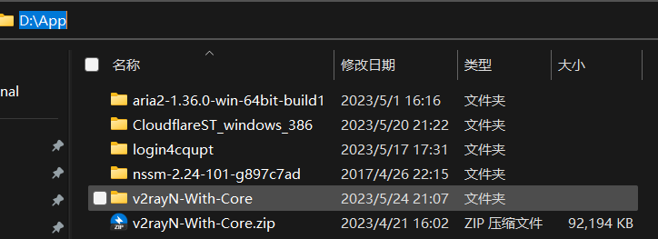

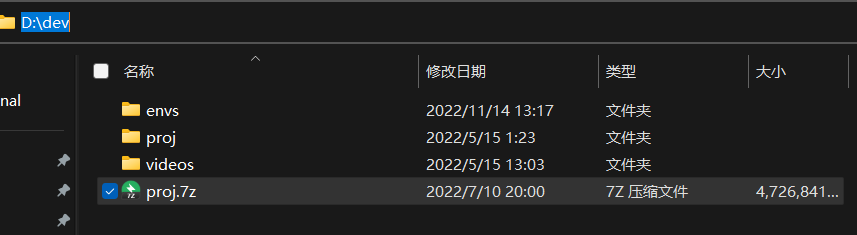


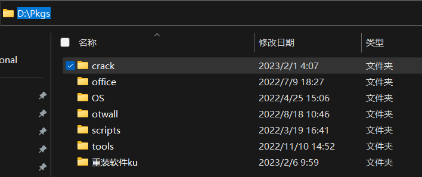


# 重装系统

## 安装系统

Win11 激活码，

```
VK7JG-NPHTM-C97JM-9MPGT-3V66T
```


## 激活系统

如果是使用破解软件而非激活码的话，要先安装 火绒安全！然后运行数字激活软件。

Win11 安装过程中需要联网！在设置中手动更改激活密钥，

```
VK7JG-NPHTM-C97JM-9MPGT-3V66T
```


## 安装相应的软件

- [Typora — a markdown editor, markdown reader.](https://typora.io/)

  注册信息，

  ```
  blxie@outlook.com
  BRAT6J-4UXVS6-4ZCXD8-AVFKYR
  ```

  修改图片相关设置，

  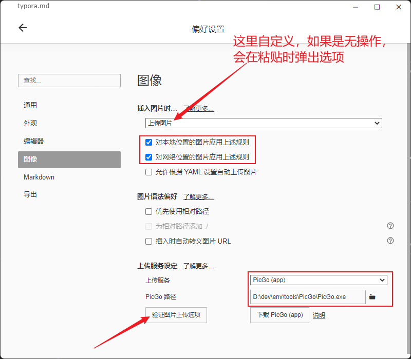

- [TIM-下载](https://tim.qq.com/download.html)

- [WPS Office-支持多人在线编辑多种文档格式_WPS官方网站](https://platform.wps.cn/)

- [Google Chrome 网络浏览器](https://www.google.com/chrome/)

- [Clash for Windows | Clash for Windows](https://docs.cfw.lbyczf.com/)

  - [一元机场](https://xn--4gq62f52gdss.com/#/dashboard)
  - [探索者](https://www.cryxr.xyz/#/dashboard)

  ```http
  https://sub.yxrcr.com/api/v1/client/subscribe?token=38d2b1a97d89a27b8918a3d38eabaf07
  https://xn--4gq62f52gdss.com/api/v1/client/subscribe?token=e9c6a60b5fbfad57f4435c9db81cead0
  ```

  修改系统代理设置：`Internet 选项 —— 连接 —— 局域网设置 —— 代理服务器`，取消勾选，保存退出！

  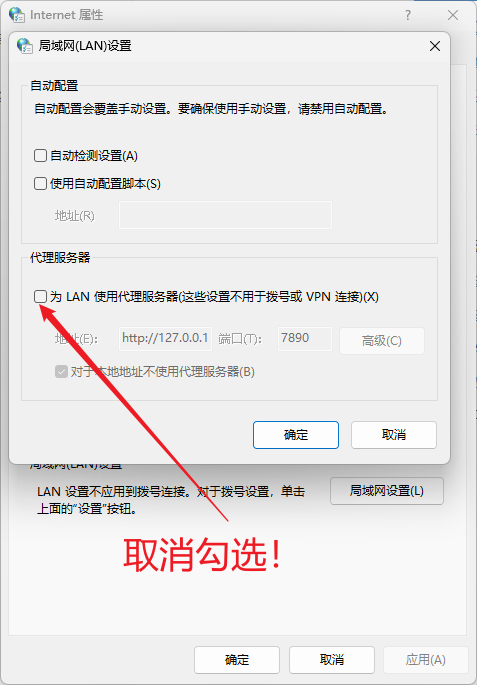

- [Download Visual Studio Code - Mac, Linux, Windows](https://code.visualstudio.com/download)

- [Releases · PowerShell/PowerShell](https://github.com/PowerShell/PowerShell)

- Snipaste 微软商店下载，注意设置成**以管理员身份运行**，这样任何位置都能截屏！

- [7-zip Download](https://www.7-zip.org/download.html)

- 安装 frpc 服务程序，

  - 下载 [Releases · fatedier/frp](https://github.com/fatedier/frp/releases)

  - 修改 `frpc.ini`，

    ```ini
    [common]
    server_addr = 43.143.59.35  # server ip
    server_port = 7000  # frps server port
    token = traceserver250510.  # key pair

    [ssh_win11_2508]  # frpc conn name, cannot repeat
    type = tcp
    local_ip = 127.0.0.1
    local_port = 3389  # Windows remote port
    remote_port = 6001  # corresponding to the open port of Linux server with public ip
    ```

  - 使用 `nssm` 安装服务程序，

    > - [NSSM - the Non-Sucking Service Manager](https://nssm.cc/)
    > - [堪称神器，能将普通应用程序注册成 Windows 服务的助手程序 NSSM ！ - 知乎](https://zhuanlan.zhihu.com/p/538549904)

    直接阅读官方说明文档！


    1. 下载：https://nssm.cc/release/nssm-2.24.zip

    2. 将解压后的文件放到指定路径：`D:\dev\env\OS\nssm-2.24\win64`

    3. 将其添加到系统环境变量中，为了方便管理，自己添加的环境都添加在 `user -- Path` 下，

       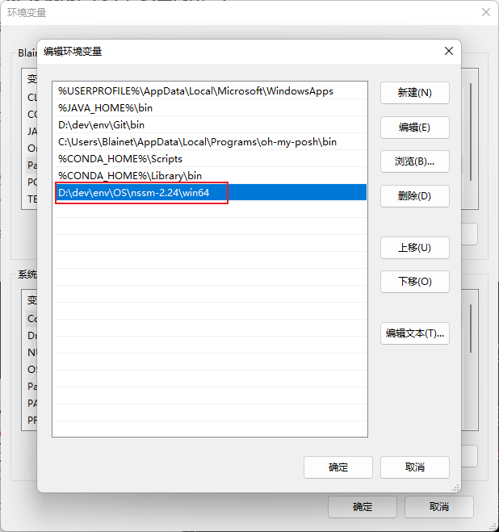

    4. 此时就可以在终端中直接使用 `64` 位的 `nssm`，进入要注册为服务的应用程序 可执行文件的目录下，在该目录下以管理员身份打开终端，执行以下命令即可，

       ```cmd
       nssm install/uninstall 自定义服务名称
       ```

       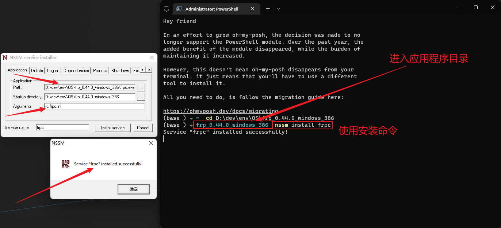


       之后在资源管理器中即可看到该服务，第一次手动启动，默认属性为自动启动，可不修改！

       打开 注册表编辑器，发现 `HKEY_LOCAL_MACHINE\SYSTEM\CurrentControlSet\Services` 下新增了一个条目 `frpc`，和之前的推断一样，原理和方法2类似，但是 `nssm` 做了封装（GUI），同时添加了更多的功能，操作管理起来也方便！

- 设置不允许自动关闭网络资源以节省电池，这样才不会断网！

  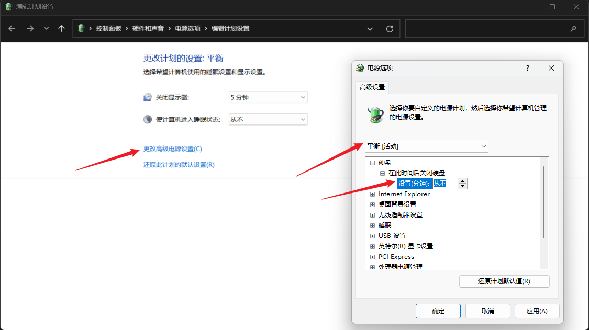

  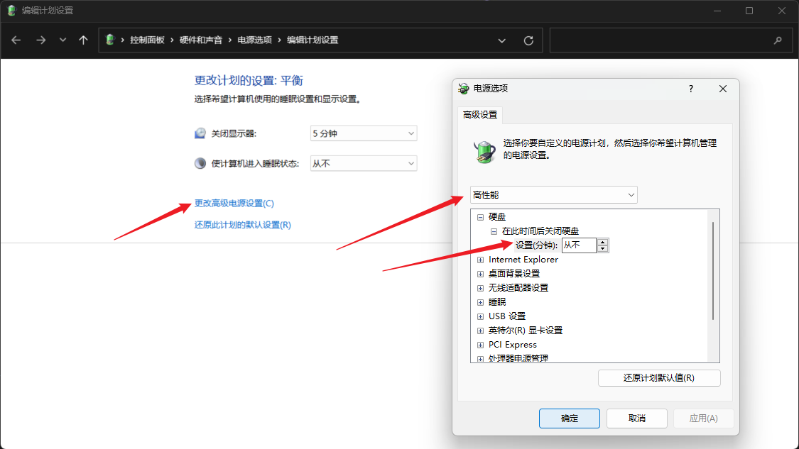


## 自定义设置

### Win11 卸载小组件

[WIN11卸载小组件_blainet的博客-CSDN博客](https://blog.csdn.net/qq_40750972/article/details/124976625)

管理员身份运行 `WIN + R`，`Ctrl + Shift + Enter`，

```powershell
winget uninstall "windows web experience pack"
```


### 删除文件资源管理器中无用的快捷方式（Win11不用了）

[Windows通过注册表删除文件资源管理器中无用的快捷方式_blainet的博客-CSDN博客](https://blog.csdn.net/qq_40750972/article/details/123443132)

`del_unless_shortcuts.reg`,

```
Windows Registry Editor Version 5.00

, 删除视频快捷方式
[-HKEY_LOCAL_MACHINE\SOFTWARE\Microsoft\Windows\CurrentVersion\Explorer\MyComputer\NameSpace\{f86fa3ab-70d2-4fc7-9c99-fcbf05467f3a}]
, 删除音乐快捷方式
[-HKEY_LOCAL_MACHINE\SOFTWARE\Microsoft\Windows\CurrentVersion\Explorer\MyComputer\NameSpace\{3dfdf296-dbec-4fb4-81d1-6a3438bcf4de}]
, 删除图片快捷方式
[-HKEY_LOCAL_MACHINE\SOFTWARE\Microsoft\Windows\CurrentVersion\Explorer\MyComputer\NameSpace\{24ad3ad4-a569-4530-98e1-ab02f9417aa8}]

, 删除文档快捷方式
[HKEY_LOCAL_MACHINE\SOFTWARE\Microsoft\Windows\CurrentVersion\Explorer\MyComputer\NameSpace\{d3162b92-9365-467a-956b-92703aca08af}]
, 删除桌面快捷方式
[HKEY_LOCAL_MACHINE\SOFTWARE\Microsoft\Windows\CurrentVersion\Explorer\MyComputer\NameSpace\{B4BFCC3A-DB2C-424C-B029-7FE99A87C641}]
, 删除下载快捷方式
[HKEY_LOCAL_MACHINE\SOFTWARE\Microsoft\Windows\CurrentVersion\Explorer\MyComputer\NameSpace\{088e3905-0323-4b02-9826-5d99428e115f}]

, 删除 OneDrive 快捷方式
[HKEY_CLASSES_ROOT\CLSID\{018D5C66-4533-4307-9B53-224DE2ED1FE6}]
"System.IsPinnedToNameSpaceTree"=dword:00000000
```

重启文件资源管理器即可生效！


## 设置休眠不断网

### 卓越性能模式（推荐）

命令行窗口中执行以下命令（不必需要管理员权限），然后在 控制面板 > 硬件和声音 > 电源选项 > 卓越性能，

```powershell
powercfg -duplicatescheme e9a42b02-d5df-448d-aa00-03f14749eb61
```

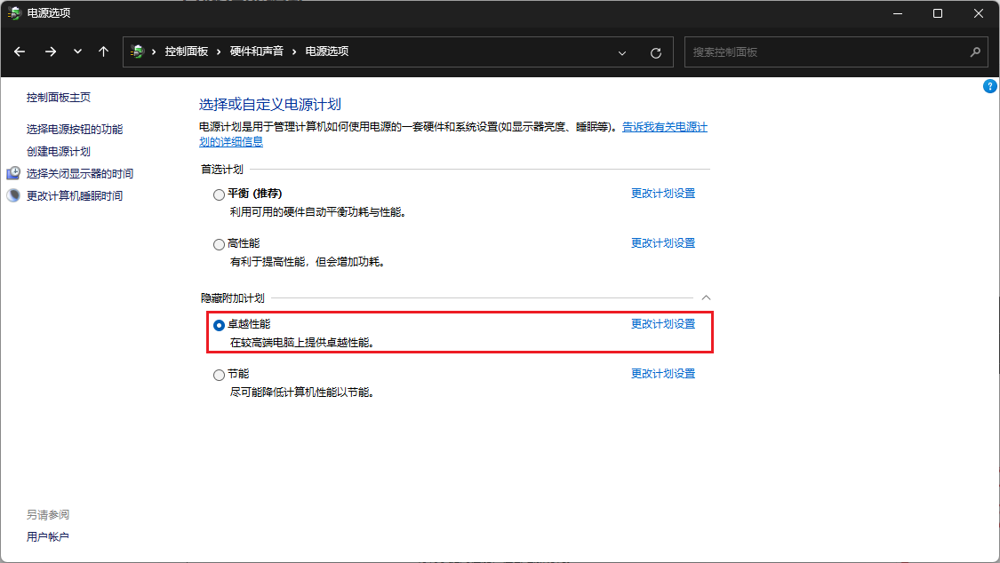


### 高性能模式

> 通过以下设置之后，其实就是卓越性能模式，差别仅仅在于 是否定时关闭硬盘！

1、首先将模式选择为 **高性能**！

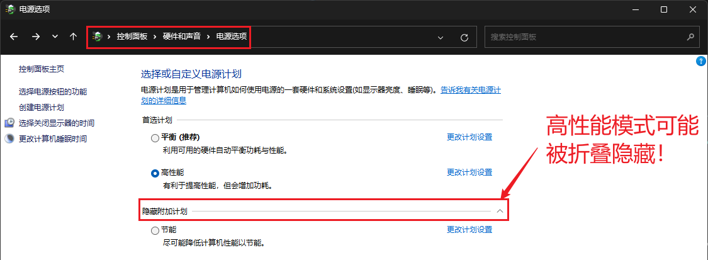


2、然后在 **电源选项 > 硬盘 > 设置为 `从不/0`**，

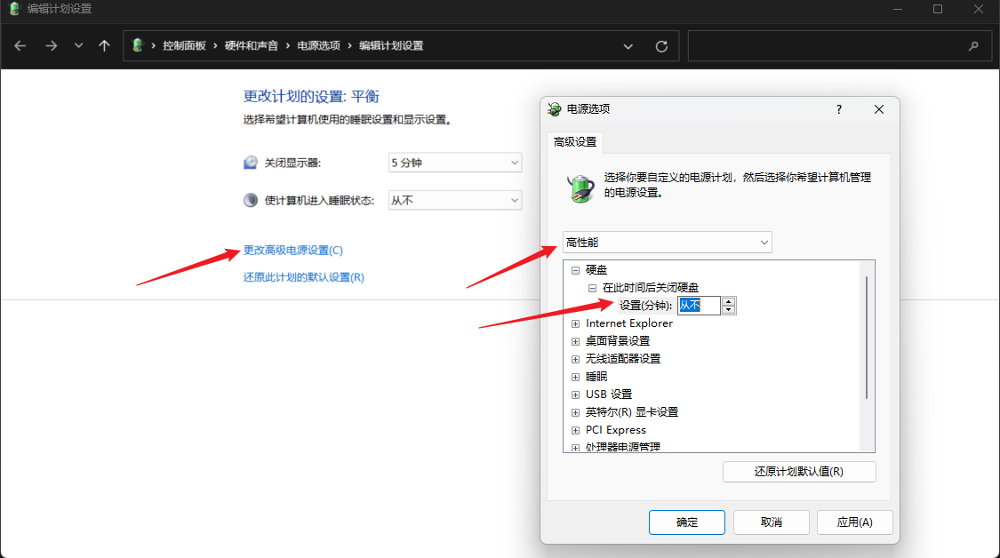


### 确定是否开启成功

开启成功之后，**CPU 频率** 提高很多，通过任务管理器可以看到，

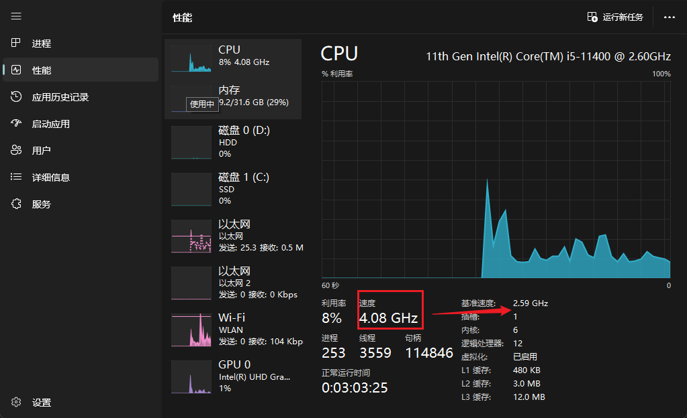


## 之后需要什么安装什么

Ximg 安装之后，记得将 Server IP 添加到 Xhost 里面！


# 环境配置

## Conda

```bash
# CONDA_HOME
D:\dev\env\Python\Miniconda3
# PATH
%CONDA_HOME%\Scripts
%CONDA_HOME%\Library\bin
```


## Java

> - https://blog.csdn.net/qq_40750972/article/details/89765464

```
JAVA_HOME	D:\Dev\env\Java\jdk-11.0.12
CLASSPATH	%JAVA_HOME%\lib\dt.jar;%JAVA_HOME%\lib\tools.jar
PATH	%JAVA_HOME%\bin
```


## 终端代理

powershell

```powershell
$env:HTTP_PROXY = "http://127.0.0.1:7890"
$env:HTTP_PROXY = "http://127.0.0.1:10809"

# 高级
HTTP_PROXY	http://127.0.0.1:10809
HTTPS_PROXY %HTTP_PROXY%
```


# 脚本文件

## 注册表

### 去掉快捷方式

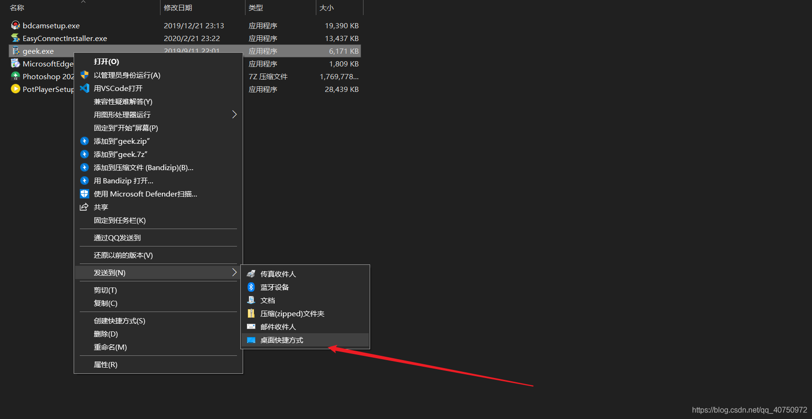

```shell
WINdows Registry Editor Version 5.00

[HKEY_CURRENT_USER\Software\Microsoft\WINdows\CurrentVersion\Explorer]

"Link"=hex:00,00,00,00
```

```powershell
Set-ItemProperty -Path HKCU:\Software\Microsoft\Windows\CurrentVersion\Explorer -Name Link -Value 0 -Force

Remove-ItemProperty -Path HKCU:\Software\Microsoft\Windows\CurrentVersion\Explorer\Advanced -Name Link
```

在 PowerShell 中，你可以通过修改注册表来实现隐藏快捷方式后面的 "快捷方式" 字样。下面是一种实现方法：

```powershell
# 设置注册表项路径和键名
$registryPath = "HKCU:\Software\Microsoft\Windows\CurrentVersion\Explorer"
$registryValueName = "link"

# 修改注册表值数据
Set-ItemProperty -Path $registryPath -Name $registryValueName -Value ([byte[]](0x00,0x00,0x00,0x00))
```

上述代码将 `link` 键的值修改为十六进制 `00 00 00 00`，这与注册表文件中的 `hex:00,00,00,00` 是等价的。

请注意，修改注册表可能会对系统造成影响，因此在操作注册表之前请确保你了解自己在做什么，并且谨慎操作。建议在操作注册表之前备份相关注册表项或创建系统恢复点以防万一。


### 桌面时间显示秒

> - [Win11 学院：如何让 Windows 11 系统托盘显示秒数 - IT之家 (ithome.com)](https://www.ithome.com/0/661/803.htm)


```shell
WINdows Registry Editor Version 5.00

[HKEY_CURRENT_USER\SOFTWARE\Microsoft\WINdows\CurrentVersion\Explorer\Advanced]

"ShowSecondsInSystemClock"=dword:00000001
```

```powershell
Set-ItemProperty -Path HKCU:\Software\Microsoft\Windows\CurrentVersion\Explorer\Advanced -Name ShowSecondsInSystemClock -Value 1 -Force

## 取消显示
powershell.exe Set-ItemProperty -Path HKCU:\Software\Microsoft\Windows\CurrentVersion\Explorer\Advanced -Name ShowSecondsInSystemClock -Value 0 -Force
```


### 将VSCode添加到右键菜单

【PS】将该将本文件放到 `VSCode` 的**解压文件夹**中（使用了相对路径）！

```shell
@ECHO OFF
PUSHD %~DP0
TITLE VSCode
Md "%WINDir%\System32\test_permissions" 2>NUL||(Echo 请使用右键管理员身份运行&&Pause >NUL&&Exit)
Rd "%WINDir%\System32\test_permissions" 2>NUL
SetLocal EnableDelayedExpansion
SET /P ST=输入a添加右键菜单，输入d删除右键菜单：
if /I "%ST%"=="a" goto Add
if /I "%ST%"=="d" goto Remove
:Add
reg add "HKEY_CLASSES_ROOT\*\shell\VSCode"         /t REG_SZ /v "" /d "&用VSCode打开"   /f
reg add "HKEY_CLASSES_ROOT\*\shell\VSCode"         /t REG_EXPAND_SZ /v "Icon" /d "%~dp0Code.exe" /f
reg add "HKEY_CLASSES_ROOT\*\shell\VSCode\command" /t REG_SZ /v "" /d "%~dp0Code.exe \"%%1\"" /f

reg add "HKEY_CLASSES_ROOT\Directory\shell\VSCode"         /t REG_SZ /v "" /d "&用VSCode打开"   /f
reg add "HKEY_CLASSES_ROOT\Directory\shell\VSCode"         /t REG_EXPAND_SZ /v "Icon" /d "%~dp0Code.exe" /f
reg add "HKEY_CLASSES_ROOT\Directory\shell\VSCode\command" /t REG_SZ /v "" /d "%~dp0Code.exe \"%%1\"" /f

exit
:Remove
reg delete "HKEY_CLASSES_ROOT\*\shell\VSCode" /f
reg delete "HKEY_CLASSES_ROOT\Directory\shell\VSCode" /f
exit
```


### 将Everything添加到右键菜单

>参考链接1：[https://www.jianshu.com/p/6f313ea6c990](https://www.jianshu.com/p/6f313ea6c990)
>参考链接2：[https://zhidao.baidu.com/question/31177027.html](https://zhidao.baidu.com/question/31177027.html)


【PS】同 `VSCode`，必须将该脚本文件放到 `Everything` 的**解压文件夹**中！命名为 `add2context.bat`，

```shell
@ECHO OFF
PUSHD %~DP0
TITLE Everything
Md "%WINDir%\System32\test_permissions" 2>NUL||(Echo 请使用右键管理员身份运行&&Pause >NUL&&Exit)
Rd "%WINDir%\System32\test_permissions" 2>NUL
SetLocal EnableDelayedExpansion
SET /P ST=输入a添加右键菜单，输入d删除右键菜单：

if /I "%ST%"=="a" goto Add
if /I "%ST%"=="d" goto Remove

:Add
reg add "HKEY_CLASSES_ROOT\Directory\Background\shell\Everything"         /t REG_SZ /v "" /d "&使用Everything搜索"   /f
reg add "HKEY_CLASSES_ROOT\Directory\Background\shell\Everything"         /t REG_EXPAND_SZ /v "Icon" /d "%~dp0Everything.exe" /f
reg add "HKEY_CLASSES_ROOT\Directory\Background\shell\Everything\command" /t REG_SZ /v "" /d "%~dp0Everything.exe -path \".\"" /f

exit
:Remove
reg delete "HKEY_CLASSES_ROOT\Directory\Background\shell\Everything" /f
exit
```


### 应用程序多个窗口无法正常显示（BUG已修复）

`HKEY_CURRENT_USER\Software\Microsoft\WINdows\CurrentVersion\Explorer\Taskband`，新建一个 `DWARD32` 项 `NumThumbnails`，并将值设置为 `0`！

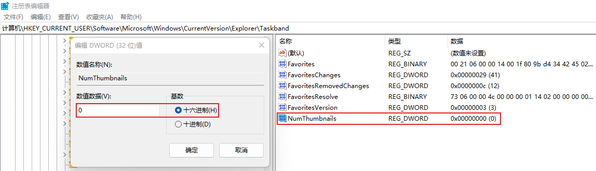


重启 文件资源管理器 即可立即生效！


多个桌面应用显示设置 `WIN + Tab`,

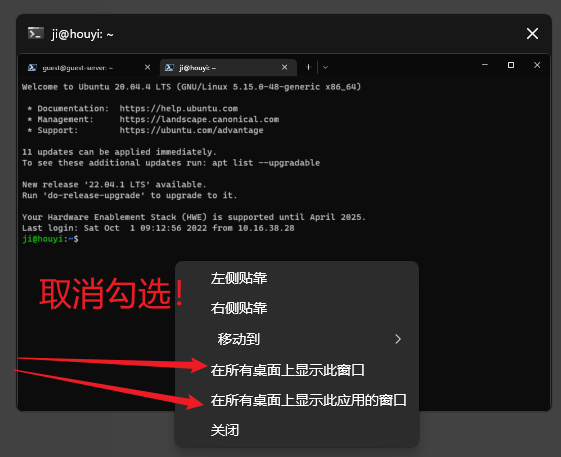


### 修改右键应用程序的名称

> **（直接看后面的总结，这里从开始就操作错误了！）**

打开注册表编辑器，然后进入 `HKEY_CLASSES_ROOT\Directory\shell`，找到要修改的那个应用程序，按照以下操作进行即可！

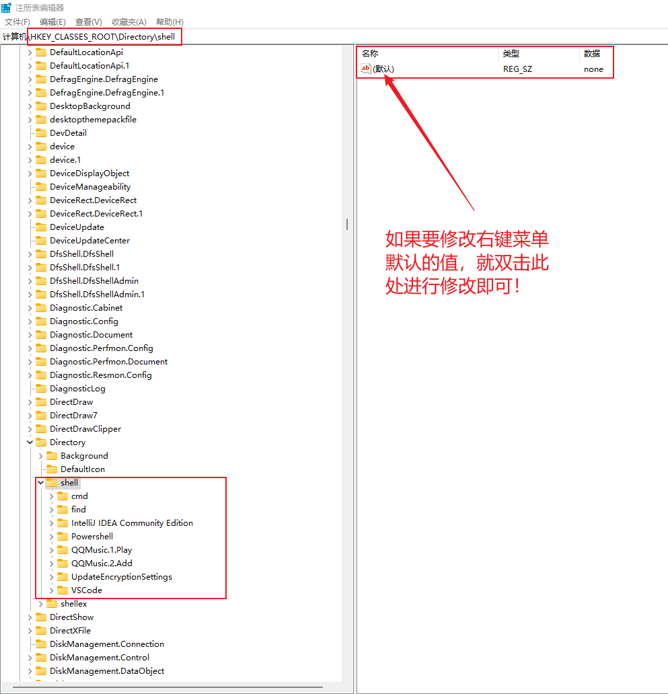

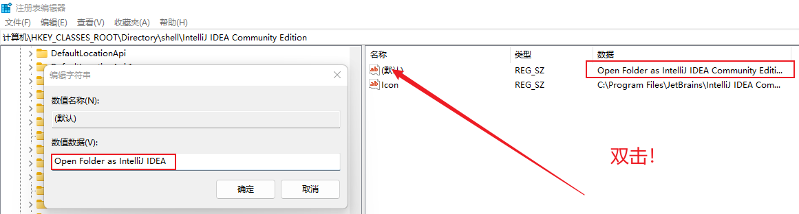


重启 文件资源管理器 立即生效！如果还是不行，

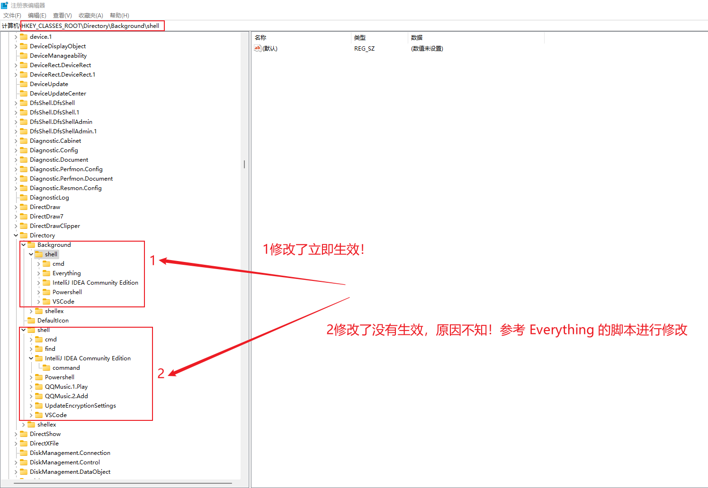


总结：还是应该在 `Background` 里面进行修改，而非 `shell` 目录下！


### 任务栏位置

将任务栏移动到顶端 `HKEY_CURRENT_USER\Software\Microsoft\Windows\CurrentVersion\Explorer\StuckRects3`，修改 `FE` 的值，

- `01` 上
- `03` 下
- `00` 左
- `02` 右


## BASH

### 快速删除

```bash
命令：del

参数：
	1) /s：递归删除该文件夹下所有符合条件的文件
	2) /f：强制删除

删除一个或多个文件。

DEL [/P] [/F] [/S] [/Q] [/A[[:]attributes]] names
ERASE [/P] [/F] [/S] [/Q] [/A[[:]attributes]] names

  names         指定一个或多个文件或者目录列表。
                通配符可用来删除多个文件。
                如果指定了一个目录，该目录中的所
                有文件都会被删除。

  /P            删除每一个文件之前提示确认。
  /F            强制删除只读文件。
  /S            删除所有子目录中的指定的文件。
  /Q            安静模式。删除全局通配符时，不要求确认
  /A            根据属性选择要删除的文件
  属性          R  只读文件            S  系统文件
                H  隐藏文件            A  准备存档的文件
                I  无内容索引文件      L  重新分析点
                O  脱机文件            -  表示“否”的前缀

如果命令扩展被启用，DEL 和 ERASE 更改如下:

/S 开关的显示句法会颠倒，即只显示已经
删除的文件，而不显示找不到的文件。
```


### 删除 远程桌面连接 的历史记录

> - [如何清除Windows中的RDP连接历史记录 - 知乎](https://zhuanlan.zhihu.com/p/34268849)

```shell
@echo off
reg delete "HKEY_CURRENT_USER\Software\Microsoft\Terminal Server Client\Default" /va /f
reg delete "HKEY_CURRENT_USER\Software\Microsoft\Terminal Server Client\Servers" /f
reg add "HKEY_CURRENT_USER\Software\Microsoft\Terminal Server Client\Servers"
cd %userprofile%\documents\
attrib Default.rdp -s -h
del Default.rdp
```


# 功能设置

## 休眠关闭

管理员身份运行，

```bash
powercfg /h off
```


## 多个显示器设置使用

选择扩展该屏幕，

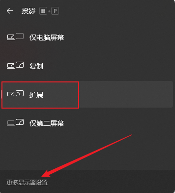

然后进入更多设置里面，首先点击标识，此时各块屏幕上会显示系统给它的标号，

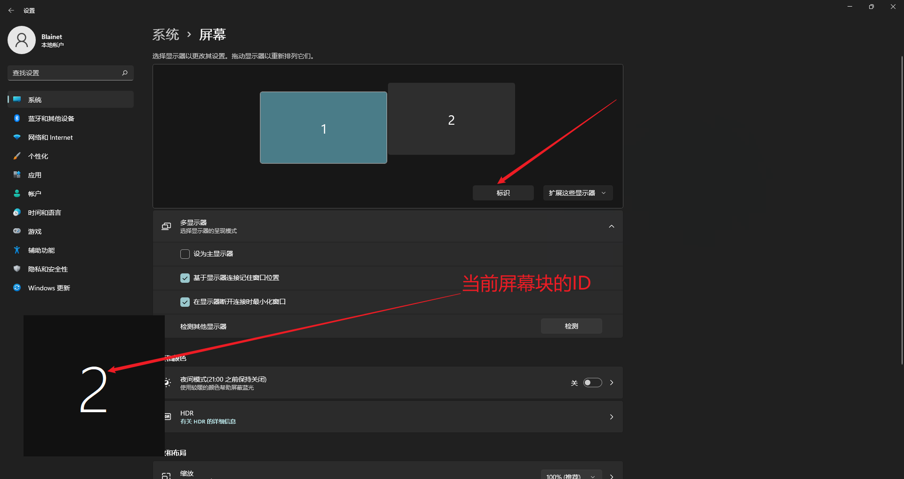

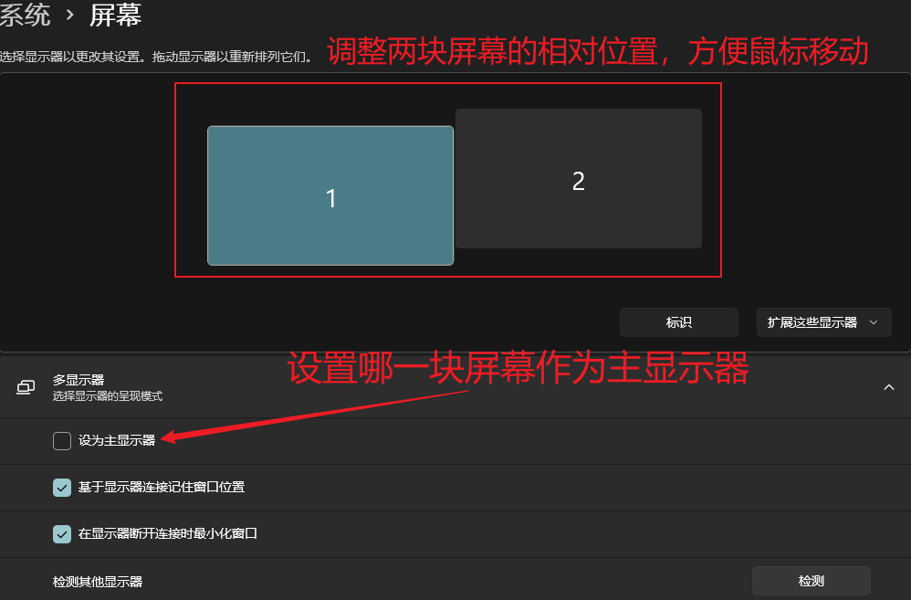

主显示器会显示任务栏，

设置多显示任务栏状态，

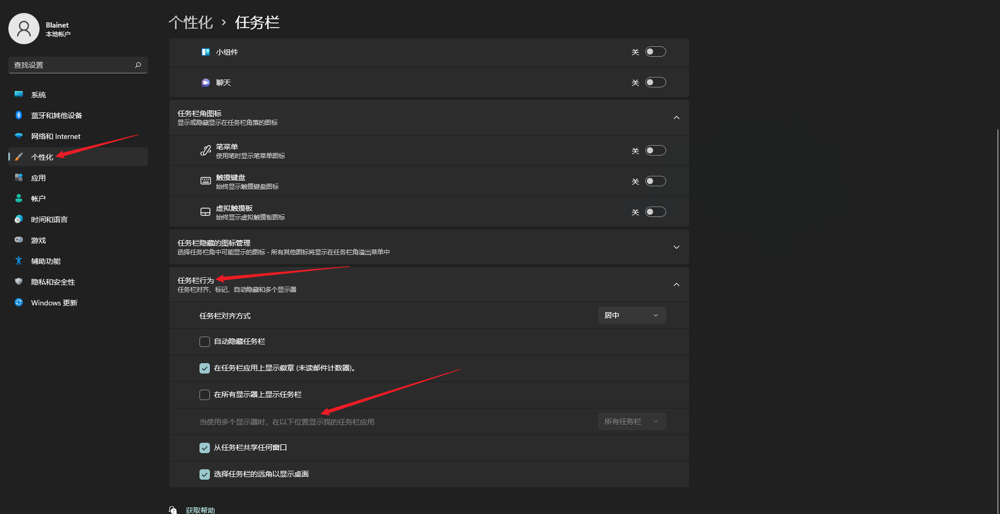


## 将可执行程序注册为 Windows 服务

> - [2种方法教你，如何将exe注册为windows服务，直接从后台运行 - 知乎](https://zhuanlan.zhihu.com/p/93808282) 非常有用！使用方法2 一步到位！！！
> - [关于服务的创建常用命令（redis服务创建、启动、停止、删除）_dhq_blog的博客-CSDN博客_redis停止服务命令](https://blog.csdn.net/dhq_blog/article/details/82950513)
> - [以windows服务的方式运行FRP · 搬砖小抄](http://note.eta.pub/2020/07/21/frp-windows-service/)
> - https://github.com/pandolia/easy-service
> - https://zhmoegirl.com/posts/006184d07a09/#%E5%BC%80%E7%AF%87%E5%BA%9F%E8%AF%9D

### 方法1：[sc.exe创建 | Microsoft Docs](https://docs.microsoft.com/zh-cn/windows-server/administration/windows-commands/sc-create) 很少用到！

```cmd
sc create frpc binpath= "D:\dev\env\frp_0.44.0_windows_386\frpc.exe" type= own start= auto
```

如果程序不符合规范，就算可以创建成功，也无法启动，报 1053 错误，在服务程序中右键添加启动参数仍然无法解决，因此判断该程序不符合 Windows 支持的服务程序类型。

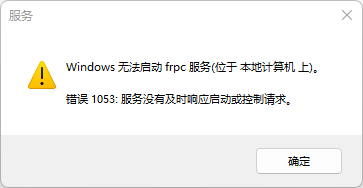

删除服务，`HKEY_LOCAL_MACHINE\SYSTEM\CurrentControlSet\Services` 删除对应服务条目（默认 sc 删除时会同时删除注册表中的相关项目）

```cmd
sc delete frpc
```


### 方法2：[创建用户定义的服务 - Windows Client | Microsoft Docs](https://docs.microsoft.com/zh-cn/troubleshoot/windows-client/deployment/create-user-defined-service)

> - 源链接：[https://pan.baidu.com/s/1gKu_WwVo-TeWXmrGAr9qjw](https://link.zhihu.com/?target=https%3A//pan.baidu.com/s/1gKu_WwVo-TeWXmrGAr9qjw) 提取码：s1vm
> - [instsrv.exesrvany.exe-桌面系统文档类资源-CSDN文库](https://download.csdn.net/download/qq_40750972/86539342) 自己上传到 CSDN

1. 将 `instsrv.exe` 和 `srvany.exe` 拷贝到`C:\WINDOWS\SysWOW64`目录下；

2. 以管理员身份打开 `cmd`；

3. 运行命令，

   ```cmd
   .\instsrv.exe frpc C:\WINDOWS\SysWOW64\srvany.exe
   ```


4. 服务创建成功之后，会在注册表中生成条目 `HKEY_LOCAL_MACHINE\SYSTEM\CurrentControlSet\Services\服务名称`，

   1. 选中新建的服务，右键创建新的 项目：`Parameters`；

   2. 点击 `Parameters`，在右边栏创建新的 字符串值，

      - `Application` 作为服务运行的程序路径；

      - `AppDirectory` 作为服务运行程序所在文件夹；

      - `AppParameters` 启动参数

        > 注意：启动参数不能加 引号！参数值可以加！！！即 `-c` 不能用引号！

      最终效果，

      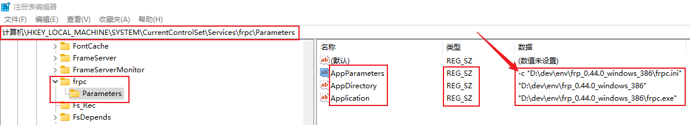

5. `Ctrl Shift Esc` 打开控制台，找到服务选项，右键启动即可，如果要设置为开机自启动，直接进入服务中进行设置即可，

   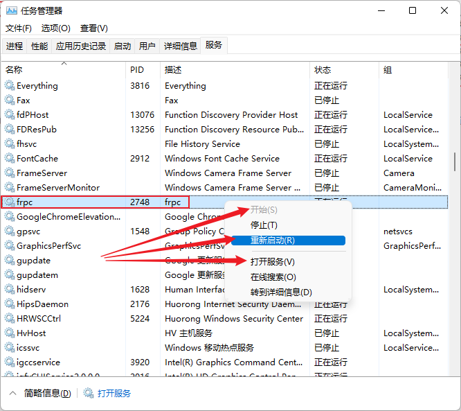


> 如果 Snipaste 无法使用，尝试在设置中设置 以管理员方式启动！

之后通过远程连接进行测试！没有任何问题！


虽然暂时可以使用，但是使用 `srvany` 的有点缺陷，具体看 `nssm` 官方说明文档！因此不推荐使用该方法。

卸载服务，

```cmd
sc delete frpc
```

会将服务以及注册表中的条目都删除，所以不用再进入注册表手动删除之前的配置！


### 方法3：nssm（推荐使用，简单，安全高效！）

个人理解：是对方法二的封装升级（思路上），能够更好地满足需求。

> - [NSSM - the Non-Sucking Service Manager](https://nssm.cc/)
> - [堪称神器，能将普通应用程序注册成 Windows 服务的助手程序 NSSM ！ - 知乎](https://zhuanlan.zhihu.com/p/538549904)

直接阅读官方说明文档！


1. 下载：https://nssm.cc/release/nssm-2.24.zip

2. 将解压后的文件放到指定路径：`D:\dev\env\OS\nssm-2.24\`

3. 将其添加到系统环境变量中，为了方便管理，自己添加的环境都添加在 `user -- Path` 下，

   

4. 此时就可以在终端中直接使用 `64` 位的 `nssm`，进入要注册为服务的应用程序 可执行文件的目录下，在该目录下以管理员身份打开终端，执行以下命令即可，

   ```cmd
   nssm install/uninstall 自定义服务名称
   ```

   

   之后在资源管理器中即可看到该服务正在运行（呃呃，第一次需要手动运行）！

   打开 注册表编辑器，发现 `HKEY_LOCAL_MACHINE\SYSTEM\CurrentControlSet\Services` 下新增了一个条目 `frpc`，和之前的推断一样，原理和方法2类似，但是 `nssm` 做了封装（GUI），同时添加了更多的功能，操作管理起来也方便！


### 方法4：WinSW（使用较为繁琐）

> - [用winsw让任何Windows程序都能运行为服务 - 简书](https://www.jianshu.com/p/fc9e4ea61e13)


## PowerShell 安装美化

### 1、下载安装

> - [以管理员身份在当前目录打开命令行窗口_木子欢儿的博客-CSDN博客](https://blog.csdn.net/muzihuaner/article/details/121506981)

推荐使用 github 官方的 release 进行下载安装， `.msi` 文件 [Releases · PowerShell/PowerShell](https://github.com/PowerShell/PowerShell/releases)

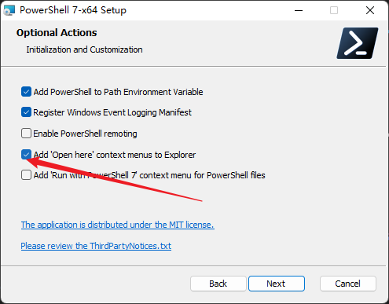

其他直接默认即可！

注意一定要勾选第4个选项，这样才能在目录下出现，

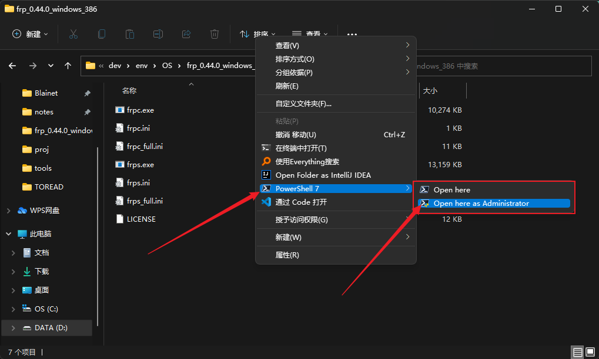


### 2、安装插件 oh-my-posh & posh-git

> - 官方网站：[Home | Oh My Posh](https://ohmyposh.dev/)

安装插件之前 `我的文档` 目录情况，

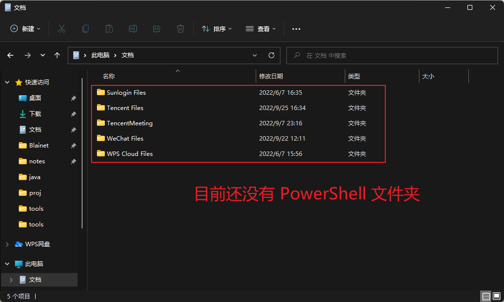


安装插件：[Windows | Oh My Posh](https://ohmyposh.dev/docs/installation/windows)，

> - [Windows 系统缺失的包管理器：Chocolatey、WinGet 和 Scoop - 少数派](https://sspai.com/post/65933)
> - [ScoopInstaller/Install: 📥 Next-generation Scoop (un)installer](https://github.com/ScoopInstaller/Install#for-admin)

- `winget`，微软自家推出的包管理工具，默认安装在 `C:\Program Files`，

  ```powershell
  winget install JanDeDobbeleer.OhMyPosh -s winget
  ```

  卸载，

  ```powershell
  winget list
  winget uninstall "Aria2c rpc"  # 必须指明全名，默认从 Microsoft Store 里面安装下载
  ```


- `scoop` 第三方安装管理软件，默认安装在 `~/scoop` 下，注意不要以管理员身份运行 `PowerShell` 执行安装命令，

  [给 Scoop 加上这些软件仓库，让它变成强大的 Windows 软件管理器 - 少数派](https://sspai.com/post/52710)

  ```powershell
  Set-ExecutionPolicy -ExecutionPolicy RemoteSigned -Scope CurrentUser  # prerequisites
  irm get.scoop.sh | iex  # install scoop
  scoop install aria2  # scoop 支持 aria2 进行多线程下载

  scoop uninstall aria2  # 首先安装 aria2，之后默认使用多线程下载
  scoop config proxy 127.0.0.1:7890  # scoop 配置代理

  PS C:\Users\Blainet> scoop install https://github.com/JanDeDobbeleer/oh-my-posh/releases/latest/download/oh-my-posh.json
  WARN  Purging previous failed installation of 7zip.
  ERROR '7zip' isn't installed correctly.
  Removing older version (22.01).
  '7zip' was uninstalled.
  WARN  Scoop uses 'aria2c' for multi-connection downloads.
  WARN  Should it cause issues, run 'scoop config aria2-enabled false' to disable it.
  WARN  To disable this warning, run 'scoop config aria2-warning-enabled false'.
  Installing '7zip' (22.01) [64bit] from main bucket
  Starting download with aria2 ...
  Download: Download Results:
  Download: gid   |stat|avg speed  |path/URI
  Download: ======+====+===========+=======================================================
  Download: d6e11e|OK  |    18KiB/s|C:/Users/Blainet/scoop/cache/7zip#22.01#https_7-zip.org_a_7z2201-x64.msi
  Download: Status Legend:
  Download: (OK):download completed.
  Checking hash of 7z2201-x64.msi ... ok.
  Extracting 7z2201-x64.msi ... done.
  Linking ~\scoop\apps\7zip\current => ~\scoop\apps\7zip\22.01
  Creating shim for '7z'.
  Creating shortcut for 7-Zip (7zFM.exe)
  Persisting Codecs
  Persisting Formats
  Running post_install script...
  '7zip' (22.01) was installed successfully!
  Notes
  -----
  Add 7-Zip as a context menu option by running: "C:\Users\Blainet\scoop\apps\7zip\current\install-context.reg"
  Installing 'oh-my-posh' (11.0.1) [64bit]
  Starting download with aria2 ...
  Download: Download Results:
  Download: gid   |stat|avg speed  |path/URI
  Download: ======+====+===========+=======================================================
  Download: 3d7e3a|OK  |   3.0MiB/s|C:/Users/Blainet/scoop/cache/oh-my-posh#11.0.1#https_github.com_JanDeDobbeleer_oh-my-posh_releases_download_v11.0.1_posh-windows-amd64.7z
  Download: Status Legend:
  Download: (OK):download completed.
  Checking hash of posh-windows-amd64.7z ... ok.
  Extracting posh-windows-amd64.7z ... done.
  Linking ~\scoop\apps\oh-my-posh\current => ~\scoop\apps\oh-my-posh\11.0.1
  Running post_install script...
  Thanks for installing Oh My Posh.
  Have a look at https://ohmyposh.dev for detailed instructions for your shell.
  'oh-my-posh' (11.0.1) was installed successfully!
  PS C:\Users\Blainet>
  ```

  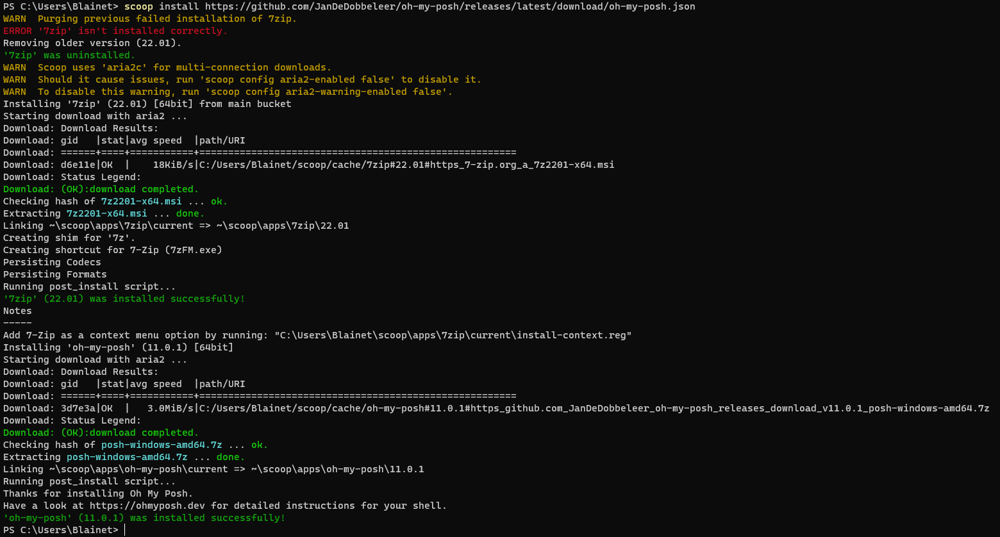


  ==首先会安装 7-zip，然后再安装指定的软件！==


- `manual`，手动安装默认的安装位置在 `~\Documents\PowerShell` 目录下，

  ```powershell
  Set-ExecutionPolicy Bypass -Scope Process -Force; Invoke-Expression ((New-Object System.Net.WebClient).DownloadString('https://ohmyposh.dev/install.ps1'))
  ```

  卸载：直接删除该目录。


推荐使用后面两种。


### 3、更改 prompt 及 主题

> [Change your prompt | Oh My Posh](https://ohmyposh.dev/docs/installation/prompt)

```powershell
oh-my-posh get shell  # 查看当前的终端类型
notepad $PROFILE  # 修改 PowerShell 配置文件

oh-my-posh init pwsh --config 'https://raw.githubusercontent.com/JanDeDobbeleer/oh-my-posh/main/themes/zash.omp.json' | Invoke-Expression  # 自己选择一个喜欢的主题即可！只需要修改最后主题的 json 名称
oh-my-posh init pwsh --config "~\Documents\PowerShell\themes\robbyrussel.omp.json" | Invoke-Expression  # 手动 copy 方便修改

.$PROFILE  # 使配置文件立即生效！
```

推荐使用手动 copy 的方式，这样方便修改主题配置文件，因为默认的配置文件不支持显示 conda 虚拟环境！只需要在 `segments` 下增加以下设置即可，

```json
{
  "type": "python",
  "style": "plain",
  "foreground": "#D0666F",
  "properties": {
    "display_virtual_env": true,
    "dispplay_default": true,
    "display_version": true,
    "prefix": "(",
    "postfix": ")",
    "display_mode": "always"
  }
},
```


这时发现字体有问题，

> - 官方主题使用说明：[https://ohmyposh.dev/docs/themes](https://ohmyposh.dev/docs/themes)
> - 安装官方建议的字体：[https://ohmyposh.dev/docs/config-fonts](https://ohmyposh.dev/docs/config-fonts)
> - `Nerd Font` 字体官方链接：[https://www.nerdfonts.com/font-downloads](https://www.nerdfonts.com/font-downloads) 其中作者推荐的是 `MesloLGM NF` [https://github.com/ryanoasis/nerd-fonts/releases/download/v2.1.0/Meslo.zip](https://github.com/ryanoasis/nerd-fonts/releases/download/v2.1.0/Meslo.zip)，将字体添加到 `settings.json` 中就可以了。
> - 官方建议说明：Oh My Posh was designed to use Nerd Fonts. Nerd Fonts are popular fonts that are patched to include icons. <font color="red"></b>We recommend Meslo LGM NF, but any Nerd Font should be compatible with the standard themes. To see the icons displayed in Oh My Posh, install a Nerd Font, and configure your terminal to use it.</b></font>


下载完成后，右键选择为所有的用户安装：
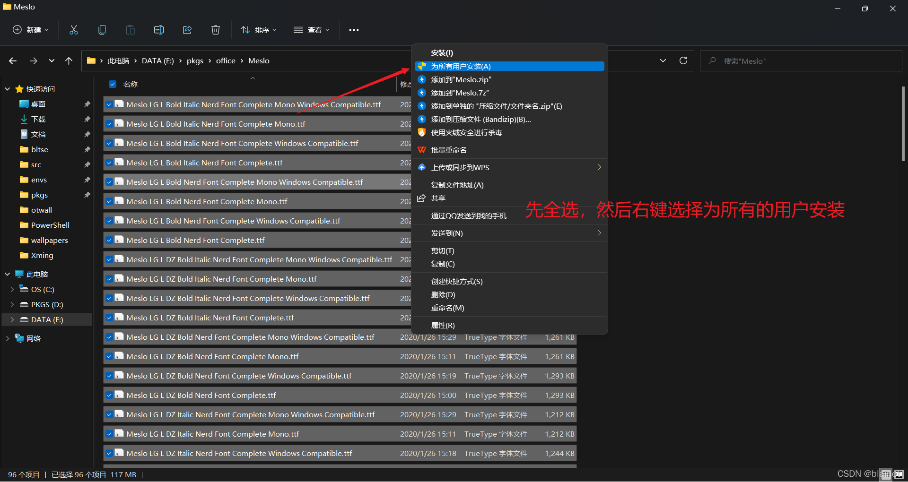

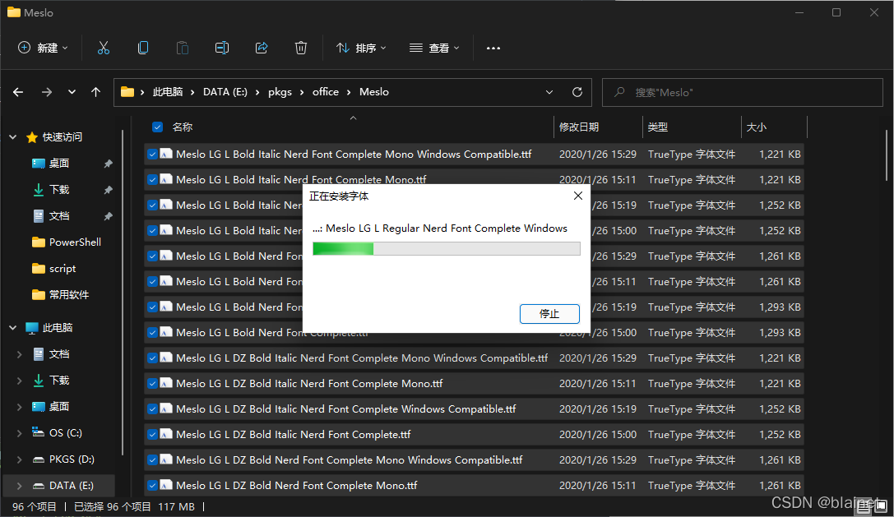


安装完毕之后，可以在系统中看到已经安装好的 `Meslo` 字体，

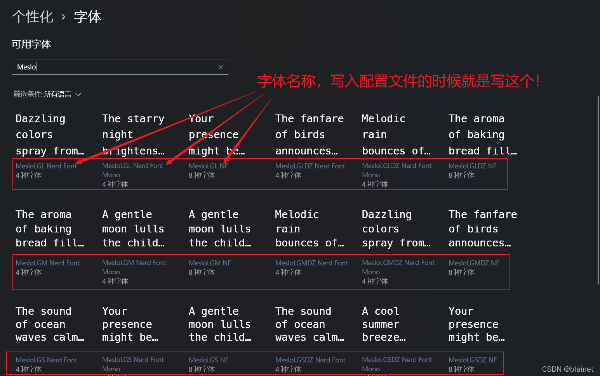


将字体更改为以上 `Meslo` 中的一种即可，这里使用官方推荐的字体 `MesloLGM NF` （图中第二行、第三列），

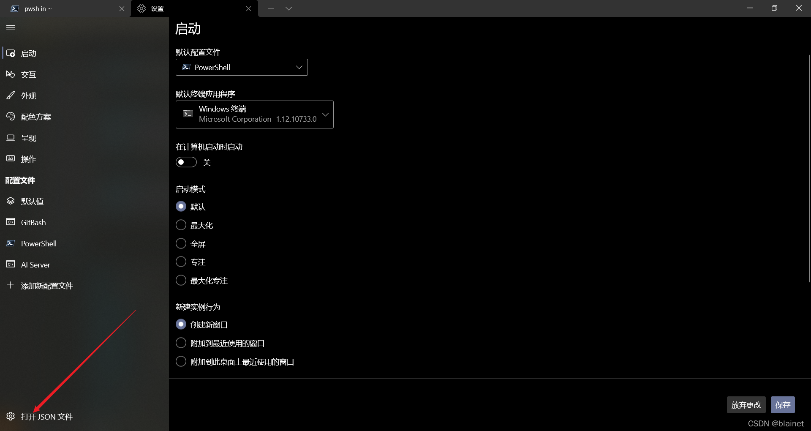

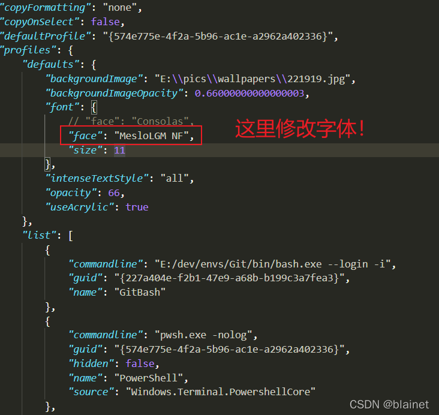


### 4、oh-my-posh 美化（最后阶段，去掉冗余的提示信息）

最近更新的又没有该提示信息了！这里做个记录，方便查看。


> > 有关开始的时候总是显示，
> >
> > ```cmd
> > Hey friend
> >
> > In an effort to grow oh-my-posh, the decision was made to no
> > longer support the PowerShell module. Over the past year, the
> > added benefit of the module disappeared, while the burden of
> > maintaining it increased.
> >
> > However, this doesn't mean oh-my-posh disappears from your
> > terminal, it just means that you'll have to use a different
> > tool to install it.
> >
> > All you need to do, is follow the migration guide here:
> >
> > https://ohmyposh.dev/docs/migrating
> > ```
>
>
>
> 这是由于在启动脚本文件中添加的语句导致，找到该脚本文件，然后删除这一段提示信息即可！
>
> 定位到 `C:\Users\Blainet\Documents\PowerShell\Modules\oh-my-posh\7.85.2\oh-my-posh.psm1`，
>
> 将其中的提示信息进行注释即可！
>
> ```powershell
> # Write-Host @'
> # Hey friend
>
> # In an effort to grow oh-my-posh, the decision was made to no
> # longer support the PowerShell module. Over the past year, the
> # added benefit of the module disappeared, while the burden of
> # maintaining it increased.
>
> # However, this doesn't mean oh-my-posh disappears from your
> # terminal, it just means that you'll have to use a different
> # tool to install it.
>
> # All you need to do, is follow the migration guide here:
>
> # https://ohmyposh.dev/docs/migrating
> # '@
> ```
>
> 再次打开就很干净啦！


> > 有关显示以下提示的解决方法，
> >
> > ```powershell
> > PowerShell 7.2.6
> > Copyright (c) Microsoft Corporation.
> >
> > https://aka.ms/powershell
> > Type 'help' to get help.
> >
> > Loading personal and system profiles took 729ms.
> > ```
>
>
>
> 在 `Windows Terminal` 里面对 `PowerShell` 进行设置，将命令行启动命令修改为，
>
> ```cmd
> pwsh  --nolog
> ```
>
> 这样就没问题啦！


## 配置文件

### `~/.ssh/config`

```ini
# Read more about SSH config files: https://linux.die.net/man/5/ssh_config
Host A4000
    HostName 10.16.37.18
    Port 22
    User guest
    IdentityFile ~/.ssh/id_rsa
    ForwardAgent yes

Host A6000
    HostName 10.16.93.52
    Port 5122
    User ji
    IdentityFile ~/.ssh/id_rsa
    ForwardAgent yes

Host *
    ServerAliveInterval 60
    ServerAliveCountMax 3
    # do not send keepalive messages to the server
    TCPKeepAlive no
```


##  Microsoft Visual C++ 14.0

> - [Downloads - Visual Studio Subscriptions Portal](https://my.visualstudio.com/Downloads?q=c+) 直接使用这个安装会有些问题，仍然不行
> - [Microsoft C++ Build Tools - Visual Studio](https://visualstudio.microsoft.com/visual-cpp-build-tools/)

安装好之后，选择安装 `C++` 桌面应用开发，再在右边的选项栏里只勾选前两项！

安装好之后即可卸载！


## 自动登录校园网

> - [校园网自动登录全平台解决方案 - 知乎](https://zhuanlan.zhihu.com/p/364016452)

### 注意

> WiFi 的话要首先连接（自动创建连接配置文件），分配给指定接口的配置文件“CQUPT”

```
%ProgramData%\Microsoft\Wlansvc\Profiles\Interfaces\网卡的ID（可通过TMAC查看）
```


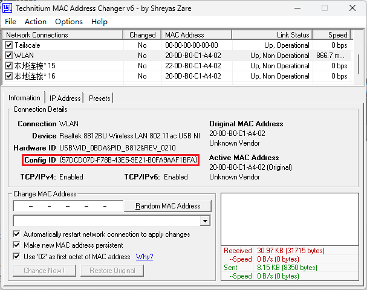

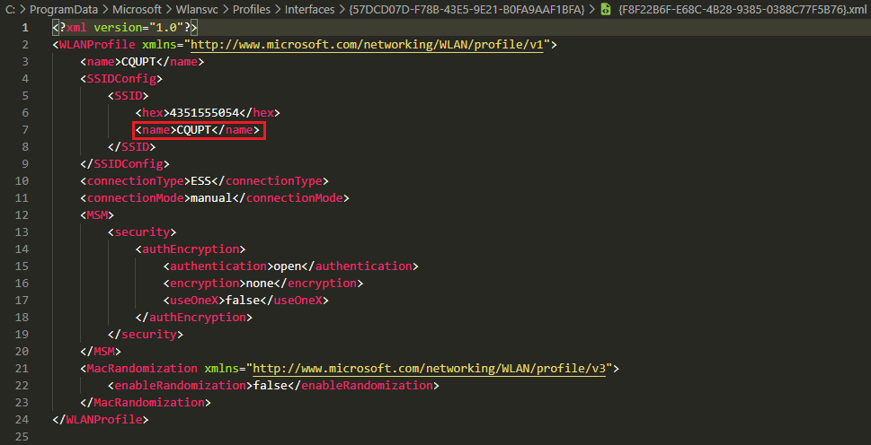

chatgpt指令，

```
windows下python守护进程创建
服务停止有问题，不能停止该服务
python demo.py install无任何反应
SvcRemove移除服务还没实现

windows服务模块强制刷新
```


命令行命令，

```bash
netsh interface show interface
netsh interface show interface "以太网"
netsh wlan connect name=CQUPT ssid=CQUPT
```


`time.sleep()` 何时用，值设置为多少很重要，直接影响最终能否运行！


### 创建守Win护进程

#### 原始版

```python
#  create by ourongxing
#  detail url: https://github.com/ourongxing/login4cqupt
import requests
import argparse
import socket
import os
import sys
import subprocess

def login(ip, args):
    args.ip = ip
    args.device = 0 if args.device == 'pc' else 1
    res = requests.get('http://192.168.200.2:801/eportal/?c=Portal&a=login&callback=dr1003&login_method=1&user_account=%2C{device}%2C{account}%40{operator}&user_password={password}&wlan_user_ip={ip}&wlan_user_ipv6=&wlan_user_mac=000000000000&wlan_ac_ip=&wlan_ac_name='.format_map(vars(args)))
    if '"msg":""' in res.text:
        print('当前设备已登录')
        return
    elif r'\u8ba4\u8bc1\u6210\u529f' in res.text:
        print('登录成功')
        return
    elif 'bGRhcCBhdXRoIGVycm9y' in res.text:
        print("密码错误")
        return
    elif 'aW51c2UsIGxvZ2luIGFnYWluL' in res.text:
        login(ip, args)
    else:
        print("您可能欠费停机")
        return

def get_ip():
    try:
        s = socket.socket(socket.AF_INET, socket.SOCK_DGRAM)
        s.connect(('8.8.8.8', 80))
        ip = s.getsockname()[0]
    finally:
        s.close()
    return ip

def get_args():
    parser = argparse.ArgumentParser(
        description='')
    parser.add_argument('--account',
                        default='0102962')
    parser.add_argument('--password',
                        default='!12012Fyaft')
    parser.add_argument('-o',
                        '--operator',
                        default='xyw',  # 教师账号
                        choices=['cmcc', 'telecom', 'xyw'],
                        help='operator, cmcc, telecom or teacher')
    parser.add_argument('-d',
                        '--device',
                        default='pc',
                        choices=['pc', 'phone'],
                        help='fake device, phone or pc')
    return parser.parse_args()

if __name__ == '__main__':
    ip = get_ip()
    args = get_args()
    login(ip, args)
```


#### 简单版

```python
#  create by ourongxing
#  detail url: https://github.com/ourongxing/login4cqupt
import requests
import argparse
import socket
import subprocess

# service
import win32serviceutil
import win32service
import win32event
import time


def login(ip, args):
    args.ip = ip
    args.device = 0 if args.device == 'pc' else 1
    res = requests.get(
        'http://192.168.200.2:801/eportal/?c=Portal&a=login&callback=dr1003&login_method=1&user_account=%2C{device}%2C{account}%40{operator}&user_password={password}&wlan_user_ip={ip}&wlan_user_ipv6=&wlan_user_mac=000000000000&wlan_ac_ip=&wlan_ac_name='
        .format_map(vars(args)))
    if '"msg":""' in res.text:
        print('当前设备已登录')
        return
    elif r'\u8ba4\u8bc1\u6210\u529f' in res.text:
        # Unicode: 认证成功
        print('登录成功')
        return
    elif 'bGRhcCBhdXRoIGVycm9y' in res.text:
        # 这是一个base64编码后的字符串，解码后得到的是：ldap auth error
        # 身份验证相关
        print("密码错误")
        return
    elif 'aW51c2UsIGxvZ2luIGFnYWluL' in res.text:
        # 这是一个base64编码后的字符串，解码后得到的是：inuse, login again
        login(ip, args)
    else:
        print("您可能欠费停机")
        return

def get_ip():
    HOST = '8.8.8.8'  # 填写您要连接的主机名或IP地址
    PORT = 80  # 填写您要连接的端口号

    try:
        # 创建套接字连接
        with socket.socket(socket.AF_INET, socket.SOCK_STREAM) as s:
            s.connect((HOST, PORT))
            print(f"已连接到主机 {HOST} 的端口 {PORT}")
            ip = s.getsockname()[0]
            return ip
    except Exception as e:
        # 处理连接错误
        print(f"连接错误: {e}")

def get_args():
    parser = argparse.ArgumentParser(description='')
    parser.add_argument('--account', default='')
    parser.add_argument('--password', default='')
    parser.add_argument(
        '-o',
        '--operator',
        # default='xyw',  # 教师账号
        default='cmcc',
        choices=['cmcc', 'telecom', 'xyw'],
        help='operator, cmcc, telecom or teacher')
    parser.add_argument('-d', '--device', default='pc', choices=['pc', 'phone'], help='fake device, phone or pc')
    return parser.parse_args()

def is_connected():
    """
    使用Python的socket模块检测电脑宽带是否连接且可以正常使用
    """
    try:
        # connect to the host -- tells us if the host is actually reachable
        socket.create_connection(("8.8.8.8", 80))
        return True
    except OSError:
        pass
    return False

def connect_wifi():
    """连接指定名称的 WiFi"""
    # 替换ssid和password为你的WiFi网络名称和密码
    ssids = ["CQUPT-5G", "CQUPT-2.4G", "CQUPT"]

    # 循环尝试连接以CQUPT开头的网络，优先尝试CQUPT-5G
    for ssid in ssids:
        connect_wifi_command = f'netsh wlan connect name="{ssid}" ssid="{ssid}"'
        try:
            connect_wifi_process = subprocess.Popen(connect_wifi_command,
                                                    shell=True,
                                                    stdout=subprocess.PIPE,
                                                    stderr=subprocess.PIPE)
            time.sleep(1)  # 等待连接尝试完成，可以适当调整等待时间
            connect_wifi_process.terminate()  # 终止连接尝试进程
        except Exception as e:
            print(f"连接WiFi失败：{ssid}，错误信息：{e}")
            continue

        # 检查是否成功连接
        if check_wifi_connection(ssid):
            return True

    return False

def check_wifi_connection(ssid):
    """检查是否成功连接指定名称的 WiFi"""
    check_wifi_connection_command = 'netsh wlan show interfaces'
    check_wifi_connection_process = subprocess.Popen(check_wifi_connection_command,
                                                     shell=True,
                                                     stdout=subprocess.PIPE,
                                                     stderr=subprocess.PIPE)
    output, error = check_wifi_connection_process.communicate()
    if output:
        output = output.decode('gbk')
        if ssid in output and '状态                 : 已连接' in output:
            return True

    return False


def run():
    try:
        if is_connected() or connect_wifi() == 0:
            print("WiFi or Ethernet connected, logining...")
            ip = get_ip()
            args = get_args()
            login(ip, args)
        else:
            print("No available network now, try again later!")
    except Exception as e:
            print(f"An error occurred: {str(e)}. Retrying in few seconds...")
            time.sleep(1)


class PythonService(win32serviceutil.ServiceFramework):
    _svc_name_ = "login4cqupt"
    _svc_display_name_ = "login4cqupt"

    def __init__(self, args):
        win32serviceutil.ServiceFramework.__init__(self, args)
        self.stop_event = win32event.CreateEvent(None, 0, 0, None)
        self.stopped = False
        socket.setdefaulttimeout(60)

    def SvcStop(self):
        self.ReportServiceStatus(win32service.SERVICE_STOP_PENDING)
        self.stopped = True
        win32event.SetEvent(self.stop_event)

    def SvcDelete(self):
        try:
            win32serviceutil.StopService(self._svc_name_)
        except:
            pass
        win32serviceutil.RemoveService(self._svc_name_)
        self.ReportServiceStatus(win32service.SERVICE_STOPPED)

    def SvcDoRun(self):
        self.ReportServiceStatus(win32service.SERVICE_RUNNING)
        while not self.stopped:
            # Replace this with your service's main logic
            run()
            time.sleep(1)


if __name__ == '__main__':
    win32serviceutil.HandleCommandLine(PythonService)

```


#### 改进版

```python
import win32serviceutil
import win32service
import win32event
import servicemanager
import socket

import time
import requests
import argparse
import subprocess


class LoginIP:
    def __init__(self) -> None:
        self.login_msg = dict(account='', password='', operator='cmcc', device='pc')
        self.login_msg['ip'] = self.get_ip()

    def get_ip(self):
        HOST = '8.8.8.8'  # 填写您要连接的主机名或IP地址
        PORT = 80  # 填写您要连接的端口号

        try:
            # 创建套接字连接
            with socket.socket(socket.AF_INET, socket.SOCK_STREAM) as s:
                s.connect((HOST, PORT))
                print(f"已连接到主机 {HOST} 的端口 {PORT}")
                ip = s.getsockname()[0]
                return ip
        except Exception as e:
            # 处理连接错误
            print(f"连接错误: {e}")

    def get_args(self):
        parser = argparse.ArgumentParser(description='')
        parser.add_argument('--account', default='')
        parser.add_argument('--password', default='')
        parser.add_argument(
            '-o',
            '--operator',
            # default='xyw',  # 教师账号
            default='cmcc',
            choices=['cmcc', 'telecom', 'xyw'],
            help='operator, cmcc, telecom or teacher')
        parser.add_argument('-d', '--device', default='pc', choices=['pc', 'phone'], help='fake device, phone or pc')
        return parser.parse_args()

    def update_args(self, args):
        for key, value in vars(args).items():
            if key not in self.login_msg or self.login_msg[key] != value:
                self.login_msg[key] = value
        self.login_msg['device'] = 0 if args.device == 'pc' else 1

    def login(self):
        res = requests.get(
            'http://192.168.200.2:801/eportal/?c=Portal&a=login&callback=dr1003&login_method=1&user_account=%2C{device}%2C{account}%40{operator}&user_password={password}&wlan_user_ip={ip}&wlan_user_ipv6=&wlan_user_mac=000000000000&wlan_ac_ip=&wlan_ac_name='
            .format_map(self.login_msg))
        if '"msg":""' in res.text:
            print('当前设备已登录')
            return
        elif r'\u8ba4\u8bc1\u6210\u529f' in res.text:
            # Unicode: 认证成功
            print('登录成功')
            return
        elif 'bGRhcCBhdXRoIGVycm9y' in res.text:
            # 这是一个base64编码后的字符串，解码后得到的是：ldap auth error
            # 身份验证相关
            print("密码错误")
            return
        elif 'aW51c2UsIGxvZ2luIGFnYWluL' in res.text:
            # 这是一个base64编码后的字符串，解码后得到的是：inuse, login again
            self.login()
        else:
            print("您可能欠费停机")
            return

    def is_connected(self):
        """
        使用Python的socket模块检测电脑宽带是否连接且可以正常使用
        """
        try:
            # connect to the host -- tells us if the host is actually reachable
            socket.create_connection(("8.8.8.8", 80))
            return True
        except OSError:
            pass
        return False

    def connect_wifi(self):
        """连接指定名称的 WiFi"""
        # 替换ssid和password为你的WiFi网络名称和密码
        ssids = ["CQUPT-5G", "CQUPT-2.4G", "CQUPT"]

        # 循环尝试连接以CQUPT开头的网络，优先尝试CQUPT-5G
        for ssid in ssids:
            connect_wifi_command = f'netsh wlan connect name="{ssid}" ssid="{ssid}"'
            try:
                connect_wifi_process = subprocess.Popen(connect_wifi_command,
                                                        shell=True,
                                                        stdout=subprocess.PIPE,
                                                        stderr=subprocess.PIPE)
                time.sleep(1)  # 等待连接尝试完成，可以适当调整等待时间
                connect_wifi_process.terminate()  # 终止连接尝试进程
            except Exception as e:
                print(f"连接WiFi失败：{ssid}，错误信息：{e}")
                continue

            # 检查是否成功连接
            if self.check_wifi_connection(ssid):
                return True

        return False

    def check_wifi_connection(self, ssid):
        """检查是否成功连接指定名称的 WiFi"""
        check_wifi_connection_command = 'netsh wlan show interfaces'
        check_wifi_connection_process = subprocess.Popen(check_wifi_connection_command,
                                                         shell=True,
                                                         stdout=subprocess.PIPE,
                                                         stderr=subprocess.PIPE)
        output, error = check_wifi_connection_process.communicate()
        if output:
            output = output.decode('gbk')
            if ssid in output and '状态                 : 已连接' in output:
                return True

        return False

    def main(self):
        try:
            if self.is_connected() or self.connect_wifi() == 0:
                print("WiFi or Ethernet connected, logining...")
                args = self.get_args()
                self.update_args(args)
                self.login()
            else:
                print("No available network now, try again later!")
        except Exception as e:
            print(f"An error occurred: {str(e)}. Retrying in few seconds...")
            time.sleep(1)


class AppServerSvc(win32serviceutil.ServiceFramework, LoginIP):
    _svc_name_ = "login4cqupt"
    _svc_display_name_ = "login4cqupt"
    _svc_description_ = "login4cqupt"

    def __init__(self, args):
        win32serviceutil.ServiceFramework.__init__(self, args)
        LoginIP.__init__(self)
        self.stop_event = win32event.CreateEvent(None, 0, 0, None)
        self.stopped = False
        socket.setdefaulttimeout(60)

    def SvcStop(self):
        self.ReportServiceStatus(win32service.SERVICE_STOP_PENDING)
        self.stopped = True
        win32event.SetEvent(self.stop_event)

    def SvcDoRun(self):
        servicemanager.LogMsg(servicemanager.EVENTLOG_INFORMATION_TYPE, servicemanager.PYS_SERVICE_STARTED,
                              (self._svc_name_, ''))
        self.ReportServiceStatus(win32service.SERVICE_RUNNING)
        while not self.stopped:
            # Replace this with your service's main logic
            self.main()
            time.sleep(1)


if __name__ == '__main__':
    win32serviceutil.HandleCommandLine(AppServerSvc)

```


安装依赖包，

```
conda create -n demo python=3.9 -y
conda activate demo
pip install pyinstaller requests pywin32
```

新开一个窗口，以管理员身份运行！

```shell
conda activate demo
python login4cqupt.py install
python login4cqupt.py start
python login4cqupt.py stop
# 删除服务之前一定要先 stop 掉！
python login4cqupt.py remove
```


### 死循环打包为 .exe（推荐）

#### 源代码

```python
#  create by ourongxing
#  detail url: https://github.com/ourongxing/login4cqupt
import time
import requests
import argparse
import socket
import subprocess


def login(ip, args):
    args.ip = ip
    args.device = 0 if args.device == 'pc' else 1
    res = requests.get(
        'http://192.168.200.2:801/eportal/?c=Portal&a=login&callback=dr1003&login_method=1&user_account=%2C{device}%2C{account}%40{operator}&user_password={password}&wlan_user_ip={ip}&wlan_user_ipv6=&wlan_user_mac=000000000000&wlan_ac_ip=&wlan_ac_name='
        .format_map(vars(args)))
    if '"msg":""' in res.text:
        print('当前设备已登录')
        return
    elif r'\u8ba4\u8bc1\u6210\u529f' in res.text:
        # Unicode: 认证成功
        print('登录成功')
        return
    elif 'bGRhcCBhdXRoIGVycm9y' in res.text:
        # 这是一个base64编码后的字符串，解码后得到的是：ldap auth error
        # 身份验证相关
        print("密码错误")
        return
    elif 'aW51c2UsIGxvZ2luIGFnYWluL' in res.text:
        # 这是一个base64编码后的字符串，解码后得到的是：inuse, login again
        login(ip, args)
    else:
        print("您可能欠费停机")
        return


def get_ip():
    HOST = '8.8.8.8'  # 填写您要连接的主机名或IP地址
    PORT = 80  # 填写您要连接的端口号

    try:
        # 创建套接字连接
        with socket.socket(socket.AF_INET, socket.SOCK_STREAM) as s:
            s.connect((HOST, PORT))
            print(f"已连接到主机 {HOST} 的端口 {PORT}")
            ip = s.getsockname()[0]
            return ip
    except Exception as e:
        # 处理连接错误
        print(f"连接错误: {e}")


def get_args():
    parser = argparse.ArgumentParser(description='')
    parser.add_argument('--account', default='')
    parser.add_argument('--password', default='')
    parser.add_argument(
        '-o',
        '--operator',
        # default='xyw',  # 教师账号
        default='cmcc',
        choices=['cmcc', 'telecom', 'xyw'],
        help='operator, cmcc, telecom or teacher')
    parser.add_argument('-d', '--device', default='pc', choices=['pc', 'phone'], help='fake device, phone or pc')
    return parser.parse_args()


def is_connected():
    """
    使用Python的socket模块检测电脑宽带是否连接且可以正常使用
    """
    try:
        # connect to the host -- tells us if the host is actually reachable
        socket.create_connection(("8.8.8.8", 80))
        return True
    except OSError:
        pass
    return False


def connect_wifi():
    """连接指定名称的 WiFi"""
    # 替换ssid和password为你的WiFi网络名称和密码
    ssids = ["CQUPT-5G", "CQUPT-2.4G", "CQUPT"]

    # 循环尝试连接以CQUPT开头的网络，优先尝试CQUPT-5G
    for ssid in ssids:
        connect_wifi_command = f'netsh wlan connect name="{ssid}" ssid="{ssid}"'
        try:
            connect_wifi_process = subprocess.Popen(connect_wifi_command,
                                                    shell=True,
                                                    stdout=subprocess.PIPE,
                                                    stderr=subprocess.PIPE)
            time.sleep(1)  # 等待连接尝试完成，可以适当调整等待时间
            connect_wifi_process.terminate()  # 终止连接尝试进程
        except Exception as e:
            print(f"连接WiFi失败：{ssid}，错误信息：{e}")
            continue

        # 检查是否成功连接
        if check_wifi_connection(ssid):
            return True

    return False

def check_wifi_connection(ssid):
    """检查是否成功连接指定名称的 WiFi"""
    check_wifi_connection_command = 'netsh wlan show interfaces'
    check_wifi_connection_process = subprocess.Popen(check_wifi_connection_command,
                                                     shell=True,
                                                     stdout=subprocess.PIPE,
                                                     stderr=subprocess.PIPE)
    output, error = check_wifi_connection_process.communicate()
    if output:
        output = output.decode('gbk')
        if ssid in output and '状态                 : 已连接' in output:
            return True

    return False


def run():
    try:
        if is_connected() or connect_wifi() == 0:
            print("WiFi or Ethernet connected, logining...")
            ip = get_ip()
            args = get_args()
            login(ip, args)
        else:
            print("No available network now, try again later!")
    except Exception as e:
            print(f"An error occurred: {str(e)}. Retrying in few seconds...")
            time.sleep(1)


if __name__ == '__main__':
    while True:
        run()
        time.sleep(60)

```


#### 最终版

打印信息：

```python
import time
import re
import socket
import argparse
import subprocess
import requests

from selenium import webdriver
from selenium.webdriver.common.by import By


class LoginIP:
    def __init__(self) -> None:
        self.ethernet_interface = "以太网"  # 以太网接口名称
        self.ssids = ["CQUPT-5G", "CQUPT", "CQUPT-2.4G"]  # WiFi 列表
        self.login_msg = dict(account='', password='', operator='cmcc', device='pc')

    def get_args(self):
        parser = argparse.ArgumentParser(description='')
        parser.add_argument('--account', default='')
        parser.add_argument('--password', default='')
        parser.add_argument(
            '-o',
            '--operator',
            # default='xyw',  # 教师账号
            default='cmcc',
            choices=['cmcc', 'telecom', 'xyw'],
            help='operator, cmcc, telecom or teacher')
        parser.add_argument('-d', '--device', default='pc', choices=['pc', 'phone'], help='fake device, phone or pc')
        return parser.parse_args()

    def update_args(self, args):
        for key, value in vars(args).items():
            if key not in self.login_msg or self.login_msg[key] != value:
                self.login_msg[key] = value
        self.login_msg['device'] = 0 if args.device == 'pc' else 1

    def browser_login(self, userID, password, network_type):
        # 初始化浏览器
        options = webdriver.EdgeOptions()
        options.add_argument('--headless')  # 不打开窗口
        options.add_argument('--disable-gpu')
        options.add_argument('--disable-redirects')
        driver = webdriver.Edge(options=options)
        driver.get("http://192.168.200.2")  # 进入登录页面

        xpath = ''
        msg = ''
        try:
            # 等待10秒钟，直到出现登录成功或失败的提示信息
            xpath = '//*[@id="edit_body"]/div[2]/div[2]/form/div[@class="edit_lobo_cell"]'
            # 使用等待条件来等待页面加载完成
            # wait = WebDriverWait(driver, 10)
            # success_message = wait.until(EC.presence_of_element_located((By.XPATH, "您已经成功登录。")))
            # print(success_message.text)  # 打印登录成功提示信息

            msg = driver.find_element(By.XPATH, xpath).text
            if msg == "您已经成功登录。":
                print("登录成功")
                driver.quit()  # 关闭浏览器
                return True
        except Exception as e:
            print(msg, e)  # 打印登录失败提示信息

        # 输入用户名和密码
        xpath = '//*[@id="edit_body"]/div[3]/div[1]/div/div[2]/div[1]/div/form/input[3][@name="DDDDD"]'
        driver.find_element(By.XPATH, xpath).send_keys(userID)
        xpath = '//*[@id="edit_body"]/div[3]/div[1]/div/div[2]/div[1]/div/form/input[4][@name="upass"]'
        driver.find_element(By.XPATH, xpath).send_keys(password)

        # 选择网络类型
        if network_type == "电信":
            xpath = '//*[@id="edit_body"]/div[3]/div[1]/div/div[2]/div[1]/div/div[5]/span[2]/input[@type="radio" and @value="@telecom"]'
        elif network_type == "移动":
            xpath = '//*[@id="edit_body"]/div[3]/div[1]/div/div[2]/div[1]/div/div[5]/span[3]/input[@type="radio" and @value="@cmcc"]'
        elif network_type == "联通":
            xpath = '//*[@id="edit_body"]/div[3]/div[1]/div/div[2]/div[1]/div/div[5]/span[4]/input[@type="radio" and @value="@unicom"]'

        target = driver.find_element(By.XPATH, xpath)
        driver.execute_script('arguments[0].click();', target)

        # 勾选保存密码
        xpath = '//*[@id="edit_body"]/div[3]/div[1]/div/div[2]/div[1]/div/form/input[7][@type="checkbox" and @name="savePassword"]'
        target = driver.find_element(By.XPATH, xpath)
        driver.execute_script('arguments[0].click();', target)

        # 点击登录按钮
        xpath = '//*[@id="edit_body"]/div[3]/div[1]/div/div[2]/div[1]/div/form/input[2][@type="submit" and @value="登录"]'
        target = driver.find_element(By.XPATH, xpath)
        driver.execute_script('arguments[0].click();', target)

        time.sleep(3)
        status = False
        if driver.current_url == 'http://www.cqupt.edu.cn/':
            print("登录成功！")
            status = True

        # driver.get("http://192.168.200.2/")
        # time.sleep(3)

        driver.quit()  # 关闭浏览器
        return status

    def terminal_login(self):
        # url = 'http://192.168.200.2:801/eportal/?c=Portal&a=login&runback=dr1003&login_method=1&user_account=%2C{device}%2C{account}%40{operator}&user_password={password}&wlan_user_ip={ip}&wlan_user_ipv6=&wlan_user_mac=000000000000&wlan_ac_ip=&wlan_ac_name='

        # url = 'http://192.168.200.2:801/eportal/?c=Portal&a=login&callback=dr1003&login_method=1&user_account=,0,@cmcc&user_password=&wlan_user_ip=10.17.38.199&wlan_user_ipv6=&wlan_user_mac=0220b6ef3896&wlan_ac_ip=192.168.200.1&wlan_ac_name=NE40E-X16A&jsVersion=3.3.3&v=5360'

        url = 'http://192.168.200.2:801/eportal/?c=Portal&a=login&callback=dr1003&login_method=1&user_account=,{device},{account}@{operator}&user_password={password}&wlan_user_ip={ip}&wlan_user_ipv6=&wlan_user_mac={mac}&wlan_ac_ip=&wlan_ac_name='

        try:
            res = requests.get(url.format_map(self.login_msg))
            if '"msg":""' in res.text:
                print('>> 当前设备已登录')
                return True
            elif r'\u8ba4\u8bc1\u6210\u529f' in res.text:
                # Unicode: 认证成功
                print('>> 登录成功')
                return True
            elif 'bGRhcCBhdXRoIGVycm9y' in res.text:
                # 这是一个base64编码后的字符串，解码后得到的是：ldap auth error
                # 身份验证相关
                print(">> 密码错误")
                return False
            elif 'aW51c2UsIGxvZ2luIGFnYWluL' in res.text:
                # 这是一个base64编码后的字符串，解码后得到的是：inuse, login again
                self.terminal_login()
            else:
                print(">> 您可能欠费停机")
        except Exception as e:
            print("@terminal_login request 请求发生异常：", e)

        try:
            if self.browser_login(userID=self.login_msg['account'],
                                  password=self.login_msg['password'],
                                  network_type='移动'):
                return True
        except Exception as e:
            print(e)
            return False

    def interface_enabled(self, interface_name):
        cmd = f'netsh interface show interface "{interface_name}"'
        result = subprocess.run(cmd, capture_output=True, text=True)
        output = result.stdout
        if '已启用' in output:
            return True
        else:
            return False

    def interface_available(self, interface_name):
        cmd = f'netsh interface show interface "{interface_name}"'
        result = subprocess.run(cmd, capture_output=True, text=True)
        output = result.stdout
        if '已连接' in output:
            return True
        else:
            return False

    def get_interfaces_mac(self, interface_name):
        wlan_adapters = {}
        cmd_line = 'Get-NetAdapter | Where-Object { $_.Name -like "以太网" } | Select-Object -ExpandProperty MacAddress'
        try:
            # 执行 PowerShell 命令
            output = subprocess.check_output(['powershell', cmd_line], shell=True, encoding="gbk")

            # 解析输出结果
            output = output.strip()
            interface_mac = "".join(output.split('-'))
        except Exception as e:
            print(f"Error: {str(e)}")
        return interface_mac

    def surf(self):
        wlan_info = self.get_wlan_interfaces_name_and_mac()
        self.wlan_interfaces = wlan_info.keys()  # WLAN 接口名称列表
        self.login_msg['mac'] = self.get_interfaces_mac("以太网")

        if not self.interface_enabled(self.ethernet_interface):
            # 启用以太网接口
            subprocess.run(f'netsh interface set interface "{self.ethernet_interface}" admin=enable', shell=True)
            # 禁用所有已开启的 WLAN 接口
            for wlan_interface in self.wlan_interfaces:
                if self.interface_enabled(wlan_interface):
                    subprocess.run(f'netsh interface set interface "{wlan_interface}" admin=disable', shell=True)
        else:
            self.login_msg['ip'] = self.get_ip()
            print("—— Ethernet 已开启，连接登录...")
            if self.interface_available(self.ethernet_interface) and self.terminal_login():
                # 以太网可连接：禁用所有已开启的 WLAN 接口
                time.sleep(3)
                print("—— Ethernet 已连接！\n")
                for wlan_interface in self.wlan_interfaces:
                    if self.interface_enabled(wlan_interface):
                        subprocess.run(f'netsh interface set interface "{wlan_interface}" admin=disable', shell=True)
                        print(f">> @{wlan_interface} 已被禁用！")
            else:
                print(">> Ethernet 无法连接！启用 WLAN 连接 WiFi...")
                self.connect_wlan(wlan_info)

    def get_wlan_interfaces(self):
        output = subprocess.check_output('netsh interface show interface', shell=True)
        output = output.decode('gbk')

        lines = output.strip().split('\n')[2:]
        wlan_interfaces = []
        for line in lines:
            matches = re.findall(r'WLAN(?:\s\d+)?', line)
            if matches:
                interface_name = matches[0].strip()
                wlan_interfaces.append(interface_name)

        return wlan_interfaces

    def get_wlan_interfaces_name_and_mac(self):
        """使用正则表达式提取，但是运行效率影响较大！
        """
        # 运行 netsh wlan show interface 命令
        cmd_line = 'Get-NetAdapter | Where-Object { $_.Name -like "WLAN*" } | Select-Object Name, MacAddress'
        output = subprocess.check_output(['powershell', cmd_line], shell=True, encoding="gbk")

        # 根据换行符将输出拆分成行列表
        lines = output.split("\n")

        names = []
        mac_addrs = []

        # 查找包含"物理地址"的行
        for line in lines:
            import re
            # name = re.findall(r'WLAN(?:\s\d+)?|以太网', line)
            name = re.findall(r'WLAN(?:\s\d+)?', line)
            addr = re.findall(r'(?:[0-9A-Fa-f]{2}-){5}[0-9A-Fa-f]{2}', line)
            if name and addr:
                names.append(name[0].strip())
                mac_addrs.append("".join(addr[0].split('-')))

        return dict(zip(names, mac_addrs))

    def get_wlan_interfaces_name_and_mac(self):
        wlan_adapters = {}
        cmd_line = 'Get-NetAdapter | Where-Object { $_.Name -like "WLAN*" } | Select-Object Name, MacAddress'
        try:
            # 执行 PowerShell 命令
            output = subprocess.check_output(['powershell', cmd_line], shell=True, encoding="gbk")

            # 解析输出结果
            output = output.strip()
            if output:
                lines = output.splitlines()
                for line in lines[2:]:
                    parts = line.strip().split()
                    name = f'{parts[0]} {parts[1]}' if len(parts) == 3 else parts[0]
                    mac_address = parts[2] if len(parts) == 3 else parts[1]
                    wlan_adapters[name] = "".join(mac_address.split('-'))
        except Exception as e:
            print(f"Error: {str(e)}")
        return wlan_adapters

    def get_ip(self):
        try:
            # 创建一个套接字并连接到外部主机
            sock = socket.socket(socket.AF_INET, socket.SOCK_DGRAM)
            sock.connect(("8.8.8.8", 80))  # 使用Google的DNS服务器作为外部主机
            local_ip = sock.getsockname()[0]
            sock.close()
            return local_ip
        except socket.error:
            return None

    def connect_wlan(self, wlan_info):
        # 以太网无法连接：按照 WLAN 接口列表的顺序依次启用并禁用其他 WLAN 接口
        for wlan_interface in self.wlan_interfaces:
            self.login_msg['mac'] = wlan_info[wlan_interface]

            if self.interface_available(wlan_interface) and self.terminal_login():
                print(f"\n—— 网络已通过 {wlan_interface} 连接登录！\n")
                return

            if not self.interface_enabled(wlan_interface):
                subprocess.run(f'netsh interface set interface "{wlan_interface}" admin=enable', shell=True)

            print(f"\n—— {wlan_interface} 已启用，连接 WiFi...")
            for ssid in self.ssids:
                try:
                    print(f"\n>> {wlan_interface}@{ssid} 连接登录...")
                    subprocess.run(f'netsh wlan connect name="{ssid}" ssid="{ssid}" interface="{wlan_interface}"',
                                   shell=True)
                    time.sleep(1)
                    if self.terminal_login():
                        time.sleep(1)
                        print(f">> 登录成功！\n")
                        return
                except Exception as e:
                    print(f">> 连接失败：{str(e)}")

    def main(self):
        try:
            args = self.get_args()
            self.update_args(args)

            self.surf()
        except Exception as e:
            print(e)


if __name__ == '__main__':
    cqupt = LoginIP()

    while True:
        cqupt.main()
        time.sleep(1)

```


#### XXX

```python
import time
import time
import re
import socket
import argparse
import subprocess
import requests

from selenium import webdriver
from selenium.webdriver.common.by import By

import subprocess
import json

login_msg = dict(account='', password='', operator='cmcc', device='pc')
login_msg['device'] = 0 if login_msg['device'] == 'pc' else 1


def get_ip():
    try:
        # 创建一个套接字并连接到外部主机
        sock = socket.socket(socket.AF_INET, socket.SOCK_DGRAM)
        sock.connect(("8.8.8.8", 80))  # 使用Google的DNS服务器作为外部主机
        local_ip = sock.getsockname()[0]
        sock.close()
        return local_ip
    except socket.error:
        return None


def extract_link_speed(link_speed):
    speed, unit = link_speed.split()
    speed = float(speed)
    if unit == "bps":
        return speed
    elif unit == "Kbps":
        return speed * 1000
    elif unit == "Mbps":
        return speed * 1000000
    elif unit == "Gbps":
        return speed * 1000000000
    else:
        return 0


def get_net_adapter_info():
    powershell_cmd = "Get-NetAdapter -Name \'以太网\',\'WLAN*\' | Select-Object Name, Status, MacAddress, LinkSpeed | ConvertTo-Json"
    try:
        output = subprocess.check_output(["powershell", "-Command", powershell_cmd], universal_newlines=True)
        adapter_info = json.loads(output)
        return adapter_info
    except subprocess.CalledProcessError:
        return None


def enable_adapter(adapter_name):
    powershell_cmd = f"Enable-NetAdapter -Name \'{adapter_name}\'"
    try:
        subprocess.check_output(["powershell", "-Command", powershell_cmd], universal_newlines=True)
    except subprocess.CalledProcessError:
        pass


def disable_adapter(adapter_name):
    powershell_cmd = f"Disable-NetAdapter -Name \'{adapter_name}\'"
    try:
        subprocess.check_output(["powershell", "-Command", powershell_cmd], universal_newlines=True)
    except subprocess.CalledProcessError:
        pass


def connect_to_wifi(ssid, wlan_name):
    powershell_cmd = f'netsh wlan connect name="{ssid}" interface="{wlan_name}"'
    try:
        subprocess.check_output(["powershell", "-Command", powershell_cmd], universal_newlines=True)
        return True
    except subprocess.CalledProcessError:
        print(f"{wlan_name} connect failed!\n")
        return False


def browser_login(userID, password, network_type):
    print(">> @browser_login()")
    # 初始化浏览器
    options = webdriver.EdgeOptions()
    # options.add_argument('--headless')  # 不打开窗口
    options.add_argument('--disable-gpu')
    options.add_argument('--disable-redirects')
    driver = webdriver.Edge(options=options)
    driver.get("http://192.168.200.2")  # 进入登录页面

    xpath = ''
    msg = ''
    try:
        # 等待10秒钟，直到出现登录成功或失败的提示信息
        xpath = '//*[@id="edit_body"]/div[2]/div[2]/form/div[@class="edit_lobo_cell"]'
        # 使用等待条件来等待页面加载完成
        # wait = WebDriverWait(driver, 10)
        # success_message = wait.until(EC.presence_of_element_located((By.XPATH, "您已经成功登录。")))
        # print(success_message.text)  # 打印登录成功提示信息

        msg = driver.find_element(By.XPATH, xpath).text
        if msg == "您已经成功登录。":
            print("手动登录成功")
            driver.quit()  # 关闭浏览器
            return True
    except Exception as e:
        print(msg, e)  # 打印登录失败提示信息

    try:
        # 输入用户名和密码
        xpath = '//*[@id="edit_body"]/div[3]/div[1]/div/div[2]/div[1]/div/form/input[3][@name="DDDDD"]'
        driver.find_element(By.XPATH, xpath).send_keys(userID)
        xpath = '//*[@id="edit_body"]/div[3]/div[1]/div/div[2]/div[1]/div/form/input[4][@name="upass"]'
        driver.find_element(By.XPATH, xpath).send_keys(password)

        # 选择网络类型
        if network_type == "电信":
            xpath = '//*[@id="edit_body"]/div[3]/div[1]/div/div[2]/div[1]/div/div[5]/span[2]/input[@type="radio" and @value="@telecom"]'
        elif network_type == "移动":
            xpath = '//*[@id="edit_body"]/div[3]/div[1]/div/div[2]/div[1]/div/div[5]/span[3]/input[@type="radio" and @value="@cmcc"]'
        elif network_type == "联通":
            xpath = '//*[@id="edit_body"]/div[3]/div[1]/div/div[2]/div[1]/div/div[5]/span[4]/input[@type="radio" and @value="@unicom"]'

        target = driver.find_element(By.XPATH, xpath)
        driver.execute_script('arguments[0].click();', target)

        # 勾选保存密码
        xpath = '//*[@id="edit_body"]/div[3]/div[1]/div/div[2]/div[1]/div/form/input[7][@type="checkbox" and @name="savePassword"]'
        target = driver.find_element(By.XPATH, xpath)
        driver.execute_script('arguments[0].click();', target)

        # 点击登录按钮
        xpath = '//*[@id="edit_body"]/div[3]/div[1]/div/div[2]/div[1]/div/form/input[2][@type="submit" and @value="登录"]'
        target = driver.find_element(By.XPATH, xpath)
        driver.execute_script('arguments[0].click();', target)

        time.sleep(3)
        status = False
        if driver.current_url == 'http://www.cqupt.edu.cn/':
            print("手动登录成功！")
            status = True

        # driver.get("http://192.168.200.2/")
        # time.sleep(3)

        driver.quit()  # 关闭浏览器
        return status
    except Exception as e:
        print(">> @browser_login() error!\n")
        return False


def terminal_login(login_msg):
    print(">> @terminal_login()")
    url = 'http://192.168.200.2:801/eportal/?c=Portal&a=login&callback=dr1003&login_method=1&user_account=,{device},{account}@{operator}&user_password={password}&wlan_user_ip={ip}&wlan_user_ipv6=&wlan_user_mac={mac}&wlan_ac_ip=&wlan_ac_name='

    try:
        res = requests.get(url.format_map(login_msg))
        # print(url.format_map(login_msg))
        if '"msg":""' in res.text:
            print('>> 当前设备已登录')
            return True
        elif r'\u8ba4\u8bc1\u6210\u529f' in res.text:
            # Unicode: 认证成功
            print('>> 登录成功')
            return True
        elif 'bGRhcCBhdXRoIGVycm9y' in res.text:
            # 这是一个base64编码后的字符串，解码后得到的是：ldap auth error
            # 身份验证相关
            print(">> 密码错误")
            return False
        elif 'aW51c2UsIGxvZ2luIGFnYWluL' in res.text:
            # 这是一个base64编码后的字符串，解码后得到的是：inuse, login again
            return terminal_login(login_msg)
        else:
            print(">> 您可能欠费停机")
            return browser_login(userID=login_msg['account'], password=login_msg['password'], network_type='移动')
    except Exception as e:
        print(">> 手动登录失败@terminal_login() error:\n", e)


def main():
    adapter_info = get_net_adapter_info()
    ssids = ["CQUPT-5G", "CQUPT", "CQUPT-2.4G"]
    login_msg['ip'] = get_ip()
    login_msg['mac'] = '000000000000'

    if terminal_login(login_msg):
        print("You are online!\n")
        return
    elif adapter_info:
        # print(adapter_info)
        sorted_data = sorted(adapter_info, key=lambda x: extract_link_speed(x["LinkSpeed"]), reverse=True)

        for item in sorted_data:
            # print(item['Status'])
            login_msg['mac'] = item['MacAddress'].replace('-', '').replace(':', '')

            # 第一步：先启用
            if item['Status'] == 'Disabled':
                enable_adapter(item['Name'])

            if '以太网' == item['Name']:
                print("*" * 20)
                print(">> @Enthernet...")

                if 'Up' == item['Status']:
                    # 如果以太网已经连接上网络，只需要登录账号即可
                    if terminal_login(login_msg):
                        print(f">> {item['Name']} login succeed!\n")
                        break
                    else:
                        print(f">> {item['Name']} login failed!")
                        continue
                else:
                    # 以太网一般自动连接，如果始终是 Disconnected，只能说明不可用
                    print(f"Ethernet 无法连接，状态为: {item['Status']}")
                    continue
            elif 'WLAN' in item['Name']:
                print("*" * 20)
                print(">> @WLAN...")

                # WLAN 需要手动连接指定网络
                for ssid in ssids:
                    print(f">> {item['Name']}@{ssid} 连接登录...")
                    if connect_to_wifi(ssid=ssid, wlan_name=item['Name']):
                        time.sleep(1)

                        if terminal_login(login_msg):
                            print(f"{item['Name']}@{ssid} login succeed!\n")
                            return
                        else:
                            print(f"{item['Name']}@{ssid} login failed!")
                            continue

    else:
        print("无法获取适配器信息")


if __name__ == '__main__':
    while True:
        main()
        time.sleep(1)

```


#### XXX-1

```python
import time
import re
import socket
import subprocess
import requests
import json

from selenium import webdriver
from selenium.webdriver.common.by import By
from selenium.webdriver.support.ui import WebDriverWait
from selenium.webdriver.support import expected_conditions as EC

login_msg = dict(account='', password='', operator='cmcc', device='pc')
login_msg['device'] = 0 if login_msg['device'] == 'pc' else 1


def get_ip():
    try:
        # 创建一个套接字并连接到外部主机
        sock = socket.socket(socket.AF_INET, socket.SOCK_DGRAM)
        sock.connect(("8.8.8.8", 80))  # 使用Google的DNS服务器作为外部主机
        local_ip = sock.getsockname()[0]
        sock.close()
        return local_ip
    except socket.error:
        return None


def extract_link_speed(link_speed):
    # 输入验证
    pattern = r'^(\d+(\.\d+)?)\s+(bps|Kbps|Mbps|Gbps)$'
    match = re.match(pattern, link_speed)
    if not match:
        raise ValueError("Invalid link speed format")

    # 单位转换映射
    conversion_factors = {"bps": 1, "Kbps": 1000, "Mbps": 1000000, "Gbps": 1000000000}

    speed = float(match.group(1))
    unit = match.group(3)

    # 单位转换
    try:
        if unit in conversion_factors:
            return speed * conversion_factors[unit]
        else:
            raise ValueError("Unsupported unit: " + unit)
    except ValueError as e:
        print(">> @extract_link_speed() error: ", e)
        return 0


def get_net_adapter_info():
    powershell_cmd = "Get-NetAdapter -Name \'以太网\',\'WLAN*\' | Select-Object Name, Status, MacAddress, LinkSpeed | ConvertTo-Json"
    try:
        output = subprocess.check_output(["powershell", "-Command", powershell_cmd], universal_newlines=True)
        adapter_info = json.loads(output)
        return adapter_info
    except subprocess.CalledProcessError:
        return None


def enable_adapter(adapter_name):
    powershell_cmd = f"Enable-NetAdapter -Name \'{adapter_name}\'"
    try:
        subprocess.check_output(["powershell", "-Command", powershell_cmd], universal_newlines=True)
    except subprocess.CalledProcessError:
        pass


def disable_adapter(adapter_name):
    powershell_cmd = f"Disable-NetAdapter -Name \'{adapter_name}\'"
    try:
        subprocess.check_output(["powershell", "-Command", powershell_cmd], universal_newlines=True)
    except subprocess.CalledProcessError:
        pass


def connect_to_wifi(ssid, wlan_name):
    powershell_cmd = f'netsh wlan connect name="{ssid}" interface="{wlan_name}"'
    try:
        subprocess.check_output(["powershell", "-Command", powershell_cmd], universal_newlines=True)
        return True
    except subprocess.CalledProcessError:
        print(f"{wlan_name} connect failed!\n")
        return False


def browser_login(user_id, password, network_type):
    print(">> @browser_login()")

    # 初始化浏览器
    options = webdriver.EdgeOptions()
    options.add_argument('--headless')  # 不打开窗口
    options.add_argument('--disable-gpu')
    options.add_argument('--disable-redirects')
    driver = webdriver.Edge(options=options)
    driver.get("http://192.168.200.2")  # 进入登录页面

    xpath_success_msg = '//*[@id="edit_body"]/div[2]/div[2]/form/div[@class="edit_lobo_cell"]'
    xpath_username = '//*[@id="edit_body"]/div[3]/div[1]/div/div[2]/div[1]/div/form/input[3][@name="DDDDD"]'
    xpath_password = '//*[@id="edit_body"]/div[3]/div[1]/div/div[2]/div[1]/div/form/input[4][@name="upass"]'
    xpath_telecom = '//*[@id="edit_body"]/div[3]/div[1]/div/div[2]/div[1]/div/div[5]/span[2]/input[@type="radio" and @value="@telecom"]'
    xpath_cmcc = '//*[@id="edit_body"]/div[3]/div[1]/div/div[2]/div[1]/div/div[5]/span[3]/input[@type="radio" and @value="@cmcc"]'
    xpath_unicom = '//*[@id="edit_body"]/div[3]/div[1]/div/div[2]/div[1]/div/div[5]/span[4]/input[@type="radio" and @value="@unicom"]'
    xpath_save_password = '//*[@id="edit_body"]/div[3]/div[1]/div/div[2]/div[1]/div/form/input[7][@type="checkbox" and @name="savePassword"]'
    xpath_login_button = '//*[@id="edit_body"]/div[3]/div[1]/div/div[2]/div[1]/div/form/input[2][@type="submit" and @value="登录"]'

    try:
        wait = WebDriverWait(driver, 10)
        success_message = wait.until(EC.text_to_be_present_in_element((By.XPATH, xpath_success_msg), "您已经成功登录。"))
        if success_message:
            print("手动登录成功")
            driver.quit()  # 关闭浏览器
            return True
    except Exception as e:
        print(e)  # 打印登录失败提示信息

    try:
        driver.find_element(By.XPATH, xpath_username).clear().send_keys(user_id)
        driver.find_element(By.XPATH, xpath_password).clear().send_keys(password)

        if network_type == "电信":
            target = driver.find_element(By.XPATH, xpath_telecom)
        elif network_type == "移动":
            target = driver.find_element(By.XPATH, xpath_cmcc)
        elif network_type == "联通":
            target = driver.find_element(By.XPATH, xpath_unicom)

        target.click()

        save_password_checkbox = driver.find_element(By.XPATH, xpath_save_password)
        save_password_checkbox.click()

        login_button = driver.find_element(By.XPATH, xpath_login_button)
        login_button.click()

        wait = WebDriverWait(driver, 3)
        status = wait.until(EC.url_to_be('http://www.cqupt.edu.cn/'))
        if status:
            print("手动登录成功！")
        else:
            status = False

        driver.close()  # 关闭当前浏览器窗口
        return status
    except Exception as e:
        print(">> @browser_login() error!\n")
        return False


def terminal_login(login_msg):
    print(">> @terminal_login()")
    url = 'http://192.168.200.2:801/eportal/?c=Portal&a=login&callback=dr1003&login_method=1&user_account=,{device},{account}@{operator}&user_password={password}&wlan_user_ip={ip}&wlan_user_ipv6=&wlan_user_mac={mac}&wlan_ac_ip=&wlan_ac_name='

    try:
        res = requests.get(url.format_map(login_msg))
        # print(url.format_map(login_msg))
        if '"msg":""' in res.text:
            print('>> 当前设备已登录')
            return True
        elif r'\u8ba4\u8bc1\u6210\u529f' in res.text:
            # Unicode: 认证成功
            print('>> 认证成功')
            return True
        elif 'bGRhcCBhdXRoIGVycm9y' in res.text:
            # base64编码后的字符串：ldap auth error
            print(">> 密码错误")
            return False
        elif 'aW51c2UsIGxvZ2luIGFnYWluL' in res.text:
            # base64编码后的字符串：inuse, login again
            return terminal_login(login_msg)
        else:
            print(">> 您可能欠费停机")
            return browser_login(user_id=login_msg['account'], password=login_msg['password'], network_type='移动')
    except Exception as e:
        print(">> 手动登录失败@terminal_login() error:\n", e)


def main():
    adapter_info = get_net_adapter_info()
    ssids = ["CQUPT-5G", "CQUPT", "CQUPT-2.4G"]
    login_msg['ip'] = get_ip()
    login_msg['mac'] = '000000000000'

    if terminal_login(login_msg):
        print("You are online!\n")
        return

    # print(adapter_info)
    sorted_data = sorted(adapter_info, key=lambda x: extract_link_speed(x["LinkSpeed"]), reverse=True)

    for item in sorted_data:
        # print(item['Status'])
        login_msg['mac'] = item['MacAddress'].replace('-', '').replace(':', '')

        # 第一步：先启用
        if item['Status'] == 'Disabled':
            enable_adapter(item['Name'])

        if '以太网' == item['Name'] and 'Up' == item['Status']:
            # 默认以太网自动连接网络
            print("*" * 20)
            print(">> @Enthernet...")

            if terminal_login(login_msg):
                print(f">> {item['Name']} login succeed!\n")
                break
            else:
                print(f">> {item['Name']} login failed!")
                continue
        elif 'WLAN' in item['Name']:
            print("*" * 20)
            print(">> @WLAN...")

            # WLAN 需要手动连接指定网络
            for ssid in ssids:
                print(f">> {item['Name']}@{ssid} 连接登录...")
                if connect_to_wifi(ssid=ssid, wlan_name=item['Name']):
                    time.sleep(1)

                    if terminal_login(login_msg):
                        print(f"{item['Name']}@{ssid} login succeed!\n")
                        return
                    else:
                        print(f"{item['Name']}@{ssid} login failed!")
                        continue


if __name__ == '__main__':
    while True:
        main()
        time.sleep(1)

```

#### 2023/6/1-20:10/21:07（目前按照这个来就行）

```python
import time
import re
import socket
import subprocess
import requests
import json

from selenium import webdriver
from selenium.webdriver.common.by import By
from selenium.webdriver.support.ui import WebDriverWait
from selenium.webdriver.support import expected_conditions as EC

login_msg = dict(account='', password='', operator='cmcc', device='pc')
login_msg['device'] = 0 if login_msg['device'] == 'pc' else 1


def get_ip():
    try:
        # 创建一个套接字并连接到外部主机
        sock = socket.socket(socket.AF_INET, socket.SOCK_DGRAM)
        sock.connect(("8.8.8.8", 80))  # 使用Google的DNS服务器作为外部主机
        local_ip = sock.getsockname()[0]
        sock.close()
        return local_ip
    except socket.error:
        return None


def extract_link_speed(link_speed):
    # 输入验证
    pattern = r'^(\d+(\.\d+)?)\s+(bps|Kbps|Mbps|Gbps)$'
    match = re.match(pattern, link_speed)
    if not match:
        raise ValueError("Invalid link speed format")

    # 单位转换映射
    conversion_factors = {"bps": 1, "Kbps": 1000, "Mbps": 1000000, "Gbps": 1000000000}

    speed = float(match.group(1))
    unit = match.group(3)

    # 单位转换
    try:
        if unit in conversion_factors:
            return speed * conversion_factors[unit]
        else:
            raise ValueError("Unsupported unit: " + unit)
    except ValueError as e:
        print(">> @extract_link_speed() error: ", e)
        return 0


def get_net_adapter_info():
    powershell_cmd = "Get-NetAdapter -Name \'以太网\',\'WLAN*\' | Select-Object Name, Status, MacAddress, LinkSpeed | ConvertTo-Json"
    try:
        output = subprocess.check_output(["powershell", "-Command", powershell_cmd], universal_newlines=True)
        adapter_info = json.loads(output)
        return adapter_info
    except subprocess.CalledProcessError:
        return None


def enable_adapter(adapter_name):
    powershell_cmd = f"Enable-NetAdapter -Name \'{adapter_name}\'"
    try:
        subprocess.check_output(["powershell", "-Command", powershell_cmd], universal_newlines=True)
    except subprocess.CalledProcessError:
        pass


def disable_adapter(adapter_name):
    powershell_cmd = f"Disable-NetAdapter -Name \'{adapter_name}\'"
    try:
        subprocess.check_output(["powershell", "-Command", powershell_cmd], universal_newlines=True)
    except subprocess.CalledProcessError:
        pass


def enable_adapter_auto_connect(adapter_name):
    ps_script = f'''
    $adapterName = "{adapter_name}"
    Get-NetAdapter -Name $adapterName | Set-NetIPInterface -Dhcp Enabled
    '''
    subprocess.run(["powershell", "-Command", ps_script], capture_output=True, text=True)


def check_wifi_connection(adapter_name, wifi_name):
    try:
        # 执行 PowerShell 命令获取 WLAN 连接的名称
        command = f'powershell -Command "(Get-NetConnectionProfile -InterfaceAlias \'{adapter_name}\').Name"'
        result = subprocess.run(command, capture_output=True, text=True, shell=True)

        if result.returncode == 0:
            connection_name = result.stdout.strip()
            return wifi_name == connection_name
    except subprocess.CalledProcessError as e:
        print("Error occurred while getting WLAN connection name:", e)
        return False


def scan_wifi(adapter_name, wifi_name):
    # 构造 PowerShell 命令
    command = f'powershell -Command "netsh wlan show networks mode=Bssid \'{adapter_name}\' | Select-String -Pattern \'{wifi_name}\'"'

    # 运行命令并获取输出结果
    output = subprocess.check_output(command, shell=True, text=True)

    return output.strip().split('\n')


def connect_to_wifi(ssid, wlan_name):
    powershell_cmd = f'netsh wlan connect name="{ssid}" interface="{wlan_name}"'
    try:
        subprocess.check_output(["powershell", "-Command", powershell_cmd], universal_newlines=True)
    except subprocess.CalledProcessError:
        print(f"{wlan_name} connect failed!\n")


def browser_login(user_id, password, network_type):
    print(">> @browser_login()")

    # 初始化浏览器
    options = webdriver.EdgeOptions()
    options.add_argument('--headless')  # 不打开窗口
    options.add_argument('--disable-gpu')
    options.add_argument('--disable-redirects')
    driver = webdriver.Edge(options=options)
    driver.get("http://192.168.200.2")  # 进入登录页面

    xpath_success_msg = '//*[@id="edit_body"]/div[2]/div[2]/form/div[@class="edit_lobo_cell"]'
    xpath_username = '//*[@id="edit_body"]/div[3]/div[1]/div/div[2]/div[1]/div/form/input[3][@name="DDDDD"]'
    xpath_password = '//*[@id="edit_body"]/div[3]/div[1]/div/div[2]/div[1]/div/form/input[4][@name="upass"]'
    xpath_telecom = '//*[@id="edit_body"]/div[3]/div[1]/div/div[2]/div[1]/div/div[5]/span[2]/input[@type="radio" and @value="@telecom"]'
    xpath_cmcc = '//*[@id="edit_body"]/div[3]/div[1]/div/div[2]/div[1]/div/div[5]/span[3]/input[@type="radio" and @value="@cmcc"]'
    xpath_unicom = '//*[@id="edit_body"]/div[3]/div[1]/div/div[2]/div[1]/div/div[5]/span[4]/input[@type="radio" and @value="@unicom"]'
    xpath_save_password = '//*[@id="edit_body"]/div[3]/div[1]/div/div[2]/div[1]/div/form/input[7][@type="checkbox" and @name="savePassword"]'
    xpath_login_button = '//*[@id="edit_body"]/div[3]/div[1]/div/div[2]/div[1]/div/form/input[2][@type="submit" and @value="登录"]'

    try:
        wait = WebDriverWait(driver, 10)
        success_message = wait.until(EC.text_to_be_present_in_element((By.XPATH, xpath_success_msg), "您已经成功登录。"))
        if success_message:
            print("手动登录成功")
            driver.quit()  # 关闭浏览器
            return True
    except Exception as e:
        print(e)  # 打印登录失败提示信息

    try:
        driver.find_element(By.XPATH, xpath_username).clear().send_keys(user_id)
        driver.find_element(By.XPATH, xpath_password).clear().send_keys(password)

        if network_type == "电信":
            target = driver.find_element(By.XPATH, xpath_telecom)
        elif network_type == "移动":
            target = driver.find_element(By.XPATH, xpath_cmcc)
        elif network_type == "联通":
            target = driver.find_element(By.XPATH, xpath_unicom)

        target.click()

        save_password_checkbox = driver.find_element(By.XPATH, xpath_save_password)
        save_password_checkbox.click()

        login_button = driver.find_element(By.XPATH, xpath_login_button)
        login_button.click()

        wait = WebDriverWait(driver, 3)
        status = wait.until(EC.url_to_be('http://www.cqupt.edu.cn/'))
        if status:
            print("手动登录成功！")
        else:
            status = False

        driver.close()  # 关闭当前浏览器窗口
        return status
    except Exception as e:
        print(">> @browser_login() error!\n")
        return False


def terminal_login(login_msg):
    print(">> @terminal_login()")
    url = 'http://192.168.200.2:801/eportal/?c=Portal&a=login&callback=dr1003&login_method=1&user_account=,{device},{account}@{operator}&user_password={password}&wlan_user_ip={ip}&wlan_user_ipv6=&wlan_user_mac={mac}&wlan_ac_ip=&wlan_ac_name='

    try:
        res = requests.get(url.format_map(login_msg))
        # print(url.format_map(login_msg))
        if '"msg":""' in res.text:
            print('>> 当前设备已登录')
            return True
        elif r'\u8ba4\u8bc1\u6210\u529f' in res.text:
            # Unicode: 认证成功
            print('>> 认证成功')
            return True
        elif 'bGRhcCBhdXRoIGVycm9y' in res.text:
            # base64编码后的字符串：ldap auth error
            print(">> 密码错误")
            return False
        elif 'aW51c2UsIGxvZ2luIGFnYWluL' in res.text:
            # base64编码后的字符串：inuse, login again
            return terminal_login(login_msg)
        else:
            print(">> 您可能欠费停机")
            return browser_login(user_id=login_msg['account'], password=login_msg['password'], network_type='移动')
    except Exception as e:
        print(">> 手动登录失败@terminal_login() error:\n", e)


def main():
    adapter_info = get_net_adapter_info()
    ssids = ["CQUPT-5G", "CQUPT", "CQUPT-2.4G"]
    login_msg['ip'] = get_ip()
    login_msg['mac'] = '000000000000'

    # print(adapter_info)
    for adapter in adapter_info:
        if adapter['Status'] == 'Disabled':
            enable_adapter(adapter['Name'])
    adapter_info = sorted(adapter_info, key=lambda x: extract_link_speed(x["LinkSpeed"]), reverse=True)

    for adapter in adapter_info:
        adapter_name = adapter['Name']
        adapter_status = adapter['Status']

        login_msg['mac'] = adapter['MacAddress'].replace('-', '').replace(':', '')

        # if terminal_login(login_msg):
        #     # 检查是否已登录
        #     print(f"You have been online by: {adapter_name}!\n")
        #     return

        if '以太网' == adapter_name and 'Up' == adapter_status:
            # 默认以太网自动连接网络
            print("*" * 20)
            print(">> @Enthernet...")

            if terminal_login(login_msg):
                print(f">> {adapter_name} login succeed!\n")
                break
            else:
                print(f">> {adapter_name} login failed!")
                continue
        else:
            print('*' * 16 + ' WLAN ' + '*' * 16)
            # WLAN 需要手动连接指定网络
            output = scan_wifi(adapter_name=adapter_name, wifi_name='CQUPT')
            ssids = [item.split(': ', 1)[1] for item in output]
            if ssids:
                for ssid in ssids:
                    print(f">> {adapter_name}@{ssid} 连接登录...")
                    if check_wifi_connection(adapter_name=adapter_name, wifi_name=ssid):
                        print(f"{adapter_name} have connected {ssid}.")
                    else:
                        connect_to_wifi(ssid=ssid, wlan_name=adapter_name)
                        time.sleep(1)

                    if terminal_login(login_msg):
                        print(f"{adapter_name}@{ssid} login succeed!\n")
                        return
                    else:
                        print(f"{adapter_name}@{ssid} login failed!\n")


if __name__ == '__main__':
    while True:
        try:
            main()
        	time.sleep(1)
        except Exception as e:
            print(e)

```


#### 2023/6/1-20:52（有 bug：已修复6/3-1:44，setLevel的位置不对！）

```python
import os
import time
import socket
import subprocess
import traceback
import requests
import re
import json

from selenium import webdriver
from selenium.webdriver.common.by import By
from selenium.webdriver.support.ui import WebDriverWait
from selenium.webdriver.support import expected_conditions as EC

import logging
from logging.handlers import RotatingFileHandler


# 可不改
def get_ip():
    try:
        # 创建一个套接字并连接到外部主机
        sock = socket.socket(socket.AF_INET, socket.SOCK_DGRAM)
        sock.connect(("8.8.8.8", 80))  # 使用Google的DNS服务器作为外部主机
        local_ip = sock.getsockname()[0]
        sock.close()
        return local_ip
    except socket.error as e:
        logger.error("An error occurred in function: {}! The error is:\n{}".format(traceback.extract_stack()[-2][2], e))
        return None


# TODO: pywifi
def extract_link_speed(link_speed):
    # 输入验证
    pattern = r'^(\d+(\.\d+)?)\s+(bps|Kbps|Mbps|Gbps)$'
    match = re.match(pattern, link_speed)
    if not match:
        raise ValueError("Invalid link speed format")

    # 单位转换映射
    conversion_factors = {"bps": 1, "Kbps": 1000, "Mbps": 1000000, "Gbps": 1000000000}

    speed = float(match.group(1))
    unit = match.group(3)

    # 单位转换
    try:
        if unit in conversion_factors:
            return speed * conversion_factors[unit]
        else:
            raise ValueError("Unsupported unit: " + unit)
    except ValueError as e:
        logger.error("An error occurred in function: {}! The error is:\n{}".format(traceback.extract_stack()[-2][2], e))
        return 0


# TODO: pywifi
def get_net_adapter_info():
    powershell_cmd = "Get-NetAdapter -Name \'以太网\',\'WLAN*\' | Select-Object Name, Status, MacAddress, LinkSpeed | ConvertTo-Json"
    try:
        output = subprocess.check_output(["powershell", "-Command", powershell_cmd], universal_newlines=True)
        adapter_info = json.loads(output)
        return adapter_info
    except subprocess.CalledProcessError as e:
        logger.error("An error occurred in function: {}! The error is:\n{}".format(traceback.extract_stack()[-2][2], e))
        return None


# TODO: pywifi
def enable_adapter(adapter_name):
    powershell_cmd = f"Enable-NetAdapter -Name \'{adapter_name}\'"
    try:
        subprocess.check_output(["powershell", "-Command", powershell_cmd], universal_newlines=True)
    except subprocess.CalledProcessError as e:
        logger.error("An error occurred in function: {}! The error is:\n{}".format(traceback.extract_stack()[-2][2], e))
        pass


# TODO: pywifi
def disable_adapter(adapter_name):
    powershell_cmd = f"Disable-NetAdapter -Name \'{adapter_name}\'"
    try:
        subprocess.check_output(["powershell", "-Command", powershell_cmd], universal_newlines=True)
    except subprocess.CalledProcessError as e:
        logger.error("An error occurred in function: {}! The error is:\n{}".format(traceback.extract_stack()[-2][2], e))
        pass


# TODO: pywifi
def enable_adapter_auto_connect(adapter_name):
    ps_script = f'''
    $adapterName = "{adapter_name}"
    Get-NetAdapter -Name $adapterName | Set-NetIPInterface -Dhcp Enabled
    '''
    subprocess.run(["powershell", "-Command", ps_script], capture_output=True, text=True)


# TODO: pywifi
def check_wifi_connection(adapter_name, wifi_name):
    try:
        # 执行 PowerShell 命令获取 WLAN 连接的名称
        command = f'powershell -Command "(Get-NetConnectionProfile -InterfaceAlias \'{adapter_name}\').Name"'
        result = subprocess.run(command, capture_output=True, text=True, shell=True)

        if result.returncode == 0:
            connection_name = result.stdout.strip()
            return wifi_name == connection_name
    except subprocess.CalledProcessError as e:
        logger.error("An error occurred in function: {}! The error is:\n{}".format(traceback.extract_stack()[-2][2], e))
        return False


# TODO: pywifi
def scan_wifi(adapter_name, wifi_name):
    # 构造 PowerShell 命令
    command = f'powershell -Command "netsh wlan show networks mode=Bssid \'{adapter_name}\' | Select-String -Pattern \'{wifi_name}\'"'

    # 运行命令并获取输出结果
    output = subprocess.check_output(command, shell=True, text=True)

    return output.strip().split('\n')


# TODO: pywifi
def connect_to_wifi(ssid, wlan_name):
    powershell_cmd = f'netsh wlan connect name="{ssid}" interface="{wlan_name}"'
    try:
        subprocess.check_output(["powershell", "-Command", powershell_cmd], universal_newlines=True)
    except subprocess.CalledProcessError as e:
        logger.error("An error occurred in function: {}! The error is:\n{}".format(traceback.extract_stack()[-2][2], e))


# 可不改
def browser_login(user_id, password, network_type):
    logger.info(">> @browser_login()")

    # 初始化浏览器
    options = webdriver.EdgeOptions()
    options.add_argument('--headless')  # 不打开窗口
    options.add_argument('--disable-gpu')
    options.add_argument('--disable-redirects')
    driver = webdriver.Edge(options=options)
    driver.get("http://192.168.200.2")  # 进入登录页面

    xpath_success_msg = '//*[@id="edit_body"]/div[2]/div[2]/form/div[@class="edit_lobo_cell"]'
    xpath_username = '//*[@id="edit_body"]/div[3]/div[1]/div/div[2]/div[1]/div/form/input[3][@name="DDDDD"]'
    xpath_password = '//*[@id="edit_body"]/div[3]/div[1]/div/div[2]/div[1]/div/form/input[4][@name="upass"]'
    xpath_telecom = '//*[@id="edit_body"]/div[3]/div[1]/div/div[2]/div[1]/div/div[5]/span[2]/input[@type="radio" and @value="@telecom"]'
    xpath_cmcc = '//*[@id="edit_body"]/div[3]/div[1]/div/div[2]/div[1]/div/div[5]/span[3]/input[@type="radio" and @value="@cmcc"]'
    xpath_unicom = '//*[@id="edit_body"]/div[3]/div[1]/div/div[2]/div[1]/div/div[5]/span[4]/input[@type="radio" and @value="@unicom"]'
    xpath_save_password = '//*[@id="edit_body"]/div[3]/div[1]/div/div[2]/div[1]/div/form/input[7][@type="checkbox" and @name="savePassword"]'
    xpath_login_button = '//*[@id="edit_body"]/div[3]/div[1]/div/div[2]/div[1]/div/form/input[2][@type="submit" and @value="登录"]'

    try:
        wait = WebDriverWait(driver, 10)
        success_message = wait.until(EC.text_to_be_present_in_element((By.XPATH, xpath_success_msg), "您已经成功登录。"))
        if success_message:
            logger.info("手动登录成功")
            driver.quit()  # 关闭浏览器
            return True
    except Exception as e:
        logger.error("An error occurred in function: {}! The error is:\n{}".format(traceback.extract_stack()[-2][2], e))

    try:
        driver.find_element(By.XPATH, xpath_username).clear().send_keys(user_id)
        driver.find_element(By.XPATH, xpath_password).clear().send_keys(password)

        if network_type == "电信":
            target = driver.find_element(By.XPATH, xpath_telecom)
        elif network_type == "移动":
            target = driver.find_element(By.XPATH, xpath_cmcc)
        elif network_type == "联通":
            target = driver.find_element(By.XPATH, xpath_unicom)

        target.click()

        save_password_checkbox = driver.find_element(By.XPATH, xpath_save_password)
        save_password_checkbox.click()

        login_button = driver.find_element(By.XPATH, xpath_login_button)
        login_button.click()

        wait = WebDriverWait(driver, 3)
        status = wait.until(EC.url_to_be('http://www.cqupt.edu.cn/'))
        if status:
            logger.info("手动登录成功！")
        else:
            status = False

        driver.close()  # 关闭当前浏览器窗口
        return status
    except Exception as e:
        logger.error("An error occurred in function: {}! The error is:\n{}".format(traceback.extract_stack()[-2][2], e))
        return False


# 可不改
def terminal_login(login_msg):
    logger.info(">> @terminal_login()")
    url = 'http://192.168.200.2:801/eportal/?c=Portal&a=login&callback=dr1003&login_method=1&user_account=,{device},{account}@{operator}&user_password={password}&wlan_user_ip={ip}&wlan_user_ipv6=&wlan_user_mac={mac}&wlan_ac_ip=&wlan_ac_name='

    try:
        res = requests.get(url.format_map(login_msg))
        # logger.info(url.format_map(login_msg))
        if '"msg":""' in res.text:
            logger.info('>> 当前设备已登录')
            return True
        elif r'\u8ba4\u8bc1\u6210\u529f' in res.text:
            # Unicode: 认证成功
            logger.info('>> 认证成功')
            return True
        elif 'bGRhcCBhdXRoIGVycm9y' in res.text:
            # base64编码后的字符串：ldap auth error
            logger.info(">> 密码错误")
            return False
        elif 'aW51c2UsIGxvZ2luIGFnYWluL' in res.text:
            # base64编码后的字符串：inuse, login again
            return terminal_login(login_msg)
        else:
            logger.info(">> 您可能欠费停机")
            return browser_login(user_id=login_msg['account'], password=login_msg['password'], network_type='移动')
    except Exception as e:
        logger.error("An error occurred in function: {}! The error is:\n{}".format(traceback.extract_stack()[-2][2], e))


# 可不改
def main(login_msg, logger):
    adapter_info = get_net_adapter_info()
    ssids = ["CQUPT-5G", "CQUPT", "CQUPT-2.4G"]
    login_msg['ip'] = get_ip()
    login_msg['mac'] = '000000000000'

    # logger.info(adapter_info)
    for adapter in adapter_info:
        if adapter['Status'] == 'Disabled':
            enable_adapter(adapter['Name'])
    adapter_info = sorted(adapter_info, key=lambda x: extract_link_speed(x["LinkSpeed"]), reverse=True)

    for adapter in adapter_info:
        adapter_name = adapter['Name']
        adapter_status = adapter['Status']
        login_msg['mac'] = adapter['MacAddress'].replace('-', '').replace(':', '')

        if '以太网' == adapter_name and 'Up' == adapter_status:
            # 默认以太网自动连接网络
            logger.info("*" * 20)
            logger.info(">> @Enthernet...")

            if terminal_login(login_msg):
                logger.info(f">> {adapter_name} login succeed!\n")
                break
            else:
                logger.info(f">> {adapter_name} login failed!")
                continue
        else:
            logger.info('*' * 16 + ' WLAN ' + '*' * 16)
            # WLAN 需要手动连接指定网络
            output = scan_wifi(adapter_name=adapter_name, wifi_name='CQUPT')
            ssids = [item.split(': ', 1)[1] for item in output]
            if ssids:
                for ssid in ssids:
                    logger.info(f">> {adapter_name}@{ssid} 连接登录...")
                    if check_wifi_connection(adapter_name=adapter_name, wifi_name=ssid):
                        logger.info(f"{adapter_name} have connected {ssid}.")
                    else:
                        connect_to_wifi(ssid=ssid, wlan_name=adapter_name)
                        time.sleep(1)

                    if terminal_login(login_msg):
                        logger.info(f"{adapter_name}@{ssid} login succeed!\n")
                        return
                    else:
                        logger.info(f"{adapter_name}@{ssid} login failed!\n")


# 可不改
if __name__ == '__main__':
    log_dir = "D:/logs"
    if not os.path.exists(log_dir):
        os.makedirs(log_dir)

    log_file = os.path.join(os.path.abspath(log_dir), 'cqupt.log')
    log_max_size = 1024 * 128  # 最大日志文件大小（字节数）
    log_backup_count = 1  # 保留的备份文件数量

    handler = RotatingFileHandler(log_file, maxBytes=log_max_size, backupCount=log_backup_count)
    handler.setFormatter(logging.Formatter('%(asctime)s - %(levelname)s - %(message)s'))

    logger = logging.getLogger()
    logger.setLevel(logging.INFO)  # 必须放在这里！即 logger.addHandler() 之前！
    logger.addHandler(handler)

    login_msg = dict(account='', password='', operator='cmcc', device='pc')
    login_msg['device'] = 0 if login_msg['device'] == 'pc' else 1

    while True:
        try:
            main(login_msg, logger)
            time.sleep(1)
        except Exception as e:
            logger.error("An error occurred in function: __main__! The error is:\n{}".format(e))

```


#### 2023/6/3-21:53

```python
import os
import time
import socket
import subprocess
import traceback
import requests
import re
import json
import random

from selenium import webdriver
from selenium.webdriver.common.by import By
from selenium.webdriver.support.ui import WebDriverWait
from selenium.webdriver.support import expected_conditions as EC

import logging
from logging.handlers import RotatingFileHandler


# 可不改
def get_ip():
    try:
        # 创建一个套接字并连接到外部主机
        sock = socket.socket(socket.AF_INET, socket.SOCK_DGRAM)
        sock.connect(("8.8.8.8", 80))  # 使用Google的DNS服务器作为外部主机
        local_ip = sock.getsockname()[0]
        sock.close()
        return local_ip
    except socket.error as e:
        logger.error("An error occurred in function: {}! The error is:\n{}".format(traceback.extract_stack()[-2][2], e))
        return None


# TODO: pywifi
def extract_link_speed(link_speed):
    # 输入验证
    pattern = r'^(\d+(\.\d+)?)\s+(bps|Kbps|Mbps|Gbps)$'
    match = re.match(pattern, link_speed)
    if not match:
        raise ValueError("Invalid link speed format")

    # 单位转换映射
    conversion_factors = {"bps": 1, "Kbps": 1000, "Mbps": 1000000, "Gbps": 1000000000}

    speed = float(match.group(1))
    unit = match.group(3)

    # 单位转换
    try:
        if unit in conversion_factors:
            return speed * conversion_factors[unit]
        else:
            raise ValueError("Unsupported unit: " + unit)
    except ValueError as e:
        logger.error("An error occurred in function: {}! The error is:\n{}".format(traceback.extract_stack()[-2][2], e))
        return 0


# TODO: pywifi
def get_net_adapter_info():
    powershell_cmd = "Get-NetAdapter -Name \'以太网\',\'WLAN*\' | Select-Object Name, Status, MacAddress, LinkSpeed | ConvertTo-Json"
    try:
        output = subprocess.check_output(["powershell", "-Command", powershell_cmd], universal_newlines=True)
        adapter_info = json.loads(output)
        return adapter_info
    except subprocess.CalledProcessError as e:
        logger.error("An error occurred in function: {}! The error is:\n{}".format(traceback.extract_stack()[-2][2], e))
        return None


# TODO: pywifi
def enable_adapter(adapter_name):
    powershell_cmd = f"Enable-NetAdapter -Name \'{adapter_name}\'"
    try:
        subprocess.check_output(["powershell", "-Command", powershell_cmd], universal_newlines=True)
    except subprocess.CalledProcessError as e:
        logger.error("An error occurred in function: {}! The error is:\n{}".format(traceback.extract_stack()[-2][2], e))
        pass


# TODO: pywifi
def disable_adapter(adapter_name):
    powershell_cmd = f"Disable-NetAdapter -Name \'{adapter_name}\'"
    try:
        subprocess.check_output(["powershell", "-Command", powershell_cmd], universal_newlines=True)
    except subprocess.CalledProcessError as e:
        logger.error("An error occurred in function: {}! The error is:\n{}".format(traceback.extract_stack()[-2][2], e))
        pass


# TODO: pywifi
def enable_adapter_auto_connect(adapter_name):
    ps_script = f'''
    $adapterName = "{adapter_name}"
    Get-NetAdapter -Name $adapterName | Set-NetIPInterface -Dhcp Enabled
    '''
    subprocess.run(["powershell", "-Command", ps_script], capture_output=True, text=True)


# TODO: pywifi
def check_wifi_connection(adapter_name, wifi_name):
    try:
        # 执行 PowerShell 命令获取 WLAN 连接的名称
        command = f'powershell -Command "(Get-NetConnectionProfile -InterfaceAlias \'{adapter_name}\').Name"'
        result = subprocess.run(command, capture_output=True, text=True, shell=True)

        if result.returncode == 0:
            connection_name = result.stdout.strip()
            return wifi_name == connection_name
    except subprocess.CalledProcessError as e:
        logger.error("An error occurred in function: {}! The error is:\n{}".format(traceback.extract_stack()[-2][2], e))
        return False


# TODO: pywifi
def scan_wifi(adapter_name, wifi_name):
    # 构造 PowerShell 命令
    command = f'powershell -Command "netsh wlan show networks mode=Bssid \'{adapter_name}\' | Select-String -Pattern \'{wifi_name}\'"'

    # 运行命令并获取输出结果
    output = subprocess.check_output(command, shell=True, text=True)

    return output.strip().split('\n')


# TODO: pywifi
def connect_to_wifi(ssid, wlan_name):
    powershell_cmd = f'netsh wlan connect name="{ssid}" interface="{wlan_name}"'
    try:
        subprocess.check_output(["powershell", "-Command", powershell_cmd], universal_newlines=True)
    except subprocess.CalledProcessError as e:
        logger.error("An error occurred in function: {}! The error is:\n{}".format(traceback.extract_stack()[-2][2], e))


# 可不改
def browser_login(user_id, password, network_type):
    logger.info(">> @browser_login()")

    # 初始化浏览器
    options = webdriver.EdgeOptions()
    options.add_argument('--headless')  # 不打开窗口
    options.add_argument('--disable-gpu')
    options.add_argument('--disable-redirects')
    driver = webdriver.Edge(options=options)
    driver.get("http://192.168.200.2")  # 进入登录页面

    xpath_success_msg = '//*[@id="edit_body"]/div[2]/div[2]/form/div[@class="edit_lobo_cell"]'
    xpath_username = '//*[@id="edit_body"]/div[3]/div[1]/div/div[2]/div[1]/div/form/input[3][@name="DDDDD"]'
    xpath_password = '//*[@id="edit_body"]/div[3]/div[1]/div/div[2]/div[1]/div/form/input[4][@name="upass"]'
    xpath_telecom = '//*[@id="edit_body"]/div[3]/div[1]/div/div[2]/div[1]/div/div[5]/span[2]/input[@type="radio" and @value="@telecom"]'
    xpath_cmcc = '//*[@id="edit_body"]/div[3]/div[1]/div/div[2]/div[1]/div/div[5]/span[3]/input[@type="radio" and @value="@cmcc"]'
    xpath_unicom = '//*[@id="edit_body"]/div[3]/div[1]/div/div[2]/div[1]/div/div[5]/span[4]/input[@type="radio" and @value="@unicom"]'
    xpath_save_password = '//*[@id="edit_body"]/div[3]/div[1]/div/div[2]/div[1]/div/form/input[7][@type="checkbox" and @name="savePassword"]'
    xpath_login_button = '//*[@id="edit_body"]/div[3]/div[1]/div/div[2]/div[1]/div/form/input[2][@type="submit" and @value="登录"]'

    try:
        wait = WebDriverWait(driver, 10)
        success_message = wait.until(EC.text_to_be_present_in_element((By.XPATH, xpath_success_msg), "您已经成功登录。"))
        if success_message:
            logger.info("手动登录成功")
            driver.quit()  # 关闭浏览器
            return True
    except Exception as e:
        logger.error("An error occurred in function: {}! The error is:\n{}".format(traceback.extract_stack()[-2][2], e))

    try:
        driver.find_element(By.XPATH, xpath_username).clear().send_keys(user_id)
        driver.find_element(By.XPATH, xpath_password).clear().send_keys(password)

        if network_type == "电信":
            target = driver.find_element(By.XPATH, xpath_telecom)
        elif network_type == "移动":
            target = driver.find_element(By.XPATH, xpath_cmcc)
        elif network_type == "联通":
            target = driver.find_element(By.XPATH, xpath_unicom)

        target.click()

        save_password_checkbox = driver.find_element(By.XPATH, xpath_save_password)
        save_password_checkbox.click()

        login_button = driver.find_element(By.XPATH, xpath_login_button)
        login_button.click()

        wait = WebDriverWait(driver, 3)
        status = wait.until(EC.url_to_be('http://www.cqupt.edu.cn/'))
        if status:
            logger.info("手动登录成功！")
        else:
            status = False

        driver.close()  # 关闭当前浏览器窗口
        return status
    except Exception as e:
        logger.error("An error occurred in function: {}! The error is:\n{}".format(traceback.extract_stack()[-2][2], e))
        return False


# 可不改
def terminal_login(login_msg):
    logger.info(">> @terminal_login()")
    url = 'http://192.168.200.2:801/eportal/?c=Portal&a=login&callback=dr1003&login_method=1&user_account=,{device},{account}@{operator}&user_password={password}&wlan_user_ip={ip}&wlan_user_ipv6=&wlan_user_mac={mac}&wlan_ac_ip=&wlan_ac_name='

    try:
        res = requests.get(url.format_map(login_msg))
        # logger.info(url.format_map(login_msg))
        if '"msg":""' in res.text:
            logger.info('>> 当前设备已登录')
            return True
        elif r'\u8ba4\u8bc1\u6210\u529f' in res.text:
            # Unicode: 认证成功
            logger.info('>> 认证成功')
            return True
        elif 'bGRhcCBhdXRoIGVycm9y' in res.text:
            # base64编码后的字符串：ldap auth error
            logger.info(">> 密码错误")
            return False
        elif 'aW51c2UsIGxvZ2luIGFnYWluL' in res.text:
            # base64编码后的字符串：inuse, login again
            return terminal_login(login_msg)
        else:
            logger.info(">> 您可能欠费停机")
            return browser_login(user_id=login_msg['account'], password=login_msg['password'], network_type='移动')
    except Exception as e:
        logger.error("An error occurred in function: {}! The error is:\n{}".format(traceback.extract_stack()[-2][2], e))


def generate_random_mac():
    mac = [random.randint(0x00, 0xff) for _ in range(6)]  # 生成6个0-255之间的随机整数
    mac_address = ''.join(['{:02x}'.format(x) for x in mac])  # 格式化为不带分隔符的MAC地址字符串
    return mac_address


# 可不改
def main(login_msg, logger):
    adapter_info = get_net_adapter_info()
    ssids = ["CQUPT-5G", "CQUPT", "CQUPT-2.4G"]
    login_msg['ip'] = get_ip()
    login_msg['mac'] = '000000000000'

    # logger.info(adapter_info)
    for adapter in adapter_info:
        if adapter['Status'] == 'Disabled':
            enable_adapter(adapter['Name'])
    adapter_info = sorted(adapter_info, key=lambda x: extract_link_speed(x["LinkSpeed"]), reverse=True)

    for adapter in adapter_info:
        adapter_name = adapter['Name']
        adapter_status = adapter['Status']
        login_msg['mac'] = adapter['MacAddress'].replace('-', '').replace(':', '')
        # login_msg['mac'] = generate_random_mac()

        if '以太网' == adapter_name and 'Up' == adapter_status:
            # 默认以太网自动连接网络
            logger.info("*" * 20)
            logger.info(">> @Enthernet...")

            if terminal_login(login_msg):
                logger.info(f">> {adapter_name} login succeed!\n")
                break
            else:
                logger.info(f">> {adapter_name} login failed!")
                continue
        else:
            logger.info('*' * 16 + ' WLAN ' + '*' * 16)
            # WLAN 需要手动连接指定网络
            output = scan_wifi(adapter_name=adapter_name, wifi_name='CQUPT')
            ssids = [item.split(': ', 1)[1] for item in output]
            ssids = sorted(ssids, key=lambda x: ("CQUPT-5G", "CQUPT-2.4G", "CQUPT").index(x))

            if ssids:
                for ssid in ssids:
                    logger.info(f">> {adapter_name}@{ssid} 连接登录...")
                    if check_wifi_connection(adapter_name=adapter_name, wifi_name=ssid):
                        logger.info(f"{adapter_name} have connected {ssid}.")
                    else:
                        connect_to_wifi(ssid=ssid, wlan_name=adapter_name)
                        time.sleep(1)

                    if terminal_login(login_msg):
                        logger.info(f"{adapter_name}@{ssid} login succeed!\n")
                        return
                    else:
                        logger.info(f"{adapter_name}@{ssid} login failed!\n")


# 可不改
if __name__ == '__main__':
    log_dir = "D:/logs"
    if not os.path.exists(log_dir):
        os.makedirs(log_dir)

    log_file = os.path.join(os.path.abspath(log_dir), 'cqupt.log')
    log_max_size = 1024 * 128  # 最大日志文件大小（字节数）
    log_backup_count = 1  # 保留的备份文件数量

    handler = RotatingFileHandler(log_file, maxBytes=log_max_size, backupCount=log_backup_count)
    handler.setFormatter(logging.Formatter('%(asctime)s - %(levelname)s - %(message)s'))

    logger = logging.getLogger()
    logger.setLevel(logging.INFO)  # 必须放在这里！即 logger.addHandler() 之前！
    logger.addHandler(handler)

    login_msg = dict(account='', password='', operator='cmcc', device='pc')
    login_msg['device'] = 0 if login_msg['device'] == 'pc' else 1

    while True:
        try:
            main(login_msg, logger)
            time.sleep(1)
        except Exception as e:
            logger.error("An error occurred in function: __main__! The error is:\n{}".format(e))

```


#### python运行的时候就自动获取管理员权限

在 Python 中，要实现程序在运行时自动获取管理员权限，可以通过修改程序的执行方式来实现。具体而言，可以将程序打包为一个特殊类型的可执行文件（.exe），该文件在运行时自动请求管理员权限。

有几种方法可以实现这一点，其中一种是使用 PyInstaller 打包程序，并将 UAC（用户账户控制）权限设置为最高级别。以下是一个示例过程：

1. 确保你已经安装了 PyInstaller，你可以使用以下命令通过 pip 安装：

   ```bash
   pip install pyinstaller
   ```

2. 创建 Python 程序，命名为 `main.py`，并在其中编写你的程序逻辑。

3. 在命令行中，进入包含 `main.py` 的目录，并执行以下命令以使用 PyInstaller 打包程序：

   ```bash
   pyinstaller --uac-admin login2cqupt.py

   # 以管理员
   nssm install login2cqupt
   ```

   这个命令会使用 PyInstaller 将 `main.py` 打包为一个可执行文件，并将 UAC 权限设置为最高级别。生成的可执行文件将自动请求管理员权限。

4. 打包完成后，你可以在生成的 `dist` 文件夹中找到生成的可执行文件。运行该文件时，系统将自动弹出管理员权限请求对话框。

请注意，请求管理员权限可能会带来系统安全风险。确保你的程序只在必要时请求管理员权限，并遵循最佳实践来确保程序的安全性。此外，用户可能需要以普通用户身份运行可执行文件，以便请求管理员权限的过程生效。如果用户已经以管理员身份运行，请求管理员权限的过程将被跳过。


## 定时重启任务

> - [windows软件或程序服务开机自启动的四种方式-CSDN博客](https://blog.csdn.net/qq_39715000/article/details/125780841)

搜索 `任务计划程序`，

在Windows中，您可以使用任务计划程序来创建定时重启任务。以下是步骤：

1. 打开**任务计划程序**。您可以在开始菜单中搜索它。

2. 在任务计划程序的右侧，点击**创建基本任务**。

3. 在**创建基本任务向导**中，输入任务的名称和描述，然后点击**下一步**。

4. 选择**每日**，然后点击**下一步**。

5. 设置您希望任务开始的日期和时间（例如，凌晨3点），以及重复任务的频率。然后点击**下一步**。

6. 选择**启动程序**，然后点击**下一步**。

7. 在“程序或脚本”框中，输入`shutdown`。在“添加参数”框中，输入`/r /t 0`。然后点击**下一步**。

8. 确认设置无误后，点击**完成**。

```
reboot
每天 3:00 定时重启
```

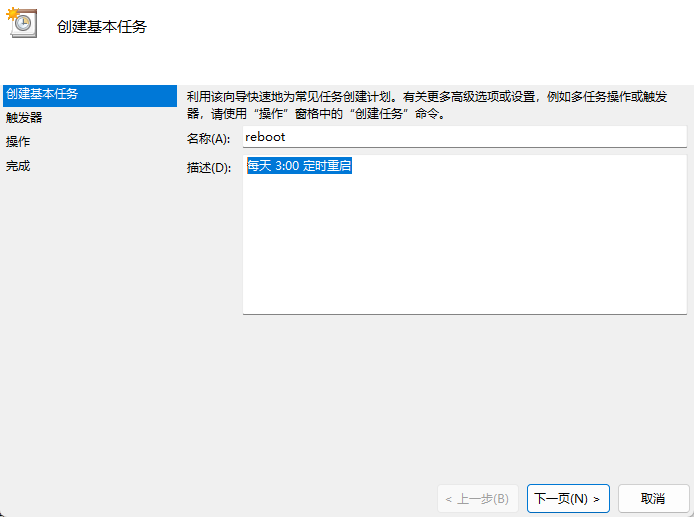


shutdown 相关参数，

```bash
shutdown /help
/r         完全关闭并重启计算机
/t xxx     将关闭前的超时时间设置为 xxx 秒。
               有效范围是 0-315360000 (10 年)，默认值为 30。
               如果超时期限大于 0，则 /f 参数为
               /f 参数。

程序或脚本：shutdown
参数：/r /t 0
```

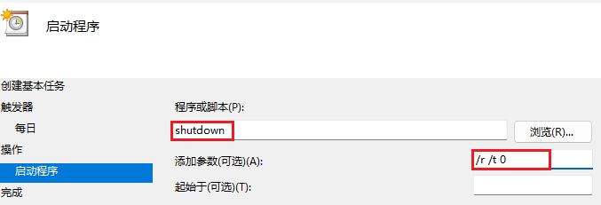

记得勾选 `打开属性框`，进行进一步的配置，

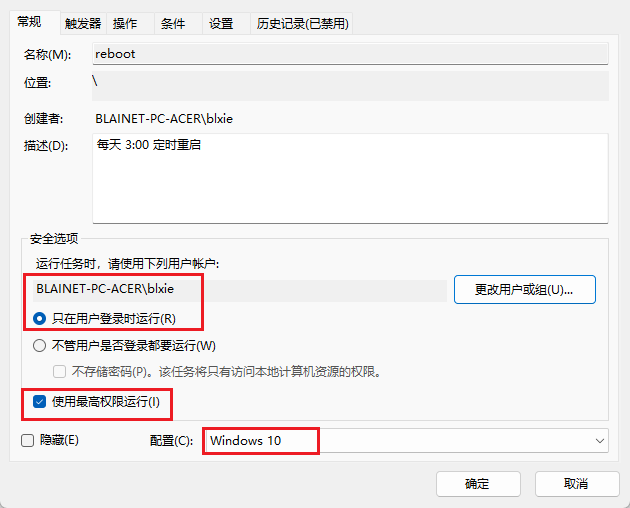


# 网络设置

## 手动更改适配器名称

> - https://www.boydata.com/post/218.html


## 设置静态 IP

> - [网速变慢？你可能需要先设置好 DNS | 科普 - 少数派](https://sspai.com/post/42125)


注意，校园网不支持手动更改 IP/DNS，

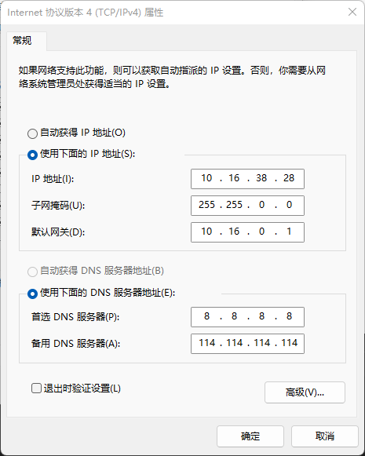


## `DNS` 设置

更改适配器设置，

```ini
119.29.29.29
8.8.8.8
```


## MAC 地址修改

方法1、2 修改之后可能并不会生效，但 `TMAC` 修改后一定有效，`TMAC` 的原理也是通过修改注册表实现的。

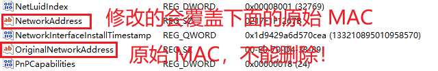

### 1、手动修改

> - 理论解析：https://blog.csdn.net/rainharder/article/details/45025147
> - 在线生成随机的 MAC 地址：https://www.lddgo.net/network/random-mac

修改网络适配器的属性，

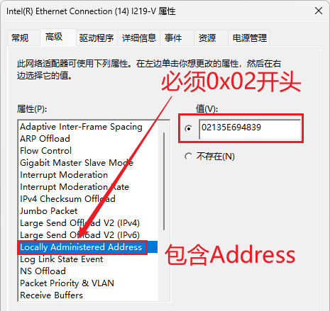

修改之后会断开网络，需要重新登录连接网络！


### 2、修改注册表

> - https://developer.aliyun.com/article/232839

找到适配器设置，

```bash
HKEY_LOCAL_MACHINE\SYSTEM\CurrentControlSet\Control\Class\{4d36e972-e325-11ce-bfc1-08002be10318}
```

每个以 `00` 开头的表示一个网络适配器的配置，项目中的  `DriverDesc` 标识了网卡的名称，

找到要设置的网卡，然后在配置中添加新的 `字符串` 配置条目，设置其值为 `随机生成的 MAC 地址`。


### 3、TMAC 工具

> - [免费MAC地址更改器Technitium MAC Address Changer_allway2的博客-CSDN博客](https://blog.csdn.net/allway2/article/details/106222295)
> - [Technitium MAC Address Changer | A Freeware Utility To Spoof MAC Address Instantly](https://technitium.com/tmac/)
> - [无线网卡mac地址修改_无线网卡改不了mac地址_q1063823095的博客-CSDN博客](https://blog.csdn.net/q1063823095/article/details/78657853) 通过注册表直接复制 NetworkAddress 项下的所有条目
> - [Win10系统如何修改无线MAC地址的几种方法_win10修改无线mac地址的方法_Lucifer…的博客-CSDN博客](https://blog.csdn.net/weixin_38795242/article/details/106792672) ctrl + f 直接搜 WLAN 的名称

直接解决方案：使用 TMAC 工具！

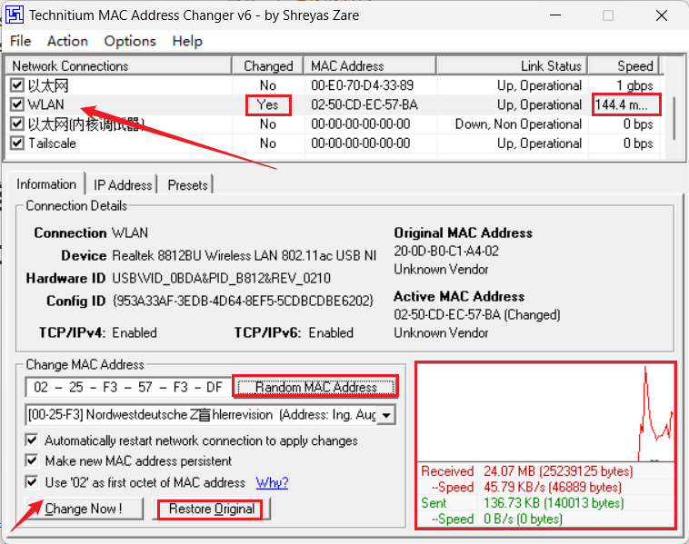


## 静态 IP 地址设置

```powershell
ipconfig /all

无线局域网适配器 WLAN:

   连接特定的 DNS 后缀 . . . . . . . :
   描述. . . . . . . . . . . . . . . : Realtek 8812BU Wireless LAN 802.11ac USB NIC
   物理地址. . . . . . . . . . . . . : 20-0D-B0-C1-A4-02
   DHCP 已启用 . . . . . . . . . . . : 是
   自动配置已启用. . . . . . . . . . : 是
   IPv6 地址 . . . . . . . . . . . . : 2409:8760:1e81:10::2:d66e(首选)
   获得租约的时间  . . . . . . . . . : 2023年4月25日 15:59:15
   租约过期的时间  . . . . . . . . . : 2023年4月28日 15:59:14
   本地链接 IPv6 地址. . . . . . . . : fe80::6655:aa82:4f56:6c4b%20(首选)
   IPv4 地址 . . . . . . . . . . . . : 10.20.52.210(首选)
   子网掩码  . . . . . . . . . . . . : 255.255.0.0
   获得租约的时间  . . . . . . . . . : 2023年4月25日 16:05:51
   租约过期的时间  . . . . . . . . . : 2023年4月28日 16:05:48
   默认网关. . . . . . . . . . . . . : fe80::9203:25ff:fe52:a8f9%20
                                       10.20.0.1
   DHCP 服务器 . . . . . . . . . . . : 10.20.0.1
   DHCPv6 IAID . . . . . . . . . . . : 505417136
   DHCPv6 客户端 DUID  . . . . . . . : 00-01-00-01-2B-80-D9-38-00-E0-70-D4-33-89
   DNS 服务器  . . . . . . . . . . . : 2001:da8:c807:20:202:202:32:33
                                       2001:da8:c807:20:202:202:32:34
                                       202.202.32.34
                                       202.202.32.33
   TCPIP 上的 NetBIOS  . . . . . . . : 已启用
```


## WiFi 信道频段

> - [(2条消息) 5G Wifi频段及信道介绍_5g信道_VirtuousLiu的博客-CSDN博客](https://blog.csdn.net/luohuatingyusheng/article/details/103572069)
> - [(2条消息) WIFI 2.4G及5G信道一览表_wifi 2,4g有多少频谱_R-QWERT的博客-CSDN博客](https://blog.csdn.net/weixin_44498318/article/details/118017406)
> -

4G 频段，

```

```


# 软件工具

## Nushell


## 终端工具 gitbash + zsh

> - [Windows 通过 Git Bash 配置 Oh My Zsh - Seepine's Blog](https://www.seepine.com/git/oh-my-zsh/)
> - [Conda in Windows under MSYS2 and Zsh line ending problems · Issue #9922 · conda/conda](https://github.com/conda/conda/issues/9922#issuecomment-1361695031)

### 1、安装 GitBash

### 2、安装 zsh

zsh 下载安装地址：[Package: zsh - MSYS2 Packages](https://packages.msys2.org/package/zsh?repo=msys&variant=x86_64)

解压后把 `etc | usr` 直接复制到 Git 的安装目录下，


把 `zsh` 设置为默认终端，

```bash
vim ~/.bashrc

######
if [ -t 1 ]; then
  exec zsh
fi

# coding
export LANG = "zh_CN.UTF-8"
export LC_ALL = "zh_CN.UTF-8"
```


### 3、安装 oh-my-zsh

直接命令安装，

```bash
# export https_proxy=http://10.16.92.115:10809
sh -c "$(curl -fsSL https://raw.githubusercontent.com/ohmyzsh/ohmyzsh/master/tools/install.sh)"
```

配置 `conda`，插件等，

> - [How to Install Zsh/ zsh-autosuggestions/ oh-my-zsh in Linux - Varun Kumar Manik - Medium](https://varunmanik1.medium.com/how-to-install-zsh-zsh-autosuggestions-oh-my-zsh-in-linux-65fa01cc038d)
> - [command line - chsh always asking a password , and get `PAM: Authentication failure` - Ask Ubuntu](https://askubuntu.com/questions/812420/chsh-always-asking-a-password-and-get-pam-authentication-failure) 如果 `chsh` 出错，就参考这个，

```bash
## oh-my-zsh 插件
# zsh-autosuggestions
git clone https://github.com/zsh-users/zsh-autosuggestions ${ZSH_CUSTOM:-~/.oh-my-zsh/custom}/plugins/zsh-autosuggestions
# zsh-syntax-highlighting
git clone https://github.com/zsh-users/zsh-syntax-highlighting.git ${ZSH_CUSTOM:-~/.oh-my-zsh/custom}/plugins/zsh-syntax-highlighting

conda init zsh
```

`conda init zsh` 会自动在 `.zshrc` 中生成 conda 初始化配置，需要修改以下配置为，

```bash
# >>> conda initialize >>>
# !! Contents within this block are managed by 'conda init' !!
export PYTHONIOENCODING=UTF-8
eval "$('/d/Dev/env/miniconda3/Scripts/conda.exe' 'shell.zsh' 'hook' | sed -e 's/"$CONDA_EXE" $_CE_M $_CE_CONDA "$@"/"$CONDA_EXE" $_CE_M $_CE_CONDA "$@" | tr -d \x27\\r\x27/g')"
# <<< conda initialize <<<
```


自定义 `~/.zshrc`，

首先更改，

```bash
# plugins=(git) 更改为
plugins=(git zsh-autosuggestions zsh-syntax-highlighting)
```

然后，直接复制到该目录下增加以下内容，然后 `source ~/.zshrc` 应用修改，

```bash
## <<<<<<<<<<<<<<<<<<<<<<<<<<<<<<<<<<<<<<<<<<<<<<<<<<<<<<<<<<<<<<<<<<<<<<<< ##
## 将 CUDATOOLKIT 的安装路径添加到系统变量中，使用 nvcc -V 查看是否配置成功 ##
## <<<<<<<<<<<<<<<<<<<<<<<<<<<<<<<<<<<<<<<<<<<<<<<<<<<<<<<<<<<<<<<<<<<<<<<< ##

# 创建软链接：sudo ln -s /usr/local/cuda-11.x /usr/local/cuda
# 好处是更改cudatoolkit版本时，只需要修改软链接的指向，不用每次都重新修改.bashrc
export CUDA_HOME=/usr/local/cuda

# 不使用软链接时：只需要将CUDA_HOME设置为cudatoolkit安装的路径
# 确保新添加的环境放在原始环境的最前面，这样source ~/.basrc才能生效
export PATH="$CUDA_HOME/bin:$PATH"  # 使用引号确保有特殊含义的字符成为普通字符
export LD_LIBRARY_PATH="$CUDA_HOME/lib64:$LD_LIBRARY_PATH"
export LD_LIBRARY_PATH="/usr/lib/x86_64-linux-gnu:$LD_LIBRARY_PATH"

## <<<<<<<<<<<<<<<<<<<<<<<<<<<<<<<<<<<<<<<<<<<<<<<<<<<<<<<<<<<<<<<<<<<<<<<< ##
## <<<<<<<<<<<<<<<<<<<<<<<<<<<<<<<<<<<<<<<<<<<<<<<<<<<<<<<<<<<<<<<<<<<<<<<< ##

# some more ls aliases
alias ll='ls -alF'
alias la='ls -A'
alias l='ls -CF'


function proxy_on() {
    #local host_addr="$1"
    #local host_port="$2"
    local host_addr=100.127.128.1
    local host_port=7890
    export http_proxy="http://$host_addr:$host_port"
    export https_proxy="http://$host_addr:$host_port"
    echo -e "Terminal proxy on."
    proxy_chk
}

function proxy_off(){
    unset http_proxy
    unset https_proxy
    echo -e "Terminal proxy off."
}
function proxy_chk(){
    curl -I www.google.com --connect-timeout 5
}

alias zbp='ps -ax -ostat,ppid,pid,user,cmd,command | grep -e "^[Zz+]" | column -t'

## for tmux
alias tnew='tmux new -s'
alias tls='tmux ls'
alias td='tmux detach'
alias ta='tmux attach -t'
alias tkill='tmux kill-session -t'

## for charset
export LANG="zh_CN.UTF-8"
export LC_ALL="zh_CN.UTF-8"
```

最后，应用修改，

```bash
source ~/.zshrc
```


### 4、pacman 工具包完善

更加贴合 Linux 使用体验，

> - [Windows 下为 Git Bash 终端配置 pacman 和 zsh](https://www.lazychan.com/archives/windows-xia-wei-git-bash-zhong-duan-pei-zhi-pacman-he-zsh)

注意，需要，

```bash
sed -i "s#https\?://mirror.msys2.org/#https://mirrors.tuna.tsinghua.edu.cn/msys2/#g" /etc/pacman.d/mirrorlist*

# 重启终端

pacman-key --init
pacman-key --populate msys2
pacman -Sy
pacman -S --dbonly pacman # 如有错误信息执行此行再次执行 pacman -Sy

pacman -S gettext
pacman-key --populate msys2

pacman -S --dbonly base-devel
pacman -S --dbonly net-tools iproute2
```


### 应用

vscode 设置默认的终端为 gitbash


## Hack

> - [HackTricks | Chinese - Ht | HackTricks](https://book.hacktricks.xyz/v/cn)
> -


## x64tools

> - [Download 64-bit (x64) utilities package for Windows](https://www.nirsoft.net/x64_download_package.html)
> - [不用破解注册，也许可以永久试用订阅式的 Axure RP 10 软件 | Ephen‘s Blog](https://ephen.me/2023/Reg-Axure10/)

直接使用 RunAsDate 找到要破解的软件，使用其来启动运行即可。


## 文件系统相关

### 压缩工具

Bandzip

Nanazip


### 磁盘

WizTree

CrystalDiskInfo


## 视频图像

### Potplayer


### OBS

**直播推流**

> - [如何用OBS直播推流(详细教程) - 知乎](https://zhuanlan.zhihu.com/p/648993725)
> - [superconvert/smart_rtmpd: RTMP server, smart, compact, high performance(c, c++), high concurrency, easy to maintain, easy to deploy, (supports multiple operating systems Windows and Linux, ARM, FreeBSD)](https://github.com/superconvert/smart_rtmpd)
> - [只需三分钟，即可轻松搭建流媒体服务器自己搞直播！支持OBS Studio、XSplit等流媒体文件，-CSDN博客](https://blog.csdn.net/qq_28768477/article/details/134259539) 关键词：windows直播视频流
> - [ultralytics/ultralytics/data/loaders.py at 7451ca1f541f502f7df1c500a2f5f60fc35a0a84 · ultralytics/ultralytics](https://github.com/ultralytics/ultralytics/blob/7451ca1f541f502f7df1c500a2f5f60fc35a0a84/ultralytics/data/loaders.py#L61) 代码结构参考

1、相关重要设置，数据来源，


2、直播推流设置，

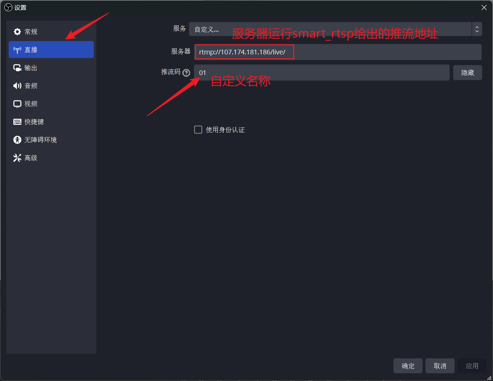


3、参数修改，优化推流速度（关键词：OBS降低推流延迟），

> - [OBS超低延迟直播参数设置 - 知乎](https://zhuanlan.zhihu.com/p/337147503)

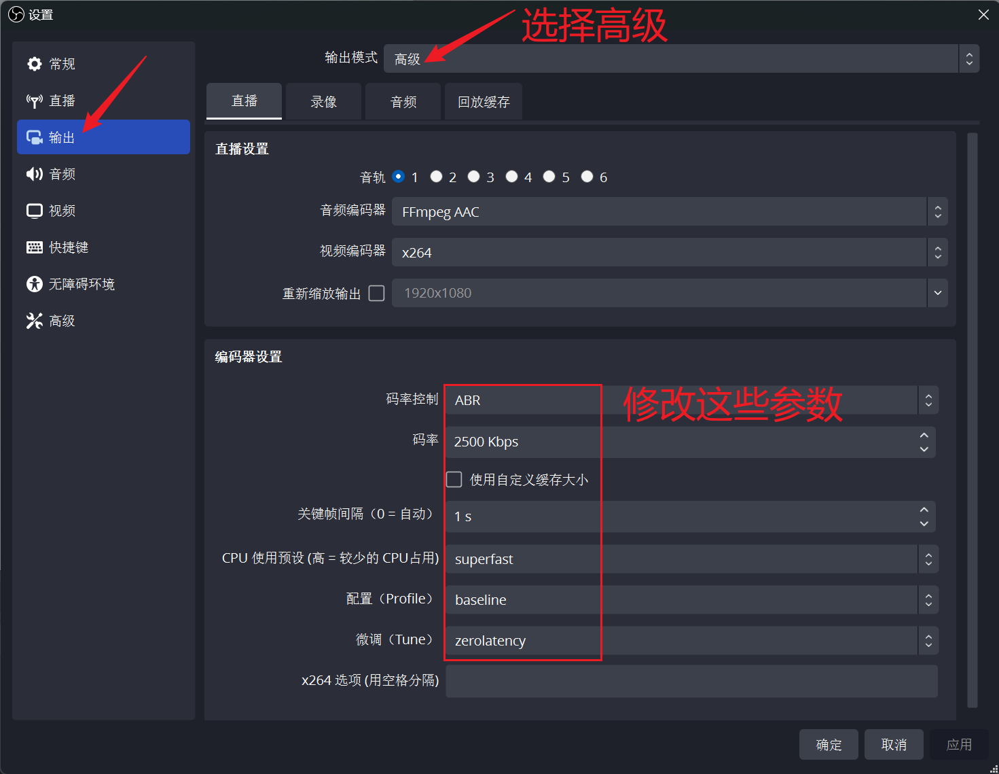


相关配置命令，

```bash
## Linux 推流 server 需要开放端口
iptables -I INPUT -p tcp --dport 1935 -j ACCEPT
iptables -I INPUT -p tcp --dport 8080 -j ACCEPT

## OBS 连接的地址
rtmp://192.168.110.61/live/
rtmp://100.106.90.14/live/
rtmp://107.174.181.186/live/

## 客户端连接地址
rtmp://107.174.181.186/live/01
http://192.168.110.61:8080/live/01.m3u8
```


有关第 2 步中的推流服务器，如果使用本地的资源，直接在本地下载安装 `smart_rtmp`，然后参考第三个 CSDN 链接，运行配置，重要步骤截图如下，

1、安装解压得到 `smart_rtmp Windows` 版本

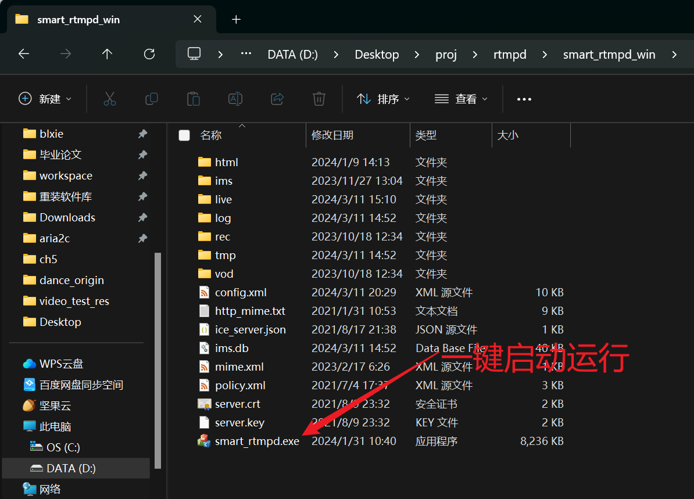

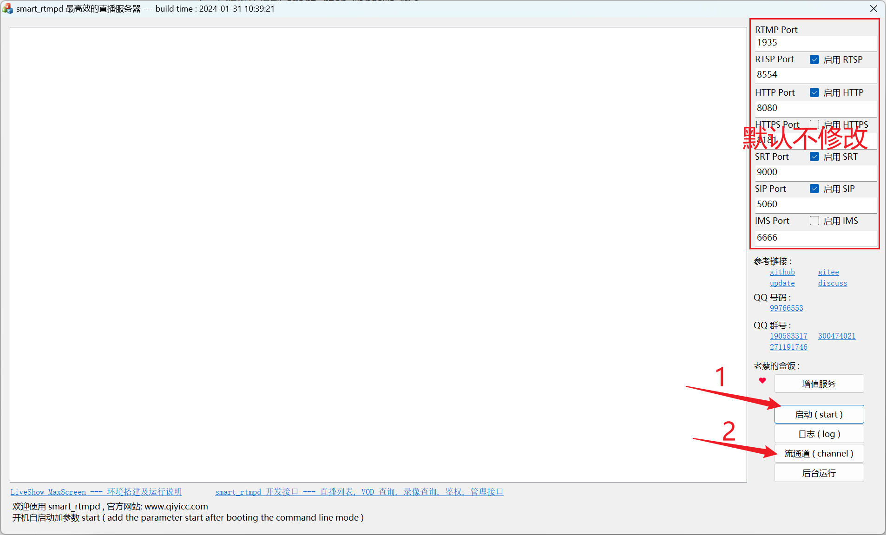

如果启动失败，看一下 dock 栏是否打开了多个客户端，运行多次导致了端口被占用的情况，只保留一个，其余的退出，然后点击运行即可。

其中，步骤 2 只有当OBS点击开始直播，并且显示连接成功时才会进入成功，该界面主要显示客户端连接的流的地址信息，比如，


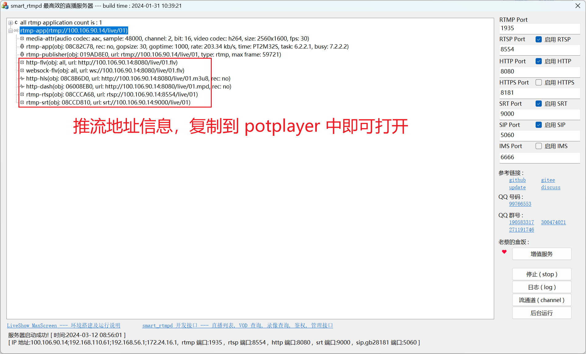


如果不是使用本地作为推流服务器，而是使用公网服务器以便其他用户可以访问，则需要使用一台具有公网 IP 的服务器，安装 `smart_rtmp`，比如 `ubuntu`，只需要将 `c...` 版本的上传上去即可，主要是协程相比多线程更加适合当前场景，具体可以问下 `kimi`。

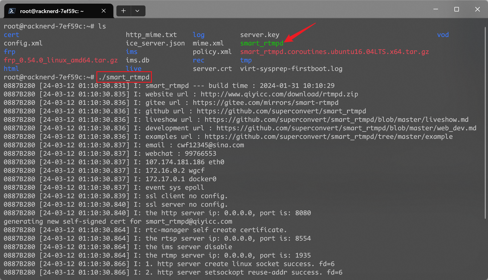

其他操作差不多，

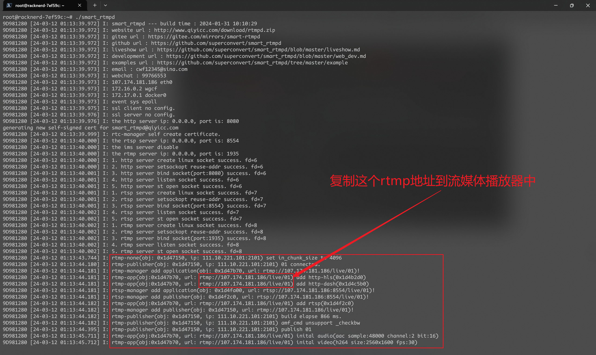


## 下载工具

> - [Windows包管理器Scoop&Winget_windows 包管理器-CSDN博客](https://blog.csdn.net/sorcererr/article/details/131147319)

==算了，不折腾了，还是优先使用 scoop，不要使用 winget 吧，winget问题比较多，无法使用代理，安装速度满，还无法全局更改默认安装路径！==

### winget

> - [如何使用 winget 包管理器：搜索、安装、导入导出和更换国内源等](https://www.sysgeek.cn/windows-winget/)
> - [【干货】Windows软件包管理器（WinGet）最实用教程 - 知乎](https://zhuanlan.zhihu.com/p/659515299)
> - [Winget包管理器最新安装使用 - fortuneju - 博客园](https://www.cnblogs.com/fortuneju/p/17840730.html)，经测试，无用
> - [【干货】Windows软件包管理器（WinGet）最实用教程 - 知乎](https://zhuanlan.zhihu.com/p/659515299)

Windows默认的包管理工具，和 `pacman/apt/yum` 类似，

```bash
## 添加环境变量，更改默认安装位置，默认安装在 C:\Programe Files 下
# 这种方式无效，还是老老实实使用 -l 选项吧！
setx WINGET_INSTALL_ROOT "D:/App/Winget"
# 以下也是如此
winget settings
# ---
{
    "$schema": "https://aka.ms/winget-settings.schema.json",
    // For documentation on these settings, see: https://aka.ms/winget-settings
    // "source": {
    //    "autoUpdateIntervalInMinutes": 5
    // },
    "installBehavior": {
        "defaultInstallRoot": "D:/App/Winget"
    },
    "source": {
        "manual": {
            "location": "D:/App/Winget"
        }
    }
}

# 有效，使用该方法！
winget install xxx --install-location "D:/App/Winget"
```


### scoop

> - [Scoop](https://scoop.sh/)
> - [ScoopInstaller/Install: 📥 Next-generation Scoop (un)installer](https://github.com/ScoopInstaller/Install#readme)
> - [使用Scoop + 版本管理器科学地管理你的开发环境！ - JOYK Joy of Geek, Geek News, Link all geek](https://www.joyk.com/dig/detail/1671699534890440)
> - [Scoop - 最好用的 Windows 包管理器 - P3TERX ZONE](https://p3terx.com/archives/scoop-the-best-windows-package-manager.html)，代理相关设置

首先使用官方命令，

```powershell
Set-ExecutionPolicy -ExecutionPolicy RemoteSigned -Scope CurrentUser
Invoke-RestMethod -Uri https://get.scoop.sh | Invoke-Expression
```

如果执行不成功，去，


注意使用 github 里面的 `Advanced Installation`，手动指定

- 安装路径，和
- scoop 下载的程序的路径，

```powershell
## 1、下载安装脚本
irm get.scoop.sh -Proxy 'http://127.0.0.1:10809' -outfile 'install.ps1'

## 2、使用脚本安装，注意参数配置
.\install.ps1 -ScoopDir 'D:\App\Scoop' -ScoopGlobalDir 'D:\ProgramData\Scoop' -Proxy 'http://127.0.0.1:10809'

## 设置 scoop 的代理
scoop config proxy localhost:10809
```


scoop 升级 pwsh 的问题，

> - [powershell - Update pwsh with Scoop? - Stack Overflow](https://stackoverflow.com/questions/72282196/update-pwsh-with-scoop)
> - [PowerShell7.X的安装与美化_powershell 7-CSDN博客](https://blog.csdn.net/qq_40750972/article/details/120927076)

由于 scoop 本身就依赖于 pwsh.exe，所以要间接指定使用什么执行 scoop，而不是直接执行 `scoop update`，

```powershell
# 更新策略
Get-ExecutionPolicy -List
Set-ExecutionPolicy Bypass -Scope Process -Force

Get-Command pwsh
powershell -Command scoop update pwsh
```


### IDM

> - 破解：[Latest Crack or Patch Free Download links](https://www.crackingcity.com/)
> - [如何解决IDM无法下载受保护数据以及ts转格式问题_哔哩哔哩_bilibili](https://www.bilibili.com/video/BV1fA411Y7Lx/?t=5&spm_id_from=333.1007.seo_video.first&vd_source=f01c4b322443fbcb202e2abcaae29044)
>   - [Releases · nilaoda/N_m3u8DL-CLI](https://github.com/nilaoda/N_m3u8DL-CLI/releases)
>   - [IDM无法下载.ts文件解决方案_ts下载重试次数超过限制,下载失败!_极客代码-极致生活的博客-CSDN博客](https://blog.csdn.net/qq_39677429/article/details/116167304)
> - https://www.bilibili.com/video/BV13M411k7i8/


### 猫抓 & m3u8

> - [Releases · xifangczy/cat-catch](https://github.com/xifangczy/cat-catch)

GUI 工具下载设置，

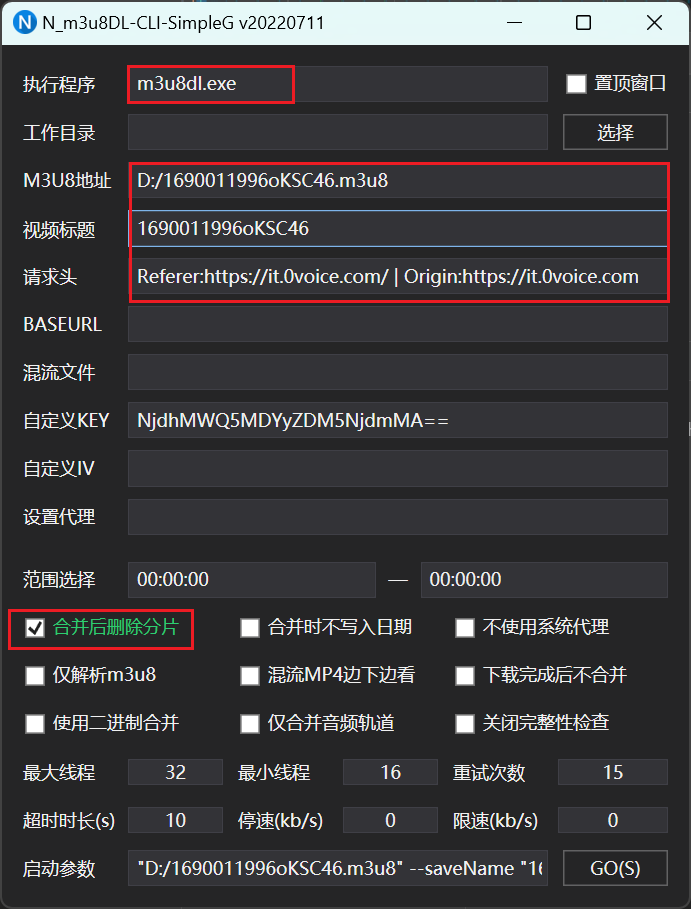

#### 小鹅通视频下载方法

> - [小鹅通视频怎么保存-掘金](https://juejin.cn/s/%E5%B0%8F%E9%B9%85%E9%80%9A%E8%A7%86%E9%A2%91%E6%80%8E%E4%B9%88%E4%BF%9D%E5%AD%98)
> - [某鹅通m3u8视频JS获取解密Key的过程分析](https://www.52pojie.cn/thread-1689801-1-1.html)
> - [你真的会用 Chrome-devtools 吗？ - 掘金](https://juejin.cn/post/6844904078166720525)
> - [小鹅通平台下载，添加请求头，baseurl，自定义key，iv均无用](https://github.com/nilaoda/N_m3u8DL-CLI/issues/644)
> - [破解某网课的m3u8文件的key加密_m3u8 key-CSDN博客](https://blog.csdn.net/qq_59848320/article/details/122878555)
> - [m3u8及TS文件下载解密：m3u8文件下载及分析（二）-CSDN博客](https://blog.csdn.net/cquptvlry/article/details/94174976)
> - [[ffmpeg]如何使用ffmpeg下载分段并加密的m3u8视频流_酷播官方网站](https://www.cuplayer.com/player/PlayerCode/FFmpeg/2017/0419/2873.html)
> - [使用 ffmpeg 下载加密 ts 视频流 | Lidong's blog](https://lidong.me/ffmpeg-download-ts/)
> - 一定要记得在请求头添加 Refer 或者 Origin：[Issue #129 · nilaoda/N_m3u8DL-CLI](https://github.com/nilaoda/N_m3u8DL-CLI/issues/129)

==最简单的方法：手机下载小鹅通，然后在手机上登录缓存，然后上传到电脑！==

更新：该方法有问题，缓存文件无法找到！还是得使用下面的方法，`F12` 将设备修改为 `IPhone` 之后，然后使用 猫抓 插件就可以直接进行下载！（注意选择清晰度），后面的操作不需要了，只需要知道有这个功能就好。

更换一个浏览器也是值得尝试的方法！（QQ浏览器！）

注意：直接使用 猫抓 扩展启动下载可能会因为文件名的问题（`title`）导致无法给文件命名成功，导致无法保存，这个时候直接使用 m3u8 的命令行下载工具进行下载即可！

修改猫抓的下载参数：

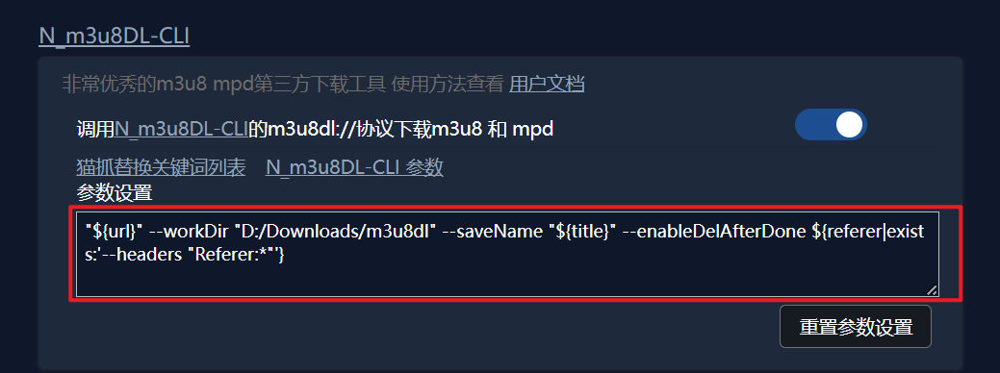

```json
"${url}" --workDir "D:/Downloads/m3u8dl" --saveName "${title}" --enableDelAfterDone ${referer|exists:'--headers "Referer:*"'}
```


下载时需要注意：

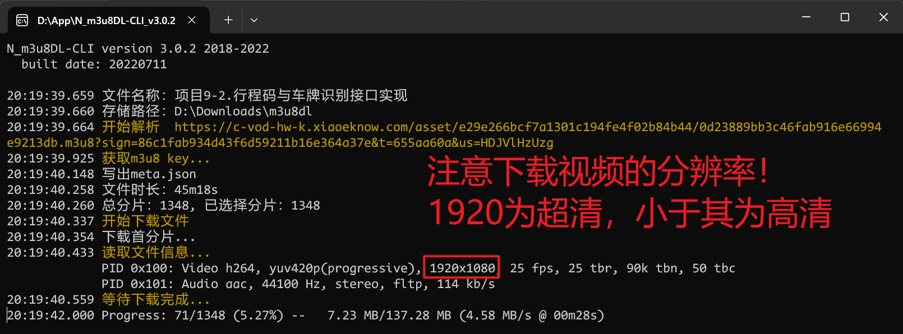

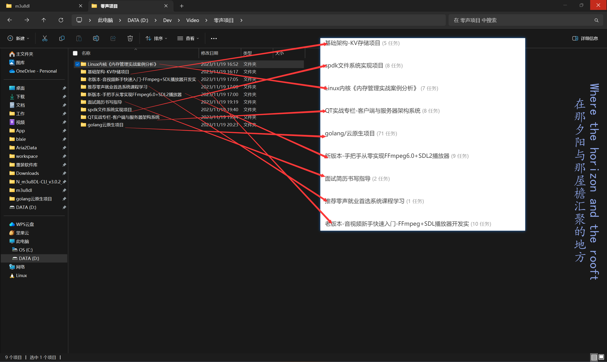


正式下载：

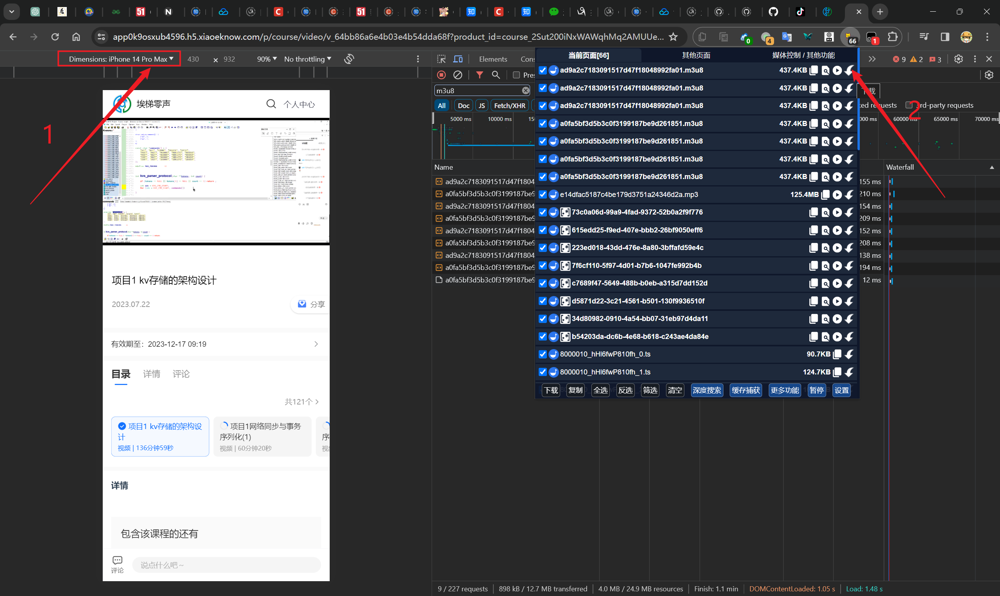


**一定一定记得切换到 Phone 模式，PC 模式加密无法下载！要破解密码也很麻烦！**

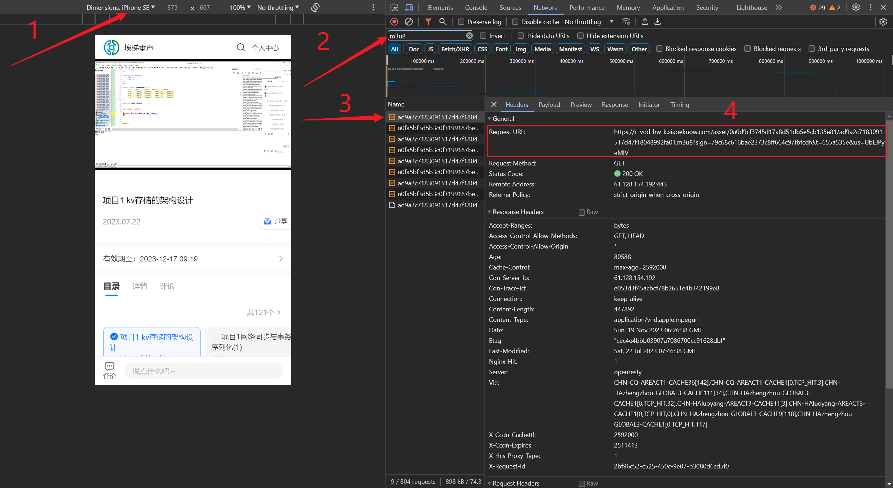

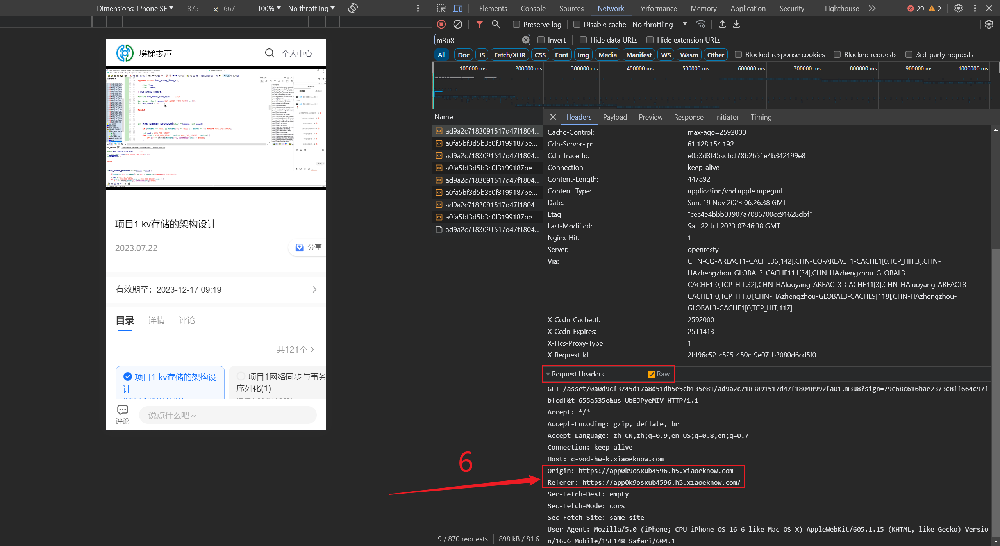

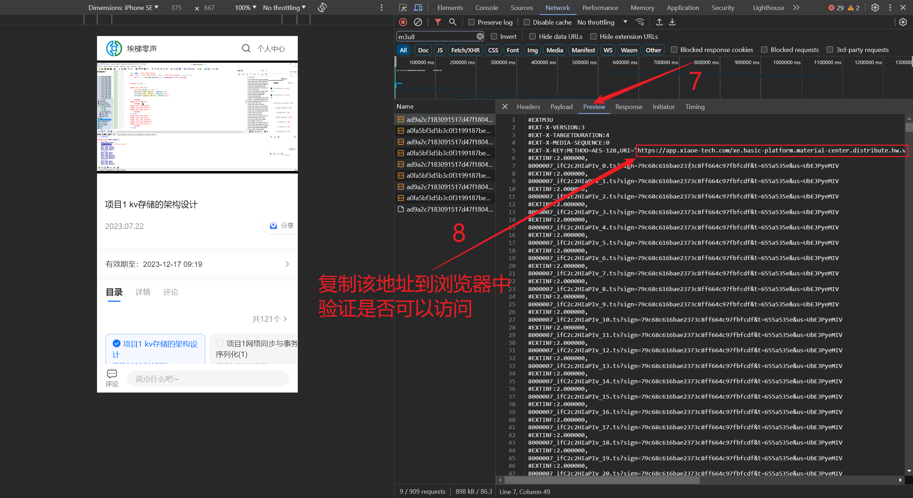


浏览器验证，


打开 m3u8 下载器进行下载，

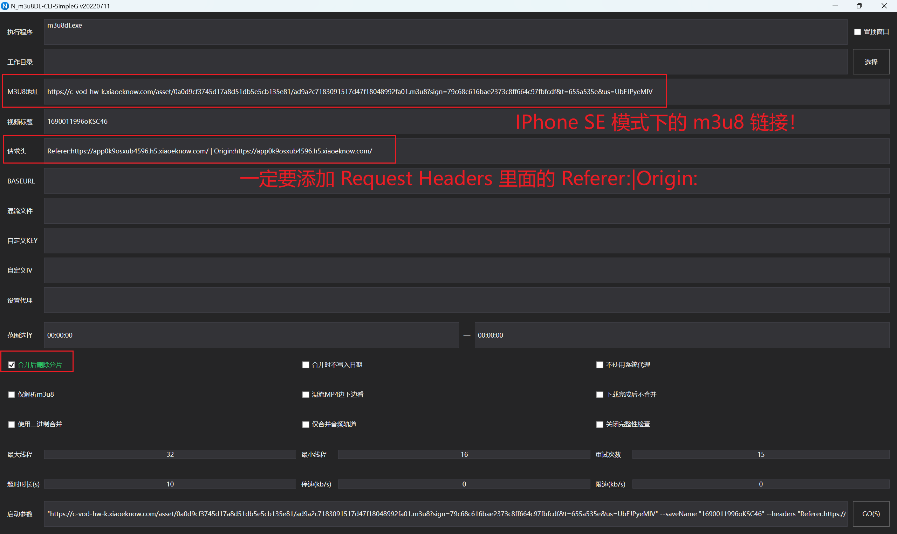


### qBittorrent

> [qBittorrent download latest version](https://www.fosshub.com/qBittorrent.html?dwl=qbittorrent_4.4.5_x64_setup.exe)

https://www.qbittorrent.org/ 无法访问！

[解决 qBittorrent 无速度：添加自定义 Tracker - 知乎](https://zhuanlan.zhihu.com/p/89430684)


## Virtual Box

> - [virtualbox设置共享文件夹代替sftp同步代码 - leezhxing - 博客园](https://www.cnblogs.com/leezhxing/p/5678071.html)

引导安装的过程中记得取消 `自动安装`！否则没有自定义安装引导过程，默认安装图形化的界面！

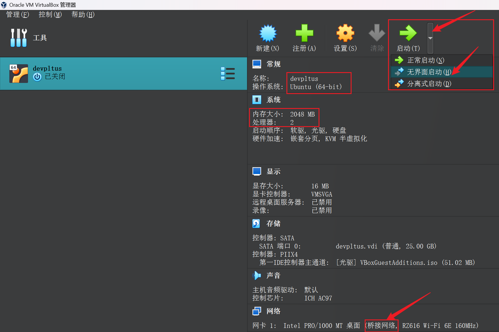


### 分区扩容

> - [解决 Linux /dev/mapper/ubuntu--vg-ubuntu--lv 磁盘空间不足的问题](https://blog.csdn.net/Fly_1213/article/details/105142427)

运维中经常会考到，

```bash
df -h
vgdisplay

## 具体操作
# 增大或减小至指定容量（不能超过 vgdisplay FREE）
lvextend -L 10G /dev/mapper/ubuntu--vg-ubuntu--lv
lvextend -L +10G /dev/mapper/ubuntu--vg-ubuntu--lv
lvreduce -L -10G /dev/mapper/ubuntu--vg-ubuntu--lv
# 按百分比扩容，使用这个
lvresize -l  +100%FREE /dev/mapper/ubuntu--vg-ubuntu--lv
# 应用调整，这步才是起作用的操作！
resize2fs /dev/mapper/ubuntu--vg-ubuntu--lv
```


### 手动安装增强工具

> - 手动安装增强工具：https://blog.csdn.net/THMAIL/article/details/107560777

首先需要下载增强包，

一般开机自动挂载在，

```bash
/dev/cdrom 或者 /media/cdrom | /media/sf_共享文件夹名 ？
# 查看挂载情况
df -h
sudo mount /dev/cdrom /mnt
cd /mnt
...

sudo mkdir -p /media/cdrom
sudo mount -t auto /dev/cdrom /media/cdrom/

sudo apt update & sudo apt upgrade
sudo apt install net-tools iputils-ping bzip2 gcc g++ cmake perl vim

## 依赖 gcc/bzip2/cmake/perl
cd /media/cdrom/
sudo sh VBoxLinuxAdditions.run

## 重启或者执行以下命令
sudo rcvboxadd reload
```


### 网络设置

> - https://www.cnblogs.com/xihong2014/p/14421856.html
> - https://www.cnblogs.com/mysticbinary/p/16595169.html
> - 这个帮助很大：[VirtualBox虚拟机网络设置-双机互通 - SXWZ - 博客园](https://www.cnblogs.com/sxwz/p/15491107.html)

#### NAT网络 + Host Only

> 通过设置静态 IP 搞定！

（1）新建一个 NAT网络

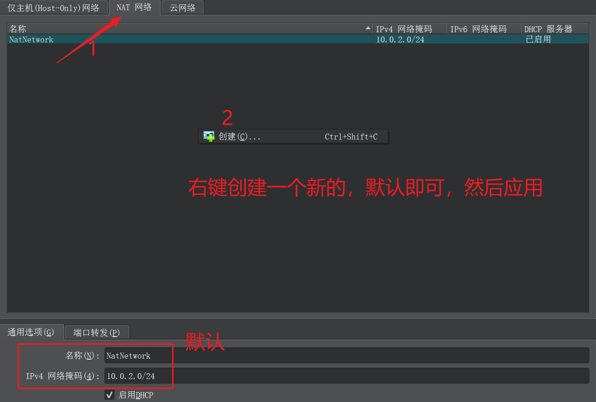


（2）设置 Host Only

将 DHCP 关闭（这里的 DHCP 控制的是主机的 虚拟IP），同时手动设置 IP

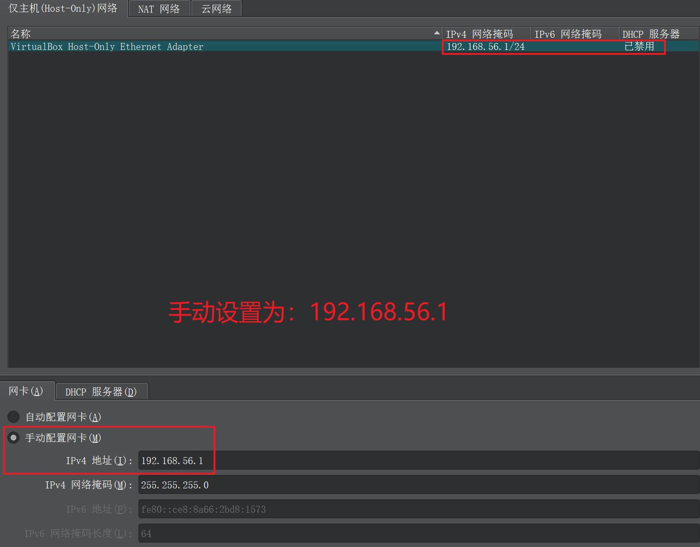


（3）启动虚拟机，配置虚拟机网络

Ubuntu 的网络配置文件为：`/etc/netplan/00-installer-config.yaml`

```yaml
# This is the network config written by 'subiquity'
network:
  ethernets:
    enp0s3:
      dhcp4: true
    enp0s8:
      #dhcp4: true
      addresses: [192.168.56.101/24] # ip addr
  version: 2
```

这里是一个更加详细的配置例子，实际使用上面的即可。

```yaml
network:
  version: 2
  renderer: networkd
  ethernets:
    enp0sX:
      addresses: [192.168.1.2/24]  # 设置IP地址和子网掩码
      nameservers:
        addresses: [8.8.8.8, 8.8.4.4]  # 设置DNS服务器地址
      routes:
        - to: 0.0.0.0/0  # 设置默认路由
          via: 192.168.1.1  # 设置网关地址
```

应用以上的配置，

```bash
sudo vim /etc/netplan/00-installer-config.yaml
sudo netplan apply
```


#### NAT + Host Only

> 问题：每次保存虚拟机状态退出后，再次启动会连接不上！转移到另外一种方案

两张网卡：网络桥接模式 + Host-Only 模式，

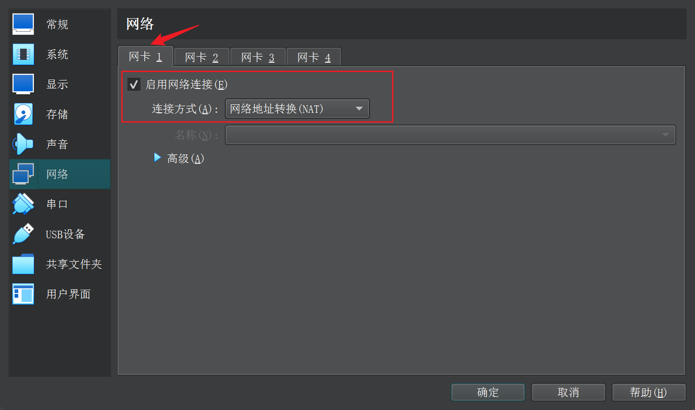


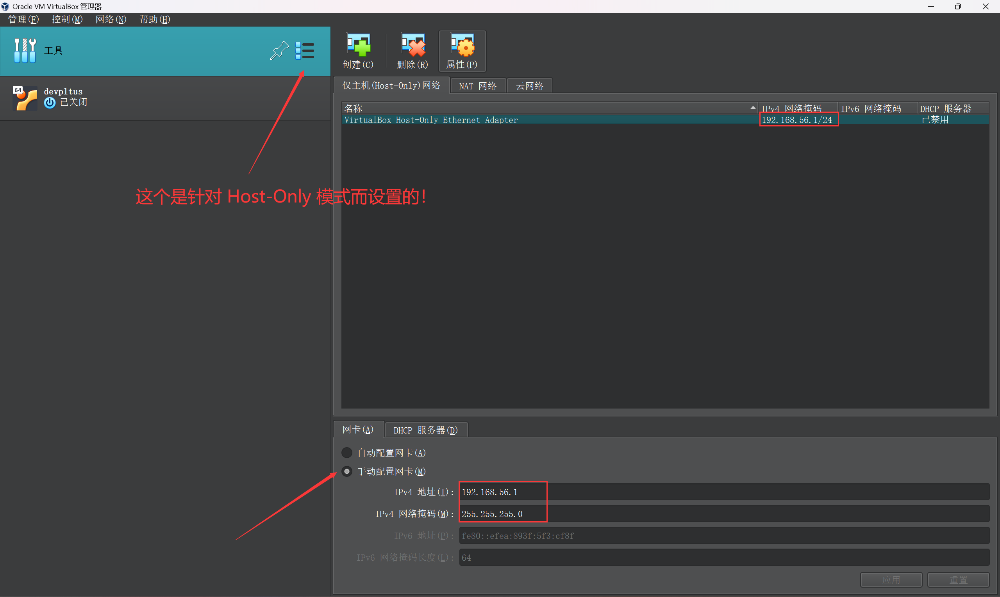

虚拟机网络设置，

```bash
ip a
## enp0s8 表示以太网
sudo ifconfig enp0s8 up
sudo vim /etc/netplan/00-installer-config.yaml

########
# This is the network config written by 'subiquity'
network:
  ethernets:
    enp0s3:
      dhcp4: true
    enp0s8:
      dhcp4: true
  version: 2
########

sudo netplan apply

ping -c 3 10.17.144.163
ping -c 3 www.baidu.com

ssh localhost
echo "ssh-rsa AAAAB3NzaC1yc2EAAAADAQABAAABgQDiPyR0sfp+i5VrTSwbocXXi+2oDWdfo7hZasgqPneA79S+Y8Npv+6xSdedV3pzG7wmjv0jEucJaaOP71Gq7ZnNF/jtxVlauSDjCzz8JDUfWGDEPO5Z/2YOJbg6UXwoHsF1ogffZK6rtQWZgJuqfqCig6acn2WRIcCnZB6JCRNcf/1SLtZitA57kcb1mQb5uF4urNrT/dj89OTNus7x+SBwzfB92ZkbBR4PwcZFYvRdQTZO0sn6VI3YM8HfA4/xobrgXKeox5K8yKmifnZdQOdwjcorls7gpPYULsDG94SLWNF6zHP/SW8M32MDwKwMWMU55Mbbvp1NUd+7hcnzGUsVfPA0GIILXfvkbNVt5PKCOkljxgogxrqy3SQufc+ijsfMCGFA/XsXbin9viz6+akXr9GIeFluieT1pPW84bG9TXMx0YRUZy7henZHHAwW8eh0ek3UJ29/RjC9nLpC5/W5fFXFt27u3Ei0WqTE1IcnWLUAwdzgXtudZZQU6+H5zi0=" > ~/.ssh/authorized_keys

## 虚拟机
Host vmus
    HostName 192.168.56.101
    User blainet
    Port 22

mkdir -p workspace/cpp
```


### 无界面启动/后台运行

分离式界面启动/无界面模式启动即可。

当需要显示的时候，退出时选择分离就可以在后台继续运行。

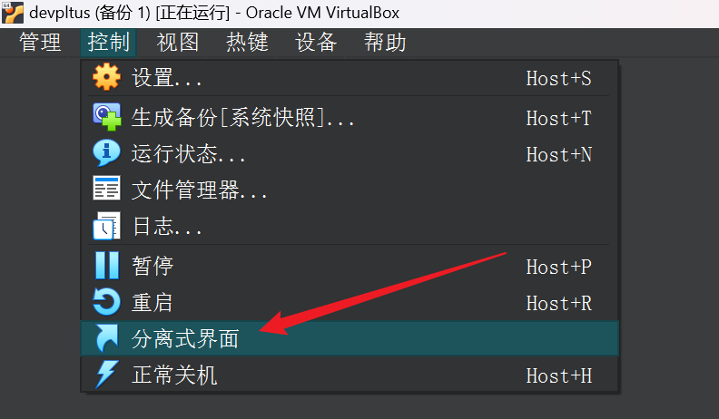


快速休眠：可以保存当前虚拟机的状态并退出；可以利用这个功能将其切换为后台运行，即下次启动的时候选择分离式启动或者后台启动。


> - 有效：[ubuntu20.04设置普通用户sudo不用输密码 | CAIJINBO](https://caijinbo.tech/2020/05/09/2020-05-10-ubuntu20.04%E8%AE%BE%E7%BD%AE%E6%99%AE%E9%80%9A%E7%94%A8%E6%88%B7sudo%E4%B8%8D%E7%94%A8%E8%BE%93%E5%AF%86%E7%A0%81/)
> - [Ubuntu 普通用户免 sudo 执行 root 权限命令_ubuntu 提升权限不用输 sudo](https://blog.csdn.net/weixin_37272286/article/details/120618693)
> - [ubuntu下实现免sudo给用户权限_ubuntu 免sudo-CSDN博客](https://blog.csdn.net/m0_57411216/article/details/123326008)
> - [虚拟机VirtualBox中Ubuntu和windows共享文件夹访问权限问题](https://blog.csdn.net/qq_34885615/article/details/109342140)
> - [VirtualBox 虚拟机共享文件夹普通用户没有访问权限](https://www.cnblogs.com/xikeguanyu/p/15755610.html)

添加到 `vboxsf` 用户组即可，重启虚拟机（终端中不知道如何注销，因此重启）

```bash
sudo visudo
# ALL=(ALL:ALL) ALL
# 表示默认5分钟后刚才输入的sodo密码过期，下次sudo需要重新输入密码
blainet ALL=(ALL:ALL) ALL
blainet ALL=(ALL:ALL) NOPASSWD:ALL # 不一定有效
blainet ALL=(ALL:ALL) NOPASSWD:/path/to/command # 特定命令
# ALL=(ALL:ALL) NOPASSWD:ALL
# 表示允许无时间限制的免输入密码，个人用户的使用一般是安全的
%sudo   ALL=(ALL:ALL) NOPASSWD:ALL # 一定有效

# 添加到 vboxsf 用户组
id # 查看用户信息
sudo usermod -aG vboxsf $(whoami)
或者
sudo adduser 当前用户名 vboxsf
sudo chown -R 用户名 文件夹
sudo chmod -R +rwx cpp/
```


### ERROR

> AMD vbox watchdog bug soft lockup - cpu#1 stuck for 22s

是 Virtual box 的问题，不是硬件的问题！

`Windows 内存诊断` 系统自带的内存检测工具，会花费比较多的时间；

`CrystalDiskInfo` 硬盘检测。


## 远程连接 ssh

被连接方（服务器）需要安装 sshd 服务

- Windows 操作系统

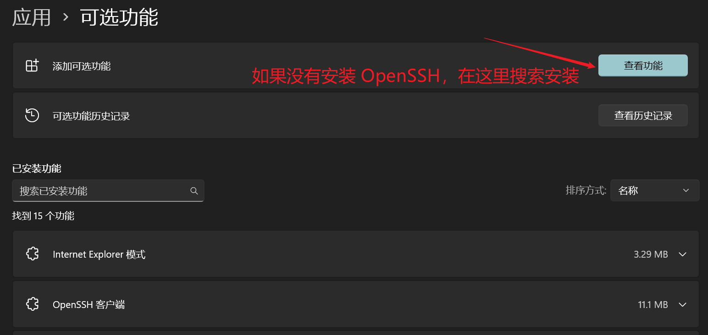

在设置里面进行安装，安装好之后启动，

```bash
net start sshd
net stop sshd
```


- Linux 操作系统

```bash
apt update
apt install openssh-client
apt install openssh-server

ps -ef | grep sshd
sudo /etc/init.d/ssh start
sudo /etc/init.d/ssh status
sudo /etc/init.d/ssh stop
```


## PowerShell

> - https://learn.microsoft.com/zh-cn/powershell/

```powershell
# 临时设置终端代理，一般设置 https 代理！
$env:HTTP_PROXY = "http://127.0.0.1:10809"
$env:HTTPS_PROXY = "http://127.0.0.1:10809"

winget search Microsoft.PowerShell
winget install --id Microsoft.Powershell --source winget
```

~~如果无法安装，在微软商店里面下载安装。~~

经测试，微软商店安装的 powershell 无法直接找到该路径！只能通过 `winget install` 进行安装，会自动添加到环境变量中？

如果无法卸载自带的 `Windows Powershell/command prompt` 配置文件，以管理员身份运行 `windows terminal`，然后执行卸载即可！如果想要重新添加，只需要新建，然后复制配置文件即可，把 `复制` 去掉就恢复了，

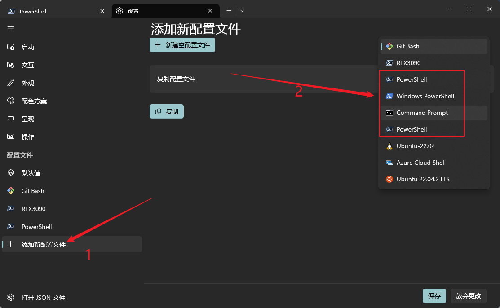

对于 `login2cqupt` 服务，如果无法立即生效，可能需要==重新启动该服务==！


## aria2

> - [Windows安装Aria2 - zhangyao2018 - 博客园](https://www.cnblogs.com/banxiancode/p/12604034.html)  仅作参考
> - [Aria2 安装和使用全教程_Ⅰ只小猫的博客-CSDN博客_aria2](https://blog.csdn.net/qq_55058006/article/details/115570993)  优先使用该方法
> - [Releases · aria2/aria2](https://github.com/aria2/aria2/releases)  安装 win-build-64bit 即可
> - [Releases · mayswind/AriaNg](https://github.com/mayswind/AriaNg/releases)  下载管理网页（有了浏览器插件就不需要该库了）
> - [你还在忍受龟速下载吗?--mac上使用aria2的最佳实践 - FreeBuf网络安全行业门户](https://www.freebuf.com/sectool/244962.html)
> - [aria2.conf/aria2.conf at master · P3TERX/aria2.conf](https://github.com/P3TERX/aria2.conf/blob/master/aria2.conf) aria2.conf 配置文件
> - [Aria2 安装使用 - 简书 (jianshu.com)](https://www.jianshu.com/p/affce44b1f6a) rpc-secret 的设置及作用
> - [Windows 懒人包下载 (aria2c.com)](http://aria2c.com/archiver/aria2.zip)
> - [(1条消息) 下载神器Aria2 + WebUI-Aria2 + 接管Chrome下载任务_aria2接管chrome下载_lalifeier的博客-CSDN博客](https://blog.csdn.net/Gushiyuta/article/details/100749521)

### 原始 conf

```yaml
## '#'开头为注释内容, 选项都有相应的注释说明, 根据需要修改 ##
## 被注释的选项填写的是默认值, 建议在需要修改时再取消注释  ##

## 文件保存相关 ##

# 文件的保存路径(可使用绝对路径或相对路径), 默认: 当前启动位置
dir=Aria2Data
log-level=warn
# 启用磁盘缓存, 0为禁用缓存, 需1.16以上版本, 默认:16M
disk-cache=32M
# 文件预分配方式, 能有效降低磁盘碎片, 默认:prealloc
# 预分配所需时间: none < falloc ? trunc < prealloc
# falloc和trunc则需要文件系统和内核支持
# NTFS建议使用falloc, EXT3/4建议trunc, MAC 下需要注释此项
file-allocation=falloc
# 断点续传
continue=true

## 下载连接相关 ##

# 最大同时下载任务数, 运行时可修改, 默认:5
max-concurrent-downloads=1
# 同一服务器连接数, 添加时可指定, 默认:1
max-connection-per-server=16
# 最小文件分片大小, 添加时可指定, 取值范围1M -1024M, 默认:20M
# 假定size=10M, 文件为20MiB 则使用两个来源下载; 文件为15MiB 则使用一个来源下载
min-split-size=10M
# 单个任务最大线程数, 添加时可指定, 默认:5
split=5
# 整体下载速度限制, 运行时可修改, 默认:0
#max-overall-download-limit=0
# 单个任务下载速度限制, 默认:0
#max-download-limit=0
# 整体上传速度限制, 运行时可修改, 默认:0
#max-overall-upload-limit=0
# 单个任务上传速度限制, 默认:0
#max-upload-limit=0
# 禁用IPv6, 默认:false
disable-ipv6=true

## 进度保存相关 ##

# 从会话文件中读取下载任务
input-file=aria2.session
# 在Aria2退出时保存`错误/未完成`的下载任务到会话文件
save-session=aria2.session
# 定时保存会话, 0为退出时才保存, 需1.16.1以上版本, 默认:0
save-session-interval=60

## RPC相关设置 ##

# 启用RPC, 默认:false
enable-rpc=true
# 允许所有来源, 默认:false
rpc-allow-origin-all=true
# 允许非外部访问, 默认:false
rpc-listen-all=true
# 事件轮询方式, 取值:[epoll, kqueue, port, poll, select], 不同系统默认值不同
#event-poll=select
# RPC监听端口, 端口被占用时可以修改, 默认:6800
#rpc-listen-port=6800

## BT/PT下载相关 ##

# BT监听端口, 当端口被屏蔽时使用, 默认:6881-6999
listen-port=51413
# 打开DHT功能, PT需要禁用, 默认:true
enable-dht=true
bt-enable-lpd=true
enable-peer-exchange=true

# 客户端伪装, PT需要
peer-id-prefix=-TR2770-
user-agent=Transmission/2.77
# 当种子的分享率达到这个数时, 自动停止做种, 0为一直做种, 默认:1.0
seed-ratio=0
# 强制保存会话, 话即使任务已经完成, 默认:false
# 较新的版本开启后会在任务完成后依然保留.aria2文件
#force-save=false
# BT校验相关, 默认:true
#bt-hash-check-seed=true
# 继续之前的BT任务时, 无需再次校验, 默认:false
bt-seed-unverified=true
# 保存磁力链接元数据为种子文件(.torrent文件), 默认:false
bt-save-metadata=true
bt-tracker=
```


### [github.conf](https://github.com/P3TERX/aria2.conf/blob/master/aria2.conf)

```yaml
# https://github.com/P3TERX/aria2.conf
# File name：aria2.conf
# Description: Awesome Aria2 configuration file
# Version: 2021.09.15
#
# Copyright (c) 2018-2021 P3TERX <https://p3terx.com>
#
# This is free software, licensed under the MIT License.
# See /LICENSE for more information.
#

## 文件保存设置 ##

# 下载目录。可使用绝对路径或相对路径, 默认: 当前启动位置
# dir=/root/Download
dir=Aria2Data

# 不进行证书校验
check-certificate=false

# 磁盘缓存, 0 为禁用缓存，默认:16M
# 磁盘缓存的作用是把下载的数据块临时存储在内存中，然后集中写入硬盘，以减少磁盘 I/O ，提升读写性能，延长硬盘寿命。
# 建议在有足够的内存空闲情况下适当增加，但不要超过剩余可用内存空间大小。
# 此项值仅决定上限，实际对内存的占用取决于网速(带宽)和设备性能等其它因素。
disk-cache=64M

# 文件预分配方式, 可选：none, prealloc, trunc, falloc, 默认:prealloc
# 预分配对于机械硬盘可有效降低磁盘碎片、提升磁盘读写性能、延长磁盘寿命。
# 机械硬盘使用 ext4（具有扩展支持），btrfs，xfs 或 NTFS（仅 MinGW 编译版本）等文件系统建议设置为 falloc
# 若无法下载，提示 fallocate failed.cause：Operation not supported 则说明不支持，请设置为 none
# prealloc 分配速度慢, trunc 无实际作用，不推荐使用。
# 固态硬盘不需要预分配，只建议设置为 none ，否则可能会导致双倍文件大小的数据写入，从而影响寿命。
file-allocation=falloc

# 文件预分配大小限制。小于此选项值大小的文件不预分配空间，单位 K 或 M，默认：5M
no-file-allocation-limit=64M

# 断点续传
continue=true

# 始终尝试断点续传，无法断点续传则终止下载，默认：true
always-resume=false

# 不支持断点续传的 URI 数值，当 always-resume=false 时生效。
# 达到这个数值从将头开始下载，值为 0 时所有 URI 不支持断点续传时才从头开始下载。
max-resume-failure-tries=0

# 获取服务器文件时间，默认:false
remote-time=true


## 进度保存设置 ##

# 从会话文件中读取下载任务
input-file=.aria2/aria2.session

# 会话文件保存路径
# Aria2 退出时或指定的时间间隔会保存`错误/未完成`的下载任务到会话文件
save-session=.aria2/aria2.session

# 任务状态改变后保存会话的间隔时间（秒）, 0 为仅在进程正常退出时保存, 默认:0
# 为了及时保存任务状态、防止任务丢失，此项值只建议设置为 1
save-session-interval=1

# 自动保存任务进度到控制文件(*.aria2)的间隔时间（秒），0 为仅在进程正常退出时保存，默认：60
# 此项值也会间接影响从内存中把缓存的数据写入磁盘的频率
# 想降低磁盘 IOPS (每秒读写次数)则提高间隔时间
# 想在意外非正常退出时尽量保存更多的下载进度则降低间隔时间
# 非正常退出：进程崩溃、系统崩溃、SIGKILL 信号、设备断电等
auto-save-interval=20

# 强制保存，即使任务已完成也保存信息到会话文件, 默认:false
# 开启后会在任务完成后保留 .aria2 文件，文件被移除且任务存在的情况下重启后会重新下载。
# 关闭后已完成的任务列表会在重启后清空。
force-save=false


## 下载连接设置 ##

# 代理
# all-proxy=http://127.0.0.1:7890

# 文件未找到重试次数，默认:0 (禁用)
# 重试时同时会记录重试次数，所以也需要设置 max-tries 这个选项
max-file-not-found=10

# 最大尝试次数，0 表示无限，默认:5
max-tries=0

# 重试等待时间（秒）, 默认:0 (禁用)
retry-wait=10

# 连接超时时间（秒）。默认：60
connect-timeout=10

# 超时时间（秒）。默认：60
timeout=10

# 最大同时下载任务数, 运行时可修改, 默认:5
max-concurrent-downloads=5

# 单服务器最大连接线程数, 任务添加时可指定, 默认:1
# 最大值为 16 (增强版无限制), 且受限于单任务最大连接线程数(split)所设定的值。
max-connection-per-server=16

# 单任务最大连接线程数, 任务添加时可指定, 默认:5
split=64

# 文件最小分段大小, 添加时可指定, 取值范围 1M-1024M (增强版最小值为 1K), 默认:20M
# 比如此项值为 10M, 当文件为 20MB 会分成两段并使用两个来源下载, 文件为 15MB 则只使用一个来源下载。
# 理论上值越小使用下载分段就越多，所能获得的实际线程数就越大，下载速度就越快，但受限于所下载文件服务器的策略。
min-split-size=4M

# HTTP/FTP 下载分片大小，所有分割都必须是此项值的倍数，最小值为 1M (增强版为 1K)，默认：1M
piece-length=1M

# 允许分片大小变化。默认：false
# false：当分片大小与控制文件中的不同时将会中止下载
# true：丢失部分下载进度继续下载
allow-piece-length-change=true

# 最低下载速度限制。当下载速度低于或等于此选项的值时关闭连接（增强版本为重连），此选项与 BT 下载无关。单位 K 或 M ，默认：0 (无限制)
lowest-speed-limit=0

# 全局最大下载速度限制, 运行时可修改, 默认：0 (无限制)
max-overall-download-limit=0

# 单任务下载速度限制, 默认：0 (无限制)
max-download-limit=0

# 禁用 IPv6, 默认:false
disable-ipv6=true

# GZip 支持，默认:false
http-accept-gzip=true

# URI 复用，默认: true
reuse-uri=false

# 禁用 netrc 支持，默认:false
no-netrc=true

# 允许覆盖，当相关控制文件(.aria2)不存在时从头开始重新下载。默认:false
allow-overwrite=false

# 文件自动重命名，此选项仅在 HTTP(S)/FTP 下载中有效。新文件名在名称之后扩展名之前加上一个点和一个数字（1..9999）。默认 true
# auto-file-renaming=true

# 使用 UTF-8 处理 Content-Disposition ，默认:false
content-disposition-default-utf8=true

# 最低 TLS 版本，可选：TLSv1.1、TLSv1.2、TLSv1.3 默认:TLSv1.2
#min-tls-version=TLSv1.2


## BT/PT 下载设置 ##

# BT 监听端口(TCP), 默认:6881-6999
# 直通外网的设备，比如 VPS ，务必配置防火墙和安全组策略允许此端口入站
# 内网环境的设备，比如 NAS ，除了防火墙设置，还需在路由器设置外网端口转发到此端口
listen-port=51413

# DHT 网络与 UDP tracker 监听端口(UDP), 默认:6881-6999
# 因协议不同，可以与 BT 监听端口使用相同的端口，方便配置防火墙和端口转发策略。
dht-listen-port=51413

# 启用 IPv4 DHT 功能, PT 下载(私有种子)会自动禁用, 默认:true
enable-dht=true

# 启用 IPv6 DHT 功能, PT 下载(私有种子)会自动禁用，默认:false
# 在没有 IPv6 支持的环境开启可能会导致 DHT 功能异常
enable-dht6=false

# 指定 BT 和 DHT 网络中的 IP 地址
# 使用场景：在家庭宽带没有公网 IP 的情况下可以把 BT 和 DHT 监听端口转发至具有公网 IP 的服务器，在此填写服务器的 IP ，可以提升 BT 下载速率。
#bt-external-ip=

# IPv4 DHT 文件路径，默认：$HOME/.aria2/dht.dat
dht-file-path=.aria2/dht.dat

# IPv6 DHT 文件路径，默认：$HOME/.aria2/dht6.dat
dht-file-path6=.aria2/dht6.dat

# IPv4 DHT 网络引导节点
dht-entry-point=dht.transmissionbt.com:6881

# IPv6 DHT 网络引导节点
dht-entry-point6=dht.transmissionbt.com:6881

# 本地节点发现, PT 下载(私有种子)会自动禁用 默认:false
bt-enable-lpd=true

# 指定用于本地节点发现的接口，可能的值：接口，IP地址
# 如果未指定此选项，则选择默认接口。
#bt-lpd-interface=

# 启用节点交换, PT 下载(私有种子)会自动禁用, 默认:true
enable-peer-exchange=true

# BT 下载最大连接数（单任务），运行时可修改。0 为不限制，默认:55
# 理想情况下连接数越多下载越快，但在实际情况是只有少部分连接到的做种者上传速度快，其余的上传慢或者不上传。
# 如果不限制，当下载非常热门的种子或任务数非常多时可能会因连接数过多导致进程崩溃或网络阻塞。
# 进程崩溃：如果设备 CPU 性能一般，连接数过多导致 CPU 占用过高，因资源不足 Aria2 进程会强制被终结。
# 网络阻塞：在内网环境下，即使下载没有占满带宽也会导致其它设备无法正常上网。因远古低性能路由器的转发性能瓶颈导致。
bt-max-peers=128

# BT 下载期望速度值（单任务），运行时可修改。单位 K 或 M 。默认:50K
# BT 下载速度低于此选项值时会临时提高连接数来获得更快的下载速度，不过前提是有更多的做种者可供连接。
# 实测临时提高连接数没有上限，但不会像不做限制一样无限增加，会根据算法进行合理的动态调节。
bt-request-peer-speed-limit=10M

# 全局最大上传速度限制, 运行时可修改, 默认:0 (无限制)
# 设置过低可能影响 BT 下载速度
max-overall-upload-limit=2M

# 单任务上传速度限制, 默认:0 (无限制)
max-upload-limit=0

# 最小分享率。当种子的分享率达到此选项设置的值时停止做种, 0 为一直做种, 默认:1.0
# 强烈建议您将此选项设置为大于等于 1.0
seed-ratio=1.0

# 最小做种时间（分钟）。设置为 0 时将在 BT 任务下载完成后停止做种。
seed-time=0

# 做种前检查文件哈希, 默认:true
bt-hash-check-seed=true

# 继续之前的BT任务时, 无需再次校验, 默认:false
bt-seed-unverified=false

# BT tracker 服务器连接超时时间（秒）。默认：60
# 建立连接后，此选项无效，将使用 bt-tracker-timeout 选项的值
bt-tracker-connect-timeout=10

# BT tracker 服务器超时时间（秒）。默认：60
bt-tracker-timeout=10

# BT 服务器连接间隔时间（秒）。默认：0 (自动)
#bt-tracker-interval=0

# BT 下载优先下载文件开头或结尾
bt-prioritize-piece=head=32M,tail=32M

# 保存通过 WebUI(RPC) 上传的种子文件(.torrent)，默认:true
# 所有涉及种子文件保存的选项都建议开启，不保存种子文件有任务丢失的风险。
# 通过 RPC 自定义临时下载目录可能不会保存种子文件。
rpc-save-upload-metadata=true

# 下载种子文件(.torrent)自动开始下载, 默认:true，可选：false|mem
# true：保存种子文件
# false：仅下载种子文件
# mem：将种子保存在内存中
follow-torrent=true

# 种子文件下载完后暂停任务，默认：false
# 在开启 follow-torrent 选项后下载种子文件或磁力会自动开始下载任务进行下载，而同时开启当此选项后会建立相关任务并暂停。
pause-metadata=false

# 保存磁力链接元数据为种子文件(.torrent), 默认:false
bt-save-metadata=true

# 加载已保存的元数据文件(.torrent)，默认:false
bt-load-saved-metadata=true

# 删除 BT 下载任务中未选择文件，默认:false
bt-remove-unselected-file=true

# BT强制加密, 默认: false
# 启用后将拒绝旧的 BT 握手协议并仅使用混淆握手及加密。可以解决部分运营商对 BT 下载的封锁，且有一定的防版权投诉与迅雷吸血效果。
# 此选项相当于后面两个选项(bt-require-crypto=true, bt-min-crypto-level=arc4)的快捷开启方式，但不会修改这两个选项的值。
bt-force-encryption=true

# BT加密需求，默认：false
# 启用后拒绝与旧的 BitTorrent 握手协议(\19BitTorrent protocol)建立连接，始终使用混淆处理握手。
#bt-require-crypto=true

# BT最低加密等级，可选：plain（明文），arc4（加密），默认：plain
#bt-min-crypto-level=arc4

# 分离仅做种任务，默认：false
# 从正在下载的任务中排除已经下载完成且正在做种的任务，并开始等待列表中的下一个任务。
bt-detach-seed-only=true


## 客户端伪装 ##

# 自定义 User Agent
# user-agent=Mozilla/5.0 (Windows NT 10.0; Win64; x64) AppleWebKit/537.36 (KHTML, like Gecko) Chrome/93.0.4577.63 Safari/537.36 Edg/93.0.961.47
user-agent=Mozilla/5.0 (Windows NT 10.0; Win64; x64) AppleWebKit/537.36 (KHTML, like Gecko) Chrome/112.0.0.0 Safari/537.36 Edg/112.0.1722.39

# BT 客户端伪装
# PT 下载需要保持 user-agent 和 peer-agent 两个参数一致
# 部分 PT 站对 Aria2 有特殊封禁机制，客户端伪装不一定有效，且有封禁账号的风险。
#user-agent=Deluge 1.3.15
peer-agent=Deluge 1.3.15
peer-id-prefix=-DE13F0-


## 执行额外命令 ##

# 下载停止后执行的命令
# 从 正在下载 到 删除、错误、完成 时触发。暂停被标记为未开始下载，故与此项无关。
on-download-stop=.aria2/delete.sh

# 下载完成后执行的命令
# 此项未定义则执行 下载停止后执行的命令 (on-download-stop)
on-download-complete=.aria2/clean.sh

# 下载错误后执行的命令
# 此项未定义则执行 下载停止后执行的命令 (on-download-stop)
#on-download-error=

# 下载暂停后执行的命令
#on-download-pause=

# 下载开始后执行的命令
#on-download-start=

# BT 下载完成后执行的命令
#on-bt-download-complete=


## RPC 设置 ##

# 启用 JSON-RPC/XML-RPC 服务器, 默认:false
enable-rpc=true

# 接受所有远程请求, 默认:false
rpc-allow-origin-all=true

# 允许外部访问, 默认:false
rpc-listen-all=true

# RPC 监听端口, 默认:6800
rpc-listen-port=6800

# RPC 密钥: aria2 浏览器插件填写时需要使用！
rpc-secret=A|

# RPC 最大请求大小
rpc-max-request-size=10M

# RPC 服务 SSL/TLS 加密, 默认：false
# 启用加密后必须使用 https 或者 wss 协议连接
# 不推荐开启，建议使用 web server 反向代理，比如 Nginx、Caddy ，灵活性更强。
#rpc-secure=false

# 在 RPC 服务中启用 SSL/TLS 加密时的证书文件(.pem/.crt)
#rpc-certificate=~/.aria2/xxx.pem

# 在 RPC 服务中启用 SSL/TLS 加密时的私钥文件(.key)
#rpc-private-key=~/.aria2/xxx.key

# 事件轮询方式, 可选：epoll, kqueue, port, poll, select, 不同系统默认值不同
#event-poll=select


## 高级选项 ##

# 启用异步 DNS 功能。默认：true
# async-dns=true

# 指定异步 DNS 服务器列表，未指定则从 /etc/resolv.conf 中读取。
# async-dns-server=119.29.29.29,223.5.5.5,8.8.8.8,1.1.1.1

# 指定单个网络接口，可能的值：接口，IP地址，主机名
# 如果接口具有多个 IP 地址，则建议指定 IP 地址。
# 已知指定网络接口会影响依赖本地 RPC 的连接的功能场景，即通过 localhost 和 127.0.0.1 无法与 Aria2 服务端进行讯通。
#interface=

# 指定多个网络接口，多个值之间使用逗号(,)分隔。
# 使用 interface 选项时会忽略此项。
#multiple-interface=


## 日志设置 ##

# 日志文件保存路径，忽略或设置为空为不保存，默认：不保存
log=.aria2/aria2.log

# 日志级别，可选 debug, info, notice, warn, error. 默认：debug
log-level=warn

# 控制台日志级别，可选 debug, info, notice, warn, error. 默认：notice
console-log-level=notice

# 安静模式，禁止在控制台输出日志，默认：false
quiet=false

# 下载进度摘要输出间隔时间（秒），0 为禁止输出。默认：60
summary-interval=0


## 增强扩展设置(非官方) ##

# 仅适用于 myfreeer/aria2-build-msys2 (Windows) 和 P3TERX/Aria2-Pro-Core (GNU/Linux) 项目所构建的增强版本

# 在服务器返回 HTTP 400 Bad Request 时重试，仅当 retry-wait > 0 时有效，默认 false
#retry-on-400=true

# 在服务器返回 HTTP 403 Forbidden 时重试，仅当 retry-wait > 0 时有效，默认 false
#retry-on-403=true

# 在服务器返回 HTTP 406 Not Acceptable 时重试，仅当 retry-wait > 0 时有效，默认 false
#retry-on-406=true

# 在服务器返回未知状态码时重试，仅当 retry-wait > 0 时有效，默认 false
#retry-on-unknown=true

# 是否发送 Want-Digest HTTP 标头。默认：false (不发送)
# 部分网站会把此标头作为特征来检测和屏蔽 Aria2
#http-want-digest=false


## BitTorrent trackers ##
bt-tracker=
```

总的来说，安装步骤如下，

- 下载 aria2（注意是 -win64）: [Releases · aria2/aria2](https://github.com/aria2/aria2/releases)，下载完成之后，只留下 `aria2c.exe` 这个文件，然后手动创建以下几个文件/文件夹：

  - `aria2.conf`，所有的相关配置文件！

    > 注意：代理要单独写在 `conf` 配置文件中才会生效！

  - `aria2.session`，必须创建！[否则无法成功开启 `aria2c service`](https://www.52pojie.cn/thread-1236250-1-1.html)

  - `Aria2Data`，用于存放所有下载的文件

- 下载配置 nssm: [NSSM - the Non-Sucking Service Manager](https://nssm.cc/download)

  - 将 `nssm/Win64` 路径添加到 `Path`

  - 安装 `aria2c` 服务

    ```powershell
    # 更新 aria2.conf: 获取最新 trackers
    sh .aria2/tracker.sh

    # 注册为服务程序
    nssm install/remove aria2c
    # 指定 aria2c.exe 的路径
    # 添加以下的启动参数
    --conf-path=aria2.conf
    ```

    > 第一次需要手动启动该服务！

- 完成安装！

### 相关图片

浏览器插件连接密钥设置，


最终的目录结构如下（**红色框住的部分需要下载或手动创建**），


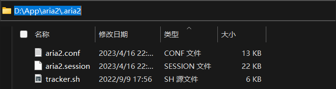


## 浏览器

### 文件下载

> [下载文件 - 计算机 - Google 云端硬盘帮助](https://support.google.com/drive/answer/2423534?hl=zh-Hans#zippy=%2C%E9%98%BB%E6%AD%A2%E7%AC%AC%E4%B8%89%E6%96%B9-cookie-%E5%8F%AF%E8%83%BD%E4%BC%9A%E5%AF%BC%E8%87%B4%E6%97%A0%E6%B3%95%E9%80%9A%E8%BF%87%E7%BD%91%E9%A1%B5%E7%89%88%E4%BA%91%E7%AB%AF%E7%A1%AC%E7%9B%98%E4%B8%8B%E8%BD%BD%E5%86%85%E5%AE%B9)
>
> 对于大文件，经常由于 `cookies` 过期或者由于没有允许第三方 `cookies`，导致大文件经常下载到一般甚至最后的时候无法下载，从头开始！
>
> 解决方法：`浏览器设置 —— cookies —— 允许 —— 添加下载文件的网站(e.g drive.google.com，注意勾选上允许第三方！)`


> 对于需要跨过 `GWF` 才能访问的网站，下载的时候使用代理的流量进行下载的问题，
>
> 解决方案：将 `VPN` 的 `System Proxy` 关闭！浏览器加上 `SwitchyOmega` 插件就能够不使用代理的流量进行下载了！
>
> 有关 `SwitchyOmega` 的设置：
>
> - `规则列表规则 —— clash/proxy`
> - `默认情景模式 —— 直接连接`
>
> ```
> ## 规则列表 设置为 AutoProxy
> https://raw.githubusercontent.com/gfwlist/gfwlist/master/gfwlist.txt
> ```
>
> 注意将 `导入/导出 —— 跨设备同步` 开启，这样就不用重复配置了！


## 文件传输

### git + zstd + rsync

> - [Add rsync to Windows Git Bash | by Prasanna Wijesiriwardana | Medium](https://prasaz.medium.com/add-rsync-to-windows-git-bash-f42736bae1b3)
> - [How to use rsync on Git Bash. Here’s a guide on how to use rsync on… | by Seunghyun Chae | Medium](https://shchae7.medium.com/how-to-use-rsync-on-git-bash-6c6bba6a03ca)
> - [Windows下使用Git+rsync构建文件同步工具_Yumin_Wu的博客-CSDN博客](https://blog.csdn.net/Blazar/article/details/109710997)
> - [Index of /~nickoe/msys2-mirror/msys/x86_64](http://www2.futureware.at/~nickoe/msys2-mirror/msys/x86_64/)  所有文件包的下载地址
> - [Releases · facebook/zstd](https://github.com/facebook/zstd/releases)

所需文件，

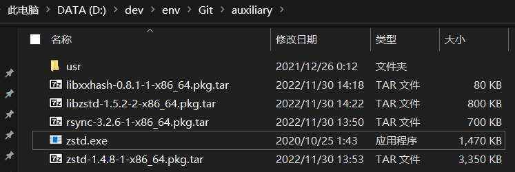

直接将解压的 `usr` 文件夹全部复制到 `git` 目录下即可，`git/usr` 会自动复制这些文件，


## 远程连接

> windows自带的远程桌面连接，
>
> - [win10 解决多用户同时远程连接教程（超详细图文）_张猿的博客-CSDN博客_win10多用户远程登录](https://blog.csdn.net/fallingflower/article/details/125215235)
> - [Win10远程桌面Ubuntu20.04 - 掘金](https://juejin.cn/post/7082185971311050789)
>
> easyconnect 连接，直接在浏览器中输入 vpn 地址就可以下载 easyconnect，
>
> - [解决因电脑自身问题导致EasyConnect无法连接或频繁更新闪退的问题（自用）_weixin_44645726的博客-CSDN博客_easyconnect一会就断开连接](https://blog.csdn.net/weixin_44645726/article/details/118694993)
>
> - http://download.sangfor.com.cn/download/product/sslvpn/SangforHelperToolInstaller.exe 深信服网络诊断工具
>
>   ```
>   # lsp状态异常
>   netsh winsock reset
>   ```
>
> - [解决了一个困扰了我一个礼拜的网络问题：EasyConnect总是断，两种解决方法。_v-space的博客-CSDN博客_easyconnect未知错误](https://blog.csdn.net/weixin_42069606/article/details/106592764) 使用方案二


### xshell

> - [XShell下载安装及使用（免费版）-CSDN博客](https://blog.csdn.net/weixin_47230291/article/details/126905158)
> - [家庭/学校免费 - NetSarang Website (xshell.com)](https://www.xshell.com/zh/free-for-home-school/)


## FTP 服务器搭建

> - [win11系统搭建FTP服务器超详细流程 - 知乎 (zhihu.com)](https://zhuanlan.zhihu.com/p/557205241)

1、`Win + R` 运行 `optionalfeatures`，

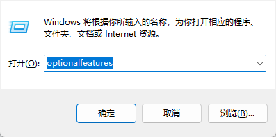

开启 `FTP` 功能，`Web 管理工具` 不确定是否要开启，但是里面有后面需要用到的 `IIS 管理控制台 & IIS 管理服务` 功能，只开启这两个或者 `FTP` 都可以试试。

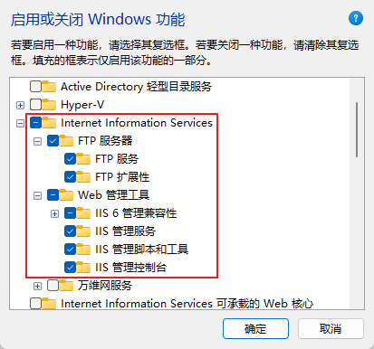

等待设置完成，然后在 `搜索` 中输入 `IIS`，

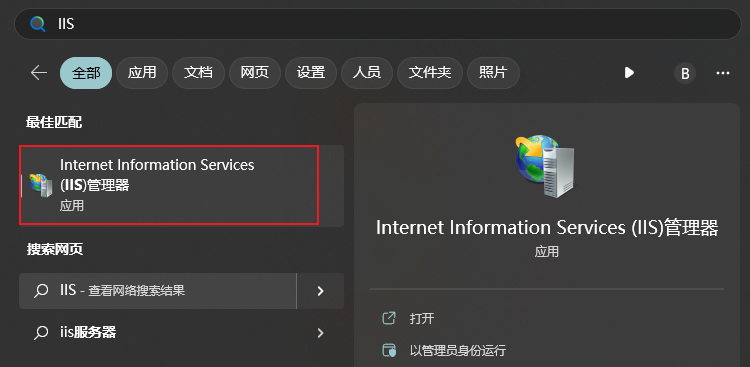

添加 `FTP` 站点，

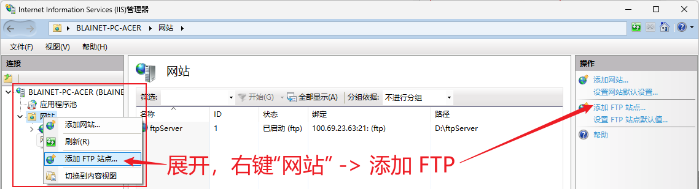

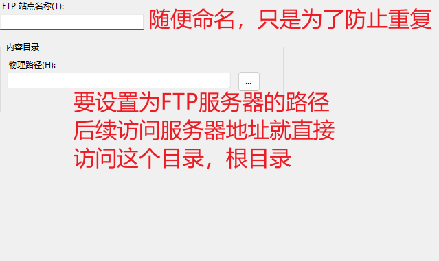

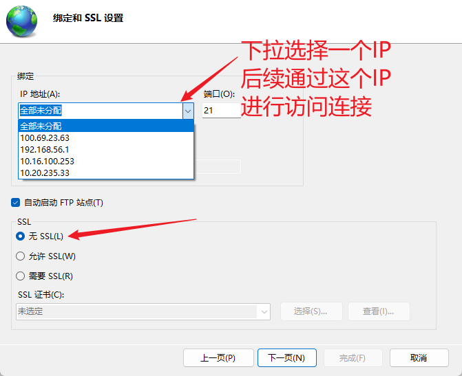

设置访问的用户和权限，

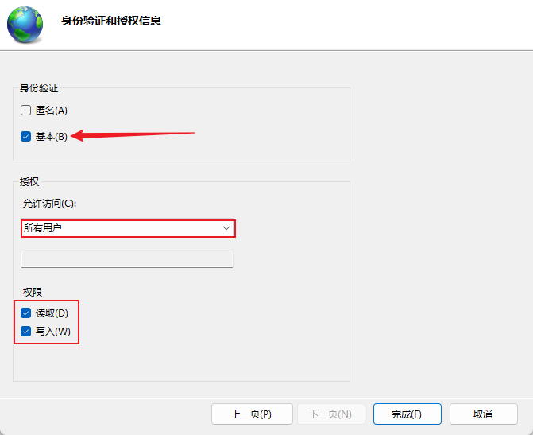

搭建成功示例，

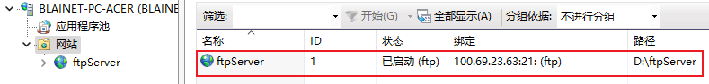


重要重要！！！确认防火墙允许 `FTP`！！！

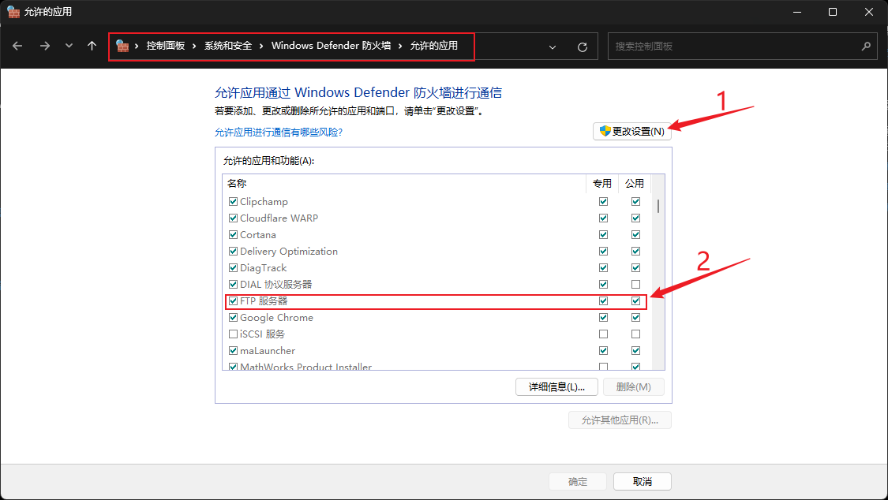


## PhotoShop

> - [xinntao/Real-ESRGAN: Real-ESRGAN aims at developing Practical Algorithms for General Image/Video Restoration.](https://github.com/xinntao/Real-ESRGAN)  图像清晰


## WSL

Windows Subsystem for Linux, WSL


### Arch

> - https://wsldl-pg.github.io/ArchW-docs/locale/zh-CN/How-to-Setup/
> - https://www.haoyep.com/posts/zsh-config-oh-my-zsh/ 核心
> -

**【2024/09/20】更新：还是使用离线 `ArchWsl` 方便**，

需要用到：

- `archwsl` github官网，使用 `.zip` 直接一键安装运行！！！不要使用 `.appx`
- archwsl 官方文档
- wsl export/import
- pacman 更换清华源


相关命令，

```bash
# 初始化配置
pacman-key --init
pacman-key --populate
yes | pacman -Syy archlinux-keyring

# 清华源
vim /etc/pacman.d/mirrorlist
Server = https://mirrors.tuna.tsinghua.edu.cn/archlinux/$repo/os/$arch

# 安装必要软件：`yes |`  -> 自动确认 y
yes | pacman -Syy tree git zsh

# 安装 oh-my-zsh，使用 powerlevel10k 的主题自定义配置
sh -c "$(curl -fsSL https://install.ohmyz.sh/)"
git clone --depth=1 https://github.com/romkatv/powerlevel10k.git ${ZSH_CUSTOM:-$HOME/.oh-my-zsh/custom}/themes/powerlevel10k
git clone https://github.com/zsh-users/zsh-autosuggestions ${ZSH_CUSTOM:-~/.oh-my-zsh/custom}/plugins/zsh-autosuggestions
git clone https://github.com/zsh-users/zsh-syntax-highlighting.git ${ZSH_CUSTOM:-~/.oh-my-zsh/custom}/plugins/zsh-syntax-highlighting

## 设置 .zshrc
vim ~/.zshrc
ZSH_THEME="powerlevel10k/powerlevel10k"
plugins=(git zsh-autosuggestions zsh-syntax-highlighting z extract web-search)

## 设置代理
# export all_proxy=http://ip:10809
host_ip=$(cat /etc/resolv.conf |grep "nameserver" |cut -f 2 -d " ")
# 为 curl wget git npm apt 等设置代理
proxy () {
  export ALL_PROXY="http://$host_ip:10809"
  export all_proxy="http://$host_ip:10809"
 # echo -e "Acquire::http::Proxy \"http://$host_ip:10811\";" | sudo tee -a /etc/apt/apt.conf > /dev/null
 # echo -e "Acquire::https::Proxy \"http://$host_ip:10811\";" | sudo tee -a /etc/apt/apt.conf > /dev/null
}
# 取消代理
unproxy () {
  unset ALL_PROXY
  unset all_proxy
 # sudo sed -i -e '/Acquire::http::Proxy/d' /etc/apt/apt.conf
 # sudo sed -i -e '/Acquire::https::Proxy/d' /etc/apt/apt.conf
}
##

# 设置 .bashrc
if [ -t 1 ]; then
  exec zsh
fi

## 备份保存以及导入
wsl --export Arch D:\Arch-inited.bak
wsl --import Arch $INSTALL D:\Arch-inited.bak
```


效果如下，


说明：用了该方案之后，可以舍弃 ubuntu 以及 gitbash，太臃肿且不方便使用，之后直接使用 vscode-wsl 连接即可。

### 安装

> - [Windows Subsystem for Linux Documentation | Microsoft Learn](https://learn.microsoft.com/en-us/windows/wsl/)
> - [Basic commands for WSL | Microsoft Learn](https://learn.microsoft.com/en-us/windows/wsl/basic-commands) 主要看这一节 `wsl` 相关的命令


```powershell
# 列出可安装的发行版本：https://linux.cn/article-12609-1.html
wsl --list --online
wsl -l -o

# 安装相应的发行版本
wsl --set-default-version 2
# 直接在应用商店下载也可以
wsl --install -d Ubuntu-22.04
```

可能需要重启使得安装生效！

首次需要这样启动，

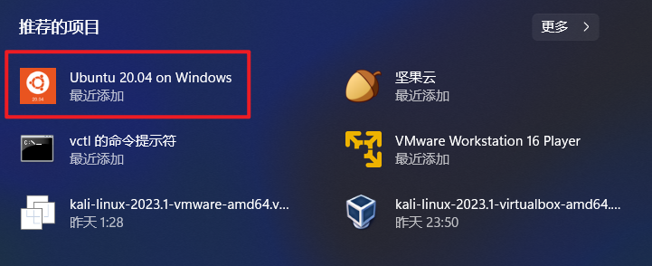

之后直接在命令行中运行 `wsl` 即可，首次直接运行不会生效！


### 使用

**终端，**

直接在开始菜单中点击登录，Windows 终端自动添加，或者在终端中手动输入 `bash` 进入 `WSL`。

---

`VS Code`  连接，

- 安装 `Remote Development` 插件，自动识别 `WSL` 子系统，然后和远程连接使用一致；
- `df -h` 可以看到 系统盘符 在 `WSL` 中的位置 `mnt/盘符名 (/mnt/c; /mnt/d)`，直接使用命令进行文件的拷贝；


---

关闭 `WSL`，

> 注意：如果没有断开 `VS Code` 和 `WSL` 的连接，无法关闭 `WSL2`，需要先将 `VS Code` 关闭，然后执行实例关闭的命令！

```powershell
wsl --list --verbose  # 查看正在运行的实例
wsl -t 实例名称  # 关闭指定的实例
wsl --shutdown  # 关闭所有运行的实例
```


### 配置

> - 修改保存的位置：[WSL安装及迁移 - 掘金 (juejin.cn)](https://juejin.cn/post/7242677078494838843)
> - https://zhuanlan.zhihu.com/p/406917270
> - [限制wsl2占用过多内存 - 知乎](https://zhuanlan.zhihu.com/p/345645621)

修改文件的保存路径，以管理员身份运行！

```powershell
wsl -l -v
wsl --shutdown

wsl --export Ubuntu-22.04 D:\Dev\env\WSL2\Ubuntu-22.04.tar
wsl --unregister Ubuntu-22.04
wsl --import Ubuntu-22.04 D:\Dev\env\WSL2\Ubuntu-22.04 D:\Dev\env\WSL2\Ubuntu-22.04.tar

# 修改用户名
ubuntu版本 config --default-user 用户名
ubuntu2204 config --default-user xbl
```

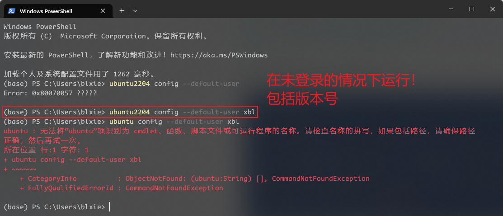

导入成功之后，


限制 wsl2 的资源占用，`~/.wslconfig`，

```yaml
 [wsl2]
 processors=2
 memory=4GB
 swap=4GB
 localhostForwarding=true
```


### 使用 vscode 远程连接 WSL

> Searching the web for: `vscode远程连接WSL2`

[1]: https://zhuanlan.zhihu.com/p/393810596
[2]: https://code.visualstudio.com/docs/remote/wsl-tutorial
[3]: https://blog.csdn.net/xuxuluo/article/details/126216699
[4]: https://blog.csdn.net/u011922698/article/details/123440581
[5]: https://blog.csdn.net/jewelsu/article/details/102811559

VSCode的Remote Deployment插件对WSL2直接提供了支持，能够很方便的连接本机的WSL2，但是并没有提供一个连接远程WSL2的解决方案。以下是一种可能的解决方案[^1^][1]：

1. 在Windows 10上开启SSH Server服务：Windows 10现在已经集成了Open SSH的功能。我们可以直接在可选管理中启用Open SSH的服务器功能[^1^][1]。

2. 设置SSH连接使用的默认Shell：在远程的主机上，使用SSH连接刚刚设置好的电脑。Windows的SSH连接成功后，默认的Shell是CMD。反正连接成功后，开启Powershell[^1^][1]。

3. 修改远程电脑打开SSH连接时的默认Shell：把默认的CMD修改成WSL2的Bash，之后每次远程连上，都会自动启动WSL2，然后就可以使用WSL2的命令进行操作[^1^][1]。

4. VSCode连接WSL2：这里就是与平常一样，直接使用SSH连接就可以，你就会发现你能直连到电脑的WSL2了[^1^][1]。

希望这个解决方案对你有所帮助！

> Learn more: [1. zhuanlan.zhihu.com](https://zhuanlan.zhihu.com/p/393810596) [2. code.visualstudio.com](https://code.visualstudio.com/docs/remote/wsl-tutorial) [3. blog.csdn.net](https://blog.csdn.net/xuxuluo/article/details/126216699) [4. blog.csdn.net](https://blog.csdn.net/u011922698/article/details/123440581) [5. blog.csdn.net](https://blog.csdn.net/jewelsu/article/details/102811559)


> windows修改远程电脑打开 SSH 连接时的默认 Shell为bash

在 Windows 系统中，修改远程电脑打开 SSH 连接时的默认 Shell 为 bash 的方法会有所不同，因为 Windows 系统并没有 `chsh` 这个命令。不过，你可以尝试以下步骤：

1. 首先，你需要确认你的远程电脑上已经安装了 bash。在大多数 Linux 发行版中，bash 都是默认安装的。如果你的远程电脑是 Windows 系统，你可能需要先安装 Windows Subsystem for Linux (WSL)。

2. 确认 bash 已经安装后，你可以在 SSH 连接时指定要使用的 Shell。在 SSH 命令后面加上 `-t bash` 就可以在连接时自动启动 bash：

```bash
ssh 用户名@主机名 -t bash
```

这里，"用户名" 是你的用户名，"主机名" 是远程电脑的主机名或 IP 地址。

3. 如果你希望每次打开 SSH 连接时都自动使用 bash，你可以把这个命令添加到你的 SSH 客户端配置文件中。具体操作方法会根据你使用的 SSH 客户端的不同而不同。

希望这个答案对你有所帮助！如果还有其他问题，欢迎随时向我提问。😊


> Windows openssh怎么修改默认的sshd22号端口为5122

在 Windows 系统中，如果你使用的是 OpenSSH 服务，你可以通过修改 OpenSSH 的配置文件来更改默认的 SSH 端口。以下是具体步骤：

1. 打开 OpenSSH 的配置文件。默认情况下，配置文件的位置应该是 `C:\ProgramData\ssh\sshd_config`。你可以使用任何文本编辑器打开这个文件，例如 Notepad。

2. 在配置文件中找到 `#Port 22` 这一行。这一行表示 SSH 服务的默认端口号是 22。

3. 将 `#Port 22` 这一行改为 `Port 5122`，并保存文件。这样就将 SSH 服务的端口号更改为了 5122。

4. 最后，你需要重启 OpenSSH 服务以使更改生效。你可以在命令提示符中输入以下命令来重启服务：

```bash
net stop sshd
net start sshd
```

以上就是修改 OpenSSH 默认端口的步骤。请注意，修改端口号可能会影响到你的防火墙设置，因此在修改后，请确保你的防火墙允许通过新的端口号（5122）进行连接。

希望这个答案对你有所帮助！如果还有其他问题，欢迎随时向我提问。😊


> 注意
>
> - https://blog.csdn.net/qq_40750972/article/details/123450772

如果设置免密登录，需要将公钥 `id_rsa.pub` 的内容添加到 被连接端（服务器）的

```bash
sudo echo "复制的 .pub 公钥内容" >> ~/.ssh/authorized_keys  # 如果没有该文件，会自动创建

sudo echo "ssh-rsa AAAAB3NzaC1yc2EAAAADAQABAAABgQDiPyR0sfp+i5VrTSwbocXXi+2oDWdfo7hZasgqPneA79S+Y8Npv+6xSdedV3pzG7wmjv0jEucJaaOP71Gq7ZnNF/jtxVlauSDjCzz8JDUfWGDEPO5Z/2YOJbg6UXwoHsF1ogffZK6rtQWZgJuqfqCig6acn2WRIcCnZB6JCRNcf/1SLtZitA57kcb1mQb5uF4urNrT/dj89OTNus7x+SBwzfB92ZkbBR4PwcZFYvRdQTZO0sn6VI3YM8HfA4/xobrgXKeox5K8yKmifnZdQOdwjcorls7gpPYULsDG94SLWNF6zHP/SW8M32MDwKwMWMU55Mbbvp1NUd+7hcnzGUsVfPA0GIILXfvkbNVt5PKCOkljxgogxrqy3SQufc+ijsfMCGFA/XsXbin9viz6+akXr9GIeFluieT1pPW84bG9TXMx0YRUZy7henZHHAwW8eh0ek3UJ29/RjC9nLpC5/W5fFXFt27u3Ei0WqTE1IcnWLUAwdzgXtudZZQU6+H5zi0= SHARING
" >> ~/.ssh/authorized_keys

echo "ssh-rsa AAAAB3NzaC1yc2EAAAADAQABAAABgQDiPyR0sfp+i5VrTSwbocXXi+2oDWdfo7hZasgqPneA79S+Y8Npv+6xSdedV3pzG7wmjv0jEucJaaOP71Gq7ZnNF/jtxVlauSDjCzz8JDUfWGDEPO5Z/2YOJbg6UXwoHsF1ogffZK6rtQWZgJuqfqCig6acn2WRIcCnZB6JCRNcf/1SLtZitA57kcb1mQb5uF4urNrT/dj89OTNus7x+SBwzfB92ZkbBR4PwcZFYvRdQTZO0sn6VI3YM8HfA4/xobrgXKeox5K8yKmifnZdQOdwjcorls7gpPYULsDG94SLWNF6zHP/SW8M32MDwKwMWMU55Mbbvp1NUd+7hcnzGUsVfPA0GIILXfvkbNVt5PKCOkljxgogxrqy3SQufc+ijsfMCGFA/XsXbin9viz6+akXr9GIeFluieT1pPW84bG9TXMx0YRUZy7henZHHAwW8eh0ek3UJ29/RjC9nLpC5/W5fFXFt27u3Ei0WqTE1IcnWLUAwdzgXtudZZQU6+H5zi0= SHARING
" >> 'C:\ProgramData\ssh\authorized_keys'

ssh-copy-id -i /path/to/id_rsa.pub user@host -p 22
```


## 播放器

### PotPlayer

> - [PotPlayer通过WebDAV、FTP播放远程NAS上的电影 - PotPlayer中文网 (potplayercn.com)](http://www.potplayercn.com/course/3008.html)
> - [PotPlayer配置文件导出导入说明 - PotPlayer中文网 (potplayercn.com)](http://www.potplayercn.com/course/2977.html)

在播放列表里面新建专辑，然后选择 `FTP` 即可，重点：记得将默认编码格式 `UTF-8` 取消，否者不能正常打开！


配置文件，

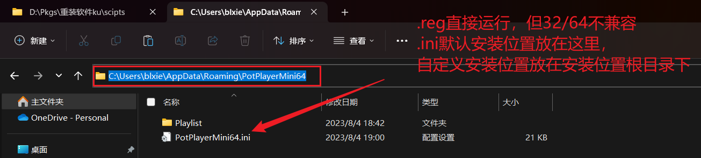


## B站视频下载

> - 知乎高赞介绍：https://zhuanlan.zhihu.com/p/124293184
> - 软件地址：https://github.com/leiurayer/downkyi/releases
> - 只能下载 480P 解决方法：https://www.bilibili.com/read/cv19732795/ 登录 b站账号


## AI 工具

> ChatAll: https://github.com/sunner/ChatALL/releases


# 问题记录

## 图标

> - [关于win10图标不正常显示的一种解决方法_＞小哲＜的博客-CSDN博客](https://blog.csdn.net/weixin_43627152/article/details/112645619)
>

