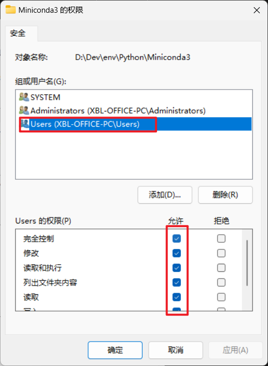

# 基础环境工具


## jupyter notebook

> - [jupyter notebook添加、删除内核_IC学习者的博客-CSDN博客_jupyter notebook删除内核](https://blog.csdn.net/I_LOVE_MCU/article/details/108311698)


```bash
conda activate kernelname
python -m pip install ipykernel
python -m ipykernel install --user --name=kernelname(当前虚拟环境名称)  --display-name showname

jupyter kernelspec list
jupyter kernelspec remove kernelname

jupyter notebook --allow-root
```


## pip 相关设置

```bash
pip config set global.index-url https://pypi.tuna.tsinghua.edu.cn/simple

~/.pip/pip.conf
[global]
index-url=http://pypi.douban.com/simple
[install]
trusted-host=pypi.douban.com
```


## conda 相关

> - [2022-04-13安装完conda后，进入终端显示（base） - 简书](https://www.jianshu.com/p/39c3742568b8)

安装之后不显示 `(base)`，

```bash
conda config --set auto_activate_base true
conda init
```

重启终端使得配置生效！


> - [conda 相关知识_blainet的博客-CSDN博客](https://blog.csdn.net/qq_40750972/article/details/123868808)

克隆（复制）一个虚拟环境，也可以说是重命名（只能用该方法），

```bash
conda create -n 新环境名 --clone 要复制/重命名的环境
conda create -n stark --clone ostrack
```


> - [Anaconda环境配置_blainet的博客-CSDN博客](https://blog.csdn.net/qq_40750972/article/details/115324263)

Windows 下环境变量配置，

```bash
# CONDA_HOME
D:\dev\env\Python\Miniconda3
D:\dev\env\miniconda3
# PATH
%CONDA_HOME%\Scripts
%CONDA_HOME%\Library\bin
```


> - [Python packages hash not matching whilst installing using pip - Stack Overflow](https://stackoverflow.com/questions/40183108/python-packages-hash-not-matching-whilst-installing-using-pip)

`pip install + 参数设置`，`–no-cache-dir`，

```bash
pip install --no-cache-dir torch==1.12.0+cu116 torchvision==0.13.0+cu116 torchaudio==0.12.0 --extra-index-url https://download.pytorch.org/whl/c
u116
```

或者，

```bash
# -v：详细的输出
# pip install -v tensorrt -i https://mirror.baidu.com/pypi/simple
pip install -r requirements.txt --no-cache-dir
```


## tensorflow-gpu 安装

> - [Build from source on Windows  | TensorFlow (google.cn)](https://tensorflow.google.cn/install/source_windows?hl=en#gpu)
> - [tensorflow2.4.1+cuda11.0+cudnn8.0.4安装记录_漠月的博客-CSDN博客](https://blog.csdn.net/qq_37893682/article/details/124049620)
> - 

cudnn > 8.x 的显卡算力，对应的 CUDA 和 cuDNN 版本要求较高！RTX3090/A4000 均是

注意这里不要使用 conda 进行安装，因为 conda 无法找到更多版本的 tensorflow-gpu

> ==必须按照官方给的对应版本进行安装！否则无法成功运行，因为每一个对应的 tensorflow-gpu 版本都是由对应的 CUDA & cuDNN 编译得到！==

```bash
conda create -n tf2 python=3.9

# 使用 pip 安装指定版本的 tensorflow-gpu
pip install tensorflow-gpu==2.5.1

# 手动指定的下载源 -c nvidia -c conda-forge
conda install cudatoolkit=11.2 cudnn=8.1 -c nvidia -c conda-forge
```

测试是否安装成功，

```python
import tensorflow as tf
tf.config.list_physical_devices('GPU')
```


相关命令，

```bash
# 查找可安装的包
conda search tensorflow-gpu
```


# 问题

## conda 相关问题

> - [anaconda | 镜像站使用帮助 | 清华大学开源软件镜像站 | Tsinghua Open Source Mirror](https://mirrors.tuna.tsinghua.edu.cn/help/anaconda/)
> - [修改conda虚拟环境路径 - 贝壳里的星海 - 博客园](https://www.cnblogs.com/tian777/p/17481056.html)
> - [解决新创建的anaconda环境在C:\Users\xxx\.conda\envs\，而不在anaconda安装目录下的envs中_anaconda创建的虚拟环境存储在哪_半岛铁子_的博客-CSDN博客](https://blog.csdn.net/hshudoudou/article/details/126388686)

```yaml
channels:
  - defaults
show_channel_urls: true
default_channels:
  - https://mirrors.tuna.tsinghua.edu.cn/anaconda/pkgs/main
  - https://mirrors.tuna.tsinghua.edu.cn/anaconda/pkgs/r
  - https://mirrors.tuna.tsinghua.edu.cn/anaconda/pkgs/msys2
custom_channels:
  conda-forge: https://mirrors.tuna.tsinghua.edu.cn/anaconda/cloud
  msys2: https://mirrors.tuna.tsinghua.edu.cn/anaconda/cloud
  bioconda: https://mirrors.tuna.tsinghua.edu.cn/anaconda/cloud
  menpo: https://mirrors.tuna.tsinghua.edu.cn/anaconda/cloud
  pytorch: https://mirrors.tuna.tsinghua.edu.cn/anaconda/cloud
  pytorch-lts: https://mirrors.tuna.tsinghua.edu.cn/anaconda/cloud
  simpleitk: https://mirrors.tuna.tsinghua.edu.cn/anaconda/cloud
  deepmodeling: https://mirrors.tuna.tsinghua.edu.cn/anaconda/cloud/
envs_dirs:
  - D:/Dev/Env/miniconda3/envs
pkgs_dirs:
  - D:/Dev/Env/miniconda3/pkgs
```


windows无法修改新创建的虚拟环境路径，始终默认保存在 `~/.conda/envs` 目录下，按照以下修改仍然不成功！

```bash
conda info
conda config --set show_channel_urls yes
conda config --add envs_dirs D:/Dev/Env/miniconda3/envs
conda config --add pkgs_dirs D:/Dev/Env/miniconda3/pkgs
```

解决方法：修改 `CONDA_HOME` 文件夹的读取权限！使得可以被当前用户读取和修改！！！




## 项目运行，PYTHONPATH 相关

> - [Python中的PYTHONPATH环境变量、手动添加import导入搜索路径 - DXCyber409 - 博客园](https://www.cnblogs.com/DXCyber409/p/15417437.html) 主要参考这个
> - [如何在Windows上设置Python环境变量PYTHONPATH|极客教程](https://geek-docs.com/python/python-tutorial/t_how-to-set-python-environment-variable-pythonpath-on-windows.html) 尝试了没起作用，win下 cmd/pwsh/系统环境变量 都设置过，没有效果

查看 `PYTHONPATH`，

```python
import sys
sys.path
```

在Python中，`PYTHONPATH`环境变量用于指定Python解释器在导入模块时搜索的额外路径。当你在`site-packages`目录下创建一个`.pth`文件并添加路径时，你实际上是在告诉Python解释器在导入模块时也要考虑这些额外的路径。

以下是如何在Python中手动添加导入搜索路径的步骤，以及如何验证这些路径是否已经添加到Python的搜索路径中：

1. **创建`.pth`文件：**
   在你的Python环境的`site-packages`目录下创建一个新的`.pth`文件。这个文件可以包含一个或多个你希望Python解释器在导入模块时搜索的路径。例如，你可以创建一个名为`myenv.pth`的文件。

2. **添加路径到`.pth`文件：**
   在`myenv.pth`文件中，添加你希望包含的路径。每行一个路径。例如：

   ```bash
   ${YOUR_PYTHON_PROJ_PATH}
   ## 在 miniconda3\envs\torch_cpu\lib\site-packages 下创建 myenv.pth
   D:\Desktop\proj\proj_ysys
   D:\Desktop\proj\proj_ysys\TSM
   D:\Desktop\proj\proj_ysys\ByteTrack
   ```
   
   请确保你添加的路径是正确的，并且这些路径确实包含了你想要导入的模块。
   
3. **验证路径是否添加成功：**
   打开Python解释器，执行以下命令来查看当前的模块搜索路径：

   ```python
   import sys
   print(sys.path)
   ```

   这将打印出Python解释器当前的模块搜索路径列表。你应该能在列表中看到你刚刚添加的路径。

4. **尝试导入模块：**
   尝试导入一个位于你添加路径中的模块，以确保导入成功。例如：

   ```python
   import 报错提示缺失的包名
   ```

   如果没有任何错误，那么说明你添加的路径已经成功地被Python解释器识别，并且可以正常导入模块。

请注意，这种方法适用于Python 2.x和Python 3.x。在Python 3.3及以后的版本中，还可以使用`sys.path.append()`在运行时动态地添加搜索路径。但是，使用`.pth`文件的方法更为持久，因为它会在Python解释器启动时自动加载这些路径。


## 导入环境

> - [Python使用dotenv来管理环境变量 | 杂烩饭](https://zahui.fan/posts/026f1c74/)
> - [Python .env环境变量读取指南 - 知乎](https://zhuanlan.zhihu.com/p/639453312)

bash / python 程序中直接设置，

```bash
## bash
source .env

## python app
pip install python-dotenv

from dotenv import load_dotenv
# 加载 .env 文件中的环境变量
load_dotenv()
```

