# 文件共享

## 阿里云盘

> - [【已解决】阿里云盘压缩包无法分享压缩文件分享限制_aliyunpansharer-CSDN博客](https://blog.csdn.net/qq543808391/article/details/124628904)


# 视频录制

> - [OBS录制设置概述与推荐，草履虫也能看懂。 - 哔哩哔哩](https://www.bilibili.com/read/cv22627757/)


# MathType

> `MathType7.x` 破解，
>
> - [教你简单白嫖mathtype正版软件，非国内代理版 - 知乎](https://zhuanlan.zhihu.com/p/567606955)
>
> ```reg
> Windows Registry Editor Version 5.00
>
> [-HKEY_CURRENT_USER\Software\JavaSoft\Prefs\com\wiris\editor\license\]
> [HKEY_CURRENT_USER\Software\JavaSoft\Prefs\com\wiris\editor\license\]
> "/Cv/E/C81+j/Rw/U/E6ws/Znt/Os/K/Q=="="11/M/P/Ir/Y/B/S/P/Pr/Q/L/Ny/T9s4/Iw=="
> "/Mz/Bhef/D/Q/Hs30/U6/F/Pdl/R/Xsg=="="/S/Zd8c/Ai/Z/A83028s6/Kn/Gf/M/Q=="
> "vi/L/M7/K/Hb/C/O/A/K/X9uuis/O1/J/A=="="/S/Zd8c/Ai/Z/A80\\/O/S/C/Vgp\\0/P/Q=="
> "wm/U/C/Y/T/Nz5/Tw="="/Wna/F/W3q/I/Yp/V\\lj/Dedai56/Ur/Wpf/P/Kpl/Soh/A/Z/Qe\\6hit3ym\\6m5sp/B/B/Q=="
> "x/W/Yrj/M/Db/Bds="="104z/W8rbqpw5\\/Qz0/C/Q/Opu/Dj/B5b/Dwsy77"
> ```

```latex
\mathbf{}  # 加粗向量
\mathbb{}  # 空心大写字母
\vec{}  # 箭头向量

\tilde{}  # 上波浪线

# 多行公式
\align{}
多行公式 \\
\align


```


# Office tools plus

> - https://otp.landian.vip/zh-cn/download.html
> - https://www.coolhub.top/tech-articles/kms_list.html 激活 KMS 地址
> - [Office Tool Plus 一键下载安装激活管理各版本 Office 软件【附：Office2021 Preview 安装激活详细过程】 - 简书](https://www.jianshu.com/p/67cd6621166e)

office 三件套，visio 等 office 产品，

> 注意：**端口号设置为 ==1688==！**

```
kms.loli.beer	98%	100%	24435	238	43	159ms	12/06 20:37:55
kms.loli.best	99%	100%	24535	135	44	118ms	12/06 20:37:55
kms.03k.org	99%	100%	24493	67	154	136ms	12/06 20:37:55
kms.cangshui.net	95%	100%	23706	805	203	1609ms	12/06 20:37:56
kms.cary.tech	99%	100%	24568	134	11	303ms	12/06 20:37:56
kms.catqu.com	99%	100%	24102	55	1	279ms	12/06 20:37:57
kms.cgtsoft.com	98%	100%	24362	230	121	960ms	12/06 20:37:58
kms.ghpym.com	99%	100%	24499	212	2	150ms	12/06 20:37:58
kms.mc06.net	98%	100%	23692	448	18	134ms	12/06 20:37:58
kms.moeyuuko.top	98%	100%	23869	257	32	464ms	12/06 20:37:59
kms.sixyin.com
```


# Visio


`Visio` 通过 office tools plus 下载激活，


- visio设置正方形网格的内边框和外边框颜色，

  直接进行外边框叠加即可，然后设置显示在哪一层就可以达到效果；还可以通过插入 `excel` 图表的方式来进行设计，但是这种方法设计的不够准确，同时 excel 的样式效果也有些不同，推荐使用前一种方式；

- 弯曲的箭头，直接右键，在形状栏目里选择显示 `更多形状——其他visio方案——连接符`

- 调整形状的长宽等信息，直接在左下角的状态栏里面进行设置


> 编辑相关，
>
> - [visio怎么设置字体透明度-百度经验](https://jingyan.baidu.com/article/cbf0e500f6cb556faa2893ba.html)
>
> - [怎样在Visio中插入大括号？ - 腾讯云开发者社区-腾讯云](https://cloud.tencent.com/developer/article/1824875)
>
>   另外一种方法是：用有箭头的连接线连接，然后设置连接线的圆角即可
>
> - [Visio如何设置参考线-百度经验](https://jingyan.baidu.com/article/c1465413e5d7740bfdfc4c46.html)
>
> - [Visio如何调整锁定图像大小_码农阿宇的博客-CSDN博客](https://blog.csdn.net/only_yu_yy/article/details/78907133)
>
>   锁定横纵比：开发者工具 —— 保护 —— 纵横比，勾选上就OK了！
>
> - [Visio中，新建连接点如何更整齐？_哔哩哔哩_bilibili](https://www.bilibili.com/video/BV1d3411L7pX/?vd_source=f01c4b322443fbcb202e2abcaae29044)
>
> - [用Visio绘制深度模型结构图的基本单元_斜立方体_鱼一一的博客-CSDN博客_visio画剖面图](https://blog.csdn.net/qq_40662074/article/details/88958145)


> 字体相关，
>
> - [永久性解决Visio中公式变形问题_qq_33700120的博客-CSDN博客_visio公式变形](https://blog.csdn.net/qq_33700120/article/details/115360914)


导出，**为了方便图片格式更加准确，在 设计——大小——适应绘图，之后再导出图片，自动将多余的 margin 给删除！**

注意：如果要再次编辑，需要设置为 **自动调整大小**

> 将 Visio 绘制的图转换为 LaTeX 中的 .eps 矢量图格式
>
> - [详解visio制作的图转化为.eps格式的图_贾继康的博客-CSDN博客_visio导出eps](https://blog.csdn.net/Jiajikang_jjk/article/details/80248704)
>
>


> 自定义形状
>
> > - [使用Visio画立方体 - CodeAntenna](https://codeantenna.com/a/fBIwjyDl5l)  ==使用该方法！交点处没有明显的锯齿==
>
> visio 删除自定义的连接点：点击连接点 —— CTRL + 左键点击 选中该点（变成红色） —— delete 删除


# LaTeX

## 问题解决

> 总站，
>
> - [TeX - LaTeX Stack Exchange](https://tex.stackexchange.com/)


>标题过长导致无法居中对齐，
>
>在LaTeX中，当表格或图形的标题过长时，确保它们在页面上居中对齐可能会有些棘手。`bicaption`包通常用于创建双语言标题，但它可能不会自动处理换行和居中的问题。为了解决这个问题，我们可以使用`caption`包的一些特性来帮助我们。
>
>下面是一个修改后的例子，它使用了`caption`包的`\captionsetup`命令来确保即使在换行后，标题也能够正确地居中对齐：
>
>```latex
>\documentclass{article}
>\usepackage{bicaption}
>\usepackage{fontspec}
>
>\begin{document}
>
>\begin{table}[!ht]
>    \centering
>    \wuhao
>    %%%% 此处添加这一句即可！！！
>    \captionsetup{justification=centering} % 设置标题居中
>    \bicaption[\xiaosi P2TT 跟踪器与其他 SOTA 跟踪器在三大基准测试集上的性能比较]{%
>        \wuhao P2TT 跟踪器与其他 SOTA 跟踪器在三大基准测试集上的性能比较\label{tab:p2tt}
>    }{%
>        Tracking performance comparison between P2TT and other SOTA trackers on three benchmarks\label{tab:p2tt-en}
>    }
>    % 表格内容
>\end{table}
>
>\end{document}
>```
>
>在这个例子中，`\captionsetup{justification=centering}`命令被放置在`table`环境内部，确保了标题即使在换行后也能够居中对齐。请注意，这个命令应该在`\bicaption`命令之前使用，以便正确设置格式。
>
>此外，如果你的LaTeX环境中没有`\xiaosi`和`\wuhao`命令，你可能需要定义它们或者使用其他方式来设置字体大小。这些命令通常与`fontspec`包一起使用，用于指定中文字体的大小。如果你的文档中没有使用`fontspec`包，或者你不确定如何定义这些命令，你可以简单地移除它们，并直接使用`\small`、`\footnotesize`等标准LaTeX字体大小命令。


> 报 `Warining`，
>
> ```bash
> LaTeX Warning: Label(s) may have changed. Rerun to get cross-references right.
> ```
>
> 解决方法，修改 vscode 对 latex 的设置，
>
> ```json
> "latex-workshop.latex.autoClean.run": "onFailed",
> ```
>
> 修改之后，需要重启 `VS Code`！才能使得再次编译时不会报错！！！


> - [解决Latex编译报错：Command `\Bbbk' already defined. ...ol{\Bbbk} {\mathord}{AMSb}{"7C}_"command `\\bbbk' already defined. ...ol{\\bbbk} {-CSDN博客](https://blog.csdn.net/haifeng_gu/article/details/105768155)
>
>   ```tex
>   \usepackage{amsmath}
>   % redefined in newtxmath.sty
>   \let\Bbbk\relax
>   \usepackage{amssymb}
>   ```
>
>   在`\usepackage{amssymb}`前加上`\let\Bbbk\relax`使得前面（即newtxmath包中）定义的Bbbk失效。


> 解决本地编译速度慢的问题（有的时候甚至不如在线的 overleaf 快），
>
> - [LaTeX编译速度优化_latex编译速度慢-CSDN博客](https://blog.csdn.net/weixinhum/article/details/121056868)
>
>   ```latex
>   % 文章的主体架构章节数均在此设计编辑
>   \documentclass[UTF8,twoside,zihao=-4,AutoFakeBold,scheme=chinese,openany]{ctexbook}
>
>   % 取消 PDF 压缩，加快速度，最终版本生成的时候最好把这句话注释掉
>   \special{dvipdfmx:config z 0}
>   ```
>
>


> 错误 msg，
>
> ```latex
> \headheight is too small (12.0pt): (fancyhdr) Make it at least 20.0pt, for example: (fancyhdr) \setlength{\headheight}{20.0pt}. (fancyhdr) You might also make \topmargin smaller to compensate:
> ```
>
> - [errors - What does this warning mean? (fancyhdr and headheight) - TeX - LaTeX Stack Exchange](https://tex.stackexchange.com/questions/327285/what-does-this-warning-mean-fancyhdr-and-headheight)
>
>   解决方案，
>
>   ```latex
>   \fancyhead
>   % 在 \fancyhead 后面加上，具体 pt 根据 warning 提示设置
>   \setlength{\headheight}{20pt}
>   ```
>
>


> underfull vbox，
>
> - [How do I correct for Underfull \vbox ?](https://groups.google.com/g/comp.text.tex/c/qaP8DpOXoOo?pli=1)
>
>   在 `\begin{document}` 前加上，
>
>   ```latex
>   \raggedbottom
>   ```
>
> overfull vbox，
>
> - [LaTeX中遇到的underfull和overfull警告_latex underfull-CSDN博客](https://blog.csdn.net/weixin_45459911/article/details/110693696)
>
> - [Understanding underfull and overfull box warnings - Overleaf, Online LaTeX Editor](https://www.overleaf.com/learn/how-to/Understanding_underfull_and_overfull_box_warnings)
>
> - [删除vscode latex文中蓝色波浪线警告信息_underfull \hbox (badness 1496) in paragraph at lin-CSDN博客](https://blog.csdn.net/weixin_44907625/article/details/129583314)
>
>   ```latex
>   \hbadness=10000
>   ```
>
> 总结，同时解决 `underfull vbox & overfull vbox`，
>
> ```latex
> \raggedbottom
> \hbadness=10000
> ```


## 在线Overleaf

> - [overleaf 改为XeLatex怎么操作_overleaf xelatex-CSDN博客](https://blog.csdn.net/bj_zhb/article/details/121961582)
> - [xurongxiang/Overleaf_to_GitHub](https://github.com/xurongxiang/Overleaf_to_GitHub)

overleaf 同步 git/GitHub 需要 pro 版本，，，


## 本地安装搭建

### 下载安装 Tex

> - [搭建 LaTeX 舒适写作环境（VSCode） - 知乎](https://zhuanlan.zhihu.com/p/139210056)
>
> - [如何配置 vscode latex - 知乎](https://zhuanlan.zhihu.com/p/508823527) 更新库文件
>
> - [📃 编辑器配置与模板编译 | BIThesis](https://bithesis.bitnp.net/guide/configure-and-compile.html)
>
> -

scoop 的安装参见 `Windows.md - 软件工具 - 下载相关`，

```powershell
# 使用 TeXLive
scoop bucket add scoopet https://github.com/ivaquero/scoopet
scoop install texlive
# 使用 MikTeX
scoop config proxy localhost:10809
scoop install latex
scoop install latexindent
```

安装好之后打开 `MiKTeX.exe`，可能会提示 `xelatex: major issue: So far, you have not checked for MiKTeX updates.` 错误弹窗，只需要按照提示进行库文件更新即可，

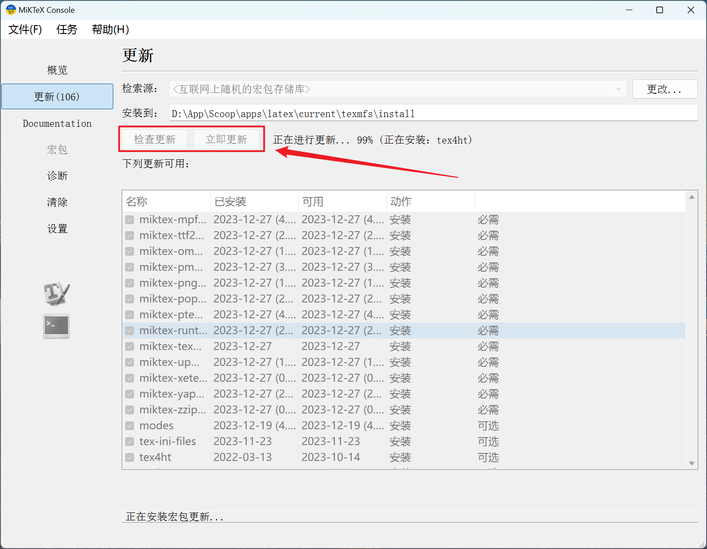

安装更新配置完成之后，没有报错才可以使用！之后才能打开 tex 项目进行编译！！！


**需要 perl 才能通过编译！**

```powershell
## 安装 perl
scoop install perl
cpan YAML::Tiny
```

*perl 安装好可能会出现一些问题，提示不支持中文，后面编译 tex 的时候也会因为这个原因编译不通过！*

> - [Locale 'Korean_Korea.949' is unsupported, and may crash the interpreter. with perl 5.38.0.1 · Issue #119 · StrawberryPerl/Perl-Dist-Strawberry](https://github.com/StrawberryPerl/Perl-Dist-Strawberry/issues/119)
> - [win11编译perl 5.38遇到的问题_编程语言-CSDN问答](https://ask.csdn.net/questions/7984070)

解决方案：直接在 *系统环境变量* 里面添加两个设置项即可（缺一不可！）

```bash
LC_ALL=C
LANG=zh_CN.UTF-8
```

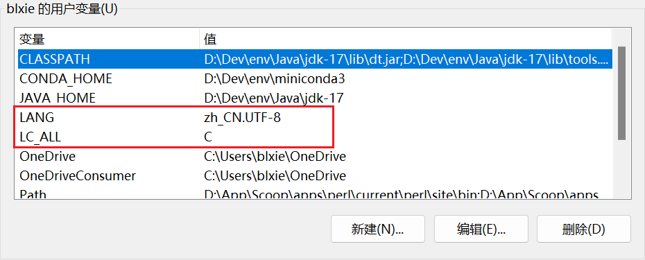

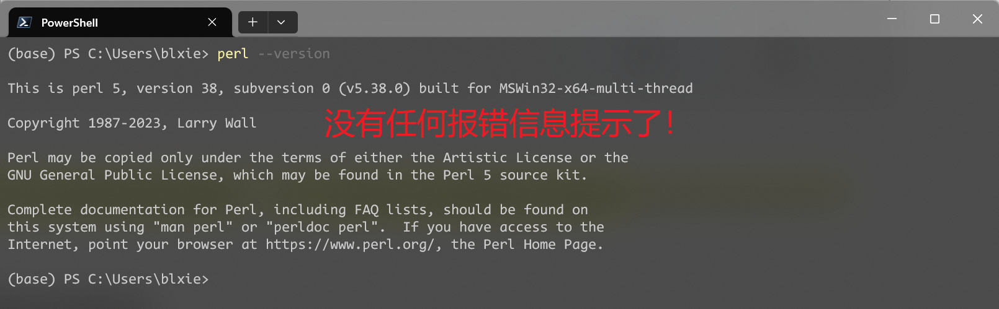


> Error: Recipe returns with error code 1/null

将原来项目中所有的不相关文件全部删除，具体包括：

- `*.aux`
- `*.log`
- 只包含重要的 `*.tex` 文件即可，其他的比如 pdf 文件可以保留，根据实际情况进行判断！其他的一律删除
- 尤其注意 `.vscode/settings.json` 中的配置文件，如果有，那么将覆盖 `User/settings.json`，所以要先看清楚！

注意编译的工具链：常用的是 `XeLaTex`，要将工具链中的命令和名字对应上！


### 配置编译

如果 pdf 是用 wps 打开的，需要先关闭再编译！

如果是要重新编译 .bib 文件，需要删除之前编译的 `.aux .bbl` 文件！


#### 编译运行调试的技巧（重要）

首先，删除项目下面所有的中间文件（尤其是被人拷贝而来），只保留核心 `tex` 文件以及一些 pdf 文件！然后，再执行后续的编译操作！


==注意：编译的时候先要选中要编译的 `*.tex` 文件，即鼠标点击，激活之后再编译，否则会提示 `Cannot find LaTeX root file.`==

根据 `Output/LaTex Compiler` 查看编译情况信息，根据 `Output/LaTex Workshop` 查看提示（这里仅仅只起参考作用，核心还是在 `Compiler` 里面的提示信息！）

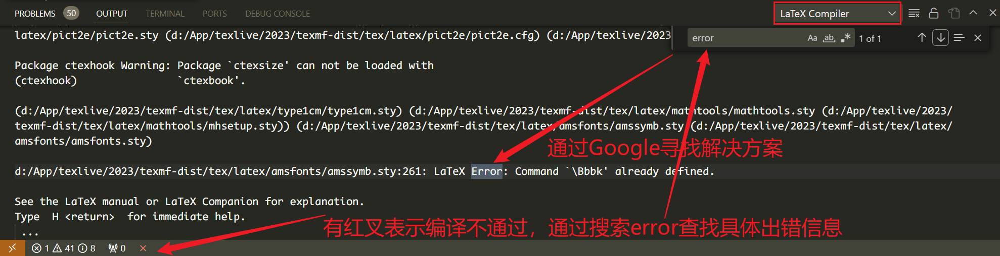


> - [Latex 编译报错 I found no \bibstyle & \bibdata & \citation command_i found no \bibdata command-CSDN博客](https://blog.csdn.net/qq_41554005/article/details/120711081)

如果要使用 `.bib`  （必须搭配 `bibo...` 标签）而非自己手动创建的参考文献（使用 `thebibo...` 标签），才需要使用到 `bibtex` 编译工具，否则编译链中不要选择该选项！

> 这个错误表明 BibTeX 在处理你的文档时没有找到 `\bibdata` 和 `\bibstyle` 命令，这通常是由于 BibTeX 找不到 BibTeX 数据文件（`.bib` 文件）或者文献样式文件（`.bst` 文件）引起的。
>
> 在解决这个问题之前，请确保你的项目目录中包含了正确的 `.bib` 文件，并且你的 LaTeX 文档中有 `\bibliography` 和 `\bibliographystyle` 命令。
>
> 以下是一些解决方法：
>
> 1. **检查 `.bib` 文件位置**：
>    - 确保你的 `.bib` 文件位于与主 `.tex` 文件相同的目录中，或者你在 `\bibliography{}` 命令中使用了正确的相对路径。
>
> 2. **检查 `\bibliography` 命令**：
>    - 在你的 LaTeX 文档中查找 `\bibliography{}` 命令。确保括号内包含的文件名是正确的，且不包含扩展名。例如：
>
>      ```latex
>      \bibliography{main}
>      ```
>
>      表示项目下面有 `main.bib` 参考文献文件！
>
> 3. **检查 `\bibliographystyle` 命令**：
>    - 确保你的 LaTeX 文档中有 `\bibliographystyle{}` 命令，并且包含正确的样式文件。例如：
>
>      ```latex
>      \bibliographystyle{plain}
>      ```
>
>    - 如果你有一个 `.bst` 样式文件，确保它在同一目录中或者在 BibTeX 能够找到的路径中 `plain.bst`。
>
> 4. **运行正确的 BibTeX 命令**：
>    - 确保你在运行 BibTeX 时使用了正确的文件名（不包含扩展名）。例如：
>
>      ```bash
>      bibtex main
>      ```
>
>    - 如果你的主 LaTeX 文件名是 `main.tex`，那么你的 BibTeX 命令应该是 `bibtex main`。
>
> 5. **确保主 `.tex` 文件存在**：
>    - 确保你的主 LaTeX 文件（例如，`main.tex`）位于正确的位置，并且在运行 BibTeX 之前已经成功运行了一次 LaTeX。
>
> 尝试执行上述步骤后，再次运行 `xelatex -> bibtex -> xelatex*2` 的编译链，应该能够解决这个问题。如果问题仍然存在，请检查错误消息中的详细信息，以便更好地了解问题的根本原因。


## 相关使用语法

功能分节，

> 相关工具，
>
> - [图片转latex/word代码在线工具，mathpix的在线替代，完全免费，避免重复劳动 – itewqq's blog](https://itewqq.cn/image-to-latex-convert-app/)
> - [Excel 转换为 LaTeX 表格 - 在线表格转换工具](https://tableconvert.com/zh-cn/excel-to-latex)
> -


> 公式相关，
>
> - [LaTeX 公式篇 - 知乎](https://zhuanlan.zhihu.com/p/110756681)
> - [百闻不如一试——公式图片转Latex代码 - 行无际 - 博客园](https://www.cnblogs.com/bytesfly/p/image-to-latex.html)
> - [LaTex的使用（一）：图片的插入及排版方法_不吃饭就会放大招的博客-CSDN博客_latex怎么插入图片](https://blog.csdn.net/qq_31347869/article/details/103832190)
> - [Latex公式编号: 多行公式多编号，多行公式单编号_wzg2016的博客-CSDN博客_\begin{align}](https://blog.csdn.net/Strive_For_Future/article/details/118609968)
> - [LaTeX数学公式编辑(1)——行内公式&行间公式_Beta2187的博客-CSDN博客_latex行间公式](https://blog.csdn.net/beta_2187/article/details/79980281)
> - [LaTeX空格 - 与非网](https://www.eefocus.com/sunshine/blog/09-08/175249_cd8d3.html) 单行公式添加条件时会用到
> - [LaTeX 公式过长 换行和对齐 - 简书](https://www.jianshu.com/p/830314e6e585)
> -


> 表格部分，
>
> - [latex表格大小宽度高度调整_Kasen's experience的博客-CSDN博客_latex表格长度](https://blog.csdn.net/jh1513/article/details/106445986)
> - Latex表格过宽的解决方法，自动调节宽度
> - [Latex 表格双栏 单栏_桃子小迷妹的博客-CSDN博客_latex公式双栏变单栏](https://blog.csdn.net/weixin_43846270/article/details/107999938)
> - Excel 转表格，
>   - [Create LaTeX tables online – TablesGenerator.com](https://www.tablesgenerator.com/)
> -


> 图片相关，
>
> - [Latex中插入多张图片，实现并排排列或者多行多列排列_泽米的博客-CSDN博客_texstudio怎么一次插入多个图作为一个整体](https://blog.csdn.net/a6822342/article/details/80533135)
> - [LaTeX 中的浮动体：处理超宽问题 | 始终](https://liam.page/2017/03/22/floats-in-LaTeX-handle-overfull-floats/)
> - [latex插入图片_7im0thyZhang的博客-CSDN博客](https://blog.csdn.net/timothytt/article/details/79427141)
> - [LaTeX多张图排列subfigure和subfloat的使用_起名字什么的好难的博客-CSDN博客_subfloat](https://blog.csdn.net/u012428169/article/details/115449123) ICCV 给的 template 只能使用 subfloat
> - [Latex: subfloat取消编号_package subcaption error: this package can't be us_Dezeming的博客-CSDN博客](https://blog.csdn.net/tiao_god/article/details/123529643)
> - [Latex控制图片位置 | Yuan](https://qiyuan-z.github.io/2020/07/18/Latex%E6%8E%A7%E5%88%B6%E5%9B%BE%E7%89%87%E4%BD%8D%E7%BD%AE/)


> 其他编辑，
>
> - [Latex中如何设置字体颜色（3种方式） - Tsingke - 博客园](https://www.cnblogs.com/tsingke/p/7457236.html)
> - 特殊字符可以使用字符编码进行插入
> - [latex中空一整行的方法（简单有效）_Northernland的博客-CSDN博客_latex 空行](https://blog.csdn.net/Northernland/article/details/83625715) 评论中：空一行后加上 `\\` 即可
> -


> 图片表格标题，
>
> ==`caption` 一定要放在 `lable` 的前面！==


# MATLAB

> - [Matlab R2020a For Linux 安装教程 - 知乎](https://zhuanlan.zhihu.com/p/255088205)
> - [在Ubuntu安装配置MATLAB开发环境 - muzing的杂货铺](https://muzing.top/posts/52276c1/)  介绍得很详细！

## **第一步：安装**

首先安装的时候选择 `高级选项——我有密钥`，复制 `09806-07443-53955-64350-21751-41297`，然后直接跳过 `选择密钥文件`，


## **第二步：破解**

> for linux

破解文件复制，

```yaml
sudo cp libmwlmgrimpl.so /usr/local/Polyspace/R2020a/bin/glnxa64/matlab_startup_plugins/lmgrimpl  # for .so 文件
sudo mkdir -p /usr/local/Polyspace/R2020a/licenses && cp license.lic /usr/local/Polyspace/R2020a/licenses  # 注意使用 两个& 符号！
```

快捷方式，

> - [Linux /usr/bin与/usr/local/bin使用区别 - 简书](https://www.jianshu.com/p/ea6c4758dba4)

```bash
vim ~/.bashrc
alias matlab="/usr/local/Polyspace/R2020a/bin/matlab"
source ~/.bashrc

## 或者创建软链接
sudo ln -s /usr/local/Polyspace/R2020a/bin/matlab /usr/local/bin/matlab
```

更多，

```bash
sudo apt install matlab-support

matlab -nosplash -nodesktop  # 无启动动画，无图形界面
matlab -nodisplay # 全面禁用图形显示
```


> for windows

1. 将 `libmwlmgrimpl.so` 复制到 `R2020a/bin/glnxa64/matlab_startup_plugins/lmgrimpl` 目录下；
2. 创建新的文件夹 `R2020a/licenses`；
3. 将 `license_standalone.lic` 或者 `license_server.lic` 复制到 `licenses` 目录下。


# WPS

New Bing

您好，如果您想在WPS中输入编程中的引号格式，可以通过以下步骤实现：左上角wps菜单-->选项-->编辑-->自动更正-->(关掉)直引号替换为弯引号。
(1) WPS里如何去掉英文引号自动转换为中文引号？_京密815314的博客-CSDN博客. https://blog.csdn.net/jingmi2018/article/details/122824121.
(2) wps中如何替换英文引号为中文引号 - 百度经验. https://jingyan.baidu.com/article/c45ad29c377636441753e2bd.html.
(3) wps中如何用替换功能替换直引号为弯引号？ - 知乎. https://www.zhihu.com/question/430656961.


# Typora

激活码，

```

```


## 语法官方文档

> - [Markdown 任务列表语法 | Markdown 官方教程](https://markdown.com.cn/extended-syntax/task-lists.html)
> - [Typora(meimaid)绘制流程图 - 知乎](https://zhuanlan.zhihu.com/p/481032338)


## GitHub + PicGo 图床

> [PicGo图床与Typora（PicGo+Typora+GitHub的完整设置） - 知乎](https://zhuanlan.zhihu.com/p/168729465)
>
> [让Typora访问GitHub中的图像 / Typora启用代理 - 哔哩哔哩](https://www.bilibili.com/read/cv20407005/)

### GitHub 相关操作设置

GitHub 创建一个新的 private 仓库 `mkdpic` 保存图片，

然后在 `Settings / Developer settings / Personal access tokens` 创建 `PicGo` 专用 `tocken`，只选择 `repo` 栏即可！然后保存得到 `tocken`，

> 注意：`tocken` 最好设置为 no expire，


### PicGo 相关设置

下载安装 PicGo，[Molunerfinn/PicGo: A simple & beautiful tool for pictures uploading built by vue-cli-electron-builder](https://github.com/Molunerfinn/PicGo)

`D:\dev\env\tools\PicGo`，这个路径后面会用到。`D:\App\PicGo`


打开 `PicGo`，`图床设置 / GitHub 图床`，

```
blxie/mkdpic
main
[tocken]
img/
```

**确定 & 设置为默认图床！**否则可能不会生效！！！


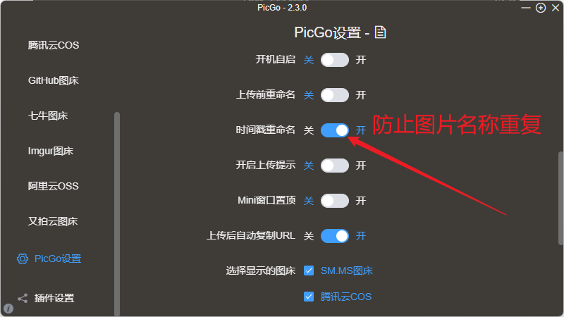

只开启 `时间戳重命名 & 开机自启`。


### typora 相关配置

设置粘贴图片时的动作，默认将其进行上传！


高级设置中，

```json
"flags": [
    [
        "proxy-server",
        // "socks5://127.0.0.1:10808"
        "http://127.0.0.1:7890"
    ]
]
```


# 坚果云

> User: blainet/blxie@outlook.com
>
> - [我的坚果云 - 坚果云 - 云盘|网盘|企业网盘|同步|备份|无限空间|免费网络硬盘|企业云盘](https://www.jianguoyun.com/d/home#/safety)
> - [Notability如何与坚果云进行连接自动备份？ | 坚果云帮助中心](https://help.jianguoyun.com/?p=3731)
> - [(1 封私信 / 20 条消息) 如何恰当地使用 Notability？ - 知乎](https://www.zhihu.com/question/291326958/answer/864811325)

```
https://dav.jianguoyun.com/dav/
awjrnmh7yuxiznec
```

以后可以随意使用，


# JetBrains

## Java IDEA

> - https://www.quanxiaoha.com/idea-pojie/idea-pojie-202232.html

直接使用脚本进行一键激活。


根据 `Settings` 里面的分类进行划分。

运行时，如果使用右键里面的运行选项，会产生很多相同的运行启动配置文件！第一次启动时可以这样启动，但是之后如果想要再次运行，直接点击右上角的已经创建好的启动程序来运行！或者直接点击 main 前面的运行按钮！


### Editor 相关设置

> > Requirement：关闭拼写检查
>
> 直接将 `proofreading` 全部关闭即可！`File --> Settings --> Editor --> Inspections`
>
> 注意：这里要将 `Profile` 修改为 `IDE`，否则只对当前项目生效！！！
>
> 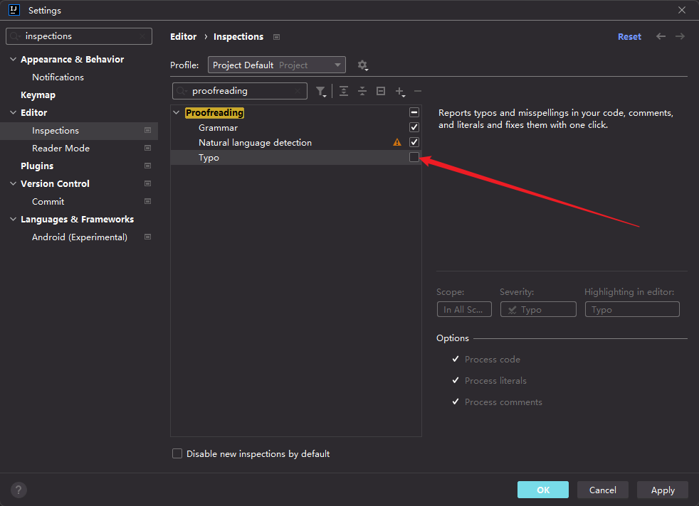
>
> 如果以上操作还是不起作用，直接在 `settings` 里面搜索 `Typo`，然后找到 `proofreading` 将其 `Typo` 取消勾选即可！


> 展开所有的包，包括空包！
>
> 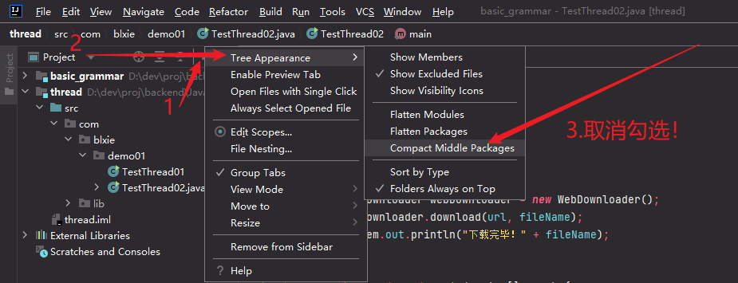


> > R：修改默认的单行注释格式 [idea修改默认的单行注释格式_huangxy1994的博客-CSDN博客_idea 单行注释](https://blog.csdn.net/hxy199421/article/details/81365970)
>
> `Editor --> Code Style --> Java --> Code Generation --> Comment Code`
>
> 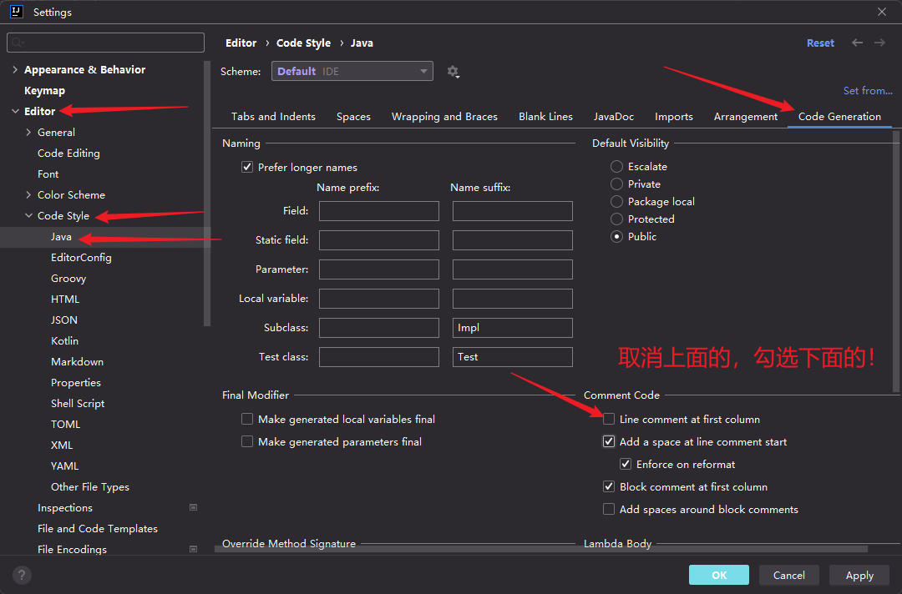


### 快捷操作

#### 编写代码

- `20.for  // 快速创建 for 循环语句`

- 快速创建一个 `class`，`com.blxie.demo01.TestThread`，这样就不用手动创建包啦！

- `alt insert` 快速创建模板方法！（构造方法，实现接口等）

  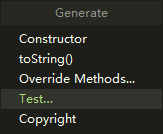

- `xxx.sout` 直接用 `System.out.println(xxx)` 自动补全


#### 编辑器本身

> - [Intellij IDEA 代码格式化/保存时自动格式化 - 零柒夭夭 - 博客园](https://www.cnblogs.com/lqyy/p/9398467.html) 好像有点问题！


> > R：修改默认的操作风格！
>
> 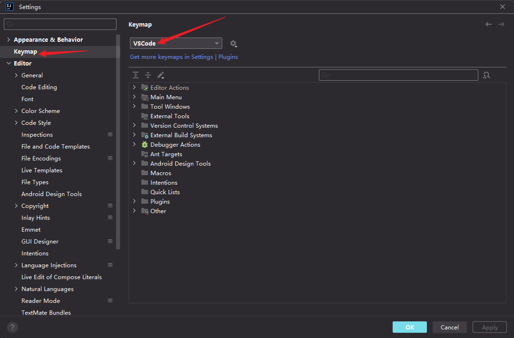


> > R：格式化代码
>
> 安装 `google-java-format` 插件！然后重启 `IDEA`（这样才能在设置里看到这个设置选项），进行以下设置！
>
> 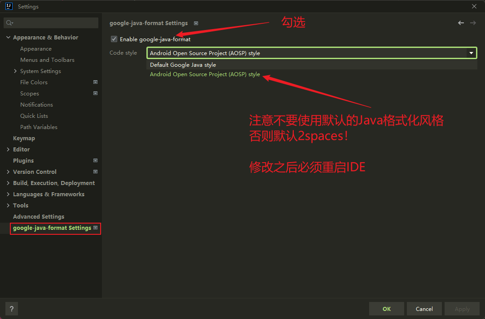
>
> 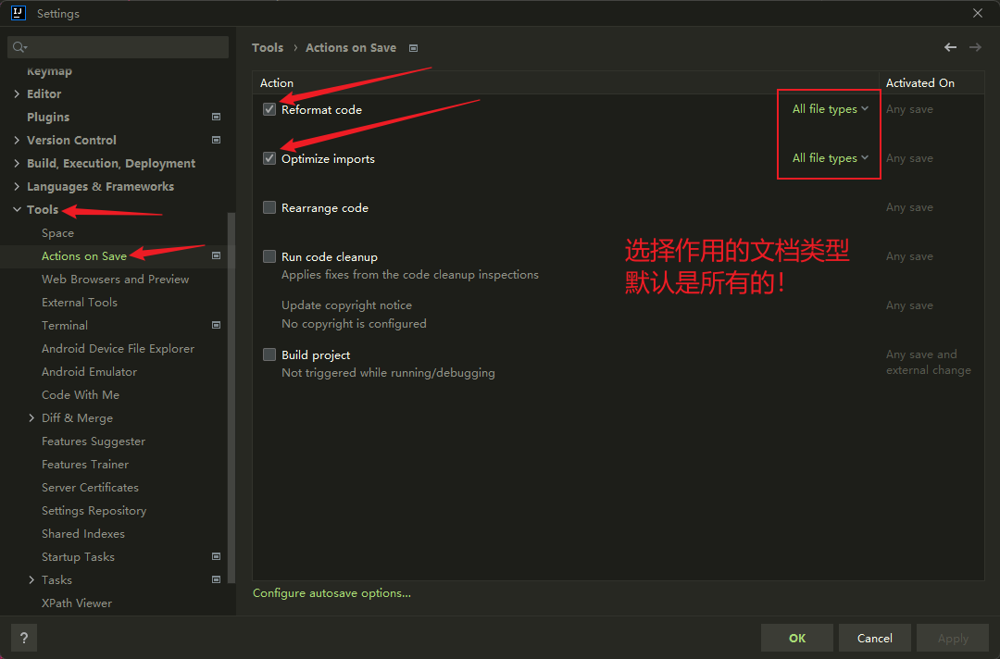
>
>
>
> 这个时候直接使用有问题，会报以下错误！
>
> ```java
> java.util.concurrent.ExecutionException: java.lang.IllegalAccessError: class com.google.googlejavaformat.java.JavaInput (in unnamed module @0x78c658b0) cannot access class com.sun.tools.javac.parser.Tokens$TokenKind (in module jdk.compiler) because module jdk.compiler does not export com.sun.tools.javac.parser to unnamed module
> ```
>
> 解决方法：[java.lang.IllegalAccessError: class com.google.googlejavaformat.java.JavaInput · Issue #787 · google/google-java-format](https://github.com/google/google-java-format/issues/787)
>
> `IDEA --> Help --> Edit Custom VM Options`，追加以下参数设置，
>
> ```bash
> --add-exports=jdk.compiler/com.sun.tools.javac.api=ALL-UNNAMED
> --add-exports=jdk.compiler/com.sun.tools.javac.file=ALL-UNNAMED
> --add-exports=jdk.compiler/com.sun.tools.javac.main=ALL-UNNAMED
> --add-exports=jdk.compiler/com.sun.tools.javac.model=ALL-UNNAMED
> --add-exports=jdk.compiler/com.sun.tools.javac.parser=ALL-UNNAMED
> --add-exports=jdk.compiler/com.sun.tools.javac.processing=ALL-UNNAMED
> --add-exports=jdk.compiler/com.sun.tools.javac.tree=ALL-UNNAMED
> --add-exports=jdk.compiler/com.sun.tools.javac.util=ALL-UNNAMED
> --add-opens=jdk.compiler/com.sun.tools.javac.code=ALL-UNNAMED
> --add-opens=jdk.compiler/com.sun.tools.javac.comp=ALL-UNNAMED
> ```
>
> 保存，重启 `IDEA` 即可生效！


> > R：修改编辑器主题
>
> 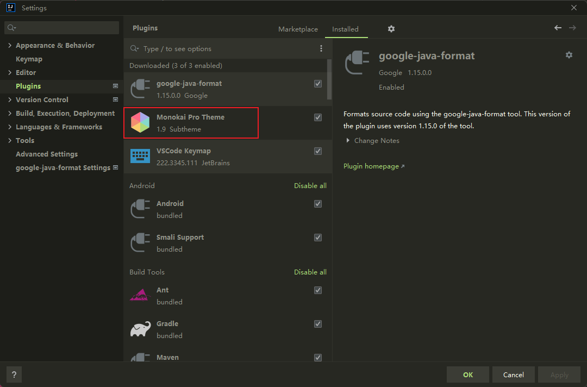
>
> 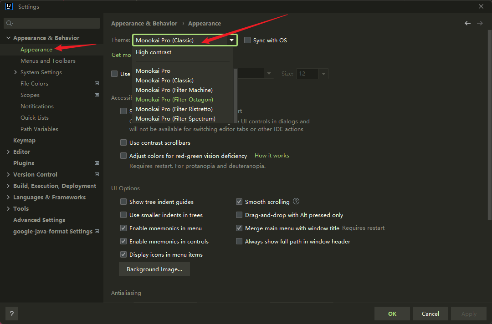


> > 禁用 shift-shift search everywhere
>
> 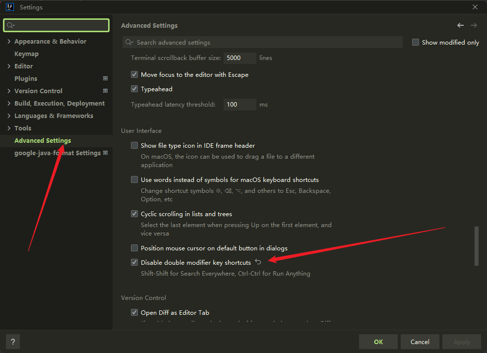


### 快捷键（将快捷布局更改为 VSCode 之后）

- `Ctrl .` 快速进行对象实例的命名，同时可以快速调整代码，修改错误或者警告的代码片段！
- `Ctrl 鼠标左键类名` 打开类的定义，如果有多个构造方法，会显示出多个构造方法列表
- `Ctrl Alt T` 对选中的代码块选择对应的**包裹语句**进行包裹


# VS/VS Code

> - [如何将 Visual Studio的快捷键设置和vscode一致_vscode和visualstudio快捷键一样](https://blog.csdn.net/weixin_44560698/article/details/119035398)


## 配置文件

### snippets

文件注释自定义代码片段，提示名称为 `ano`，

```json
"Print to js method": {
    "prefix": "ano",
    "body": [
        "/**",
        " * @author: blainet",
        " * @date: ${CURRENT_YEAR}-${CURRENT_MONTH}-${CURRENT_DATE} ${CURRENT_HOUR}:${CURRENT_MINUTE}:${CURRENT_SECOND}",
        " * @ref: ",
        " * @brief: $0",
        " * @version: ",
        " */"
    ],
    "description": "module function;"
}
```

文件中最开始使用 `ano` 即可有提示。


### keyboard

> - [Visual Studio Code Key Bindings](https://code.visualstudio.com/docs/getstarted/keybindings)

```json
{
    "key": "ctrl+alt+shift+f",
    "command": "editor.actions.findWithArgs",
    "when": "editorFocus",
    "args": {
        // 删除超过 3 条空白行
        "searchString": "(?:\\n\\s*){3,}(\\n\\s*)",
        "replaceString": "$1",
        "isRegex": true,
        "matchCase": true,
        "preserveCase": false,
        "isWholeWord": false,
        "selectionBehavior": "replaceAll",
        "focusResults": true,
        "triggerSearch": true
    }
},
```


## 编辑

- `Ctrl X` 或者 `Ctrl Shift K`  剪切当前行
- `Ctrl Shift W`  选中单词
- `Ctrl Shift I`  在打开的文件中选中所有相同的单词
- `Alt Shift 鼠标左键`  光标呈一列；`Alt 鼠标左键`  取消指定行的光标
- `Alt 左右箭头`  递归返回上次浏览的地方
- `Ctrl enter`  当前光标所在行的下面创建新的一行
- `Ctrl Shift Enter`  当前光标所在行的上一行创建新的一行
- `Ctrl 左右箭头`  跳转到单词的开头/末尾，结合 `Ctrl Shift 左右箭头` 以及 `Ctrl Shift 鼠标左键` 进行批量操作
- `Ctrl D`  选中当前单词，并依次跳转到文件中选中的单词
- `Ctrl P` 搜索当前 Workspace 中的文件
- `F2`  即使未全选，也可直接修改名称
- `F12`  转到定义处

- 对所选单词大小写转换快捷键编辑：`ctrl shift p` open keyboard shortcus(JSON)

- [VSCode折叠函数的快捷键 - 简书](https://www.jianshu.com/p/6a12c5db54c0) `Ctrl K, 0` 折叠，`Ctrl, K+J/N` 展开所有/第 n-th函数

```json
// Place your key bindings in this file to override the defaults
[
    {
        "key": "ctrl+shift+u",
        "command": "editor.action.transformToUppercase",
        "when": "editorTextFocus"
    },
    {
        "key": "ctrl+shift+l",
        "command": "editor.action.transformToLowercase",
        "when": "editorTextFocus"
    },
]
```

- 控制每行的长度：[vsCode中如何根据屏幕宽度自动换行_vscode 行宽](https://blog.csdn.net/weixin_42689147/article/details/87366004)

```json
editor.wordWrap: on  # 启用文本折行
```

> 如果打开的文件很多，上方活动栏显示不完全时，可以将鼠标停留在该栏，然后使用鼠标滚轮实现文件的快速浏览查找，而不必使用鼠标拖拉选项条。


- 格式化，设置默认的最大字符长度为 179，

  ```json
  "python.formatting.yapfArgs": ["--style", "{column_limit: 179}"]
  ```

  *function or class* 参数列表 最后不加 `,` 这样方便显示！

  内部调用 *function or class* 的地方，参数列表最后加上 一个逗号，方便格式化显示，也不用太长不方便看！

  > 每一个功能语句块之间都要用空格分隔开！


## 运行

## Run Without Debuging

如果直接在终端中输入上一次的执行命令，提示：

```bash
ConnectionRefusedError: [WinError 10061] 由于目标计算机积极拒绝，无法连接。
```

这是由于上次运行带了一个进程号的，当程序运行结束后，该进程进不存在了，自然无法使用上一次指定的进程号。


## 调试

### C++

> - [VS Code之C/C++程序的调试(Debug)功能简介 - 知乎](https://zhuanlan.zhihu.com/p/85273055)

先删除所有的 `.vscode/*`，然后添加新的配置，

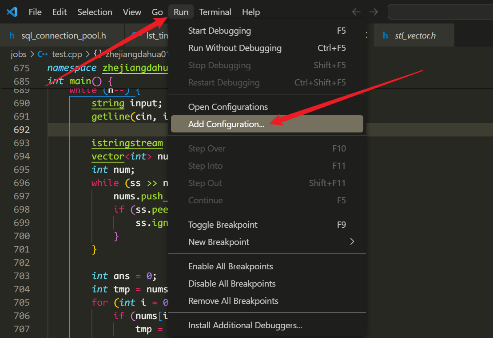

在 `.vscode/launch.json` 的 `configurations` 配置下直接输入 `gdb`，会自动补全配置信息，

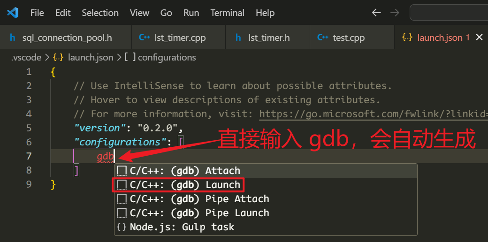

运行调试，

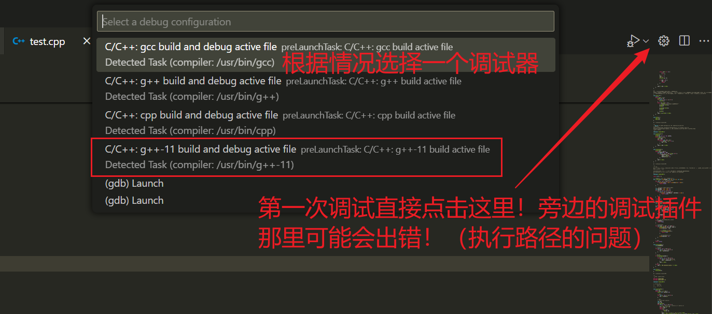

默认生成的可执行文件名称为 `filename`，因此如果为中文名称可能会报错，导致无法执行调试！

每次修改代码之后都会重新生成 可执行文件，然后会打开一个新的终端进程用于调试。


### Jupyter

- 调试的快捷键为：`ctrl shift alt enter`
- 如果跨越不同的 `cell` 进行调试，目前还不能进入，查看不到具体的细节；但是如果是单独的文件，可以通过调试进入。


### 普通文本模式下的调试

> - [VScode 配置指定调试器的当前工作目录_Better Bench的博客-CSDN博客_vscode 指定工作目录](https://blog.csdn.net/weixin_43935696/article/details/111396096)
> - [python - 在 VS Code 中设置多个 PYTHONPATH _个人文章 - SegmentFault 思否](https://segmentfault.com/a/1190000021046003)
> - [windows下VScode修改PYTHONPATH变量方便导入模块_nie_wq的博客-CSDN博客](https://blog.csdn.net/qq_31654025/article/details/109474175)


`.vscode/launch.json` ,

```json
{
    // Use IntelliSense to learn about possible attributes.
    // Hover to view descriptions of existing attributes.
    // For more information, visit: https://go.microsoft.com/fwlink/?linkid=830387
    "version": "0.2.0",
    "configurations": [
        {
            "name": "TEST",
            "type": "python",
            "request": "launch",
            // https://blog.csdn.net/weixin_43935696/article/details/111396096
            "cwd": "${workspaceFolder}/experiments/siammask_sharp",  // 配置指定调试器的当前工作目录，默认为 ${proj_dir/workspaceFolder}
            "program": "../../tools/demo.py",  // 程序入口相对于当前工作目录的路径！
            "console": "integratedTerminal",
            "justMyCode": true,
            "args": [
                "--resume",
                "SiamMask_DAVIS.pth",  // 相对于当前工作目录的路径！
                "--config",
                "config_davis.json"  // 相对于当前工作目录的路径！
            ],
            "env": {
                // 配置当前调试器的环境变量
                // https://segmentfault.com/a/1190000021046003
                // https://blog.csdn.net/qq_31654025/article/details/109474175
                // "PYTHONPATH": "${workspaceFolder}:/home/guest/XieBailian/proj/SiamMask",  // 多个用 :(Linux)/;(Windows) 分开
                "PYTHONPATH": "${workspaceFolder}:${workspaceFolder}../../",
                "DISPLAY": "10.16.38.28:0.0",
            }
        }
    ]
}
```


（针对 Python）对于环境变量的配置，还可以这样设置，

1. `settings.json`,

   ```json
   "python.envFile": "${workspaceFolder}/.env",
   ```

2. `${PROJ_ROOT/workspaceFolder}` 创建新的文件 `.env`，在该文件中添加以下环境配置，会自动读取，

   ```shell
   PYTHONPATH = ${workspaceFolder}:${workspaceFolder}../../
   CUDA_VISIBLE_DEVICES = 1
   DISPLAY = 10.16.38.28:0.0
   ```

   > 注意：`PYTHONPATH` 中的 `:` 前后不能有空格！！！

使用这种方法的好处是，可以统一对每个调试器进行管理，不用重复在每个调试器中进行单独设置！


---


进入断点调试后，可以在 `debug console` 进行相关变量的显示等调试步骤，在这里，不能通过 `enter` 选取提示，只能通过 `tab` 选择。如果需要换行，比如：

```python
for x in x:
    print(x.shape)
torch.Size([1, 256, 192, 336])
torch.Size([1, 256, 96, 168])
torch.Size([1, 256, 48, 84])
torch.Size([1, 256, 24, 42])
torch.Size([1, 256, 12, 21])
```

换行使用 `shift enter`。

在 `CALL STACK` 栏里可以看到具体的调用流程，在调试的时候如果选择某一个 `STACK`，会直接进入到调用处，这时就可以打印该调用处中的变量的值等状态信息，直接点击最顶层的 `STACK`，会回到最终的断点处。

> 小细节：当前调试所在的代码行为$\color{yellow}{黄色}$，指定到某一个 `STACK` 为 $\color{green}{绿色}$。

- [简书中markdown改变字体颜色及字体居中效果的实现 - 简书 (jianshu.com)](https://www.jianshu.com/p/6b717986cfca)


## 工作区


以上三个状态栏非常有帮助：

- watch: 常用于查看模块的整体结构。
- call stack: 常用于调试的时候，查看程序运行的一个流程，模块之间是如何进行调用的。这里有一个小细节，如果运行的是多线程或者多进程程序，如果设置的断点停留在了某一个 子线程/子进程，这里可以回溯到 main thread，查看具体的调用情况。
- breakpoints: 非常有用，设置的断点可以保留，如果不需要让这个断点生效，只需要取消勾选即可，用于保存调试的状态，方便之后的调试。当然，还可以在设置的断点处设置相应的条件，满足该条件以后就停止运行。

原本还有一个 variables 状态栏，这里不写的原因是，个人习惯在 debug console 中进行变量的追踪、查询，如果要具体查看某一个变量的值，在当前调试的文件中，鼠标放在上面也可以看到（不太友好的是，有的时候鼠标偏离后就没办法查看到变量的状态了，和 PyCharm 的调试功能还是有差距的，PyCharm 调试后直接在当前行末显示变量的状态信息，非常友好）。


## 个性化

- [Base16 Terminal Colors for Visual Studio Code (glitchbone.github.io)](https://glitchbone.github.io/vscode-base16-term/#/monokai) 终端主题修改

- https://blog.csdn.net/qq_33404590/article/details/107822102 不推荐，color theme 修改的时候终端无法同步。

- 主题：GitHub Themes

- [VSCode使用技巧(二)——调整终端控制台字体大小_vscode终端字体大小-CSDN博客](https://blog.csdn.net/it_rensheng/article/details/121030035)


## Git

```bash
Unable to watch for file changes in this large workspace folder. Please follow the instructions link to resolve this issue.
```

> 参考链接：https://blog.csdn.net/davidhopper/article/details/79620425

出现的原因是 监控的文件数量 的超过了 系统预设的限制。解决方法就是修改这个限制的大小，Ubuntu 下默认跟踪的文件数量为 8192，修改为 81920：

```bash
cat /proc/sys/fs/inotify/max_user_watches  # 查看限制的大小
sudo vim /etc/sysctl.conf  # 修改限制
fs.inotify.max_user_watches=81920

sudo sysctl -p  # 使配置生效
fs.inotify.max_user_watches = 81920  # 输出的效果
```


## ERROR

### Timed out after 60 seconds waiting for TensorBoard to launch

```bash
We failed to start a TensorBoard session due to the following error: Command failed: conda activate trackron && echo 'e8b39361-0157-4923-80e1-22d70d46dee6' && python /home/ji/.vscode-server/extensions/ms-python.python-2022.16.0/pythonFiles/printEnvVariables.py CommandNotFoundError: Your shell has not been properly configured to use 'conda activate'. To initialize your shell, run $ conda init <SHELL_NAME> Currently supported shells are: - bash - fish - tcsh - xonsh - zsh - powershell See 'conda init --help' for more information and options. IMPORTANT: You may need to close and restart your shell after running 'conda init'.
```

使用 VSCode 集成的 tensorboard，突然就不能运行了（升级 VSCode 之后！）。

几次升级 VSCode 之后，都出现了该问题！

> A: 解决方案

1. 升级 pip

```bash
python -m pip install --upgrade pip
```

2. 卸载原先的 tensorboard

```bash
pip uninstall $(pip list | grep tensorboard)
```

3. `ctrl shift p` 重新运行集成的 tensorboard，会默认安装缺少的依赖包，由于使用的是 conda 安装命令，所以需要等待一段时间，然后再运行即可！


如果卸载重装 `tensorboard` 没有效果，将 `Python` 插件降级！（实际有效解决方案）

至少降级到一个月之前，推荐降级到 **1 mo ago** 的版本！

> 提醒：一定要将 `Extentions: Auto Update` 取消！


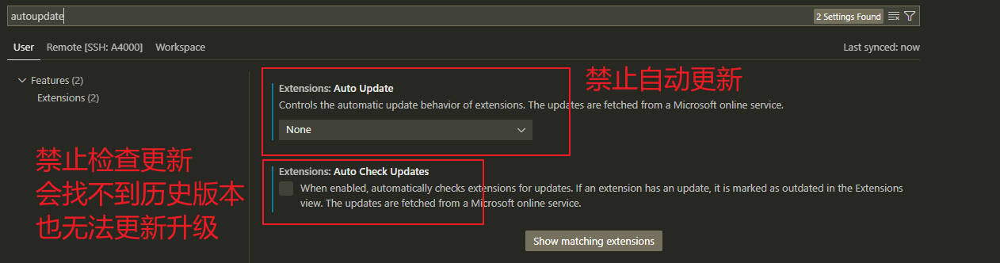


以下的图为 `Pylance`，但经过检验，实际上引起这个问题的是 `Python`，

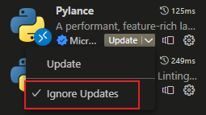

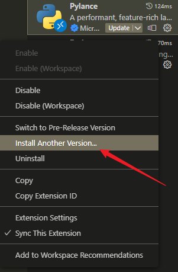

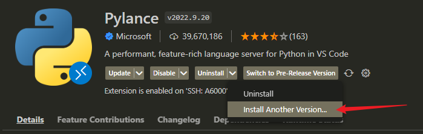


### Failed to register a ServiceWorker: The document is in an invalid state..

```
Error loading webview: Error: Could not register service workers: InvalidStateError: Failed to register a ServiceWorker: The document is in an invalid state..
```

直接重装 `VSCode`！


### 更新之后，`Pylance` 类型自动检查

不要将其开启，检查不准确！

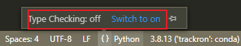


### 快捷键不生效，反应迟缓，无法输入！

> - [解决VSCode无缘无故卡顿的问题_vscode卡顿_IT搬砖攻城狮的博客-CSDN博客](https://blog.csdn.net/u011296285/article/details/121121118)
>
> 并不是远程连接或者操作系统的问题，而是 `VS Code` 软件本身的问题！

~~和其他软件快捷键冲突，将其他正在后台运行的软降退出或者关闭冲突的快捷键功能即可！~~

插件导致的，

1. 删除 `GitLen`，

2. 禁用 `Git: Autorefresh`，

   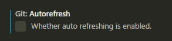

3. 删除无用的大文件，比如 `checkpoint`，


# 终端工具

## Nushell

> - [Nushell](https://www.nushell.sh/zh-CN/)
> - [Windows的终端环境配置(nushell) | BORBER](https://blog.borber.top/tech/win_nushell/)

==更新：还是优先使用 scoop 进行安装吧！==

1、下载安装，直接看官方文档，

```bash
winget install nushell -l "D:/App/Winget"
winget install nvim -l "D:/App/Winget"

# 如果有多个同名的
winget search Zig
winget install --id zig.zig -l "D:/App/Winget"
winget install --id Microsoft.PowerShell -l "D:/App/Winget"
```


2、搭配 `oh-my-posh` 使用，美化，主要就是下面的相关设置，

> - [Customize | Oh My Posh](https://ohmyposh.dev/docs/installation/customize)
> - [配置第三方提示 | Nushell](https://www.nushell.sh/zh-CN/book/3rdpartyprompts.html)
> - [Themes | Oh My Posh](https://ohmyposh.dev/docs/themes)
> - [配置 | Nushell](https://www.nushell.sh/zh-CN/book/configuration.html)

自定义配置，修改环境变量等，

```bash
echo $nu.env-path
echo $nu.config-path

alias vim = nvim
# 修改环境配置
vim $nu.env-path

## oh-my-posh theme
oh-my-posh init nu --config 'https://raw.githubusercontent.com/JanDeDobbeleer/oh-my-posh/main/themes/jandedobbeleer.omp.json'

# coding
$env.LANG = "zh_CN.UTF-8"
$env.LC_ALL = "zh_CN.UTF-8"

# 修改配置文件
vim $nu.config-path
source ~/.oh-my-posh.nu
alias vim = nvim
```


## nvim（lvim/lazyvim）

> - 主要参考这篇文章：[从零开始配置 Neovim(Nvim) - MartinLwx's Blog](https://martinlwx.github.io/zh-cn/config-neovim-from-scratch/#%E5%AE%89%E8%A3%85-nvim)
> - 上一个链接的 GitHub：[MartinLwx/dotfiles](https://github.com/MartinLwx/dotfiles/tree/main)
> - [Neovim配置——从入门到放弃 - lavateinn - 博客园](https://www.cnblogs.com/lavateinn/p/17904263.html)
> - [新手上路-LunarVim手把手安装 - 少数派](https://sspai.com/post/83898#!)，`lvim` 的安装
> - [Windows 10 系统下 Neovim 安装与配置 · Blowfish](https://jdhao.github.io/2018/11/16/neovim_configuration_windows-zh/)


查看 log 的方式，

> - [failed to install lua_ls. · Issue #214 · nvim-lua/kickstart.nvim](https://github.com/nvim-lua/kickstart.nvim/issues/214)

```bash
# 命令行模式输入
:MasonLog
```


```bash
cd ~/appdata/local
mkdir nvim/lua/config
cd nvim

vim lua/options.lua
vim lua/keymaps.lua
vim lua/plugins.lua
vim lua/colorscheme.lua
vim lua/config/nvim-cmp.lua
vim lua/lsp.lua

vim init.lua
```


### options.lua

```lua
-- Hint: use `:h <option>` to figure out the meaning if needed
vim.opt.clipboard = 'unnamedplus' -- use system clipboard
vim.opt.completeopt = { 'menu', 'menuone', 'noselect' }
vim.opt.mouse = 'a' -- allow the mouse to be used in Nvim

-- Tab
vim.opt.tabstop = 4 -- number of visual spaces per TAB
vim.opt.softtabstop = 4 -- number of spacesin tab when editing
vim.opt.shiftwidth = 4 -- insert 4 spaces on a tab
vim.opt.expandtab = true -- tabs are spaces, mainly because of python

-- UI config
vim.opt.number = true -- show absolute number
vim.opt.relativenumber = true -- add numbers to each line on the left side
vim.opt.cursorline = true -- highlight cursor line underneath the cursor horizontally
vim.opt.splitbelow = true -- open new vertical split bottom
vim.opt.splitright = true -- open new horizontal splits right
-- vim.opt.termguicolors = true        -- enabl 24-bit RGB color in the TUI
vim.opt.showmode = false -- we are experienced, wo don't need the "-- INSERT --" mode hint

-- Searching
vim.opt.incsearch = true -- search as characters are entered
vim.opt.hlsearch = false -- do not highlight matches
vim.opt.ignorecase = true -- ignore case in searches by default
vim.opt.smartcase = true -- but make it case sensitive if an uppercase is entered

```


### keymaps.lua

```lua
-- define common options
local opts = {
    noremap = true,      -- non-recursive
    silent = true,       -- do not show message
}

-----------------
-- Normal mode --
-----------------

-- Hint: see `:h vim.map.set()`
-- Better window navigation
vim.keymap.set('n', '<C-h>', '<C-w>h', opts)
vim.keymap.set('n', '<C-j>', '<C-w>j', opts)
vim.keymap.set('n', '<C-k>', '<C-w>k', opts)
vim.keymap.set('n', '<C-l>', '<C-w>l', opts)

-- Resize with arrows
-- delta: 2 lines
vim.keymap.set('n', '<C-Up>', ':resize -2<CR>', opts)
vim.keymap.set('n', '<C-Down>', ':resize +2<CR>', opts)
vim.keymap.set('n', '<C-Left>', ':vertical resize -2<CR>', opts)
vim.keymap.set('n', '<C-Right>', ':vertical resize +2<CR>', opts)

-----------------
-- Visual mode --
-----------------

-- Hint: start visual mode with the same area as the previous area and the same mode
vim.keymap.set('v', '<', '<gv', opts)
vim.keymap.set('v', '>', '>gv', opts)

```


### plugins.lua

```lua
local lazypath = vim.fn.stdpath("data") .. "/lazy/lazy.nvim"
if not (vim.uv or vim.loop).fs_stat(lazypath) then
  vim.fn.system({
    "git",
    "clone",
    "--filter=blob:none",
    "https://github.com/folke/lazy.nvim.git",
    "--branch=stable", -- latest stable release
    lazypath,
  })
end
vim.opt.rtp:prepend(lazypath)

require("lazy").setup({
    "tanvirtin/monokai.nvim",
    -- Vscode-like pictograms
	{
		"onsails/lspkind.nvim",
		event = { "VimEnter" },
	},
	-- Auto-completion engine
	{
		"hrsh7th/nvim-cmp",
		dependencies = {
			"lspkind.nvim",
			"hrsh7th/cmp-nvim-lsp", -- lsp auto-completion
			"hrsh7th/cmp-buffer", -- buffer auto-completion
			"hrsh7th/cmp-path", -- path auto-completion
			"hrsh7th/cmp-cmdline", -- cmdline auto-completion
		},
		config = function()
			require("config.nvim-cmp")
		end,
	},
	-- Code snippet engine
	{
		"L3MON4D3/LuaSnip",
		version = "v2.*",
	},
    -- LSP manager
	"williamboman/mason.nvim",
	"williamboman/mason-lspconfig.nvim",
	"neovim/nvim-lspconfig",
})
```


### colorscheme.lua

```lua
-- define your colorscheme here
local colorscheme = 'monokai_pro'

local is_ok, _ = pcall(vim.cmd, "colorscheme " .. colorscheme)
if not is_ok then
    vim.notify('colorscheme ' .. colorscheme .. ' not found!')
    return
end
```


### nvim-cmp.lua

```lua
local has_words_before = function()
    unpack = unpack or table.unpack
    local line, col = unpack(vim.api.nvim_win_get_cursor(0))
    return col ~= 0 and vim.api.nvim_buf_get_lines(0, line - 1, line, true)[1]:sub(col, col):match("%s") == nil
end

local luasnip = require("luasnip")
local cmp = require("cmp")

cmp.setup({
    snippet = {
        -- REQUIRED - you must specify a snippet engine
        expand = function(args)
            require('luasnip').lsp_expand(args.body) -- For `luasnip` users.
        end,
    },
    mapping = cmp.mapping.preset.insert({
        -- Use <C-b/f> to scroll the docs
        ['<C-b>'] = cmp.mapping.scroll_docs( -4),
        ['<C-f>'] = cmp.mapping.scroll_docs(4),
        -- Use <C-k/j> to switch in items
        ['<C-k>'] = cmp.mapping.select_prev_item(),
        ['<C-j>'] = cmp.mapping.select_next_item(),
        -- Use <CR>(Enter) to confirm selection
        -- Accept currently selected item. Set `select` to `false` to only confirm explicitly selected items.
        ['<CR>'] = cmp.mapping.confirm({ select = true }),

        -- A super tab
        -- sourc: https://github.com/hrsh7th/nvim-cmp/wiki/Example-mappings#luasnip
        ["<Tab>"] = cmp.mapping(function(fallback)
            -- Hint: if the completion menu is visible select next one
            if cmp.visible() then
                cmp.select_next_item()
            elseif has_words_before() then
                cmp.complete()
            else
                fallback()
            end
        end, { "i", "s" }), -- i - insert mode; s - select mode
        ["<S-Tab>"] = cmp.mapping(function(fallback)
            if cmp.visible() then
                cmp.select_prev_item()
            elseif luasnip.jumpable( -1) then
                luasnip.jump( -1)
            else
                fallback()
            end
        end, { "i", "s" }),
    }),

  -- Let's configure the item's appearance
  -- source: https://github.com/hrsh7th/nvim-cmp/wiki/Menu-Appearance
  formatting = {
      -- Set order from left to right
      -- kind: single letter indicating the type of completion
      -- abbr: abbreviation of "word"; when not empty it is used in the menu instead of "word"
      -- menu: extra text for the popup menu, displayed after "word" or "abbr"
      fields = { 'abbr', 'menu' },

      -- customize the appearance of the completion menu
      format = function(entry, vim_item)
          vim_item.menu = ({
              nvim_lsp = '[Lsp]',
              luasnip = '[Luasnip]',
              buffer = '[File]',
              path = '[Path]',
          })[entry.source.name]
          return vim_item
      end,
  },

  -- Set source precedence
  sources = cmp.config.sources({
    { name = 'nvim_lsp' },    -- For nvim-lsp
    { name = 'luasnip' },     -- For luasnip user
    { name = 'buffer' },      -- For buffer word completion
    { name = 'path' },        -- For path completion
  })
})
```


### lsp.lua

```lua
require('mason').setup({
    ui = {
        icons = {
            package_installed = "✓",
            package_pending = "➜",
            package_uninstalled = "✗"
        }
    }
})

require('mason-lspconfig').setup({
    -- A list of servers to automatically install if they're not already installed
    ensure_installed = { 'pylsp', 'lua_ls', 'rust_analyzer'},
})

-- Set different settings for different languages' LSP
-- LSP list: https://github.com/neovim/nvim-lspconfig/blob/master/doc/server_configurations.md
-- How to use setup({}): https://github.com/neovim/nvim-lspconfig/wiki/Understanding-setup-%7B%7D
--     - the settings table is sent to the LSP
--     - on_attach: a lua callback function to run after LSP atteches to a given buffer
local lspconfig = require('lspconfig')

-- Customized on_attach function
-- See `:help vim.diagnostic.*` for documentation on any of the below functions
local opts = { noremap = true, silent = true }
vim.keymap.set('n', '<space>e', vim.diagnostic.open_float, opts)
vim.keymap.set('n', '[d', vim.diagnostic.goto_prev, opts)
vim.keymap.set('n', ']d', vim.diagnostic.goto_next, opts)
vim.keymap.set('n', '<space>q', vim.diagnostic.setloclist, opts)

-- Use an on_attach function to only map the following keys
-- after the language server attaches to the current buffer
local on_attach = function(client, bufnr)
    -- Enable completion triggered by <c-x><c-o>
    vim.api.nvim_buf_set_option(bufnr, 'omnifunc', 'v:lua.vim.lsp.omnifunc')

    -- See `:help vim.lsp.*` for documentation on any of the below functions
    local bufopts = { noremap = true, silent = true, buffer = bufnr }
    vim.keymap.set('n', 'gD', vim.lsp.buf.declaration, bufopts)
    vim.keymap.set('n', 'gd', vim.lsp.buf.definition, bufopts)
    vim.keymap.set('n', 'K', vim.lsp.buf.hover, bufopts)
    vim.keymap.set('n', 'gi', vim.lsp.buf.implementation, bufopts)
    vim.keymap.set('n', '<C-k>', vim.lsp.buf.signature_help, bufopts)
    vim.keymap.set('n', '<space>wa', vim.lsp.buf.add_workspace_folder, bufopts)
    vim.keymap.set('n', '<space>wr', vim.lsp.buf.remove_workspace_folder, bufopts)
    vim.keymap.set('n', '<space>wl', function()
        print(vim.inspect(vim.lsp.buf.list_workspace_folders()))
    end, bufopts)
    vim.keymap.set('n', '<space>D', vim.lsp.buf.type_definition, bufopts)
    vim.keymap.set('n', '<space>rn', vim.lsp.buf.rename, bufopts)
    vim.keymap.set('n', '<space>ca', vim.lsp.buf.code_action, bufopts)
    vim.keymap.set('n', 'gr', vim.lsp.buf.references, bufopts)
    vim.keymap.set("n", "<space>f", function()
        vim.lsp.buf.format({ async = true })
    end, bufopts)
end

-- Configure each language
-- How to add LSP for a specific language?
-- 1. use `:Mason` to install corresponding LSP
-- 2. add configuration below
lspconfig.pylsp.setup({
	on_attach = on_attach,
})
```


### init.lua

```lua
require('options')
require('keymaps')
require('plugins')
require('colorscheme')
require('lsp')
```


### 更新

> - [LunarVim/utils/installer/config_win.example.lua at rolling · LunarVim/LunarVim · GitHub](https://github.com/LunarVim/LunarVim/blob/rolling/utils/installer/config_win.example.lua)，（官方的示例 config-win.lua）修改配置文件，在 ~/AppData/Local/lvim/config.lua
> - [Neovim IDE from Scratch - Introduction (100% lua config) - YouTube](https://www.youtube.com/watch?v=ctH-a-1eUME&list=PLhoH5vyxr6Qq41NFL4GvhFp-WLd5xzIzZ)
> - [MartinLwx/dotfiles](https://github.com/MartinLwx/dotfiles/tree/main)，参考 redme 中提到的插件，只要在 plugin 中==添加 git 仓库名称==即可！

省事做法，安装 pwsh，在此基础上安装 LinarVim，基于 ps 脚本运行，

```bash
scoop search pwsh
scoop install pwsh

# lvim 安装的时候需要 make 工具，记住要在 pwsh 中运行安装命令
scoop search make
scoop install make

# 安装成功之后，使用以下命令启动 lvim，pwsh 可以直接输入 lvim
pwsh ~/local/bin/lvim.ps1

# 在 nushell 中添加 alias
vim $nu.config-path
```


~/AppData/Local/lvim/config.lua

> 所用到的插件的官方 git 仓库，
>
> - [folke/noice.nvim: 💥 Highly experimental plugin that completely replaces the UI for messages, cmdline and the popupmenu.](https://github.com/folke/noice.nvim)
> -

```lua
--[[
 THESE ARE EXAMPLE CONFIGS FEEL FREE TO CHANGE TO WHATEVER YOU WANT
 `lvim` is the global options object
]]

-- Enable powershell as your default shell
vim.opt.shell = "pwsh.exe -NoLogo"
vim.opt.shellcmdflag =
"-NoLogo -NoProfile -ExecutionPolicy RemoteSigned -Command [Console]::InputEncoding=[Console]::OutputEncoding=[System.Text.Encoding]::UTF8;"
vim.cmd [[
		let &shellredir = '2>&1 | Out-File -Encoding UTF8 %s; exit $LastExitCode'
		let &shellpipe = '2>&1 | Out-File -Encoding UTF8 %s; exit $LastExitCode'
		set shellquote= shellxquote=
  ]]

-- Set a compatible clipboard manager
vim.g.clipboard = {
  copy = {
    ["+"] = "win32yank.exe -i --crlf",
    ["*"] = "win32yank.exe -i --crlf",
  },
  paste = {
    ["+"] = "win32yank.exe -o --lf",
    ["*"] = "win32yank.exe -o --lf",
  },
}

-- general
lvim.log.level = "warn"
lvim.format_on_save = true
lvim.colorscheme = "monokai_pro"
-- to disable icons and use a minimalist setup, uncomment the following
-- lvim.use_icons = false

-- keymappings [view all the defaults by pressing <leader>Lk]
lvim.leader = "space"
-- add your own keymapping
lvim.keys.normal_mode["<C-s>"] = ":w<cr>"
-- lvim.keys.normal_mode["<S-l>"] = ":BufferLineCycleNext<CR>"
-- lvim.keys.normal_mode["<S-h>"] = ":BufferLineCyclePrev<CR>"
-- unmap a default keymapping
-- vim.keymap.del("n", "<C-Up>")
-- override a default keymapping
-- lvim.keys.normal_mode["<C-q>"] = ":q<cr>" -- or vim.keymap.set("n", "<C-q>", ":q<cr>" )

-- Change Telescope navigation to use j and k for navigation and n and p for history in both input and normal mode.
-- we use protected-mode (pcall) just in case the plugin wasn't loaded yet.
-- local _, actions = pcall(require, "telescope.actions")
-- lvim.builtin.telescope.defaults.mappings = {
--   -- for input mode
--   i = {
--     ["<C-j>"] = actions.move_selection_next,
--     ["<C-k>"] = actions.move_selection_previous,
--     ["<C-n>"] = actions.cycle_history_next,
--     ["<C-p>"] = actions.cycle_history_prev,
--   },
--   -- for normal mode
--   n = {
--     ["<C-j>"] = actions.move_selection_next,
--     ["<C-k>"] = actions.move_selection_previous,
--   },
-- }

-- Change theme settings
-- lvim.builtin.theme.options.dim_inactive = true
-- lvim.builtin.theme.options.style = "storm"

-- Use which-key to add extra bindings with the leader-key prefix
-- lvim.builtin.which_key.mappings["P"] = { "<cmd>Telescope projects<CR>", "Projects" }
-- lvim.builtin.which_key.mappings["t"] = {
--   name = "+Trouble",
--   r = { "<cmd>Trouble lsp_references<cr>", "References" },
--   f = { "<cmd>Trouble lsp_definitions<cr>", "Definitions" },
--   d = { "<cmd>Trouble document_diagnostics<cr>", "Diagnostics" },
--   q = { "<cmd>Trouble quickfix<cr>", "QuickFix" },
--   l = { "<cmd>Trouble loclist<cr>", "LocationList" },
--   w = { "<cmd>Trouble workspace_diagnostics<cr>", "Workspace Diagnostics" },
-- }

-- After changing plugin config exit and reopen LunarVim, Run :PackerInstall :PackerCompile
lvim.builtin.alpha.active = true
lvim.builtin.alpha.mode = "dashboard"
lvim.builtin.terminal.active = false
-- lvim.builtin.terminal.shell = "pwsh.exe -NoLogo"

-- nvim-tree has some performance issues on windows, see kyazdani42/nvim-tree.lua#549
lvim.builtin.nvimtree.setup.diagnostics.enable = nil
lvim.builtin.nvimtree.setup.filters.custom = nil
lvim.builtin.nvimtree.setup.git.enable = nil
lvim.builtin.nvimtree.setup.update_cwd = nil
lvim.builtin.nvimtree.setup.update_focused_file.update_cwd = nil
lvim.builtin.nvimtree.setup.view.side = "left"
lvim.builtin.nvimtree.setup.renderer.highlight_git = nil
lvim.builtin.nvimtree.setup.renderer.icons.show.git = nil

-- if you don't want all the parsers change this to a table of the ones you want
lvim.builtin.treesitter.ensure_installed = {
  "c",
  "lua",
}

lvim.builtin.treesitter.ignore_install = { "haskell" }
lvim.builtin.treesitter.highlight.enable = true

-- generic LSP settings

-- -- make sure server will always be installed even if the server is in skipped_servers list
-- lvim.lsp.installer.setup.ensure_installed = {
--     "sumneko_lua",
--     "jsonls",
-- }
-- -- change UI setting of `LspInstallInfo`
-- -- see <https://github.com/williamboman/nvim-lsp-installer#default-configuration>
-- lvim.lsp.installer.setup.ui.check_outdated_servers_on_open = false
-- lvim.lsp.installer.setup.ui.border = "rounded"
-- lvim.lsp.installer.setup.ui.keymaps = {
--     uninstall_server = "d",
--     toggle_server_expand = "o",
-- }

-- ---@usage disable automatic installation of servers
-- lvim.lsp.installer.setup.automatic_installation = false

-- ---configure a server manually. !!Requires `:LvimCacheReset` to take effect!!
-- ---see the full default list `:lua print(vim.inspect(lvim.lsp.automatic_configuration.skipped_servers))`
-- vim.list_extend(lvim.lsp.automatic_configuration.skipped_servers, { "pyright" })
-- local opts = {} -- check the lspconfig documentation for a list of all possible options
-- require("lvim.lsp.manager").setup("pyright", opts)

-- ---remove a server from the skipped list, e.g. eslint, or emmet_ls. !!Requires `:LvimCacheReset` to take effect!!
-- ---`:LvimInfo` lists which server(s) are skipped for the current filetype
-- lvim.lsp.automatic_configuration.skipped_servers = vim.tbl_filter(function(server)
--   return server ~= "emmet_ls"
-- end, lvim.lsp.automatic_configuration.skipped_servers)

-- -- you can set a custom on_attach function that will be used for all the language servers
-- -- See <https://github.com/neovim/nvim-lspconfig#keybindings-and-completion>
-- lvim.lsp.on_attach_callback = function(client, bufnr)
--   local function buf_set_option(...)
--     vim.api.nvim_buf_set_option(bufnr, ...)
--   end
--   --Enable completion triggered by <c-x><c-o>
--   buf_set_option("omnifunc", "v:lua.vim.lsp.omnifunc")
-- end

-- -- set a formatter, this will override the language server formatting capabilities (if it exists)
-- local formatters = require "lvim.lsp.null-ls.formatters"
-- formatters.setup {
--   { command = "black", filetypes = { "python" } },
--   { command = "isort", filetypes = { "python" } },
--   {
--     -- each formatter accepts a list of options identical to https://github.com/jose-elias-alvarez/null-ls.nvim/blob/main/doc/BUILTINS.md#Configuration
--     command = "prettier",
--     ---@usage arguments to pass to the formatter
--     -- these cannot contain whitespaces, options such as `--line-width 80` become either `{'--line-width', '80'}` or `{'--line-width=80'}`
--     extra_args = { "--print-with", "100" },
--     ---@usage specify which filetypes to enable. By default a providers will attach to all the filetypes it supports.
--     filetypes = { "typescript", "typescriptreact" },
--   },
-- }

-- -- set additional linters
-- local linters = require "lvim.lsp.null-ls.linters"
-- linters.setup {
--   { command = "flake8", filetypes = { "python" } },
--   {
--     -- each linter accepts a list of options identical to https://github.com/jose-elias-alvarez/null-ls.nvim/blob/main/doc/BUILTINS.md#Configuration
--     command = "shellcheck",
--     ---@usage arguments to pass to the formatter
--     -- these cannot contain whitespaces, options such as `--line-width 80` become either `{'--line-width', '80'}` or `{'--line-width=80'}`
--     extra_args = { "--severity", "warning" },
--   },
--   {
--     command = "codespell",
--     ---@usage specify which filetypes to enable. By default a providers will attach to all the filetypes it supports.
--     filetypes = { "javascript", "python" },
--   },
-- }

-- Additional Plugins
lvim.plugins = {
  {
    "folke/trouble.nvim",
    cmd = "TroubleToggle",
  },
  { "sainnhe/sonokai" },
  { "tanvirtin/monokai.nvim" },
  -- lazy.nvim
  {
    "folke/noice.nvim",
    event = "VeryLazy",
    opts = {
      -- add any options here
    },
    dependencies = {
      -- if you lazy-load any plugin below, make sure to add proper `module="..."` entries
      "MunifTanjim/nui.nvim",
      -- OPTIONAL:
      --   `nvim-notify` is only needed, if you want to use the notification view.
      --   If not available, we use `mini` as the fallback
      "rcarriga/nvim-notify",
    }
  }
}

-- Autocommands (https://neovim.io/doc/user/autocmd.html)
-- vim.api.nvim_create_autocmd("BufEnter", {
--   pattern = { "*.json", "*.jsonc" },
--   -- enable wrap mode for json files only
--   command = "setlocal wrap",
-- })
-- vim.api.nvim_create_autocmd("FileType", {
--   pattern = "zsh",
--   callback = function()
--     -- let treesitter use bash highlight for zsh files as well
--     require("nvim-treesitter.highlight").attach(0, "bash")
--   end,
-- })

-- relative number
vim.opt.relativenumber = true
```

