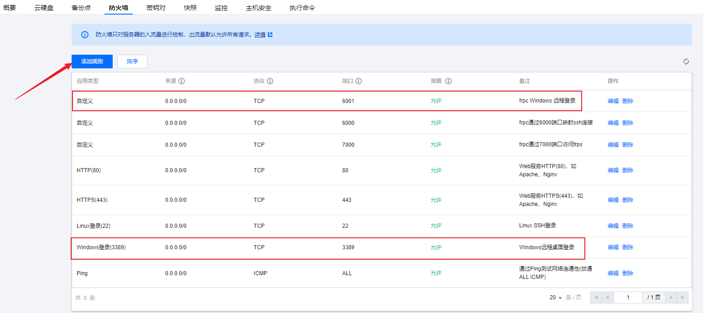
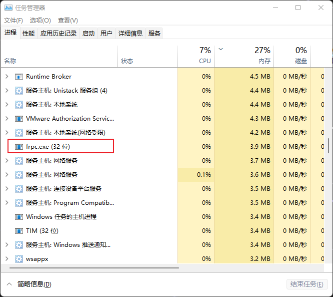
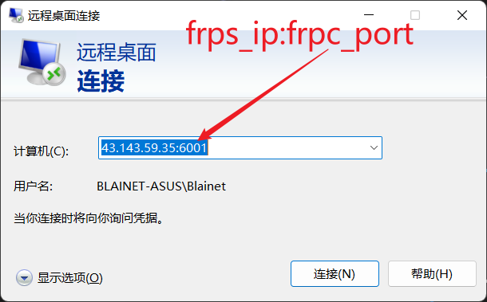

# frp

github: [Releases · fatedier/frp](https://github.com/fatedier/frp/releases)

docs: [文档 | frp

- 重点：[[使用 systemd | frp](https://gofrp.org/zh-cn/docs/setup/systemd/)](https://gofrp.org/docs/)


## 安装

> [使用 systemd | frp](https://gofrp.org/docs/setup/systemd/)

这个示例将会演示在 Linux 系统下使用 systemd 控制 frps 及配置开机自启。


在 Linux 系统下，使用`systemd` 可以方便地控制 frp 服务端 `frps` 的启动和停止、配置后台运行和开启自启。

要使用 `systemd` 来控制 `frps`，需要先安装 `systemd`，然后在 `/etc/systemd/system` 目录下创建一个 `frps.service` 文件。

> 注意：较低版本的是有这些文件的，在 `FRPS_ROOT/systemd` 目录下！
>
> `frpc` 配置部署过程同理！

1. 如Linux服务端上没有安装 `systemd`，可以使用 `yum` 或 `apt` 等命令安装 `systemd`。

   ```bash
   # yum
   yum install systemd
   # apt
   apt install systemd
   ```

2. 使用文本编辑器，如 `vim` 创建并编辑 `frps.service` 文件。

   ```bash
   vim /etc/systemd/system/frps.service
   ```

   写入内容

   ```ini
   [Unit]
   # 服务名称，可自定义
   Description = frp server
   After = network.target syslog.target
   Wants = network.target
   
   [Service]
   Type = simple
   # 启动frps的命令，需修改为您的frps的安装路径
   ExecStart = /path/to/frps -c /path/to/frps.ini
   
   [Install]
   WantedBy = multi-user.target
   ```

3. 使用 `systemd` 命令，管理 frps。

   ```bash
   # 安装 frpc-service
   sudo cp systemd/frpc.service /etc/systemd/system/
   sudo systemctl start frpc.service
   
   systemctl status frpc.service
   sudo systemctl enable frpc.service  # 开机自启动
   
   
   # 启动frp
   systemctl start frps
   # 停止frp
   systemctl stop frps
   # 重启frp
   systemctl restart frps
   # 查看frp状态
   systemctl status frps
   ```

4. 配置 frps 开机自启。

   ```bash
   systemctl enable frps
   ```

### 服务端

这个示例通过简单配置 TCP 类型的代理让用户访问到内网的服务器。


具有公网 IP 的服务器，阿里云或腾讯云等云平台厂商购买！

在购买的机器上安装部署 `frp-server`，

在具有公网 IP 的机器上部署 frps，修改 `frps.ini` 文件，这里使用了最简化的配置，设置了 frp 服务器用户接收客户端连接的端口：

```ini
[common]
bind_port = 17000
token = traceaiserver250510.
```


开放 `frps` 端口，



### 客户端

在需要远程连接的机器上安装 `frp-client`

#### Linux

在需要被访问的内网机器上（SSH 服务通常监听在 22 端口）部署 frpc，修改 `frpc.ini` 文件，假设 frps 所在服务器的公网 IP 为 x.x.x.x

```ini
[common]
server_addr = x.x.x.x  # 修改为公网 IP 地址
server_port = 17000
token = traceaiserver250510.

[重新指定一个便于区分的名字]
type = tcp
local_ip = 127.0.0.1
local_port = 22
remote_port = 6000
```

- `local_ip` 和 `local_port` 配置为本地需要暴露到公网的服务地址和端口。

- `remote_port` 表示在 frp 服务端监听的端口，访问此端口的流量将会被转发到本地服务对应的端口。

#### Windows（不要参考下面，参考 Windows.md 中的自定义服务部分）

> - [使用frp实现windows远程桌面连接 | Ligengxin's Blog](https://blog.ligengxin.me/posts/frp-windows-remote/)
> - [bat脚本实现后台运行cmd命令_mob604756f318e7的技术博客_51CTO博客](https://blog.51cto.com/u_15127581/3366801)
> - [批处理文件 bat 后台运行 | Python 技术论坛](https://learnku.com/articles/42619)
> - [frp错误，frp报错，[ssh] start error: proxy name [ssh] is already in use_狗狗25的博客-CSDN博客_frp ssh 无法登录](https://blog.csdn.net/wzying25/article/details/105482746)
>
> Windows 下查看命令帮助文档，
>
> ```cmd
> help cmd
> help cd
> ```

配置文件基本同上，只是需要将 `local_port` 和 `remote_port` 修改一下，

```ini
[common]
server_addr = 43.143.59.35  # public IP
server_port = 17000
token = traceaiserver250510.

[ssh_win11_2508]  # 这里的名字随便起
type = tcp
local_ip = 127.0.0.1
local_port = 3389  # Windows Remote Port
remote_port = 6001  # cannot repeat! 主要就是修改这里和上面的名字部分
```


> > 创建开机自启动脚本（有点点问题，开机时启动脚本会报错！）
>
> 在 `C:\ProgramData\Microsoft\Windows\Start Menu\Programs\StartUp` 目录下创建一个 `frpc.bat/.cmd` 脚本文件，
>
> ```bat
> @echo off
> ::hide 可以简写为 h
> if "%1" == "hide" goto begin
> mshta vbscript:createobject("wscript.shell").run("%~nx0 hide",0)(window.close) && exit
> :begin
> cmd /k "cd /d D:\dev\env\frp_0.44.0_windows_386 && frpc -c frpc.ini"
> ```
>
> 双击运行即可，
>
> 
>
> > 将 `frpc` 添加到 `Windows` 服务中！具体参考 `Windows.md` 文件


## 使用

### SSH `22`

```bash
# 这里指定的 6000 端口号是在 frpc.ini 中进行配置的
ssh username@client_ip -p 6000
```

frp 会将请求 `x.x.x.x:6000` 的流量转发到内网机器的 22 端口。


### Windows Remote `3380`




## 开放 `5122` 端口远程连接校园网

网址：vpn.cqupt.edu.cn

- 第一次输入，下载 EasyConnect
- 下载安装之后，再次在浏览器中输入，登录账号，直接使用 App 登录不了

登录之后，就连接上 VPN 了，然后就是配置服务器的 ssh 连接端口，

1. `etc/ssh/sshd_config` 将一下注释取消，并添加，

   > - [SSH服务修改默认22端口或同时监听多个端口 - Licess's Blog](http://blog.licess.com/sshd_listen_address/)

   ```shell
   # 注意：可以同时开通多个监听端口
   Port 22
   Port 5122
   ```

2. 重启 `ssh` 服务，`/etc/ssh/init.d restart`，

3. 开启防火墙端口，

   > - [ubuntu如何对外开放端口?-Finclip](https://www.finclip.com/news/f/6810.html)

   ```shell
   sudo ufw status
   sudo ufw allow 5122
   sudo ufw enable
   sudo ufw reload
   
   netstat -nap | grep ssh
   sudo /etc/init.d/ssh restart
   sudo service sshd restart
   ```


### `config` 文件

> - [解决SSH自动断线，无响应的问题。 - 简书](https://www.jianshu.com/p/92d60c6c92ef)

```shell
# Read more about SSH config files: https://linux.die.net/man/5/ssh_config
# https://www.jianshu.com/p/92d60c6c92ef
## 校园网
Host A4000
    HostName 10.16.55.166
Host A6000
    Hostname 10.16.93.52
    User ji
Host RTX3090
    HostName 10.16.42.114
## 内网穿透
Host NAT-A4000
    HostName 43.143.59.35
    Port 14000
Host NAT-RTX3090
    HostName 43.143.59.35
    Port 13090
## Docker
Host D-A6000
    HostName 10.16.93.52
    User root  # 注意这的用户是：root！
    Port 8022  # 注意这里的端口为：22 --> 8022 端口映射（记得服务器 ufw 要允许 8022 端口）
## 共同配置，注意需要写在最后，如果以上配置中和下面的有重复，优先选取上面的
Host *
    User guest
    Port 5122
    IdentityFile ~/.ssh/id_rsa
    ForwardAgent yes
    ServerAliveInterval 60
    # ServerAliveCountMax 3
```


